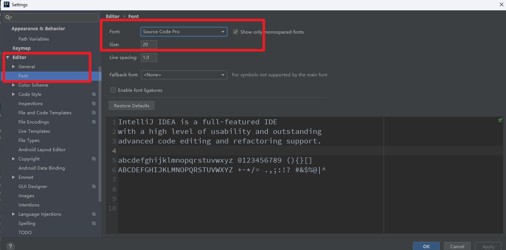
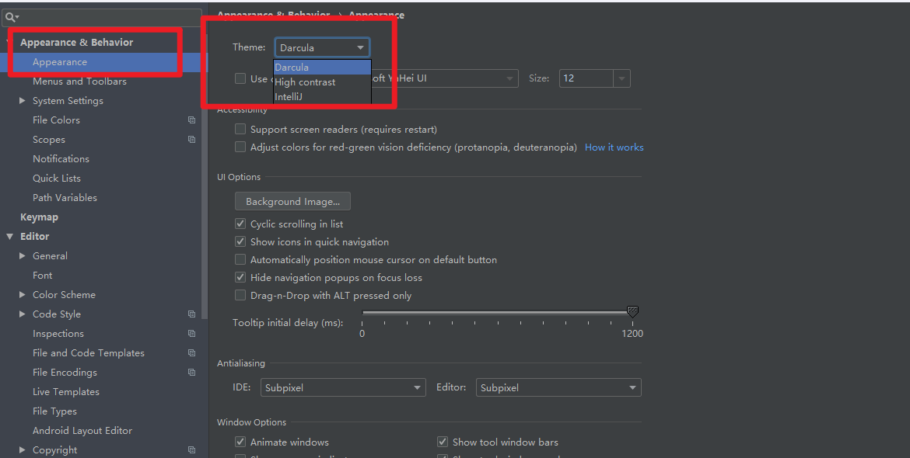

[TOC]


# IDEA下载安装破解

## IDEA介绍

IDEA 全称 IntelliJ IDEA，是Java编程语言开发的集成环境。IDEA在业界，长期被公认为最好的Java开发工具，尤其在智能代码助手、代码自动提示、重构、JavaEE支持、各类版本工具(git、svn等)、JUnit、CVS整合、代码分析、 创新的GUI设计等方面的功能可以说是具有划时代领先的。IDEA开发公司是JetBrains公司，这是一家总部位于捷克共和国的首都布拉格的公司，除了Java开发工具，该公司还涉及Python、前端等开发领域的产品，可以说是程序员必须要知道的公司之一。

IDEA本身是一个收费软件，并且版本更迭很快。在公司实际生产中，为了避免因工具版本不同带来一些额外的问题，往往都需要统一工具版本号，在这里建议大家：

<span style=color:red;background:yellow>**IDEA的版本选择，建议统一为2018.3.6！**</span>

<span style=color:red;background:yellow>**IDEA的版本选择，建议统一为2018.3.6！**</span>

<span style=color:red;background:yellow>**IDEA的版本选择，建议统一为2018.3.6！**</span>

注：

并不是说其它版本不能用，统一工具版本是出于统一环境、避免环境差异引发问题而考虑的。工作后可以根据公司的实际要求做出调整，但是不管怎么样，<font color=red>**一个软件都非常不建议使用最新版！**</font> 拿IDEA来说，每年有三个大版本，即1，2和3，建议选择每年的最后一个大版本的最后一个小版本作为开发使用。

比如，如果要选择使用2018年版本的IDEA，就选择大版本号为3，小版本号为6的当年最后一个版本。

如果你觉得18版过老了，可以考虑使用2020.3或者2021.3，不要使用最新的版本就可以！！！


## IDEA下载

**IDEA下载地址：**

1. 官网下载

   - 下载地址：[IDEA官网下载-其它版本](https://www.jetbrains.com/zh-cn/idea/download/other.html)
   - 根据操作系统选择相应版本，下载版本号为 **2018.3.6** 的IDEA

2. 百度云下载

   官网下载可能需要科学手段，如果你想更快速的下载，推荐使用百度云盘下载。

   > 百度云链接：
   >
   > 链接：https://pan.baidu.com/s/1MgINzHbzh4e_Z_mmFgEMag 
   > 提取码：yo7m 

3. 将安装包下载下来后，直接双击安装，整个安装过程全程**下一步**即可！

稍微需要注意的是：

1. 不要安装在C盘，建议单独在其它磁盘找一个文件夹放开发相关的软件。（这样开发环境不会因为重装系统而丢失）
2. 安装目录<font color=red>**不要带中文，不要有空格**</font>，这有时候会造成一些奇怪的问题。


## IDEA破解

在上面IDEA百度网盘的下载资源中，“激活”文件夹中放有激活需要使用的工具以及说明。


建议优先选择下面这种激活方式：


激活的步骤可以参考下列博客： 

https://www.exception.site/essay/how-to-free-use-idea-202022-by-resigter-code

安装激活插件后，可以手动唤出插件的主界面：<span style=color:red;background:yellow>**IDEA主窗口  Help -> Eval Reset**</span>

推荐按照下图进行设置，勾选自动重置试用时间：


<font color=red>**进行如上设置后，在每次IDEA重启时，插件会自动重置试用期限。**</font>当然你也可以手动Reset，按钮在右下角。


# IDEA使用

## 创建Project

> **Project，即工程。它是IDEA进行项目结构管理的顶层概念 ，IDEA中进行Java开发必须要在一个Project中进行。**
>
> IDEA的 Project 具有以下特点：
>
> 1. <font color=red>**Project只是项目管理的顶层概念，不是物理存在于操作系统上的结构。**</font>（这一点随后你就会明白）
> 2. 在操作系统层面来看，创建一个project实际上就是新建了一个文件夹。
> 3. 从IDEA软件层面来说，创建一个project就是创建了一个独立的工作空间。
>
> 当然，想要完全理解 **Project** 在IDEA中的涵义，还需要自己多多使用，多多体悟。

<span style=color:red;background:yellow>**在IDEA中创建Project遵循以下步骤：**</span>

1. 打开 File--->New--->Project或者Create New Project

2. 弹窗界面中，首先会要求选择JDK版本，**请选择版本Java8**，还可以选择模板，但JavaSE部分无需选择模板，直接下一步：

   

   **注：这里选择的JDK版本是你装在本地的JDK，具体来说需要直接选择整个JDK目录，参考下图：**

   

   3. 下一步来到给Project起名，这里稍微谈一下Project的命名：

   

   关于Project的命名问题：工程的命名格式没有固定的限制，一般具有<font color=red>**"见名知意"**</font>的作用即可，也就是说工程的名字需要指出该Project的意义。

   根据日常工作的普遍规律，给出几条起名的限制：

   1. **工程名尽量使用正确的英语单词，如无特殊需求不要使用中文或者拼音。**
   1. **多个单词之间建议使用下划线或者横杠连接。**

   举个例子，比如我新建一个工程用于做作业，而我是Java48th的，所以我可以将Project命名为Java48th-homework。

3. 新建project其它需要注意的地方：

   1. 除了起名字外，Location的含义是工程存放的硬盘位置，建议单独找一个空间存放，不要直接存在默认位置。
   2. 其余设置都默认即可，不需要改动，点击 **Finish** 即可。
   3. 创建完成，可以选择在当前窗口打开Project，还是在新窗口，这个自由选择即可。


这里强烈建议大家专门找一个硬盘区域用来放`idea-project`。做人要经常收拾房间，做程序员也要把自己的硬盘内容管理的井井有序。<span style=color:red;background:yellow>**不要直接使用默认路径（C盘或根目录），默认名（untitled）创建Project！**</span>


## 第一个hello world程序

新建Project完毕后，我们就可以打开Project页面，如下图所示：


这里我在目录**"E\\idea_space"**下创建了名为**test**的工程。实际上，准备工作到这里，我们就可以开始写Java代码了。

**IDEA中所有Java源代码都必须放在src目录下，才能执行。** 如下图所示：


注：简单来说，src是英语单词"source"的缩写，代指"源代码"，这个缩写以后将会经常看到和使用。

<font color=red>**就JavaSE阶段的学习进度而言，所有的代码都需要写在src目录下，也只有放在src目录下的代码，才可以被执行。**</font>

知道**"src目录"**后，我们按以下步骤进行操作：

右键单击src目录，选择**New ----> Java Class**新建一个类，然后按照之前一样写main方法，具体代码如下：

``` java
//文件 HelloWorld.java中
public class HelloWorld {
public static void main(String[] args) {
System.out.println("Hello World");
}
}
```

<font color=red>**在IDEA这种集成开发环境中，已经集成了cmd窗口控制台的作用，点击main方法左边的Run，启动main方法即可看到代码执行结果！**</font>

**最后虽然已经强调过了，但是这里还是要强调几点：**

1. public修饰类的类名必须和文件名保持一致，一个Java文件中只有一个public修饰的类，但非public类可以有多个。

   **比如下面Java代码是允许的：**

   一个Java文件定义多个类

   ``` java
    //文件 HelloWorld.java中
   public class HelloWorld {
    }
   class A{}
   class B{}
   class C{}
   ```

   **注：public修饰class的含义，什么是public，它的作用是什么等相关问题，我们放在后面再讲。**

2. main方法是程序的入口方法，只有存在main方法的Java类可以启动，执行其中的代码。

   注：关于方法的概念，我们会在后面探讨。

3. 如果Java Class都**直接**放在src目录下，是不允许有同名的class的，包括public修饰的class和非public修饰的class！**这就好比同一个文件夹下，不允许有同名文件一样。**<span style=color:red;background:yellow>**（这里牵扯到一个包的概念，后面会详细讲解）**</span>


## 创建package

在IDEA的工程（module）下，可以：

<span style=color:red;background:yellow>**右键src目录 --> new --> package**</span>来创建包（

注意：

1. 如果直接输入一个字符串就是创建一级包名。
2. 如果想要创建多级包，<font color=red>**那么每级包名之间用"."隔开。**</font>
3. 包名要小写
4. 包名的字符串并不是任意给出的，可以参考Java基础语法中的命名规范


**包的作用**

Java中的包（package）主要有两个作用：

1. <span style=color:red;background:yellow>**用来区分同名Java类，同包中不能有两个同名的Java class。**</span>（一个文件夹中也不允许有两个同名文件）
2. 包还可以用来划分<font color=red>**访问权限**</font>。（面向对象详细讲，这里先略过）


之前在写"Hello World"案例时，已经强调过一个概念了：

一个Java文件中，只能有一个public修饰的类，并且该public class的类名必须和Java文件的名字保持一致。

所以，一个Java文件下，实际上可以定义多个非public修饰的类，那么这些非public类和public类是什么关系呢？

是同包的关系！

所以下面的类结构是不允许的！


**Demo.java下有一个public class Demo，还有一个非public class A是不允许的！**因为同包下已经存在一个public class A了！

## 创建Module

Project只是IDEA进行项目管理的**顶层概念**，而不是真实存在的基本单元。谁是IDEA进行Java项目开发的基本单元呢？

**Module！**

实际上：

<font color = red>**每创建一个Project，默认就会创建一个Module，并且该Module的名字和Project相同！**</font>

当然，在IDEA中要想创建Module，必须在一个Project的基础上才能够完成创建。

从操作系统层面上看，每个Module也是一个独立的文件夹！


在IDEA中创建Module遵循以下步骤：

1. **右键任何一个Project--->New--->Module（创建Module必须在Project基础上进行）**

2. 接下来步骤大致和创建Project相同（因为创建Project本质也是新建了一个Module）

   1. 选择选择JDK版本（**选择Java8**）

   2. 无需选择模板，直接下一步

3. Module的命名，规则和Project类似，不再赘述。

4. 创建Module时，在选择路径时，可以注意一下层级关系：

   

         1. **如果你希望第二个Module和第一个Module是同级关系，目录路径上要体现同级。**
         2. **如果你希望第二个Module和第一个Module是上下级关系，目录路径上要体现上下级。**

5. 上述设置完成后，其它设置保持默认即可。最后点击**Finish**，即完成创建Module。

至此，IDEA当中的项目管理结构你基本已经知道了，可以开始写代码了！


## Project和Module的区别

通过在IDEA种创建两种结构Project和Module，不难发现实际上两者没有本质区别。

总得来说：**Project是概念上的顶层结构，Module是IDEA的基本单元。** 

1. IDEA中的Project不是一个独立的概念，新建一个Project的实质是创建了一个独立的Module，并且这个module的名字和project名字一样。
2. 一个Project可以有多个module
3. 主流的大型项目结构基本都是多Module的，这类项目一般是按功能划分模块，模块之间彼此可以相互依赖。

<font color=red>**两个注意事项：**</font>

1. <span style=color:red;background:yellow>**在JavaSE阶段，没有必要创建多Module的Project。即便创建了，多个module之间实际也不会相互依赖。**</span>
2. 每个Project用独立的窗口打开，而不是堆在一个窗口中。


# IDEA常用操作(重要)

## 导入和打开IDEA项目

**对于已有的IDEA工程（例如老师每天传的代码）是可以直接用IDEA打开的，逐个点击其中的Java文件查看代码是很低效的！**

点击IDEA左上角，<span style=color:red;background:yellow>**File ---> Open ---> 选择目标工程文件**</span>，IDEA工程在选择打开时是有特殊图标的，如下图：


<font color=red>**普通文件夹是没有这个黑色的小格子的，这是IDEA工程的标记！打开后，就可以正常查看Project中的代码，并且能够运行。**</font>

如果代码不能运行，可以找同学研究一下或者直接提问老师。


## 打开最近的Project

很多时候，我们需要打开之前已经打开过的Project，做法参考下面：

点击IDEA左上角，**File ---> Open Recent** ，即可选择打开最近的工程。如下图：


当然这个操作，只能打开你已经打开过的Project，如果想要打开还未打开过的Project，请参考上一条。

## 文件的重命名和删除

如果有文件重命名和删除的需求，可以右键某个文件或者文件夹，参考以下图片，进行相关操作，也可以记下相关快捷键。


快捷键即重命名：**Shift + F6**  、删除：**Delete**

## 包名折叠与打开

在开发中，在src目录创建一个多级包目录来写代码是非常常见的，如下图所示：


这就是一个具有**多级包目录**的Module，stage1。

实际开发中，这种**多级包目录**也是非常常见的，像上图中，是完全打开多级包目录，当然你也可以选择折叠其中的空包。

按照下图点击图中的螺丝图标：


在打开的菜单中，点击：


这样就可以折叠多级空包目录，效果如下：


**这个选项菜单中的其它按钮，你也可以试一试效果，总之多摸索摸索，熟悉了就好了。**

## 代码分屏

有时我们需要同时查看多个java文件的代码，普遍来说，实际开发中程序员都会有扩展外屏来实现这种需求。

但如果没有的话，就可以使用IDEA自带的分屏功能。

具体使用下来，可以任意找到一个打开的Java文件选项卡，右键单击，在弹出菜单中单击下列按钮即可实现分屏。


**IDEA支持代码文件，左右分屏和上下分屏。开发中，这也是一个不错的功能。**


# IDEA一些设置(了解)

IDEA本身是一个非常棒的集成开发环境，但不同的人使用习惯有所不同，为了提高IDEA的使用效率，有必要对默认设置做出一些修改。

以下讲的设置，都是我个人经验、使用习惯推荐的设置，当然：

1. 你也可以积累自己的IDEA使用经验，积累自己的习惯，这很重要，工具都是越使用越顺手，越改适合自己。
2. 碰到有些位置觉得使用不便，想要修改时，可以尝试百度一下，IDEA当中的很多内容都是自定义的。

以下设置的位置以及截图全部针对 **IDEA 2018.3**，使用其它版本的同学，如果找不到可以百度一下或者多找一找。


## 去掉代码提示的大小写限制

默认情况下，IDEA的**代码联想补全功能**会严格区分大小写。

例如：输入Sys，IDEA会联想出类System，相反输入sys则不行。

这显然是不方便的，代码联想补全实际上并不需要区分大小写。可以按照以下顺序操作取消：

点击IDEA 左上角的： **File**---->**Settings**----->**Editor** ----->**General**-----> **Code Completion**------>**Match Case**去掉勾。

如下图：


<font color=red>**这个设置，强烈建议大家都改一下！**</font>


## 单行注释设置

默认情况下，单行注释从每行代码的开头开始，而不是和代码缩进对齐，而且代码规范中还要求单行注释后面需要加一个空格。IDEA中都提供了类似设置完成这些功能，参考以下图片：

点击IDEA 左上角的： **File**---->**Settings** ---> 按照下图 **标号4** 一样进行设置勾选：


## 修改IDEA内存大小

IDEA默认分配的内存空间占用是比较小的，如果电脑的性能不错，可以考虑多给IDEA分配一些内存使用。实测后可以提升一些流畅度，也不会影响操作系统整体性能，如果电脑的内存大于 **8G** 建议修改一下。当然，不改也没多大影响，软件运行是否流畅，最终还要看电脑的CPU、硬盘速率等各种性能综合。

点击IDEA中上方的 **Help** -----> **Edit Custom VM Options** 打开IDEA的配置文件，如下图所示：


**配置1**：设置IDEA启动时的初始可分配的最大内存大小，如果启动速度很慢可以适当增加该配置。

**配置2**：设置IDEA最大可分配内存空间大小，如果需要打开多个IDEA窗口可以适当增加该配置。

**配置3**：设置IDEA编译代码时最大代码缓存的大小，不能超过2GB大小。

总之，这三个配置在一定范围内越大越好，可以参考图片中的设置，也可以适当增加，但也不要过分加大，没什么意义。

**附打开IDEA内存统计：**

> 打开IDEA左上角 **File ---> Setting ---> 按照下图设置勾选：**


这样就可以在 **IDEA主窗口** 的右下角显示当前IDEA占用内存空间，这样也更方便随时根据需求增加IDEA最大内存空间。


**以上，关于IDEA占用内存相关的设置就完成了。**

## 设置编码格式为UTF-8

中文乱码问题对于IDEA是一个不多见也不少见的问题，究其原因大多是字符编码格式不匹配导致。

这里建议将软件的编码格式都设置为UTF-8能避免绝大多数乱码问题。尤其是很多同学之前使用过eclipse，默认编码都是GBK（本地中文编码），转移代码的时候经常会中文乱码问题。

1. 打开IDEA左上角 File ---> Setting --->  **参考如下图全部设置为UTF-8：**

   

   <font color=red>**备注**</font>，这里额外说一下，上图中最后一行的选项 <span style=color:red;background:yellow>**BOM for new UTF-8 files**</span> ：

   首先你要知道<font color=red>**BOM**</font>这个概念，简单来说它是一种**标记或者签名**，当编辑器读取到这个**签名**时，就知道该文件是采用 UTF-8格式 编码的，当然这是Windows操作系统的做法，但其它操作系统平台（比如Mac、Linux等）是不支持的。

   <span style=color:red;background:yellow>**BOM 这个签名虽然不直接显示在文本中，但它确实是存在的，能够被Windows平台识别而其它平台则不行。**</span>

   这就意味着：带BOM的Java文件在Windows平台下是可以编译成功的，但是在 Linux等平台下带BOM文件就会编译失败。这严重破坏了Java语言的跨平台性，所以请不要创建带BOM的Java文件：不要设置 Create UTF-8 Files with BOM！！请按照图片中进行设置！

2. 参考上面将编码设置为“UTF-8”的方式，将设置同步到 **File ---> Other Setting ---> Setting for New Projects** ，这样新建Project也会是UTF-8编码格式。

3. 设置完以上两点后，基本上乱码问题就能够解决大部分了。如果仍然出现乱码问题，IDEA还有一些其它涉及到编码的设置，可以结合实际场景，自行百度一下进行设置与修改。

## 字体大小设置

Settings--->Editor---> Font

根据自己需要, 选择字体与字号大小



## 主题背景设置

Settings--->Appearance & Behavior----> Appearance 

根据需要, Theme中选择主题背景




# IDEA快捷键(重要)

> 软件用的熟不熟，快不快，很多时候都要看快捷键的使用，IDEA也不例外。我们作为Java开发者而言，IDEA的常用快捷键是需要知道且熟练使用的。在使用快捷键时，比较常见的问题就是：计算机的全局快捷键和IDEA快捷键冲突，这个时候IDEA快捷键会不起作用。以我的经验来看，以下软件的全局快捷键经常和IDEA冲突：
>
> 1. QQ音乐，建议在设置中直接关闭全局快捷键（听个歌要啥快捷键）
> 2. 网易云音乐（同上）
> 3. QQ
> 4. 百度网盘
> 5. ...
>
> 如果碰到在IDEA使用某个快捷键不生效，就需要立刻考虑是否是某个软件的全局快捷键冲突了，并且 <span style=color:red;background:yellow>**这个时候肯定要以"吃饭的家伙"IDEA为大。**</span>**（坦白来说，全局快捷键这个东西很坑，任何软件如无绝对必要都建议屏蔽它的全局快捷键！）**

了解快捷键的基础情况后，来看一下IDEA中最常用的一些快捷键：

| 快捷键                | 效果介绍                                                     |
| --------------------- | ------------------------------------------------------------ |
| **Alt + Enter**       | 快速修复光标位置的错误，光标放在的位置不同提示的结果也不同 `（必备）` |
| **Ctrl + Alt + L**    | 格式化代码，强迫症必备，建议每写几行代码下意识的按一下该快捷键`（必备）` |
| **Ctrl + Y**          | 删除光标所在行 或 删除选中的行 `（必备）`                    |
| **Ctrl + D**          | 复制光标所在行 或 复制选择内容，并把复制内容插入光标位置下面`（必备）` |
| Ctrl + W              | 递进式选择代码块，会逐步选择某行代码、结构体，方法直至整个类 |
| Ctrl + O              | 选择可重写的方法                                             |
| **Ctrl + /**          | 注释光标所在行代码，会根据当前不同文件类型使用不同的注释符号 `（必备）` |
| **Ctrl + Shift + /**  | 多行注释`（必备）`                                           |
| **Alt + Insert**      | 代码自动生成，比如构造方法，get/set方法等等`（必备）`        |
| Ctrl + Alt + 左方向键 | 回到上一个光标所在位置 `（Debug模式必备）`                   |
| Ctrl + Alt + 右方向键 | 前进到上一个光标的位置 `（Debug模式必备）`                   |
| Ctrl + Shift + Z      | 取消撤销 `（必备）`                                          |
| Ctrl + Alt + V        | 快速补全变量                                                 |
| F2                    | 跳转到下一个高亮错误 或 警告位置                             |
| ...                   | ...                                                          |

以上都是**默认情况下，Windows操作系统下**，IDEA的常用快捷键。如果是mac用户，或者有其它快捷键需求，请自行查找。在以后的学习工作中，这些快捷键都有被使用的机会，尤其加黑的几个是特别常用的。

最后，提供一个我个人经常修改的快捷键：main方法在Java中作为入口方法，是经常被启动的，但默认的main方法启动快捷键比较复杂的，建议将它修改成更方便的快捷键。按照以下操作执行：

打开IDEA左上角 **File ---> Setting ---> Keymap ---> 搜索框中搜索 Run context configuration** ---> 参考图片设置：


