[TOC]

#  *Git安装*

## Git下载

版本控制软件

git网盘链接：

链接：https://pan.baidu.com/s/12InaiiG7u1DVimsJkKPowg 

提取码：xhnl 

复制这段内容后打开百度网盘手机App，操作更方便哦--来自百度网盘超级会员V4的分享

从网盘下载Git，双击exe软件进行安装

（另外也可以从*官网*下载，链接如下https://git-scm.com/download/win）

使用mac的同学，请从*官网*下载（链接如下https://git-scm.com/download/mac）。

## Git安装

**注意**:

1、 安装目录不要出现中文，其他next即可

2、 在下图这一步注意勾选，否则每次提交时都需要输入密码

3、 记住你的Git安装目录

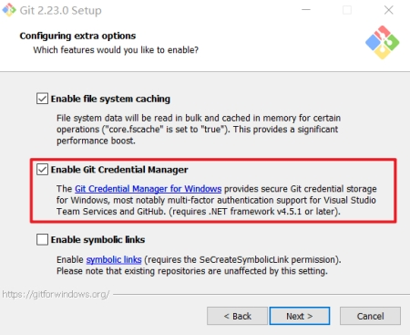 

# 账号设置

## 注册码云Gitee

进入码云的首页（https://gitee.com/），点击注册

注册过程中需要记住你的用户名、邮箱和密码，这几项等下还要使用

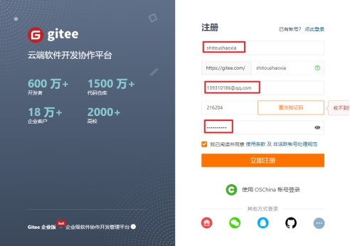 

## 本地配置

### 本地账户配置

在桌面或任意文件夹内邮件，选择Git Bash Here，如下图所示

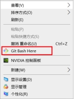 

选择后会打开一个命令行（mac的同学直接打开自己的***\*终端\****即可），如下图所示

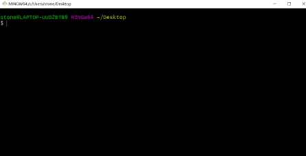 

使用如下命令完成配置

git config --global user.name “用户名”

git config --global user.email “邮箱”

如下图所示

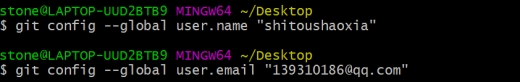 

注意：

1、 使用双引号要使用英文的双引号

2、 用户名和邮箱使用注册Gitee账号的时候的用户名和邮箱

3、 建议命令复制，然后在命令行使用鼠标右键粘贴（或使用shift + insert键粘贴）

###  查看配置（选做）

使用如下命令查看配置

git config --list

如下图所示，出现你刚配置的内容即可(如果不是你的账号和邮箱，使用2.2.1的命令重新配置)

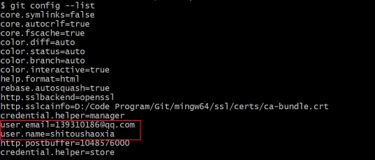 

## IDEA中的配置

在IDEA中进入File → Settings中，搜索Git，查看下图框选中的Path to Git executable中的目录是否为你安装的Git目录下的exe文件，如果不是的话，请选择为你安装的目录下的exe文件，通常这里是自动选择的

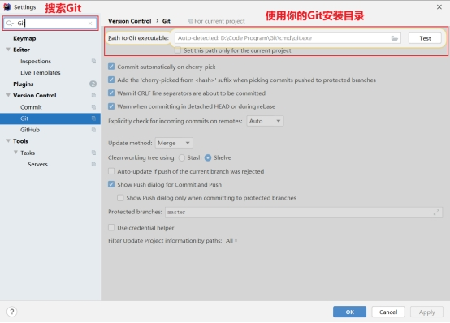 

此时Git的相关配置暂时告一段落，接着进行作业提交的相关讲解

# 拉取老师代码

## 复制Git地址

举例:

首先打开老师提供的作业提交的地址（https://gitee.com/shitoushaoxia/homework2020）

以下图地址为例，进入该页面后，选择克隆/下载按钮，选择HTTPS然后点击复制

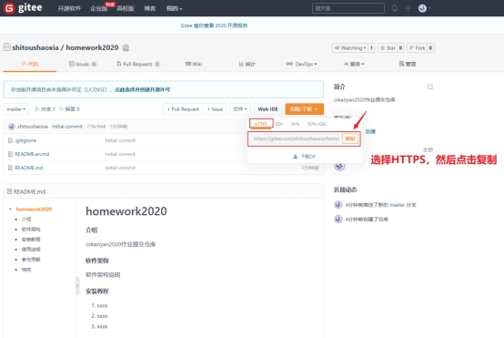 

 

##  新建项目

### 方式一:通过idea

选择File → New → Project from Version Control

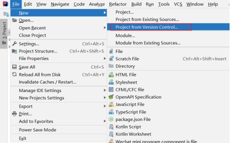 

接着选择3.1复制的Git地址，如下图所示

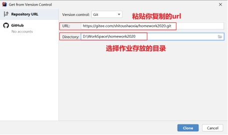 

接着点击Clone，会打开IDEA窗口，对应的是当前Git地址对应的项目

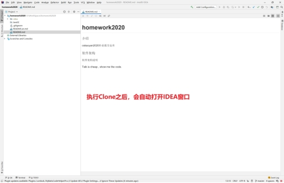 

 

### 方式二:通过git命令

git clone git仓库地址 进行拉取

eg:

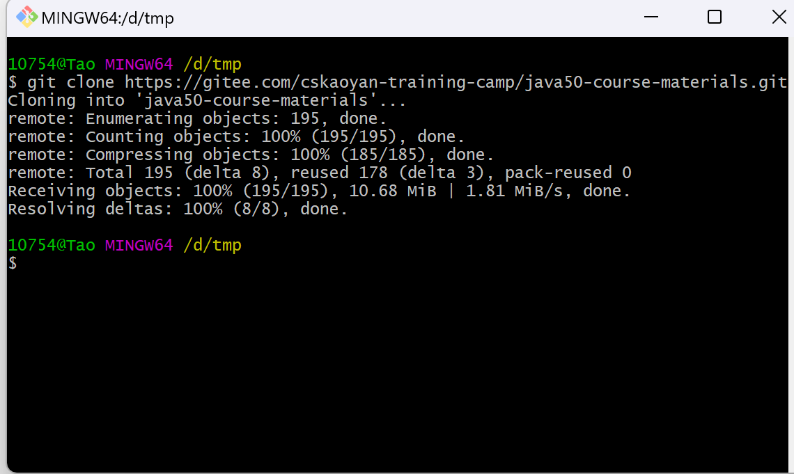

##  更新老师代码

### 方式一:通过idea

右键该目录，然后选择Git → Repository → Pull，如下图所示

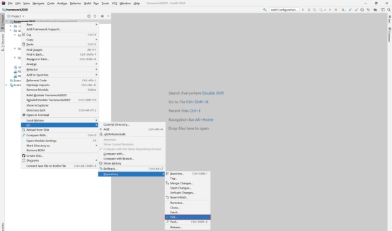 

这样你就可以获取老师最新的代码了

 

### 方式二:通过git 命令

老师提交代码后, 可以通过git pull 命令进行代码更新

eg:

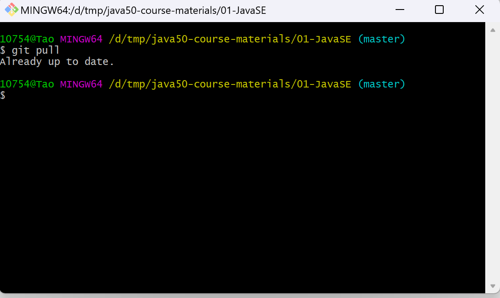