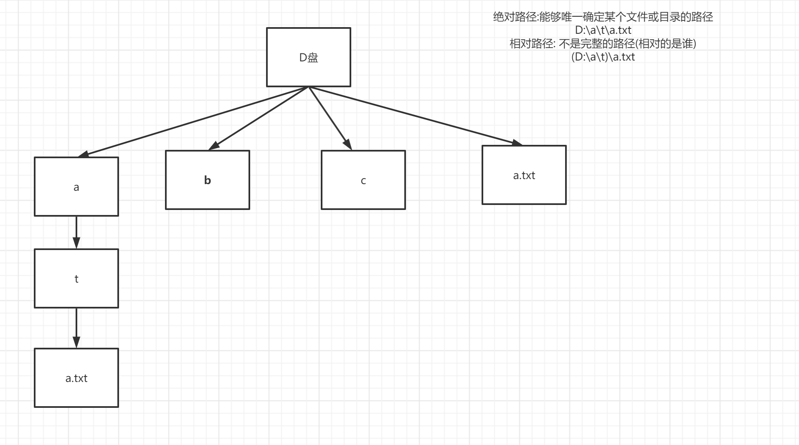

学习目标:

- 掌握相对路径 绝对路径
- 熟悉File中API

# File概述

## 为什么要学习File类？

因为在操作系统中，(内存,RAM , SRAM DRAM) 需要永久保存的数据，都是以文件的形式存在，所以要想操作这些被永久保存的数据，就首先必须在java语言中如何描述，表示文件 

## 相对路径与绝对路径



**绝对路径：**

- 绝对路径名是 完整的路径名，不需要任何其他信息就可以定位它所表示的文件
- windows：E:\demo\first\a.txt

**相对路径**

- 相反，相对路径名必须使用取自其他路径名的信息进行解释(不完整的路径名)
- windows: (e:\demo\)second\a.txt


**java语言中，相对路径默认相对于谁？**

- 默认情况下，java.io包中的类总是根据 当前用户目录 来解析相对路径名。此目录由系统属性 user.dir 指定，通常是 Java 虚拟机的调用目录。

```java
System.out.println(System.getProperty("user.dir"));
```


## 不同系统的路径表示

对于类 **UNIX** 平台，绝对路径名的前缀始终是 "/"。相对路径名没有前缀。表示根目录的绝对路径名的前缀为 "/" 且名称序列为空。

- 绝对路径： /home/st/6379.conf
- 相对路径： st/a.txt
- 根目录：  /

对于 **Microsoft Windows** 平台，包含盘符的路径名前缀由驱动器号和一个 ":" 组成。如果路径名是绝对路径名，还可能后跟 "\\“

- 绝对路径： e:\st\a.txt
- 相对路径：没有盘符前缀  st\a.txt

# File类

文件和目录路径名的抽象表示形式

## 构造方法

```java
File (String pathname)
File (String parent, Sting child)
File (File parent, String child)
```

```java
package _15file.com.cskaoyan._02api;

import org.junit.Test;

import java.io.File;

/**
 * @description:
 * @author: 景天
 * @date: 2022/10/14 17:07
 **/

public class APITest {
    // 构造方法
    @Test
    public void myTest1() {
        // File (String pathname)
        //File file = new File("a.txt");
        //File file2 = new File("D:\\workspace2\\java46th\\a.txt");
        // //判断，File对象表示的文件，是否物理存在
        //public boolean exists()
        //System.out.println("file.exists() = " + file.exists());

        //File (String parent, Sting child)
        //File file1 = new File("D:\\workspace2\\java46th", "a.txt");
        //System.out.println(file1.exists());

        //File (File parent, String child)
        File file = new File(new File("D:\\\\workspace2\\\\java46th"), "a.txt");

    }
}

```


## 成员方法

### 创建功能

```java
//只负责创建文件，目录路径如果不存在，会报错而不是帮你创建
public boolean createNewFile() 

//只负责创建目录，但只能创建单层目录，如果有多级目录不存在的话，创建失败
public boolean mkdir()
    
//只负责创建目录，但可以创建多级目录，如果多级目录不存在，则帮你全部创建
public boolean mkdirs()
```

**mkdir 和 mkdirs创建目录的区别：**

- mkdir仅能在已经存在的目录下，创建新的目录
- mkdirs 当要创建的目标目录，如果目标目录的父目录不存在的时候，它会将不存在的目标木目录的父目录 连同目标目录一起，都创建好

```java
package _15file.com.cskaoyan._02api;

import org.junit.Test;

import java.io.File;
import java.io.IOException;

/**
 * @description:
 * @author: 景天
 * @date: 2022/10/14 17:07
 **/

public class APITest {
    // 构造方法
    @Test
    public void myTest1() {
        // File (String pathname)
        //File file = new File("a.txt");
        //File file2 = new File("D:\\workspace2\\java46th\\a.txt");
        // //判断，File对象表示的文件，是否物理存在
        //public boolean exists()
        //System.out.println("file.exists() = " + file.exists());

        //File (String parent, Sting child)
        //File file1 = new File("D:\\workspace2\\java46th", "a.txt");
        //System.out.println(file1.exists());

        //File (File parent, String child)
        File file = new File(new File("D:\\\\workspace2\\\\java46th"), "a.txt");

    }

    /*
    创建功能
     */
    @Test
    public void myTest2() throws IOException {
        File file = new File("b.txt");
        // //只负责创建文件，目录路径如果不存在，会报错而不是帮你创建
        //public boolean createNewFile()
        System.out.println(file.createNewFile());

        ////只负责创建目录，但只能创建单层目录，如果有多级目录不存在的话，创建失败
        //public boolean mkdir()
        File dir = new File("a");
        System.out.println(dir.mkdir());

        ////只负责创建目录，但可以创建多级目录，如果多级目录不存在，则帮你全部创建
        //public boolean mkdirs()
        File dir2 = new File("a\\b\\c.mp3");
        System.out.println(dir2.mkdirs());
    }
}

```


### 重命名功能

```java
// 重新命名此抽象路径名表示的文件
public boolean renameTo(File dest)
```

- 在源文件，和修改之后的目标文件在同一目录的时候：
  
  - 效果只是重命名
- 当源文件和，修改之后的目标文件当不在同一目录的时候：
  - 移动文件
  - 重命名

  
  

### 删除功能

```java
// 删除此抽象路径名表示的文件或目录。如果此路径名表示一个目录，则该目录必须为空才能删除
// delete不会因为文件不存在,路径名不正确而抛出异常,只会返回false, 并且不会进入回收站
public boolean delete()

```


### 判断功能

```java
// 判断File对象是否表示的是一个文件
public boolean isFile()

//判断File对象是否表示的是一个目录
 public boolean isDirectory() 

//判断，File对象表示的文件，是否物理存在
public boolean exists() 
```


### 基本获取功能

```java
//获取File对象表示的抽象文件的绝对路径
public String getAbsolutePath()

//获取File对象表示的抽象文件，路径名字符串
 public String getPath()

//获取文件或者目录的名字
 public String getName()

//返回由此抽象路径名表示的文件的长度。不能返回文件夹的长度
//此抽象路径名表示的文件的长度，以字节为单位；如果文件不存在，则返回 0L
 public long length()

//返回此抽象路径名表示的文件最后一次被修改的时间。
//表示文件最后一次被修改的时间的 long 值，用与时间点（1970 年1月1日，00:00:00 GMT）之间的毫秒数表示
public long lastModified()
```


### 高级获取功能

```java
//返回一个字符串数组，这些字符串包括，此抽象的路径名表示的目录中的所有文件和文件夹的名字
//如果File对象表示的是一个文件，则返回null
//只能获取当前目录的下一层，并不是获取所有层级
//如果是一个空目录，返回一个长度为0的数组，而不是null  []
public String[] list() 
        
//返回指定File目录下的文件和文件夹的绝对路径形式的File对象数组
//如果File对象表示的是一个文件，则返回null
//只能获取当前目录的下一层，并不是获取所有层级
//如果是一个空目录，返回一个长度为0的数组，而不是null
public File[] listFiles()
```


练习1
判断某个目录(单级)下有没有a.jpg文件,有的话输出

```java
package _15file.com.cskaoyan._02api;

import java.io.File;

/**
 * @description:
 * @author: 景天
 * @date: 2022/10/14 17:41
 **/
/*
练习1
判断某个目录(单级)下有没有a.jpg文件,有的话输出
 */
public class Ex {
    public static void main(String[] args) {
        // 创建File对象
        File dir = new File("D:\\app2");
        // listFiles----> File[]
        File[] files = dir.listFiles();
        // 遍历数组
        for (File file : files) {
            // 判断是不是文件
            if (file.isFile()) {
                // 如果是文件
                // 再判断是否是目标文件
                if ("a.jpg".equals(file.getName())) {
                    // 如果是 输出绝对路径
                    System.out.println(file.getAbsolutePath());
                }

            }

        }
    }
}

```


练习2
递归输出某个目录下的所有java文件

```java
package _15file.com.cskaoyan._02api;

import java.io.File;

/**
 * @description:
 * @author: 景天
 * @date: 2022/10/14 17:46
 **/
/*
练习2
递归输出某个目录下的所有java文件
 */
public class Ex2 {
    public static void main(String[] args) {
        // 创建File对象
        File dir = new File("D:\\app2");
        findAllJava(dir);


    }

    private static void findAllJava(File dir) {
        // listFiles----> File[]
        File[] files = dir.listFiles();
        // 遍历数组
        for (File file : files) {
            // 判断如果是文件
            if (file.isFile()) {
                // 再判断是否是.java文件
                if (file.getName().endsWith(".java")) {
                    // 如果是 输出绝对路径
                    System.out.println(file.getAbsolutePath());
                }

            }
            else {
                // 如果是目录
                // 递归
                findAllJava(file);
            }

        }
    }
}

```


## 文件过滤器

- 自定义获取功能是在高级获取功能的基础上，加了一个过滤器，所以高级功能的特点它都有

- FileFilter是一个接口，它只有下面一个方法

  - ```Java
    //测试指定抽象路径名是否应该包含在某个路径名列表中
    boolean accept(File pathname)
    ```

  - 这个方法相当于把高级功能中listFiles()获取的File数组中File对象遍历一遍，然后逐个判断

  - 符合条件的留下，不符合条件的干掉（丢弃）- 

- 常用匿名内部类来做实现

练习:
输出某个目录(单级)下的所有java文件,使用过滤器.

3种方式实现
匿名对象
匿名内部类
lambda表达式

```java
package _15file.com.cskaoyan._02api;

import java.io.File;
import java.io.FileFilter;
import java.util.Arrays;

/**
 * @description:
 * @author: 景天
 * @date: 2022/10/15 9:27
 **/
/*
练习:
输出某个目录(单级)下的所有java文件,使用过滤器.
 */
public class Ex3 {
    public static void main(String[] args) {
        // 创建File对象
        File dir = new File("D:\\app2");
        // 利用带过滤器的listFiles方法--->File[]
        //File[] files = dir.listFiles(new MyFileFilter());

        // 匿名内部类
        //File[] files = dir.listFiles(new FileFilter() {
        //    @Override
        //    public boolean accept(File pathname) {
        //        return pathname.getName().endsWith(".jpg");
        //    }
        //
        //});

        File[] files = dir.listFiles((pathname) -> pathname.getName().endsWith(".txt"));

        System.out.println(Arrays.toString(files));
    }
}

class MyFileFilter implements FileFilter{

    @Override
    public boolean accept(File pathname) {
        return pathname.getName().endsWith(".java");
    }
}
```

