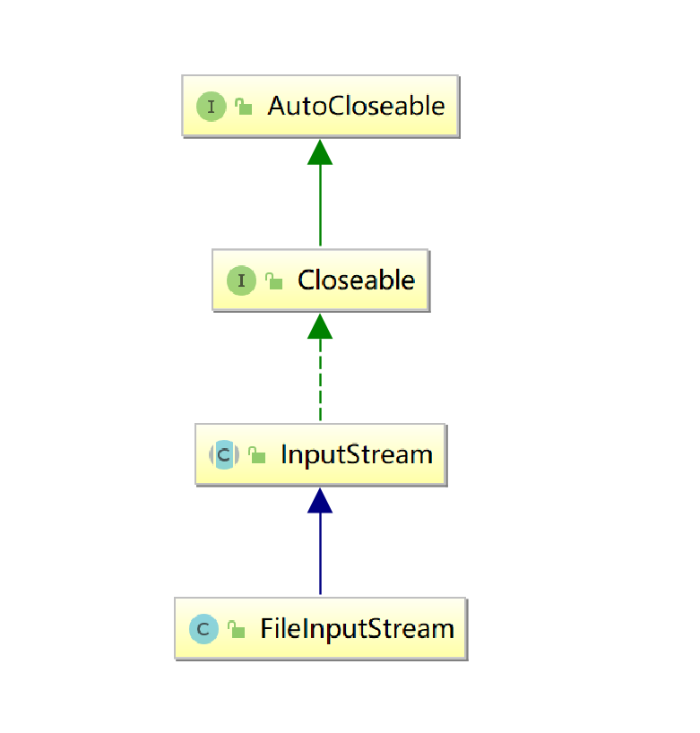
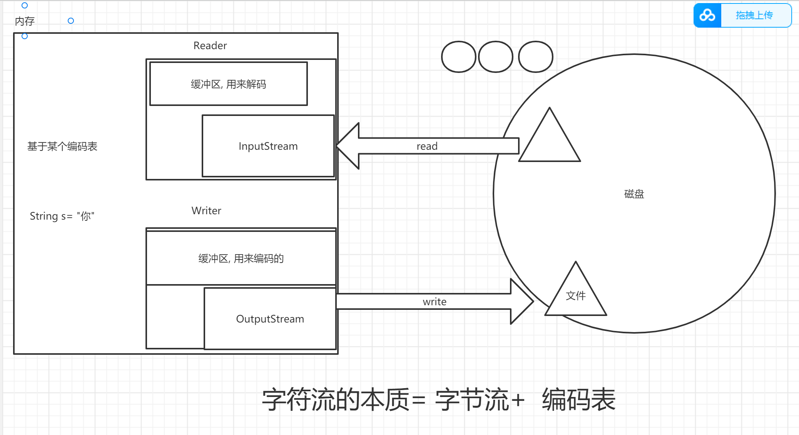
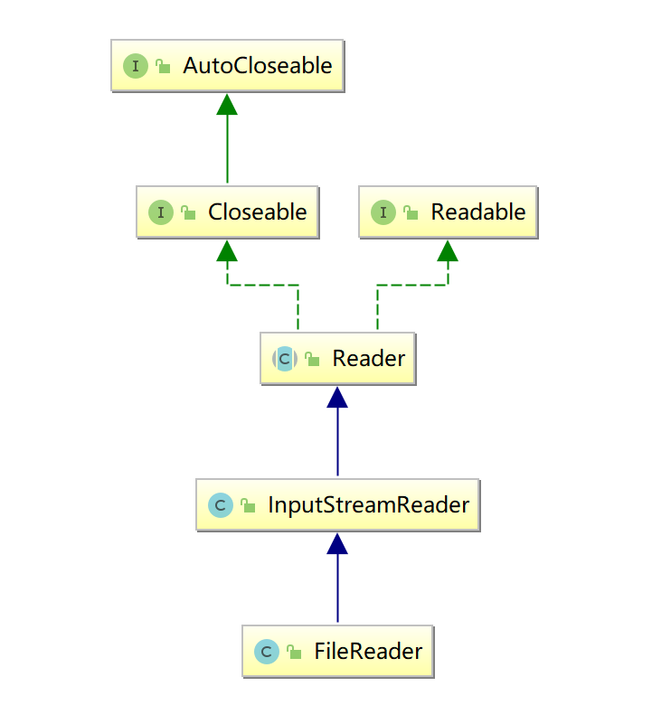
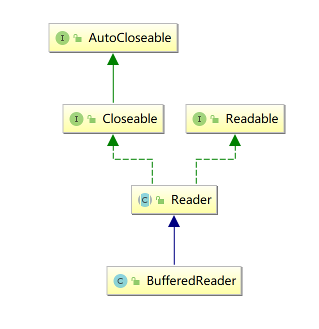

学习目标:

- 掌握IO体系及分类
- 熟练掌握字节流
- 熟悉字符流

# IO概述

## 什么是IO?

input : 输入   读

output: 输出  写

## 为什么有IO?

在操作系统中，一切需要永久保存的数据都以文件的形式 存储。需要长久保存的文件数据，存储在外部设备。
但是需要读入内存才能显示这些数据
同时，内存的大小有限，因此常常需要在内存和外设之间交换数据，即I/O

## java中如何实现IO功能

Java流模型


## IO的分类

**按流向分(以内存为参照物)**

- 输出流: 内存---> 磁盘
- 输入流: 磁盘---> 内存

**按照数据类型分**

- 字节流: 逻辑单位是字节,(1B = 8bit  0000 0000) 
- 字符流: 逻辑单位是字符(理解为一种文化符号,abc , "你", "の")


## 4个抽象基类

字节输出流: OutputStream

字节输入流: InputStream

字符输出流: Writer

字符输入流: Reader

由这4个抽象基类派生的子类都是以其父类名作为后缀的

如：InputStream的子类FileInputStream。
如：Reader的子类FileReader

## 什么时候用什么流?

一般来讲, 纯文本文件用字符流  .txt .java .cpp

其他情况用字节流(字节流是万能的)  .word  .ppt  .mp4  .mp3 .jpg . png  .exe

# 字节流

## 字节输出流

### 抽象基类OutputStream

此抽象类是表示输出字节流的所有类的超类 

**继承关系**


**成员方法**

| void           | close()        关闭此输出流并释放与此流有关的所有系统资源。  |
| -------------- | ------------------------------------------------------------ |
| void           | flush()        刷新此输出流并强制写出所有缓冲的输出字节。    |
| void           | write(byte[] b)        将 b.length 个字节从指定的 byte 数组写入此输出流。 |
| void           | write(byte[] b,  int off, int len)       将指定 byte 数组中从偏移量 off 开始的  len 个字节写入此输出流。 |
| abstract  void | write(int b)        将指定的字节写入此输出流。write 的常规协定是：向输出流写入一个字节。要写入的字节是参数 b 的八个低位。b 的 24 个高位将被忽略。 |

### 具体子类

#### FileOutputStream文件字节输出流

用于将数据写入 File 

**继承关系**


**构造方法**

| FileOutputStream(File file)        创建一个向指定 File 对象表示的文件中写入数据的文件输出流。 |
| ------------------------------------------------------------ |
| FileOutputStream(File file,  boolean append)       创建一个向指定 File  对象表示的文件中写入数据的文件输出流。 |
| FileOutputStream(String fileName)        创建一个向具有指定名称的文件中写入数据的输出文件流。 |
| FileOutputStream(String name,  boolean append)       创建一个向具有指定 name 的文件中写入数据的输出文件流 append - 如果为 true，则将字节写入文件末尾处，而不是写入文件开始处 |

**成员方法**

| void           | write(byte[] b)        将 b.length 个字节从指定的 byte 数组写入此输出流。 |
| -------------- | ------------------------------------------------------------ |
| void           | write(byte[] b,  int off, int len)       将指定 byte 数组中从偏移量 off 开始的  len 个字节写入此输出流。 |
| abstract  void | write(int b)        将指定的字节写入此输出流。write 的常规协定是：向输出流写入一个字节。要写入的字节是参数 b 的八个低位。b 的 24 个高位将被忽略。 |

Demo

```java 
package _16io01.com.cskaoyan.bytestream._01fileoutputstream;

import java.io.File;
import java.io.FileNotFoundException;
import java.io.FileOutputStream;
import java.io.IOException;

/**
 * @description:
 * @author: 景天
 * @date: 2022/10/15 9:13
 **/
/*
写数据的步骤
1.创建输出流对象
2.write
3.释放资源 close
 */
public class Demo {
    public static void main(String[] args) throws IOException {
        //1.创建输出流对象
        //FileOutputStream out = new FileOutputStream(new File("D:\\workspace2\\java46th\\a.txt"));
        FileOutputStream out = new FileOutputStream("b.txt");

        //2.write
        // write(int b) 写单个字节
        //out.write(97);


        // write(byte[] b) 批量写
        String s = "abc";
        byte[] bytes = s.getBytes();
        out.write(bytes);

        // write(byte [] b , int off , int len) 写字节数组的部分
        out.write(bytes, 1, 2);

        //3.释放资源 close
        out.close();
    }
}

```


#### 注意事项

- 当我们创建一个输出流对象的时候,发生了什么?

  - jvm向操作系统中看这个文件是否存在
  - 如果文件不存在, 帮我们创建
  - 文件已经存在, 覆盖重新开始写

- 如何实现文件追加功能?

  - 借助于带append参数的构造方法

  - ```Java
    package _16io01.com.cskaoyan.bytestream._01fileoutputstream;
    
    import java.io.FileOutputStream;
    import java.io.IOException;
    
    /**
     * @description:
     * @author: 景天
     * @date: 2022/10/15 10:55
     **/
    /*
    实现文件追加功能
     */
    public class Demo2 {
        public static void main(String[] args) throws IOException {
            // 使用带append的构造方法
            // 创建输出流对象
            FileOutputStream out = new FileOutputStream("a.txt", true);
            // write
            out.write(100);
            // close
            out.close();
        }
    }
    
    ```

- 如何实现换行功能

  - ```java
    package _16io01.com.cskaoyan.bytestream._01fileoutputstream;
    
    import java.io.FileOutputStream;
    import java.io.IOException;
    
    /**
     * @description:
     * @author: 景天
     * @date: 2022/10/15 10:57
     **/
    /*
    实现换行功能
     */
    public class Demo3 {
        public static void main(String[] args) throws IOException {
            // 创建输出流对象
            FileOutputStream out = new FileOutputStream("a.txt");
            out.write("abcd".getBytes());
            // write 写换行符
            // \r\n
            out.write("\r\n".getBytes());
            out.write(97);
    
            out.write("\r".getBytes());
            out.write(97);
    
            out.write("\n".getBytes());
            out.write(97);
            
            // 使用系统默认换行符
            out.write(System.lineSeparator().getBytes());
            out.write(97);
    
            // close
            out.close();
        }
    }
    
    ```

- 如何异常处理

  - try-catch-finally

    - ```java
      package _16io01.com.cskaoyan.bytestream._01fileoutputstream;
      
      import java.io.FileNotFoundException;
      import java.io.FileOutputStream;
      import java.io.IOException;
      import java.io.OutputStream;
      
      /**
       * @description:
       * @author: 景天
       * @date: 2022/10/15 11:04
       **/
      /*
      try-catch
       */
      public class Demo4 {
          public static void main(String[] args) {
              // 创建输出流对象
              FileOutputStream out = null;
              try {
                  // xxxxxx
                  // xxxx
                  out = new FileOutputStream("a.txt");
                  // write
                  out.write("aaaa".getBytes());
              } catch (FileNotFoundException e) {
                  e.printStackTrace();
              } catch (IOException e) {
                  e.printStackTrace();
              }finally {
                  // close
                  try {
                      if (out != null) {
                          out.close();
                      }
                  } catch (IOException e) {
                      e.printStackTrace();
                  }
              }
      
          }
      }
      
      ```

      

  - try-with-resources

    - ```java
      语法
      try(资源,只要实现了AutoCloseable接口的类){
       //可能出现异常的代码
       // 当出了try代码块的时候 close方法会自动执行 资源会被自动释放
      }catch(){
      	
      }
      ```

    - ```java
      package _16io01.com.cskaoyan.bytestream._01fileoutputstream;
      
      import java.io.FileNotFoundException;
      import java.io.FileOutputStream;
      import java.io.IOException;
      
      /**
       * @description:
       * @author: 景天
       * @date: 2022/10/15 11:13
       **/
      /*
      try-with-resources
       */
      public class Demo5 {
          public static void main(String[] args) {
              try(FileOutputStream out = new FileOutputStream("a.txt")) {
                  // write数据
                  out.write("abc".getBytes());
              } catch (FileNotFoundException e) {
                  e.printStackTrace();
              } catch (IOException e) {
                  e.printStackTrace();
              }
          }
      }
      
      ```

    - 验证自动执行

    - ```java
      package _16io01.com.cskaoyan.bytestream._01fileoutputstream;
      
      /**
       * @description:
       * @author: 景天
       * @date: 2022/10/15 11:15
       **/
      /*
      验证close方法自动执行
       */
      public class Demo6 {
          public static void main(String[] args) {
              try (A a = new A()){
                  // 调用func 不调用close
                  a.func();
              } catch (Exception e) {
                  e.printStackTrace();
              }
          }
      }
      
      class A implements AutoCloseable{
      
          @Override
          public void close() throws Exception {
              System.out.println("close执行了");
          }
      
          public void func(){
              System.out.println("func方法执行了");
          }
      }
      ```

- 为什么要close?

  - jvm使用了不属于jvm的资源, 不能通过GC回收, 只能通过close显式的释放资源.


#### BufferedOutputStream缓冲字节输出流

该类实现缓冲的输出流。通过设置这种输出流，应用程序就可以将各个字节写入底层输出流中，而不必针对每次字节写入调用底层系统。 

**继承关系**


**构造方法**

| BufferedOutputStream(OutputStream out)        创建一个新的缓冲输出流，以将数据写入指定的底层输出流。默认缓冲区大小是8KB |
| ------------------------------------------------------------ |
| BufferedOutputStream(OutputStream out,  int size)       创建一个新的缓冲输出流，以将具有指定缓冲区大小的数据写入指定的底层输出流。 指定缓冲区size大小 |

**成员方法**

3个write方法

write(int b)

write(byte[] b)

write(byte[] b, int off, int len)

Demo

```java 
package _17io02.com.cskaoyan.bytestream._03buffer;

import java.io.BufferedOutputStream;
import java.io.File;
import java.io.FileOutputStream;
import java.io.IOException;

/**
 * @description:
 * @author: 景天
 * @date: 2022/10/17 11:02
 **/
/*
使用缓冲输出流
 */
public class Demo {
    public static void main(String[] args) throws IOException {
        // 创建输出流对象
        //FileOutputStream fileOutputStream = new FileOutputStream("a.txt");
        //BufferedOutputStream out = new BufferedOutputStream(fileOutputStream);

        BufferedOutputStream out =
                new BufferedOutputStream(new FileOutputStream("a.txt"));

        // write
        // 写单个字节
        out.write(97);
        out.write(98);

        out.write("yyds".getBytes());
        
        // flush
        out.flush();

        // close
        out.close();
    }
}

```


注意：

- 使用所有带缓冲区的输出流, 记得flush操作

- 执行close方法会自动执行flush

  - 

- 缓冲区满了会自动刷新

  - ```java
    
    public class Demo2 {
        public static void main(String[] args) throws IOException {
            // 使用指定缓冲区
            BufferedOutputStream out =
                    new BufferedOutputStream(new FileOutputStream("a.txt"), 4);
            // write
            out.write("abcdef".getBytes());
    
            // flush
    
            // close
        }
    }
    ```


## 字节输入流

### 抽象基类InputStream

此抽象类是表示字节输入流的所有类的超类。

**继承关系**


**成员方法**

| abstract  int | read()        从输入流中读取数据的下一个字节。返回 0 到 255 范围内的 int 字节值。如果因为已经到达流末尾而没有可用的字节，则返回值 -1。在输入数据可用、检测到流末尾或者抛出异常前，此方法一直阻塞。返回值代表了读取到的字节值  readData |
| ------------- | ------------------------------------------------------------ |
| int           | read(byte[] b)        从输入流中读取一定数量的字节，并将其存储在缓冲区数组 b 中。读入缓冲区的总字节数；如果因为已经到达流末尾而不再有数据可用，则返回 -1。返回值表示读取的字节的个数 readCount |
| int           | read(byte[] b,  int off, int len)       将输入流中最多 len 个数据字节读入 byte 数组。 |


### 具体子类

#### FileInputStream文件字节输入流

`FileInputStream` 从文件系统中的某个文件中获得输入字节

**继承关系**



**构造方法**

| FileInputStream(File file)        通过打开一个到实际文件的连接来创建一个 FileInputStream，该文件通过文件系统中的  File 对象 file 指定。 |
| ------------------------------------------------------------ |
| FileInputStream(String fileName)        通过打开一个到实际文件的连接来创建一个 FileInputStream，该文件通过文件系统中的路径名  name 指定。 |

**成员方法**

| abstract  int | read()        从输入流中读取数据的下一个字节。返回 0 到 255 范围内的 int 字节值。如果因为已经到达流末尾而没有可用的字节，则返回值 -1。在输入数据可用、检测到流末尾或者抛出异常前，此方法一直阻塞。返回值代表了读取到的字节值  readData |
| ------------- | ------------------------------------------------------------ |
| int           | read(byte[] b)        从输入流中读取一定数量的字节，并将其存储在缓冲区数组 b 中。读入缓冲区的总字节数；如果因为已经到达流末尾而不再有数据可用，则返回 -1。返回值表示读取的字节的个数 readCount |
| int           | read(byte[] b,  int off, int len)       将输入流中最多 len 个数据字节读入 byte 数组。 |

Demo 

```java 
package _16io01.com.cskaoyan.bytestream._02fileinputstream;

import java.io.FileInputStream;
import java.io.IOException;

/**
 * @description:
 * @author: 景天
 * @date: 2022/10/15 11:33
 **/
/*
读取数据的步骤
1.创建输入流对象
2.read
3.close释放资源
 */
public class Demo {
    public static void main(String[] args) throws IOException {
        //1.创建输入流对象
        FileInputStream in = new FileInputStream("a.txt");
        //2.read
        // read() 读取单字节
        // readData 表示读取的字节值
        // readSingle(in);

        // read(byte[])
        // readMulti(in);

        
        // read(byte[],int off,int len)
        //3.close释放资源
        in.close();
    }

    private static void readMulti(FileInputStream in) throws IOException {
        byte[] bytes = new byte[1024];
        // readCount 表示读取到的字节的个数
        int readCount = in.read(bytes);
        System.out.println("readCount = " + readCount);
        String s = new String(bytes);
        System.out.println(s);
    }

    private static void readSingle(FileInputStream in) throws IOException {
        int readData = in.read();
        System.out.println(((char) readData));

        int readData2 = in.read();
        System.out.println(((char) readData2));

        int readData3 = in.read();
        System.out.println(((char) readData3));

        int readData4 = in.read();
        System.out.println(readData4);
    }
}

```


```java 
package _16io01.com.cskaoyan.bytestream._02fileinputstream;


import java.io.FileInputStream;
import java.io.IOException;

/**
 * @description:
 * @author: 景天
 * @date: 2022/10/15 11:43
 **/

public class Demo2 {
    public static void main(String[] args) throws IOException {
        // 创建输入流对象
        FileInputStream in = new FileInputStream("a.txt");

        // read
        // read(byte[])
        byte[] bytes = new byte[4];
        int readCount = in.read(bytes);
        System.out.println(new String(bytes));

        int readCount2 = in.read(bytes);
        System.out.println(new String(bytes,0,readCount2));

        // close
        in.close();
    }
}

```


**循环读取**

```java
package _17io02.com.cskaoyan.bytestream._01readwhile;

import java.io.FileInputStream;
import java.io.IOException;

/**
 * @description:
 * @author: 景天
 * @date: 2022/10/17 9:43
 **/

/*
循环读取数据
 */
public class Demo {
    public static void main(String[] args) throws IOException {
        // 创建输入流对象
        FileInputStream in = new FileInputStream("a.txt");

        // 循环
        // readWhile1(in);

        // 新的方式
        // 单字节读取
        // readWhile2(in);

        // 字节数组方式
        int readCount;
        byte[] bytes = new byte[1024];
        while ((readCount = in.read(bytes)) != -1) {
            System.out.println(new String(bytes,0,readCount));
        }


        // close
        in.close();
    }

    private static void readWhile2(FileInputStream in) throws IOException {
        int readData;
        // == -1 就结束循环 意味文件里读取完了
        while ((readData = in.read()) != -1) {
            System.out.println(((char) readData));

        }
    }

    private static void readWhile1(FileInputStream in) throws IOException {
        while (true) {
            // read
            int readData = in.read();
            if (readData == -1) {
                break;
            }
            System.out.println(((char) readData));

        }
    }
}
```


#### BufferedInputStream缓冲字节输入流

**继承关系**


**构造方法**

| BufferedInputStream(InputStream in)        创建一个 BufferedInputStream 并保存其参数，即输入流  in，以便将来使用。默认缓冲区8KB |
| ------------------------------------------------------------ |
| BufferedInputStream(InputStream in,  int size)       创建具有指定缓冲区大小的 BufferedInputStream  并保存其参数，即输入流 in，以便将来使用。 使用指定的缓冲区 |

**成员方法**

3个read

read() 读取单个字节

read(byte [] b) 读取数据填充到数组

read(byte [] b, int off , int len) 读取数据填充到数组

```java
package _17io02.com.cskaoyan.bytestream._03buffer;

import java.io.BufferedInputStream;
import java.io.FileInputStream;
import java.io.IOException;

/**
 * @description:
 * @author: 景天
 * @date: 2022/10/17 11:18
 **/
/*
使用缓冲的输入流
 */
public class Demo3 {
    public static void main(String[] args) throws IOException {
        // 创建输入流对象
        BufferedInputStream in =
                new BufferedInputStream(new FileInputStream("a.txt"));

        // read
        // 单个读取
        int readData = in.read();
        System.out.println(readData);

        // 批量
        byte[] bytes = new byte[1024];
        int readCount = in.read(bytes);
        System.out.println(new String(bytes,0,readCount));

        // close
        in.close();
    }
}

```


## 文件复制功能

思路:

- 读取源文件,  把数据读取到内存里
- 把内存的数据写到新文件

主要逻辑


**使用字节流复制**

文本文件:  正常复制

图片文件: 正常复制

视频文件: 正常复制


**使用字符流复制**

文本文件:  正常复制

图片文件: 复制出错

视频文件: 复制出错

**单字节复制还是字节数组方式效率高?**

- 字节数组批量的方式效率高

**为什么?**

- 批量的方式会减少跟操作系统的交互

举例:

我在JD 买了5个快递

单字节: 快递小哥1次送一个

字节数组方式: 东哥说了  大家都是兄弟 配车   快递装车里


# 字符流

## 为什么有字符流?

- 使用字节流读取英文数字
  - 没有问题
- 使用字节流读取中文
  - 可能有问题

## 一个字符是如何存在计算机中的

基于某个编码表. 每个字符对应这一个整数值(编码值), 计算机存的就是这个整数值

| 字符 | 编码值(整数值)           |
| ---- | ------------------------ |
| a    | 97 ---> 二级制  01100001 |
| 你   | 21320 --->二进制         |


## 编码表

ASCII：美国标准信息交换码。
用一个字节的7位可以表示。0000 0000 - 0111 1111
ISO8859-1：拉丁码表。欧洲码表
用一个字节的8位表示。  0000 0000 - 1111 1111

GB2312：中国的中文编码表。
GBK：中国的中文编码表升级，融合了更多的中文文字符号。
GB18030：GBK的取代版本
BIG-5码 ：通行于台湾、香港地区的一个繁体字编码方案，俗称“大五码”。

Unicode：国际标准码，融合了多种文字。

UTF-8：可变长度来表示一个字符。
UTF-8不同，它定义了一种“区间规则”，这种规则可以和ASCII编码保持最大程度的兼容：

它将Unicode编码为00000000-0000007F的字符，用单个字节来表示  0111  1111  =  7F
它将Unicode编码为00000080-000007FF的字符用两个字节表示 
它将Unicode编码为00000800-0000FFFF的字符用3字节表示 

1字节 0xxxxxxx 
2字节 110xxxxx 10xxxxxx 
3字节 1110xxxx 10xxxxxx 10xxxxxx 

utf-16:

jvm使用的编码表，用2个字节来编解码

char : 2 字节 

**工作中常用的**

- Ascii     1个字节的低7位
- ISO8859-1   1个字节
- GBK      2个字节表示一个中文字符
- UTF-8    3个字节表示一个中文字符


## 编解码

**编码**

- 把一字符串数据转为二进制数据存到计算机的过程(把人看懂的东西-----> 计算机看懂的东西)

**解码**

- 编码的逆过程(把计算机看懂的东西 ---- > 人看懂的东西)


举例:

类似于摩斯密码

你 

中文编码表 0x0001

日文编码表 0x0001  の

**默认的编码表**

- idea: Utf-8
- Win: GBK  (ANSI 默认的)


## java中的编解码

```java
package _17io02.com.cskaoyan.charstream.com.cskoyan._02encode;

import java.io.UnsupportedEncodingException;
import java.util.Arrays;

/**
 * @description:
 * @author: 景天
 * @date: 2022/10/17 14:58
 **/
/*
java中的编解码
 */
public class Demo2 {
    public static void main(String[] args) throws UnsupportedEncodingException {
        // 编码过程
        // 人看懂---->计算机看懂的
        String s = "你好";
        // byte[] getBytes()
        // 使用平台的默认字符集将此 String 编码为 byte 序列，
        // 并将结果存储到一个新的 byte 数组中
        //byte[] bytes = s.getBytes();
        //System.out.println(Arrays.toString(bytes));
        // [-28, -67, -96, -27, -91, -67]

        // byte[] getBytes(String charsetName)
        // 使用指定的字符集将此 String 编码为 byte 序列，并将结果存储到一个新的 byte 数组中。
        byte[] bytes = s.getBytes("GBK");
        System.out.println(Arrays.toString(bytes));
        // [-60, -29, -70, -61]


        // 解码过程
        // 计算机看懂的----> 人看懂的
        // String(byte[] bytes)
        // 通过使用平台的默认字符集解码指定的 byte 数组，构造一个新的 String。
        //String s1 = new String(bytes);
        //System.out.println(s1);

        // String(byte[] bytes, String charsetName)
        // 通过使用指定的 charset 解码指定的 byte 数组，构造一个新的 String。
        String s2 = new String(bytes, "gbk");
        System.out.println(s2);

    }
}

```


**乱码问题**

- 产生的原因: 编码解码不一致
- 解决: 使其一致


## 字符流的本质



## 字符输出流

### 抽象基类Writer

写入字符流的抽象类

**继承关系**


**成员方法**

| void           | write(char[] cbuf)        写入字符数组。                     |
| -------------- | ------------------------------------------------------------ |
| abstract  void | write(char[] cbuf,  int off, int len)       写入字符数组的某一部分。 |
| void           | write(int c)        写入单个字符。                           |
| void           | write(String str)        写入字符串。                        |
| void           | write(String str,  int off, int len)       写入字符串的某一部分 |

### 具体子类

#### OutputStreamWriter转换流

OutputStreamWriter 是字符流通向字节流的桥梁：可使用指定的 [`charset`](../../java/nio/charset/Charset.html)  将要写入流中的字符编码成字节。它使用的字符集可以由名称指定或显式给定，否则将接受平台默认的字符集。

**继承关系**


**构造方法**

| OutputStreamWriter(OutputStream out)        创建使用默认字符编码的 OutputStreamWriter。 |
| ------------------------------------------------------------ |
| OutputStreamWriter(OutputStream out,  String charsetName)        创建使用指定字符集的 OutputStreamWriter。 |

**成员方法**

5个write

3+2

3个跟字符相关的

2个跟字符串相关的

Demo

```java

package _17io02.com.cskaoyan.charstream.com.cskoyan._03transfer;

import java.io.*;

/**
 * @description:
 * @author: 景天
 * @date: 2022/10/17 15:52
 **/
/*
使用转换输出流写数据
 */
public class Demo {
    public static void main(String[] args) throws IOException {
        // 创建输出流对象
        //new OutputStreamWriter(new BufferedOutputStream(new FileOutputStream(new File("a.txt"))));

        OutputStreamWriter out =
                new OutputStreamWriter(new FileOutputStream("a.txt"));

        // write
        // write(int c) 写单个字符
        out.write(97);

        out.write(System.lineSeparator());
        // write(char[] c) 写字符数组
        String s = "宝,今天我输液了,什么夜,想你的夜";
        char[] chars = s.toCharArray();
        out.write(chars);

        out.write(System.lineSeparator());

        // write(char[] c, int off ,int len)
        out.write(chars, 0, 3);

        out.write(System.lineSeparator());
        // write(String s)
        out.write(s);

        out.write(System.lineSeparator());
        // write(String s, int off ,int len)
        out.write(s,1,4);


        // flush
        out.flush();

        // close
        out.close();
    }
}

```


#### FileWriter简化流

用来写入字符文件的便捷类

**继承关系**


**构造方法**

| FileWriter(File file)        根据给定的 File 对象构造一个 FileWriter 对象。 |
| ------------------------------------------------------------ |
| FileWriter(File file,  boolean append)       根据给定的 File 对象构造一个 FileWriter 对象。 |
| FileWriter(String fileName)        根据给定的文件名构造一个 FileWriter 对象。 |
| FileWriter(String fileName,  boolean append)       根据给定的文件名以及指示是否附加写入数据的 boolean 值来构造  FileWriter 对象。 |


**成员方法**

5个write

3个跟字符相关的

2个跟字符串相关的

```java
package _17io02.com.cskaoyan.charstream.com.cskoyan._05simple;

import java.io.FileWriter;
import java.io.IOException;

/**
 * @description:
 * @author: 景天
 * @date: 2022/10/17 16:32
 **/
/*
使用简化流写数据
 */
public class Demo2 {
    public static void main(String[] args) throws IOException {
        // 创建输出流对象
        FileWriter fileWriter = new FileWriter("a.txt");
        // write
        fileWriter.write("宝,我今天拉便便了,什么便,想你的一遍又一遍");
        // flush
        fileWriter.flush();
        // close
        fileWriter.close();
    }
}

```


#### BufferedWriter缓冲流

将文本写入字符输出流，缓冲各个字符，从而提供单个字符、数组和字符串的高效写入。 

可以指定缓冲区的大小，或者接受默认的大小。在大多数情况下，默认值就足够大了

**继承关系**


**构造方法**

| BufferedWriter(Writer out)        创建一个使用默认大小输出缓冲区的缓冲字符输出流。默认缓冲区大小是16KB |
| ------------------------------------------------------------ |
| BufferedWriter(Writer out,  int sz)       创建一个使用给定大小输出缓冲区的新缓冲字符输出流。缓冲区大小size |

**成员方法**

5 + 1

5个常规的write

1个独有的方法

newLine()        写入一个行分隔符。

Demo

```java
package _17io02.com.cskaoyan.charstream.com.cskoyan._06buffer;

import java.io.BufferedWriter;
import java.io.FileOutputStream;
import java.io.FileWriter;
import java.io.IOException;

/**
 * @description:
 * @author: 景天
 * @date: 2022/10/17 17:10
 **/
/*
使用缓冲输出流写数据
 */
public class Demo {
    public static void main(String[] args) throws IOException {
        // 创建输出流对象
        BufferedWriter bw = new BufferedWriter(new FileWriter("a.txt"));
        // write
        bw.write("大郎,来喝药!");

        // 独有的方法 newLine
        bw.newLine();
        bw.write("大郎,来喝药!");

        // flush
        bw.flush();

        // close
        bw.close();
    }
}

```


## 字符输入流

### 抽象基类Reader

用于读取字符流的抽象类

**成员方法**

| int           | read()        读取单个字符。作为整数读取的字符，范围在 0 到 65535 之间 (0x00-0xffff)，如果已到达流的末尾，则返回 -1   用readData 读取到的字符值 |
| ------------- | ------------------------------------------------------------ |
| int           | read(char[] cbuf)        将字符读入数组。 读取的字符数，如果已到达流的末尾，则返回 -1 用readCount表示 读取到的字符的个数 |
| abstract  int | read(char[] cbuf,  int off, int len)       将字符读入数组的某一部分。 |

### 具体子类

#### InputStreamReader转换流

InputStreamReader 是字节流通向字符流的桥梁：它使用指定的 [`charset`](../../java/nio/charset/Charset.html)  读取字节并将其解码为字符。它使用的字符集可以由名称指定或显式给定，或者可以接受平台默认的字符集。

**构造方法**

| InputStreamReader(InputStream in)        创建一个使用默认字符集的 InputStreamReader。 |
| ------------------------------------------------------------ |
| InputStreamReader(InputStream in, String charsetName)        创建使用指定字符集的 InputStreamReader。 |

**成员方法**

3个read方法

read()

read(char[] c)

read(char[] c ,int off, int len)

Demo

```java 
package _17io02.com.cskaoyan.charstream.com.cskoyan._03transfer;

import java.io.FileInputStream;
import java.io.IOException;
import java.io.InputStreamReader;

/**
 * @description:
 * @author: 景天
 * @date: 2022/10/17 16:06
 **/
/*
使用转换流读取数据
 */
public class Demo2 {
    public static void main(String[] args) throws IOException {
        // 创建输入流对象
        InputStreamReader in = new InputStreamReader(new FileInputStream("a.txt"));
        // read
        // read() 读取单个字符
        int readData = in.read();
        System.out.println(((char) readData));

        // read(char[] c) 批量读取
        char[] chars = new char[1024];
        int readCount = in.read(chars);
        String s = new String(chars, 0, readCount);
        System.out.println(s);

        // close
        in.close();
    }
}

```


#### FileReader简化流

**继承关系**



**构造方法**

| FileReader(File file)        在给定从中读取数据的 File 的情况下创建一个新 FileReader。 |
| ------------------------------------------------------------ |
| FileReader(String fileName)        在给定从中读取数据的文件名的情况下创建一个新 FileReader。 |

**成员方法**

3个read

Demo

```java
package _17io02.com.cskaoyan.charstream.com.cskoyan._05simple;

import java.io.FileReader;
import java.io.IOException;

/**
 * @description:
 * @author: 景天
 * @date: 2022/10/17 16:37
 **/
/*
简化流读取数据
 */
public class Demo3 {
    public static void main(String[] args) throws IOException {
        // 创建输入流对象
        FileReader reader = new FileReader("D:\\b.txt");
        // read
        char[] chars = new char[1024];
        int readCount = reader.read(chars);
        System.out.println(new String(chars,0,readCount));
        // close
        reader.close();
    }
}

```


**转换流VS简化流**

- 使用角度, 简化流简单, 转换流麻烦
- 继承关系, 转换流是简化流的父类
- 核心区别, 简化流不能指定字符集(使用默认的字符集), 转化流可以指定的字符集

#### BufferedReader缓冲流

从字符输入流中读取文本，缓冲各个字符，从而实现字符、数组和行的高效读取。 

可以指定缓冲区的大小，或者可使用默认的大小。大多数情况下，默认值就足够大了

**继承关系**



**构造方法**

| BufferedReader(Reader in)        创建一个使用默认大小输入缓冲区的缓冲字符输入流。 |
| ------------------------------------------------------------ |
| BufferedReader(Reader in,  int sz)       创建一个使用指定大小输入缓冲区的缓冲字符输入流。 |

**成员方法**

3+1

3个常规read

1个独有的方法

| String | readLine()        读取一个文本行。如果已到达流末尾，则返回 <font color=red>null</font> |
| ------ | ------------------------------------------------------------ |
|        |                                                              |

Demo

```java 
package _17io02.com.cskaoyan.charstream.com.cskoyan._06buffer;

import java.io.BufferedReader;
import java.io.FileInputStream;
import java.io.IOException;
import java.io.InputStreamReader;

/**
 * @description:
 * @author: 景天
 * @date: 2022/10/17 17:17
 **/

/*
使用缓冲的输入流读取数据
 */
public class Demo2 {
    public static void main(String[] args) throws IOException {
        // 创建输入流对象
        BufferedReader br =
                new BufferedReader(new InputStreamReader(new FileInputStream("a.txt")));
        // 常规read
        //char[] chars = new char[1024];
        //int readCount = br.read(chars);
        //System.out.println(new String(chars, 0, readCount));

        // 自己独有的方法 readLine()
        String s = br.readLine();
        System.out.println(s);
        String s1 = br.readLine();
        System.out.println(s1);
        String s2 = br.readLine();
        System.out.println(s2);
        // close
        br.close();
    }
}


package _17io02.com.cskaoyan.charstream.com.cskoyan._06buffer;

import java.io.BufferedReader;
import java.io.FileInputStream;
import java.io.IOException;
import java.io.InputStreamReader;

/**
 * @description:
 * @author: 景天
 * @date: 2022/10/17 17:17
 **/

/*
使用缓冲的输入流循环读取数据 readline()
 */
public class Demo3 {
    public static void main(String[] args) throws IOException {
        // 创建输入流对象
        BufferedReader br =
                new BufferedReader(new InputStreamReader(new FileInputStream("a.txt")));

        // 自己独有的方法 readLine()
        String line;
        while ((line = br.readLine()) != null) {
            System.out.println(line);
        }
        // close
        br.close();
    }
}

```


