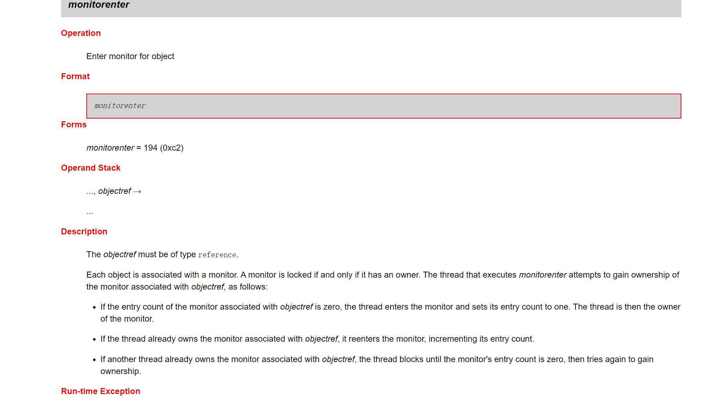

学习目标:

- 除了标记了解的, 其余的都掌握

# 引例:单线程不能满足"同时"的需求

假如我要实现如下功能
程序不停地在屏幕上输出一句问候的语句(比如“你好”)
“同时”，当我通过键盘输入固定输入的时候，程序停止向屏幕输出问候的语句(比如说输入gun)


单线程

无法做到"同时"发生

```java
package _19thread01.com.cskaoyan._01introduction;

import java.util.Scanner;
import java.util.concurrent.TimeUnit;

/**
 * @description:
 * @author: 景天
 * @date: 2022/10/19 9:11
 **/
/*
程序不停地在屏幕上输出一句问候的语句(比如“你好”)  ----> sayHello()
“同时”，当我通过键盘输入固定输入的时候，          --->waitToStop()
程序停止向屏幕输出问候的语句(比如说输入gun)
 */
public class Demo {
    public static boolean flag = true;
    public static void main(String[] args) {
        System.out.println("main before");
        System.out.println("hello before");

        sayHello();
        System.out.println("hello after");


        System.out.println("wait before");
        waitToStop();
        System.out.println("wait after");


        System.out.println("main after");

    }

    private static void waitToStop() {
        Scanner scanner = new Scanner(System.in);
        // 多次输入
        while (flag) {
            String s = scanner.nextLine();
            if ("gun".equals(s)) {
                flag = false;
                break;
            }
        }
    }

    private static void sayHello() {
        while (flag) {
            System.out.println("你好");
            try {
                // 让程序暂停执行3秒
                TimeUnit.SECONDS.sleep(3);
            } catch (InterruptedException e) {
                e.printStackTrace();
            }
        }
    }
}

```


多线程

可以做到同时发生

```java
package _19thread01.com.cskaoyan._01introduction;

import java.util.Scanner;
import java.util.concurrent.TimeUnit;

/**
 * @description:
 * @author: 景天
 * @date: 2022/10/19 9:11
 **/
/*
程序不停地在屏幕上输出一句问候的语句(比如“你好”)  ----> sayHello()
“同时”，当我通过键盘输入固定输入的时候，          --->waitToStop()
程序停止向屏幕输出问候的语句(比如说输入gun)

多线程改进
 */
public class Demo2 {
    public static boolean flag = true;
    public static void main(String[] args) {
        System.out.println("main before");
        System.out.println("hello before");

        sayHello();
        System.out.println("hello after");


        System.out.println("wait before");
        waitToStop();
        System.out.println("wait after");


        System.out.println("main after");

    }

    private static void waitToStop() {
        new Thread(new Runnable() {
            @Override
            public void run() {
                Scanner scanner = new Scanner(System.in);
                // 多次输入
                while (flag) {
                    String s = scanner.nextLine();
                    if ("gun".equals(s)) {
                        flag = false;
                        break;
                    }
                }
            }
        }).start();

    }

    private static void sayHello() {
        new Thread(new Runnable() {
            @Override
            public void run() {
                while (flag) {
                    System.out.println("你好");
                    try {
                        // 让程序暂停执行3秒
                        TimeUnit.SECONDS.sleep(3);
                    } catch (InterruptedException e) {
                        e.printStackTrace();
                    }
                }
            }
        }).start();

    }
}

```


# 操作系统基本概念

## 进程(process)与线程(thread)

**进程**

- 计算机程序在某个数据集合上的运行活动.进程是操作系统进行资源调度与分配的基本单位
- 正在运行的程序或者软件

**线程**

- 进程中有多个子任务,每个子任务就是一个线程. 从执行路径的角度看, 一条执行路径就是一个线程
- 线程是CPU进行资源调度与分配的基本单位


**进程与线程的关系**

- 线程依赖于进程而存在
- 一个进程中可以有多个线程(最少1个)
- 线程共享进程资源
- 举例: 迅雷,  Word拼写


## 串行(serial),并行(parallel)与并发(concurrency)

**串行**

- 一个任务接一个任务按顺序执行

并行

- 在同一个时间点(时刻)上, 多个任务同时运行

并发

- 在同一时间段内,多个任务同时运


# java程序运行原理

## java命令+主类类名运行原理

- java命令会启动jvm进程, jvm进程会创建一个线程(main线程)
- 执行main线程里面的main方法

## jvm是单线程还是多线程的

结论: jvm是多线程的

除了main线程外,还有其他线程,起码还有一个垃圾回收线程


# 多线程的实现方式一:继承Thread类

*线程* 是程序中的执行线程。Java 虚拟机允许应用程序并发地运行多个执行线程。

## 文档示例


## 步骤

1. 定义一个类继承Thread类
2. 重写run方法
3. 创建子类对象
4. 通过start方法启动线程

Demo

```java
package _19thread01.com.cskaoyan._02implone;

import java.util.concurrent.TimeUnit;

/**
 * @description:
 * @author: 景天
 * @date: 2022/10/19 11:11
 **/
/*
多线程的实现方式一:
1. 定义一个类继承Thread类
2. 重写run方法
3. 创建子类对象
4. 通过start方法启动线程
 */
public class Demo {
    public static void main(String[] args) {
        System.out.println("main start");
        //3. 创建子类对象
        MyThread t = new MyThread();
        // 4. 通过start方法启动线程
        t.start();
        try {
            TimeUnit.MILLISECONDS.sleep(1);
        } catch (InterruptedException e) {
            e.printStackTrace();
        }
        System.out.println("main end");

    }
}


//1. 定义一个类继承Thread类
class MyThread extends Thread{
    //2. 重写run方法

    @Override
    public void run() {
        System.out.println("子线程执行了!");
    }
}
```


```java
没加等待的结果:
main start
main end
子线程执行了!

加上等待的结果:
main start
子线程执行了!
main end
```


## 注意事项

**多线程的执行特点是什么?**

- 执行特点是随机的

```java
package _19thread01.com.cskaoyan._02implone;

/**
 * @description:
 * @author: 景天
 * @date: 2022/10/19 11:19
 **/
/*
多线程的执行特点
 */
public class Demo2 {
    public static void main(String[] args) {
        // 创建并启动2个线程
        MyThread2 t1 = new MyThread2();
        MyThread2 t2 = new MyThread2();

        // start()
        t1.start();
        t2.start();
    }
}

class MyThread2 extends Thread{
    // run

    @Override
    public void run() {
        for (int i = 0; i < 10; i++) {
            // getName() 获取线程名称
            System.out.println(getName()+"----"+i);
        }
    }
}
```

```java
执行结果:
Thread-1----0
Thread-1----1
Thread-0----0
Thread-0----1
Thread-0----2
Thread-0----3
Thread-0----4
Thread-0----5
Thread-1----2
Thread-0----6
Thread-0----7
Thread-0----8
Thread-0----9
Thread-1----3
Thread-1----4
Thread-1----5
Thread-1----6
Thread-1----7
Thread-1----8
Thread-1----9
```


**start方法跟run方法有什么区别?**

- start方法才是开辟新的执行路径, run方法只是普通方法调用, 并没有开辟新的执行路径, 还是一条执行路径, 仍然是单线程的.

```java
package _19thread01.com.cskaoyan._02implone;

/**
 * @description:
 * @author: 景天
 * @date: 2022/10/19 11:19
 **/
/*
start() vs run()
 */
public class Demo3 {
    public static void main(String[] args) {
        System.out.println("main start");
        // 创建并启动2个线程
        MyThread3 t1 = new MyThread3();

        // start()
        // t1.start();
        // run()方法只是一个普通方法调用
        t1.run();
        System.out.println("main end");

    }
}

class MyThread3 extends Thread{
    // run

    @Override
    public void run() {
        for (int i = 0; i < 10; i++) {
            System.out.println(i);
        }
    }
}
```

```java
调用start()方法的结果:
main start
main end
0
1
2
3
4
5
6
7
8
9    
调用run()方法的结果:
main start
0
1
2
3
4
5
6
7
8
9
main end
```


**同一个线程能否启动多次?**

- 不能启动多次, java.lang.IllegalThreadStateException

- ```java
  package _19thread01.com.cskaoyan._02implone;
  
  /**
   * @description:
   * @author: 景天
   * @date: 2022/10/19 11:19
   **/
  /*
  同一个线程对象能否启动多次?
   */
  public class Demo4 {
      public static void main(String[] args) {
          System.out.println("main start");
          // 创建并启动2个线程
          MyThread4 t1 = new MyThread4();
  
          // start()
          t1.start();
          t1.start();
  
          System.out.println("main end");
  
      }
  }
  
  class MyThread4 extends Thread{
      // run
  
      @Override
      public void run() {
          for (int i = 0; i < 10; i++) {
              System.out.println(i);
          }
      }
  }
  ```

  

**谁才代表一个线程?**

- Thread及其子类对象才代表线程, 就是t1,t2


# 设置获取线程名称

**获取名字**

| String | getName()        返回该线程的名称。 |
| ------ | ----------------------------------- |
|        | 默认名字Thread-编号 从0开始         |

| static Thread | currentThread()        返回对当前正在执行的线程对象的引用。 |
| ------------- | ----------------------------------------------------------- |
|               |                                                             |

**设置名字**

| void | setName(String name)        改变线程名称，使之与参数 name 相同。 |
| ---- | ------------------------------------------------------------ |
|      |                                                              |

还可以通过**[Thread](../../java/lang/Thread.html#Thread(java.lang.String))**(String name)        分配新的 Thread 对象。设置名称

```java
package _19thread01.com.cskaoyan._03api;

/**
 * @description:
 * @author: 景天
 * @date: 2022/10/19 11:38
 **/
/*
设置获取线程名称
 */
public class GetSetNameDemo {
    public static void main(String[] args) {
        // 获取主线程的名称
        // currentThread()
        // 返回对当前正在执行的线程对象的引用。
        Thread thread = Thread.currentThread();
        System.out.println(thread.getName());

        // 创建并启动2个线程
        MyThread t1 = new MyThread("王道吴彦祖");
        MyThread t2 = new MyThread("王道彭于晏");

        // setName(String name)
        // 改变线程名称，使之与参数 name 相同。
        //t1.setName("王道吴彦祖");
        //t2.setName("王道彭于晏");


        t1.start();
        t2.start();
    }
}

class MyThread extends Thread{
    public MyThread(String name) {
        super(name);
    }

    // run
    @Override
    public void run() {
        for (int i = 0; i < 10; i++) {
            System.out.println(Thread.currentThread().getName()+"----"+i);
        }
    }
}
```


# 线程的调度方式

## 什么是线程调度

概念: 给线程分配CPU处理权的过程

## 调度方式的分类

- 协同式线程调度
  - 线程的执行时间由线程本身决定, 当这个线程执行完后报告操作系统,切换到下一个线程
- 抢占式的线程调度方式
  - 线程的执行时间由系统决定, 哪个线程抢到了CPU的执行,哪个线程执行

## java中采用哪种调度方式

Java中采用的是抢占式的调度方式


# 线程控制API

## 线程休眠sleep

| static void | sleep(long millis)        在指定的毫秒数内让当前正在执行的线程休眠（暂停执行），此操作受到系统计时器和调度程序精度和准确性的影响。 |
| ----------- | ------------------------------------------------------------ |
|             |                                                              |

```java
package _19thread01.com.cskaoyan._03api;

import java.util.concurrent.TimeUnit;

/**
 * @description:
 * @author: 景天
 * @date: 2022/10/19 14:50
 **/
/*
线程休眠
 */
public class SleepDemo {
    public static void main(String[] args) {
        System.out.println("main start");
        //ThreadSleep t = new ThreadSleep();
        //t.start();
        new ThreadSleep().start();

        //try {
        //    Thread.sleep(3000);
        //} catch (InterruptedException e) {
        //    e.printStackTrace();
        //}
        System.out.println("main end");

    }
}

class ThreadSleep extends Thread{
    //run

    @Override
    public void run() {
        System.out.println("子线程启动");
        for (int i = 0; i < 10; i++) {
            System.out.println(i);
            // 休眠1s
            // TimeUnit.SECONDS.sleep(1) 跟 Thread.sleep(1000)等价
            try {
                Thread.sleep(1000);
                // TimeUnit.SECONDS.sleep(1);
            } catch (InterruptedException e) {
                e.printStackTrace();
            }
        }
    }
}
```


## 线程合并join

| void | join()        等待该线程终止。 |
| ---- | ------------------------------ |
|      |                                |

**谁等待?**

执行结果上看main线程在等待, join这行代码在哪个线程上运行, 哪个线程等待


**等待谁?**

执行结果上看等待的是子线程, 哪个线程调用了join, 等待的就是这个线程


```java
package _19thread01.com.cskaoyan._03api;

/**
 * @description:
 * @author: 景天
 * @date: 2022/10/19 14:57
 **/
/*
线程加入(合并)
 */
public class JoinDemo {
    public static void main(String[] args) {
        System.out.println("main start");
        // 创建线程对象
        ThreadJoin t = new ThreadJoin();


        // 启动线程
        t.start();
        // 调用join
        try {
            t.join();
        } catch (InterruptedException e) {
            e.printStackTrace();
        }
        System.out.println("main end");

    }
}

class ThreadJoin extends Thread{
    // run

    @Override
    public void run() {
        for (int i = 0; i < 10; i++) {
            System.out.println(i);
        }
    }
}
```


```java
没有使用join的输出结果:

main start
main end
0
1
2
3
4
5
6
7
8
9
使用join后输出结果:
main start
0
1
2
3
4
5
6
7
8
9
main end
```


## 线程礼让yield

| static void | yield()        暂停当前正在执行的线程对象，并执行其他线程。 |
| ----------- | ----------------------------------------------------------- |
|             |                                                             |

创建并启动2个线程 A B

都是打印10个数

要求A打印0, B打印0, A打印1, B打印1.....

结论: 通过yield方法做不到

```java
package _19thread01.com.cskaoyan._03api;

/**
 * @description:
 * @author: 景天
 * @date: 2022/10/19 15:10
 **/
/*
线程礼让
创建并启动2个线程 A B

都是打印10个数

要求A打印0, B打印0, A打印1, B打印1.....
 */
public class YieldDemo {
    public static void main(String[] args) {
        // 创建并启动2个线程
        new ThreadYield("A").start();
        new ThreadYield("B").start();
    }
}

class ThreadYield extends Thread{
    public ThreadYield(String name) {
        super(name);
    }
    // run


    @Override
    public void run() {
        for (int i = 0; i < 10; i++) {
            System.out.println(getName()+"----"+i);
            // 立刻执行yield方法
            // 暂停当前正在执行的线程对象，并执行其他线程。
            Thread.yield();
            // 虽然yield方法使当前线程放弃了CPU的执行权 但是仍然可以参与下轮的CPU的竞争
        }
    }
}
```


## 守护线程setDaemon

**线程分类**

- 用户线程(默认)
  - 系统的工作线程
- 守护线程
  - 为用户线程服务的线程(GC垃圾回收线程), 系统的后台线程, 可以把它当做用户线程的奴仆


| void | setDaemon(boolean on)        将该线程标记为守护线程或用户线程 |
| ---- | ------------------------------------------------------------ |
|      | on - 如果为 true，则将该线程标记为守护线程。                 |


**注意:**

- 当正在运行的线程都是守护线程时，Java 虚拟机退出。
- 该方法必须在启动线程前调用。 (start之前) java.lang.IllegalThreadStateException

```java
package _19thread01.com.cskaoyan._03api;

/**
 * @description:
 * @author: 景天
 * @date: 2022/10/19 15:45
 **/
/*
守护线程
 */
public class DaemonDemo {
    public static void main(String[] args) {
        System.out.println("main start");

        // 创建线程对象
        ThreadDaemon t = new ThreadDaemon();

        // 把t这个线程设置为守护线程
        t.setDaemon(true);

        // start
        t.start();


        // main 打印3个数
        for (int i = 0; i < 3; i++) {
            System.out.println(Thread.currentThread().getName()+
                    "----"+i);
            try {
                Thread.sleep(1000);
            } catch (InterruptedException e) {
                e.printStackTrace();
            }
        }

        System.out.println("main end");
    }
}

class ThreadDaemon extends Thread{
    @Override
    public void run() {
        for (int i = 0; i < 10; i++) {
            System.out.println(getName()+"----"+i);
            try {
                Thread.sleep(1000);
            } catch (InterruptedException e) {
                e.printStackTrace();
            }
        }
    }
}
```


# 线程的生命周期

## 线程的几种状态

### 理论层面的状态

**新建**

- 刚new出来的线程对象

**就绪**

- 线程执行了start()方法后

**执行**

- 拥有CPU的执行权

**阻塞**

- 线程会处于阻塞状态 

**死亡**

- run方法执行完

### 代码层面的状态

- NEW
  至今尚未启动的线程处于这种状态。 
- RUNNABLE
  正在  Java 虚拟机中执行的线程处于这种状态。 
- BLOCKED
  受阻塞并等待某个监视器锁的线程处于这种状态。 
- WAITING
  无限期地等待另一个线程来执行某一特定操作的线程处于这种状态。 
- TIMED_WAITING
  等待另一个线程来执行取决于指定等待时间的操作的线程处于这种状态。 
- TERMINATED
  已退出的线程处于这种状态。

## 线程状态的转换


# 多线程实现方式二:实现Runnable接口

## 文档示例


## 步骤

1. 定义一个类实现Runnable接口
2. 重写run方法
3. 创建子类对象
4. 创建线程对象, 把实现了Runnable接口的子类对象作为参数传递
5. start方法启动线程


Demo

```java
package _19thread01.com.cskaoyan._04impltwo;

/**
 * @description:
 * @author: 景天
 * @date: 2022/10/19 16:40
 **/
/*
多线程的实现方式二:
1. 定义一个类实现Runnable接口
2. 重写run方法
3. 创建子类对象
4. 创建线程对象, 把实现了Runnable接口的子类对象作为参数传递
5. start方法启动线程


 */
public class Demo {
    public static void main(String[] args) {
        //3. 创建子类对象
        MyRunnable myRunnable = new MyRunnable();
        // 4. 创建线程对象, 把实现了Runnable接口的子类对象作为参数传递
        Thread t = new Thread(myRunnable);
        // 5. start方法启动线程
        t.start();
    }
}

//1. 定义一个类实现Runnable接口
class MyRunnable implements Runnable{
    @Override
    public void run() {
        // 2. 重写run方法
        System.out.println("子线程执行了!");
    }
}

```


## 为什么Runnable中的run方法会运行在子线程中

```java
class Thread implements Runnable{
    // 成员变量
	private Runnable  target;
    
    // 构造方法
    Thread(Runnable target){
        init(target);
    }
    void init(Runnable target){
        // 左边是成员变量 右边是传过来的参数 给成员变量赋值
        this.target = target;
    }
    
    void run(){
        if(target != null){
            target.run()
        }
    }
}

```


# 方式一VS方式二

- 步骤上, 方式一4步, 方式二是5步
- 方式一通过继承的方式(单继承的局限性),方式二通过实现接口的方式
- 方式二把线程跟线程上要做的事情区分开来(执行路径,跟执行路径上的任务区分开来)  解耦
- 方式二便于数据共享


多线程仿真如下场景：
假设A电影院正在上映某电影，该电影有100张电影票可供出售，现在假设有3个窗口售票。请设计程序模拟窗口售票的场景。

分析：
3个窗口售票，互不影响，同时进行。 -----> 多线程  3个线程
3个窗口共同出售这100张电影票		-------> 多线程共享数据

```java
package _20thread02.com.cskaoyan._02datasecurity;

/**
 * @description:
 * @author: 景天
 * @date: 2022/10/20 9:55
 **/
/*
多线程仿真如下场景：
假设A电影院正在上映某电影，该电影有100张电影票可供出售，现在假设有3个窗口售票。请设计程序模拟窗口售票的场景。

分析：
3个窗口售票，互不影响，同时进行。
3个窗口共同出售这100张电影票

 */
public class Demo2 {
    public static void main(String[] args) {
        SellWindow2 myRunnable = new SellWindow2();
        // 创建3个线程 并启动
        Thread t1 = new Thread(myRunnable);
        Thread t2 = new Thread(myRunnable);
        Thread t3 = new Thread(myRunnable);

        t1.setName("A窗口");
        t2.setName("B窗口");
        t3.setName("C窗口");

        // start
        t1.start();
        t2.start();
        t3.start();
    }
}

// 方式二模拟
class SellWindow2 implements Runnable{
    // 定义成员变量
    int tickets = 100;

    //run

    @Override
    public void run() {
        // 卖票
        while (true) {
            // 分析 重复的票
            // 假设ABC3个线程
            // 假设A抢到了CPU的执行权 tickets = 100
            // 假设B抢到了CPU的执行权 tickets = 100
            // C抢到了CPU的执行权    tickets = 100


            // 分析不存在的票
            // 假设ABC3个线程
            // 假设A抢到了CPU的执行权 tickets = 1
            // 假设B抢到了CPU的执行权 tickets = 1
            // 假设C抢到了CPU的执行权 tickets = 1

            // 判断一下 >0 允许卖
            if (tickets > 0) {
                // A进来  睡觉
                // B进来  睡觉
                // C进来  睡觉
                // 模拟网络延时
                try {
                    Thread.sleep(100);
                } catch (InterruptedException e) {
                    e.printStackTrace();
                }
                System.out.println(Thread.currentThread().getName()+"卖了第"+
                        (tickets -- ) + "票");

                // tickets -- 分为几步?
                // 1.取值  2.-1  3.重新赋值

                // 假设A睡醒  取值100 没来及-1 被抢走了执行权
                // B抢到了   取值100 没来及-1  被抢走了执行权
                // C抢到了  取值100


                // 分析不存在的情况
                // 假设A睡醒 A打印 A窗口卖了第1张票  还剩0张
                // 假设B睡醒      B窗口卖了第0张票  还剩-1张
                // 假设C睡醒      C窗口卖了第-1张票  还剩-2张
            }
        }
    }
}

```


# 多线程数据安全问题

## 造成的现象

- 出现重复的票


- 出现不存在的票


## 产生原因

- 多线程的运行环境(需求)
- 多线程共享数据(需求)
- 存在非原子操作
  - 原子操作: 一个不可分割的操作(一个操作要么一次执行完, 要么不执行)

# 解决多线程数据安全问题

思路: 由产生的原因入手

需求无法更改

只能改非原子操作

引入锁的概念


## synchronized

### 同步代码块

同步代码块的锁对象(对象 , 用来充当锁的角色)

可以是任意的对象, 但是要保证是同一个

```java
synchronized(锁对象){
    // 对共享数据的访问操作
}
```

```java
package _20thread02.com.cskaoyan._03sync;

/**
 * @description:
 * @author: 景天
 * @date: 2022/10/20 11:07
 **/
/*
同步代码块
 */
public class Demo {
    public static void main(String[] args) {
        SellWindow myRunnable = new SellWindow();
        // 创建3个线程 并启动
        Thread t1 = new Thread(myRunnable);
        Thread t2 = new Thread(myRunnable);
        Thread t3 = new Thread(myRunnable);

        t1.setName("A窗口");
        t2.setName("B窗口");
        t3.setName("C窗口");

        // start
        t1.start();
        t2.start();
        t3.start();
    }
}

class SellWindow implements Runnable{
    // 定义成员变量
    int tickets = 100;
    // 定义一把锁
    //A obj = new A();
    Object obj = new Object();
    //run

    @Override
    public void run() {
        // 卖票
        while (true) {
            // 锁对象是谁?
            synchronized (obj) {
                // 对共享数据的访问操作
                if (tickets > 0) {
                    try {
                        Thread.sleep(100);
                    } catch (InterruptedException e) {
                        e.printStackTrace();
                    }
                    System.out.println(Thread.currentThread().getName()+"卖了第"+
                            (tickets -- ) + "票");

                }
            }

        }
    }
}

class A{}
```


### 同步方法

同步方法的锁对象是this

```java
package _20thread02.com.cskaoyan._03sync;

/**
 * @description:
 * @author: 景天
 * @date: 2022/10/20 11:07
 **/
/*
同步方法
 */
public class Demo2 {
    public static void main(String[] args) {
        SellWindow2 myRunnable = new SellWindow2();
        // 创建3个线程 并启动
        Thread t1 = new Thread(myRunnable);
        Thread t2 = new Thread(myRunnable);
        Thread t3 = new Thread(myRunnable);

        t1.setName("A窗口");
        t2.setName("B窗口");
        t3.setName("C窗口");

        // start
        t1.start();
        t2.start();
        t3.start();
    }
}

class SellWindow2 implements Runnable {
    // 定义成员变量
    int tickets = 100;
    // 定义一把锁
    //Object obj = new Object();
    //B obj = new B();
    int i = 0;

    //run

    @Override
    public void run() {
        // 卖票
        while (true) {
            if (i % 2 == 0) {
                synchronized (this) {
                    // 对共享数据的访问操作
                    if (tickets > 0) {
                        try {
                            Thread.sleep(100);
                        } catch (InterruptedException e) {
                            e.printStackTrace();
                        }
                        System.out.println(Thread.currentThread().getName() + "卖了第" +
                                (tickets--) + "票");
                    }
                }
            } else {
                sell();
            }
            i++;


        }
    }

    private synchronized void sell() {

        // 对共享数据的访问操作
        if (tickets > 0) {
            try {
                Thread.sleep(100);
            } catch (InterruptedException e) {
                e.printStackTrace();
            }
            System.out.println(Thread.currentThread().getName() + "卖了第" +
                    (tickets--) + "票");
        }
    }

}

class B{}
```


### 静态同步方法

静态同步方法的锁对象是字节码文件对象(Class对象)

```java
package _20thread02.com.cskaoyan._03sync;

/**
 * @description:
 * @author: 景天
 * @date: 2022/10/20 11:07
 **/
/*
静态同步方法
 */
public class Demo3 {
    public static void main(String[] args) {
        SellWindow3 myRunnable = new SellWindow3();
        // 创建3个线程 并启动
        Thread t1 = new Thread(myRunnable);
        Thread t2 = new Thread(myRunnable);
        Thread t3 = new Thread(myRunnable);

        t1.setName("A窗口");
        t2.setName("B窗口");
        t3.setName("C窗口");

        // start
        t1.start();
        t2.start();
        t3.start();
    }
}

class SellWindow3 implements Runnable {
    // 定义成员变量
    static int tickets = 100;
    // 定义一把锁
    Object obj = new Object();
    //B obj = new B();
    int i = 0;

    //run

    @Override
    public void run() {
        // 卖票
        while (true) {
            if (i % 2 == 0) {
                synchronized (SellWindow3.class) {
                    // 静态的同步方法的锁对象是字节码文件对象 Class对象
                    // 对象.getClass()
                    // 类名.class属性
                    // Class.forName(String 全类名)
                    // 对共享数据的访问操作
                    if (tickets > 0) {
                        try {
                            Thread.sleep(100);
                        } catch (InterruptedException e) {
                            e.printStackTrace();
                        }
                        System.out.println(Thread.currentThread().getName() + "卖了第" +
                                (tickets--) + "票");
                    }
                }
            } else {
                sell();
            }
            i++;


        }
    }

    private static synchronized void sell() {

        // 对共享数据的访问操作
        if (tickets > 0) {
            try {
                Thread.sleep(100);
            } catch (InterruptedException e) {
                e.printStackTrace();
            }
            System.out.println(Thread.currentThread().getName() + "卖了第" +
                    (tickets--) + "票");
        }
    }

}

```


### synchronized的细节

#### 执行流程

- AB2个线程访问sync代码块中的内容
- 假设A线程抢到了CPU的执行权, 看一下锁对象是否可用, 可用, A线程就持有了锁对象, A线程访问同步代码块的内容
- A还没有访问结束,发生了线程切换,B抢到了执行权,B也想访问同步代码块中的内容, 看一下锁是否可用, 不可用, 对于B线程来说, 只能在sync外面等待, B就处于同步阻塞状态
- A再次抢到执行权. A接着执行,访问结束, 退出sync代码块, A释放锁
- B线程就可以获取锁, 访问sync代码块中的内容.

```java
package _20thread02.com.cskaoyan._03sync;

import java.util.concurrent.TimeUnit;

/**
 * @description:
 * @author: 景天
 * @date: 2022/10/20 11:38
 **/
/*
synchronized执行流程
 */
public class Demo4 {
    // 定义一把锁
    public static final Object OBJECT = new Object();
    public static void main(String[] args) {
        // 创建并启动一个线程
        new Thread(()->{
            // sync
            synchronized (OBJECT) {
                System.out.println("A进入sync");

                // 休眠
                try {
                    TimeUnit.SECONDS.sleep(10);
                } catch (InterruptedException e) {
                    e.printStackTrace();
                }

                System.out.println("A退出sync");
            }
        },"A").start();
        // main睡眠1秒
        try {
            Thread.sleep(1000);
        } catch (InterruptedException e) {
            e.printStackTrace();
        }

        // 创建并启动一个线程
        new Thread(()->{
            System.out.println("B线程执行了!");
            // sync
            synchronized (OBJECT) {
                System.out.println("B进入sync!");
            }
        },"B").start();
    }
}

```


#### 出现异常会释放锁

```java
package _20thread02.com.cskaoyan._03sync;

import java.util.concurrent.TimeUnit;

/**
 * @description:
 * @author: 景天
 * @date: 2022/10/20 14:29
 **/
/*
验证异常会释放锁
 */
public class Demo5 {
    // 定义一把锁
    public static final Object OBJECT = new Object();
    public static int count = 0;
    public static void main(String[] args) {
        // 创建并启动一个线程
        new Thread(()->{
            // sync
            synchronized (OBJECT) {
                System.out.println("A线程进入sync");
                while (true) {
                    count++;
                    try {
                        TimeUnit.SECONDS.sleep(1);
                    } catch (InterruptedException e) {
                        e.printStackTrace();
                    }
                    if (count == 5) {
                        System.out.println(count);
                        // 人为制造异常
                        System.out.println(10/0);
                    }

                }
            }
        },"A").start();
        // sleep
        try {
            Thread.sleep(1000);
        } catch (InterruptedException e) {
            e.printStackTrace();
        }

        // 创建并启动一个线程
        new Thread(()->{
            System.out.println("B线程已经执行了");
            // sync
            synchronized (OBJECT) {
                System.out.println("B线程进入sync");
            }
        },"B").start();

    }
}

```


#### 1个对象的内存布局


#### 2条字节码指令(monitorenter/monitorexit)




# 死锁

## 什么是死锁

2个或以上线程因为争抢资源而造成的互相等待的现象


## 死锁产生的场景

一般出现在同步代码块嵌套

```java
synchronized(objA){
    synchronized(objB){
    
}
}
```

```java 
package _20thread02.com.cskaoyan._05dielock;

/**
 * @description:
 * @author: 景天
 * @date: 2022/10/20 15:17
 **/

public class Demo {
    public static void main(String[] args) {
        // 创建并启动2个线程
        new Thread(new DieLock(true)).start();
        new Thread(new DieLock(false)).start();
    }
}
//定义一个锁类
class MyLock{
    public static final Object objA = new Object();
    public static final Object objB = new Object();
}

// 死锁类
class DieLock implements Runnable{
    boolean flag;

    public DieLock(boolean flag) {
        this.flag = flag;
    }

    @Override
    public void run() {
        // 同步代码块嵌套
        if (flag) {
            synchronized (MyLock.objA) {
                // 假设A线程先执行 A线程获取A锁
                System.out.println("if A");
                synchronized (MyLock.objB) {
                    System.out.println("if B");
                }
            }
        }else{
            synchronized (MyLock.objB) {
                // B线程进来 获取了B锁
                System.out.println("else B");
                synchronized (MyLock.objA) {
                    System.out.println("else A");
                }
            }
        }
    }
}
```


## 怎么解决死锁

**更改加锁的顺序**

```java
package _20thread02.com.cskaoyan._05dielock;

/**
 * @description:
 * @author: 景天
 * @date: 2022/10/20 15:17
 **/

public class Demo2 {
    public static void main(String[] args) {
        // 创建并启动2个线程
        new Thread(new DieLock2(true)).start();
        new Thread(new DieLock2(false)).start();
    }
}

//定义一个锁类
class MyLock2{
    public static final Object objA = new Object();
    public static final Object objB = new Object();
}

// 死锁类
class DieLock2 implements Runnable{
    boolean flag;

    public DieLock2(boolean flag) {
        this.flag = flag;
    }

    @Override
    public void run() {
        // 同步代码块嵌套
        if (flag) {
            synchronized (MyLock2.objA) {
                // 假设A线程先执行 A线程获取A锁
                System.out.println("if A");
                synchronized (MyLock2.objB) {
                    System.out.println("if B");
                }
            }
        }else{
            synchronized (MyLock2.objA) {
                // B线程进来 获取了B锁
                System.out.println("else B");
                synchronized (MyLock2.objB) {
                    System.out.println("else A");
                }
            }
        }
    }
}
```

**再加一把锁, 变成原子操作**

```java
package _20thread02.com.cskaoyan._05dielock;

/**
 * @description:
 * @author: 景天
 * @date: 2022/10/20 15:17
 **/

public class Demo3 {
    public static void main(String[] args) {
        // 创建并启动2个线程
        new Thread(new DieLock3(true)).start();
        new Thread(new DieLock3(false)).start();
    }
}

//定义一个锁类
class MyLock3{
    public static final Object objA = new Object();
    public static final Object objB = new Object();
    // 新加的锁
    public static final Object objC = new Object();
}

// 死锁类
class DieLock3 implements Runnable{
    boolean flag;

    public DieLock3(boolean flag) {
        this.flag = flag;
    }

    @Override
    public void run() {
        // 同步代码块嵌套
        if (flag) {
            synchronized (MyLock3.objC) {
                synchronized (MyLock3.objA) {
                    // 假设A线程先执行 A线程获取A锁
                    System.out.println("if A");
                    synchronized (MyLock3.objB) {
                        System.out.println("if B");
                    }
                }
            }

        }else{
            synchronized (MyLock3.objC) {
                synchronized (MyLock3.objB) {
                    // B线程进来 获取了B锁
                    System.out.println("else B");
                    synchronized (MyLock3.objA) {
                        System.out.println("else A");
                    }
                }
            }
        }
    }
}
```


# 生产者消费者模型


V1 使用同步代码块

```java
package _20thread02.com.cskaoyan._07producer_consumer.v1;

/**
 * @description:
 * @author: 景天
 * @date: 2022/10/20 17:22
 **/
// 定义蒸笼类
public class Box {
    // 定义成员变量
    Food food;

    // 定义方法
    // 生产包子的方法 只有生产者才执行
    public void setFood(Food newFood) {
        // 表示放入包子
        food = newFood;
        System.out.println(Thread.currentThread().getName() +
                "生产了" + food);
    }

    // 吃包子的方法  只有消费者执行
    public void eatFood() {
        System.out.println(Thread.currentThread().getName() +
                "吃了" + food);
        food = null;
    }

    // 判断蒸笼状态的方法
    public boolean isEmpty() {
        return food == null;
        // true  ---> 空
        // false ---> 非空
    }

}

// 定义包子类
class Food{
    // 成员变量
    String name;
    int price;

    public Food(String name, int price) {
        this.name = name;
        this.price = price;
    }

    @Override
    public String toString() {
        return "Food{" +
                "name='" + name + '\'' +
                ", price=" + price +
                '}';
    }
}


package _20thread02.com.cskaoyan._07producer_consumer.v1;

/**
 * @description: 消费者任务
 * @author: 景天
 * @date: 2022/10/20 17:38
 **/

public class ConsumerTask implements Runnable {
    // 成员变量
    Box box;

    public ConsumerTask(Box box) {
        this.box = box;
    }

    @Override
    public void run() {
        // 吃包子
        while (true) {
            synchronized (box) {
                //判断蒸笼状态 
                if (box.isEmpty()) {
                    // 如果蒸笼为空 , 
                    // 没有包子阻止自己吃包子
                    //   wait
                    try {
                        box.wait();
                    } catch (InterruptedException e) {
                        e.printStackTrace();
                    }

                }else {
                    // 如果蒸笼非空 , 有包子
                    // 消费吃包子通知生产者再生产 
                    box.eatFood();
                    // notify
                    box.notify();

                }
            }
        }
    }
}


package _20thread02.com.cskaoyan._07producer_consumer.v1;

import java.util.Random;

/**
 * @description: 生产任务
 * @author: 景天
 * @date: 2022/10/20 17:29
 **/

public class ProducerTask implements Runnable{
    // 成员变量
    Box box;
    Food[] foods = {new Food("韭菜鸡蛋", 1),
            new Food("生蚝包", 10),
            new Food("羊腰子包", 20)};
    Random random = new Random();

    public ProducerTask(Box box) {
        this.box = box;
    }

    @Override
    public void run() {
        // 生产包子
        while (true) {
            synchronized (box) {
                // 判断蒸笼的状态
                if (box.isEmpty()) {
                    // 如果蒸笼为空, 没有包子生产包子 放进去
                    int index = random.nextInt(foods.length);
                    box.setFood(foods[index]);
                    // 通知消费者吃 notify
                    box.notify();

                }else{
                    // 如果蒸笼非空, 有包子 生产者不能生产 
                    // 阻止自己生产 wait
                    try {
                        box.wait();
                    } catch (InterruptedException e) {
                        e.printStackTrace();
                    }

                }
            }
        }
    }
}


package _20thread02.com.cskaoyan._07producer_consumer.v1;

/**
 * @description:
 * @author: 景天
 * @date: 2022/10/20 17:22
 **/

public class Demo {
    public static void main(String[] args) {
        // 创建蒸笼对象
        Box box = new Box();
        // 创建生产者任务
        ProducerTask producerTask = new ProducerTask(box);
        // 创建消费者任务
        ConsumerTask consumerTask = new ConsumerTask(box);
        // 创建生产者线程
        Thread t1 = new Thread(producerTask);
        // 创建消费者线程
        Thread t2 = new Thread(consumerTask);

        t1.setName("生产者");
        t2.setName("消费者");

        // 启动
        t1.start();
        t2.start();
    }
}

```


V2 使用同步方法

```java
package _20thread02.com.cskaoyan._07producer_consumer.v2;

/**
 * @description:
 * @author: 景天
 * @date: 2022/10/20 17:45
 **/

public class Box {
    Food food;

    // 生产包子的方法 生产者执行
    public synchronized void setFood(Food newFood) {
        // 判断蒸笼的状态
        if (food == null) {
            // 如果蒸笼为空, 
            // 没有包子生产包子 放进去通知消费者吃
            food = newFood;
            System.out.println(Thread.currentThread().getName()+
                    "生产了"+food);
            //  notify
            this.notify();

        }else{
            // 如果蒸笼非空, 有包子生产者不能生产 阻止自己生产 
            // wait
            try {
                this.wait();
            } catch (InterruptedException e) {
                e.printStackTrace();
            }
        }
    }


    // 吃包子的方法  消费者执行
    public synchronized void eatFood() {
        // 判断蒸笼状态 
        if (food == null) {
            // 如果蒸笼为空 , 没有包子阻止自己吃包子
            //   wait
            try {
                this.wait();
            } catch (InterruptedException e) {
                e.printStackTrace();
            }
        }else {
            // 如果蒸笼非空 , 有包子
            // 消费吃包子通知生产者再生产 
            System.out.println(Thread.currentThread().getName()+
                    "吃了"+food);
            food = null;
            // notify
            this.notify();

        }
    }
}

class Food{
    String name;
    int price;

    @Override
    public String toString() {
        return "Food{" +
                "name='" + name + '\'' +
                ", price=" + price +
                '}';
    }

    public Food(String name, int price) {
        this.name = name;
        this.price = price;
    }
}

package _20thread02.com.cskaoyan._07producer_consumer.v2;

/**
 * @description:
 * @author: 景天
 * @date: 2022/10/20 17:46
 **/

public class ConsumerTask implements Runnable {
    Box box;

    public ConsumerTask(Box box) {
        this.box = box;
    }

    @Override
    public void run() {
        // 只吃包子
        while (true) {
            box.eatFood();
        }
    }
}


package _20thread02.com.cskaoyan._07producer_consumer.v2;

import java.util.Random;

/**
 * @description:
 * @author: 景天
 * @date: 2022/10/20 17:46
 **/

public class ProducerTask implements Runnable {
    Box box;

    public ProducerTask(Box box) {
        this.box = box;
    }

    Food[] foods = {new Food("豆沙包", 1),
            new Food("小笼包", 6),
            new Food("狗不理", 40)};

    Random random = new Random();
    @Override
    public void run() {
        // 只做一件事 生产包子
        while (true) {
            int index = random.nextInt(foods.length);
            box.setFood(foods[index]);

        }
    }
}
package _20thread02.com.cskaoyan._07producer_consumer.v2;

/**
 * @description: Demo
 * @author: 景天
 * @date: 2022/10/20 17:45
 **/

public class Demo {
    public static void main(String[] args) {
        // 创建蒸笼对象
        Box box = new Box();
        // 创建生产者任务
        ProducerTask producerTask = new ProducerTask(box);
        // 创建消费者任务
        ConsumerTask consumerTask = new ConsumerTask(box);
        // 创建生产者线程
        Thread t1 = new Thread(producerTask);
        // 创建消费者线程
        Thread t2 = new Thread(consumerTask);

        t1.setName("生产者");
        t2.setName("消费者");

        // 启动
        t1.start();
        t2.start();
    }
}

```


**当有多个生产 多个消费者的时候, 出现"卡顿"的现象, 为什么?**

```
c1,c2,p1,p2  都start 
c1抢到 > 进入sync , 空的, wait ,释放锁
c2抢到  > 进入sync,空的, wait , 释放锁
p1抢到  > 进入sync, 空的可以生产, notify唤醒c1 , 退出sync,释放锁
p1又抢到 > 进入sync, 非空, wait, 释放锁
p2抢到> 进入sync, 非空, wait 释放锁
c1抢到 > 进入sync, 非空,吃, notify 唤醒c2 ,退出sync 释放锁
c2 > 进入 sync, 空, wait 释放锁
c1 > 进入 sync, 空 , wait
到此 所有线程都wait

怎么解决?
notifyAll
```


# 线程间通信

## wait与notify机制

**wait与notify机制**

**拥有相同锁**的线程才可以实现wait/notify机 制，所以后面的描述中都是假定操作同一个锁。

-  wait()方法是Object类的方法，它的作用是使当前执行wait()方法的线程**等待**，在wait()所在的 代码行处暂停执行，并释放锁，直到接到通知被唤醒。在调用wait()之前，线程必须获得锁对象，即只能在同步方法或同步块中调用wait()方法。如果调用wait()时没有持有适当的锁，则抛出 IllegalMonitorStateException，它是 RuntimeException的一个子类，因此不需要try-catch语句捕捉异常。 
-  notify()方法要在同步方法或同步块中调用， 即在调用前，线程必须获得锁对象，如果调用notify() 时没有持有适当的锁，则会抛IllegalMonitorStateException。该方法用来通知那 些可能等待该锁对象的其他线程，如果有多个线程等待，则唤醒其中随机一个线程，并使该线程重新获取锁。
-  需要说明的是，执行notify()方法后，当 前线程不会马上释放该锁，因wait方法而阻塞的线程也 并不能马上获取该对象锁，要等到执行notify()方 法的线程将程序执行完，也就是退出synchronized 同步区域后，当前线程才会释放锁，而处于阻塞状 态的线程才可以获取该对象锁。当第一个获得了 该对象锁的wait线程运行完毕后，它会释放该对 象锁，此时如果没有再次使用notify语句，那么其 他呈阻塞状态的线程因为没有得到通知，会继续 处于阻塞状态。

 **总结：wait()方法使线程暂停运行，而notify() 方法通知暂停的线程继续运行**


## wait()

```
    1. 阻塞功能：
        当在某线程中，对象上.wait(), 在哪个线程中调用wait(), 导致哪个线程处于阻塞状态
        当某线程，因为调用执行某对象的wait(),而处于阻塞状态，我们说，该线程在该对象上阻塞。
    2. 唤醒条件
       当某线程，因为某对象A的wait(), 而处于阻塞状态时，如果要唤醒该线程，只能在其他线程中，
       再同一个对象(即对象A)上调用其notify()或notifyAll()
       即在线程的阻塞对象上，调用notify或notifyAll方法，才能唤醒，在该对象上阻塞的线程
    3. 运行条件
          当前线程必须拥有此对象监视器。
          监视器：指synchronized代码块中的锁对象
        即我们只能在，当前线程所持有的synchronized代码块中的，锁对象上调用wait方法，
        才能正常执行
        如果没有锁对象就会有这样一个异常 IllegalMonitorStateException
    4. 执行特征
          a.该线程发布(release)对此监视器的所有权
          b.等待(阻塞)
       注意：Thread的sleep方法，执行的时候：
            该线程不丢失任何监视器的所属权
```


### 执行条件与特点

**执行条件**

需要锁对象

```java
package _20thread02.com.cskaoyan._06wait_notify;

/**
 * @description:
 * @author: 景天
 * @date: 2022/10/20 16:08
 **/
/*
使用条件
 */
public class Demo {
    public static void main(String[] args) {
        // 对象.wait()
        Object o = new Object();
        try {
            o.wait();
        } catch (InterruptedException e) {
            e.printStackTrace();
        }
        // java.lang.IllegalMonitorStateException
    }
}

```


**执行特点**

```java
package _20thread02.com.cskaoyan._06wait_notify;

/**
 * @description:
 * @author: 景天
 * @date: 2022/10/20 16:08
 **/
/*
执行特点
 */
public class Demo2 {
    public static void main(String[] args) {
        // 对象.wait()
        Object o = new Object();
        synchronized (o) {
            try {
                System.out.println("wait before");
                o.wait();
                System.out.println("wait after");

            } catch (InterruptedException e) {
                e.printStackTrace();
            }
            /*
            输出结果:
            wait before
            main线程处于阻塞状态
            想要after打印出来, 必须在别的线程中, 同一个锁对象上调用notify方法唤醒
             */
        }
    }
}

```


### 验证wait释放锁

```java
package _20thread02.com.cskaoyan._06wait_notify;

/**
 * @description:
 * @author: 景天
 * @date: 2022/10/20 16:14
 **/
/*
wait方法释放锁
 */
public class Demo3 {
    // 定义一把锁
    public static final Object OBJECT = new Object();
    public static void main(String[] args) {
        // 创建并启动一个线程
        new Thread(()->{
            // sync
            synchronized (OBJECT) {
                System.out.println("A线程进入sync");
                try {
                    Thread.sleep(10000);
                    System.out.println("wait before");
                    OBJECT.wait();
                    System.out.println("wait after");

                } catch (InterruptedException e) {
                    e.printStackTrace();
                }
            }
        },"A").start();
        // sleep
        try {
            Thread.sleep(1000);
        } catch (InterruptedException e) {
            e.printStackTrace();
        }

        // 创建并启动一个线程
        new Thread(()->{
            System.out.println("B线程已经执行了");
            // sync
            synchronized (OBJECT) {
                System.out.println("B线程进入sync!");
            }
        },"B").start();

    }
}

```


### wait与notify的基本使用

```java
package _20thread02.com.cskaoyan._06wait_notify;

/**
 * @description:
 * @author: 景天
 * @date: 2022/10/20 16:24
 **/
/*
wait notify的基本使用
 */
public class Demo4 {
    // 定义一把锁
    public static final Object OBJECT = new Object();
    public static void main(String[] args) {
        // 创建并启动一个线程
        new Thread(()->{
            // sync
            synchronized (OBJECT) {
                System.out.println("A进入sync");
                // 调用wait
                try {
                    Thread.sleep(5000);
                    System.out.println("wait before");
                    OBJECT.wait();
                    System.out.println("wait after");

                } catch (InterruptedException e) {
                    e.printStackTrace();
                }
            }
        },"A").start();
        // sleep
        try {
            Thread.sleep(1000);
        } catch (InterruptedException e) {
            e.printStackTrace();
        }

        // 创建并启动一个线程
        new Thread(()->{
            System.out.println("B已经执行了");
            // sync
            synchronized (OBJECT) {
                System.out.println("B进入sync");
                // 调用notify
                System.out.println("notify before");
                OBJECT.notify();
                System.out.println("notify after");

                try {
                    Thread.sleep(5000);
                } catch (InterruptedException e) {
                    e.printStackTrace();
                }
            }
        },"B").start();

    }
}

```

练习

创建2个线程A  B

A线程打印1,B线程打印2, A线程打印3, B打印4.... B线程打印100(使用wait notify)

```java
package _20thread02.com.cskaoyan._06wait_notify;

/**
 * @description:
 * @author: 景天
 * @date: 2022/10/20 16:37
 **/
/*
练习

创建2个线程A  B

A线程打印1,B线程打印2, A线程打印3, B打印4.... B线程打印100(使用wait notify)
 */
public class Ex {
    // 定义一把锁
    public static final Object OBJECT = new Object();
    public static void main(String[] args) {
        // 创建A线程 1 3 5....99
        new Thread(()->{
            // sync
            synchronized (OBJECT) {
                for (int i = 1; i < 100; i+=2) {
                    // 唤醒另一个线程
                    OBJECT.notify();
                    // 打印
                    System.out.println(Thread.currentThread().getName()+
                            "----"+i);
                    // 阻止自己打印 wait
                    try {
                        OBJECT.wait();
                    } catch (InterruptedException e) {
                        e.printStackTrace();
                    }
                }
                // notify 把对方唤醒
                OBJECT.notify();

            }
        },"A").start();
        // sleep
        try {
            Thread.sleep(100);
        } catch (InterruptedException e) {
            e.printStackTrace();
        }

        // 创建B线程 2 4 6.....100
        new Thread(()->{
            // sync
            synchronized (OBJECT) {
                for (int i = 2; i <= 100; i+=2) {
                    // 唤醒另一个线程
                    OBJECT.notify();
                    // 打印
                    System.out.println(Thread.currentThread().getName()+
                            "----"+i);
                    // 阻止自己打印 wait
                    try {
                        OBJECT.wait();
                    } catch (InterruptedException e) {
                        e.printStackTrace();
                    }
                }
                // notify()唤醒对象
                OBJECT.notify();

            }
        },"B").start();
    }
}

```


## notify()

- 唤醒在此对象监视器上等待的单个线程。
- 如果所有线程都在此对象上等待，则会选择唤醒其中一个线程。
- 选择是任意性的

## notifyAll()

唤醒多个等待的线程

## 为什么wait,notify,notifyAll方法不定义在Thread类中?

任意Java对象都能充当锁的角色

# 完整的线程状态转换图

## 理论层面


## 

