学习目标：<span style=color:yellow;background:red>**SQL是重点，需要重点掌握。**</span>

- 掌握什么是数据库。为什么有数据库这个东西
- 熟悉库、表、数据，内部组织形式
- 掌握对库的增加、删除、查询操作。修改操作了解即可
- 掌握对表的增加、删除、查询操作。修改操作了解即可
- 掌握对数据的增删改查。<span style=color:yellow;background:red>**非常重要**</span>。
- 掌握特殊关键字的使用
- 了解多表设计，并能对常见的表格进行建表操作
- 了解数据库设计三大范式
- 熟练掌握多表查询，内连接和外连接的区别及联系。

# 数据库的安装和配置

## 数据库的概念

### 数据库的定义

**数据库，是存储和管理数据的仓库。**

什么是仓库，就是有效的组织物品的地方。所谓数据仓库，就是集中存放数据的地方，且可以有效的组织这些数据，利用这些数据。

存储数据

txt也可以存储。excel也可以存储。为什么需要数据库呢？

组织数据的效率不高。

生活中excel，很多单位使用excel来存储一些数据，比如一些仓库，或者班主任让大家填写信息的时候。

那我们为什么需要学习数据库呢？因为excel功能不够强大，而且数据量太大的情况下，性能太低。和excel类似，数据库也是采用表格来管理数据的。

>**1, Database**：**A database is an organized collection of data,stored and accessed electronically. **
>
>2, 数据库(Database)是按照数据结构来组织、存储和管理数据的仓库。
>
>3, 数据库(Database)是一种结构化信息或数据的有组织的集合。
>
>4, 在现实中，`[数据]`以及`[数据库管理系统 (DBMS)](Database Management System)`  一起被称为数据库系统，通常简称为数据库。

### 数据库的历史

>自 20 世纪 60 年代初诞生至今，数据库已经发生了翻天覆地的变化。最初，人们使用分层数据库（树形模型/一对多）和网络数据库（图模型/多对多）这样的导航数据库来存储和操作数据。这些早期系统是很简单的，同时也缺乏灵活性。
>
>20 世纪 80 年代，[关系数据库]()开始兴起.
>
>最近，随着互联网的快速发展，为了更快速地处理非结构化数据，[NoSQL 数据库]()应运而生。

## 数据库的分类

### 数据库分类

注: [数据库热度](https://db-engines.com/en/ranking)  


>- **关系型数据库：**关系数据库在 20 世纪 80 年代成为主流。关系数据库中的`数据项`被组织为一系列具有`列和行`的表。关系数据库为访问`结构化信息`提供了有效和灵活的方法.
>
>  ```java
>  // 直白的讲, 在数据库中存储的数据, 这些数据之间通过某些表示, 让数据和数据之间产生了关系/联系/关联,   这就是关系型数据库
>  ```
>
>- **非关系型数据库：**又被称为NoSQL数据库，它支持存储和操作`非结构化`及`半结构化`数据。而且随着 Web 应用的日益普及和复杂化，NoSQL 数据库得到了越来越广泛的应用.
>
>  ```java
>  // 以redis为例: redis是非关系型数据库,  里面存储的每一个数据, 都是独立存在, 没什么联系
>  ```
>
>- **等...**

注: 区别

>关系型数据库和非关系型数据库, 虽然区别很多,  但是`最本质的区别`是: 关系型数据库以`数据和数据之间存在的关系`维护数据, 而非关系型数据库是指存储数据的时候`数据和数据之前没有什么特定关系`.
>
>大家要注意的是, 虽然数据库有种类的区别，但是这是一个无关孰优孰劣的问题(没有谁好谁差之分)，主要取决于企业希望如何使用数据.从本质上讲, 他们都是用来存储数据的. (而对于我们一个Java后端开发来讲, 我们在实际工作中基本上是以关系型数据库为主, 非关系型数据库为辅的用法)

注: 关于NoSQL的SQL解释

>SQL：结构化查询语言（Structured Query Language）简称SQL，是一种专门用来和数据库通信的标准语言，**用于向数据库存取数据以及查询、更新和管理关系数据库系统**.  每个关系型数据库都支持SQL语言.

### 一些数据库了解

MySQL

>是一个由瑞典MySQLAB公司开发，属于Oracle旗下产品。MySQL是最流行的关系型数据库管理系统之一

Oracle

>又名Oracle RDBMS，或简称Oracle。是甲骨文公司的一款关系数据库管理系统。它是在数据库领域一直处于领先地位的产品。可以说Oracle数据库系统是世界上流行的关系数据库管理系统，系统可移植性好、使用方便、功能强，适用于各类大、中、小微机环境。它是一种高效率的、可靠性好的、适应高吞吐量的数据库方案.

SQLServer

>SQLServer是由`微软公司`开发的一种关系型据库管理系统，它已广泛用于电子商务、银行、保险、电力等行业。SQLServer提供了对XML和Internet标准的支持，具有强大的、灵活的、基于Web的应用程序管理功能。而且界面友好、易于操作，深受广大用户的喜爱，但它只能在Windows平台上运行(2017年开始支持Linux系统)，并对操作系统的稳定性要求较高，因此很难处理日益增长的用户数量。

DB2数据库

>DB2数据库是由IBM公司研制的一种关系型数据库管理系统，主要应用于OS/2、Windows等平台下，具有较好的可伸缩性，可支持从大型计算机到单用户环境。
>
>DB2支持标准的SQL，并且提供了高层次的数据利用性、完整性、安全性和可恢复性，以及从小规模到大规模应用程序的执行能力，适合于海量数据的存储，但相对于其他数据库管理系统而言，DB2的操作比较复杂。

MariaDB

>MariaDB数据库管理系统是MySQL的一个分支，主要由开源社区在维护，采用GPL授权许可 MariaDB的目的是完全兼容MySQL，包括API和命令行，使之能轻松成为MySQL的代替品。在存储引擎方面，使用XtraDB来代替MySQL的InnoDB。 MariaDB由MySQL的创始人Michael Widenius主导开发，他早前曾以10亿美元的价格，将自己创建的公司MySQL AB卖给了SUN，此后，随着SUN被甲骨文收购，MySQL的所有权也落入Oracle的手中。MariaDB名称来自Michael Widenius的女儿Maria的名字。
>
>MariaDB基于[事务]()的Maria存储引擎，替换了[MySQL]()的[MyISAM]()存储引擎，它使用了Percona的 XtraDB，InnoDB的变体，分支的开发者希望提供访问即将到来的MySQL 5.4 InnoDB性能。这个版本还包括了 PrimeBase XT (PBXT) 和 FederatedX[存储引擎]()。

PostgreSQL

>是以[加州大学伯克利分校]()计算机系开发的 Postgres 版本 4.2 为基础的对象关系型数据库管理系统（ORDBMS）。和MySQL一样是开源数据库。POSTGRES 领先的许多概念只是在非常迟的时候才出现在[商业数据库]()中。

MongoDB数据库

>MongoDB是由10gen公司开发的一个`介于关系数据库和非关系数据库`之间的产品，是非关系数据库当中功能最丰富，最像关系数据库的。它支持的数据结构非常松散，是类似JSON的bjson格式，因此可以存储比较复杂的数据类型。
>
>Mongo数据库管理系统最大的特点是它支持的查询语言非常强大，其语法有点类似于面向对象的查询语言，可以实现类似关系数据库单表查询的绝大部分功能，而且还支持对数据建立索引。不仅如此，它还是一个开源数据库，并且具有高性能、易部署、易使用、存储数据非常方便等特点。对于大数据量、高并发、弱事务的互联网应用，MongoDB完全可以满足Web2.0和移动互联网的数据存储需求。

Redis

>Remote Dictionary Server(Redis) 是一个由 Salvatore Sanfilippo 写的 key-value 存储系统，是跨平台的非关系型数据库。
>Redis 是一个开源的使用 ANSI C 语言编写、遵守 BSD 协议、支持网络、可基于内存、分布式、可选持久性的键值对(Key-Value)存储数据库，并提供多种语言的 API。

## 数据库的安装

1.数据库安装  参考链接 [mysql8.0下载和安装](https://blog.csdn.net/sinat_38326464/article/details/126478397)  或文档

2.客户端连接数据库

3.Navicat连接数据库


## 数据库构成

### 客户端和服务器

>在互联网的网络交互和数据访问中,一般常见两种网络架构模式: B/S结构或者C/S结构.
>
>B/S:   Browser-Server即浏览器和服务器, 即通过浏览器和服务器发起网络交互的数据请求.
>
>C/S:   Client-Server即客户端和服务器, 即通过客户端和服务器发起网络交互的数据请求.

>而我们上面安装的Navicat以及MySQL, 这两者的关系是一个标准的C/S结构.

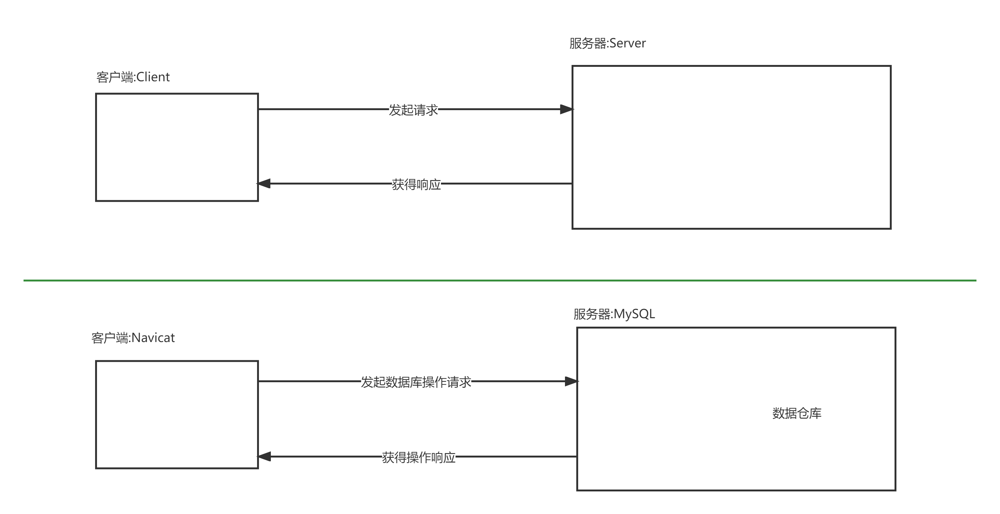


### MySQL的内部数据组织方式

>在MySQL中, 我们对数据的组织逻辑上是按照库/表/数据 这种结构组织的.
>
>数据库: 表示一份完整的数据仓库, 在这个数据仓库中分为多张不同的表.
>
>表:  表示某种特定类型数据的的结构化清单, 里面包含多条数据.
>
>数据: 表中数据的基本单元. 

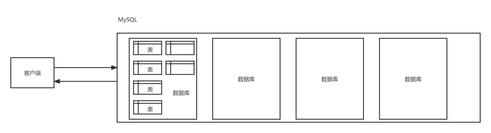

# SQL语法

## SQL语言

SQL语言

>SQL：结构化查询语言（Structured Query Language）简称SQL，是一种专门用来和数据库通信的语言，**用于向数据库存取数据以及查询、更新和管理关系数据库系统**。
>
>与其他语言(Java, C++...)不同的是, SQL由很少的词构成,  这是希望从数据库读写数据时能以更简单有效的方法进行. 

SQL有如下优点

>SQL语言不是某个特定的数据库提供的语言, 它是一种数据库标准语言.(最初由美国国家标准局 ANSI于1986年完成第一版SQL标准的定义,即SQL-86).这也就意味着每个关系型数据库都支持SQL语言.
>
>SQL简单易学, 是由多个描述性很强的单词构成, 并且这些单词数量不多.
>
>SQL尽管看上去很简单, 但是非常强有力; 灵活的使用SQL, 可以进行比较复杂的和高级的数据库操作.
>
>SQL不区分大小写(除非在某些数据库使用的时候做了特殊设置-不建议这种行为).

## SQL的基本操作

### 登录数据库

> mysql -u root -p      [回车]
>
> 输入密码

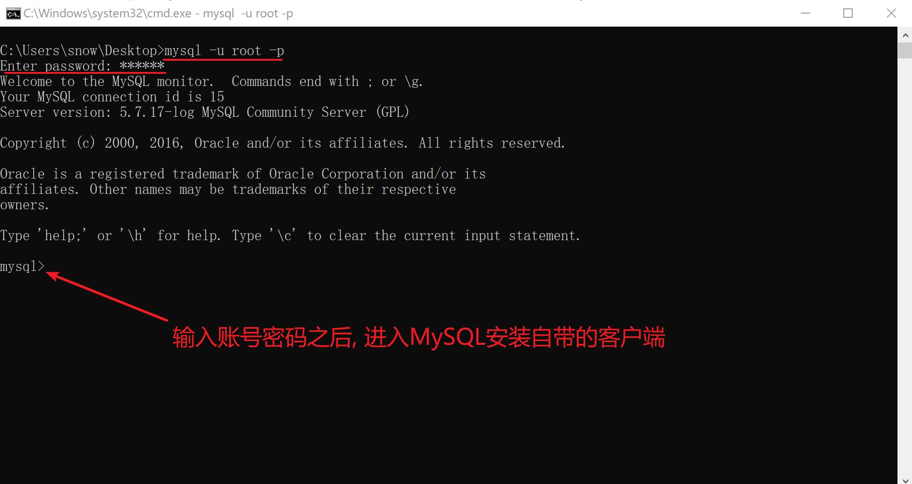

注1 :   注释

>```SQL
>-- <注释>; # 注释语句
># <注释>;  # 注释语句
>/*
>	<注释>   # 注释语句
>*/    
>```
>
>注意: 
>
>​		在数据库语句中如果我们需要注释某些内容, 一般有三种方式
>
>​		`--` 注释符(要注意的是`--`之后要有一个空格再接着书写注释内容)
>
>​		`#` 注释符 (之后不需要空格)
>
>​		`/* */` 注释符 (一般用于多行注释)

注2:   分号

>SQL语句应该要以分号作为结束

###  库操作

#### 查看数据库

>  show databases;  # 查看所有数据库 
>
> show databases like '%数据库名%'; # 查看和期望命名相匹配的数据库
>
> show create database 数据库名; # 查看数据库创建信息

``` sql
 show databases like 'test'; -- 指明就找test
 show databases like '%n';  -- 一个以n字符结束的数据库
 show databases like '%n%'; --  数据库名字中, 有一个n字符 

show create database test; -- 查看之前怎么创建的test数据库(sql语句是什么)
```

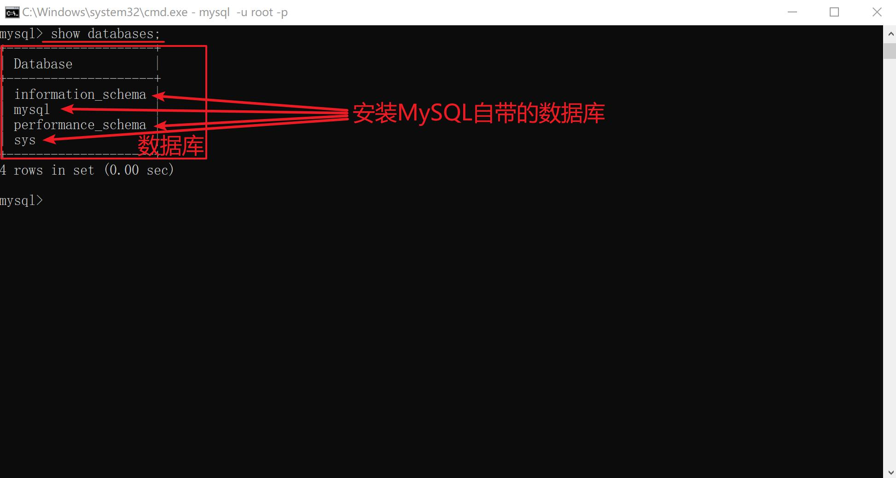

注:

>- information_schema：主要存储了系统中的一些`数据库对象信息`，比如用户表信息、列信息、权限信息、字符集信息和分区信息等。
>
>- mysql：MySQL 的核心数据库，主要负责存储数据库`用户、用户访问权限`等 MySQL 自己需要使用的控制和`管理信息`。常用的比如在 mysql 数据库的 user 表中修改 root 用户密码。
>
>   update mysql.user set authentication_string=password('123456') where user='root';
>
>   flush privileges; 
>
> - performance_schema：主要用于`收集数据库服务器性能参数`。
>
>- sys：sys 数据库主要提供了一些视图，数据都来自于 performation_schema，主要是让开发者和使用者更`方便地查看性能`问题。

#### 创建数据库

<span style=color:red;background:yellow>注意 ：库名，表名，列名均不区分大小写，所以如果要区分单词，使用下划线代替, 就不要使用驼峰命名了。</span>

> ```sql
> CREATE DATABASE [IF NOT EXISTS] <数据库名>
> [[DEFAULT] CHARACTER SET <字符集名>] 
> [[DEFAULT] COLLATE <校对规则名>];
> 
> eg:  
> 
> create database db47; --  创建一个db47的数据库, 有可能创建失败直接报错(假如数据库服务里面已经有一个db47的数据库了)
> create database if not exists db47;  -- 如果不存在名字为db47的数据库, 就创建db47, 如果已经存在了db47的数据库, 就不创建(也不报错)
> create database if not exists test character set utf8 collate utf8_bin; -- 创建一个指定字符编码格式的和指定排序规则的数据库
> ```
>
> - `[ ]`  可选。
> - <数据库名>：创建数据库的名称。
> - IF NOT EXISTS：在创建数据库之前进行判断，只有该数据库目前尚不存在时才能执行操作。 (不重要, 了解即可)
> - [DEFAULT] CHARACTER SET：指定数据库的字符集。
> - [DEFAULT] COLLATE：指定字符集的默认校对规则。

注:一些注意事项

>* MySQL中字符集:  UTF8 和UTF8MB4的区别 : 需要注意
>
>```Java
>(1)  5.5.3 版本以后的才支持UTF8MB4
>(2)  UTF8MB4是 UTF8 的超集并完全兼容UTF8。
>(3)  UTF8(也称UTF8MB3)，1字符最多使用3字节存储。 
>(4)  UTF8MB4，1字符最多使用4字节存储。(专门用来兼容4字节的UNICODE编码-平面设计-Emoji问题)。
>(5)  8版本默认字符集UTF8MB4
>```
>
>* MySQL中几个了解的校对规则: 了解即可
>
>```Java
>校对规则也可以称为排序规则，是指在字符与字符之间的比较规则。一个字符集有多种校对规则，每个字符集都有一个默认的校对规则。
>   
>eg: UTF8MB4
>(1) UTF8MB4_GENERAL_CI:  (默认规则),字符之间逐个比较,不区分大小写，在排序和比较效率更高。
>	一些特殊字符不能做到精准排序, 其实就是没有实现Unicode排序规则, 影响上实际并无所谓。
>(2) UTF8MB4_UNICODE_CI:  基于标准的Unicode来排序和比较,精确排序, 不区分大小写。
>(3) UTF8MB4_BIN: 字符直接用二进制数据编译存储，区分大小写，而且可以存二进制的内容。
>```
>

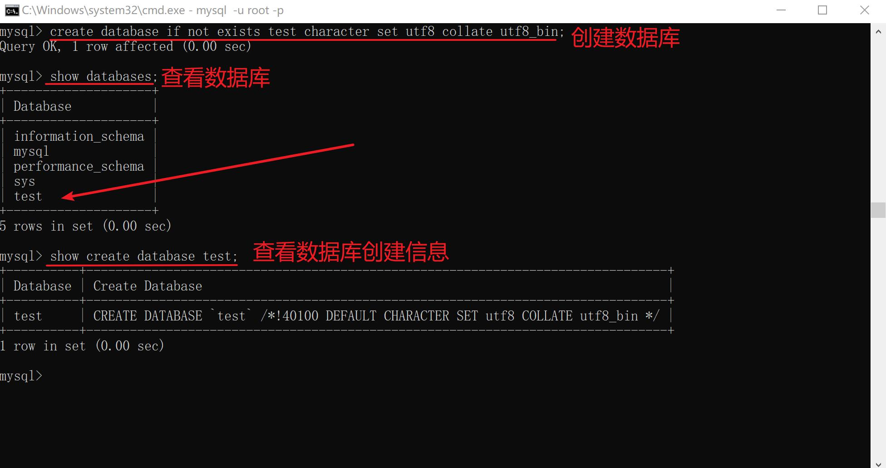

#### 删除数据库

>```sql
>DROP DATABASE [IF EXISTS]  <数据库名>;  # 删除数据库
>
>eg:  
>drop database test; # 删除test数据库
>```

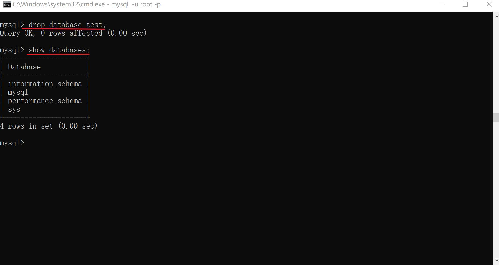

#### 修改数据库

>```SQL
>ALTER DATABASE [数据库名] 
>{  [ DEFAULT ] CHARACTER SET <字符集名> | [ DEFAULT ] COLLATE <校对规则名>  }
>
>eg:  
>alter database test character set utf8 collate utf8_bin;  # 把test数据库的编码改成utf8, 校对规则改为utf8_bin
>```
>
>数据库中只提供了对数据库使用的字符集和校对规则修改操作。

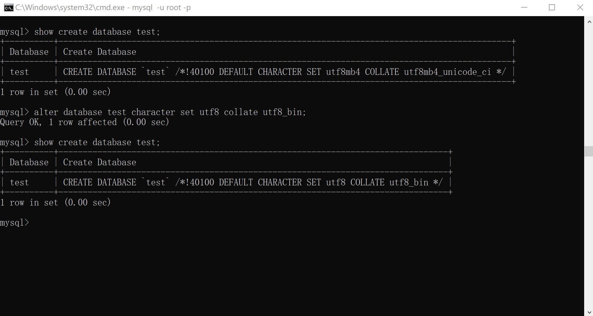

#### 选择数据库

>```SQL
>USE <数据库名>;  # 选择数据库
>
>eg: 
>use test; # 选择test数据库
>```
>
>一个MySQL系统中, 管理多个数据库。  我们只有进入对应的数据库中, 才能进一步操作数据库中的数据。

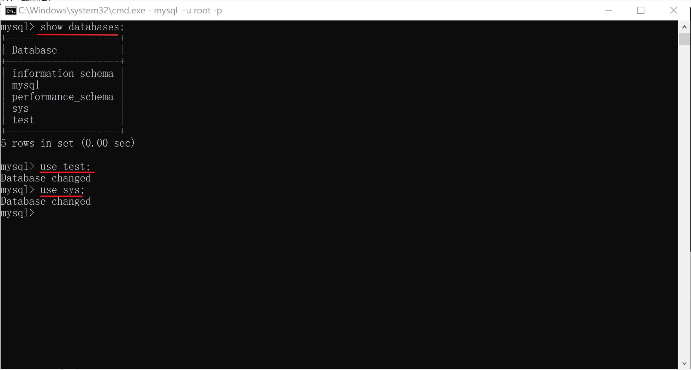

### 表操作

#### 常见的数据类型

>数据类型（DATA_TYPE）是指数据库所允许的数据的类型。
>
>[MySQL]()是一个数据存储容器,  数据类型定义了可以存储什么类型数据的规则。
>
>数据库是由多张表构成。其中每个表中对应的数据列,  都应该有适当的数据类型，用于限制或允许该列中存储的数据。

```java
// 注意: 我们为了方便理解, 可以把关系型数据库mysql中的数据类型先分为两类:  字符串  和  非字符串
//     为什么要这么分?
//     是因为一个字符串在mysql中占用的字节数, 是和设定的编码格式(库编码格式, 表编码格式, 列编码格式)息息相关的.
//     但是, 非字符串的数据在mysql中占用的字节数,  和预设的编码格式没有关系, 非字符串的数据占用的字节, 仅仅和它自己的类型相关
```


##### 整数

| MySQL的整数类型 | 占用字节 |                有符号                | 无符号                 | 说明       |
| :-------------- | -------- | :----------------------------------: | ---------------------- | ---------- |
| TINYINT(M)      | 1        |             -128  ~  127             | 0  ~  255              | 很小的整数 |
| INT/INTEGER(M)  | 4        | -2<sup>31</sup>  ~  2<sup>31</sup>-1 | 0  ~  2<sup>32</sup>-1 | 普通整数   |
| BIGINT(M)       | 8        | -2<sup>63</sup>  ~  2<sup>63</sup>-1 | 0  ~  2<sup>64</sup>-1 | 大整数     |

>注意1:
>
>​    INT和INTEGER在MySQL中并无区别, 仅是缩略写法.[link](https://dev.mysql.com/doc/refman/5.6/en/integer-types.html)。
>
>注意2:  关于`整数`设置'长度/宽度'问题。
>
>​	第一原则:无论给整数设置什么长度/宽度都不违背上述'有/无符号'表示的存储范围(上述范围表示是一切基本标准)。<span style="color:red">(存储数据可以存储多大的数据在整数上只和类型单位有关系, 和指明的长度和宽度没有关系)</span>
>
>​	第二原则: 设置长度之后, 如果存储的整数长度小于指定长度, 会默认在数字位前自动补空格, 以满足指定长度(但是这是不可见的), 也可以选择经过设置使用0填充;  设置长度之后, 如果存储的整数长度大于指定长度, 如果在表示范围内, 不做切割/不做处理, 直接存储。
>
>```SQL
>CREATE TABLE `tb_test`  (
>  `id` int NOT NULL,
>  `age` int ZEROFILL NULL, -- zerofill: 填充0
>   PRIMARY KEY (`id`)
>);
>```
>

##### 浮点数

| MySQL的浮点数 | 占用字节 | 说明   |
| ------------- | -------- | ------ |
| FLOAT(M, D)   | 4        | 单精度 |
| DOUBLE(M, D)  | 8        | 双精度 |

>* M: 精度, 表示总数据位数。 取值范围为(1～255)。
>
>* D: 标度, 表示小数位的位数。 取值范围为(1～30，且不能大于 M-2)。
>
>* FLOAT 和 DOUBLE 在不指定精度时，默认会按照实际的精度(由计算机硬件和操作系统决定)。
>
> ```SQL
> -- FLOAT 类型的取值范围如下：
> 有符号的取值范围：-3.402823466E+38～-1.175494351E-38。
> 无符号的取值范围：0 和 -1.175494351E-38～-3.402823466E+38。
> 
> -- DOUBLE 类型的取值范围如下：
> 有符号的取值范围：-1.7976931348623157E+308～-2.2250738585072014E-308。
> 无符号的取值范围：0 和 2.2250738585072014E-308～1.7976931348623157E+308。
> ```

##### 日期

| MySQL日期                               | 字节 | 日期格式            | 表示范围                                  |
| --------------------------------------- | ---- | ------------------- | ----------------------------------------- |
| YEAR                                    | 1    | YYYY                | 1901 ~ 2155                               |
| TIME                                    | 3    | HH:MM:SS            | -838:59:59 ~ 838:59:59                    |
| DATE                                    | 3    | YYYY-MM-DD          | 1000-01-01 ~ 9999-12-31                   |
| <span style="color:red">DATETIME</span> | 8    | YYYY-MM-DD HH:MM:SS | 1000-01-01 00:00:00 ~ 9999-12-31 23:59:59 |
| TIMESTAMP                               | 4    | YYYY-MM-DD HH:MM:SS | 1970-01-01 00:00:01 ~ 2038-01-19 03:14:07 |

>* year/YEAR范围:   1901~ 2155包含255个年份, 对应一个字节表示范围。
>
>* time/TIME范围:   11111111111111111111111(23位剩余一位符号位)--> 8388607(十进制)
>
>  ​					8388607:  838(小时位) xx(描述分钟) xx(描述秒)。
>
>* timestamp/TIMESTAMP范围:  (时间戳)
>
>  ​					1970年1月1日作为UNIX TIME的纪元时间(开始时间)。
>
>  ​					2<sup>31</sup>-1 = 2147483647 --> 24855(day)3(h)14(m)07(s)
>
>  ​					24855(day)3(h)14(m)07(s) + 1970-01-01 00:00:00 -> 2038-01-19 03:14:07。

#####  字符串: 重要

>```java
>// 一个字符串在mysql中占用的字节数, 是和设定的编码格式(库编码格式, 表编码格式, 列编码格式)息息相关的.
>```
>
>```java
>// 在MySQL中, 字符串本身分为两类:  
>// 1, 定长: char
>// 2, 变长: 其它字符串类型都是变长
>```
>
>```java
>// 和前面不同的是, 在mysql中使用字符串的时候, 必须指明字符串的最大存储长度
>// 并且指明了最大长度, 不可以存储数据的时候超过这个长度
>```
>
>```java
>char类型中存储多少字符和占用的字节数没有关系,  char类型占用的字节数 = 给char预设的最大长度*单子字符的占用字节
>```
>
>

| MySQL字符串 | 内存占用                        | 说明             |
| ----------- | ------------------------------- | ---------------- |
| CHAR(M)     | (M * 单个字符占用字节)          | 固定长度字符串   |
| VARCHAR(M)  | L+1  或者  L+2 字节 。          | 变长字符串       |
| TEXT(M)     | L+2字节 。  L: 0~2<sup>16</sup> | 变长文本字符串   |
| LONGTEXT(M) | L+4字节 。  L: 0~2<sup>32</sup> | 变长大文本字符串 |

>L:  存储字符的实际长度。
>
>M:  列的指定长度。
>
>- CHAR (M不设置默认为1) 范围可以设置最大255 。
>- VARCHAR最大长度为 65,535
>- TEXT 最大长度为 65535字符
>- LONGTEXT 最大长度长度为 4294967295 字符。

CHAR(10)  utf8(utf8mb3: 子一个字符占据三个字节 )  --> 固定字节:30字节

VARCHAR(10):  utf8(utf8mb3: 子一个字符占据三个字节 )  --> 不是30字节

"zs"  -> 6个

VARCHAR(10):  utf8mb4(utf8mb4: 子一个字符占据四个字节 )  --> 不是40字节

"zs"  -> 8个

TEXT(100)  :  utf8(utf8mb3: 子一个字符占据三个字节 )  

"zs" -> 6个

char(2)   utf8(一个字符3个长度)   6

#### 查看表

>```SQL
>SHOW TABLES;			 # 查看该数据库中所有表
>SHOW CREATE TABLE <表名>;	# 查看表的创建语句
>DESCRIBE <表名>;			# 查看表结构
>DESC <表名>;				# 查看表结构
>```

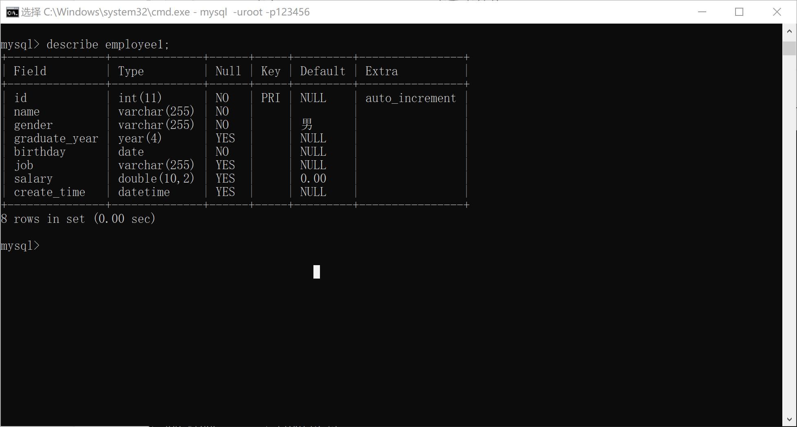

#### 创建表

>```SQL
>CREATE TABLE <表名>  (
>    <列名1> <类型1> ,
>    […] , 
>    <列名n> <类型n>
>)   [表选项] [分区选项];
>
>eg1:
>create table employee(
>   id int ,
>        name varchar(20),
>        gender char,
>        birthday date,
>        job varchar(20),	
>        salary double(10,2)
>     )
>
>eg2: 仅仅是个完善的写法示例, 一些写法完全没有必要(比如重复设置字符编码格式)
>CREATE TABLE  employee1  (
>id int(11) NOT NULL AUTO_INCREMENT COMMENT 'id',
>  name varchar(255) CHARACTER SET utf8mb4 COLLATE utf8mb4_general_ci NOT NULL DEFAULT '' COMMENT '姓名',
>  gender varchar(255) CHARACTER SET utf8mb4 COLLATE utf8mb4_general_ci NOT NULL DEFAULT '男' COMMENT '性别',
>  graduate_year year NULL DEFAULT NULL COMMENT '毕业时间',
>  birthday date NOT NULL COMMENT '生日',
>  job varchar(255) CHARACTER SET utf8 COLLATE utf8_bin NULL DEFAULT NULL COMMENT '职位名称',
>  salary double(10, 2) NULL DEFAULT 0.00 COMMENT '薪资',
>  create_time datetime NULL DEFAULT NULL COMMENT '信息创建时间',
>  PRIMARY KEY (id)
>  ) ;
>  ```
>  

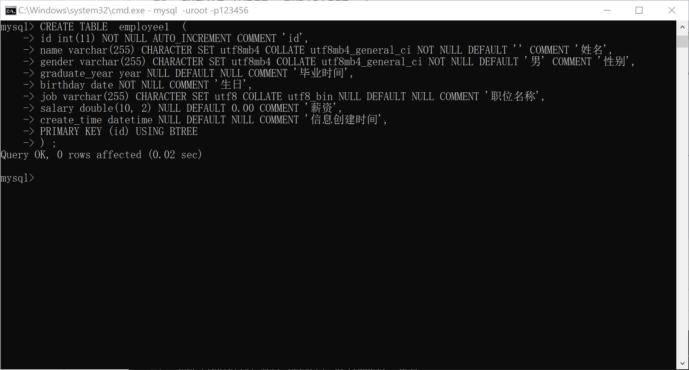

#### 主键和自增问题

>主键（PRIMARY KEY）又被称为''主键约束''，是 MySQL中使用非常频繁的约束。它有诸多作用(唯一标识, 查找效率...)。
>
>注意1:
>
>```SQL
>-- 每个表只能定义一个主键。
>-- 主键值必须唯一标识表中的每一行，且不能为 NULL，即表中不可能存在有相同主键值的两行数据。这是唯一性原则。
>```
>
>主键分类:
>
>```SQL
>主键分为单字段主键和多字段联合主键
>-- 单字段主键: 既将表中的一个字段设置主键; 通过 PRIMARY KEY 关键字来指定主键.
>CREATE TABLE table_primary1(
>id INT(11) PRIMARY KEY , -- 主键
>name VARCHAR(25),
>job VARCHAR(25),,
>salary FLOAT
>);
>CREATE TABLE table_primary2(
>id INT(11),
>name VARCHAR(25),
>job VARCHAR(25),
>salary FLOAT,
>PRIMARY KEY(id)
>);
>```
>
>注意2: 自增问题 AUTO_INCREMENT
>
>```SQL
>CREATE TABLE table_primary1(
>id INT(11) PRIMARY KEY AUTO_INCREMENT , -- 主键
>name VARCHAR(25),
>job VARCHAR(25),
>salary FLOAT
>);
>-- AUTO_INCREMENT 的初始值是 1，数据增加一条，该字段值自动加 1。
>-- AUTO_INCREMENT 字段应该要设置 NOT NULL 属性。
>-- AUTO_INCREMENT 约束的字段只能是整数类型。
>-- AUTO_INCREMENT 上限为所约束的类型的数值上限。
>```

#### 修改表

>表的修改操作： 了解(不是个重点)
>
>```SQL
>ALTER TABLE <表名> ADD COLUMN <列名> <类型>; # 添加列
>ALTER TABLE <表名> ADD <新字段名> <数据类型> FIRST; # 头位置添加列
>ALTER TABLE <表名> ADD <新字段名> <数据类型> AFTER <已经存在的字段名>; # 指定位置添加列
>ALTER TABLE <表名> MODIFY COLUMN <列名> <类型>;  # 修改某列类型
>ALTER TABLE <表名> CHANGE COLUMN <旧列名> <新列名> <新列类型>; # 修改列及类型
>ALTER TABLE <表名> ALTER COLUMN <列名> SET DEFAULT <默认值>; # 修改某列默认值
>ALTER TABLE <表名> ALTER COLUMN <列名> DROP DEFAULT; # 删除某列默认值
>ALTER TABLE <表名> DROP COLUMN <列名>; # 删除某列
>ALTER TABLE <表名> RENAME TO <新表名>; # 修改表名
>ALTER TABLE <表名> RENAME AS <新表名>; # 修改表名
>ALTER TABLE <表名> RENAME <新表名>; # 修改表名
>RENAME TABLE <表名> TO <新表名>; # 修改表名
>ALTER TABLE <表名> CHARACTER SET <字符集名>; # 修改表字符集
>ALTER TABLE <表名> COLLATE <校对规则名>; # 修改表排序规则
>ALTER TABLE <表名> [DEFAULT] CHARACTER SET <字符集名> [DEFAULT] COLLATE <校对规则名>;
>
>eg:
>alter table employee  add column height  float(5,2);
>alter table employee  add column height  float(5,2) first;
>alter table employee  add column height  float(5,2) after name;
>alter table employee modify  column age float(5, 0);
>alter table employee  change column age age1 float(5, 0);
>alter table employee alter column age set default 20;
>alter table employee alter column age drop default;
>alter table employee drop column height;
>alter table employee rename to aaa;
>alter table aaa rename as employee;
>alter table employee rename  aaa;
>rename table aaa to employee;
>alter table employee character set utf8mb4;
>alter table employee collate utf8mb4_unicode_ci;
>alter table employee character set gbk collate gbk_bin;
>```
>

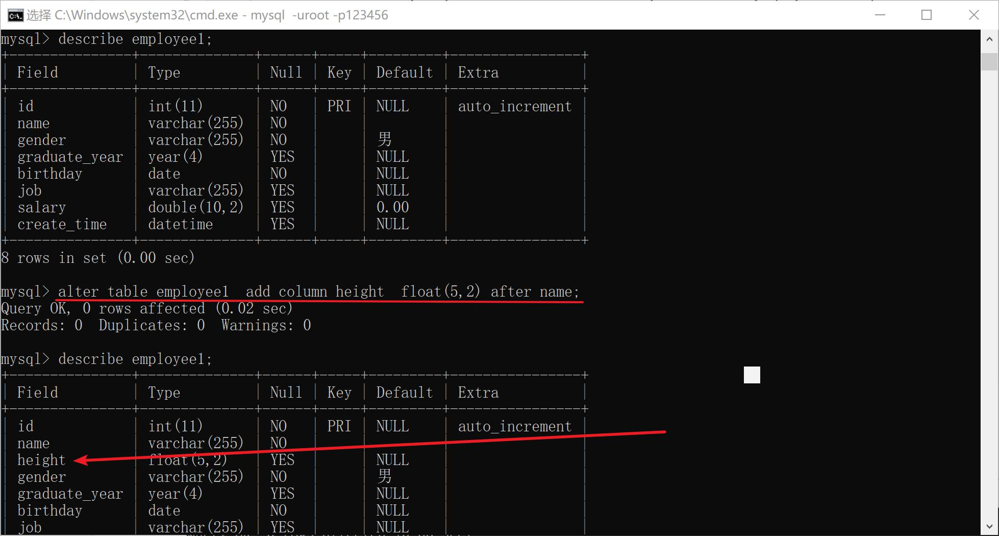

#### 删除表

>```SQL
>DROP TABLE [IF EXISTS] 表名1 [ ,表名2, 表名3 ...]
>
>eg:
>drop table if exists table_a, table_b, table_c;
>```
>

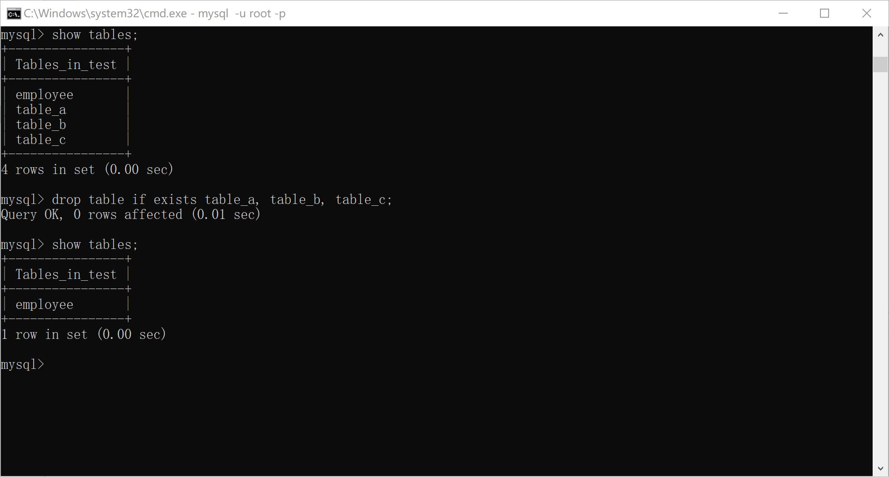

### 数据操作:  能手写

#### 添加数据

>```SQL
>INSERT INTO <表名> [ (<列名1>, … <列名n> )]  VALUES (值1, … 值n), … (值1, … 值n);
>INSERT INTO <表名> SET <列名1>=<值1>, … <列名n>=<值n>;
>
>eg:
>insert into employee1 (id, name, gender, graduate_year, birthday, job, salary, create_time) values(1, 'zs', '男', 2022, '1999-01-01', '程序员',  100.2, '2022-09-09 16:51:49');
>
>insert into employee1 (id, name, gender, graduate_year, birthday, job, salary, create_time) values(1, 'zs', '男', 2022, '1999-01-01', '程序员',  100.2, '2022-09-09 16:51:49'),(2, 'ls', '男', 2020, '1997-01-01', '程序员',  10000.2, '2022-09-09 16:51:50');
>
>insert into employee1  set id=4, name='ls', gender='男', graduate_year=2022, birthday='1999-01-01', job='程序员', salary=220.05,  create_time='2022-09-09 16:55:49';
>```
>
>* 如果values中包含数据和表列数据一一对应(无省略, 即满列),  那么在插入语句中可以省略表名之后的列名。eg: insert   into  表名  values (值1, … 值n);
>* values中的内容应该要与对应插入字段对应。
>* 数据中字符串和日期应该包含在引号中。

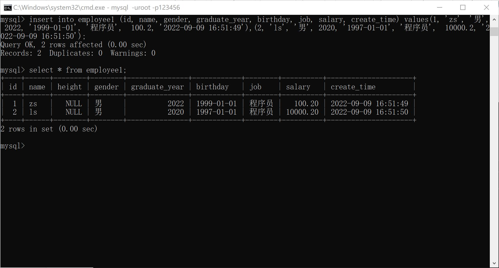

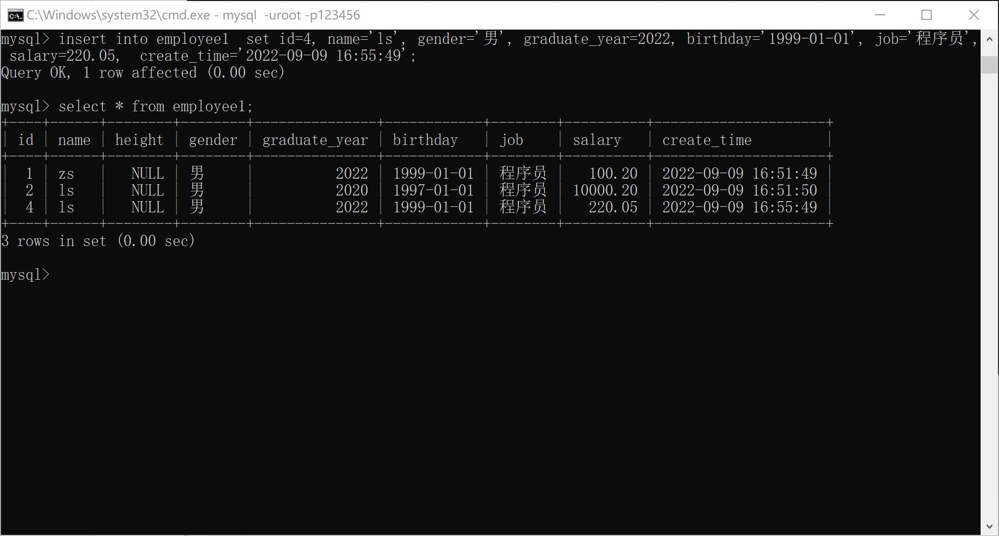

#### 查询数据

>```SQL
>SELECT  *  FROM <表名字>  [ WHERE  <条件> ];
>SELECT  <列名1>, …<列名n>  FROM <表名字>  [ WHERE  <条件> ];
>
>eg:
>select * from employee1;
>select * from employee1 where id<20;
>select name from employee1 where id>1;
>select name, job, salary from employee1 where salary> 200;
>```
>
>* 查询的结果是一个新的临时表。
>* 在MySQL中 `select * from 表名 where 1;` 表示查询所有数据。

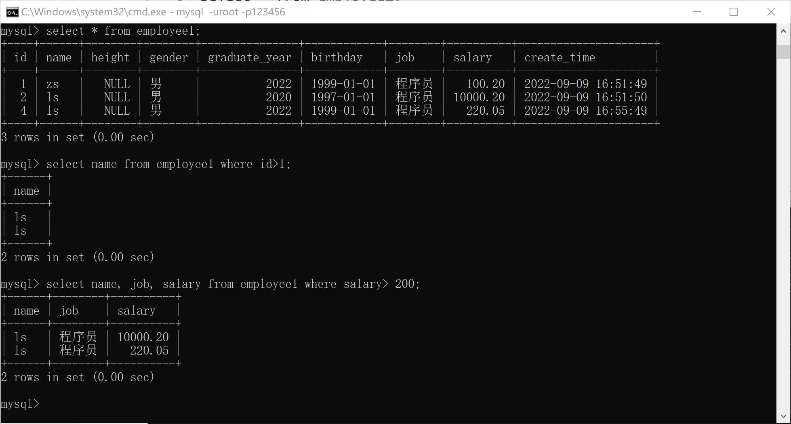

#### 修改数据

>```SQL
>UPDATE <表名> SET 列1=值1 [, 列2=值2 … ] [WHERE <条件> ]
>
>eg:
>update employee1 set job='老程序员'where salary >10000;
>```
>
>* 注意如果没有where子句指明条件, 那么修改就是对所有行的修改。
>* 修改一行数据的多个列值时，SET 子句的每个值用逗号分开即可。

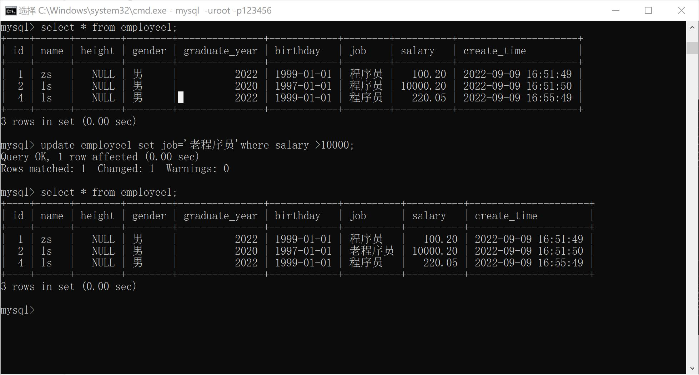

#### 删除数据

>```SQL
>DELETE FROM <表名> [WHERE <条件>]
>
>ag:
>delete from employee;
>delete from employee where id=4;
>```
>
>注意:
>
>* 如果没有where以及条件, 默认删除是表中所有数据。
>* delete不能单独只删除某一列数据, delete删除数据的最小单元为行。
>* delete语句仅删除数据记录, 删除的不是表, 如果要删除表需要使用drop table语句。
>* 数据都是有价值的, 工作中一般不进行物理删除操作

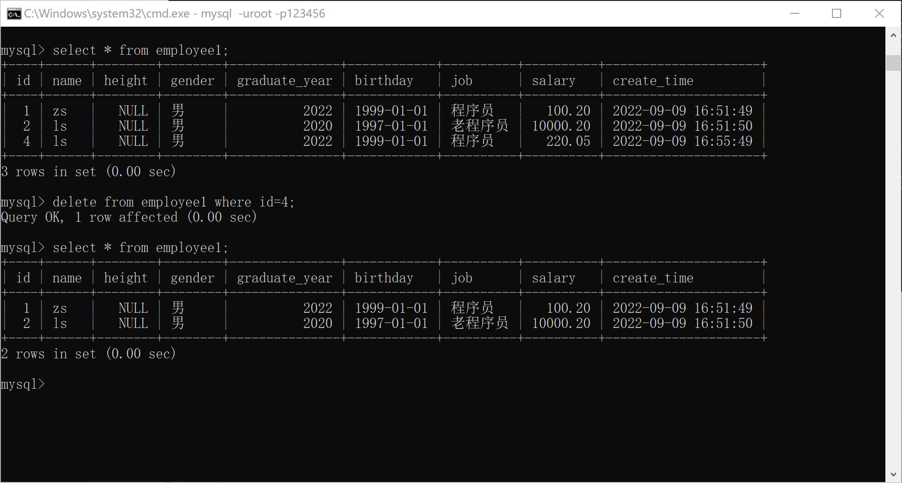

## 特殊关键字: 重要

数据基础

```SQL
CREATE TABLE `students`  (
`id` int(11)  PRIMARY KEY  AUTO_INCREMENT,
`name` varchar(255)   ,
`class` varchar(255)  ,
`chinese` float  ,
`english` float  ,
`math` float  
) ;
```

```SQL
INSERT INTO students (id, name, class, chinese, english, math) VALUES (1, '武松', '一班', 70, 90, 60);
INSERT INTO students VALUES (2, '林冲', '一班', 70, 90, 90);
INSERT INTO students VALUES (3, '松江', '一班', 90, 90, 20);
INSERT INTO students VALUES (4, '贾琏', '二班', 60, 60, 60);
INSERT INTO students VALUES (5, '贾宝玉', '二班', 95, 80, 5); 
INSERT INTO students VALUES (6, '贾环', '二班', 25, 25, 5); 
INSERT INTO students VALUES (7, '曹操', '三班', 90, 90, 90); 
INSERT INTO students VALUES (8, '曹丕', '三班', 90, 80, 80); 
INSERT INTO students VALUES (9, '曹植', '三班', 98, 90, 80); 
INSERT INTO students VALUES (10, '刘备', '三班', 95, 90, 80); 
INSERT INTO students VALUES (11, '诸葛亮', '三班', 98, 95, 95); 
INSERT INTO students VALUES (12, '孙权', '三班', 80, 90, 80); 
INSERT INTO students (id) VALUES (13);
```

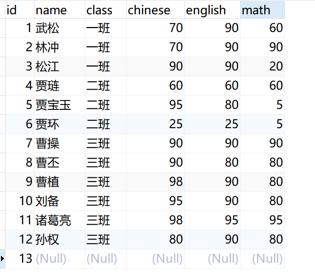


### Where

> 使用 WHERE 关键字并指定`查询条件|表达式`, 从`数据表`中获得`满足条件`的数据内容.
> <font color=red><b>使用位置：</b></font>查询语句（select），更新语句（update），删除语句（delete）。<span style=color:yellow;background:red>**在update里，和delete必须要用。 **</span>

```SQL
SELECT <查询内容|列等> FROM  <表名字> WHERE <查询条件|表达式>

eg:
select id, name from students where id > 10;

-- 在update里面，只修改满足条件的数据
UPDATE table_name SET column1=value1, column2=value2 where 条件;

-- 在delete里面，只删除满足条件的数据
DELETE FROM TABLE_NAME WHERE 条件;


```


<b>在构建Where的`条件`的过程中, 我们可能需要了解到一些重要的`SQL运算符`</b>

1, 算术运算符

| 运算符 | 作用 |
| ------ | ---- |
| +      | 加   |
| -      | 减   |
| *      | 乘   |
| /      | 除   |
| %      | 取余 |

```SQL
-- 算术运算符，不仅可以出现在where中，还可以出现在查询列中。

-- 语数外总分 小于180的
-- 语文-数学 分差大于30的
-- 加权平均，按语文0.5 英语0.1 数学0.4求加权平均分
-- 加权平均分，小于等于60的
-- 求每个人的平均分，语数外三科
-- 求每个人的平均分，只筛选出平均分小于60的
-- eg:
-- 语数外总分 小于180的
	select * from students where (chinese + english + math) < 180; 
	
-- 语文和数学 分差大于30的
	select * from students where (chinese - math) > 30; 
	
-- 加权平均，按语文0.5 英语0.1 数学0.4求加权平均分
	select *, (chinese*0.5 + english*0.1 + math *0.4) from students; 
	
-- 加权平均分，小于等于60的
	select *, (chinese*0.5 + english*0.1 + math *0.4)  from students where (chinese*0.5 + english*0.1 + math *0.4) <= 60 ;  
	
-- 求每个人的平均分。语数外
    select *, (chinese + english + math) / 3 from students ;  
    
-- 求每个人的平均分，只筛选出平均分小于60的
    select *, (chinese + english + math) / 3 from students  where (chinese + english + math) /3  < 60; 
```

2, 比较和逻辑运算符

| 运算符      | 作用       | 运算符      | 作用                      |
| ----------- | ---------- | ----------- | ------------------------- |
| =           | 等于       | <=>         | 等于(可比较null)          |
| !=          | 不等于     | <>          | 不等于                    |
| <           | 小于       | >           | 大于                      |
| <=          | 小于等于   | >=          | 大于等于                  |
| is null     | 是否为null | is not null | 是否不为null              |
| between and | 在闭区间内 | in          | 是否在列表内              |
| not in      | 不在列表内 | like        | 通配符匹配(%:通配, _占位) |
| and         | 与         | &&          | 与                        |
| or          | 或         | \|\|        | 或                        |

需要注意的：

- `=`无法判断null。一般使用 is null来单独处理null
- like中，%表示通配，`_`表示占位。 一个`_`代表一个字符。


```SQL
select * from students where chinese = 60;
select * from students where chinese <=> 60;
select * from students where chinese != 60;
select * from students where chinese <=> 60;
select * from students where  chinese < 60;
select * from students where  chinese > 90;
select * from students where  chinese <= 60;
select * from students where  chinese >= 90;
select * from students where  chinese is null;
select * from students where  chinese is not null;
select * from students where  chinese between 60 and 90;
select * from students where  chinese in (60 , 90);
select * from students where  chinese not in (60 , 90);
select * from students where  name = '曹操';
select * from students where  name like '曹操';
select * from students where  name like '曹%';
select * from students where  name like '曹%'  and  chinese = 90;
select * from students where  name like '曹%'  &&  chinese = 90;
select * from students where  name like '曹%'  or  chinese = 90;
select * from students where  name like '曹%'  ||  chinese = 90;
```


### Distinct

使用`DISTINCT`对数据表中`一个或多个字段`重复的数据进行过滤，重复的数据只返回其`一条`数据给用户.


```SQL
SELECT DISTINCT <字段名> FROM <表名>;

eg:
-- 返回所有的 class
select class from students;

-- 返回不重复的 class
select distinct class from students;


-- 返回所有去重后的英语成绩
-- 6条
select distinct english from students;

-- 返回两列 英语和数学去重后的结果。
-- 10条
select distinct english,math from students;

-- 13条
-- 90.90 重复了一条
-- 90,80 重复了两条
select english,math from students;
```

注意:

```SQL
-- DISTINCT 只能在SELECT语句中使用。
-- 当对一个或多个字段去重时，DISTINCT 要写在所有字段的最前面。
-- 如果 DISTINCT 对多个字段去重时，只有多个字段组合起来完全是一样的情况下才会被去重。
```

### Limit 

>使用`LIMIT`对数据表查询结果集大小进行限定.一般用来做，比如限制最大的返回数目,或者是做分页。
>
>```SQL
>SELECT <查询内容|列等> FROM  <表名字> LIMIT 记录数目
>SELECT <查询内容|列等> FROM  <表名字> LIMIT 初始位置，记录数目;
>SELECT <查询内容|列等> FROM  <表名字> LIMIT 记录数目 OFFSET 初始位置;
>
>eg:
>-- 限制数目 为number个
>select * from tableName where condition limit number;
>
>-- 偏移量为offsetNumber 从0开始
>select * from tableName where condition limit offsetNumber, number;
>
>-- 偏移量offsetNumber
>select * from tableName where condition limit number offset offsetNumber;
>
>eg:
>select * from students limit 3;
>select * from students limit 4, 3;
>select * from students limit 3 offset 4;
>```
>
>LIMIT 记录数目: 从第一条开始, 限定记录数目
>
>LIMIT 初始位置，记录数目: 从起始位置开始, 限定记录数目
>
>LIMIT 记录数目 OFFSET 初始位置: 从起始位置开始, 限定记录数目
>
>注意: 数据(默认下标从0开始)

### As

>`AS` 关键字用来为表和字段指定别名.
>
>```SQL
><内容> AS <别名>
>
>-- 可以为取出来的列名 取一个别名
>select id,name as student_name,class from students;
>
>-- 可以为一些计算的属性取别名
>select (chinese + english + math) as total_score from students;
>
>-- 也可以为表名取别名
>select s.name from students as s;
>
>select s.name from students s;
>
>-- as 可以省略
>
>```
>

### Order By

>`ORDER BY`对查询数据结果集进行排序.
>
>```SQL
>SELECT <查询内容|列等> FROM  <表名字> ORDER BY <字段名> [ASC|DESC];
>
>eg: 
>select * from students order by chinese;
>select * from students order by chinese asc;
>select * from students order by chinese desc;
>select * from students order by chinese, english;
>select * from students order by chinese desc, english desc, math desc;
>```
>
>不加排序模式: 升序排序.
>
>ASC: 升序排序.
>
>DESC: 降序排序.
>
>注意:  如上查询, 当我们进行多字段排序的时候, 会先满足第一个列的排序要求, 如果第一列一致的话, 再按照第二列进行排序, 以此类推.

### Group By

>使用 GROUP BY 关键字,对数据进行分组
>
>```SQL
>SELECT <查询内容|列等> FROM  <表名字> GROUP BY  <字段名...>
>
>eg: 
>select class, group_concat(name), group_concat(chinese) from students group by class;
>
>-- 获取语文成绩大于90分的，按照班级分组
>select class, group_concat(name) from students where chinese > 90 group by class;
>
>-- 获取班级的平均分	
>select class, group_concat(name), avg(chinese) from students group by class;
>
>-- 获取班级人数大于三个人的班级
>select class, group_concat(name) from students group by class having count(*) > 3;
>
>-- 获取班级平均语文成绩大于60分的
>select class, group_concat(name), avg(chinese) from students group by class having avg(chinese) > 60;	
>```
>
>GROUP_CONCAT()函数会把每个分组的字段值都显示出来.
>
>HAVING 可以让我们对分组后的各组数据过滤。(一般和分组+聚合函数配合使用)
>
><font color=red>**having注意和where的区别**</font>
>where主要用于对原始表进行过滤。having是对group by 后的结果进行过滤，一般配合聚合函数一起使用。
>
><span style=color:red;background:yellow>**注意点：**</span>
>
>- `group by`的select列中，只能有两种，<font color=red>**在group中出现的字段**</font>，<font color=red>**聚合函数聚合起来的东西**</font>
>- HAVING、SELECT，GROUP BY，他们后面列之间的关系
>
>```SQL
>SELECT A, C,COUNT(A)
>GROUP BY A,B,C
>HAVING A>1
>/*
>SELECT后面的字段如果是表中现有的列，则GROUP BY子句中也必须有这个列。
>GROUP BY后面如果是A,B,C：
>SELECT后面跟的列，只要包含在A,B,C中就可以了。可以是A,B,C，也可以是A,B，也可以是A,C，也可以是A，但不能是A,D。
>*/
>```
>

### 聚合函数

>聚合函数一般用来计算列相关的指定值. `通常`和`分组`一起使用(大多数情况)
>
>聚合函数, 有的时候也可以单独使用 
>
>| 函数  | 作用   | 函数 | 作用   |
>| ----- | ------ | ---- | ------ |
>| COUNT | 计数   | SUM  | 和     |
>| AVG   | 平均值 | MAX  | 最大值 |
>| MIN   | 最小值 |      |        |

- COUNT: 计数

  >```SQL
  >SELECT <查询内容|列等> , COUNT <列|*> FROM  <表名字> GROUP BY HAVING COUNT <表达式|条件>
  >
  >eg:
  >select count(*) from students 
  >select count(name) from students 
  >
  >-- 和分组一起使用。查看每个班级有多少人树
  >select class, group_concat(name), count(*) from students group by class;
  >-- 按照班级分组,通过having进行筛选 查看班级人数大于2的班级
  >select class, group_concat(name), count(*) from students group by class having count(*) > 2;
  >```
  >
  >COUNT(*):  表示表中总行数
  >
  >COUNT(列): 计算除了列值为NULL以外的总行数

- SUM: 求和

  >```SQL
  >SELECT <查询内容|列等> , SUM<列> FROM  <表名字> GROUP BY HAVING SUM<表达式|条件>
  >
  >eg:
  >select sum(chinese) from students;
  >select sum(chinese), sum(english), sum(math) from students;
  >
  >-- 查看每个班级的语文总分
  >select class, group_concat(name), sum(chinese) from students group by class;
  >-- 查询班级语文总分大于200的班级
  >select class, group_concat(name), sum(chinese) from students group by class having sum(chinese)>200;
  >
  >select class, group_concat(name), sum(chinese), sum(math) from students group by class;
  >select class, group_concat(name), sum(chinese), sum(math) from students group by class having sum(chinese)>200 and sum(math) > 200;
  >
  >```

- AVG: 平均值

  >```SQL
  >SELECT <查询内容|列等> , AVG<列> FROM  <表名字> GROUP BY HAVING AVG<表达式|条件>
  >
  >eg:
  >-- 查看语文的总平均分
  >select avg(chinese) from students;
  >-- 查看各科平均分
  >select avg(chinese), avg(english), avg(math) from students;
  >-- 按班级查看语文平均分
  >select class, group_concat(name), avg(chinese) from students group by class;
  >-- 查询班级语文平均分大于60的班级与平均分 
  >select class, group_concat(name), avg(chinese) from students group by class having avg(chinese)>=60;
  >-- 按班级查看各科平均分
  >select class, group_concat(name), avg(chinese), avg(math) from students group by class;
  >-- 查询班级语文和数学平均分都大于60的班级与平均分 
  >select class, group_concat(name), avg(chinese), avg(math) from students group by class having avg(chinese)>=60 and avg(math) >=60;
  >```

- MAX: 最大值

  >```SQL
  >SELECT <查询内容|列等> , MAX<列> FROM  <表名字> GROUP BY HAVING MAX<表达式|条件>
  >
  >eg: 
  >
  >select max(chinese) from students;
  >select max(chinese), max(english), max(math) from students;
  >select class, group_concat(name), max(chinese) from students group by class;
  >select class, group_concat(name), max(chinese) from students group by class having max(chinese)>90;
  >select class, group_concat(name), max(chinese), max(math) from students group by class;
  >select class, group_concat(name), max(chinese), max(math) from students group by class having max(chinese)>=90 and max(math) >=70;
  >```

- MIN: 最小值

  >```SQL
  >SELECT <查询内容|列等> , MIN<列> FROM  <表名字> GROUP BY HAVING MIN<表达式|条件>
  >
  >eg:
  >    select min(chinese) from students;
  >    select min(chinese), min(english), max(math) from students;
  >    select class, group_concat(name), min(chinese) from students group by class;
  >    select class, group_concat(name), min(chinese) from students group by class having min(chinese)>60;
  >    select class, group_concat(name), min(chinese), min(math) from students group by class;
  >    select class, group_concat(name), min(chinese), min(math) from students group by class having min(chinese)>=60 and min(math) >=60;
  >```


## SQL执行顺序

```SQL
(5) SELECT column_name, ... 
(1) FROM table_name, ... 
(2) [WHERE ...] 
(3) [GROUP BY ...] 
(4) [HAVING ...] 
(6) [ORDER BY ...];
(7)	[Limit ...]

eg:
	select class, group_concat(name), avg(chinese) as chineseA, avg(math) from students where chinese >= 60 group by class having  avg(math)>=40 order by chineseA desc  limit 0, 1;
```

>- SQL语句的关键字是有顺序的，需要按照上面的顺序来写
>- 小括号中的数字代表执行顺序
>- having和select的执行顺序收到优化器的影响，可能会改变执行顺序

## 数据库中表和数据的设计规范:数据完整性

为了在实际工程环境中更好的使用和维护数据库数据, 在我们设计和使用数据库的库/表/数据的时候, 一般要遵循数据完整性规则; 

而数据完整性又包含: 

1. 实体完整性;
2. 域完整性;
3. 参照完整性

### 实体完整性

<span style="color:red">保证`表`中的`每一行数据`都是`表`中唯一的实体.</span>即一个表中每一条数据都应该是唯一的

实体完整性是为了保证表中`数据唯一`, 实体完全可由`主键`实现

**主键(primary key)**

- 一个表只能有一个主键
- <font color=red>**主键具有唯一性**</font>
- <font color=red>**主键字段的值不能为null**</font>
- 声明字段时，用 primary key 标识

```SQL
-- 方式一
create table test_primary_key(
    -- 代表这个 columnName是主键
	columnName columnType primary key,
	......
)
-- 方式二
create table test_primary_key2(
	columnName columnType,
	......,
	primary key(columnName)
)

```


**auto_increment 自动增长约束**
一些序号，没有必须手动生成，想让mysql自动生成。

- 自动增长必须为主键
- 只能存在一个字段为自动增长。
- 默认为1开始自动增长。

```SQL
create table test_auto_increment(
	columnName columnType primary key auto_increment,
	......
)
```


>```SQL
>-- 默认从1开始
>CREATE TABLE `students`  (
>`id` int(11)  PRIMARY KEY  AUTO_INCREMENT,
>`name` varchar(255)   ,
>`class` varchar(255)  ,
>`chinese` float  ,
>`english` float  ,
>`math` float  
>) ;
>
>-- 从指定值开始(从1000开始)
>create table stu(  
>	id int PRIMARY KEY auto_increment,  
>	name varchar(20),  
>	age int,  
>	class varchar(20)
>) auto_increment=1000 ;
>```
>


###  域完整性

><span style="color:red">`域完整性`表示保证表中数据的`字段`的`取值`在`有效范围`之内`或者`符合特定的`数据类型`约束</span>,即保证某些列不能输入无效的值
>
>比如这个人的姓名,不能输入null这种值
>
>```SQL
>CREATE TABLE `students`  (
>`id` int(11) NOT NULL PRIMARY KEY AUTO_INCREMENT,
>`name` varchar(10)  NOT NULL DEFAULT "张飞",
>`class` varchar(5)  NULL DEFAULT NULL,
>`chinese` float NOT NULL,
>`english` float NOT NULL,
>`math` float NOT NULL
>);
>```
>
><span style="color:red">`float`, `varchar`,`NULL`, `NOT NULL`, </span>

### 参照完整性

><span style="color:red">`参照完整性`用于确保`相关联`的表间的`数据`应该要`保持一致`.</span>
>
>避免因为一个表的数据/记录修改, 造成另一个表的内容变为无效的值. 一般来讲, 参照完整性是通过外键和主键来维护的.
>
>```SQL
>CREATE TABLE `class`  (
>`id` int NOT NULL PRIMARY KEY,
>`name` varchar(255) NULL
>);
>INSERT INTO `class` (`id`, `name`) VALUES (1, '一班');
>INSERT INTO `class` (`id`, `name`) VALUES (2, '二班');
>INSERT INTO `class` (`id`, `name`) VALUES (3, '三班');
>
>alter table `students` 
>add column `class_id` int null after `math`,
>add constraint `班级` foreign key (`class_id`) references `class` (`id`);
>-- CONSTRAINT 外键名 FOREIGN KEY(要作为外键字段名) REFERENCES 主表名(主表中关联的字段);
>-- ALTER TABLE <表名> DROP FOREIGN KEY <外键约束名>;删除外键
>
>
>-- 再比如有2张表省份表province , 城市表city
>create table province(
>	id int PRIMARY KEY,
>	name varchar(20)
>);
>
>create table city(
>	id int ,
>	name varchar(20),
>	province_id int,
>	-- 声明外键
>    -- CONSTRAINT 外键名称 foreign key(列) references 表名(列名)
>	CONSTRAINT fk_pid foreign key(province_id) REFERENCES province(id)
>);
>
> 
>insert into province values(41, "河南省");
>insert into province values(43, "湖南省");
>insert into province values(42, "湖北省");
>
>-- 城市表插入
>
>-- 插入城市表的时候会去寻找有没有23对应的省份，如果有，插入
>-- 如果没有，那么会报错
>insert into city values (6,'哈尔滨',23);
>
>-- 不能删除还有子行的数据
>delete from province where id = 32;
>```
>
><span style="color:red">`FOREIGN KEY` </span>
>
>1,  外键优缺点
>
>- 优点：能够限制数据的增加、删除或者是修改操作，来保证数据的强一致性, 避免出错。
>
>- 缺点：
>
>1. 在插入/修改子表（student）的数据的时候，需要去父表（class）中找对应的数据
>2. 在删除/修改父表（class）的数据的时候，需要去检查子表（student）中是否有对应的数据
>
>3. 有了外键之后，影响了增加、删除、修改的性能
>
>```SQL
>在公司中，大家觉得应不应该使用外键呢？看具体的情况
>1. 假如公司表中的数据量不大（外键对效率的影响比较小，甚至可以忽略），可以考虑使用外键
>2. 假如公司数据库表中的数据很多，（外键对于效率的影响就会很大），不应该使用外键
>
>结论:----->不要使用
>```

# SQL和多表问题

数据基础 

表结构

>```SQL
>
>-- 班级表
>CREATE TABLE  `class`  (
>`id` int(11) NOT NULL PRIMARY KEY COMMENT '班级id',
>`name` varchar(255) NULL DEFAULT NULL COMMENT '班级名称' 
>) ;
>
>-- 学生表
>CREATE TABLE `student`  (
>`id` int(11) NOT NULL PRIMARY KEY ,
>`class_id` int(11) NULL DEFAULT NULL,
>`name` varchar(255) NULL DEFAULT NULL,
>`nick_name` varchar(255) NULL DEFAULT NULL,
>`mobile` varchar(255) NULL DEFAULT NULL,
>`era` varchar(255) NULL DEFAULT NULL,
>`motto` varchar(255) NULL DEFAULT NULL
>);
>
>-- 学生成绩表
>CREATE TABLE `score`  (
>`id` int(11) NOT NULL  PRIMARY KEY  AUTO_INCREMENT,
>`student_id` int(11)  NULL DEFAULT NULL,
>`chinese` float NULL DEFAULT NULL,
>`english` float NULL DEFAULT NULL,
>`math` float NULL DEFAULT NULL
>) ;
>
>
>-- 剧本剧目表
>CREATE TABLE `script`  (
>`id` int(11) NOT NULL  PRIMARY KEY,
>`play_name` varchar(255)   NULL DEFAULT NULL,
>`play_ location` varchar(255)   NULL DEFAULT NULL
>) ;
>
>-- 剧本-学生关系表
>CREATE TABLE `script_ref`  (
>`id` int(11) NOT NULL  PRIMARY KEY,
>`student_id` int(11)   NULL DEFAULT NULL,
>`script_id` int(11)   NULL DEFAULT NULL
>) ;
>
>
>```
>

插入数据

>```SQL
>-- 班级
>INSERT INTO `class` VALUES (1, '一班');
>INSERT INTO `class` VALUES (2, '二班');
>INSERT INTO `class` VALUES (3, '三班');
>INSERT INTO `class` VALUES (4, '四班');
>INSERT INTO `class` VALUES (5, '五班');
>
>select * from class;
>
>-- 学生表
>INSERT INTO `student` VALUES (1, 1,'武松', '行者', '13440996665', '宋朝', '别胡说!难道不付你钱!再筛三碗来!');
>INSERT INTO `student` VALUES (2, 1,'林冲', '豹子头', '17383945041', '宋朝', '无');
>INSERT INTO `student` VALUES (3, 1,'宋江', '及时雨', '15671722818', '宋朝', '他日若遂凌云志,敢笑黄巢不丈夫');
>INSERT INTO `student` VALUES (4, 2,'贾琏', '琏二爷', '19931477852', '清朝', '无');
>INSERT INTO `student` VALUES (5, 2,'贾宝玉', '怡红公子', '13456229050', '清朝', '我要这玉又何用');
>INSERT INTO `student` VALUES (6, 2,'贾环', '孽障', '18900141462', '清朝', '无');
>INSERT INTO `student` VALUES (7, 3,'曹操', '阿满', '17273083171', '三国', '宁我负人，毋人负我');
>INSERT INTO `student` VALUES (8, 3,'曹丕', '子桓', '17180453185', '三国', '无');
>INSERT INTO `student` VALUES (9, 3,'曹植', '陈思王', '19818008917', '三国', '无');
>INSERT INTO `student` VALUES (10, 3,'刘备', '刘皇叔', '15638204378', '三国', '惟贤惟德,能服行人');
>INSERT INTO `student` VALUES (11, 3,'诸葛亮', '诸葛武侯,卧龙', '15119511196', '三国', '非淡泊无以明志，非宁静无以致远');
>
>
>select * from student
>
>-- 分数表
>INSERT INTO score VALUES (1, 1, 70, 90, 60);
>INSERT INTO score VALUES (2, 2, 70, 90, 90);
>INSERT INTO score VALUES (3, 3, 90, 90, 20);
>INSERT INTO score VALUES (4, 4, 60, 60, 60);
>INSERT INTO score VALUES (5, 5, 95, 80, 5); 
>INSERT INTO score VALUES (6, 6, 25, 25, 5); 
>INSERT INTO score VALUES (7, 7, 90, 90, 90); 
>INSERT INTO score VALUES (8, 8, 90, 80, 80); 
>INSERT INTO score VALUES (9, 9, 95, 90, 80); 
>INSERT INTO score VALUES (10, 10, 98, 95, 95); 
>INSERT INTO score VALUES (11, 11, 80, 90, 80); 
>select * from score;
>
>-- 剧目表
>INSERT INTO `script` VALUES (1, '三打祝家庄', '祝家庄');
>INSERT INTO `script` VALUES (2, '梁山聚义', '梁山');
>INSERT INTO `script` VALUES (3, '壮士落幕', '六和寺');
>INSERT INTO `script` VALUES (4, '赤壁之战', '赤壁');
>INSERT INTO `script` VALUES (5, '七步诗事件', '洛阳');
>INSERT INTO `script` VALUES (6, '白帝城托孤', '白帝城');
>INSERT INTO `script` VALUES (7, '煮酒论英雄', '许昌');
>
>
>
>-- 剧目-学生关系表
>INSERT INTO `script_ref` VALUES (1, 1, 1);
>INSERT INTO `script_ref` VALUES (2, 2, 1);
>INSERT INTO `script_ref` VALUES (3, 3, 1);
>INSERT INTO `script_ref` VALUES (4, 1, 2);
>INSERT INTO `script_ref` VALUES (5, 2, 2);
>INSERT INTO `script_ref` VALUES (6, 3, 2);
>INSERT INTO `script_ref` VALUES (7, 1, 3);
>INSERT INTO `script_ref` VALUES (8,2, 3);
>INSERT INTO `script_ref` VALUES (9, 7, 4);
>INSERT INTO `script_ref` VALUES (10,11, 4);
>INSERT INTO `script_ref` VALUES (11, 9, 4);
>INSERT INTO `script_ref` VALUES (13,8, 5);
>INSERT INTO `script_ref` VALUES (14, 10,5);
>INSERT INTO `script_ref` VALUES (15,11, 6);
>INSERT INTO `script_ref` VALUES (16, 9, 6);
>INSERT INTO `script_ref` VALUES (17, 7, 7);
>INSERT INTO `script_ref` VALUES (18, 11,7);
>```
>
>班级表
>
>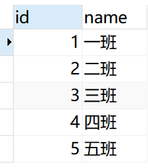
>
>分数表
>
>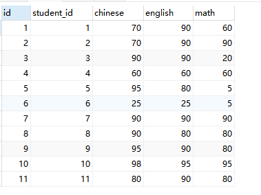
>
>学生表
>
>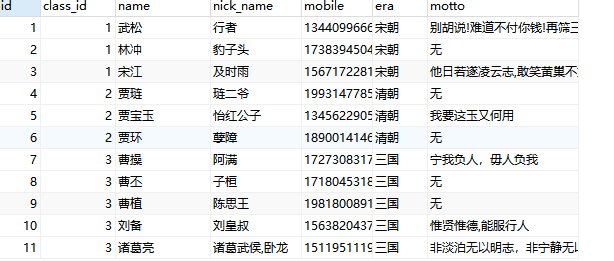
>
>剧目表
>
>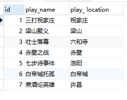

剧目-学生关系表

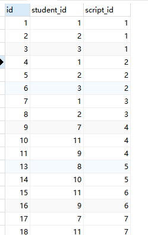

## 多表设计/多表理论

### 一对一

>指两个表（或多个表之间）的数据存在一一对应的关系。
>
>```Java
>eg:
>// 用户和用户详情 
>// 商品和商品详情
>```
>
>- 所有的一一对应的表(一对一情况)，在逻辑上，都可以合并为一个表。
>
>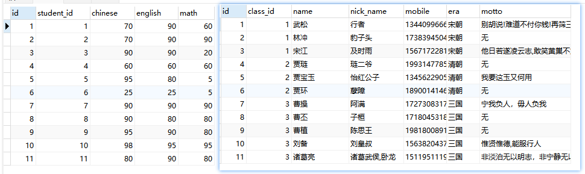

### 一对多

>指两个表（或多个表之间）的数据，存在表A中的一条数据对应表B中的多条数据，表B中的一条数据对应表A中的一条数据.
>
>```Java
>eg:
>// 用户和订单
>// 班级和学生
>```
>
>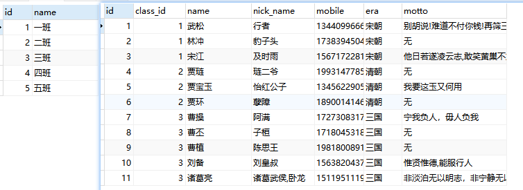

### 多对多 

>存在两个表表A和表B，存在表A中的一条数据对应表B中的多条数据，表B中的一条数据对应表A中的多条数据。
>
>```Java
>eg:
>// 剧本和演员
>一个演员可能出演了多个剧本,  一个剧本中可能包含多个演员
>```
>

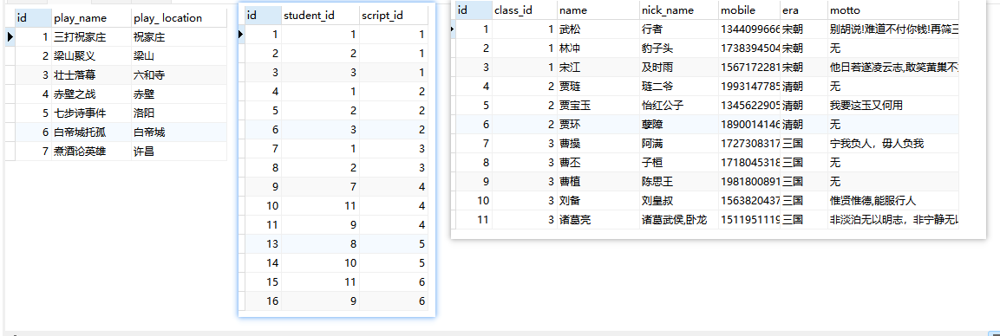


### 数据库设计范式

>数据库的范式: 是一组数据库设计规则，旨在减少数据冗余、避免不必要的数据依赖，以及增加数据完整性

#### 第一范式: 原子性

原子性: 确保每个表格的列都不可再分，即每列都是原子属性，不能包含多个值或重复的组合。

比如:

如果一个数据库表中有一个“联系方式”列，其中同时包含了电话号码和电子邮箱，那么这个设计就不符合第一范式。应该将这个列分成两个单独的列：“电话号码”和“电子邮箱”。再比如详细地址中有省份,城市,街道信息应当进行拆分成多列.:

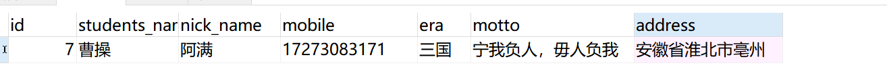

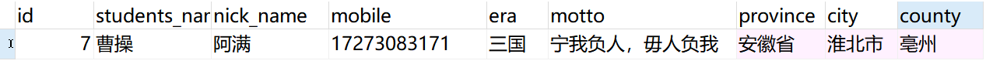

我们在设计表的时候，应该考虑之后业务的变化，来`尽量`让每一列的数据保持原子性。

#### 第二范式: 消除非主键属性对主键属性的部分依赖

要求非主键字段的值必须完全依赖主键，不存在部分依赖

如:  


应该将商品信息单独存储在一张表中：

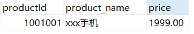

#### 第三范式: 消除非主键属性对主键属性的传递依赖

确保数据表中的每一个非主键字段都和主键字段直接相关，也就是说，要求数据表中的所有非主键 字段不能依赖于其他非主键字段

如: 班级名称

score表中存储了班级名与班级id

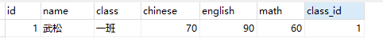

应该将班级的名称单独存储，在score表中只包含class_id

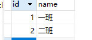


## 多表查询: 非常重要

多表查询是指在关系型数据库中，从多个表中查询数据的操作。多表查询可以帮助我们获得更加丰富的数据，以满足各种不同的需求。

>数据基础
>
>```SQL
>-- 装备表
>CREATE TABLE `equip`  (
>  `id` int(11) NOT NULL PRIMARY KEY,
>  `user_id` int(11) NULL DEFAULT NULL,
>  `equip_name` varchar(255) NULL DEFAULT NULL
>) ;
>```
>
>```SQL
>INSERT INTO `equip` VALUES (1, 1, '行者套账');
>INSERT INTO `equip` VALUES (2, 2, '丈八蛇矛');
>INSERT INTO `equip` VALUES (3, 5, '通灵宝玉');
>INSERT INTO `equip` VALUES (4, 7, '七星刀');
>INSERT INTO `equip` VALUES (5, 7, '绝影马');
>INSERT INTO `equip` VALUES (6, 7, '爪黄飞电马');
>INSERT INTO `equip` VALUES (7, 7, '倚天剑');
>INSERT INTO `equip` VALUES (8, 7, '青釭剑');
>INSERT INTO `equip` VALUES (9, 10, '的卢马');
>INSERT INTO `equip` VALUES (10, 10, '双股剑');
>```
>
>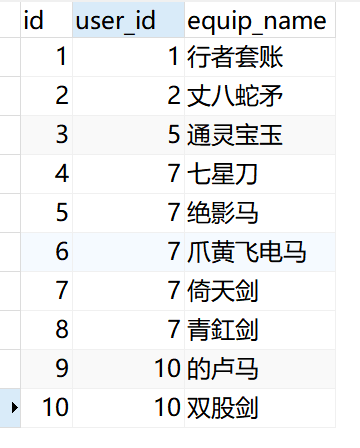

### 连接查询

>连接查询: 在研究表和表之间通过某些连接方式, 连接到一起, 再得到一些数据信息
>
>子查询:  子查询研究的是, 一个查询中, 需要用到另外一个查询的结果 (嵌套查询)
>
>联合查询: 两个查询的结果汇总

#### 交叉链接

>`交叉连接`其实就是求多个表的[笛卡尔积](https://baike.baidu.com/item/%E7%AC%9B%E5%8D%A1%E5%B0%94%E4%B9%98%E7%A7%AF/6323173?fromtitle=%E7%AC%9B%E5%8D%A1%E5%B0%94%E7%A7%AF&fromid=1434391&fr=aladdin)。
>
>```SQL
>SELECT <字段名> FROM <表1> CROSS JOIN <表2> [WHERE子句]
>SELECT <字段名> FROM <表1>, <表2> [WHERE子句] 
>
>
>eg: 
>	select * from student cross  join  equip;
>	select * from student cross  join  equip  where students.id = equip.user_id;
>	-- 两个表的笛卡尔积，返回结果数量就是两个表的数据行相乘。
>	-- 如果每个表有1000行，那么返回结果的数量就有1000×1000=1000000行。
>	-- 交叉连接简化写法
>	select * from student, equip
>
>```
>
>仅`交叉连接`的结果没有太多实际的使用意义。 (而且效率比较低)
>
>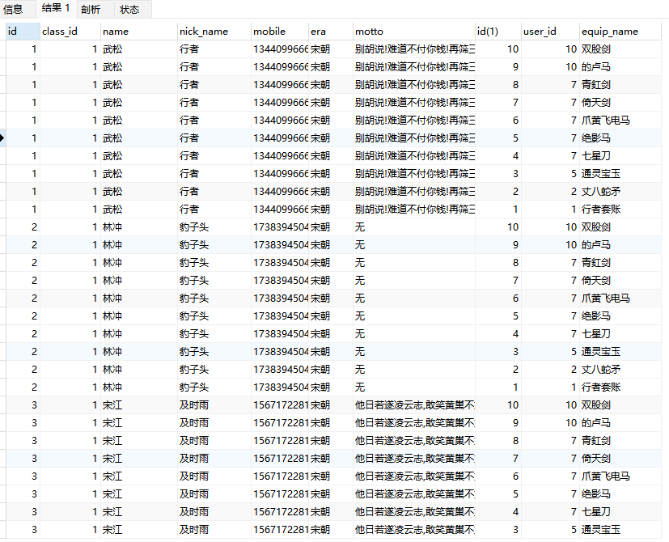
>
>从笛卡尔积中筛选符合条件的数据, 筛选条件学生id与user_id相等
>
>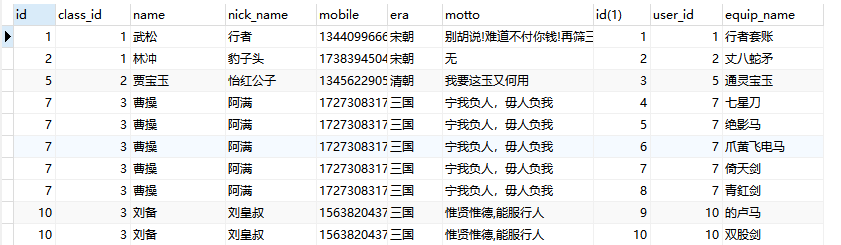


#### 内连接

>`内连接`
>
>，用于将两个或多个表中的数据进行合并匹配。<font color=red>**内连接只返回两个表中具有相同值的行，也就是说，只有在连接列中存在匹配值的行才会被返回。**</font>
>
>```SQL
>SELECT <字段名> FROM <表1> INNER JOIN <表2> [ON子句]
>-- ON子句指定了连接条件，它指定了表1和表2之间的匹配条件。
>
>eg:
>	-- 显示内连接
>	select * from student inner join equip on student.id = equip.user_id;
>	-- 隐式内连接
>	select * from student , equip  where  student.id = equip.user_id;
>```
>
>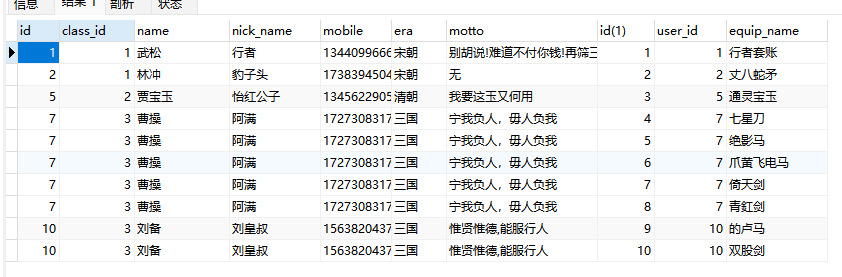


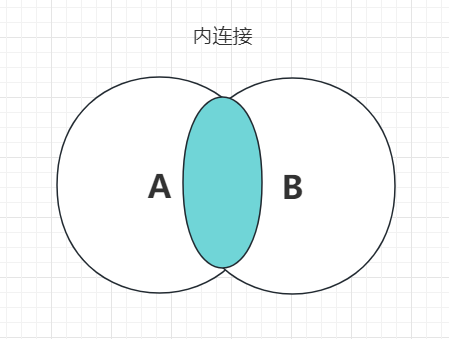

#### 外连接: 左右外连接

>`外连接`
>
>```SQL
>-- 左外连接返回左表中的所有行以及右表中与左表匹配的行，右表中没有匹配的行将被填充为NULL值。
>SELECT <字段名> FROM <表1> LEFT OUTER JOIN <表2> <ON子句>
>-- 右外连接返回右表中的所有行以及左表中与右表匹配的行，左表中没有匹配的行将被填充为NULL值
>SELECT <字段名> FROM <表1> RIGHT OUTER JOIN <表2> <ON子句>
>
>eg:
>	select * from student left outer join equip on student.id = equip.user_id ; 
>	select * from student right outer join equip on student.id = equip.user_id;
>	select * from equip right outer join student on student.id = equip.user_id;
>	select * from equip left outer join student on student.id = equip.user_id;
>	-- outer可省略
>	select * from student left join equip on student.id = equip.user_id;
>	select * from student right join equip on student.id = equip.user_id;
>```
>
>student left join equip
>
>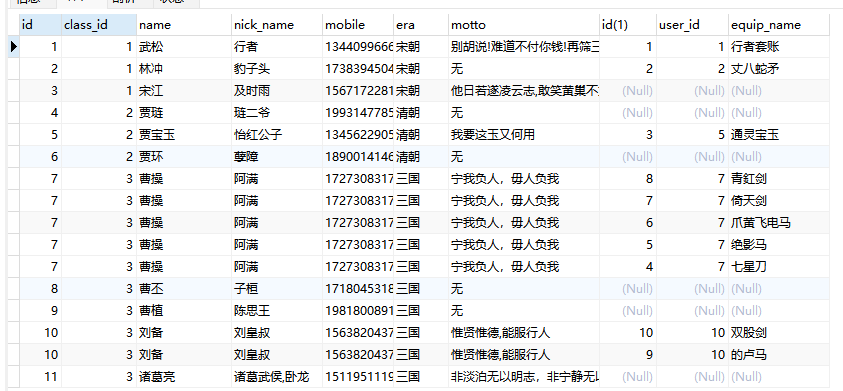
>
>equip right join student 
>
>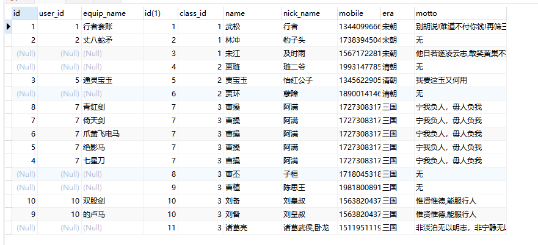

注: 主副表的问题

>假设A和B表进行连接，AB两张表一个表示主表，另一个是副表; 查询数据的时候,   以主表中的数据为基准，匹配副表对应的数据;   当副表中的数据没有能和主表对应数据相互匹配的数据，副表匹配位置自动填充null。

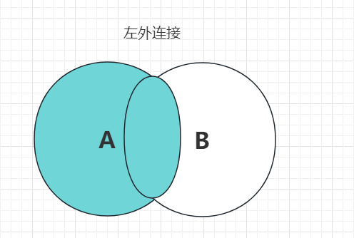

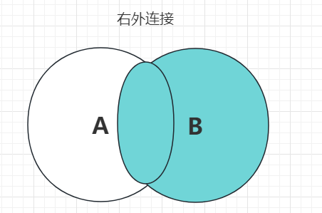

### 子查询

>子查询也叫嵌套查询.( 在某个操作中(删除/添加/查找), 用到了另外一个查询的结果.  ) 
>
>是指在WHERE子句或FROM子句中又嵌入SELECT查询语句.
>
>子查询通常用于在查询结果中过滤、排序、分组或者统计数据，或者作为其他查询语句的一部分。
>
>子查询可以嵌套多层，每一层都返回一个结果集供上一层使用。
>
>```SQL
>SELECT <字段名> FROM <表|子查询> WHERE <IN| NOT IN | EXISTS | NOT EXISTS > <子查询>
>
>eg:
>select * from  student where  id in (select user_id from equip);
>select * from  student where  id  not in (select user_id from equip);
>
>-- 在MySQL每次查询数据的结果集都是一个新的临时表。
>```
>
>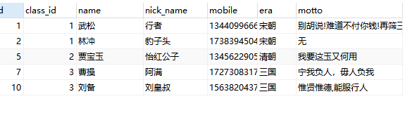
>
>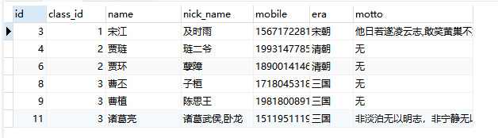

### 联合查询

>`联合查询`合并两条查询语句的查询结果.
>
>`联合查询`去掉两条查询语句中的重复数据行，然后返合并后没有重复数据行的查询结果。
>
>```SQL
>SELECT <字段名> FROM <表> UNION  SELECT <字段名> FROM <表>
>
>eg:
>	select * from  score  where chinese >= 90 union select * from  score  where math >= 90;
>```
>
>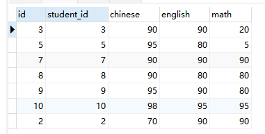


# 数据库备份和恢复

## 命令行操作

>通过命令行操作: 一定要注意路径问题
>
>```SQL
>-- 数据库备份：cmd命令下 
> 	mysqldump -u root -p 数据库名称>文件名.sql
>-- tips: 文件不建议放到c盘，不然可能由于权限问题无法访问 
>
>-- 数据库恢复： 
>-- 1. 创建数据库并选择该数据库 
>   	create database dbName; 
>   	use dbName; 
>-- 2. 恢复数据 
>  	 source 文件名.sql
>   
>```
>
>备份:
>
>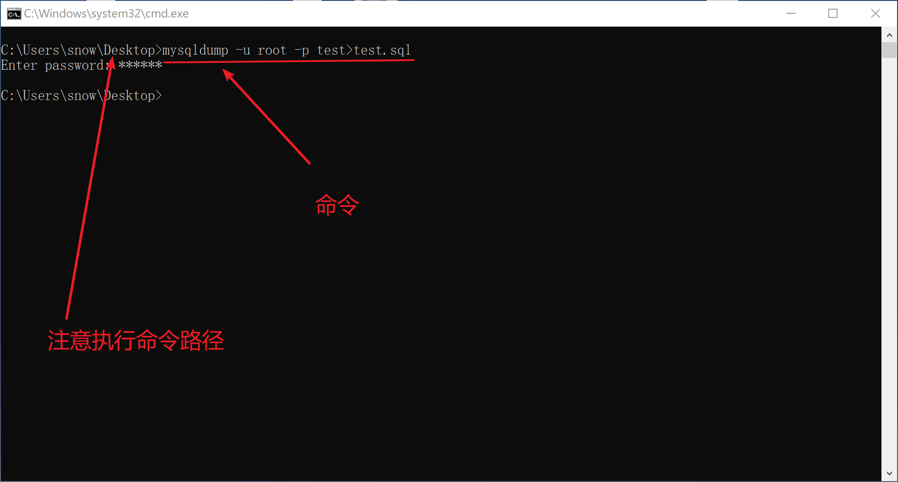
>
>恢复:
>
>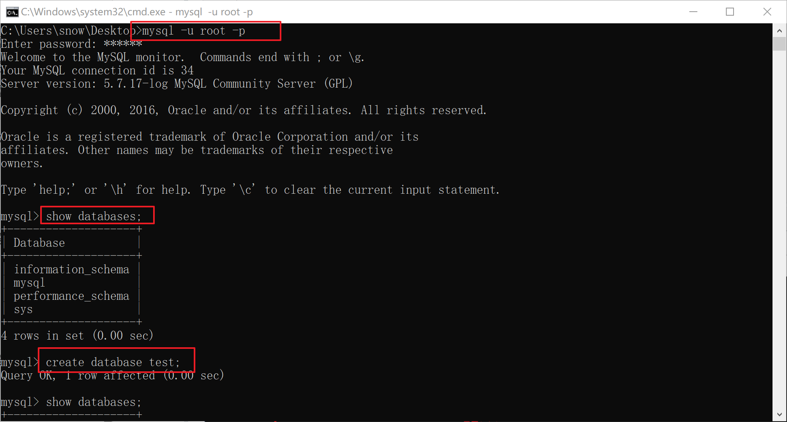
>
>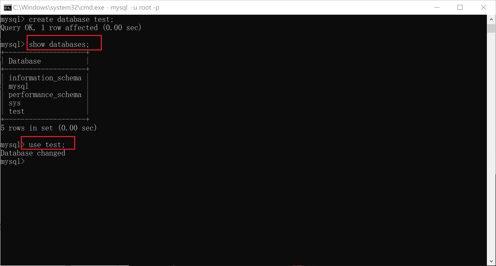
>
>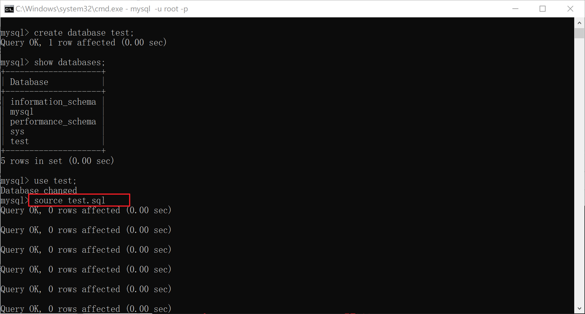

## 图形化界面

>以Navicat为例
>
>备份:
>
>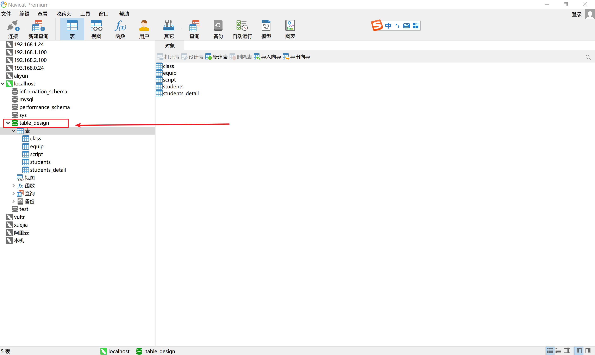
>
>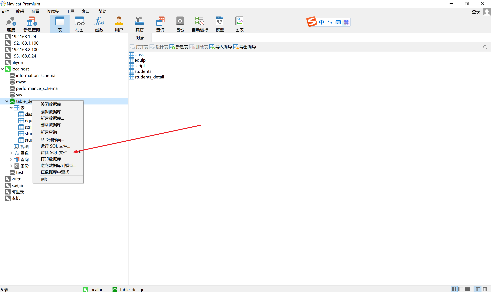
>
>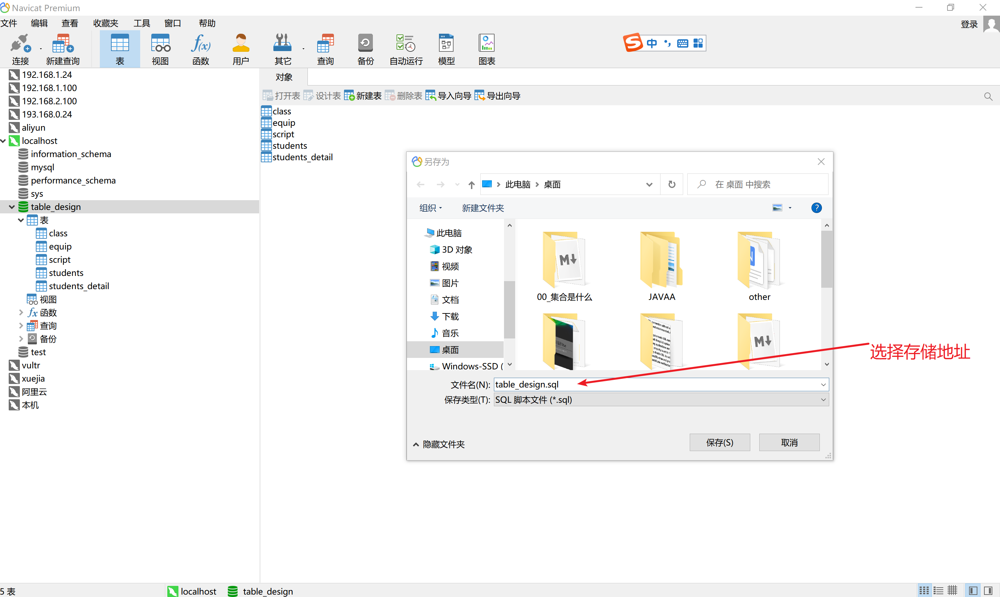
>
>导入:
>
>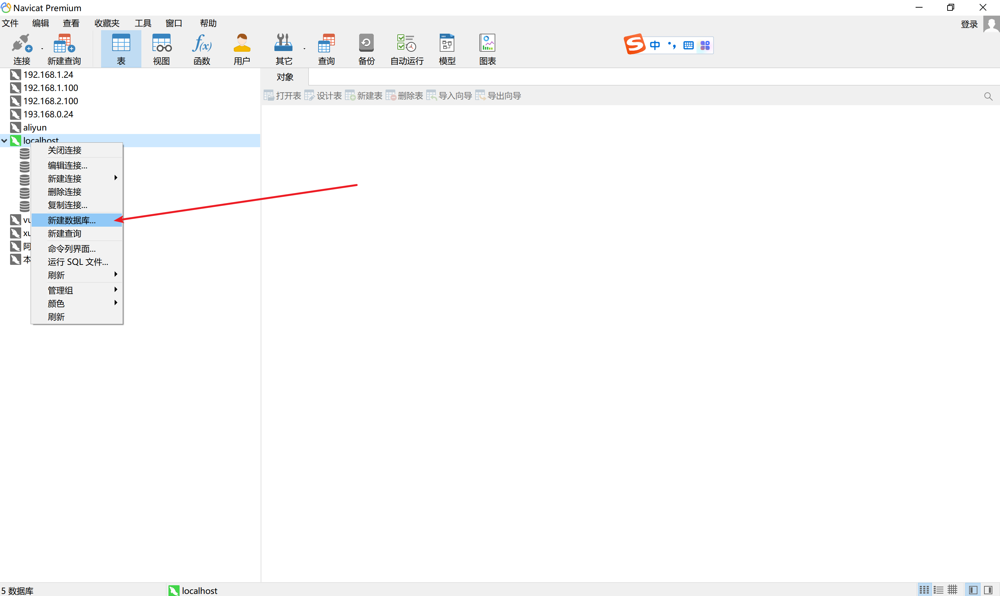
>
>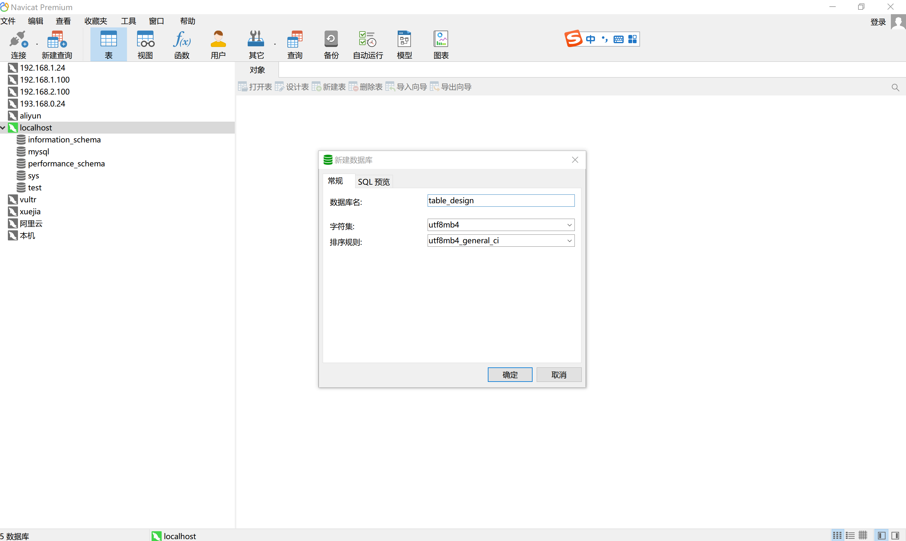
>
>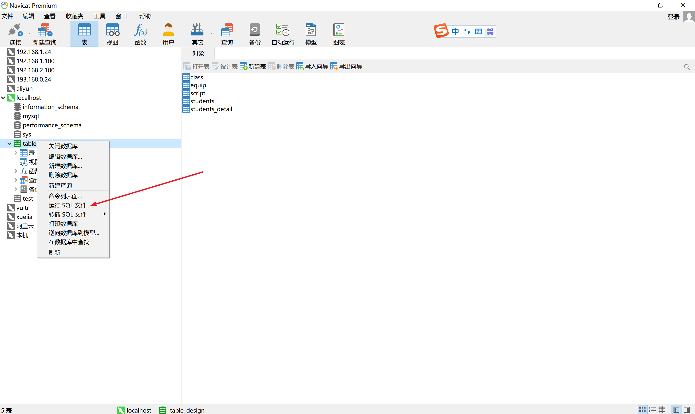


