# 数据结构

>重点不在数据结构的理论
>
>重点在怎么通过代码实现一些数据结构:  重点在代码上

# 1. 概述

>我们作为Java开发中,  我们需要一个可以`临时存储`数据的容器(`集合类`).
>
>```java
>// 伪代码逻辑: 设计一个Java集合类
>class MyArrayList{
>
>   Object[] objs;
>   int size;
>
>   public void add(Object obj){
>       // TODO: 数组初始化, 扩容
>       objs[size] = obj;
>       size++;
>   }
>
>   public boolean contains(Object obj){
>       // TODO: 遍历数组查找数据
>       return true;
>   }
>}
>```
>
>当然，上面的例子，仅仅只是解决了基本的数据存储的问题，Java提供了一些集合类供我们使用,  这些不同类型的集合类，不仅仅实现了存储数据的需求，还各有特征，比如FIFO, FILO, 元素有唯一位序，元素唯一，元素有大小顺序....
>
>如何有效的实现这些特征？这些集合类的底层就基于不同的数据结构来实现的，因此想要更好的理解Java中集合类的实现和使用，我们就需要先熟悉相关的数据结构的实现。

# 2. 数据结构


>什么是数据结构? 数据结构是相互之间存在一种或多种特定关系的数据元素的集合。
>
>常见的数据结构有以下4种：
>
>- 集合： 一堆无序的数据就是集合(集合内部数据不能重复)
>- 线性表：描述的是一个有序序列, 在这个有序序列中, 除了头和尾元素以外, 每一个数据都有唯一前驱和后继.  ( 数据和数据之间一个接着一个排列  )
>- 树：n个结点的有限集合, 在这个有限集合中, 有一个结点被称为根结点, 除了这个根结点以外, 有可以把剩余的n-1数据, 分为m个互不相交的有限集, 而且每一个有限集本身也是一颗树.
>- 图：描述数据之间一种多对多的关系的数据结构, 就是图
>
>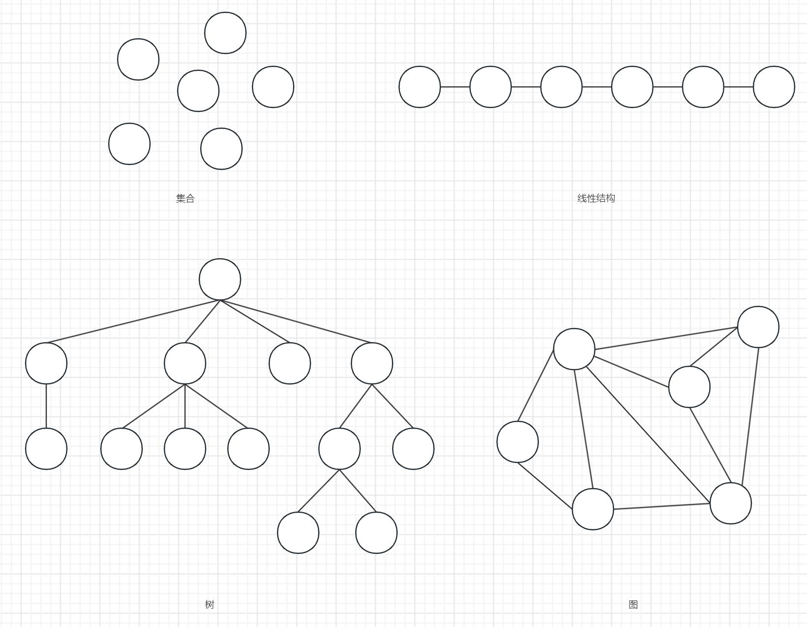
>
>**注意事项：**
>
>- 数据结构和语言之间没有直接关系。
>- 但是我们可以用某种语言实现数据结构，比如Java语言中的集合类，不同的集合类基于不同的数据结构实现，描述元素之间不同的关系，所以就表现出了不同的特征


>但是，数据结构本身只描述逻辑上存在的元素之间的关系，那么这些关系我们如何在计算机中来表示呢？通过数组和链表来表示

# 3, 数组和链表

## 3.1 数组

一个数组表示的是一片连续的存储空间，在这片连续的存储空间中，各个数组元素物理紧邻，因此，数组是利用存储位置来表示元素之间的关系。

- 在线性表中，数组中紧邻的两个元素就互为前驱和后继
- 在完全二叉树中，如果第i个位置的元素(非根)，其父亲节点就在i/2个元素的位置
- ...

>   数组在内存空间上是连续存储,  所以可以做到随机访问，即以相同的效率访问数组中的任何一个元素
>
>```
>一个下标的物理位置 =  数组首地址 + 单个数组单元大小*下标
>```
>
>​	而这个特征是链表所不具备的。 
>

## 3.2  数组操作的时间复杂度

### 3.2.1 添加元素

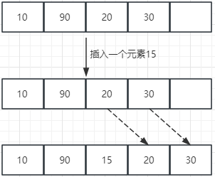

注意事项：

- 我们可以在数组中任意一个元素之前或者之后插入元素
- 在插入元素之前，必须先将插入位置之后的元素依次向后移动，为待插入元素挪出空间

基于以上两点，在向数组中添加元素时，我们可以得出如下结论：

- 最好情况下，在数组的最后一个元素之后添加元素，无需移动元素，其时间复杂度为常数量级O(1)
- 最坏情况下，在数组的第一个元素之前添加元素，移动n个元素，其时间复杂度为O(n)
- 平均情况下，数组中添加一个元素，需要移动（n + 1)/2个元素，其时间复杂度为O(n)

### 3.2.2 删除元素

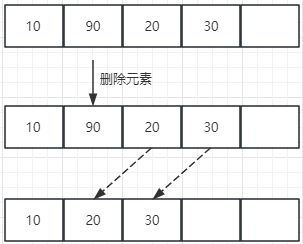

注意事项：

- 我们可以删除数组中的任意一个元素
- 在删除元素之前，必须将待删除元素之后的元素依次向前移动，覆盖待删除元素即可

基于以上两点：在删除数组元素时，我们可以得到如下结论：

- 最好情况下，删除数组中最后一个元素，无需移动元素，只需让它之前的元素成为最后一个元素即可，时间复杂度常量级O(1)
- 最坏情况下，删除数组中第一个元素，需要移动n-1个元素，时间复杂度O(n)
- 平均情况下，删除一个元素，需要移动(n-1)/2个元素，时间复杂度为O(n)

### 3.3.3 查询元素

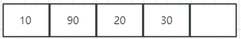

如果根据下标查询元素，那么根据数组随机访问的特征，时间复杂度为O(1)

如果根据内容查询数组中的元素，则有如下三种情况：

- 最好情况，查找的元素恰好是第一个元素，比较1次，时间复杂度为O(1)
- 最坏情况，查找的元素恰好是最后一个元素(或者数组中不存在该元素)，比较n次，时间复杂度为O(n)
- 平均情况下，查找元素的比较次数为n/2次，的时间复杂度是O(n)

如果在数组中元素大小有序的情况下，采用二分查找，那么其时间复杂度为O(lg2^n)

## 3.2 链表

>链表是物理存储单元上非连续的、非顺序的存储结构，它是由一个个结点，通过指针来联系起来的，其中每个结点包括数据和指针
>
>- 与数组不同，链表中的各个元素并非物理紧邻
>- 元素之间通过指针(地址)链接在一起，即元素之间的关系通过指针(地址)来表示
>- 所以，链表中的每个元素由指针域和数据域两部分组成，我们称之为一个结点

```java
class Node {
  // value表示节点中存储的数据，即数据域
  String value;
  // next 表示指向下一个节点的引用变量(地址)
  Node next;
}
```

链表的常见分类如下：

- 单链表

>对于单向链表, 在链表每一个结点只能向后指向一个新的结点,  尾结点向后不再指向内容.

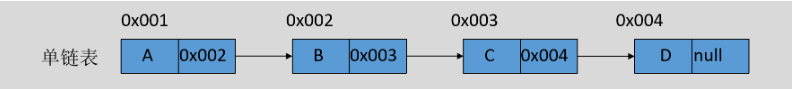

- 单向循环链表


>单向循环链表, 是在单向链表的基础上进一步改进, 要求单链表的尾结点向后指向, 头结点. 

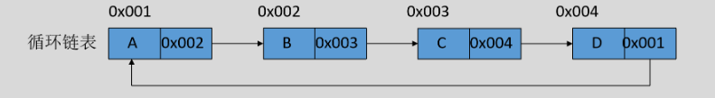

双线链表

>对单向链表的改进, 在单向链表的基础上, 不仅要求每一个结点可以向后指向, 也要求每一个结点也可以向前指向,  头结点向前没有内容, 尾结点向后没有内容.

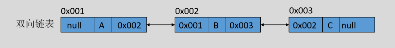

双向循环链表

>是对双向链表的改进, 要求, 双向链表的头结点向前指向尾结点, 双向链表的尾结点向后指向头结点.

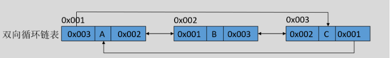

在实际使用中, 我们一般用不到循环链表. 除非为了解决环形问题: 比如约瑟夫问题

## 3.3 链表的时间复杂度

### 3.3.1 单向链表的时间复杂度

#### 3.3.1.1 查找元素

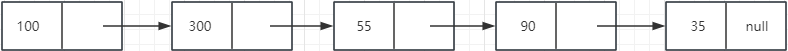

- 按位序查找：因为无法随机访问，因此只能从第一个结点点，依次根据指针域访问下一个节点，直到到达指定位序，因此时间复杂度为O(n)
- 按内容查找：同理，也是只能从第一个结点出发，依次匹配，时间复杂度为O(n)
- 因为无法随机访问，基于链表无法实现二分查找

#### 3.3.1.2 添加元素


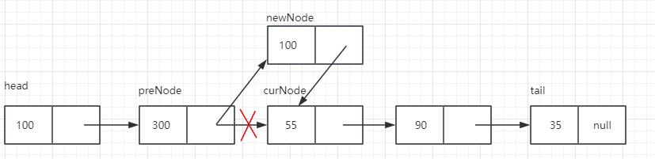

```java
// 在中间或尾部添加
newNode.next = preNode.next;
preNode.next = newNode;

// 添加到链表头
newNode.next = head;
head = newNode;
```

在链表中，不管在哪个位置添加元素，都无需像在数组中一样移动元素，只需要修改指针域的地址值即可，所以时间复杂度为O(1).

#### 3.3.1.3 删除元素

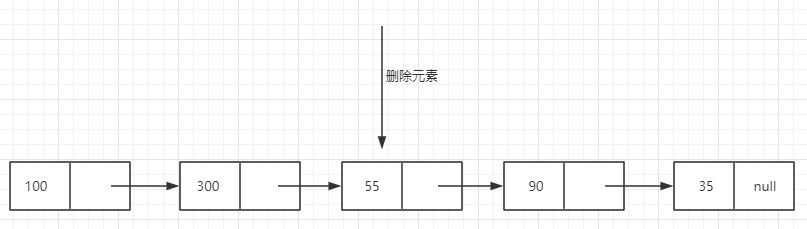

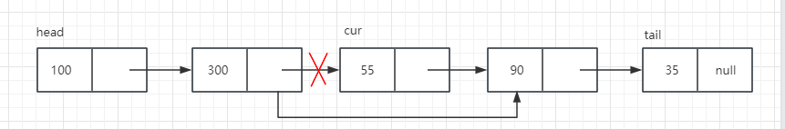

```
// 删除中间或者尾节点
pre.next = cur.next;
or
pre.next = pre.next.next;

// 删除第一个节点
head = head.next
```

同理，不管删除哪个位置的结点，删除的时间复杂度都为O(1)


### 3.3.2 双向链表的时间复杂度

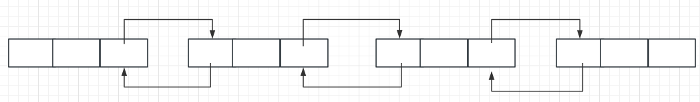

####  添加元素

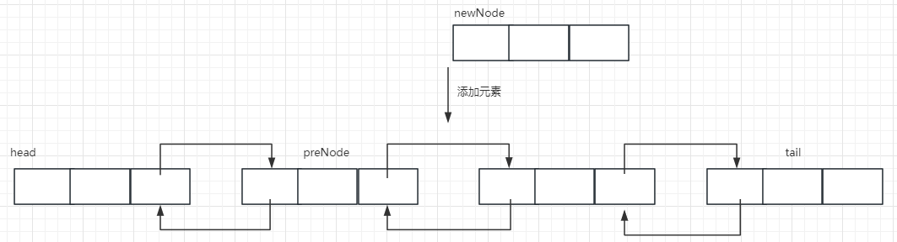

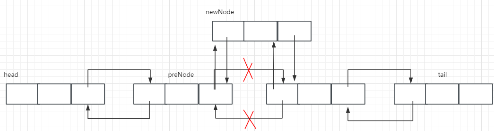

```java
// 添加到链表头
newNode.next = head;
head.pre = newNode;
head = newNode;

// 添加到中间
newNode.next = preNode.next;
newNode.pre = preNode;
preNode.next = newNode;
preNode.next.pre = newNode;

// 添加到尾部 (注意，对于双向链表而言，插入中间和尾部的代码不一样了)
newNode.next = tail.next;
newNode.pre = tail;
tail.next = newNode;


```

#### 删除元素

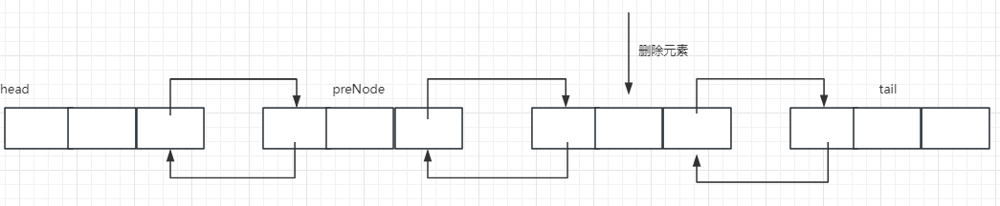

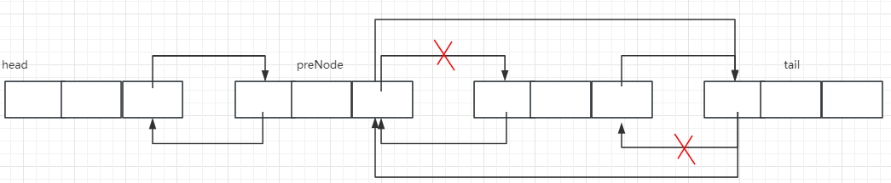

```java
// 删除头元素
head = head.next;
head.pre = null;

// 删除中间元素
curNode = pre.next;
curNode.next.pre = preNode;
preNode.next = curNode.next;

// 删除尾元素(注意，这里也和删除中间元素不一样)
tail = tail.pre;
tail.next = null;
```


- 对于双向链表而言，添加，和删除一个结点的时间复杂度同单向链表，但是对应的操作会比单向链表复杂一些

- 按内容查找的时间复杂度也和单向链表相同
- 但是在按照位序查找元素时，双向链表的性能要优于单向链表，因为(0, n/2)的元素可以从前往后，（n/2)的元素可以从后往前，也就是最多只需遍历n/2个元素，所以其平均比较次数大致为n/4

## 3.4 链表代码练习

### 3.4.1  判断是否有环

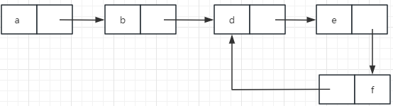

### 3.4.2  找出环的起始位置

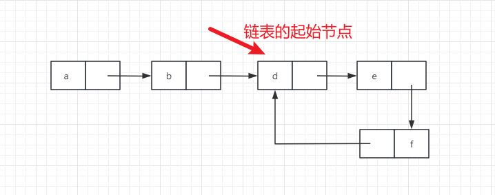

### 3.4.3 翻转链表

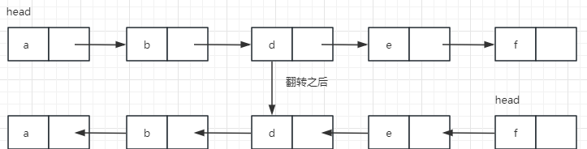


>已经基本研究明白了数组和链表:  连续存储 和非连续存储的结构
>
>接下来我们，需要基于数组和链表，去自己实现集合类
>


# 4. 实现线性表

接下来，我们就来实现我们的第一种集合类——线性表集合类。

首先，既然是集合类，那么它最基本的功能就应该是能够存储数据，并实现对数据的访问，因此它必须实现对数据的增删改查功能：

- 增：添加元素，对应一个方法比如add(元素值)
- 删:  删除指定元素，对应一个方法比如remove(元素值)
- 改：修改指定元素的值为新值，对应一个方法比如set(旧值，新值)
- 查：判断指定元素是否存在，对应一个方法比如contains(元素值)

| 方法名称         | 描述                           |      |
| ---------------- | ------------------------------ | ---- |
| add(元素值)      | 添加元素，对应一个方法比如     |      |
| remove(元素值)   | 删除指定元素，对应一个方法比如 |      |
| set(旧值，新值)  | 修改指定元素的值为新值         |      |
| contains(元素值) | 判断指定元素是否存在           |      |

接着，我们还要考虑该集合类实现线性表的数据结构，线性表最大的特征是元素之间的关系是一一对应的关系，即除了头尾元素外，每个元素都有唯一前驱和唯一后继。这意味着什么呢？每个元素在线性表中都有**唯一位序**，因此我们可以通过元素的位序，实现对元素的操作：

- 增：将元素添加到指定位置，对应方法比如add(位序,  元素)
- 删：删除指定位置的元素，对应方法比如remove(位序)
- 改：将指定位置的元素改为指定的新值，对应方法比如set(位序，新值)
- 查：获取指定位置的元素值，对应方法比如get(位序)

| 方法名称         | 描述                           |
| ---------------- | ------------------------------ |
| add(位序,  元素) | 将元素添加到指定位置           |
| remove(位序)     | 删除指定位置的元素             |
| set(位序，新值)  | 将指定位置的元素改为指定的新值 |
| get(位序)        | 获取指定位置的元素值           |

最后，我们还要考虑，数据结构只是描述了数据之前的逻辑关系，那么这些关系在计算机中如何来表示呢？这就涉及到了物理结构即——数组和链表，因此我们可以分别基于数组和链表两种物理结构实现线性表这种数据结构。

同时，针对链表，我们还学习了单向链表和双向链表，那理论上我们使用哪种链表实现线性表会比较合适呢？


## 线性表的顺序存储MyArrayList

底层采用数组进行存储

注意:

数组的长度受限, 需要考虑到数组扩容的问题

基本结构

```java
// 线性表的顺序存储
public class MyArrayList {
    // 使用数组来存储数据
    private String values[];
    // 记录元素个数
    private int size;

    private static final int INIT_CAPACITY = 10;

    public MyArrayList() {
        // 初始化
        values = new String[INIT_CAPACITY];
    }
    // 提供给外界获取集合元素个数的方法
    public int size() {
        return size;
    }

}
```

操作线性表的方法

基于下标的添加 add(int index,String value)

```java
    public boolean add(int index,String value) {
        // 判断插入位置是否合理 不合理抛出异常
        if (index > size || index < 0) {
            throw new RuntimeException("illegal index");
        }
        // 判断是否需要扩容
        if (index == values.length) {
            // 需要--->扩容
            grow();
        }
        // 不需要 ---> 数组中插入该元素
        // 从最后一个位置开始遍历到index位置 将每个位置元素都往后移动一位
        for (int i = size - 1; i >=index ; i--) {
            values[i+1] = values[i];
        }
        // 在index位置上插入新元素
        values[index] = value;
        // 线性表长+1
        size++;
        return true;
    }

    private void grow() {
        // 对老数组进行扩容
        // String[] newArray = new String[values.length * 2];
        // 或者可以通过移位运算来进行扩大2倍   <<
        String[] newArray = new String[values.length << 1];
        // 把老数组的元素复制到新数组中
        for (int i = 0; i < values.length; i++) {
            newArray[i] = values[i];
        }
        // 或者可以使用copy方法
        // System.arraycopy(values, 0, newArray, 0, values.length);
        // 将新数组作为新的values
        values = newArray;
    }
```


基于下标的删除

```java
    public boolean remove(int index) {
        // 判断下标
        if (index >= size) {
            throw new RuntimeException("illegal index!");
        }
        // 根据下标删除
        // 遍历数组
        for (int i = index; i < size; i++) {
            // 把index后面的元素往前移动一个位置
            values[i] = values[i+1];

        }
        // 表长-1
        size--;
        return true;
    }
```


基于内容的查找

```java
    // 基于内容的查找
    public boolean contains(String value){
        // 判断容器size
        if (size == 0) {
            return false;
        }
        // 从头开始依次遍历
        for (String s : values) {
            if (Objects.equals(s, value)) {
                return true;
            }
        }

        return false;
    }
```


基于下标的修改

```java
    // 基于下标的修改
    public String set(int index,String value) {
        // 判断index
        if (index < 0 || index >= size) {
            throw new RuntimeException("illegal index!");
        }
        // 取出原来的元素
        String oldValue = values[index];
        // 根据index修改
        values[index] = value;
        return oldValue;

    }
```


## 线性表的链式存储MyLinkedList

底层采用链表进行存储

基本结构

```java
// 线性表的链式存储
public class MyLinkedList {
    // head
    Node head;
    // 记录表长
    int size;
    // 节点结构
    class Node{
        // 数据域
        String value;
        // 指针域
        Node next;
        
        public Node(String value) {
            this.value = value;
        }
    }

    public int size() {
        return size;
    }
}

```


基于内容的添加操作 采用尾插法

```java 
    public boolean add(String value) {
        // 先处理头
        if (size == 0) {
            // 链表为空
            // 新建节点做为head
            Node node = new Node(value);
            head = node;
            // 表长+1
            size++;
            return true;
        }
        // 链表非空 采用尾插法
        // 重点在于找到尾节点 ---> 尾节点的next为null
        // 定义一个节点用于遍历
        Node mid = head;
        // 遍历
        while (mid.next != null) {
            // 下一个节点
            mid = mid.next;
        }
        // 跳出循环 说明mid此时为尾节点
        // 新建节点
        Node node = new Node(value);
        // 插入到尾节点后面
        mid.next = node;
        // 表长+1
        size++;
        // 返回结果
        return true;
    }
```

基于内容的删除   public String remove(String value)

```java
   // 基于内容的删除操作
    public String remove(String value) {
        // 判断size
        if (size == 0) {
            throw new RuntimeException("list is empty!");
        }
        // 先处理头
        if (Objects.equals(head.value, value)) {
            // 取出head元素
            String removeValue = head.value;
            // 删除头
            head = head.next;
            // 表长-1
            size--;
            // 返回被删除元素
            return removeValue;
        }
        // 再处理中间和尾
        // 定义一个节点用于遍历
        Node mid = head;
        // mid.next!=null --->mid 不是尾节点
        // !Objects.equals(mid.next.value,value) ---> mid的下个节点不是要删除的节点
        while (mid.next!=null && !Objects.equals(mid.next.value,value)) {
            // 下一个
            mid = mid.next;
        }
        // 跳出循环条件
        // 1.mid是尾节点 --> 链表中没存储这个value 返回
        // 2.mid的下个节点是要删除的节点

        if (mid.next == null) {
            // 尾节点
            // 返回null或抛出异常
            throw new RuntimeException("not store!");
        }
        // 取出mid下个节点元素
        String removeValue = mid.next.value;
        // 删除mid的下个节点
        mid.next = mid.next.next;
        // 表长-1
        size--;
        return removeValue;
    }
```

基于内容的查找操作

```java
    // 基于内容的查找
    public boolean contains(String value) {
        // 判断size大小
        if (size == 0) {
            throw new RuntimeException("list is empty!");
        }
        // 先处理头
        if (Objects.equals(head.value, value)) {
            // 找到了
            return true;
        }
        // 再处理后续
        // 定义一个节点用于遍历
        Node mid = head;
        // mid != null ---> 当前节点不是null 
        while (mid != null) {
            // 判断value
            if (Objects.equals(mid.value, value)) {
                // 找到了
                return true;
            }
            // 没找到 下一个
            mid = mid.next;
        }
        // 没存这个value
        return false;
    }
```

基于内容的修改

```java
    // 基于内容的修改
    public boolean set(String oldValue,String newValue) {
        // 判断size
        if (size == 0) {
            throw new RuntimeException("list is empty");
        }
        // 根据内容查找
        // 定义一个节点用于遍历
        Node mid = head;
        while (mid != null) {
            if (Objects.equals(mid.value, oldValue)) {
                // 修改
                mid.value = newValue;
                return true;

            }
            // 下一个节点
            mid = mid.next;
        }
        return false;
    }
```


## 双向链表MyDBLinkedList

底层使用双向链表存储

基本结构

```java
// 底层使用双向链表实现线性表的链式存储
public class MyDBLinkedList {
    // 头
    Node head;
    // 尾
    Node tail;
    // 容器大小
    int size;
    
    class Node{
        // 数据域
        String value;
        // 指针域
        Node pre; // 前驱
        Node next; // 后继

        public Node(String value) {
            this.value = value;
        }
    }

    // 获取大小
    public int size() {
        return size;
    }

    // 判断容器是否为空
    public boolean isEmpty() {
        return size == 0;
    }
}

```

基于内容的添加操作 

```java
   // 基于内容的添加操作
    public boolean add(String value) {
        // 判断size
        if (isEmpty()) {
            //链表为空 第一次添加
            // 创建新节点
            Node node = new Node(value);
            // 修改head tail
            // 新节点即作为头又作为尾
            head = node;
            tail = node;
            // 表长+1
            size++;
            return true;
        }
        // 添加到尾部
        // 创建新节点
        Node node = new Node(value);
        // 新节点的前驱节点是尾节点
        node.pre = tail;
        // 尾节点的后继节点是新节点
        tail.next = node;
        // 修改tail 让新节点做为新的尾
        tail = node;
        // 表长+1
        size++;
        return true;
    }
```

基于内容的删除

```java
    // 基于内容的删除操作
    public boolean remove(String value) {
        // 判断size
        if (isEmpty()) {
            throw new RuntimeException("list is empty!");
        }
        // 处理头
        if (Objects.equals(head.value, value)) {
            // 如果只有1个节点 修改head tail
            if (size == 1) {
                // 删除
                head = null;
                tail = null;

            }else{
                // 如果不只1个节点 只修改head
                head = head.next;
                head.pre = null;
            }
            // 表长-1
            size--;
            return true;
        }
        // 定义节点用于遍历
        Node mid = head;
        while (mid.next != null && !Objects.equals(mid.next.value, value)) {
            // 下一节点
            mid = mid.next;
        }
        // 跳出循环
        // 1.mid.next = null ---> mid是尾节点 没找到
        // 2.mid是要删除节点的上一节点

        // 没找到
        if (mid.next == null) {
            return false;
        }
        // mid.next --->要删除的节点 可能是中间 可能是尾
        Node removeNode = mid.next;
        // 处理尾
        if (removeNode.next == null) {
            // 删除
            removeNode.pre.next = null;
            // 修改tail
            tail = removeNode.pre;
            // 表长-1
            size--;
            return true;
        }
        // 处理中间
        // 删除
        removeNode.next.pre = removeNode.pre;
        removeNode.pre.next = removeNode.next;
        // 表长-1
        size--;
        return true;
    }
```

基于内容的查找

```java
    // 基于内容的查找
    public boolean contains(String value) {
        // 判断size
        if (isEmpty()) {
            throw new RuntimeException("list is empty");
        }
        // 定义节点用于遍历
        Node mid = head;
        while (mid != null) {
            // 判断是否相等
            if (Objects.equals(mid.value, value)) {
                return true;
            }
            // 不相等 下一个节点
            mid = mid.next;
        }
        // 没找到
        return false;
    }
```


基于内容的修改

```java
    // 基于内容的修改
    public boolean set(String oldValue, String newValue) {
        // 判断size
        if (isEmpty()) {
            throw new RuntimeException("list is empty");
        }
        // 定义节点用于遍历
        Node mid = head;
        // 逐一比较
        while (mid != null) {
            // 找到了 修改
            if (Objects.equals(mid.value, oldValue)) {
                mid.value = newValue;
                return true;
            }
            // 下个节点
            mid = mid.next;
        }
        // 没找到 返回false
        return false;
    }
```


## 4.1 一个问题

>由于我们在实现上述集合类的时候, 设置了存储数据的类型是String类型(这也就意味着, 我们上面设计的数据容器只能用来存储String数据).
>
>只能存储String,  这显然不能满足我们在不同情况下, 对集合类存储不同数据的应用需求.
>
>我们需要设计一个集合类, 在不同场景下可以满足存储不同数据类型的需求.
>
>```Java
>方式一: 针对不同场景, 修改数据类型
>    这种设计造成代码大量冗余, 不太合适
>```
>
>```Java
>方式二: 使用Object类型
>    极有可能在使用的过程中, 因为类型强转导致运行时异常产生, 非常危险
>```
>
>```Java
>方式三: 泛型
>```

# 5, 泛型

## 5.1 泛型的概念

>什么是泛型: 
>
>​		所谓泛型是参数化类型, 当我们在写某些代码逻辑的时候, 对于某个参数的类型不太确定, 我们可以先假定一种类型来代指, 当我们真正使用的时候, 再传入具体的类型(像传参一样: 所以叫参数化类型)
>
>Java是Jdk1.5时候产生的. (Java的泛型设计有很大问题)

>泛型的好处
>      a. 提高了程序的安全性
>      b. 将运行期遇到的问题转移到了编译期
>      c. 省去了类型强转的麻烦

## 5.2 泛型的使用

**泛型类**

>什么是泛型类:   把`泛型`定义在`类`上
>
>```Java
>// 格式:  
>class 类名<泛型类型1,…>{
>    
>}
>```
>
>注意1: 泛型类的使用: 重要
>
>```Java
>// 第一种写法: 前后两个尖括号, 都指明泛型类型, 这是jdk1.5的标准写法
>User1<String> zs = new User1<String>("zs", "18");
>// 第二种写法: 可以省略后面简括的里面的内容, 这是第一种写法省略写法, 本质是等价的, 在jdk1.7的时候的改进
>User1<Integer> zs1 = new User1<>("zs", 18);
> 
>// 第三种写法: 某个泛型类要求使用泛型, 但是在具体使用的时候, 没有传入泛型; 使用了泛型地方默认为Object类型 (不推荐这种写法: 虽然语法上允许, 但是很奇葩)
>User1 zs2 = new User1("zs", 18);
>Object age = zs2.age;
>```
>
>```Java
>class User1 <XXXX>{
>    String name;
>    XXXX age;
>
>    public User1(String name, XXXX age) {
>        this.name = name;
>        this.age = age;
>    }
>}
>```
>
>注意2: 多个泛型的写法
>
>```java
>// 注意: 一个泛型类, 定义了多个泛型, 当我们使用的时候, 要么不传, 要么都要传(定义几个传几个)
>User2<String, Integer> zs = new User2<>("zs", 18);
>User2 zs1 = new User2("zs", 18);
>
>```
>
>```Java
>// 泛型的定义
>// T : type
>// E : element
>// K : key
>// V : value
>
>// 我们可以在一个泛型类上使用多个泛型(哪怕定义一千个一万个都是语法允许的), 但是'建议'不要超过两个
>// 可以在泛型类上定义泛型, 但是类的内部根部没有使用(语法是完全允许的)
>// class User3< XXX, YYY, ZZZ>{
>class User2 <XXXX, YYY>{
>    XXXX name;
>    YYY age;
>
>    public User2(XXXX name, YYY age) {
>        this.name = name;
>        this.age = age;
>    }
>}
>
>```
>
>注意3: 参数化类型必须是引用类型
>
>```java
>// 报错: User4<int> zs = new User4<int>("zs", 18);
>User4<Integer> zs = new User4<Integer>("zs", 18);
>int age = zs.age;
>zs.age = 20;
>
>```
>
>注意4: 泛型的作用域
>
>一个泛型类, 在类上定义看一个泛型, 它定义的这个泛型的作用域:  这个类的类名和类体之内
>
>```java
>  F<String> stringF = new F<>();
>        String ft = stringF.ft;
>
>        S0 s0 = new S0();
>        Object ft2 = s0.ft;
>
>        S1 s1 = new S1();
>        String ft1 = s1.ft;
>
>        S2<String> s2 = new S2<>();
>        Integer ft3 = s2.ft;
>
>        S3<String> stringS3 = new S3<>();
>        String ft4 = stringS3.ft;
>
>        S3<Integer> integerS3 = new S3<Integer>();
>        Integer ft5 = integerS3.ft;
>
>        S4<String> s4 = new S4<>();
>        String ft6 = s4.ft;
>
>        S4<Integer> integerS4 = new S4<>();
>        Integer ft7 = integerS4.ft;
>```
>
>```java
>class F <T> {
>    T ft;
>}
>class S0 extends F{}
>class S1 extends F<String>{ }
>class S2 <E> extends F<Integer>{}
>class S3 <E> extends F<E> {}
>class S4 <T> extends F<T>{}
>```

**泛型接口**

>泛型接口:  把泛型定义在接口上
>格式: interface 接口名<泛型类型1…>

>注意:继承关系表现
>
>```Java
>interface F<T>{
>    public T getData(T t); 
>}
>
>class S1 implements F{
>    @Override
>    public Object getData(Object o) {
>        return null;
>    }
>}
>class S2 implements F<String>{
>    @Override
>    public String getData(String s) {
>        return null;
>    }
>}
>class S3<E> implements F<E>{
>    @Override
>    public E getData(E e) {
>        return null;
>    }
>}
>class S4<T> implements F<T>{
>    @Override
>    public T getData(T t) {
>        return null;
>    }
>}
>```

**泛型方法**

>泛型方法: 把泛型定义在方法上
>
>格式:
>
>​		public <泛型类型> 返回类型 方法名(泛型类型 .)
>
>使用了泛型的方法不一定是泛型方法, 定义了泛型的方法才是泛型方法

>使用:
>
>```Java
>  A a = new A();
>        String zs = a.getT("zs");
>        Integer t = a.getT(18);
>```
>
>```Java
>class A{
>        public <T> T getT(T t){
>            return t;
>        }
>}
>```

注意:

>1, 使用数组的时候, 不要用泛型; 使用泛型的时候, 不要使用数组
>
>2, 在静态作用域中, 不允许使用泛型

# 6. 操作受限的线性表

>比之于普通的线性表，还有一些特殊的线性表，这些线性表中，数据之间仍然保持一一对应的关系，但是和普通线性表相比，但是对这些数据结构所做的操作受到了一定的限制，一些在普通线性表中可以做的操作，在这些操作受限的线性表中就不被允许了。比如：
>
>- 栈：和普通的线性表不同，不能在该线性表的任意位置插入元素，也不能删除该线性表中任意位置的元素
>- 队列：和栈类似，也不允许在该线性表的任意位置插入和删除元素

## 6.1 栈

### 6.1.1栈的概念

>栈: 操作受限的线性表
>    要求一个普通线性表, 添加/删除/查找/修改 数据都要在线性表的一端进行 --> 就是栈


### 6.1.1 栈的实现

**使用链表实现一个数据结构为`栈`的数据容器(集合类)**

>链表实现: 
>
>- 我们可以用单链表和双向链表实现栈
>- 但是使用栈是不需要根据下标查找操作的
>- 所以如果我们使用双向链表实现栈, 不仅浪费了内存空间, 还无法体现双向链表的优越性
>-  所以, 我们选择使用单链表实现一个栈

**使用数组实现一个数据结构为`栈`的数据容器(集合类)**

>凡是使用数组作为容器底层真正容纳数据的结构:  数组需要扩容和初始化


#### 顺序存储

**使用数组实现一个数据结构为`栈`的数据容器(集合类)**

> 凡是使用数组作为容器底层真正容纳数据的结构:  数组需要扩容和初始化


基本结构

```java
// 栈的顺序存储 
public class MyArrayStack<E> {
    // 初始容量
    private static int INIT_CAPACITY = 10;
    // 数组存储
    Object[] values;
    // 栈的大小
    private int size;

    public MyArrayStack() {
        // 初始化
        values = new Object[INIT_CAPACITY];
    }

    // 获取大小
    public int size() {
        return size;
    }

    // 是否栈空
    public boolean isEmpty() {
        return size == 0;
    }
}

```

入栈操作 push

```java 
    // 入栈操作
    public boolean push(E e) {
        // 判断是否栈满
        if (isFull()) {
            // 如果栈满 需要扩容
            grow();
        }
        // 栈顶插入元素,即数组末尾添加元素
        values[size] = e;
        // 表长+1
        size++;
        // 返回
        return true;
    }

	// 扩容
    private void grow() {
        // 创建新数组
        Object[] newArray = new Object[values.length << 1];
        // 老数据复制到新数组
        System.arraycopy(values,0,newArray,0,values.length);
        // 新数组作为存储容器
        values = newArray;
    }
```


出栈操作 pop()

```java 
    // 出栈操作
    public E pop() {
        // 判断栈空
        if (isEmpty()) {
            throw new RuntimeException("stack is empty!");
        }
        // 弹出栈顶元素
        E value = (E) values[size - 1];
        // 表长-1
        size--;
        // 返回结果
        return value;
    }
```


获取栈顶元素 peak

```java 
    public E peak() {
        // 判断栈空
        if (isEmpty()) {
            throw new RuntimeException("stack is empty!");
        }
        return (E) values[size-1];
    }
```


#### 链式存储

**使用单链表实现一个数据结构为`栈`的数据容器(集合类)**

>链表实现: 
>
>- 我们可以用单链表和双向链表实现栈
>- 但是使用栈是不需要根据下标查找操作的, 所以如果我们使用双向链表实现栈, 不仅浪费了内存空间, 还无法体现双向链表的优越性
>- 我们选择使用单链表实现一个栈.

基本结构

```java
// 栈的链式存储 底层使用单链表
public class MyLinkedStack<E>{
    // 栈顶指针
    Node top;
    // 记录栈的大小
    int size;
    class Node{
        // 数据域
        E value;
        // 指针域
        Node next;

        public Node(E value) {
            this.value = value;
        }
    }
    // 获取栈大小
    public int size(){
        return size;    
    }

    // 栈空
    public boolean isEmpty() {
        return top == null;
    }
}
```

入栈操作 push()

```java
    // 入栈操作
    public boolean push(E value) {
        // 判断栈空
        if (isEmpty()) {
            // 创建新节点
            Node node = new Node(value);
            // top指向新节点
            top = node;
            // 表长+1
            size++;
            return true;
        }
        // 创建新节点
        Node node = new Node(value);
        // 指向top 
        node.next = top;
        // top移动到栈顶 
        top = node;
        // 表长+1
        size++;
        // 返回结果
        return true;
    }
```

出栈操作pop()

```java
    public E pop() {
        // 判断栈空
        if (isEmpty()) {
            throw new RuntimeException("stack is empty!");
        }
        // 弹出栈顶元素
        E topElement = top.value;
        // 修改top
        top = top.next;
        // 表长-1
        size--;
        // 返回结果
        return topElement;
    }
```

获取栈顶元素peak()

```java
    public E peak() {
        // 判断栈空
        if (isEmpty()) {
            throw new RuntimeException("stack is empty!");
        }
        // 返回栈顶元素
        return top.value;
    }
```


## 6.2 队列

### 6.1.1 队列的概念

>队列: 操作受限线性表 (操作受限: 增删改查操作受到限制)
>要求一个普通线性表, 添加数据在一端, 删除数据在另一端进行, 就是队列 

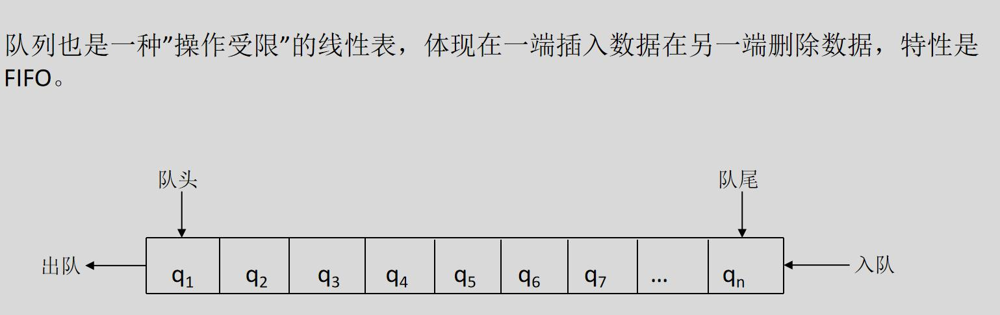

### 6.1.2 队列的实现

**数组实现队列**

>数组实现:
>
>- 在数组实现队列的时候, 如果我们要在数组一段添加数据, 在数组的另一端删除数据的话, 可能需要频繁的移动数据的位置
>-  所以我们为了避免数组模拟队列的时候, 频繁的移动数组中数据，我们可以选择，移动队列的头，尾下标，但是这样一来又会引发内存空间的浪费
>
>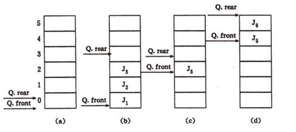
>
>- 因此我们使用循环数组(将数组臆造为环状结构)，来解决移动队头，队尾指针，引起的内存空间的浪费问题
>
>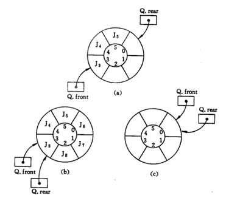
>
>这里要将数组臆造为环状，最主要的工作是要正确计算在环状数组(循环数组)中下标的位置，我们通过取模运算即可实现

```java
// 比如长度为5的数组中，下标4的下一个位置就是下标0，通过%运算可以求得
 int nextPos = (4 + 1) % 5
```

**链表实现队列**

>链表实现: 
>
>- 我们可以用单链表和双向链表实现队列
>- 但是使用队列是不需要根据下标查找操作的
>- 如果我们使用双向链表实现队列, 不仅浪费了内存空间, 还无法体现双向链表的优越性
>-  所以, 我们选择使用单链表实现一个队列.

#### 数组实现

```java
public class MyArrayQueue<E> {
    // 初始大小
    private static int INIT_CAPACITY = 10;
    // 队头
    private int front;
    // 队尾
    private int rear;
    // 数组
    private Object[] values;
    // 队列大小
    private int size;

    public MyArrayQueue() {
        // 初始化
        values = new Object[INIT_CAPACITY];
    }

    // 获取队列大小
    public int size() {
        return size;
    }

    // 队满
    public boolean isEmpty() {
        return size == 0;
    }

    // 队空
    public boolean isFull() {
        return size == values.length;
    }
}
```

 入队操作 offer()

```java 
    // 入队
    public boolean offer(E value) {
        // 队满判断
        if (isFull()) {
            grow();
        }
        // 队尾插入数据
        values[rear] = value;
        // 修改队尾 逻辑后移一位
        rear = (rear + 1) % values.length;
        // 表长+1
        size++;
        // 返回结果
        return true;
    }

    private void grow() {
        // 创建新数组
        Object[] newArray = new Object[values.length << 1];
        // 老数据复制到新数组
        System.arraycopy(values, 0, newArray, 0, values.length);
        // 重置队头 队尾
        front = 0;
        rear = size;
        // 新数组作为存储容器
        values = newArray;

    }
```


出队操作  poll()

```java 
    public E poll() {
        // 队空判断
        if (isEmpty()) {
            throw new RuntimeException("queue is empty!");
        }
        // 如果队列中只有1个元素
        // 出队后重置队头队尾
        if (size == 1) {
            // 获取队头位置元素
            E element = (E) values[front];
            // 删除队头元素 此时队列为空
            values[front] = null;
            // 重置队头队尾
            front = 0;
            rear = 0;
            // 表长-1
            size--;
            return element;
        }
        // 获取队头位置元素
        E element = (E) values[front];
        // 删除队头元素
        values[front] = null;
        // front逻辑后移
        front = (front + 1) % values.length;
        // 表长-1
        size--;
        return element;
    }
```


#### 链式存储

**单链表实现队列**

>链表实现: 
>
>- 我们可以用单链表和双向链表实现队列
>- 但是使用队列是不需要根据下标查找操作的
>- 如果我们使用双向链表实现队列, 不仅浪费了内存空间, 还无法体现双向链表的优越性
>- 所以, 我们选择使用单链表实现一个队列.

基本结构

```java
public class MyLinkedQueue<E> {
    // 队头
    private Node front;
    // 队尾
    private Node rear;
    // 队列大小
    private int size;
    class Node{
        // 数据域
        E value;
        // 指针域
        Node next;

        public Node(E value) {
            this.value = value;
        }
    }
    // 队大小
    public int size() {
        return size;
    }

    // 队空
    public boolean isEmpty() {
        return size == 0;
    }
}
```


入队操作 offer()

```java
    // 入队操作
    public boolean offer(E value) {
        // 队空判断
        if (isEmpty()) {
            // 第一次添加
            // 创建新节点
            Node node = new Node(value);
            // 队头队尾分别指向新节点
            front = rear = node;
            // 表长+1
            size++;
            // 返回结果
            return true;
        }
        // 非空
        // 创建新节点
        Node node = new Node(value);
        // 添加到队尾
        rear.next = node;
        // 修改队尾
        rear = node;
        // 表长+1
        size++;
        // 返回结果
        return true;
    }
```


出队操作 poll()

```java
 // 出队操作
    public E poll() {
        // 队空判断
        if (isEmpty()) {
            throw new RuntimeException("queue is empty!");
        }
        // 特殊情况处理 队列中只有1个元素
        if (size == 1) {
            // 取出队头元素
            E element = front.value;
            // 重置队头队尾
            front = rear = null;
            // 表长-1
            size--;
            // 返回结果
            return element;
        }
        // 一般情况
        // 取出队头元素
        E element = front.value;
        // 队头逻辑后移
        front = front.next;
        // 表长-1
        size--;
        // 返回结果
        return element;
    }
```


## 6.3 队列和栈有什么应用场景

**栈的应用**

>应用场景：
>1, 函数调用栈
>
>     2, 反序字符串
>
>3, 括号匹配问题 
>     
>4, 编译器利用栈实现`表达式求值`
>
>5, 浏览器的前进后退功能
>
>6, 利用栈实现 DFS: depth-first-search  深度优先遍历

**队列的应用**

>应用场景：
>1, 缓存
>2, 利用队列实现 BFS:breadth first search 广度优先搜索/ 遍历

# 7, 树

## 7.1 树的概念

>1, 树是n个结点的有限集合.有一个结点被称为根结点.除了根结点以外, 又分为m个互不相交的有限集合, 并且每一个有限集本身也是一颗树.
>
>2, 树是一种一对多的层级结构.

**一些基本术语**

>1, 一个结点的子树的根，称为该结点的孩子(儿子)，相应的该结点称为子树的根的父亲。
>
>2, 没有孩子的结点称为树叶，又叫叶子结点。
>
>3, 具有相同父亲的结点互为兄弟。
>
>4, 注意，在一棵树中从根到每个结点恰好存在一条路径。
>
>5, 结点的层级从根开始定义，根为第一层，根的孩子为第二层。若某结点在第i层，则其孩子就在i+1层。
>
>6, 对任意结点ni，ni的深度为从根到ni的唯一路径的长。因此，根的深度为0。
>
>7, 树中结点ni 的高是从ni 到一片树叶的最长路径的长。因此，所有树叶的高都为0。

对于任意一颗树，其非叶结点可能有1个，2个，n个孩子，即它的形状是不规则的，而且子节点的排列也没有固定规则，这会导致一棵树的结构过于灵活，带来如下的一些问题：

- 执行添加，删除节点的操作比较复杂。在执行结点的添加操作时，因为一个节点可能有多个兄弟节点，所以在添加节点时，可能涉及兄弟节点的顺序调整的问题。在删除节点时，因为一个节点可能有多个子节点，所以还有可能涉及，多个子节点的调整问题
- 执行查询的效率低。因为树中的元素排列没有规则，所以要在树中查询一个元素，可能需要遍历树中的所有节点
- 存储结构也比较复杂，且存储空间的效率比较低。

综上所述，存储表示任意一颗没有规则的树比较复杂，且对这样的一棵树，其操作复杂，数据访问(查找)效率低，所以这样的树并非我们重点研究的对象。我们重点研究的树，应该是具有一定的约束和规则，具有一些良好性质的树，比如最常见的二叉树。

但是在讲二叉树之前，还有一点是需要说明的，之所以重点研究二叉树，还有一个重要原因是因为，二叉树和树之间是可以相互转化的。比如我们可以把任意一颗树按照如下方式转化为二叉树：

1. 如果一个结点有孩子, 那么选择它的第一个孩子作为这个结点的left子结点
2.  如果一个结点有右兄弟结点, 那么选择它的右兄弟作为该结点的right子结点

一个普通的树,经过上面两个特点转化之后得到一个二叉树，我们也可以将这颗二叉重新树转换为对应的树

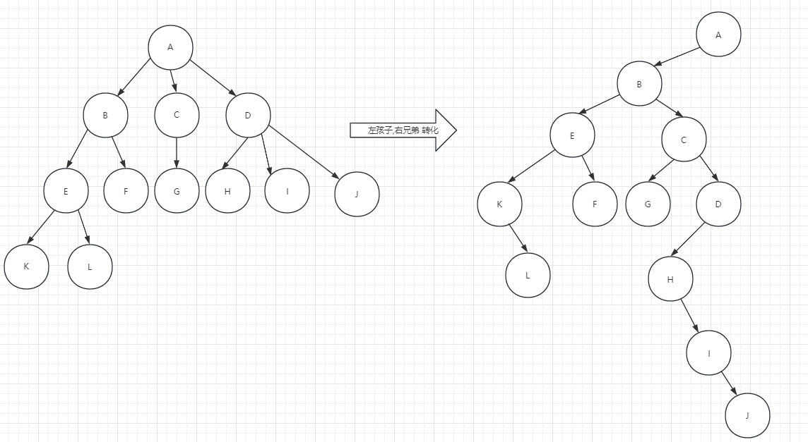

## 7.2 二叉树

### 7.2.1 二叉树的特点

**基本特点和概念**

>二叉树是一棵树，它的特点是每个结点至多有两棵子树。并且，子树有左右之分，其次序不能颠倒（有序）
>
>```java
>二叉树具有以下重要性质：
>二叉树在第i层至多有2的i-1次方个节点 
>层次为k的二叉树至多有2的k次方-1个节点
>对任何一颗二叉树T，如果其叶子节点数为n0 , 度为2的节点数为n2，则n0 = n2 + 1
>具有n个节点的完全二叉树，树的高度为log2n (向下取整)。
>如果对一颗有n个结点的完全二叉树的结点按层序从1开始编号，则对任意一结点有：
>      如果编号i为1，则该结点是二叉树的根;
>      如果编号i > 1，则其双亲结点编号为 parent(i) = i/2,			
>          若 2i > n 则该结点没有左孩子，否则其左孩子的编号为 2i,
>          若 2i + 1 > n 则该结点没有右孩子，否则其右孩子的编号为 2i + 1。
>```
>

- 满二叉树: 每一层都是满排的
- 完全二叉树: 在最后一个节点之间, 所有的节点位置都是满排的

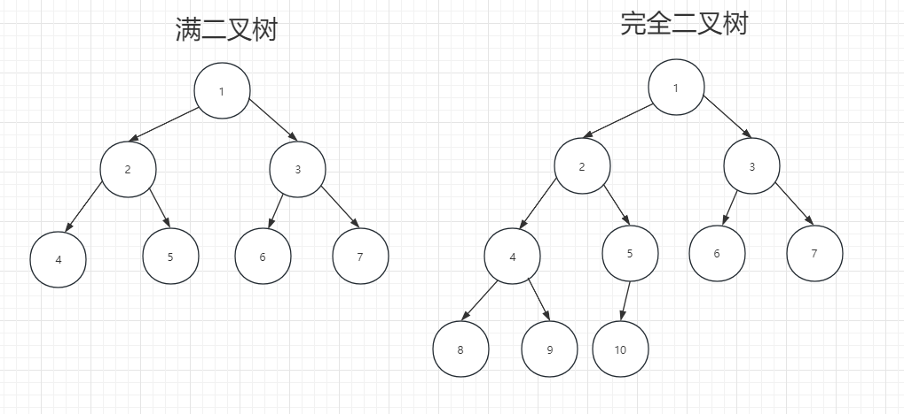

### 7.2.2 二叉树的存储

**1, 用链表存储一个二叉树**

>对于二叉树, 我们只需要维护一个结点类型, 既可以存储
>
>```java
>class Node{
>    value;
>    left;
>    right;
>}
>```

**2, 数组实现一个二叉树**

>二叉树使用数据存储的论据:
>
>```java
>// 前提
>如果我们对一个完全二叉树按照层级进行编号(根节点编号1) , 这个完全二叉树上的所有结点, 都满足一个特点
>    父结点编号 * 2 = 该结点的left结点编号
>    父结点编号 * 2 + 1= 该结点的right结点编号
>// 结论
>先对于一个二叉树按照完全二叉树进行编号, 父子关系满足2倍和2倍加一, 根据编号我们可以把对应树中的结点存储对应的数组位置.
>这样即使给定我们任意一个x位置, 我们都能很快找到它的父结点位置(x/2)以及子结点位置(2x, 2x+1)
>```

### 7.2.3 二叉树的遍历

>对树按照某种方式进行处理, 得到一个能线性显示的遍历结果, 就是二叉树的遍历
>
>遍历又分为:
>		1, 广度优先遍历:  层级遍历
>		2, 深度优先遍历:  前中后序

#### 7.2.3.1 广度遍历

> 所谓广度遍历, 是对一个结点遍历的时候以广度优先延伸.
>
> 一般在二叉树中, 我们称广度遍历为层级遍历(即: 按照树的层级对树进行遍历)

**借助队列实现**

1.创建一个队列
2.根节点入队
3.如果队列非空 循环执行以下操作
4.节点出队
5.输出该节点
6.如果有左子树 入队
7.如果有右子树, 入队

```java
    public static void levelOrder(Node root) {
        // 判断节点是否为空
        if (root != null) {
            // 创建一个队列
            MyLinkedQueue<Node> queue = new MyLinkedQueue<>();
            // 根节点入队
            queue.offer(root);
            // 如果队列非空 循环执行以下操作
            while (!queue.isEmpty()) {
                // 节点出队
                Node node = queue.poll();
                // 输出该节点
                System.out.print(node.value + " ");
                // 如果有左子树 入队
                if (node.left != null) {
                    queue.offer(node.left);
                }
                // 如果有右子树, 入队
                if (node.right != null) {
                    queue.offer(node.right);
                }
            }
        }
    }
```


#### 7.2.3.2 深度遍历

>所谓深度遍历, 是对一个结点遍历的时候以深度优先延伸.

如果我们限定先左后右的遍历顺序

- // 根 左 右: 先序遍历/ 先根遍历
- // 左 根 右: 中序遍历/ 中根遍历
- // 左 右 根: 后序遍历/ 后根遍历


定义基本结构

```java
// 定义二叉树
public class MyBinaryTree {

    // 定义节点类型
    private static class Node{
        int  value;
        Node left;
        Node right;

        public Node(int value) {
            this.value = value;
        }

    }
}
```


**前序遍历preOrder**

**递归实现**

1. 输出根节点
2. 递归遍历左子树
3. 递归遍历右子树

```java
    public static void preOrder(Node node) {
        // 当前结点为空 返回
        if (node == null) {
            return;
        }
        // 输出节点值
        System.out.print(node.value + " ");
        // 遍历左子树
        preOrder(node.left);
        // 遍历右子树
        preOrder(node.right);
    }
```


**非递归实现(借助栈)**

1.创建一个栈
2.将根节点入栈
3.循环执行以下操作(栈不空)
4.弹出栈顶元素,输出该节点
5.如果该节点有右子树,将右子树入栈
6.如果该节点有左子树,将左子树入栈

```java
    public void unRecursivePreOrder(Node root) {
        //1.创建一个栈
        MyLinkedStack<Node> stack = new MyLinkedStack<>();
        //2.将根节点入栈
        stack.push(root);
        //3.循环执行以下操作
        while (!stack.isEmpty()) {
            //4.弹出栈顶元素,输出该元素
            Node pop = stack.pop();
            System.out.print(pop.value+" ");
            //5.如果该元素有右子树,将右子树入栈
            if (pop.right != null) {
                stack.push(pop.right);
            }
            //6.如果该元素有左子树,将左子树入栈
            if (pop.left != null) {
                stack.push(pop.left);
            }
        }
    }
```


**中序遍历inOrder**

**递归实现:**

1. 递归遍历左子树
2. 输出根节点
3. 递归遍历右子树

```java
    public static void inOrder(Node node) {
        // 当前结点为空 返回
        if (node == null) {
            return;
        }
        // 遍历左子树
        inOrder(node.left);
        // 输出节点值
        System.out.print(node.value+" ");
        // 遍历右子树
        inOrder(node.right);
    }
```


**非递归实现(借助于栈)**

1.创建一个栈
2.循环执行以下操作(3,4,5)(栈不空或者当前节点不是null)
3.整个左边界依次入栈
4.如果没有左子树,弹出栈顶元素,输出该元素
5.如果该元素有右子树,将右子树整个左边界依次入栈

```java
    public static void unRecursiveInOrder(Node root) {
        // 判断是否为空
        if (root != null) {
            // 创建一个栈
            MyLinkedStack<Node> stack = new MyLinkedStack<>();
            // 循环执行以下操作
            while (root != null || !stack.isEmpty()) {
                // 整个左边界入栈
                if (root != null) {
                    stack.push(root);
                    root = root.left;
                }else {
                    // 没有左子树 弹出栈顶元素 输出
                    Node pop = stack.pop();
                    System.out.print(pop.value+" ");
                    // 如果该元素有右子树,将右子树整个左边界依次入栈
                    root = pop.right;
                }
            }
        }

    }
```


**后续遍历postOrder**

**递归实现**

1. 递归遍历左子树
2. 递归遍历右子树
3. 输出根节点

```java
    public static void postOrder(Node node) {
        // 当前结点为空 返回
        if (node == null) {
            return;
        }
        // 遍历左子树
        postOrder(node.left);
        // 遍历右子树
        postOrder(node.right);
        // 输出节点值
        System.out.print(node.value + " ");
    }
```


**非递归实现(借助2个栈)**

1.创建一个栈s1 用于遍历
2.创建一个栈s2 用于存放后序遍历的结果 作为辅助栈
3.将根节点入栈s1
4.循环执行以下操作(5,6,7)
5.弹出栈顶元素 ,结果入栈s2
6.如果该元素有左子树,将左子树入栈s1
7.如果该元素有右子树,将右子树入栈s1
8.如果栈s1为空,结束循环
9.依次弹出栈s2 并打印

```java
   public static void unRecursivePostOrder(Node root) {
        // 使用2个栈实现二叉树的非递归后序遍历
        // 创建1个栈s1 用于遍历
        MyLinkedStack<Node> s1 = new MyLinkedStack<>();
        // 创建1个栈s2 用于存放后序遍历的结果 作为辅助栈
        MyLinkedStack<Node> s2 = new MyLinkedStack<>();
        // 根节点入栈
        s1.push(root);
        // 循环执行以下操作
        while (!s1.isEmpty()) {
            // 弹栈不打印 结果入栈s2
            Node node = s1.pop();
            s2.push(node);
            // 如果有左子树,压左
            if (node.left != null) {
                s1.push(node.left);
            }
            // 如果有右子树,压右
            if (node.right != null) {
                s1.push(node.right);
            }

            // 如果栈1为空,结束循环
        }
        // 弹栈s2 打印
        while (!s2.isEmpty()) {
            Node node = s2.pop();
            System.out.print(node.value+" ");
        }
    }
```


### 7.2.4 二叉树的建树操作

>有些情况下，我们已知的是二叉树的某个或某些遍历序列。我们需要根据这些遍历序列，构建出一棵二叉树，这个过程就叫做二叉树的建树。
>
>```Java
>Q1: 如果我们只知道前序，中序，后序中的某一种，能否构建出一棵"唯一"二叉树？如果能，为什么？如果不能，试着举出反例。
>// 如果我们只知道前序，中序，后序中的某一种，能否构建出一棵二叉树; 能,但是不能保证唯一    
>
>
>Q2:如果我们只知道前序，中序，后序中的某两种，能否构建出一棵唯一"唯一"二叉树？如果能，为什么？如果不能，试着举出反例。
>//  构建一个唯一的二叉树:
>//      先序 + 中序 : 可以
>//      中序 + 后序 : 可以
>//      先序 + 后序 : 不可以
>//    因为: 先序和后序,都可以确定谁是根结点,   中序可以根据根节点把左右子树拆开. 
>```
>

## 7.3 二叉搜索树

### 7.3.1 二叉搜索树概念

**二叉搜索树又名二叉排序树/二分查找树**

>>1. 二叉搜索树首先是一个二叉树
>>2. 要求每一个结点可以比较大小
>>3. 要求每一个结点的left子树的值更小,  right值更大
>>
>>值得注意的是: 关于"大小"是可以在不同情况下定义的.
>
>+
>
>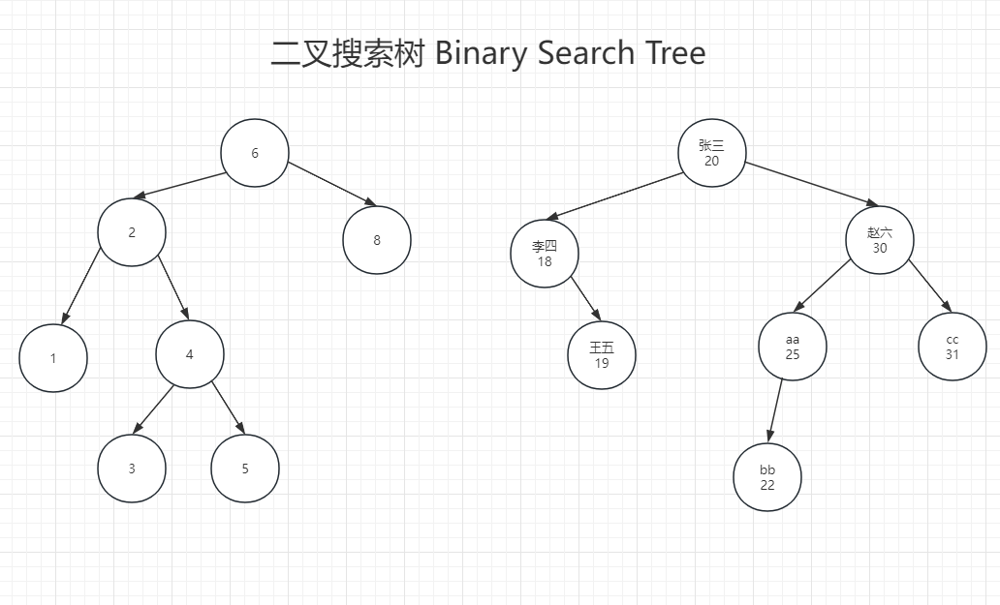
>
>###  二叉搜索树的实现
>
>>使用链表实现一个数据结构为二叉搜索树的数据容器.
>
>**方法设计**
>
>| 方法                             | 作用             | 参数说明            |
>| -------------------------------- | ---------------- | ------------------- |
>| public boolean isEmpty()         | 判断是否为空树   | 无                  |
>| public void insert(T value)      | 插入节点         | 要插入的T类型的数据 |
>| public boolean contains(T value) | 递归查找         | 要查找的T类型的数据 |
>| public boolean find(T value)     | 非递归查找       | 要查找的T类型的数据 |
>| public void printTree()          | 打印树           | 无                  |
>| public T recursiveFindMin()      | 递归查找最小值   | 无                  |
>| public T unRecursiveFindMax()    | 非递归查找最大值 | 无                  |
>| public void remove(T value)      | 递归删除         | 要删除的T类型的数据 |
>
>
>
>
>
>**基本结构**
>
>```java
>// 二叉搜索树
>// 泛型 T extends Comparable<T> 限定T的类型上限
>// 表示T必须是可比较的 也就是说T是Comparable接口的子类
>public class MyBinarySearchTree<T extends Comparable<T>> {
>    // 定义根节点
>    private Node root;
>
>    // 定义节点类型
>    private class Node {
>        T value;
>        Node left;
>        Node right;
>
>        public Node(T value) {
>            this.value = value;
>        }
>
>    }
>
>    /**
>     * 判断是否空树
>     * 创建日期：2023/11/30 10:57
>     *
>     * @return boolean
>     */
>    public boolean isEmpty() {
>        return root == null;
>    }
>    
>    
>    /**
>     * 递归插入元素节点
>     * 创建日期：2023/11/30 11:16
>     * @param value 要插入的元素
>     * @return void
>     * @author 景天
>     */
>    public void insert(T value) {
>        // 从根节点开始插入 递归插入
>        root = insert(value, root);
>    }
>    
>    /**
>     * 递归查找元素
>     * 创建日期：2023/11/30 11:52
>     *
>     * @param value
>     * @return void
>     */
>    public boolean contains(T value) {
>        // 从根节点开始递归查找
>        return contains(value, root);
>    }
>    
>    
>    
>     /**
>     * 中序遍历打印树
>     * 创建日期：2023/11/30 19:26 
>     * @return void
>     */
>    public void printTree() {
>        inOrder(root);
>    }
>    
>    
>     /**
>     * 非递归查找元素
>     * 创建日期：2023/11/30 14:21
>     * @param value
>     * @return boolean
>     */
>    public boolean find(T value) {
>        // 从根节点开始查找
>        return find(value, root);
>    }
>    
>    /**
>     * 递归查找最小值
>     * 创建日期：2023/11/30 14:28
>     * @return T
>     */
>    public T recursiveFindMin() {
>        // 从根节点开始查找
>        Node node = recursiveFindMin(root);
>        // 如果node不为空 返回node的值
>        if (node != null) {
>            return node.value;
>        }
>        // 如果node为空 返回null
>        return null;
>    }
>    
>    /**
>     * 非递归查找最大值
>     * 创建日期：2023/11/30 14:28
>     * @return T
>     */
>    public T unRecursiveFindMax() {
>        // 从根节点开始查找
>        Node node = unRecursiveFindMax(root);
>        // 如果node不为空 返回node的值
>        if (node != null) {
>            return node.value;
>        }
>        // 如果node为空 返回null
>        return null;
> 
>    }
>    
>    
>     /**
>    * 递归删除节点
>     * 创建日期：2023/11/30 15:00
>     * @param value
>     */
>    public void remove(T value) {
>        // 从根节点开始删除
>        root = remove(value, root);
>    }
> 
> }
> ```
> 
> 
>
>
>
>**具体实现**
>
>递归插入
>
>```java
>   private Node insert(T value, Node node) {
>       // 递归结束条件 根节点为空 直接返回新节点 作为根节点
>       if (node == null) {
>           return new Node(value);
>       }
>        // 如果根节点不为空, 判断value与根节点的大小
>        int compare = value.compareTo(node.value);
>        // 如果value小于根节点, 递归插入左子树
>        if (compare < 0) {
>            // 递归调用 insert方法 返回值要赋值给根节点的左子树
>            node.left = insert(value, node.left);
>        } else if (compare > 0) {
>            // 如果value大于根节点, 递归插入右子树
>            node.right = insert(value, node.right);
>        } else {
>            // 如果value等于根节点, 啥也不干
>            // 重复元素 不插入
>        }
>        // 返回根节点
>        return node;
>    }
> ```
> 
> 
> 
> 
>
>递归查找
>
>```java
>   private boolean contains(T value, Node node) {
>       // 递归结束条件 根节点为空 返回false 没找到
>       if (node == null) {
>           return false;
>       }
>        // 如果根节点不为空
>        // 判断value与节点的大小
>        int compare = value.compareTo(node.value);
>        // 如果value小于节点, 递归查找左子树
>        if (compare < 0) {
>            return contains(value, node.left);
>        }
>        // 如果value大于节点, 递归查找右子树
>        else if (compare > 0) {
>            return contains(value, node.right);
>        }
>        // 如果value等于节点, 找到了
>        else {
>            return true;
>        }
>    }
> ```
> 
> 
> 
> 非递归查找
>
>```java
>   private boolean find(T value, Node node) {
>       // 当前节点为空 返回false
>       if (isEmpty()) {
>           return false;
>       }
>        // 循环条件 当前节点不为空
>        while (node != null) {
>            // 判断value与节点的大小
>            int compare = value.compareTo(node.value);
>            // 如果value小于节点, 查找左子树
>            if (compare < 0) {
>                node = node.left;
>            }
>            // 如果value大于节点, 查找右子树
>            else if (compare > 0) {
>                node = node.right;
>            }
>            // 如果value等于节点, 找到了
>            else {
>                return true;
>            }
>        }
>        // 没找到 返回false
>        return false;
>    }
> ```
> 
> 
> 
> 
>
>递归找最小值
>
>```java
>   private Node recursiveFindMin(Node root) {
>       // 当前节点为空 返回null
>       if (root == null) {
>           return null;
>       }
>        // 如果当前节点没有左子树, 当前节点就是最小值节点 返回当前节点
>        if(root.left == null) {
>            return root;
>        }
>        // 如果当前节点有左子树, 递归查找左子树 返回左子树的最小值节点
>        return recursiveFindMin(root.left);
>    }
> 
> ```
> 
> 
> 
>非递归找最大值
>
>```java
>   private Node unRecursiveFindMax(Node root) {
>       // 当前节点为空 返回null
>       if (root == null) {
>           return null;
>       }
>        // 循环条件 当前节点不为空
>        while (root != null) {
>            // 如果当前节点没有右子树, 当前节点就是最大值节点 返回当前节点
>            if (root.right == null) {
>                return root;
>            }
>            // 如果当前节点有右子树, 当前节点指向右子树
>            root = root.right;
>        }
>        // 没找到 返回null
>        return null;
>    }
> 
> ```
> 
> 
> 
>
>
>递归删除
>
>分情况讨论:
>
>1.被删除节点为叶子节点, 直接删除
>
>2.被删除节点只有1个孩子, 删除该节点, 让孩子节点替代该节点(子承父业)
>
>3.被删除节点既有左子树,又有右子树
>
>- 在该节点的右子树中查找最小值节点
>- 使用最小值节点的值替换该节点的值
>- 在该节点的右子树中递归删除该最小值节点
>
>
>
>```java
>   private Node remove(T value, Node node) {
>       // 递归结束条件 当前节点为空 返回null
>       if (node == null) {
>           return null;
>       }
>        // 判断value与节点的大小
>        int compare = value.compareTo(node.value);
>        // 如果value小于节点, 递归删除左子树
>        if (compare < 0) {
>            node.left = remove(value, node.left);
>        }
>        // 如果value大于节点, 递归删除右子树
>        else if (compare > 0) {
>            node.right = remove(value, node.right);
>        }
>        // 如果value等于节点, 找到了
>        else {
>            // 如果当前节点没有左子树
>            if (node.left == null) {
>                // 返回当前节点的右子树
>                return node.right;
>            }
>            // 如果当前节点没有右子树
>            else if (node.right == null) {
>                // 返回当前节点的左子树
>                return node.left;
>            }
>            // 如果当前节点既有左子树又有右子树
>            else {
>                // 找到当前节点右子树的最小值节点
>                Node minNode = recursiveFindMin(node.right);
>                // 将当前节点的值替换为最小值节点的值
>                node.value = minNode.value;
>                // 递归删除最小值节点
>                node.right = remove(minNode.value, node.right);
>            }
>        }
>        // 返回当前节点
>        return node;
>    }
> ```
> 
> 
> 
> ### 小结
>
>二叉搜索树是以链式存储的, 保留了插入, 删除不移动元素的特点
>
>二叉搜索树的查找性能取决于树的形状
>
>- 最少1次
>- 最多不超过树的深度
>
>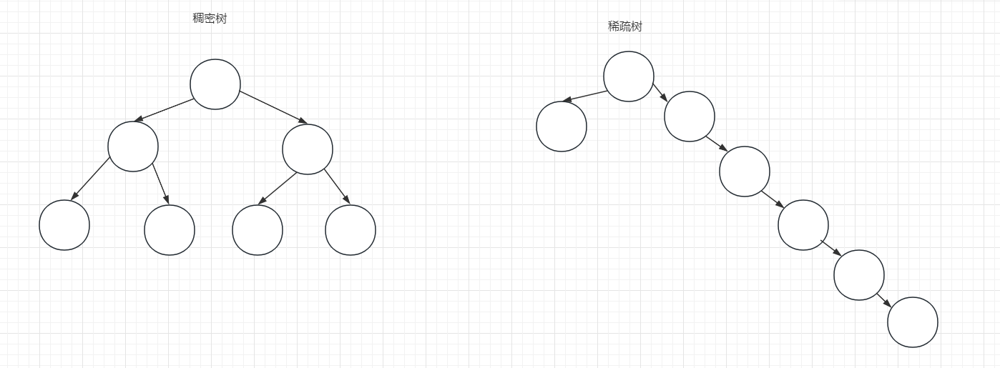
>
>为了提高查找性能, 希望二叉搜索树是一颗稠密树(平衡的)
>
>
>
># 补充: 了解
>
>##  自平衡的二叉搜索树(AVL树)
>
>**AVL树: 自平衡的二叉搜索树  (Self-Balancing Binary Search Tree)**
>
>什么是自平衡的二叉搜索树?
>
>- 是对二叉搜索树的改进, 要求在二叉搜索树的基础上, 每一个结点的左右子树的高度,相差不能超过1  
>
>平衡因子(Balance Factor)
>
>- 左子树高度-右子树高度
>- 取值为-1, 0,  1 
>
>自平衡的二叉搜索树存在的意义?
>
>- 为了解决, 普通二叉搜索树, 在不断的添加和删除过程中, 树的高度迅速增长, 导致添加/删除/查找效率降低的问题.
>- 自平衡的二叉搜索树, 会随着数据的添加，删除自动调整树的高度为“左右平衡”
>
>自平衡的二叉搜索树, 在添加和删除过程中是怎么保证平衡?
>
>- **通过旋转, 保证平衡**
>
>自平衡的二叉搜索树的缺陷? 
>
>- 因为自平衡二叉搜索树平衡要求很严格(平衡性能比较好), 导致了我们要在自平衡的二叉搜索树中操作添加一个/删除一个结点,  会导致不相邻的结点变得不平衡, 如果我们要在这种情况下, 要保证平衡/处理这个不平衡的非相邻结点,    这是非局部性操作(导致操作变得复杂), 所以在实际工作中基本上没有人使用这种自平衡的二叉搜索树
>
>
>
>## 多路查找树
>
>我们之前谈的树，都是一个结点可以有多个孩子，但是它自身只存储一个元素。二叉树的限制更多，结点最多只能有2个孩子。
>
>一个结点只能存储一个元素(key)，在元素非常多的时候，树的高度会非常大。降低树的高度，我们打破一个结点只能存储一个元素(key)的限制，引入多路查找树的概念。
>
>> **多路查找树（Multi-Way Search Tree）：每一个结点的孩子数可以多于2个，而且每个结点可以存储多个元素(多个key)。**
>
>多路: 一个结点可以有多个孩子, 一个结点可以存储多个数据
>
>查找树: 元素(key)之间存在某种特定的排序关系.树中存储的数据, 可以比较大小, 可以根据大小确定查找范围, 根据范围, 找到子
>
>### B树
>
>>  B树:  多路平衡查找树
>
>阶
>
>-  结点中最大的孩子数目称为B树的阶(order), 即最多有几个指针域
>
>平衡: 
>
>- 要求B树中, 每一个叶子结点, 都在最后一个层级上, 而且这个层级要满排
>
>多路:
>
>-  树中每一个结点中, 可能存储有x个数据(x个值域), 可以划分x+1个区间(指针域)
>
>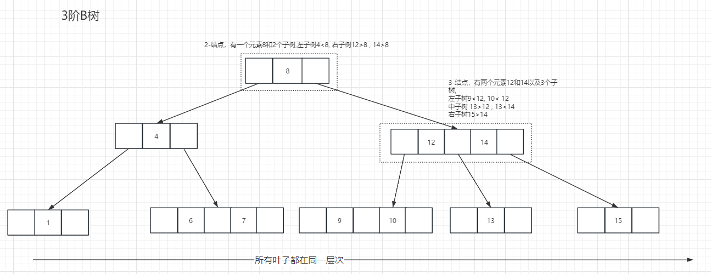
>
>B树中的2个问题:
>
>1. B树都是向上长高的
>2. B树中数据的添加, 永远是和一个在最底层级已经存在的节点共同构建一个新节点
>
>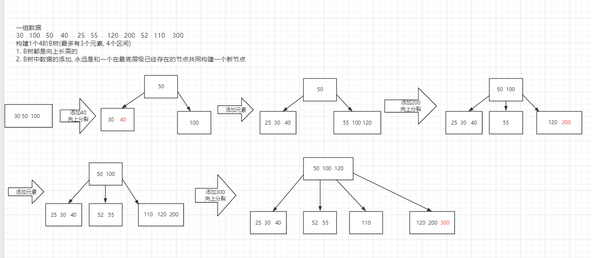
>
>
>
>### 2-3-4树
>
>2-3-4树是一棵多路查找树(4阶B树)：
>
>- 每个结点都具有2个孩子（2-结点），或3个孩子（3-结点）,或4个孩子(4-结点)
>- 一个2-结点包含一个元素(key)和2个孩子（或没有孩子）
>- 一个3-结点包含一小一大2个元素和3个孩子（或没有孩子）
>- 一个4-结点包含3个元素和4个孩子（或没有孩子）
>- 2-3-4树是一种能够动态保持完美平衡的树，所有叶子结点都在同一层，这样从根结点到任意一个叶子结点的路径都是一样长的(完美平衡)。
>
>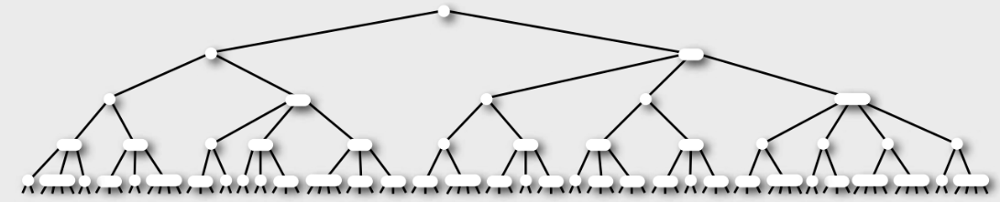
>
>
>
>#### 查找
>
>**查找操作过程**
>
>1. 从树的根结点开始查找结点L, 类似于BST
>2. 确定要查找的关键字L的位置。由于L在K和R之间，因此我们向树的中间子树走去，到达包含M和O的结点。
>3. 在结点M和O中，由于L小于M，我们向左走，到达包含关键字L的结点。
>4. 在这个结点中找到关键字L，因此查找操作成功。
>
>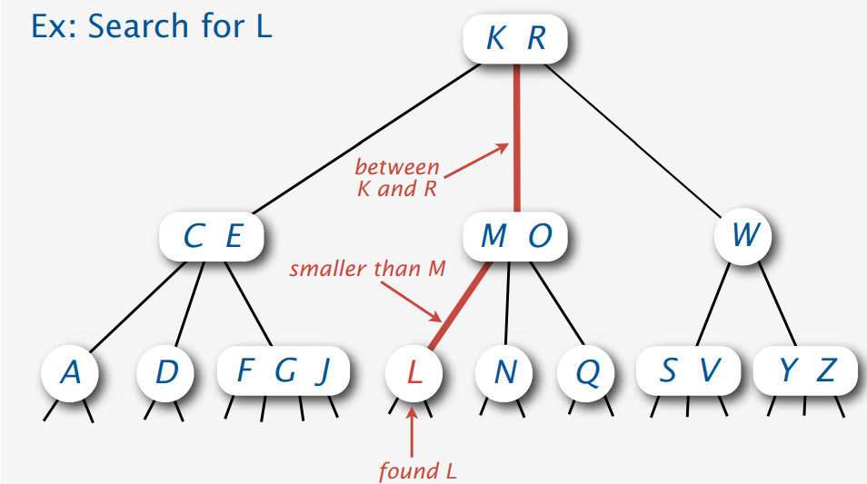
>
>
>
>#### 插入
>
>查找操作没有引入结点的变化，不会影响树的平衡，但插入操作就不同了。为了维持平衡，操作就比普通BST树复杂很多。
>
>我们将插入操作分为下面几种情况：
>
>**1.如果是在2-结点中插，直接将2-结点转换为3-结点**
>
>- 要插入的结点key是B
>- 插入操作从树的根结点开始查找插入位置。B小于K，所以沿着根结点的左子树继续查找。
>- 接下来，我们到达了包含关键字C和E的结点。由于B小于C，我们继续向左子树移动。
>- 到达一个包含关键字"A"的叶子结点。在这个结点中，"B"应当插入"A"的右边，因为"B"大于"A"。
>- 在这个2-结点（只包含一个关键字的结点）中插入B，它变成了一个3-结点（包含两个关键字的结点），现在包含A和B。
>- 这种插入方法保持了树的平衡性。如果"B"被插入为"A"的子结点，将违反2-3-4树的性质，因为所有叶子结点都必须在同一层。
>
>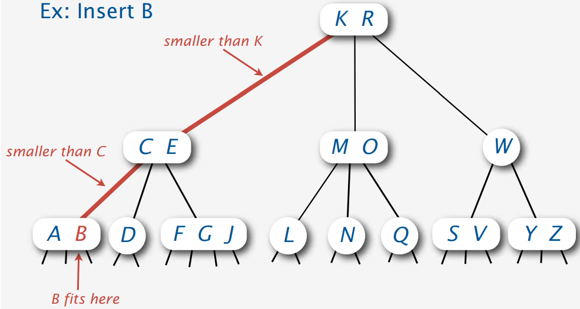
>
>**2.如果是在3-结点中插入，直接将3-结点转换为4-结点。**
>
>- 要插入的结点key是X
>- 插入操作从树的根结点开始查找插入位置。由于"X"大于R，我们知道它应该位于R的右侧。因此，我们向右子树移动。
>- 在右子树中，我们到达了含有单个关键字W的节点。
>- 由于"X"大于W，我们再次向右移动，到达了含有关键字Y和Z的节点。
>- 在这个3-节点中，"X"应该插入Y的左边。
>- 将"X"插入现有的3-节点（含有Y和Z的节点），节点将变成一个4-节点，现在包含X, Y, 和Z三个关键字。
>
>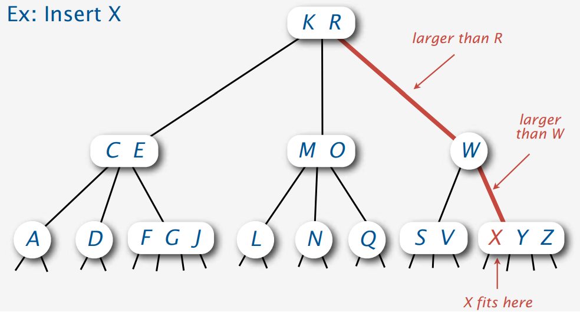
>
>
>
>**3.如果在4-结点中插入key, 被插入结点的父节点是3-结点**
>
>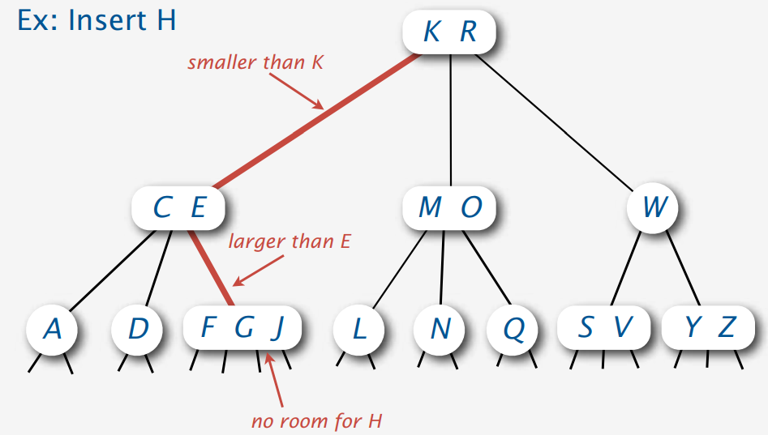
>
>按照顺序查找插入位置，发现"H"需要插入到4-结点的"G"和"J"之间，但2-3-4 树可没有5-结点，怎么办呢？
>
>**分裂这个4-结点**
>
>1. 分裂4-结点"F G J"，可以选择一个key将它放入父结点中。进行结点分裂。
>2. 我们选择将"G"放入父节点中，这是因为"G"是4-结点"F G J"的中间key，将它放入父节点中。原先的F和J就可以均匀分布在这个父节点下方。
>3. 4结点分裂成两个2-结点后，就可以查找"H"的插入位置。
>4. H应该插入J的左边，所以可以和J一起组成一个3-结点。
>5. 这样就在不破坏2-3-4 树平衡的情况下，完成了4-结点插入操作。
>
>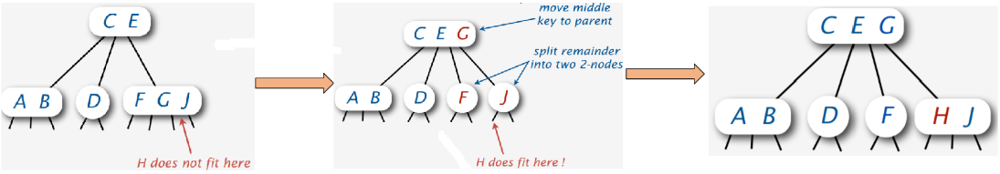
>
>**4.如果在4-结点中插入key, 被插入结点的父节点是4-结点**
>
>有两种解决办法：
>
>1. 自底向上分裂法：
>
>  1. 如果分裂一个4-子结点时发现它的父节点也是4-结点，那么就继续分裂这个4-父节点。
>  2. 这个过程自底向上，沿着查找路径一直分裂，可以一直分裂到根结点。(如果根结点也是4-结点，那么需要增加树的高度)
>  3. 这个方式，相当于走回头路，需要来回遍历树，效率不高。一般更推荐下面的"自顶向下分裂法"
>
>2. <span style=color:red;background:yellow>**自顶向下分裂法：**</span>
> 
>   1. 在查找插入位置的过程中，只要遇到4-结点就分裂它。
>   2. 这种分裂方式分裂一个4-结点时，它的父节点肯定不是4-结点，所以它不会来回遍历树。(因为父节点如果是4-结点，已经被分裂了)
>  3. 这种分裂方式还会带来一个好处，在查找到插入位置时，一定可以直接进行插入。(因为当前结点肯定不是4-结点了)
>
>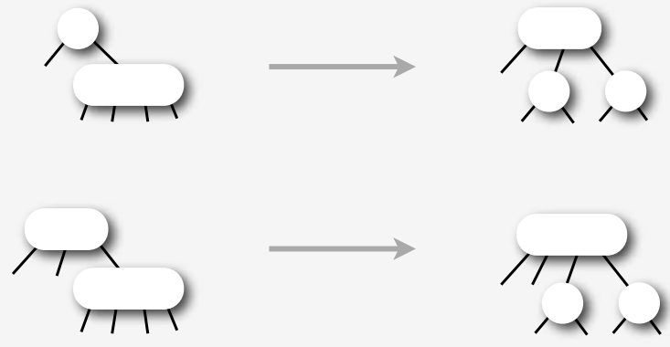
> 
> 2-3-4树的生长过程
> 
>1. **插入A**：树开始时为空。首先插入关键字"A"，创建了一个2-节点。
>2. **插入S**：接着插入"S"，它被添加到现有的2-节点中，使之成为一个3-节点。
>3. **插入E**：然后插入"E"，它被添加到现有的3-节点中，使之成为一个4-节点。
>4. **插入R，树增长一个层级：**然后插入"R"，此时树仅有一个4-结点，按照上面的<span style=color:red;background:yellow>**自顶向下分裂法**</span>，需要分裂这个4-结点。
>  1. 由于这个4-结点是一个根结点，所以分裂这个4-结点会使得树的高度增加一层。
>  2. 这个分裂过程会把中间key值"E"作为新的根结点，A和S分别成为新的左右子树。
>  3. R比S小，所以它和S组成了一个新的3-结点。
>5. **插入C**：当插入"C"时，它被放在"A"和"E"之间的位置，导致原先的2-节点（包含"A"）变成了一个3-节点。
>6. **插入D**：插入"D"后，由于"A"和"C"之间有空间，它被插入，形成一个满载的4-节点，现在包含"A"、"C"和"D"。
> 7. **插入I**：最后插入"I"。这个关键字适合在"E"的右子节点中插入，这是一个3-节点包含"R"和"S"。由于3-节点还有空间，"I"被插入，形成了另一个满载的4-
> 
> 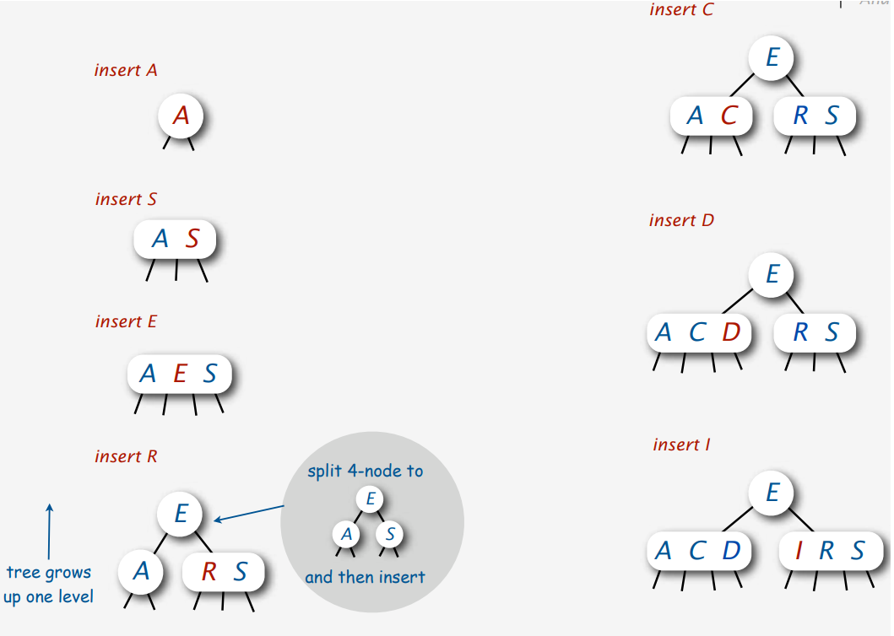
>
>继续插入
>
>1. **树的初始状态**：树的初始状态是一个根节点E，下面有两个子节点。左子节点是一个4-节点包含A, C, D，右子节点是一个4-节点包含I, R, S。
>2. **插入N**：
>  1. 首先，N需要被插入到E的右子树当中，具体位置是"I"和"R"之间。
>  2. 插入过程遇到4-结点"I R S"，所以分裂它。
>  3. 在分裂过程中，中间关键字R被提升到了根节点E，新的根结点变成了一个3-结点，现在包含E, R。
>  4. I和S则成为这个根结点新的左右子树。
>  5. N需要插入到"I"的右边，所以"I R"组成了一个新的3-结点，完成插入。
> 3. **插入B**：
>   1. 首先，B需要被插入到ER的左子树当中，具体位置是"A"和"C"之间。
>   2. 插入过程遇到4-结点"A C D"，所以分裂它。
>   3. 在分裂过程中，中间关键字C被提升到根节点中，新的根结点变成了一个4-结点，现在包含C，E， R。
>   4. A和D则成为这个根结点新的左右子树。
>  5. B需要插入到"A"的右边，所以"A B"组成了一个新的3-结点，完成插入。
> 4. **插入X**：
>   1. 从根结点开始查找插入位置，发现根结点已经是一个4-结点，于是立刻分裂它。
>   2. 根结点分裂导致树的高度增加了一层，E成为了新的2-根节点，C和R成为它的2-子节点
>   3. X需要插入到S的右边，于是S和X形成了一个新的3-结点，完成插入。
> 
>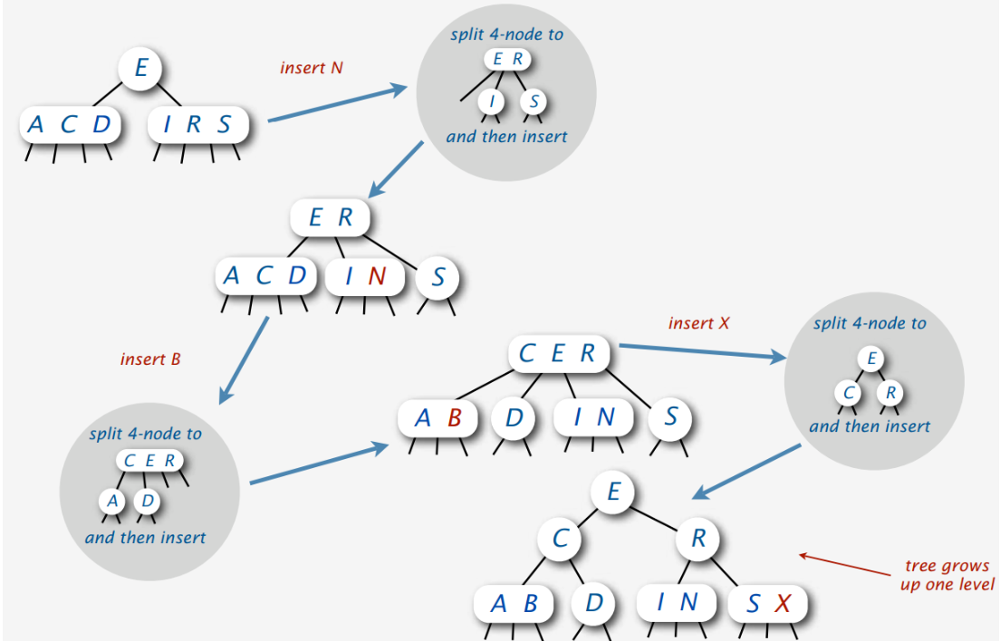
> 
> #### 性能
> 
>2-3-4 树的增加，删除，查找操作的时间复杂度都取决于树的高度 h
>
>假设树的key数量是N，那么：
>
>1. 最坏情况下，树中全部是2-结点，那么树的高度 h = log2 N
>2. 最好情况时，树中全部都是4-结点，那么树的高度 h = log4 N = (1 / 2) * log2 N
>
>可能大家对这个对数结果的高度没什么感觉和概念，那么我们可以举两个例子：
>
>1. 当N = 100万时，2-3-4树的高度在 10 到 20 之间。
>2. 当N = 10亿时，2-3-4树的高度在 15 到 30 之间。
>
>## 红黑树
>
>红黑树可以看成2-3-4 树的一种简化的实现方式
>
>**为什么要有红黑树? 红黑树存在意义是什么?**
>
>1. 相比较线性表: 好处是树比较适合大批量的数据存储
>2. 和普通的树比较: 红黑树是二叉的, 结点用链表表示, 好实现
>3. 和二叉树比较: 红黑树是个二叉搜索树, 可以根据大小查找/添加/删除, 效率更高
>4. 和二叉搜索树比较: 红黑树是平衡的, 不可能变成稀疏树
>5. 和自平衡的二叉搜索树比较: 虽然平衡性能没有自平衡的二叉搜索树好, 但是操作是局部性操作, 代码实现更简单
>
>
>
>**红黑树概念与性质**
>
>1. 红黑树是一个二叉搜索树(红黑树是一个自平衡的二叉搜索树)
>2. 节点颜色: 红黑树要求树中所有结点, 都具有颜色: 要么是红色, 要么是黑色
>3. 黑色结点规则: 红黑树根结点必须是黑色,  叶子结点必须是黑色. 叶子结点(NIL)：在《算法导论》定义红黑树时，将NULL子树定义为叶子结点。这么定义叶子结点是为了更便于描述红黑树的规则
>4. 红色节点规则: 如果一个节点是红色的，则它的两个子节点都是黑色的, 不允许有父子结构上连续红色结点
>5. 黑色高度规则: 红黑树, 要求黑高平衡(每一个叶子NIL, 到根结点的路径上, 经过相同数目的黑色结点).
>
>
>
>**那么红黑树如何通过颜色描述2-3-4树的三种结点呢?** 这里就存在一个结点转换的过程：
>
>- 2-结点直接对应红黑树中的一个黑色节点。
>- 3-结点对应红黑树中的一个黑色节点再加上一个红色节点。
>- 4-结点对应红黑树中的一个黑色节点再加上两个红色节点。
>
>**3-结点转换**
>
>转换后的每个结点都只有一个key，一个黑结点和红结点就构成了以往的3-结点。
>
>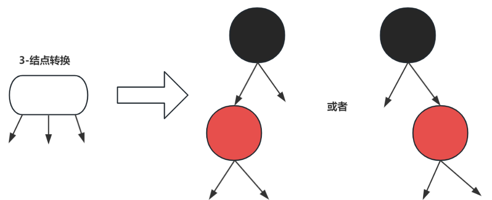
>
>
>
>4-结点转换,如下图
>
>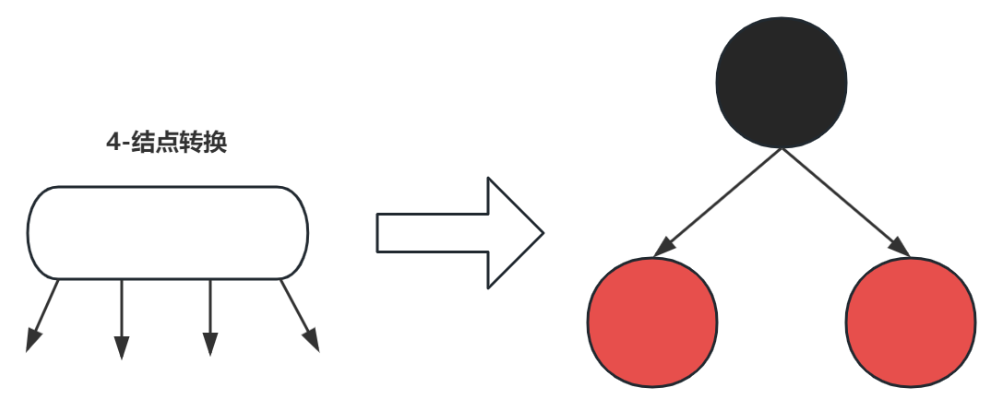
>
>4-结点转换只有上述一种方式，下列几种方式都是不可以的，目的是为了保证红黑树的高度最低，提升效率。
>
>
>
>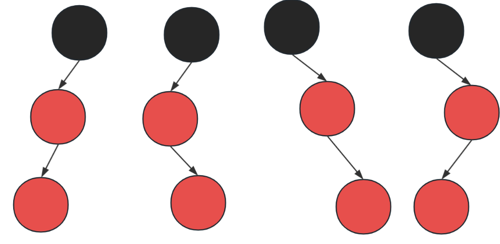
>
>
>
>除了上面的结点颜色理解方式，理解红黑树还可以用"黑边红边"来理解，如下图所示：
>
>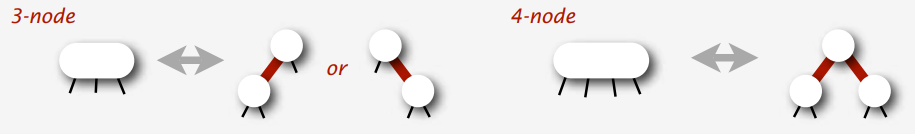
>
>这个红色的边，可以理解成：<span style=color:red;background:yellow>**被红色边链接的几个结点就是逻辑上的同一个结点。**</span>
>
>比如根据上图：
>
>1. 一个2-3-4树中的3-结点，可以转换成红黑树中一个父结点用"红边"链接左子树或者右子树。
>2. 一个2-3-4树中的4-结点，可以转换成红黑树中一个父结点用"红边"同时链接左子树和右子树。
>3. 一个2-3-4树中的2-结点，它和父节点之间的链接肯定是"黑边"。
>
>
>
>
>
>**2-3-4 树和红黑树之间是有一种对应关系的，不过这种对应关系不是 1-1 的 (3-结点可以倾向任意一边)。**
>
>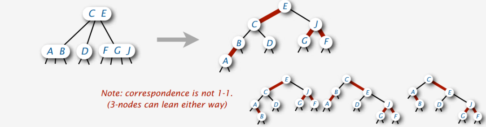
>
>
>
>**Java中哪些地方用到了红黑树?**
>
>- HashMap
>- TreeMap
>- LinkedHashMap
>- HashSet
>- TreeSet
>- LinkedHashSet
>
>
>
>
>
>
>
>
>
>
>
>
