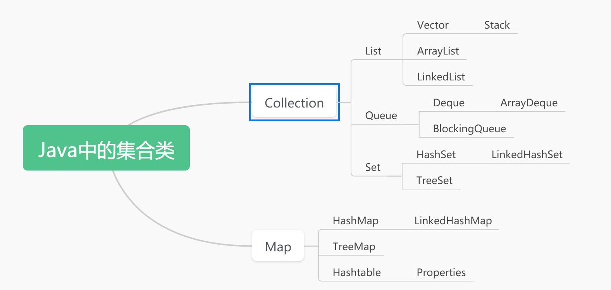
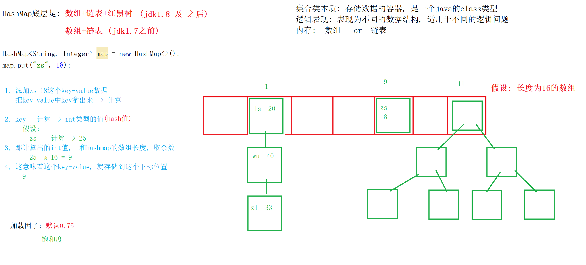

# 1集合类

## 1.1 集合类概念

>什么是集合类?
>
>```java
>是一系列Jdk实现/提供的Java类; 这些类用来让我们在Java代码逻辑中存储数据, 作为数据容器存在.
>Java集合类的本质: 就是一个Java工具类, 能用来让我们存储数据.
>```
>
>Java为什么要有集合类?
>
>```Java
>很多情况下，我们需要对 "一组对象/某些数据" 进行操作。而且很可能事先并不知道到底有多少个对象。为了解决这个问题呢，所以,Java 就创建了一些特殊的JAVA类型用来存储数据, 这些被创建的类型也就是所谓的集合类.(为了解决: 存储更多类型问题, 扩容问题,  数据查找问题, 数据删除问题等等)
>```

>Java的集合类有哪些?
>
>```java
>Java中的集合类, 分为两大类:
>    //  Collection集合体系: 存储单个数据
>    //  Map集合体系: 存储键值对(key-value)数据
>
>注意: key-value具有数据的自我描述性. (数据本身能描述自己)
>```


>特点, 构造方法, api

>特点: (每个集合类我们需要关注它什么特点)
>
>```java
>// 1, 这个集合类的父子关系
>// 2, 逻辑表现
>// 3, 底层表现 (数组: 默认初始长度, 扩容问题)
>// 4, 有序
>// 5, 重复数据
>// 6, 存储null
>// 7, 是否线程安全
>```

# 2, Collection

## 2.1 Collection的特点

>Collection的特点
>
>```Java
>// 1, Collection是Collection集合体系的顶级接口
>// 2, Collection定义了一个数据容器(用来存储数据的)
>// 3, Collection的一些子实现存储数据有序, Collection一些子实现存储数据无序
>// 4, Collection的一些子实现允许存储重复数据, Collection一些子实现不允许存储重复数据
>// 5, Collection的一些子实现允许存储null, Collection一些子实现不允许存储null
>```

## 2.2 Collection的api

>Collection定义的哪些API
>
>```Java
>// -----------Collection: 增删改查相关的api (作为数据容器具有)-------------
>//        boolean add(E e): 添加方法
>//        boolean addAll(Collection<? extends E> c): 添加所有
>//        boolean remove(Object o): 根据内容删除
>//        boolean removeAll(Collection<?> c): 删除所有匹配数据
>//        boolean contains(Object o): 查找
>//        boolean containsAll(Collection<?> c): 查找是否都存在
>//        boolean retainAll(Collection<?> c): 保留匹配数据
>// -----------辅助方法: size isEmpty, equals, hashCode..--------------
>//        int size()
>//        boolean isEmpty()
>//        boolean equals(Object o): 重写了这个方法, 按照内容进行比较
>//        int hashCode()
>//        void clear()
>
>// -----------特殊方法: 帮助我们对Collection进行遍历的---------------------------
>//        Object[] toArray()
>//        返回包含此 collection 中所有元素的数组。
>//        <T> T[] toArray(T[] a)
> //        返回包含此 collection 中所有元素的数组；返回与指定数组的运行时类型相同。
>//        Iterator<E> iterator()
>//        返回在此 collection 的元素上进行迭代的迭代器。
>```


# 3, List

## 3.1 List的特点

>List的特点
>
>```Java
>// 1, List是Collection的接口的子接口
>// 2, List在Collection作为数据容器定义的基础上, 定义了数据结构为线性表
>// 3, List所有子实现存储数据都有序
>// 4, List允许存储重复数据
>// 5, List允许存储null
>```

## 3.2 List的api

>List的api基本上是在Collection的基础上增加了下标操作的api
>
>```Java
>// -----首选拥有从Collection继承来的api: 略(可以参考Collection的api看一下)---------
>
>// -----添加删除相关的: List下标相关操作(看一下)---------------------
>//        void add(int index, E element): 根据下标的添加
>//        boolean addAll(int index, Collection<? extends E> c): 根据下标添加所有
>//        E remove(int index): 根据下标的删除
>//        E get(int index): 根据下标获取下标位置存储的内容
>//        int indexOf(Object o): 根据内容查找这个数据出现的第一次下标位置
>//        int lastIndexOf(Object o): 根据内容查找这个数据出现的最后一次下标位置
>//        E set(int index, E element): 根据修改下标位置存储的内容
>
>// ------特殊api: List下标相关操作--------------------------
>
>//        ListIterator<E> listIterator()
>//        ListIterator<E> listIterator(int index): 
>// 		  提供了一个从某个位置开始, 不仅可以向后遍历, 也可以向前遍历的方式previous()
>
>//        List<E> subList(int fromIndex, int toIndex)
>//        返回列表中指定的 fromIndex（包括 ）和 toIndex（不包括）之间的部分视图。
>```

# 4, ArrayList

## 4.1 ArrayList的特点


>ArrayList的特点
>
>```Java
>// 1, ArrayList是List接口的子实现
>// 2, ArrayList数据结构是线性表
>// 3, ArrayList底层是数组
>// 4, ArrayList底层持有的数组默认初始长度10, 扩容机制1.5倍
>// 5, ArrayList存储数据有序
>// 6, ArrayList允许存储重复数据
>// 7, ArrayList允许存储null
>// 8, ArrayList线程不安全
>```

## 4.2 ArrayList的构造方法

>构造方法
>
>```java
>//        ArrayList()
>//        构造一个初始容量为 10 的空列表。
>//        ArrayList(int initialCapacity)
>//        构造一个具有指定初始容量的空列表。
>//        ArrayList(Collection<? extends E> c)
>//        构造一个包含指定 collection 的元素的列表，这些元素是按照该 collection 的迭代器返回它们的顺序排列的。
>```

## 4.3 ArrayList的api

>api
>
>```java
>由于ArrayList作为List的直接子实现, 所以ArrayList实现的方法都基本上参照于List接口的定义.
>ArrayList并没有很多特殊的api. ArrayList的api基本都来源于List和Collection
>    
>(如果大家记忆:  记List和Collection即可)
>```



# 5, Vector

## 5.1 Vector的特点

>特点
>
>```Java
>// 1, Vector是List的子实现
>// 2, Vector数据结构为线性表
>// 3, Vector的底层结构是数组
>// 4, Vector底层数组的默认长度10,  扩容机制(如果Vector有大于0的增量, 那么,每次扩容扩大增量个, 如果增量是小于等于0, 每次扩容扩为原来的2倍)
>// 5, Vector存储数据有序
>// 6, Vector允许存储重复数据
>// 7, Vector允许存储null
>// 8, 线程安全 (锁)
>// 9, Vector是jdk1.0的时候出现 (ArrayList在jdk1.2时候出现, ArrayList出现就是为了取代Vector)
>```

# 6, Stack


## 6.1 Stack注意事项

>1, 在使用Stack的时候, 虽然我们可以使用来自于其父类继承add,remove...等方法, 但是建议不要使用.
>
>2, Stack是一个栈, 但是是线程安全(效率略低), 所以Java提供了另个一个集合类, 也可以表示为栈, Queue接口下的Deque. (Deque接口主要是作为双端队列, 但是也定义了栈这种数据结构)
>
>```java
>Deque<Integer> stack2 = new ArrayDeque<Integer>();
>```

# 7, LinkedList

## 7.1 LinkedList的特点

>特点
>
>```Java
>// 1, LinkedList是List的子实现, 同时还是Deque接口的子实现.(主要把LinkedList看做List的子实现)
>// 2, LinkedList数据结构表现为: 线性表, 队列, 双端队列, 栈
>// 3, LinkedList底层是一个双向链表
>// 4, LinkedList存储元素有序
>// 5, LinkenList允许存储重复数据
>// 6, LinkedList允许存储null
>// 7, 线程不安全
>```

## 7.2 LinkedList的构造方法

>构造方法
>
>```java
>//        LinkedList()
>//        构造一个空列表。
>//        LinkedList(Collection<? extends E> c)
>//        构造一个包含指定 collection 中的元素的列表，这些元素按其 collection 的迭代器返回的顺序排列。
>```

## 7.3 LinkedList的api

>api
>
>```Java
>如果我们对LinkedList的api进行分类: 如下
>// LinkedList具有Collection定义的方法
>// LinkedList具有List定义的方法
>// LinkedList具有Queue定义的方法(队列的api)
>// LinkedList具有Deque定义的方法(双端队列,  栈)
>    
>// -----------------------------------------------
>// -----------Collection:  -------------
>//        boolean add(E e): 添加方法
>//        boolean addAll(Collection<? extends E> c): 添加所有
>//        boolean remove(Object o): 根据内容删除
>//        boolean removeAll(Collection<?> c): 删除所有匹配数据
>//        boolean contains(Object o): 查找
>//        boolean containsAll(Collection<?> c): 查找是否都存在
>//        boolean retainAll(Collection<?> c): 保留匹配数据
>    
>//        int size()
>//        boolean isEmpty()
>//        boolean equals(Object o): 重写了这个方法, 按照内容进行比较
>//        int hashCode()
>//        void clear()
>
>//        Object[] toArray()
>//        返回包含此 collection 中所有元素的数组。
>//        <T> T[] toArray(T[] a)
>//        返回包含此 collection 中所有元素的数组；返回与指定数组的运行时类型相同。
>//        Iterator<E> iterator()
>//        返回在此 collection 的元素上进行迭代的迭代器。 
>    
>    
>// -----------List:  -------------
>//        void add(int index, E element): 根据下标的添加
>//        boolean addAll(int index, Collection<? extends E> c): 根据下标添加所有
>//        E remove(int index): 根据下标的删除
>//        E get(int index): 根据下标获取下标位置存储的内容
>//        int indexOf(Object o): 根据内容查找这个数据出现的第一次下标位置
>//        int lastIndexOf(Object o): 根据内容查找这个数据出现的最后一次下标位置
>//        E set(int index, E element): 根据修改下标位置存储的内容
>
>//        ListIterator<E> listIterator()
>//        ListIterator<E> listIterator(int index): 
>
>//        List<E> subList(int fromIndex, int toIndex)
>
>// -----------Queue:  -------------
>//        boolean offer(E e)
>//        将指定元素添加到此列表的末尾（最后一个元素）。
>//        E peek()
>//        获取但不移除此列表的头（第一个元素）。
>//        E poll()
>//        获取并移除此列表的头（第一个元素）
>
>// -----------Deque:  -------------   
>//        boolean offerFirst(E e)
>//        在此列表的开头插入指定的元素。
>//        boolean offerLast(E e)
>//        在此列表末尾插入指定的元素。
>//        E peekFirst()
>//        获取但不移除此列表的第一个元素；如果此列表为空，则返回 null。
>//        E peekLast()
>//        获取但不移除此列表的最后一个元素；如果此列表为空，则返回 null。
>//        E pollFirst()
>//        获取并移除此列表的第一个元素；如果此列表为空，则返回 null。
>//        E pollLast()
>//        获取并移除此列表的最后一个元素；如果此列表为空，则返回 null。
>
>//        E pop()
>//        从此列表所表示的堆栈处弹出一个元素。
>//        void push(E e)
>//        将元素推入此列表所表示的堆栈。 
>```

# 8, Queue


## 8.1 Queue的特点

>特点
>
>```Java
>// 1, Queue接口是Collection的子接口
>// 2, Queue数据结构定义队列
>// 3, Queue存储数据有序
>// 4, Queue允许存储重复数据
>// 5, Queue不允许存储null  (LinkedList除外)
>
>注意: 因为如果一个队列中没有存储数据了, 我们又调用了队列的出队列方法, Queue下面的实现, 返回了一个null, 用来标记队列没有数据可以出队列. 所以如果我们允许队列存储null, 那么就会在出队列的时候返回null引发歧义(不知道到底是我们存储的, 还是标记结束), 为了避免这个情况出现Queue在设计的时候, 不允许存储null.
>```

## 8.2 Queue的api

>api
>
>```java
>Queue是Collection的子接口, Queue具有Collection定义的所有方法
>    
>// -----------Queue-----------------
>//        boolean offer(E e)
>//        将指定元素添加到此列表的末尾（最后一个元素）。
>//        E peek()
>//        获取但不移除此列表的头（第一个元素）。
>//        E poll()
>//        获取并移除此列表的头（第一个元素）
>```

# 9, Deque

## 9.1Deque的特点


>特点
>
>```java
>// 1, Deque接口是Queue接口的子接口
>// 2, Deque接口在Queue定义为队列的基础上, 又表现为双端队列 和 栈
>// 3, Deque存储数据有序
>// 4, Deque允许存储重复数据
>// 5, Deque不允许存储null  (LinkedList除外)
>```

## 9.2 Deque的api

>api
>
>```Java
>Deque是Queue接口和Collection的子接口, Deque具有Queue和Collection定义的所有方法
>
>// -----------Deque:  -------------   
>//        boolean offerFirst(E e)
>//        在此列表的开头插入指定的元素。
>//        boolean offerLast(E e)
>//        在此列表末尾插入指定的元素。
>//        E peekFirst()
>//        获取但不移除此列表的第一个元素；如果此列表为空，则返回 null。
>//        E peekLast()
>//        获取但不移除此列表的最后一个元素；如果此列表为空，则返回 null。
>//        E pollFirst()
>//        获取并移除此列表的第一个元素；如果此列表为空，则返回 null。
>//        E pollLast()
>//        获取并移除此列表的最后一个元素；如果此列表为空，则返回 null。
>
>//        E pop()
>//        从此列表所表示的堆栈处弹出一个元素。
>//        void push(E e)
>//        将元素推入此列表所表示的堆栈。 
>```

# 10, ArrayDeque

## 10.1 ArrayDeque的特点


>特点
>
>```java
>// 1, ArrayDeque是Deque接口的子实现
>// 2, 数据结构表现:  队列, 双端队列, 栈
>// 3, 底层结构是数组: 循环数组
>// 4, 默认初始长度:16;  默认扩容机制:2倍 --> 数组长度保持2的幂值
>// 5, 存储元素有序
>// 6, 允许存储重复数据
>// 7, 不允许存储null
>// 8, 线程不安全
>
>// 注意: 我们可以在ArrayDeque的构造方法中, 给他指明数组长度, 但是当我们给他一个长度x (x大于等于8), 它会把ArrayDeque的底层数组变成一个长度为大于给定的x的最小的2的幂值
>// 注意: 但是当我们给他一个长度x 小于8, 底层构建数组长度是8
>```
>

# 11, BlockingQueue

## 11.1 BlockingQueue的注意事项

>1, BlockingQueue: 阻塞队列;  什么是阻塞队列? 阻塞队列的应用场景?
>
>```Java
>阻塞队列:
>// 一个大小容量有限的队列
>// 添加操作的时候, 队列添加满了, 添加线程等待
>// 删除操作的时候, 队列删除空了, 删除线程等待
>```
>
>2, BlockingQueue的哪些方法是阻塞的?
>
>```java
>// BlockingQueue关于添加和删除的方法有四类:
>//       不满足条件抛出异常: add, remove
>//       不满足条件返回特殊值: offer(布尔值), poll(null)
>//       不满足条件一直阻塞: put, take
>//       在指定时间内阻塞:  超时的offer/poll
>```


# 12, Map

## 12.1 Map的特点

>特点
>
>```Java
>// 1, Map是Map集合体系的顶级接口
>// 2, Map是一个存储映射数据(key-value; 键值对)的数据容器
>// 3, Map的一些子实现有序, 一些子实现存储数据无序: (指key)
>// 4, Map不允许存储重复数据: (指key)
>// 5, Map的一些子实现允许存储null, Map的一些子实现不允许存储null: (指key)
>
>注意: Map没有办法'直接'使用foreach循环, 因为Map和Collection不一样( Collection<E> extends Iterable<E>), Map从接口名上不是Iterable子接口 (也就意味着Map接口不具有Iterator方法).
>```

## 12.2 Map的api

>api
>
>```Java
>        // ----添加删除相关----------------
>//        V put(K key, V value): 添加方法
>//        void putAll(Map<? extends K,? extends V> m): 添加所有
>//        V remove(Object key): 根据key删除键值对
>//        V get(Object key): 根据key获取key对应value
>//        boolean containsKey(Object key): 查找key是否存在
>//        boolean containsValue(Object value): 查找value是否存在
>        // -----辅助方法------------------
>//        int size()
>//        返回此映射中的键-值映射关系数。
>//        int hashCode()
>//        返回此映射的哈希码值。
>//        boolean isEmpty()
>//        如果此映射未包含键-值映射关系，则返回 true。
>//        boolean equals(Object o)
>//        比较指定的对象与此映射是否相等。
>//        void clear()
>//        从此映射中移除所有映射关系（可选操作）。
>        // -----特殊方法(在实际使用的时候,主要是用来帮助我们遍历Map数据)-------
>//        Set<K> keySet()
>//        返回此映射中包含的键的 Set 视图。
>//        Collection<V> values()
>//        返回此映射中包含的值的 Collection 视图。
>//        Set<Map.Entry<K,V>> entrySet()
>//        返回此映射中包含的映射关系的 Set 视图。
>```


# 13, HashMap

## 13.1 HashMap的底层结构

>HashMap的底层机构:  数组+链表+红黑树  (jdk1.8)
>
>​                                        数组+链表(jdk1.8之前)
>



## 13.2 HashMap的特点

>1, 基本特点
>
>```Java
>// 1, HashMap是Map接口的子实现
>// 2, HashMap的底层结构:  数组+链表+红黑树(红黑树是在Jdk1.8时候引入的结构)
>// 3, 数组的默认初始长度16,  扩容机制2倍, 加载因子默认是0.75
>// 4, HashMap存储数据无序
>// 5, HashMap不允许存储重复的key (什么叫重复? )
>// 6, HashMap允许存储null作为key
>// 7, 线程不安全
>```
>
>2, 加载因子
>
>```Java
>// HashMap底层是一个数组+链表+红黑树的结构, 在存储数据的时候, 我们需要根据存储的元素数据量进行数组扩容, 当HashMap中存储的数据量大于阈值, 就要扩容.
>
>	阈值 = 数组长度 * 加载因子
>	12   = 16  *  0.75
>```
>
>3, HashMap底层持有数组的类型
>
>```Java
>// HashMap底层持有的数据, 是一个Node类型的数组
>
>Node[] table; // HashMap的底层数组
>class Node{
>        key,
>        value,
>        hash, // key计算的hash值
>        next  // 后续构建链表
>}
>```
>
>4, 给HashMap指定初始长度
>
>```Java
>// 如果我们在构造方法中, 提供一个长度, 以供HashMap创建底层数组, 假如我们提供一个数据X, 它会创建一个'大于等于'X的长度的最小的2的幂值作为数组长度
>
>注意: 结合给定值变成2的幂值, 以及数组长度默认是16, 扩容机制扩为原来的2倍 --> 数组长度永远是2的幂值
>```
>
>5, HashMap中, 每一个key的Hash值的取法
>
>```java
>// key如果是null, hash值0
>// key不是null:    获得key的hashCode 并且 异或上 key的hashCode向right移动16位
>
>(key == null) ? 0 : (h = key.hashCode()) ^ (h >>> 16);
>
>// 我们希望在使用HashMap存储数据的时候, 每一个key-value的key经过计算之后,散列的下标位置都不同.(理想状态)
>
>// 因为数组长度是2的幂值, 希望key散列的下标位置都不同, 等价于希望key的hash低位都不要一样
>
>// 希望不同key的hash值低位尽可能不要相同
>
>// (h = key.hashCode()) ^ (h >>> 16);让hashCode参数, 高位和低位混合,得到hash值
>```
>
>6, 在HashMap中怎么判断两次添加的key-value数据的key重复了?
>
>```Java
>判断的依据
>// 1, 首要要求两个key的hash值要一样
>// 2, 在满足hash值一样之后,  还要要求: 两个key直接相等 或者 相equals
>
>p.hash == hash &&  ((k = p.key) == key || (key != null && key.equals(k)))
>```
>
>7, 如果在HashMap添加数据的时候, key重复了
>
>```Java
>当key重复的时候, 新添加的key-value数据的value会替换旧的key-value数据的value
>并且把旧的value返回出来(旧key存储不动)
>```
>
>
>
>8, 链表什么时候转化为红黑树? 
>
>```Java
>// 当HashMap的某个下标位置, 链表长度超过8,达到9个结点的时候(算上新添加的结点), 就要由链表转化为红黑树.
>// 一般我们称为链表转化为红黑树的阈值是8(链表长度的阈值是8).
>```
>
>9, 在HashMap中, 链表长度超过8达到9, 一定会由链表转化为红黑树吗?
>
>```Java
>// 不一定
>// 如果HashMap的底层数组长度是小于64的话,  链表长度超过8达到9, 不是转化为红黑树, 而是去扩容底层数组
>// 如果HashMap的底层数组长度是大于等于64的话,  链表长度超过8达到9, 才会转化为红黑树.
>```
>
>10, 红黑树什么时候转化回链表?
>
>```Java
>删除
>// 如果HashMap删除的数据在红黑树上, 当删除的时候红黑树的根结点/根的左右结点/根的左结点的左结点, 这四个结点有一个是null , 要由红黑树转化回链表.
>root == null || root.right == null || (rl = root.left) == null || rl.left == null) 
>
>扩容    
>// 扩容的时候, 红黑树要重新在HashMap的数组上进行散列, 只会散列到两个位置, 任一位置的数据量小于等于6的话, 都要由红黑树转化回链表.
>```
>
>11, 扩容问题: 数据重新散列的问题
>
>```Java
>// 在扩容的时候, 在旧数组的x下标位置存储的key-value数据, 经过扩容之后, 要么还在x位置, 要么在旧数组长度+x位置;  只有这两个选择.
>```
>
>12, HashMap中红黑树的一些问题
>
>```Java
>// 1, HashMap什么时候引入的红黑树? jdk1.8
>// 2, HashMap为什么要引入红黑树? 
>// 3, HashMap中的红黑树, 是按照什么比较大小确定左右方向的? 按照hash值比较大小确定方向
>```
>
>13, 为什么链表转化为红黑树阈值是8, 而红黑树转化为链表阈值是6? (可能会问)(这个问题的本身就有问题) 
>
>```Java
>// 如果阈值设为一样, 有可能红黑树和链表会在不断的添加和扩容过程中反复转化. 所以我们预留了一部分范围缓冲
>```
>

### HashMap的添加数据的流程

>流程
>
>```java
>// 1, 有一份key-value数据, 要添加的HashMap中
>// 2, 取出key 计算 hash值 ((h = key.hashCode()) ^ (h >>> 16);)
>  取移位和异或运算的原因是希望充分散列/尽量不冲突
>// 3, 用计算的hash值和数组长度取模: (n - 1) & hash
> 推出一个隐含的结论, 在取模计算中 只有hash值的低位会起效果
>// 4, 根据上一步计算的下标, 判断这个下标位置是否已经存储了内容, 如果没有存储内容, 直接创建一个结点存储到这个下标位置
>      结点是Node类型, 包含: key,value, hash,next四个参数
>// 5,  根据上一步(第3)计算的下标, 这个下标位置可能已经存储了元素:  先判断是否重复
>       hash一样; 并且,  两个key要么直接相等, 要么相equals
>			p.hash == hash && ((k = p.key) == key || (key != null && key.equals(k)))
>//      5.1 如果key值重复了, 新的key-value的value值覆盖旧值   
>//      5.2 如果key值不重复, 接着按照链表向下比较, 在遍历链表的过程中还是判断链表中的结点是否重复, (重复了, 新值覆盖旧值)
>//          如果在这个链表比较的过程中, 一直不重复, 把这份新的key-value数据,构建一个结点,添加到这个链表的尾部
>// 6, 如果在这个下标位置, 不重复, 添加(构建链表)(5.2步骤), 如果添加一个元素之后, 导致链表出长度(超过8, 达到9), 那么添加完成之后, 这个链表要转化为红黑树
>//         如果转化红黑树的过程中, 发现数组长度小于64, 选择扩容(元素重新按照新长度散列问题), 而非转化为红黑树
>     
>// 7, 假设上述步骤添加成功一份key-value数据:  有可能引起扩容 (整体存储的数据超过阈值)
>           
>// 8, 上述所有的扩容, 都有可能导致原本数组某个位置如果有红黑树, 红黑树被拆成两部分(低位和高位), 任一位置结点数变少, 又有可能导致红黑树转化为链表
>```

## 13.3 HashMap的构造方法

>构造方法
>
>```Java
>HashMap() 
>          构造一个具有默认初始容量 (16) 和默认加载因子 (0.75) 的空 HashMap。 
>HashMap(int initialCapacity) 
>          构造一个带指定初始容量和默认加载因子 (0.75) 的空 HashMap。 
>HashMap(int initialCapacity, float loadFactor) 
>          构造一个带指定初始容量和加载因子的空 HashMap。 
>HashMap(Map<? extends K,? extends V> m) 
>          构造一个映射关系与指定 Map 相同的新 HashMap。 
>```

## 13.4 HashMap的api

>HashMap没有在Map接口的基础上额外定义什么api


# 14, LinkedHashMap

## 14.1 LinkedHashMap的特点

>特点
>
>```java
>// 1, LinkedHashMap是HashMap的子类
>// 2, LinkedHashMap底层基本上完全复用了HashMap的结构 --> LinkedHashMap的特点基本上和HashMap一样 (结构: 数组+链表+红黑树, hash, 重复)
>// 3, LinkedHashMap在HashMap的基础上额外定义了一个双向链表, 用以保证迭代顺序 (重要)
>// 4, LinkedHashMap存储数据有序
>// 5, LinkedHashMap不允许存储重复数据
>// 6, LinkedHashMap允许存储null
>// 7, 线程不安全
>```

## 14.2 LinkedHashMap的构造方法

>构造方法
>
>```java
>LinkedHashMap() 
>          构造一个带默认初始容量 (16) 和加载因子 (0.75) 的空插入顺序 LinkedHashMap 实例。 
>LinkedHashMap(int initialCapacity) 
>          构造一个带指定初始容量和默认加载因子 (0.75) 的空插入顺序 LinkedHashMap 实例。 
>LinkedHashMap(int initialCapacity, float loadFactor) 
>          构造一个带指定初始容量和加载因子的空插入顺序 LinkedHashMap 实例。 
>LinkedHashMap(int initialCapacity, float loadFactor, boolean accessOrder) 
>          构造一个带指定初始容量、加载因子和排序模式的空 LinkedHashMap 实例。 
>LinkedHashMap(Map<? extends K,? extends V> m) 
>          构造一个映射关系与指定映射相同的插入顺序 LinkedHashMap 实例。 
>
>```

## 14.3 LinkedHashMap的api

>LinkedHashMap没有在Map接口的基础上额外定义什么api (甚至LinkedHashMap的api基本上完全复用父类HashMap的实现)


# 15, Hashtable: 了解

## 15.1 Hashtable的特点

>特点: (Hashtable完全用不到, 只会面试中被问到, 和HashMap做对比)
>
>```Java
>// 1, Hashtbale是Map的子实现
>// 2, Hashtable底层结构是: 数组+链表  (和HashMap在jdk1.8之前一样)
>// 3, Hashtable底层数组长度11, 扩容机制2倍+1.
>// 4, Hashtable存储数据无序
>// 5, Hashtable不允许存储重复数据 (重复的定义和HashMap一样)
>// 6, Hashtable不允许存储null作为key, 也不允许存储null作为value
>// 7, 线程安全.
>// 8, jdk1.0时候出现, HashMap是1.2出现 (HashMap出现就是为了取代Hashtable)
>```

# 16, Properties: 了解

>面试不会问, 工作用的不多. 后面学的一些知识和这个相关.
>
>```Java
>// 1, Properties是Hashtable子类
>// 2, 一般我们使用Properties的时候, 是为了持久化.或者加载配置文件配置项.
>```


# 17, TreeMap

## 17.1 TreeMap的特点


>特点
>
>```Java
>// 1, TreeMap是Map接口子实现
>// 2, TreeMap数据结构表现是红黑树
>// 3, TreeMap存储数据大小有序
>// 4, TreeMap不允许存储重复数据  (什么叫重复?  key的大小一样)
>// 5, TreeMap不允许null作为key
>// 6, TreeMap线程不安全
>```

## 17.1 TreeMap的构造方法

>构造方法
>
>```Java
>TreeMap() 
>          使用键的自然顺序构造一个新的、空的树映射。 
>TreeMap(Comparator<? super K> comparator) 
>          构造一个新的、空的树映射，该映射根据给定比较器进行排序。 
>    
>TreeMap(Map<? extends K,? extends V> m) 
>          构造一个与给定映射具有相同映射关系的新的树映射，该映射根据其键的自然顺序 进行排序。 
>TreeMap(SortedMap<K,? extends V> m) 
>          构造一个与指定有序映射具有相同映射关系和相同排序顺序的新的树映射。 
>```

## 17.2 TreeMap的api

>api
>
>```java
>//  -----Map接口定义的api---------
>
>// ------自己的新的关于大小操作的api---------------------
>
>//        Map.Entry<K,V> ceilingEntry(K key): 返回大于等于给定值的键值对
>//        K ceilingKey(K key): 返回大于等于给定值的key
>//        Map.Entry<K,V> floorEntry(K key): 返回小于等于给定值的键值对
>//        K floorKey(K key): 返回小于等于给定值的key
>//        Map.Entry<K,V> higherEntry(K key): 返回大于给定值的键值对
>//        K higherKey(K key): 返回大于给定值的key
>//        Map.Entry<K,V> lowerEntry(K key): 返回小于给定值的键值对
>//        K lowerKey(K key): 返回小于给定值的key
>
>//        Map.Entry<K,V> firstEntry(): 获得第一份键值对()最小
>//        K firstKey(): 获得第一份key()最小
>//        Map.Entry<K,V> lastEntry(): 获得最后一份键值对(最大)
>//        K lastKey(): 获得最后一份key(最大)
>//        Map.Entry<K,V> pollFirstEntry(): 删除第一份数据(最小)
>//        Map.Entry<K,V> pollLastEntry(): 删除最后一份数据(最大)
>
>
>//        NavigableSet<K> navigableKeySet()
>//        返回此映射中所包含键的 NavigableSet 视图。
>//        如果此映射为指定值映射一个或多个键，则返回 true。
>//        NavigableSet<K> descendingKeySet()
>//        返回此映射中所包含键的逆序 NavigableSet 视图。
>//        NavigableMap<K,V> descendingMap()
>//        返回此映射中所包含映射关系的逆序视图。
>
>
>//        NavigableMap<K,V> subMap(K fromKey, boolean fromInclusive, K toKey, boolean toInclusive)
>//        返回此映射的部分视图，其键的范围从 fromKey 到 toKey。
>//        SortedMap<K,V> subMap(K fromKey, K toKey)
>//        返回此映射的部分视图，其键值的范围从 fromKey（包括）到 toKey（不包括）。
>//        SortedMap<K,V> tailMap(K fromKey)
>//        返回此映射的部分视图，其键大于等于 fromKey。
>//        NavigableMap<K,V> tailMap(K fromKey, boolean inclusive)
>//        返回此映射的部分视图，其键大于（或等于，如果 inclusive 为 true）fromKey。
>//        SortedMap<K,V> headMap(K toKey)
>//        返回此映射的部分视图，其键值严格小于 toKey。
>//        NavigableMap<K,V> headMap(K toKey, boolean inclusive)
>//        返回此映射的部分视图，其键小于（或等于，如果 inclusive 为 true）toKey。
>```


# 18, Set

## 18.1 Set 的特点

>特点
>
>```java
>// 1, Set接口是Collection的子接口
>// 2, Set接口数据结构: 集合
>// 3, Set的一些子实现有序(LinkedHashSet, TreeSet), 有一些子实现是无序的
>// 4, Set都不允许存储重复数据
>// 5, Set的一些子实现允许存储null(HashSet, LinkedHashSet) 有一些子实现不允许存储null(TreeSet)
>```

## 18.2 Set的api

>Set的api和Collection一模一样

# 19, HashSet

## 19.1 HashSet的特点

>特点
>
>```java
>1, HashSet是Set的子实现
>2, HashSet底层持有了一个HashMap对象, 我们添加到HashSet的数据实际上都添加到底层持有的HashMap的key上了.
>3, HashSet的特点基本上要遵照于HashMap的key的特点
>4, 存储数据无序
>5, 不允许存储重复数据(   重复的依据: hashCode, equals )
>6, 允许存储null
>7, 线程不安全
>```

## 19.2 HashSet的构造方法

>构造方法
>
>```java
>HashSet() 
>     构造一个新的空 set，其底层 HashMap 实例的默认初始容量是 16，加载因子是 0.75。 
>HashSet(Collection<? extends E> c) 
>     构造一个包含指定 collection 中的元素的新 set。 
>HashSet(int initialCapacity) 
>     构造一个新的空 set，其底层 HashMap 实例具有指定的初始容量和默认的加载因子（0.75）。 
>HashSet(int initialCapacity, float loadFactor) 
>     构造一个新的空 set，其底层 HashMap 实例具有指定的初始容量和指定的加载因子。 
>```

## 19.3 HashSet的api

>HashSet 并没有在Set/Collection的基础上额外定义什么api, 完全参照Collection定义的api

# 20, LinkedHashSet

## 20.1 LinkedHashSet的特点

>特点
>
>```java
>1, LinkedHashSet是HashSet的子类
>2, LInkedHashSet底层持有了一个LinkedHashMap对象(向LInkedHashSet添加的数据,都加到底层的LinkedHashMap的key上)
>3, LinkedHashSet的特点和LinkedHashMap的key一直
>4, LinkedHashSet存储数据有序
>5, 不允许存储重复数据
>6, 允许存储null
>7, 线程不安全
>```

## 20.2 LinkedHashSet的构造方法

>构造方法
>
>```java
>LinkedHashSet() 
>     构造一个带默认初始容量 (16) 和加载因子 (0.75) 的新空链接哈希 set。 
>LinkedHashSet(Collection<? extends E> c) 
>     构造一个与指定 collection 中的元素相同的新链接哈希 set。 
>LinkedHashSet(int initialCapacity) 
>     构造一个带指定初始容量和默认加载因子 (0.75) 的新空链接哈希 set。 
>LinkedHashSet(int initialCapacity, float loadFactor) 
>     构造一个带有指定初始容量和加载因子的新空链接哈希 set。 
>```

## 20.3 LinkedHashSet的api

>LinkedHashSet 并没有在HashSet/Set/Collection的基础上额外定义什么api, 完全参照Collection定义的api

# 21, TreeSet

## 21.1 TreeSet的特点

>特点
>
>```java
>1, TreeSet是Set的子实现
>2, TreeSet底层持有了一个TreeMap对象
>3, TreeSet的特点和TreeMap的key保持一直
>4, TreeSet存储数据: 大小有序
>5, TreeSet不允许存储重复数据:  (大小重复)
>6, TreeSet不允许存储null
>7, 线程不安全
>```

## 21.2 TreeSet的构造方法

>构造方法
>
>```java
>TreeSet() 
>     构造一个新的空 set，该 set 根据其元素的自然顺序进行排序。 
>TreeSet(Comparator<? super E> comparator) 
>     构造一个新的空 TreeSet，它根据指定比较器进行排序。 
>TreeSet(Collection<? extends E> c) 
>     构造一个包含指定 collection 元素的新 TreeSet，它按照其元素的自然顺序进行排序。 
>TreeSet(SortedSet<E> s) 
>     构造一个与指定有序 set 具有相同映射关系和相同排序的新 TreeSet。 
>```

## 21.3 TreeSet的api

>api
>
>```Java
>boolean add(E e) 
>     将指定的元素添加到此 set（如果该元素尚未存在于 set 中）。 
>boolean addAll(Collection<? extends E> c) 
>     将指定 collection 中的所有元素添加到此 set 中。 
>E ceiling(E e) 
>     返回此 set 中大于等于给定元素的最小元素；如果不存在这样的元素，则返回 null。 
>void clear() 
>     移除此 set 中的所有元素。 
>Object clone() 
>     返回 TreeSet 实例的浅表副本。 
>Comparator<? super E> comparator() 
>     返回对此 set 中的元素进行排序的比较器；如果此 set 使用其元素的自然顺序，则返回 null。 
>boolean contains(Object o) 
>     如果此 set 包含指定的元素，则返回 true。 
>Iterator<E> descendingIterator() 
>     返回在此 set 元素上按降序进行迭代的迭代器。 
>NavigableSet<E> descendingSet() 
>     返回此 set 中所包含元素的逆序视图。 
>E first() 
>     返回此 set 中当前第一个（最低）元素。 
>E floor(E e) 
>     返回此 set 中小于等于给定元素的最大元素；如果不存在这样的元素，则返回 null。 
>SortedSet<E> headSet(E toElement) 
>     返回此 set 的部分视图，其元素严格小于 toElement。 
>NavigableSet<E> headSet(E toElement, boolean inclusive) 
>     返回此 set 的部分视图，其元素小于（或等于，如果 inclusive 为 true）toElement。 
>E higher(E e) 
>     返回此 set 中严格大于给定元素的最小元素；如果不存在这样的元素，则返回 null。 
>boolean isEmpty() 
>     如果此 set 不包含任何元素，则返回 true。 
>Iterator<E> iterator() 
>     返回在此 set 中的元素上按升序进行迭代的迭代器。 
>E last() 
>     返回此 set 中当前最后一个（最高）元素。 
>E lower(E e) 
>     返回此 set 中严格小于给定元素的最大元素；如果不存在这样的元素，则返回 null。 
>E pollFirst() 
>     获取并移除第一个（最低）元素；如果此 set 为空，则返回 null。 
>E pollLast() 
>     获取并移除最后一个（最高）元素；如果此 set 为空，则返回 null。 
>boolean remove(Object o) 
>     将指定的元素从 set 中移除（如果该元素存在于此 set 中）。 
>int size() 
>     返回 set 中的元素数（set 的容量）。 
>NavigableSet<E> subSet(E fromElement, boolean fromInclusive, E toElement, boolean toInclusive) 
>     返回此 set 的部分视图，其元素范围从 fromElement 到 toElement。 
>SortedSet<E> subSet(E fromElement, E toElement) 
>     返回此 set 的部分视图，其元素从 fromElement（包括）到 toElement（不包括）。 
>SortedSet<E> tailSet(E fromElement) 
>     返回此 set 的部分视图，其元素大于等于 fromElement。 
>NavigableSet<E> tailSet(E fromElement, boolean inclusive) 
>     返回此 set 的部分视图，其元素大于（或等于，如果 inclusive 为 true）fromElement。 
>```