# 关键字与保留字

**学习目标:**

- 随着学习深入, 逐渐掌握常见关键字的作用与使用

## 关键字

什么是关键字（keyword）？关键字有什么特点？

- 关键字的定义是：关键字是被Java语法赋予特定含义的单词。
- 关键字的特点是：**关键字都是合法的单词，而且字母必须全部小写。** 

**总得来说，关键字是Java语法具有特定含义的小写单词。**

关键字有什么作用？

其实上述定义已经说明了它的作用，关键字在Java语法中都有特定的含义，**它对编译器具有特殊意义，能够影响编译！**具体来说，关键字往往都用来表示一种程序的结构或者修饰一些程序的结构等等。当然更具体的含义，要针对不同的关键字来说明。

这里举一个非常常见的案例：

class是最常见的关键字之一，它用来表示当前代码中定义了一个类（这样的程序结构）。


## 常见关键字

**分类**

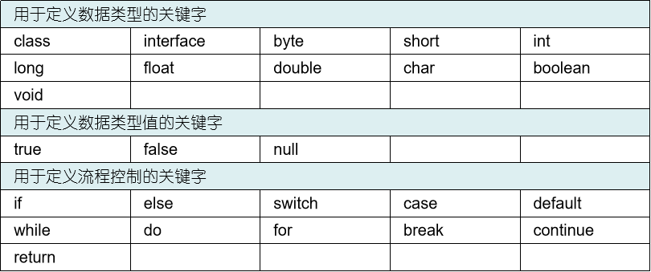


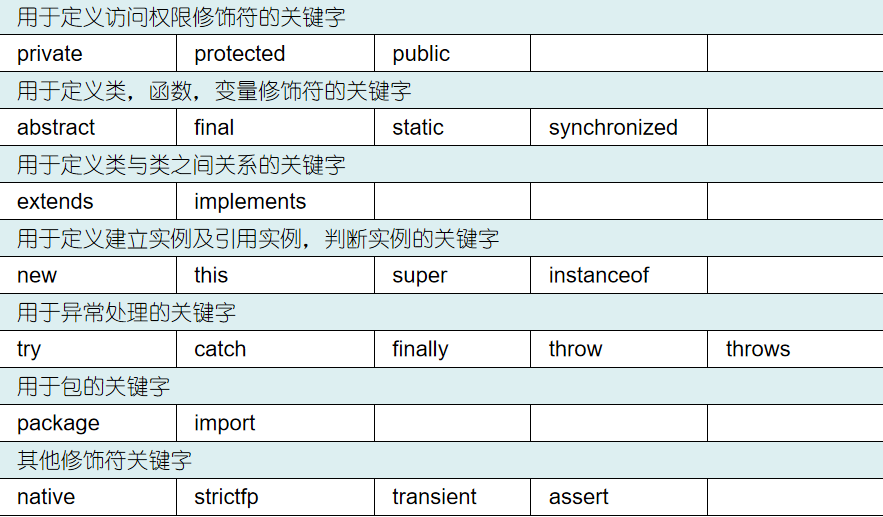


 **作用**

| 关键字       | 含义                                                         |
| ------------ | ------------------------------------------------------------ |
| abstract     | 表明类或者成员方法具有抽象属性                               |
| assert       | 用来进行程序调试                                             |
| boolean      | 基本数据类型之一，布尔类型                                   |
| break        | 提前跳出一个块                                               |
| byte         | 基本数据类型之一，字节类型                                   |
| case         | 用在switch语句之中，表示其中的一个分支                       |
| catch        | 用在异常处理中，用来捕捉异常                                 |
| char         | 基本数据类型之一，字符类型                                   |
| class        | 类                                                           |
| const        | 保留关键字，没有具体含义                                     |
| continue     | 回到一个块的开始处                                           |
| default      | 默认，例如，用在switch语句中，表明一个默认的分支             |
| do           | 用在do-while循环结构中                                       |
| double       | 基本数据类型之一，双精度浮点数类型                           |
| else         | 用在条件语句中，表明当条件不成立时的分支                     |
| enum         | 枚举                                                         |
| extends      | 表明一个类型是另一个类型的子类型，这里常见的类型有类和接口   |
| final        | 用来说明最终属性，表明一个类不能派生出子类，或者成员方法不能被覆盖，或者成员域的值不能被改变，用来定义常量 |
| finally      | 用于处理异常情况，用来声明一个基本肯定会被执行到的语句块     |
| float        | 基本数据类型之一，单精度浮点数类型                           |
| for          | 一种循环结构的引导词                                         |
| goto         | 保留关键字，没有具体含义                                     |
| if           | 条件语句的引导词                                             |
| implements   | 表明一个类实现了给定的接口                                   |
| import       | 表明要访问指定的类或包                                       |
| instanceof   | 用来测试一个对象是否是指定类型的实例对象                     |
| int          | 基本数据类型之一，整数类型                                   |
| interface    | 接口                                                         |
| long         | 基本数据类型之一，长整数类型                                 |
| native       | 用来声明一个方法是由与计算机相关的语言(如C/C++/FORTRAN语言)实现的 |
| new          | 用来创建新实例对象                                           |
| package      | 包                                                           |
| private      | 一种访问控制方式：私用模式                                   |
| protected    | 一种访问控制方式：保护模式                                   |
| public       | 一种访问控制方式：共用模式                                   |
| return       | 从成员方法中返回数据                                         |
| short        | 基本数据类型之一，短整数类型                                 |
| static       | 表明具有静态属性                                             |
| strictfp     | 用来声明FP_strict(单精度或双精度浮点数)表达式遵循IEEE 754算术规范 |
| super        | 表明当前对象的父类型的引用或者父类型的构造方法               |
| switch       | 分支语句结构的引导词                                         |
| synchronized | 表明一段代码需要同步执行                                     |
| this         | 指向当前实例对象的引用                                       |
| throw        | 抛出一个异常                                                 |
| throws       | 声明在当前定义的成员方法中所有需要抛出的异常                 |
| transient    | 声明不用序列化的成员域                                       |
| try          | 尝试一个可能抛出异常的程序块                                 |
| void         | 声明当前成员方法没有返回值                                   |
| volatile     | 表明两个或者多个变量必须同步地发生变化                       |
| while        | 用在循环结构中                                               |

**上述关键字，绝大多数我们都会在JavaSE阶段学习和使用，很快就会学到。**


## 保留字

什么是保留字（reserved word）？

保留字的官方定义是这样的：

 保留字的定义

> 保留字是对**当前版本**的Java，没有特殊含义的单词。
>
> 1. 但是以后的版本中，Java官方可能会将其变成具有特殊含义的单词（也就是说可能升级为关键字）
> 2. 即便以后也不打算升级为关键字，但是Java官方认为你不应该在Java代码中使用的单词，也会变成保留字

总之，概括来说就是： **保留字就是那些Java官方不使用，也不让程序员在代码中使用的单词。**


Java当中的保留字是很稀缺的，以Java8版本为例，目前仅有两个保留字：

1. const
2. goto

------

上面已经说过了，保留字对Java代码来说没有任何含义，请不要在代码中写出保留字！


# 标识符

**学习目标:**

- 掌握标识符的组成规则
- 按照命名规范与约定进行命名(包,类,方法,变量)

## 什么是标识符

​		在编程过程中，经常需要在程序中定义一些符号来标记一些名称，如包名，类名，方法名，参数名，变量名等，这些符号被称为标识符(表示各种各样的名字)。

​		标识符可以由任意顺序的大小写的字母，数字，下划线和美元符号组成，但是标识符**不能以数字开头，也不能是Java中的关键字。**

## 组成规则

- 标识符的开头必须是：
  1. 字母（A~Z 和 a~z）
  2. 下划线（_）
  3. 美元符号（$）
  4. Unicode 字符集中编号为0xC0以及它后面的所有符号
- 标识符的组成必须是：
  1. 数字（0~9）
  2. 字母（A~Z 和 a~z）
  3. 美元符号（$）
  4. 下划线（_）
  5. Unicode 字符集中编号为0xC0以及它后面的所有符号

通过以上标识符的语法要求，做几个总结：

1. 标识符不能以数字开头，但可以由数字组成。

2. 0xC0是一个十六进制数，Unicode 字符集中编号为0xC0后面的字符，几乎包含了世界上绝大多数非英语国家的文字字符。

   这里面当然包括中文，韩文，日文等。所以标识符的命名从语法上来说，直接用中文是完全可以的,但是不允许使用。

3. Unicode 字符集兼容ASCII码表，Unicode 字符集中前128个字符就是ASCII码表中的字符。所以Unicode 字符集中编号为0xC0以及它后面的所有符号是不含很多常用英文字符的，比如：英文逗号，英文句号，空格，回车等。

4. 标识符不能是Java中的关键字和保留字，并且标识符严格区分大小写。

```java
// 标识符的开头
int a = 1;
int A = 1;
int _A = 3;
int $a = 1;
int 你 = 1;
int の = 1;

char c = '你';

// 标识符的组成
int a1 = 1;
int a_ =  1;
int a$ = 1;
int a你 = 1;
// int 2b = 2;

// 标识符不能是Java中的关键字和保留字，并且标识符严格区分大小写。
// int class = 10;
```


下列都是合法的

```java
username
username123
user_name
_userName
$username
```

下列是不合法的

```java
123username 
class		
hello world 
```


## 命名规范

在计算机中，起名字是很常见的操作，为了起好名字，驼峰命名法就被发明了。**所谓驼峰，指的是当多个单词共同组成一个字符串时，不同单词的大写和小写间隔起来，形成一种像驼峰一样的凹凸，故称之为驼峰命名法。** 使用驼峰命名法可以清晰得看到不同单词组成的新字符串

建议初学者在定义标识符时要遵循以下几点规范：

- 包名所有字母一律小写，例如com.cskaoyan.example01（多级包名用“.”隔开）
- 类和接口每个单词的首字母大写，例如Student，Runnable，MyFirstProgram
- 常量名所有字母都大写，单词之间用下划线连接，例如STUDENT_MAX_AGE
- 变量名和方法名的第一个单词首字母小写，从第二个单词开始每个首字母大写，例如，userName，getStudentName


以下哪些标识符的命名规则符合规范：

```Java
1. public class student{}
2. public class TestDemo{}
3. int Num
4. String name
5. public class PersonDemo{}
6. 包名 Test.Demo
7. 包名 com.baidu
8. int nianling
9. String 名字
```


**约定俗称的规范：**

2. 标识符字符串尽量只使用英文字母和阿拉伯数字。
3. 不要使用“$”美元符号，其在命名中有特殊含义，建议程序员不要主动使用它。
4. 不要使用“_”下划线与"$"开头结尾, 其在命名中也有特殊含义，除开特殊场景不要使用它。
6. 其他参考**[Java开发编程规约](http://47.97.82.68:8080/course/Java开发编程规约.html?ws=none)**

# 注释

**学习目标**

- 掌握Java中的三种注释

- 大家写代码的时候能够正确合理使用注释 

  

## 什么是注释？

> **注释在任何编程语言中几乎都会出现，它起着解释说明源代码的作用。**
>
> 在Java中，注释指的是**可以嵌入到Java代码的任何位置的，一种解释说明性的文字。**

这里要理清楚两个点：

1. 注释可以放在Java代码的任何位置。
2. 注释可以是任何解释性文字。

当然注释有自身的语法，不是说随便就把文字写在源代码中。

**注意:**

- 注释是不参与编译的

## 注释的格式

Java支持三种注释的语法格式，分别是：

- 单行注释

  - ```java
    // 注释的文字
    ```

- 多行注释

  - ```java
    /*
    注释的文字
    注释的文字
    注释的文字
    */
    ```

- 文档注释

  - ```java
    /**
     * 注释的文字
     * 注释的文字
     * 注释的文字
     */
    ```

关于三种注释方式，用途是不同的：

**单行注释:**

在解释说明单行或某几行代码时，如果仅需要简短的一句或几句话时，就使用单行注释。

建议在代码中使用单行注释时，双斜线"//"和说明文字的中间应该加上一个空格。如下：

```
// 注意有一个空格
```

**多行注释**

在解释说明单行或某几行代码时，如果简短的一句或几句话不能说清楚，就需要使用多行注释。

从上面说明不难发现，无论是单行注释还是多行注释，都是起着解释说明单行或某几行代码的作用！

那么文档注释起着什么作用呢？

**文档注释：**

在Java代码中，经常有两个大的语法结构需要被解释：

1. 整个类
2. 整个方法

文档注释，就是用来解释这两种结构的。出现了两种文档注释：

1. 类注释
2. 方法注释

Java中对于文档注释的写法，提供了明确的规范，即Javadoc规范。

符合Javadoc规范的文档注释可以使用javadoc指令，输出对应的说明文档。

```java 
javadoc -encoding utf-8 Xxx.java
```

官方JDK文档

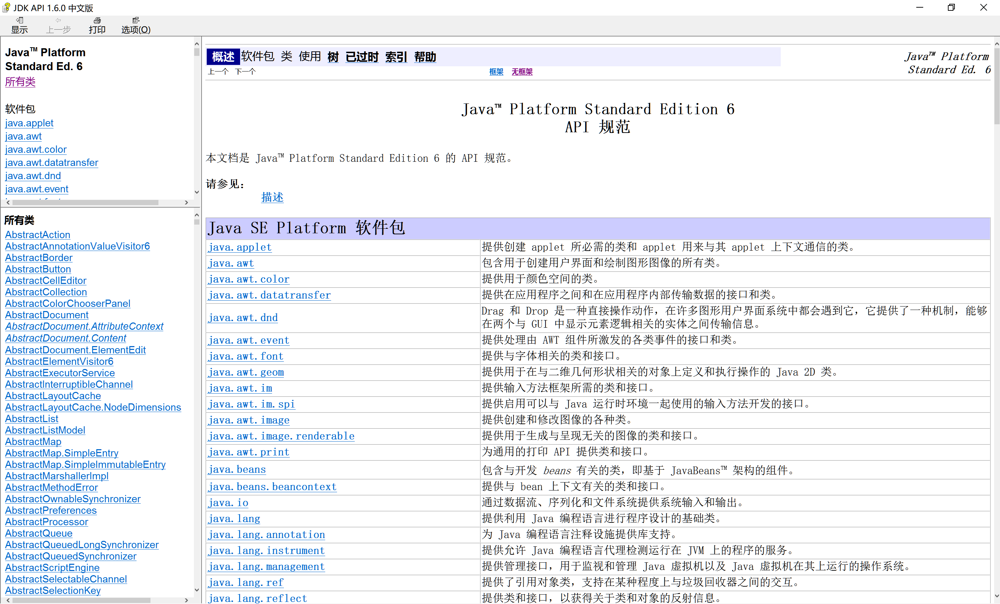

我们常说的JDK文档，实际上就是**根据官方JDK源码中文档注释**，自动生成的。

## 注释的意义

注释都是用英语，汉语这种自然语言去书写的，并且编译器会自动忽略它，**显然注释是写给程序员看的。** 

优秀的程序员，应该养成良好的注释书写习惯。

**注释的好处：**

- 增加代码可读性，这样：

  - 能够让自己在写完这段代码较长时间后，仍然能够通过注释很快理解代码。
  - 能够让接手自己代码的人，也能够很快熟悉代码

  想一下，如果几百上千行代码从头到尾没有一句注释，过了两个月，大概就没什么人能够快速理解该段代码了。这一条是注释最主要的作用。

- 方便自己写代码的时候，记录程序的信息，想一想如果代码写着写着突然想记录一些数据，就只能依靠注释了。

- 写注释可以增加自己写代码时的逻辑性，比如在编码前先用注释标记出每一步应该完成的事情，这样写代码会更流畅。

- 注释也可以作为一种比较简单但十分好用有效的， 查找代码问题的方式。

  - 将一部代码逻辑注释掉，然后运行程序，查看运行结果
  - 反复注释不同的位置，反复测试，最终可以根据结果找到出现问题的代码逻辑，然后加以改正。

关于注释，因为它太重要了，好的注释能大幅度提升团队开发效率，所以大多数成规模的公司都对程序员的代码注释有要求。

关于如何写注释，请参考**[Java开发编程规约](http://47.97.82.68:8080/course/Java开发编程规约.html?ws=none)**，在学习过程中，我们也要求大家按照规范书写注释，养成良好的习惯。


# 变量与常量

**学习目标**

- 掌握数据类型的分类
- 8种基本数据类型的使用
- 掌握常量的定义
- 掌握变量的使用


**强类型语言介绍：**

强类型语言是一种强制类型定义的编程语言。在这种编程语言中，任何变量都必须有数据类型，并且一个变量一旦确定数据类型，如果不经过类型转换，则它永远就是该数据类型了。强类型语言对于变量的数据类型限制得相对严格，变量不能轻易改变数据类型，所以强类型语言编写的程序不会因为数据类型的随意转换而出错，相对更安全。典型的强类型语言有：Java、C#、Python、C++等，目前流行的绝大多数编程语言都是强类型语言。

Java是典型的强类型语言，这就意味着Java当中的每个变量都必须有它的数据类型，并且数据类型不会轻易改变。变量从定义到使用的过程，实际上就是我们编写程序的过程, 使用变量的第一步需要明确数据类型的概念.

## 数据类型

**什么是数据类型？**

数据类型可以看成是变量的分类，我们可以从两个角度理解数据类型：

- 从内存角度理解, 数据最终是要存储在内存中的
  - 数据类型可以看成是对内存空间的一个抽象表达方式，一种数据类型对应一种内存空间分配方式。
  - 该种数据类型的内存空间只能存储该种数据类型的变量值，而不能是别的类型变量值。
- 从数据的使用角度理解, 数据被存储后，是需要被使用的
  - 数据类型， 表示的是一组数据的集合，和基于该数据集合的一组合法操作。
  - 也就是说，数据类型不仅表示一组数据的集合，更重要的是它还限制了这组数据能够执行的操作。

总之，数据类型的意义在于：告诉Java的编译器，定义了何种类型的变量。因为只有明确了数据类型，JVM才知道需要多大内存空间存储它，以及可以对它做什么样的操作

**数据类型分类**

- 8种基本数据类型
- 引用数据类型

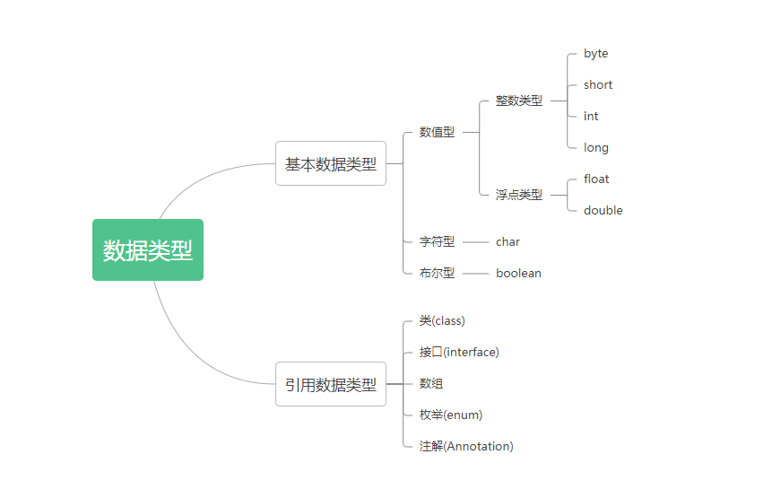


```java
// 8种基本数据类型
// 整型
byte value1 = 1;
short value2 = 1;
int value3 = 1;
long value4 = 1L;
// 浮点
// 单精度
float value5 = 1.0F;
// 双精度
double value6 = 3.14;

// 字符型
char value7 = 'a';
// 布尔型
boolean value8 = true;
boolean value9 = false;
```


### 基本数据类型

基本数据类型（Base Data Type）指的是由Java语言默认提供的八种数据类型，它们的存储空间一般都是固定的。

**计算机中数据存储单位的概念：**

1. 位（bit）：位是最小的存储单位，每一个位存储一个1位的二进制码，即1位存储一个0或者1
2. 字节（Byte）：一个字节由8位组成, 0000 1111

#### 整型

整型有四种：

- byte
  - byte类型也叫字节型，仅占1个字节内存空间，即8位。
- short
	- short 也叫短整型，占用2个字节内存空间，16位。
	- 短整型只比字节型稍大，实际开发中short使用频率也不高。
- int
  - int 本身就是单词integer的缩写，占用4个字节内存空间, 即32位
  - **int 是最常用的整数数据类型，实际开发中整数往往都是int类型的。**
- long
  - long 也叫长整型，占用8个字节内存空间, 即64位
  - 当int类型不足以存储数据时，就需要使用long类型存储数据，在需要很大的整数时才需要使用long类型。


Java程序的数字进制:

- 0b 表示的是二级制
- 0 表示的是八级制
- 0x 表示的是十六级制
- 默认的是十进制


#### 浮点型

浮点数是一个比较独特的概念，它在计算机中的存储表示和有符号整数又有所不同，遵循IEEE754标准。

IEEE754标准的浮点数表示方式牵扯到《计算机组成原理》等计算机基础知识。

严格来说即便不掌握也**不影响**做一名Java开发，但是作为基础的知识，仍然建议每位同学弄懂它。


如果你实在不想去领略计算机组成原理的魅力，那么简单来说：

浮点数的表示方式可以理解为<span style=color:red;background:yellow>**用二进制科学计数法来表示一个二进制数**</span>，即：**a<sub>2</sub> &#215; 2<sup>n</sup>**（其中a<sub>2</sub>是一个二进制数，n是指数）

**在IEEE754标准下，将a<sub>2</sub>称为尾数，n称之为阶码。**

于是，IEEE754标准下的浮点数，就有了两个最重要的特点：

1. 因为有指数运算（阶码），所以<font color=red>**浮点数可以表示非常大和非常小的数！**</font> 

   > 比如：1 * 10<sup>-100</sup> 这个数非常小，1 * 10<sup>100</sup>这个数就非常大。

   <span style=color:red;background:yellow>**这是浮点数的优点，表示范围非常大！**</span>

2. 因为尾数的位数必然是有限的，所以这就导致<font color=red>**浮点数的精度是有限的！**</font>

   > 如果规定尾数只有4位，那么能够表示的有效数字是不可能超过4位的。
   >
   > 比如 **1.234 * 100<sup>100</sup>** 这个数，最多就只能表示1234四个数，这个数再大，后面也都是0。

除此之外，浮点数还有一些很独特的设定，由于不是学习重点，这里不再细表。请自行看文档学习即可。

文档地址:

- [09_补充_IEEE754标准](http://47.97.82.68:8080/course/SE01/V1/09_补充_IEEE754标准.html?ws=none&cf=off)
- [10_补充_有符号整数](http://47.97.82.68:8080/course/SE01/V1/10_补充_有符号整数.html?ws=none&cf=off)


浮点型有两种：

- **float**
  - float 即单精度的浮点数，占用4个字节内存空间，32位。
  - float 相对于double占用空间更小，但它不如double精度高，也没有double表示范围大。
- **double**
  - double 双精度的浮点数，占用8个字节内存空间，64位。
  - double更精确，范围更大，是更常用的浮点数类型。


#### 字符型

所谓字符，指的是像字母，汉字、标点等类似的符号。那么字符型，就是用来表示这些符号的数据类型。

很明显，计算机只能存储二进制数据，不可能也没能力直接存储一个符号（字符）。

计算机中存储字符，实际是通过存储一个数值来映射对应的字符。比如：现在我规定一个整数值1对应字符"a"，那么计算机中存储1，就能够对应上字符"a"。

在上述案例中，把某个字符对应的一个整数值，称之为该"字符的编码值"。而如果用一张表格来存储字符和编码值的映射关系，这就是编码表。

映射关系

| a    | 10   |
| ---- | ---- |
| b    | 11   |
| 你   | 632  |

关于编码的相关概念，我们会在后面详细讲解，这里有个简单的概念认识就可以了。


**Java中的字符型只有一个，那就是char类型。**

char本身就是单词"字符"character的缩写，每一个char类型变量都表示某一个字符，它具有以下特点：

- Java中的char类型变量占用2个字节内存空间。

- Java中的char类型存储字符，实际是存储了一个16位的无符号正整数值。

  注：十六位无符号数，16位全部用来存储数值，只能表示整数，取值范围是<font color=red>**[0,65535]**</font>。

  即Java中的char类型能够表示编码值在<font color=red>**[0,65535]**</font>范围内的的所有字符。

  

- 扩展一下：

  char类型在代码中的表现：

  1. 如果直接输出一个字符型变量：

     ``` java
     char c = 'a';
     System.out.println(c);
     ```

     结果是：

     > a

     字符类型如果直接输出，就会在控制台打印这个字符。

  2. 如果字符型变量参与运算，是可以参与数值运算的：

     ``` java
     char c = 'a';
     System.out.println(c + 10);
     ```

     结果是：

     > 107

     <span style=color:red;background:yellow>**字符型变量参与运算，是编码值参与运算。**</span>

     字符a的编码值是97，所以输出107。

综上，Java中字符型char就是存储一个正整数，来表示字符。只要这么想，基本不会出问题

#### 布尔类型

所谓布尔类型就非常简单了，就是表示真（true）和假（false）。

和字符类型类型，布尔类型也只有一个：boolean类型，它具有以下特点：

- boolean，布尔类型，用来存储真（true）和假（false）两种布尔值，**没有其它取值**。
- 布尔类型变量具体占用内存的大小，要分情况而定（以下作简单了解）根据JVM规范中提供的数据：
  1. 一个独立的boolean类型变量当作int处理，占4个字节。
  2. 在boolean数组当成byte数组处理，一个boolean元素占1个字节，节省空间。


#### 数值基本类型的取值范围

「 **基本数据类型中的整型和浮点型都是表示纯粹的数值的，所以它们能够表示的数值范围我们必须要知道！**」

整型的取值范围是很容易得到的，通过数值位的长度n可以直接算出最大值和最小值

浮点型的取值范围并不是一个普通的区间，严格来说它很复杂，这里我们简单了解一下即可~如果你想知道更详细的，还是请查看 [09_补充_IEEE754标准](http://47.97.82.68:8080/course/SE01/V1/09_补充_IEEE754标准.html?ws=none&cf=off)学习。

| 基本数据类型 | 字节长度 | 大小（位） | 最小值 | 最大值 | 取值范围                                                  |
| ------------ | -------- | ---------- | ------ | ------ | --------------------------------------------------------- |
| **byte**     | 1字节    | 8bit       | -2^7   | 2^7-1  | -128 ~ 127                                                |
| **short**    | 2字节    | 16bit      | -2^15  | 2^15-1 | -32768 ~ 32767                                            |
| **int**      | 4字节    | 32bit      | -2^31  | 2^31-1 | -2147483648 ~ 2147483647（21亿出头）                      |
| **long**     | 8字节    | 64bit      | -2^63  | 2^63-1 | -9223372036854774808 ~ 9223372036854774807（大概922亿亿） |
| **float**    | 4字节    | 32bit      | -      | -      | 大约  &plusmn;3.403E38（有效位数7~8位）                   |
| **double**   | 8字节    | 64bit      | -      | -      | 大约  &plusmn;1.798E308（有效数字16~17位）                |


### 引用数据类型

限制于我们目前学习的知识，还无法给引用数据类型下一个准确的定义。所以，我们这里只简单了解一下就可以了。

仅需要记住下面一点就可以了：

只要不是四类八种基本数据类型，那么它都是引用数据类型。 因为基本数据类型很少，所以我们在Java开发中碰到的变量，非常多都是引用数据类型。最常见的也是最常用的引用数据类型就是String，它表示字符串。


**String类介绍**

String类是JDK源码中提供的一个固有类，也是源码中最常被使用的类型，是最常见的Java引用数据类型。

String的意思是字符串，所以在Java当中，String类型是用来表示字符串的。<font color=red>**Java代码中，所有用双引号直接引起来的内容，都是String类的一个实例，比如"hello world!"。**</font>

一个String类型局部变量的声明、初始化语法是下面形式：

```` java
String str = "hello world!";
````

当然，你直接使用输出语句在控制台输出字符串，也是使用了Java的String类。

除此之外，在当前这个阶段，还希望大家能够了解的一个知识点是：

**如何判断两个String字符串变量的内容一致呢**？

```` java
String s1 = "hello";
String s2 = "hello";
````

s1和s2的内容是一致的，如何判断呢？这里，我直接给出具体做法，大家可以记忆一下，这些内容在后续再详细学习：

```` java
s1.equals(s2);
````

以上结构，用于判断两个字符串变量s1和s2的内容是否一致。它会返回一个布尔类型值，如果一致返回true，否则返回false。

当然，对于s1和s2，它们equals比较的结果是：

> true


## 常量

**什么是常量？**

>在程序运行过程中，其值不会发生改变的量，是绝对不会发生改变的量才能称之为常量。

常量有哪些分类？

从大的分类来说，常量主要分为两类：

- 字面值常量，在Java代码中，所有直接写值的量都是字面值常量, 包括：
   1. 整数常量：直接写在代码中的整数都是。例如1、2、3等。
   2. 小数常量：直接写在代码中的小数都是。例如1.1、1.2、1.3等。
   3. 字符常量：直接写在代码中的，使用单引号引起来的字符都是。例如'A'、'a'等。
   4. 布尔常量：直接写在代码中的布尔值，只有true和false两个。
   5. 字符串常量：直接写在代码中的，使用双引号引起来的字符串都是。例如"HelloWorld"、"hello"等
   6. 空常量：空常量是引用数据类型独有的一种取值，只有null一个。（数组的时候会讲，这里先记一下）
- 自定义常量，被关键字final修饰的变量。（面向对象再讲）


## 变量

### 变量定义

变量：程序运行过程中，值可能会发生改变的量（注重变化的可能性而不是确定性）。

在程序运行期间，随时可能产生一些临时数据，应用程序会将这些数据保存在一些内存单元中，每个内存单元都用一个标识符来标识。这些内存单元我们称之为变量，定义的标识符就是变量名，内存单元存储的数据就是变量的值。

### 局部变量

局部变量（Local Variable）的概念：在Java中，把定义在局部位置的变量称之为“局部变量”。

局部位置的概念：在Java中，代码块的"{}"内部的位置都可以认为是局部位置。比如：

1. 方法体的大括号内部是典型的局部位置（也算代码块），比如main方法的大括号内部：

   main方法局部位置

   ```` java
   public static void main(String[] args) {
   	// 局部位置
   }
   ````

2. 类体当中直接定义的大括号内部（代码块当中）

   类体中直接定义的代码块

   ```` java
   class A {
     // 代码块
     {
       // 局部位置
     }
   }
   ````

3. 以上两个位置中继续嵌套的"{}"。也就是代码块中继续嵌套代码块，比如if、for结构的大括号 , 这时注意作用域即可。

   ```java
   public static void main(String[] args) {
    // num的作用域是整个main方法，以下main方法中就无法再定义num局部变量了。
    int num = 100;
    if (true) {
        // int num = 10; 不能定义，会编译报错。
        // a变量的作用域就在if的代码块之间
        int a = 200;
    }
    // a = 300; a不能在if之外生效
    // a仍然可以在main方法下面定义
    int a = 100;
   }
   ```

   

**注意：**

类体，也就是类名后面的大括号不是代码块。类体当中不属于局部位置，类体当中直接定义的变量也不是局部变量。


### 局部变量的使用

局部变量的特点除了需要定义在局部位置，就是它的使用需要经过以下两步：

1. 声明局部变量
2. 初始化局部变量

#### 局部变量声明

**什么是声明变量？**

声明变量的目的是告诉编译器，变量的数据类型和变量的名字。

由于有这两个目的，所以变量的声明语法就需要两个部分。

声明变量的语法:

 ``` java
 // Java是强类型语言，每个变量都需要声明它的数据类型
 数据类型 变量名;
 ```


#### 初始化局部变量

什么是初始化变量

> 声明后的变量还没有值无法使用，给变量赋初始值的过程就是初始化。

既然是赋值，直接写"="连接值就可以了。

 注：

实际上仅仅声明变量那行代码在Java中是没有意义的，编译器会自动忽略那行仅声明变量的代码！ 相当于那行代码被注释了。既然都没有编译进二进制字节码文件，就更不可能开辟空间存放它了。

初始化变量的语法：

```java
变量名 = 变量值;
// 一般情况下声明和初始化都合起来使用
数据类型 变量名 = 变量名;
```


Demo:

```java
int a = 10;
char b = 'A';
double c = 0.1;
String str = "Hello";
```

### 局部变量的作用域

变量需要先定义后使用，但这并不意味着在变量定义后的语句中一定可以使用该变量。变量需要在他的作用范围内才可以被使用，这个作用范围称之为变量的作用域。

在程序中，变量一定会被定义在某一对大括号中，该大括号锁包含的代码区域便是这个变量的作用域，这个变量也成为局部变量。

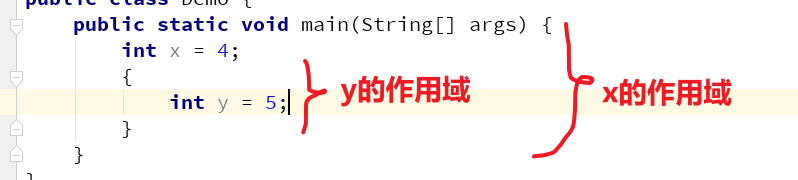

**注意:**

同样一个{}不能有同名变量。

### 注意事项

**细节问题:**

- Java当中的整数字面值常量，默认当作int处理。
- 假如你想使用字面值整数定义一个long类型变量，那么该字面值常量的后面应该加上一个"L"区分（禁止使用小写"l"）。


例如：

- 字面值常量定义long类型变量

```java
long a = 123L；
// 下列方式严格禁止
long b = 123l; //请问这是1231吗?
```

- Java当中的小数字面值常量，默认当作double处理。假如你想使用字面值小数定义一个float类型变量，那么该字面值常量的后面应该加上一个"F"或"f"区分。

- 虽然Java语法允许一行定义多个相同数据类型的变量，但规范的Java代码禁止这样做！


- ```java
// 下列做法不允许
  int a, b = 10, c, d = 10;
  // 应该改成下面这样
  int a;
  int b = 10;
  int c;
  int d = 10;
  ```
  


**浮点数的精度问题**

浮点数因为遵循IEEE754标准，有一个比较大的缺点：

由于表示有效数字的位数是有限的，所以精度是受限的。

下面我们看两个经典案例：

> 1. 使用Java代码计算 10 / 3.0
> 2. 使用Java代码计算 1 - 0.9

这里涉及一个二进制表示小数的转换问题，规则如下：

> 十进制正小数（0.开头）转换成二进制，先用小数部分乘以2，取结果的整数部分(必然是1或者0)
>
> 1. 然后小数部分继续乘2
> 2. 直到小数部分为0，或者已经达到了最大的位数
> 3. 最终的结果（0.开头）正序排列

显然，我们可以得到以下结论：

> 很多十进制小数转换成二进制时，会存在循环小数的情况。那么有限有效数字的浮点数就不能准确表示这个数字了，那些超出表示位数的数据就被截断丢失了，数据失真，精度丢失，这就是浮点数的精度问题。

最后再说一点：

> float和double都不适合用于精确计算的场合，尤其不适合用于货币运算。

**浮点精度问题练习**

1. 下列代码会输出什么？

   ``` java
   double a = 0.1;
   float b = 0.1F;
   System.out.println(a == b);
   ```

2. 下列代码会输出什么？

   ``` java
   float a = 0.1F;
   float b = 0.10000000000000000001F; //中间18个0
   System.out.println(a == b);
   ```

## 变量的类型转换

​		之前我们提到过，Java是强类型语言，一个变量必须明确它的数据类型， 并且数据类型一旦确定不能随意更改。但不能随意修改并不是不能更改，而是需要一定的条件，Java中变量的数据类型由某一种转换为另一种，我们将这个过程叫做**数据类型转换**。

我们之前提到过：声明是告诉编译器变量的数据类型，那么数据类型的转换，也同样是要告诉编译器怎么转换，转换成了什么数据类型。

数据类型的转换又可以分为两类：

1. 自动类型转换
2. 强制类型转换

首先要明确的是：

基本数据类型的数据类型转换必须在byte、short、int、long、float、double这些数值类型和char类型之间进行，boolean类型不参与基本数据类型的数据类型转换。

### 自动类型转换

​		自动类型转换的关键点就在于"自动"这两个字上，到底谁在"自动"帮我们完成类型转换呢？当然是编译器。编译器帮助我们完成类型转换，这意味着我们程序员不需要写额外代码，就可以自动完成类型转换。

**对于基本数据类型而言，自动数据类型发生在"小取值范围"转换为"大取值范围"的数据类型转换之间。** 但是要注意：

- 整型自然是占用内存空间越大，取值范围就越大。
- 浮点型的float虽然只占4个字节，但是它比所有整型的取值范围都大。
- 该体系中double是取值范围最大的，byte是最小的。
- char类型比较特殊，在参与数值类型的自动类型转换时，是编码值参与了转换。而且由于char类型的编码值范围是[0，65535]，所以只有int及以上数据类型的取值范围比char类型大。
- 浮点数有精度问题，某些整型在自动转换成浮点型时，会出现精度丢失数据失真的问题

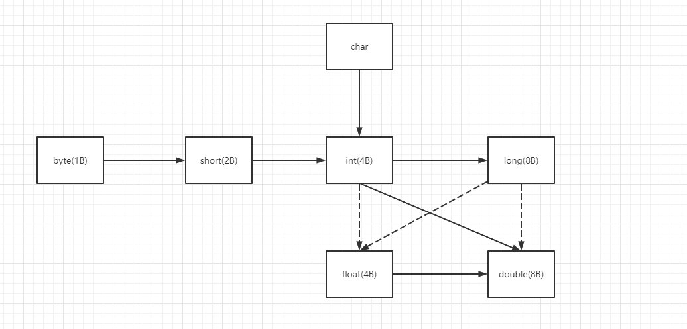

1. 以上图中，实线虚线都表示能够发生自动类型转换，箭头表示类型转换的方向。
2. 实线表示转换过程中不会有精度问题，虚线表示 <font color=red>**可能**</font>会产生精度丢失。

### 表达式类型提升

如果表达式当中存在多种数据类型 变量 参与运算，由于表达式的运算结果是唯一的，所以结果 变量 的数据类型将会提升到"最大取值范围"的那个。有以下规则：

1.  byte、short、char之间不互相转换，一旦发生运算，一律自动转换为int进行运算，结果是int
2.  byte、short、char任何数据类型与int进行计算，一律自动转换为int进行计算，结果是int
3.  byte、short、char、int任何数据类型与long进行计算，一律自动转换为long进行计算，结果是long
4.  byte、short、char、int、long任何数据类型与float进行计算，一律自动转换为float进行计算，结果是float
5.  byte、short、char、int、long、float任何数据类型与double进行计算，一律自动转换为double进行计算，结果是double

注：char类型比较特殊，在参与数值类型的计算时，是<span style=color:red;background:yellow>**编码值**</span>参与了运算。比如：

``` java
char c = 'a';
```

如果上述变量c参与数值运算，那么就是编码值97参与运算！

### 强制类型转换

自动类型转换是小取值范围到大取值范围数据类型的转换，一般不会出现问题，所以能够自动发生。与自动类型转换相对应的就是强制类型转换，是从"大取值范围"的数据类型转换到"小取值范围"的数据类型。"大变小"的强制类型转换极易造成数据溢出导致数据失真，除非特别有必要，一般情况下不要做强制类型转换。

正是因为强制类型转换比较危险，所以编译器不会自动完成类型转换，而是需要程序员手动写代码完成类型转换。

强制类型转换的语法是：

```java
// 做强转要慎重考虑再进行
目标数据类型 变量名 = (目标数据类型)(被转换变量的变量名);
```


### 小结

基本数据类型的类型转换，可以总结出以下规律：

1. 八种基本数据类型中，只有boolean类型不能进行类型转换，其他七种都可以互相转换（自动或强制）。

2. 多种数据类型混合在一起进行运算，会发生隐式类型转化，先全部提升为"最大取值范围"的数据类型，再进行计算，数据类型的排序是：**byte < short（char） < int < long < float < double~**。

3. <font color=red>**byte、short、char使用的时候尤其注意取值范围，若参与运算都会自动提升到int。**</font>

5. "大取值范围"--->"小取值范围"称之为强制类型转换，必须要显式写代码处理，否则会编译报错，语法是：

   ``` java
   目标数据类型 变量名 = (目标数据类型)(被转换变量的变量名);
   ```

   强制类型转换很容易导致数据失真，谨慎使用。

6. 除了基本数据类型外，引用数据类型也能够发生类型转换，但是条件会苛刻的多，出错的后果也会更严重，这个我们面向对象再详谈。

Demo：

1. 下列语句中，哪句会编译失败，为什么？

   ``` java
byte b1 = 1, b2 = 2, b;
   b = b1 + b2;
   char c = b1 + b2;
   // 一共11个1
   long d = 11111111111; 
   ```
   
2. 下列代码能够执行吗？如果不能，如何改正？

   ``` java
    byte b = 130;
   ```


## 整数常量运算的特殊性

Demo：

```java
byte b = 1 + 2;
int a = 1;
byte b2 = a + 2;
```

同样是用byte类型接收<font color=red>**"实际上的1 + 2"**</font>的值，为什么一个能够运行，一个不能？

并且我们上面提过：整数的字面值常量默认作为int类型使用，为什么`byte a = 1 + 2`这种语句能够运行呢？

通过这个现象，我们其实可以发现编译器是很**"聪明"**的：

1. 对于整数字面值常量（包括常量的运算）而言，因为它的值一定不会发生变化，而且整型数据值的位数十分容易判断，所以<span style=color:red;background:yellow>**编译器能够自动判断整型常量是否在接收数据类型的范围内。**</span>
2. 体现在语法上就是：将一个整型字面值（包括常量的运算）赋值给整型时，如果该常量在整型数据类型的取值范围内，是可以赋值成功的。

例如：

```java
byte a = 100;
short b = 30000;
byte c = 1 + 120;
```

都是合法的，反之如果本来就不在取值范围内，强行赋值会编译报错。

例如：

```Java
byte a = 128;
short b = 30000 + 10000;
```

上述说的现象都是针对，整型字面值常量，而：

1. <font color=red>**整型变量是不具有这种特点的，表达式中一旦有变量参与运算，那么结果一定遵循表达式类型提升原则。**</font>

2. 小数字面值常量不具有这种特点。因为**浮点数本身就是一种近似表示方法，用double和float分别表示0.1完全是两个数**，类似下列行为都是不能通过编译的：

```Java
// 编译错误
float f = 0.1;  
// 编译错误
float f2 = 0.1 + 0.2; 
```


# 运算符

**学习目标:**

- **掌握使用算术运算符**
- **掌握使用赋值运算符**
- **掌握使用逻辑运算符**
- **掌握使用三目运算符**


很容易想到的运算符比如"加+  减-  乘*  除/"四种运算符，不难发现：**运算符起着连接变量的作用，表示对变量的运算规则。**

其中：

被运算符连接起来的变量称之为**操作数**，整个运算符和变量组成的式子称之为**表达式**，表达式通过运算符连接操作数, 表达式一般都是有(结果)值的.


补充：

**语句:**

语句是一个行为, 负责执行某种操作, 一般没有结果, 以分号结尾. 程序就是通过语句来执行功能的, 诸如声明语句, 输出语句, 控制语句, 赋值语句等.


**表达式（expression） vs  语句（statement）** 

1. **表达式一般都有确定的结果（值）**，不能构成一条能单独执行的代码（往往不能以分号结尾）
2. 语句都是可以单独执行代码，以分号结尾，**多数语句没有结果。**
3. 两者的联系: 很多语句需要用到值, 即需要表达式的结果, 比如while（）的括号中需要一个值来告诉它循环是否结束且我们一般都会用表达式

## 运算符分类

Java中的运算符分类:

- 算数运算符
- 赋值运算符
- 比较运算符
- 逻辑运算符
- 位运算符(了解)
- 三目运算符


## 算术运算符

算术运算符（arithmetic）指最常见的一些数学运算符，它们在Java中的作用和在数学中的作用基本是一样的。

对于**int a = 10 和 int b =20**，有如下算术运算符和相关的例子：

| 操作符 | 描述                                         | 例子        |
| :----: | :------------------------------------------- | :---------- |
|   +    | 加法：相加运算符两侧的值，得到和             | a+b=30      |
|   -    | 减法：左操作数减去右操作数，得到差           | a-b=-10     |
|   *    | 乘法：相乘操作符两侧的值，得到积             | a*b=200     |
|   /    | 除法：左操作数除以右操作数，得到商           | a/b=0       |
|   ％   | 取余（取模）：左操作数除以右操作数，得到余数 | a%b=10      |
|   ++   | 自增：操作数的值增加1                        | a++一次是11 |
|   --   | 自减：操作数的值减少1                        | a--一次是9  |

**注意事项：**

- "+"运算有三种含义：数值加法，正数符号，字符串拼接
- "%"不是数学当中的百分号，而是取余（模）运算符，表示左边除以右边，结果是它们的余数。
- "/"即数学当中的除法，表示左边除以右边得到商。
- 需要注意的是，**整型除以整型结果仍然是整型，得不到小数。** 这和表达式的类型提升有关。


**自增（++）/自减（--）的特点：**

- 自加自减都是一元运算符，并且仅用于连接变量，常量无法用自增自减运算符连接。
- 变量和自增自减符号，单独构成一个表达式后又参与了运算或者输出语句时。自增自减符号和操作数的位置就至关重要了：
  - 自增自减符号在变量前面，变量先自增自减，再参与后续运算或者赋值 
  - 自增自减符号在变量后面，变量先参与运算或者赋值，再自增自减。
- 自增自减在日常开发更多还是配合for循环单独使用，尽量不要将自增自减组成的表达式放在其它表达式中，可读性很差。


Demo:

求a,b,c的值

```java
int a = 10;
int b = 10;
int c = 10;
a = b++;
c = --a;
b = ++a;
a = c--;
```


求x,y的值

```java
int x = 4;
int y = (x++) + (++x) + (x*10);
```


## 赋值运算符

赋值（assignment）运算符指为变量指定新值完成赋值作用的运算符，赋值运算符需要连接两个操作数，是典型的二元运算符。赋值运算符可以分为两类：

1. 基本的赋值运算符，即" = "等号。
2. 基于等号扩展而来的扩展赋值运算符，比如：" += "，" -= "，" \*=  "等。

---

不管是什么赋值运算符，赋值运算符总是把右边的操作数（或计算后的结果）赋值给左边，运算方向从右向左。既然是赋值，左边必须是一个变量来接收这个值。

对于**两个操作数a和b**，有如下赋值运算符和使用案例：

| 操作符 | 描述                                                         | 例子                     |
| :----- | :----------------------------------------------------------- | :----------------------- |
| +=     | 加和赋值操作符，它把左操作数和右操作数相加赋值给左操作数     | a + = b等价于a = a + b   |
| -=     | 减和赋值操作符，它把左操作数和右操作数相减赋值给左操作数     | a - =  b等价于a = a -  b |
| *=     | 乘和赋值操作符，它把左操作数和右操作数相乘赋值给左操作数     | a * = b等价于a = a * b   |
| /=     | 除和赋值操作符，它把左操作数和右操作数相除赋值给左操作数     | a / = b等价于a = a / b   |
| ％=    | 取模和赋值操作符，它把左操作数和右操作数取模后赋值给左操作数 | a％= b等价于a = a％b     |
| <<=    | 左移位赋值运算符                                             | a << = 2等价于a = a << 2 |
| >>=    | 右移位赋值运算符                                             | b >> = 2等价于b = b >> 2 |
| ＆=    | 按位与赋值运算符                                             | a＆= 2等价于a = a＆2     |
| ^=     | 按位异或赋值操作符                                           | a ^ = 2等价于a = a ^ 2   |
| \|=    | 按位或赋值操作符                                             | b \| = 2等价于b = b \| 2 |

扩展的赋值运算符隐含强制类型转换，无需再写强制类型转换的语法。例如下列代码就是合法的：

```java
// 正常情况下short + 1结果是int类型
short s1 = 1;
s1 += 1;
```

当然即便是强制隐含的强转，仍然属于强转，仍然会存在数据失真的问题。


## 比较运算符

比较（comparison）运算符指的是用来判断两个变量（或常量）大小的运算符。显然既然是比较，自然需要两个操作数，比较运算符是典型的二元运算符。比较的结果，也就是比较运算符组成的表达式（也叫布尔表达式）的结果必然是一个布尔值，也就是true或者false。

对于两个操作数 **int a = 10，int b = 20**，有以下表格：

| 运算符 |                             描述                             |       例子       |
| :----: | :----------------------------------------------------------: | :--------------: |
|   ==   |     检查如果两个操作数的值是否相等，如果相等则条件为真。     | （a == b）为假。 |
|   !=   |   检查如果两个操作数的值是否相等，如果值不相等则条件为真。   | (a != b) 为真。  |
|   >    |  检查左操作数的值是否大于右操作数的值，如果是那么条件为真。  | （a  > b）为假。 |
|   <    |  检查左操作数的值是否小于右操作数的值，如果是那么条件为真。  | （a <  b）为真。 |
|   >=   | 检查左操作数的值是否大于或等于右操作数的值，如果是那么条件为真。 | （a >= b）为假。 |
|   <=   | 检查左操作数的值是否小于或等于右操作数的值，如果是那么条件为真。 | （a <= b）为真。 |


**使用细节和注意事项：**

1. 在比较时，基本数据类型和基本数据类型比，引用数据类型和引用数据类型比。其中

   1. 基本数据类型的数值类型的比较，上述运算符都是可用的。但布尔类型仅适用于"=="或者" != "的比较。

   2. 引用数据类型的变量比较只能使用" == "和" != "，而且不是任意两个引用数据类型变量都能够比较。  

      注：这一条随着知识点的学习，会不断加深理解，大家可以自行测试一下。

2. 基本数据类型的数值类型和char是可以相互比较的，boolean只能自己和自己比较。引用数据类型的比较，只能相同类型之间比较，比如String和String比较，String和System就没有可比性。

3. 两个浮点数的比较不建议直接使用比较运算符，还有诸如引用数据类型的比较等知识点，我们等到日后再谈。（面向对象讲）

## 逻辑运算符

**逻辑（logical）运算符指的是专门连接布尔类型变量、常量进行运算的运算符。** 当然逻辑运算表达式的结果也一定是boolean类型。

对于 **boolean a = true; boolean b = false** 有以下案例：

| 操作符 | 描述                                                         | 例子              |
| :----: | :----------------------------------------------------------- | :---------------- |
|   &    | 称为逻辑与运算符。当且仅当两个操作数都为真，条件才为真。     | （a & b）为假     |
|   \|   | 称为逻辑或运算符。如果任何两个操作数任何一个为真，条件为真。 | (a \| b)为真      |
|   ^    | 成为逻辑异或运算符。相同时为false，不同时为true              | (a ^ b) 为真      |
|   &&   | 称为短路与逻辑运算符。当且仅当两个操作数都为真，条件才为真。 | （A && B）为假    |
|  \|\|  | 称为短路或逻辑运算符。如果任何两个操作数任何一个为真，条件为真。 | （A \| \| B）为真 |
|   !    | 称为逻辑非运算符，用来反转操作数的逻辑状态。如果条件为true，则逻辑非运算符将得到false。 | !(A && B)为真     |

**逻辑与和逻辑或有短路与非短路两种类型，那么短路与不短路有啥区别呢？**

其实非常简单，对于逻辑或来说，一旦左边的操作数的结果确定是true，那么整个表达式的结果一定是true，右边实际上是不需要再进行计算的；同理逻辑与也是意义，一旦左边的操作数确定是false，那么右边无论是什么结果都是false。

短路就是依据这种原理，若左边的操作数已经能够决定表达式的值了，后面就都不算了。短路逻辑运算符的计算结果不变，但是执行效率变高了。所以建议：**大家在使用逻辑与或时，一律使用短路版本。** 在有些书籍里，甚至已经不把 `&` 和  `|` 列入逻辑运算符中，而是直接列为**位运算符。**

在实际开发中，`&&` 、`||` 、`!` 最常用。


## 位运算符(了解)

位（shift）运算符，全称"移位运算符"，是直接对**整数的二进制位**进行计算的运算符（专门针对数字0，1进行操作的）。由于能够直接对位，进行移位运算操作，所以位运算符的最大优点是运算效率高，缺点是对人来说不够直观。位运算符仅做了解，不作为重点。

对于**int a = 60 和 int b = 13**有以下案例：

| 操作符 |                             描述                             |              例子              |
| :----: | :----------------------------------------------------------: | :----------------------------: |
|   ＆   |        按位与，如果相对应位都是1，则结果为1，否则为0         | （a＆b），得到12，即0000 1100  |
|   \|   |        按位或，如果相对应位都是0，则结果为0，否则为1         | （a \| b）得到61，即 0011 1101 |
|   ^    |         异或，如果相对应位值相同，则结果为0，否则为1         | （a ^ b）得到49，即 0011 0001  |
|   〜   |     按位取反运算符翻转操作数的每一位，即0变成1，1变成0。     |  （〜a）得到-61，即1100 0011   |
|   <<   | 按位左移运算符。左操作数按位左移右操作数指定的位数。在一定范围内，每左移一位，相当于乘以2 |  a << 2得到240，即 1111 0000   |
|   >>   | 按位右移运算符。左操作数按位右移右操作数指定的位数。在一定范围内，每右移一位，相当于除以2 |      a >> 2得到15即 1111       |
|  >>>   | 按位右移补零操作符。左操作数的值按右操作数指定的位数右移，移动得到的空位以零填充。 |     a>>>2得到15即0000 1111     |

简要说一说运算规则：

`<<` 和 `>>` 的实质

1. `<<` 左移就是把左边移出去的高位截断，在低位补数，无论原先的数是正是负，空位都补0。在一定范围内，M << n 可以这么算  M << n = M \* 2^n，即左移几位就表示乘以几个2。但是一旦超出范围，甚至可能把正数左移成负数。
2. `>>` 右移就是把右边移出去的低位截断，在高位补数，正数补0，负数补1。在一定范围内，M >> n 可以这么算   M >> n  = M / 2^n，即右移几位就表示除以几个2。右移虽然不会改变正负，但是一旦出现小数会丢失小数位。

`>>` 和`>>>` 的区别

1. `>>` 是有符号右移，在高位补数时，正数补0，负数补1。
1. `>>>` 是无符号右移动的时候，无论是正数负数，最高位是0还是1，被移除的低位丢弃，**右移后最高位空缺位补0。**

&、| 、^（与、或、异或）位运算符

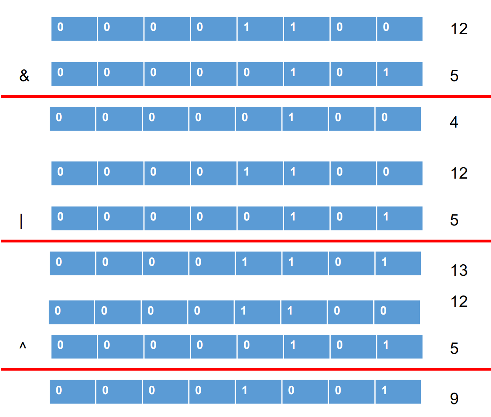

`~`取反位运算符

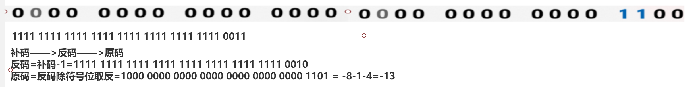

`^`异或位运算符

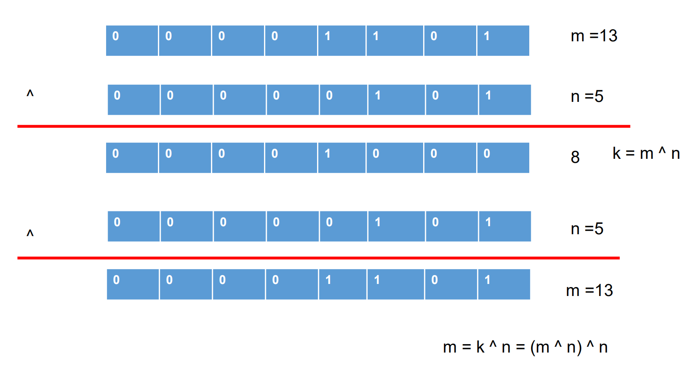

---

小tips：

在计算机中普遍使用`^`表示幂运算，但在Java中它是一个位运算符。那么在Java中该怎么求一个数的次幂呢？

使用以下代码：

``` java
Math.pow(double a, double b)
```

一个经典的问题：怎么算 2*16 最高效？

## 三目运算符

三目（ternary）运算符，也被称之为三元运算符，即指的是需要三个操作数的运算符。

它的语法是：

``` java
(条件表达式) ? 表达式1 : 表达式2;
```

它具有以下特点：

1. 当条件表达式为true时，执行表达式1，否则执行表达式2。
2. 三目运算符的最大特点就是，它一定会执行一个表达式， 所以它一定会有一个结果。

何时比较适合使用三目运算符呢？

if...else从使用效果上来说，是可以完全替代三目运算符的。但是使用三目运算符，代码更加简洁、更加优雅并且逻辑更加直观，实测三目运算符的运算效率要比if稍微高一点。**所以，如果能够使用三目运算符尽量使用它，而不是if。**

但是也要注意，不要使用过于复杂的三目运算符，否则会导致程序可读性变差。比如下列代码：

``` java
// 求三个数的最大值
int max = (a > b) ? (a > c) ? a : c : (b > c) ? b : c;
boolean b = true ? false : true == true ? false : true;
```

我相信你不会愿意看到这种代码吧。

## 运算符的优先级

运算符有不同的优先级，运算符的优先级决定了谁先进行运算，是既重要也不重要的知识点：

1. 重要在于，运算符的优先级对表达式结果有显著影响。如果不知道运算优先级，一个表达式你肯定看不懂。
2. <span style=color:red;background:yellow>**不重要的地方在于可以使用小括号"()"主动控制优先级。**</span>

---

简单了解一下，Java运算优先级的大体规则：

1. 所有的数学运算都认为是是从左向右的，Java语言中大部分运算符也是从左向右结合的。
2. 但是单目运算符，赋值运算符，三目运算符不符合`1`中的规律
   1. 其中单目运算符，赋值运算符是从右向左结合，也就是从右向左运算的。
   2. 三目运算符实际上是一种选择结构，是一种特殊的运算。

下表中列出了运算符的优先级顺序，编号越小的运算符优先级越大。

| 编号 | 类别     |                   操作符                   | 计算顺序 |
| ---- | :------- | :----------------------------------------: | :------- |
| 0    | 后缀     |             () [] . (点操作符)             | 左到右   |
| 1    | 一元     |                 + + - ！〜                 | 从右到左 |
| 2    | 乘性     |                   * /％                    | 左到右   |
| 3    | 加性     |                    + -                     | 左到右   |
| 4    | 移位     |                 >> >>>  <<                 | 左到右   |
| 5    | 关系     |                 >> = << =                  | 左到右   |
| 6    | 相等     |                   == !=                    | 左到右   |
| 7    | 按位与   |                     ＆                     | 左到右   |
| 8    | 按位异或 |                     ^                      | 左到右   |
| 9    | 按位或   |                     \|                     | 左到右   |
| 10   | 逻辑与   |                     &&                     | 左到右   |
| 12   | 逻辑或   |                   \| \|                    | 左到右   |
| 13   | 条件     |                    ？：                    | 从右到左 |
| 14   | 赋值     | = + = - = * = / =％= >> = << =＆= ^ = \| = | 从右到左 |
| 15   | 逗号     |                     ，                     | 左到右   |

虽然我们无需具体记忆这些优先级，但是仍然需要记住—— <span style=color:red;background:yellow>**赋值运算符的优先级往往最低。**</span>


# Scanner键盘录入

## 概述

目前在写Java程序的时候，数据都是写死和固定的，有时为了让程序更具有灵活性，就需要灵活的输入数据。

**Scanner的作用就是，灵活的从键盘接收数据输入。**

但实际开发中的数据，更多是自于前端页面（用户输入，上传等），所以总体而言Scanner对于Web开发并没有太大的实际作用，**了解即可。**

但是在JavaSE的学习阶段，我们没有前端和各种界面的输入信息，在单机的情况下，使用Scanner键盘录入是很不错的选择，可以提高程序的灵活性。

并且在某些测试的场景中，Scanner键盘录入也有一定的用途，所以Scanner也有必要学习了解一下。

## 使用步骤

那么Scanner键盘录入到底应该怎么用呢？

大体上可以分为三步走：

1. 导包 （IDEA有自动导包功能，但是不要认为没有这一步）

   ``` java
   import java.util.Scanner;
   ```

2. 创建对象

   ``` java
   Scanner sc = new Scanner(System.in);
   ```

3. 接收从键盘录入的数据

   ``` java
   int x = sc.nextInt();
   ```

<span style=color:red;background:yellow>**注意事项：**</span>

1. 目前阶段，记住步骤会使用就行。以后再来具体分析每步在做什么。

2. 一般为了方便使用，应该加上提示键盘输入的输出语句。

   参考以下代码案例：

   键盘录入int数据

   ``` java
   Scanner sc = new Scanner(System.in);
   // 键盘接收int数据
   System.out.println("请输入一个int数据:");
   int num = sc.nextInt();
   ```

3. 使用Scanner在单独录入数据时，可以选择不同的方法，例如：

   > 1. 键盘录入String字符串，可以选择使用nextLine方法。
   > 2. 键盘录入int数值，可以选择使用nextInt方法。
   > 3. 键盘录入double数值，可以选择使用nextDouble方法。
   > 4. ....

4. 使用Scanner在需要录入多种数据类型时，建议不要混用以上方法。比如：

   使用Scanner不同方法录入多种数据

   ``` java
   int num = sc.nextInt();
   String str = sc.nextLine();
   ```

   这种写法实际上是错误的！

   <span style=color:red;background:yellow>**推荐在有混合录入多种数据的需求时，永远使用nextLine方法，然后将字符串转换成各种需要的数据类型！**</span>

   参考以下代码：

   统一使用nextLine方法

   ``` java
   Scanner sc = new Scanner(System.in);
   System.out.println("请键盘录入一个int整数:");
   String numStr = sc.nextLine();
   // 百度查找将String转换成int的方法
   int num = Integer.parseInt(numStr);
   System.out.println("请键盘录入一个字符串:");
   String str = sc.nextLine();
   System.out.println(num);
   System.out.println(str);
   ```

   当然，如果你对上述用法有疑惑，可以继续往下看学习其中的原因。

   但Scanner本身就是一个了解内容，知不知道原因是无所谓的！

## 原因

Scanner的使用问题，**next()、nextInt()等一系列方法**和nextLine()的区别：

1. **next()、nextInt()等一系列方法**
   1. next()之类的一系列方法遇见第一个有效字符（非空格，非换行符，非制表符）时，开始扫描
   2. 当遇见第一个分隔符或结束符(空格、换行符或者制表符)时，结束扫描，获取扫描到的内容
   3. 即获得第一个扫描到的不含空格、换行符的单个字符串
2. **nextLine()方法**
   1. 从方法名上就可以看出来，这个方法是获取一行的内容作为一个字符串被接收
   2. 该方法不会因为空格或制表符号而结束扫描
   3. 只会因为回车（换行）而结束扫描


由于nextLine()方法碰到换行才结束扫描的特性，所以使用有如下问题：

当使用Scanner接收数值类型后又使用nextLine()方法接收字符串时，例如以下代码：

混用两种Scanner方法

``` java
Scanner sc = new Scanner(System.in);
sc.nextInt();
sc.nextLine();
```

输入数值后回车，会导致程序并不会等待并接收一个字符串，而是直接结束键盘录入。究其原因在于，nextLine()方法碰到回车就结束扫描，所以**该方法此时接收的实际上是一个（绝对）空字符串。**

解决的办法有很多种：

1. 可以使用不同的Scanner对象接收，这样肯定不存在冲突问题

2. 在接收int数据的后面加一个不接收数据的nextLine用来接收回车

3. 可以统一用字符串接收数值类型，接收完毕后再进行类型转换。

   > 例如转换成int类型（传入一个字符串，转换成int接收即可）
   >
   > Integer.parseInt()


## 练习

> 模拟登陆功能
>
> 用户名(String):admin
>
> 密码(String): 123456
>
> 使用scanner进行输入, 匹配成功提示登陆成功, 否则登陆失败 


> 猜数字小游戏
>
> 随机生成一个随机数(0-100), 使用scanner能多次接收一个int数据, 跟随机数进行比较, 大于或者小于要求给出提示, 重新输入, 直到跟这个随机数相等, 结束.


# Java转义字符

学习目标:

- **掌握常见的几个转义字符**
- \b  \n  \r  \t  \\\    \\'   \\"

## 概述

**什么是转义字符？**

1. 所谓转义字符，就是用反斜杠（\）加上一个特殊的字符串用来表示一个全新的字符。
2. 因为这个字符已经和原先字符串的意思大不相同，所以整体称之为转义字符。


**转义字符的作用是什么？**

1. 实际上转义字符可以表示任何一个普通字符，但是普通的字符直接书写给出即可，使用转义字符意义不大。
2. 转移字符最重要的用途是，表示那些无法用键盘直接输入的控制字符。比如在ASCII码表中，那些换行，翻页等等字符。

## 常见的转义字符

| 转义字符 | 用途                                    | ASCII码值（十进制）      |
| -------- | --------------------------------------- | ------------------------ |
| **\b**   | **退格(BS) ，将当前位置移到前一列**     | **008**                  |
| \f       | 换页(FF)，将当前位置移到下页开头        | 012                      |
| **\n**   | **换行(LF) ，将当前位置移到下一行开头** | **010**                  |
| **\r**   | **回车(CR) ，将当前位置移到本行开头**   | **013**                  |
| **\t**   | **水平制表(HT) （跳到下一个TAB位置）**  | **009**                  |
| **\\\\** | **两个反斜杠表示一个反斜杠**            | **092**                  |
| **\\'**  | **代表一个单引号（撇号）字符**          | **039**                  |
| **\\"**  | **代表一个双引号字符**                  | **034**                  |
| \ddd     | 1到3位八进制数所代表的任意字符          | Unicode编码前256个字符   |
| \0       | 空字符，什么都没有                      | 000                      |
| \uxxxx   | 4位十六进制所代表的任意字符             | Unicode编码前65536个字符 |
| \u0000   | 空字符，什么都没有                      | 000                      |

表格使用说明：

1. \ddd，其中<font color=red>**"ddd"**</font>用三位八进制编码值来表示一个新字符，它的取值范围为 <font color=red>**\0 - \377**</font>，**十进制编码值范围就是[0,255]**
2. \uxxxx，其中<font color=red>**"xxxx"**</font>用四位十六进制编码值来表示一个新字符，它的取值范围为<font color=red>**\u0000 - \uFFFF**</font>，**十进制编码值范围就是[0,65535]**
3. 上述表格中，标注黑色加重的转义字符比较常用。
4. 反斜杠（\）和斜杠（/）不要混淆了：
   1. 反斜杠（\）是计算机出现了之后发明的计算机领域专用符号，生活中几乎不会使用反斜杠。
   2. 正斜杠在日常生活中使用，表示间隔/或者/分隔的意思。比如时间的分隔，一定是2022/01/01，不可能用反斜杠。除此之外，正斜杠在计算机中还表示除号。

```java
System.out.println("aaabbbc\b");
System.out.println("aaa\nbbbc");
System.out.println("aaa\tbbb");
System.out.println("aaa\\bbb");
System.out.println("aaa\'bbb");
System.out.println("\111");
```


# 流程控制

**学习目标:**

- 掌握顺序结构,选择结构,循环结构的使用
- 掌握跳转关键字break,continue,return使用

Java的流程控制结构主要有三种：

1. 顺序结构
2. 选择结构
3. 循环结构

其中，<font color=red>**顺序结构是程序中最简单最基本的控制流程，没有特定的语法，指的是按照代码书写的顺序执行代码的一种结构。**</font>

对于顺序结构而言，写在前面的代码先执行，写在后面的代码后执行，像下图一样执行。

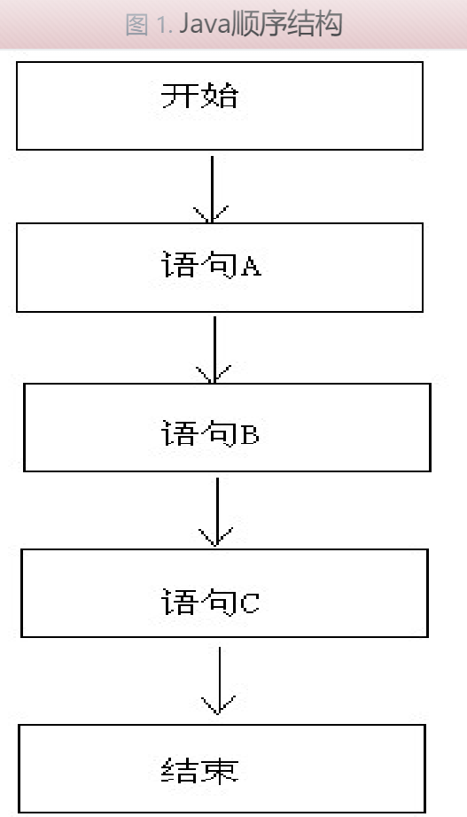


## 选择结构

Java中提供了**选择结构**，来帮助我们实现这种 "如果...就" 的逻辑。

选择结构的具体实现有两种：

1. if语句
2. switch语句

当然，if是最常见和常用的，Java程序员的日常是离不开if关键字的，switch的使用非常少见，但也需要掌握它的语法，知道使用的场景。

### if语句

总体说明：

1. 无论是什么if结构，都跑不了的结构：if (condition)  
2. 括号中的条件，必须是一个布尔表达式（表达式结果必须是布尔值）或者就是一个布尔值（true或者false）

**单分支if**

```Java
if (condition){
	// statement
}
```

**执行流程：**

1. 当if判断的条件，结果是true时，执行statement语句。
2. 当if判断的条件，结果是false时，不执行statement语句。

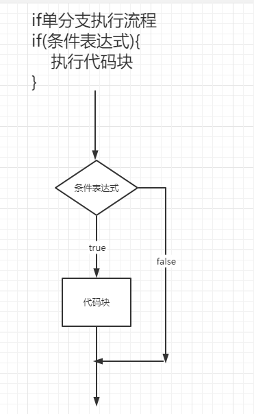


**双分支if**

所谓双分支if结构，指的是用代码实现<span style=color:red;background:yellow>**"如果...就..否则就..."**</span>的逻辑。

```Java
if(condition){
// statement1
}else{
// statement2
}
```

**执行流程：**

1. 当if判断的条件，结果是true时，执行statement1中的语句。
2. 当if判断的条件，结果是false时，执行statement2中的语句。

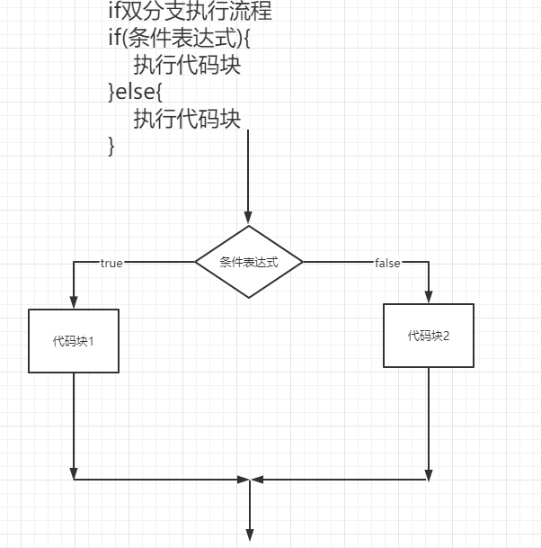


**多分支if**

所谓多分支if结构，指的是用代码实现"<span style=color:red;background:yellow>**如果...就..否则如果...就...否则...**</span>"的逻辑。

```java 
if(condition1){
	// statement1
} else if (condition2){
	// statement2
} .... else {
	// statement
}
```

**执行流程：**

1. 从上到下匹配，哪个condition结果是true，就执行哪个statement。
2. 如果每个condition都不满足，执行最后的else中的语句。

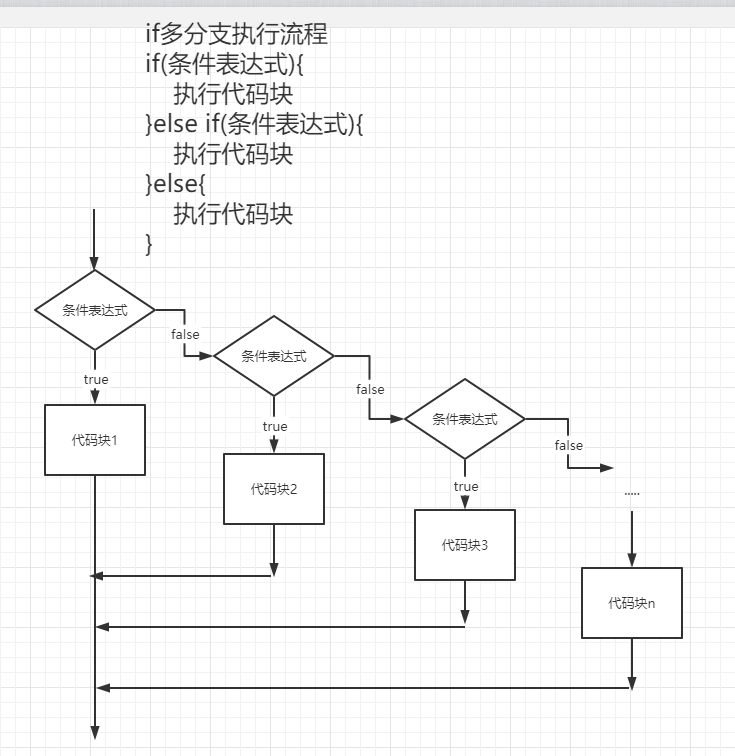


<span style=color:red;background:yellow>**if多分支使用注意事项：**</span>

1. 多分支的if语句，要么执行一个分支condition，要么就执行else，不可能执行多个分支。
2. condition之间的关系：
   1. 如果多个条件之间是互斥关系，那么谁在前，谁在后，没什么影响。
   2. 如果多个条件之间是包含关系，被包含的条件如果放在了下面，就永远不能生效了。
3. else后面不能再加分支了，必须放在最后面。


**两道基础语法练习题：**

1. 键盘录入x的值，计算出y的并输出。

   其中x和y的关系满足如下：

   1. x>=3时，y = 2x + 1;
   2. -1<=x<3时， y = 2x;
   3. x<=-1时， y = 2x – 1;

2. 键盘录入月份的值，输出对应的季节。

### switch语句

 语法：

```Java

switch(expression){
case value1:
statement1;
break;
case value2:
statement2;
break;
...    
	default:
statement;
break;
}
```

逐个解释语法：

1. expression：表示选择的条件或者依据，可以允许的数据类型有：

   1. byte
   2. short
   3. int
   4. char
   5. <font color=red>**枚举类型（JDK 5以后）**</font>
   6. <font color=red>**String （JDK 7以后）**</font>

   <span style=color:red;background:yellow>**尤其注意，布尔类型boolean是不允许写在switch选择中的！**</span>

2. case：表示一个选择分支，case（和多分支if结构不同的是，这些case是绝对互斥平行的）

3. value：表示一个选择分支的取值，它的数据类型，要和expression保持一致

4. statement：表示该分支要执行的代码

   > 无需加大括号，因为有break关键字限制，一个case分支所能执行的语句范围。

5. break：本身是一个关键字

   > 表示结束整个switch语句，用来限制一个case分支，执行代码的范围。

6. default：相当于多分支if结构中的，最后一个else

   > 当所有的case都不匹配的时候，执行default中的statement。

<span style=color:red;background:yellow>**switch的执行流程：**</span>

1. 首先计算出表达式的值。
2. 然后从上到下，依次比较case的取值
3. 一旦某个case取值匹配上，就会执行其中的语句，直到碰到break
4. 最后，如果所有的case都无法匹配，会执行default中的语句

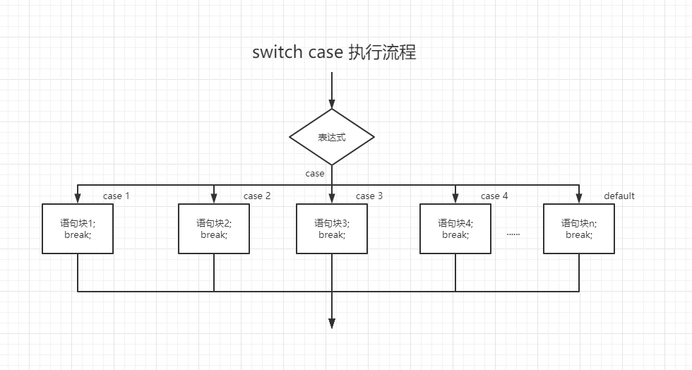


注意事项：

- 和多分支if结构中的最后一个else一样，default也不是必须的，但是普遍来说，应该加上用来保证switch能够执行。
- 和多分支if结构中的最后一个else不同的是，由于分支之间绝对平行，default不一定放在最后。
- case穿越问题：
  1. 正常情况下，每一个case都应该有一个break，用来限制case中statement的执行范围
  2. 当省略掉某个case中的break后，statement就会按照顺序一直被执行
  3. 这个时候statement的执行不仅限于自身case了，这个过程会持续到switch结束或者碰到一个break
  4. 灵活使用case穿越可以简化代码，比如月份和季节的案例

读程序，判断输出结果：

```Java
// main
int x = 2;
int y = 3;
switch(x){
   default:
   y++;
   break;
   case 3:
   y++;
   case 4:
   y++;
}
System.out.println("y="+y);
```

```java 
// main
int x = 2;
int y = 3;
switch(x){
    default:
    y++;
    case 3:
    y++;
    case 4:
    y++;
}
System.out.println("y="+y);
```


### 怎么选择if和switch

选择结构有两种实现方式，if 和 switch：

1. if的使用场景
   1. 针对结果是布尔类型的判断。
   2. 多分支if结构，可以使用多个判断条件。
   3. if的判断条件可以是一个连续的取值范围
2. switch的使用场景
   1. 针对结果是固定类型、固定值的判断，**尤其注意不能是boolean类型。**
   2. switch始终只能对一个条件进行选择
   3. **<font color=red>switch每个分支的取值，只能是固定的且离散的。</font>这是switch和if最本质的区别。**
3. 如果碰到if和switch都可以的情况，建议选择if，因为if语法简单不容易出错。而如果是针对离散值的判断，那就选择switch，因为它更加就简洁。**实际开发中，99%以上的情况都在使用if而不是switch。**

## 循环结构

循环结构主要包括三种实现方式：

1. for循环
2. while循环
3. do...while循环

<span style=color:red;background:yellow>**其中，for循环是最基础，也是使用最多的循环。**</span>


Java当中的循环结构，无论是for、while还是do...while，其结构都由五部分部分组成：

1. 循环控制变量
2. 初始化语句
3. 条件判断语句（布尔表达式）
4. 循环体语句
5. 循环控制语句

逐个解释用途：

1. 所谓循环控制变量，是指为了控制循环进程而定义的变量。**也就是说，如果你希望循环能够终止，那么循环控制变量是必须的。**
2. 初始化语句，用于给循环控制变量初始化，<span style=color:red;background:yellow>**最大特征是只会执行一次。**</span>
3. 条件判断语句，根据循环控制变量写布尔表达式，用于判断循环是否进行，结果只有两种，true或者false。
   1. **结果为true，循环继续，执行循环体语句。**
   2. **结果为false，循环终止，结束循环。**
4. 循环体语句，自然是循环结构中要重复执行的代码。
5. 循环控制语句，用于改变循环控制变量的值，进而改变循环的状态，使循环终止。<span style=color:red;background:yellow>**如果没有循环控制语句，循环不能终止，将变成死循环。**</span>


### for循环

语法：

```java 
for(初始化语句 ; 条件判断语句; 循环控制语句) {
// 循环体语句  
}
```

<font color=red>**执行流程（重要）：**</font>

1. 执行初始化语句，初始化循环控制变量，该语句只会执行一次。
2. 执行布尔表达式进行条件判断，如果结果是：
   1. true，执行一次循环体语句。
   2. false，循环终止。
3. 执行一次循环控制语句，改变循环控制变量的值，用于改变循环的状态。
4. 再次执行布尔表达式进行条件判断，开始循环。直到布尔表达式的结果是false，循环终止。


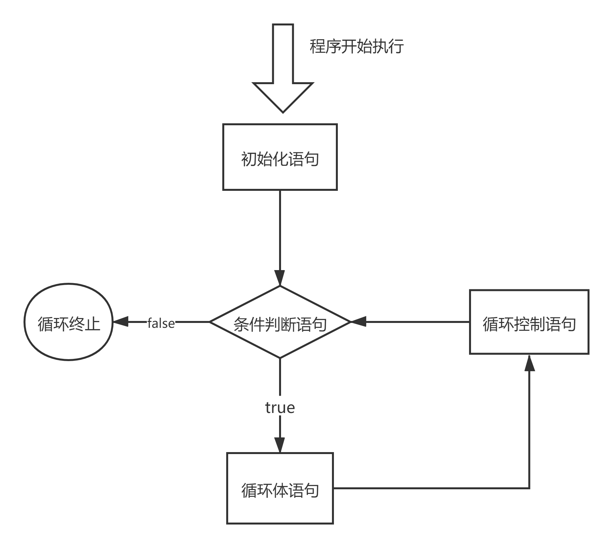

**几个使用的注意事项：**

- 条件判断语句的结果是一个布尔类型的值，习惯上使用i，j，k三个作为循环控制变量的变量名。

- 循环体语句如果是一条语句，和if一样也可以省略大括号。语法允许，但实际开发中不要采取这种做法。

- for循环内部定义的变量，包括初始化语句中的循环变量和循环体语句内部定义的变量，都是局部变量，其作用范围仅在for循环内部。

- 在for循环中，初始化语句，布尔表达式，循环控制语句都不是必须的，但两个分号是必须的。

- for循环的变形体主要有以下形式：

  - 初始化语句省略后，循环控制变量仍要初始化，但肯定要放在for循环的语句上面。这样格式就变成：

    ```Java
    初始化语句;
    for( ; 条件判断语句(布尔表达式); 循环控制语句) {
      // 循环体语句  
    }
    ```

    

  - 条件判断语句省略后，循环就没有终止条件了，这样的一个for循环就变成了死循环。

  - 循环控制语句省略后，循环虽然有终止条件，但是循环控制变量的值却不会发生变化了，仍然会死循环。这时如果不想死循环，可以将循环控制语句，放在循环体语句中，如下：

    ```Java
    for(初始化语句 ; 条件判断语句(布尔表达式); ) {
      // 循环体语句  
      // 循环控制语句
    }
    ```

  - <font color=red>**最经典的for循环的死循环形式：**</font>

    ```Java
    for(;;){
      // 循环体语句
    }
    ```

- <span style=color:red;background:yellow>**如无绝对必要，请使用标准格式for循环。**</span>

练习：

1. 用for循环计算1+2+3+...+100
3. 用for循环求出1-100之间偶数和
4. 用for循环求5的阶乘


### while循环

语法：

```Java
初始化语句;
while(条件判断语句){
循环体语句;
(循环控制语句)
}
```

while循环看起来语法和for循环不同，但本质是一样的。一个能够终止的标准形式while循环，同样具有for循环具有的5个部分，只不过位置和for循环相比发生了变化而已。所以，我们要记住的是： <font color=red>**while循环的语义、执行流程都和for循环一模一样，while和for是完全等价的。**</font> 

练习：

珠峰的高度是8848m，假设有一张足够大可折叠的纸张，初始厚度是0.01m。

求解这张纸折叠多少次，纸张的厚度开始超过珠峰？


### do while循环

语法：

```Java
初始化语句;
do{
 循环体语句;
 (循环控制语句)
} while(条件判断语句)
```

执行流程：**

1. 执行初始化语句，初始化循环控制变量，该语句只会执行一次。
2. <font color=red>**直接执行一次循环体语句。**</font>
3. 执行一次循环控制语句，改变循环控制变量的值，用于改变循环的状态。
4. 执行布尔表达式进行条件判断，如果结果是：
   1. true，再次执行一次循环体语句。
   2. false，循环终止。
5. 再次执行布尔表达式进行条件判断，开始循环。直到布尔表达式的结果是false，循环终止。

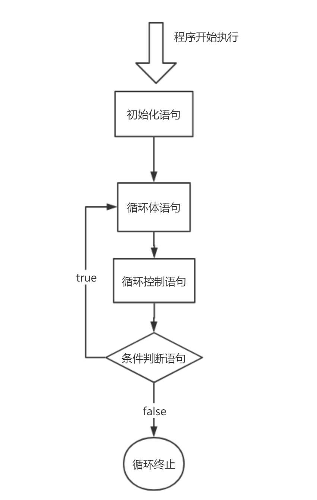

 <font color=red>**注意事项：**</font>

1. **条件判断语句后面的分号不能省略，否则会报错。**
2. do...while循环的循环控制语句，往往和循环体语句放在一起
3. do...while循环的语义、执行流程都和while循环类似，唯一不同的是：
   1. do...while中的循环体语句，在第一次执行的时候，不会经过条件判断语句。
   2. 所以do...while中的循环体语句和循环控制语句，无论如何都至少要执行一次

### 两种特殊的循环

#### 死循环

```Java
for(;;){
  // 循环体
}
while(true){
  // 循环体
}
```


#### 嵌套循序

循环是可以嵌套定义的，但一般嵌套两层就足够了，三层及以上就会让循环变得难以理解，非常不建议这么做。

接下来以最常见的双层嵌套for循环（multi-for）为案例，说明一下嵌套循环。

例如下列代码：

```java 
for (int i = 0; i < 4; i++) {
	for (int j = 1; j <= 6; j++) {
  		System.out.print("#");
	}
    System.out.println();
}
```

上述嵌套for意味着，外层for每执行一次，内层for就要执行6次。

打印的结果就是：

> ######
> ######
> ######
> ######

即"四行六列"的井号排列。

所以如果是用来打印图形的话，内层for控制列数，外层for控制行数。


总结：

1. 嵌套循环极大的增加了代码的阅读难度，如果不是非常有必要，最好不要使用。即便是要使用，最好也不要超过两层。
2. 嵌套循环是很好的锻炼逻辑思维能力的知识点，如果你刚入行编程，可以多多练习。

练习

1. 打印以下图案

   > #
   > ##
   > ###
   > ####
   > #####

2. 打印九九乘法表


## 跳转控制关键字

至此，我们已经学习完了所有的循环结构，可以控制Java当中的循环体代码重复执行，完成需求。

但是仍然有一些问题：

> 到目前为此，我们对循环的把控是改变循环的初始条件，一旦循环启动，直到循环结束，我们是不可控的，比如说：
>
> 1. 我希望循环到一半就结束
> 2. 触发某个条件，就结束循环
> 3. 中间某一次我希望跳过循环
> 4. ....

以上需求完全是合理可能的，但是我们目前的知识实际上没有办法做到这一点。

所以我们需要 <font color=red>**循环控制关键字**</font> 来完成这些需求。

对于循环控制关键字的使用，Java基本承袭了C/C++当中的用法，关键字包括：

1. **break**
2. **continue**
3. **return**

### break

> break意为"打断，中断"，是常用的循环控制关键字。

**使用场景及作用：**

break并不仅仅能用在循环中，它在switch中也可以使用，break就有了两个使用场景：

1. switch语句中某个case分支，用于结束整个switch。
2. 循环语句中,表示结束当前循环(如有嵌套循环, 结束当前层次循环, 和外层没有关系)

注意：除开上面两种语境不能使用break，会编译不通过

---

**标签**

那么如果我就有多层嵌套循环，需要结束外层循环呢？

这时就需要使用标签（label）了，语法如下：

```Java
label:for(){
    label2:for(){
        label3:for(){
            //break label
        }
    }
}
```

使用注意事项：

1. 标签是用来标注某个层次的循环的，所以它应该加在for或者while关键字的头上
2. 标签名可以看成是一个变量名，建议小驼峰式书写。
3. 使用标签标注循环层次时，不要忘记<font color=red>**" : " **</font>
4. 当break后面跟标签表示结束标签层次循环时，无需加" : "冒号

### continue

> continue意为"继续，延续"，也是常用的循环控制关键字。

**使用场景：**

continue不同于break，它只能在循环中使用，无法在循环外使用，如果使用，会编译不通过。

**作用：**

**continue在循环表示结束当前次的循环，转而继续执行后面的循环。**注意它不是结束整个循环，而是跳出当前层的当前次循环，进行当前层的下一次循环。如果有嵌套循环，同样可以使用标签，用法和break一致。

练习：

请在注释处补全代码，实现以下功能：

1. 控制台输出2次，"我热爱学习Java"
2. 控制台输出7次，"我热爱学习Java"
3. 控制台输出13次，"我热爱学习Java"

```java 
for (int i = 1; i <= 10; i++) {
    if (i % 3 == 0) {
        //在此处填写代码
    }
    System.out.println("我热爱学习Java");
}
```


### return

> return意为"返回"，它的使用频率要比上面两个更高，当然这是因为它不仅仅是循环控制关键字那么简单。

**使用场景**

return可以在一个方法的任何位置使用，而Java语句几乎都写在一个方法当中，所以return的使用场景极多。而循环一般也都在一个方法当中，所以循环中也能使用return。（比如main方法）

**作用**

return在Java当中表示直接结束当前方法，如果写在循环中，既然方法结束了，循环必然也终止了。

除此之外，return还可以在方法中，表示方法的返回值（这是后面方法这一章节的知识）

当然这时的return仍然具有结束方法的作用！


练习

在注释处分别填入break，continue，return，试着分析：

程序的执行结果是什么呢？

```Java
for (int i = 0; i < 5; i++) {
    if (i == 3) {
      System.out.println("我喜欢学习Java!");
      //在此处填写代码
	}
	System.out.println(i);
}
System.out.println("我喜欢学习C++!");
```


