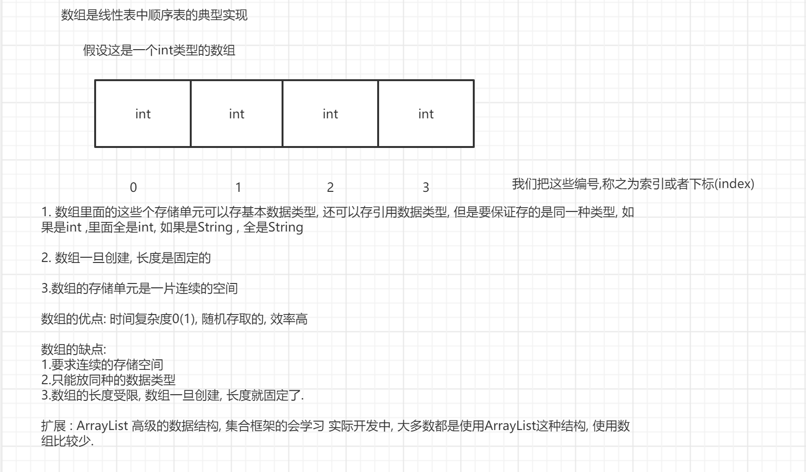
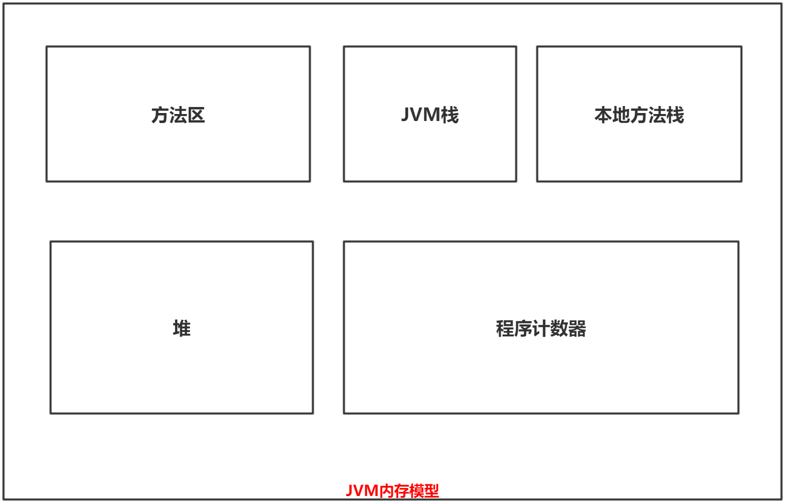
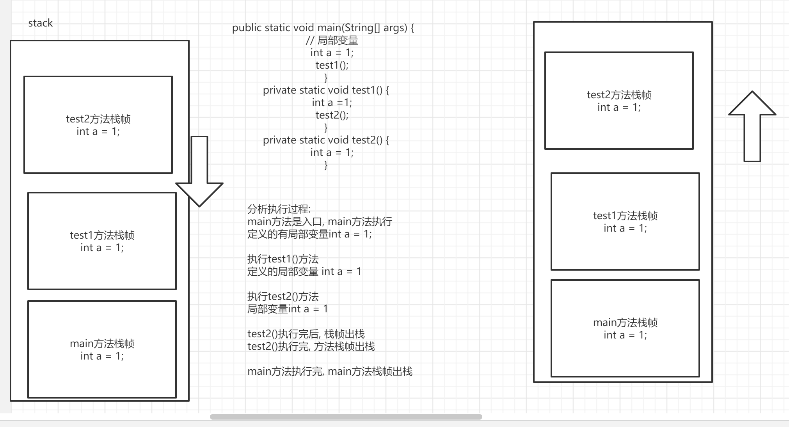
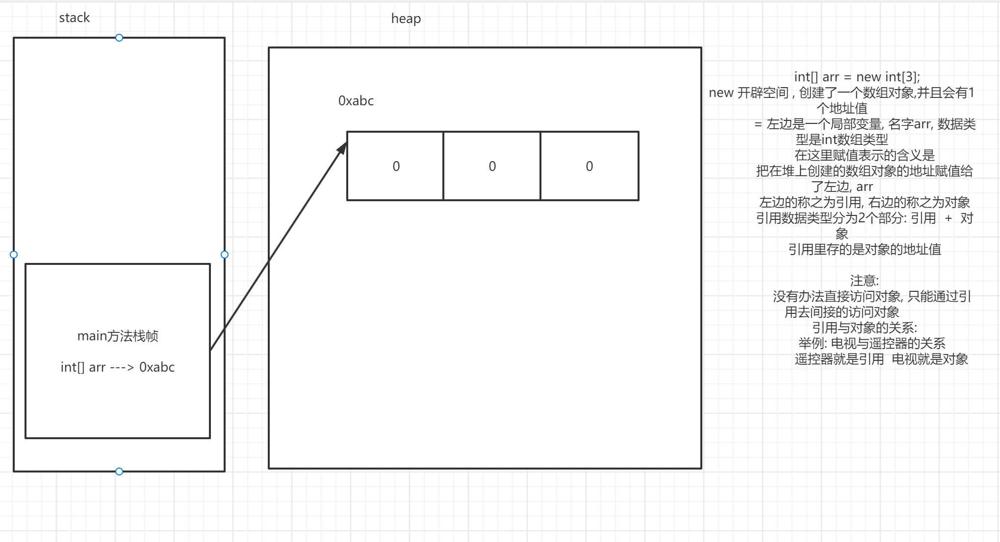
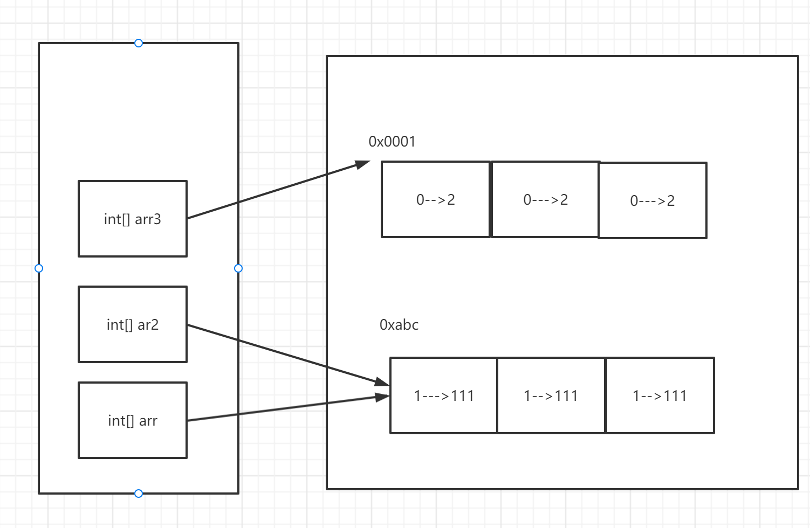
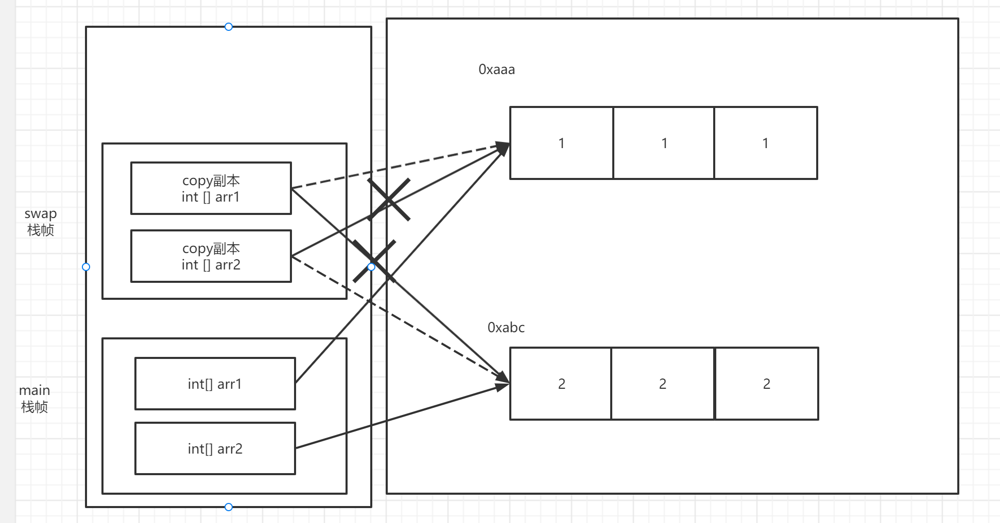

`学习目标

- 掌握数组的定义与使用
- 掌握数组的常见操作
- 掌握JVM运行时数据区的栈和堆
- 知道引用数据类型与基本数据类型的区别

# 数组概述

##  引入

引例：

> 假设一个班上有80个人，现在需要统计，某一门课程的平均成绩，是否需要定义80个变量？

很明显：

1. 如果程序需要多少数据，就定义多少个变量，过于麻烦了，这种代码写出来也不美观。
2. 当然，更重要的是多个变量单独定义且单独存在，之间没有任何关联，很不方便管理和维护。

这样的做法，就好比，去超市购物，把东西一个一个单独带回家。

很显然，购物需要**"袋子"**装东西，Java变量也需要一个<span style=color:red;background:yellow>**容器**</span>来存放数据。

Java中用于存放数据的容器有很多，但最基本的容器是数组（Array）。定义一个数组，就可以存储很多数据。

思考：

**数组中的数据是胡乱的摆放在一起吗？数组对装在里面的数据有什么要求吗？**

## 定义

数组是存储多个，具有相同数据类型的数据元素的有序容器（集合）。

定义中的重点是：

1. 数组能够存储多个元素，多个数据。
2. 这些数据元素的数据类型，必须一致。
3. 这些数据是有序的：
   1. 数组中的每个存储单元，都有唯一编号(下标)，该编号，从左向右，从0开始编号，最大值是数组长度-1
   2. 这种编号，专业的术语称之为下标或者索引（index）

除此以外：

1. 定义一个数组，也是定义一个变量。而且是一种引用数据类型变量，数组是典型的引用数据类型！
2. 数组里面，可以存储基本数据类型元素，也可以存储引用数据类型元素，但是一个数组里面只能存储同一种数据类型元素。


## 数组的随机访问与数组的优缺点



数组最显著的特征是支持随机访问

> 随机访问：指的是在访问某个元素时，无需经过其它元素，直接定位访问它
>
> 非随机访问：指的是访向某个元素时，需要先访问其它元素。
>
> 显然随机访问的效率很高，时间复杂度是常数级别的O(1)。

而数组的随机访问实现方式是：根据数组的首地址和下标，通过寻址公式直接计算出对应的内存地址，最终找出数据。要想使用这种方式实现随机访问，显然数组对数据结构和数组中的元素都是有要求的：

1. 存储结构必须是连续的（有序），这样才能连续计算。
2. 存储的元素必须数据类型相同，这样每个存储单元的地址偏移量都是相同的。

综上，数组是用一段连续的内存空间，来存储一组具有相同类型的数据的结构。

**数组的缺点**

1.作为一个数据容器，它只能存储相同数据类型的元素。

2.数组必须占用一片连续的内存空间，这说明数组对内存空间使用的要求很高, JVM在创建数组时，必须事先为数组规划好合理的空间 

3.数组一旦创建好，其长度就是固定的，是不可能再改变了！！数组的使用是很不方便的，实际开发中很少直接使用数组。
如果预先规划的数组长度过长，会导致内存空间的浪费, 如果过短，那就更不行了。

**数组的优点**

数组的优点是非常鲜明的，数组支持随机访问。数组中元素的存储和访问，效率都很高


# 数组的基本使用

## 数组的声明

1. 要想使用数组，首先要声明（declaration）数组，类似于变量的声明。

   声明数组的两种语法格式：

   1. 格式一

      ```
      数据类型[] 数组名;
      ```

   2. 格式二

      ```
      数据类型 数组名[];
      ```

    <font color=red>**注意：**</font>

   1. 第一种格式具有更好的可读性，可以直观的看到这个数组是一个什么数据类型的数组。

   2. 第二种格式，是Java沿袭自C语言的一种声明方式。<span style=color:red;background:yellow>**（C语言语法当中只有格式二声明数组）**</span>

      > 这是因为早期很多Java开发者都是C/C++开发转过来的，而且Java开发之初就是为了简化C++的。
      >
      > 所以很多开发者在开发Java时，一时改不了使用习惯。
      >
      > 我们在Java早期的源代码中，可以发现很多格式二的使用案例。
      >
      > Java为了代码的兼容性考虑，不太可能会取消这一声明格式。
      >
      > （但是像C#这种和Java同源的设计语言，已经取消了数组的声明格式二）

   3. 但是，我们毕竟不是Java开发者，而几乎所以Java规范中都禁止使用格式二定义数组。

   4. <font color=red>**规范的Java代码，应该永远采用格式一来声明数组！！**</font>


## 数组的初始化

声明完成一个数组后，该数组仍然不能使用，还缺少一个初始化（initialization）的过程，类似变量初始化（赋值）

对于变量而言，初始化是在内存中开辟空间并赋值的过程，对于数组而言，也是类似的过程。

数组要开辟一片连续的空间用来存放数据，然后进行元素赋值，即：

1. 我们要告诉需要开辟多少内存空间<font color=red>**（数组有多长）**</font>
2. 数组中的元素要明确它的值<font color=red>**（没有值，数组的存储单元也没有意义）**</font>

---

为了完成上述两个要求，数组的初始化就有了以下两种方式。

- 静态初始化
- 动态初始化

### 静态初始化

静态初始化指的是：

> 由程序员显式的，指定数组中每个元素的初始值，数组的长度由系统决定（实际上也是由程序员给出的）

和数组的声明写在一起，语法格式就是：

``` java
数据类型[] 数组名 = new 数据类型[]{元素1,元素2,元素3...};
```

<span style=color:red;background:yellow>**注：new是一个关键字，它的含义是创建对象。（这里是数组对象！）**</span>

静态初始化有简写的形式，可以省略new关键字，如下：

``` java
数据类型[] 数组名 = {元素1,元素2,元素3...};
```

 <font color=red>**注：简化的形式必须跟在声明之后，不能单独使用！**</font> 下列写法就是错误的：

``` java
数组名 = {元素1,元素2,元素3...};
```

当然完整格式可以不和声明写在一起，可以单独使用

### 动态初始化

动态初始化指的是：

> 程序员只是指定数组的长度，数组中每个元素的初始值由系统（实际上是JVM）决定。

和数组的声明写在一起，语法格式就是：

``` java
数据类型[] 数组名 = new 数据类型[数组长度];
```

注意事项：

1. 动态初始化没有给出具体元素的赋值，但仍然能够初始化完成，这是因为数组中的元素具有默认值。
2. 数组的长度必须是一个int范围内的非负数。
3. 动态初始化数组相对更灵活，是更常用的方式。


**静态初始化和动态初始化叠加使用，是经典的错误错误：**

```java
数组名 = new 数据类型[数组长度]{元素1,元素2,元素3...};❌
```


## 数组的基本操作

数组的最基本操作，包括访问元素，存取元素，获取长度等等。

### 数组的访问

数组的访问有两种形式：

1. 直接输出语句打印数组名，可以得到类似于：

   > [I@1540e19d
   >
   > 这样的一个字符串，解释一下这个字符串的由来：
   >
   > 1. **[左中括号**表示该数据类型是一个（一维）数组
   > 2. **I大写的字母i**表示数组的类型是int类型
   > 3. @后面跟的是一个16进制的数，可以认为是该数组对象的内存地址空间。

2. 若想要获取数组中元素的取值，其访问语法是：

   ``` java
   数据类型 变量名 = 数组名[下标]
   ```

   注：不能填入一个不合法的索引下标，否则会报错！


### 元素的赋值

数组元素的获取和赋值都依赖于下标访问，本质上是一个语法:

 ``` java
 数组名[下标] = 值;
 ```


### 获取数组长度

数组的长度可以直接用引用（数组名）获取，语法是：

``` java
int len = 数组名.length;
```

注：数组的长度是一个int类型整数，Java不支持long类型作为数组长度

# JVM运行时数据区

程序在运行期间，需要处理很多数据，JVM中有专门的区域来存放这些数据，这片区域称之为**JVM的运行时数据区域**。

在这片区域中，变量显然不可能是杂乱无章的随意存放的， <font color=red>**而是被JVM分区管理的：**</font> 这些区域各有各的用途，创建时间，销毁时间等特点皆有不同，与之相对应的，不同区域中存放的变量的生命周期、特点和使用方式也会随之产生差异。

**理解JVM运行时内存是学习Java的基本，这个东西并不底层，需要每位同学都掌握。**

**理解JVM运行时内存，能够加深我们对Java中的很多现象的理解。**

## 划分

为了描述JVM运行时内存空间，Java的开发者在《Java虚拟机规范》中指出：JVM （运行时数据区）内存共分为：

1. JVM栈
2. 堆
3. 方法区
4. 程序计数器
5. 本地方法栈

这五大区域，示意图如下：




1. JVM栈（以后简称栈，stack）：描述的是Java的（普通）方法执行时的所占内存的内存模型。程序运行时调用方法的代价是：方法中有局部变量需要开辟空间存储，方法的执行过程会产生中间变量，方法执行完毕还需要存储返回地址等等。JVM栈正是Java的（普通）方法执行时所占用的内存空间， 局部变量会直接存储在栈帧中。

   于是，方法的执行流程，在JVM内存中，就变成下面这样：

   - 每当Java程序执行一个方法，都会在栈上分配一块只属于该方法的内存区域，称之为栈帧
   - 每当Java程序执行一个方法，都会将一个存储该方法信息的栈帧压入栈中，称之为方法进栈
   - 方法进栈的同时局部变量开辟内存空间存储值，局部变量生效。
   - 当方法执行完毕后，该方法的栈帧随之销毁，称之为方法的出栈
   - 方法栈帧被销毁的同时，局部变量也被销毁，局部变量失效。

    注：栈中只有处于栈顶的栈帧才会生效，表示正在执行的方法。称之为当前栈帧，当前方法。

2. 堆（heap）：堆是JVM内存中最大的一块，new出来的东西（称之为对象或者实例）都在堆上。 所以new关键字的语义就是：在堆上开辟一片空间给相应的对象。而这片空间（对象）是有内存地址的，这个内存地址是留给外界访问用的。

   注：引用数据用比较运算符比较的地址就是这个地址，即比较对象的内存地址。

3. 方法区（method area）：面向对象详细讲。

4. 本地方法栈：和JVM栈类似，区别是本地方法栈是给本地（native）方法使用的，而不是普通方法。

5. 程序计数器：JVM执行代码解释执行的，即是一行一行执行字节码的，程序计数器用来记录当前执行的行数。

---

很明显，在JVM内存模型中，相对比较重要的，和程序的执行联系更紧密的是：堆和JVM栈。堆内存用来存储对象，由于Java是面向对象语言，Java面向对象程序中将会有非常多的对象，所以 <font color=red>**堆内存主要决定了Java程序的数据如何存储的问题。**</font>而JVM栈用来表示方法的执行流程， <font color=red>**它决定了程序如何执行，或者说如何处理数据。**</font> 


方法调用



## 引申

### 什么是引用数据类型

引用数据类型是Java的两大数据类型之一，通过数组初始化的内存分配过程来一窥引用数据类型的特点。

引用数据类型变量的创建分为两部分：

1. 首先是在栈上分配一片空间给引用数据类型的变量，称职位`引用变量`，它是一个局部变量，直接存储在栈帧中。
2. 在堆上开辟一片空间，用于存放对象的信息。(引用变量指向的都是对象，比如每个数组就是一个特殊的对象)

---

虽然有两个部分，但**对象才是实际的引用类型数据的实质**，栈上的引用通过存储对象的地址，指向了堆上对象，这样就可以通过引用间接访问堆上的对象。

总结来说就是：对象是实质，但我们不能直接访问堆上的对象，而是通过栈上的引用间接访问。




### 基本数据类型与引用数据类型有什么区别

基本数据类型的变量必然都是局部变量，你可能会疑惑，数组的元素也可以是基本数据类型，那它们不是局部变量啊。实际上我们不应该这么去思考，数组中的元素其实已经是（数组）对象的一部分了，它不应该单独拎出来看。所以它们的区别在于：

- 存储位置（本质区别）

  1. 基本数据类型不存在`引用`的概念，数据都是直接存储在栈上的栈帧里；

  2. 引用数据类型在栈帧中存储引用，引用作为一个局部变量，存储的只是该引用类型在堆上对象的内存地址。

     存储在堆上的对象存储具体信息，才是引用数据类型的实质

- 引申出，打印变量名区别：

  1. 基本数据类型，打印变量名就是该变量具体的数值
  2. 引用数据类型，没有办法直接访问对象，打印变量名（引用）会显示该引用存储的堆上的对象的内存地址。


### 堆和栈中内容的区别

从三个角度来分析这个问题

- 存储的数据
- 默认值
- 生命周期


**存储的数据**

1. 堆上存储的是new出来的东西，是引用数据类型的实质——对象。
2. 栈上存储的是局部变量（基本数据类型和引用类型的引用）

**默认值**

1. 堆上对象中的变量具有默认值:
   1. 整形（byte、short、int、long）默认值为0
   2. 浮点类型（float、double）默认值为0.0
   3. 字符类型（char）默认值是'\u0000' 表示编码值为0的字符，一个绝对空字符。''
   4. 布尔类型（boolean）默认值是false
   5. 引用数据类型默认值是null 
     - null既不是对象也不是任何一种数据类型，它仅是一个特殊的值
     - 任何引用数据类型的引用都可以指向null，指向null并不意味着没有初始化，可以认为引用指向了虚无，反正没有指向任何一个对象。
     - 对象才是引用数据类型的实质，没有指向对象的引用实际上没有任何意义，指向null的引用是无法正常使用的！
     - 基本数据类型不能等于null
2. 栈上的局部变量没有默认值，声明局部变量后必须显式的初始化，否则无法使用。

**生命周期**

1. 堆上的对象，如果没有引用指向它，而是"孤零零"的单独存在于堆上，这种对象意味着我们就无法再次使用它了，这种对象没有意义了。在Java中，我们把这种对象称之为`垃圾`或者`垃圾对象`，它们会等待垃圾回收器进行内存回收。

   关于Java的垃圾回收机制（Garbage Collection简称GC）：

   - 堆上的对象变成`垃圾`后，并不是立刻就会被回收，而是需要GC通过一系列的算法来决定它是否被回收。
   - Java的GC机制是全自动的，程序员几乎无法干涉和主动回收`垃圾`。这一方面为Java程序员的开发节省了大量的精力（无需花费大量精力来管理堆内存），相比于C++的全手动回收`垃圾对象`，Java在GC机制上的创新是Java能够如此流行的重要原因之一。但另一方面，一旦GC这种机制出现问题，对Java而言将会是非常难以解决的问题。malloc()   free()
   - 垃圾回收是Java和C++之间的一道围墙，墙外的人想进来，墙内的人却想出去。

2. 栈上的局部变量的生命周期和栈帧保持一致。方法栈帧进栈后，局部变量开辟空间生效了，方法出栈后，局部变量就被销毁了。

## 练习

练习1：

> 静态初始化一个数组，输出数组名及元素。然后给数组中的元素赋值，再次输出数组名及元素。

练习2：

> 分别静态、动态初始化两个数组，分别输出数组名及元素。然后分别给数组中的元素赋值，再次分别输出数组名及元素。

练习3：

> 定义两个数组：
>
> - 静态初始化一个数组，输出数组名，元素取值，长度
> - 然后声明第二个数组，把第一个数组的地址赋值给第二个数组。
> - 输出第二个数组的数组名，元素取值，长度
> - 然后给第二个数组赋值，再次输出两个数组的名及元素



# 数组操作中的异常

## 异常的简单介绍

异常我们会在后续的课程中，会有专门的章节去讲，这里简单了解一下。

## 数组下标越界异常

数组下标越界异常（ArrayIndexOutOfBoundsException），用来描述访问了某个数组的一个不存在（不合法）的下标时的问题。

注意事项：

1. 这是一个单独针对数组操作的异常，从名字就能看出来。
2. 这个异常在数组操作中很常见，尤其是在循环当中，当你误判了循环的变量是非常容易下标越界的。

## 空指针异常

空指针异常（NullPointerException），用来描述通过一个指向null的引用访问对象时的问题。当引用数据类型的引用指向了null（空常量）时，表示引用是没有指向任何对象，这时如果还想通过引用操作堆上对象，就会空指针异常（因为没有任何对象可供操作）

注意事项：

1. 空指针异常（NullPointerExceptionE），是Java之中最负盛名的异常，没有之一。**以后大家会天天和引用数据类型打交道，也会每天和空指针异常打交道。**空指针异常在多数情况下是有害的，会导致程序意外终止，**避免空指针异常是Java程序员的必修课之一**。常见的、最简单朴实的规避手段就是通过if进行判断，判断出引用不会指向null后再使用引用操作对象。
2. <font color=red>**空指针异常针对所有引用数据类型，不仅仅是数组操作。**</font>

最后再提一点：

**我们在开发时，要明确知道程序中的引用哪里会指向null，哪里完全不会指向null，对于：**

1. 那些逻辑上，可能会指向null的引用，要在使用前慎重判断。如果等于null，需要做出相应处理（反正不能访问对象），判断不为null之后才能使用该引用访问对象。
2. 那些逻辑上，完全不可能等于null的引用，就不应该做判断了。**一旦程序抛出空指针异常，要去排查为什么引用会等于null，然后修正程序。**

## 长度为0的数组

思考：

> 数组长度为0和数组是null以及数组未初始化，有啥区别？

1. 数组未初始化： 这个数组完全是不可用的，没有初始化的数组毫无意义，一旦使用会编译报错。
2. 数组长度为0和数组为null都是可以使用的，可以认为是经过初始化的，但它们都不是正常数组：
   - 长度为0的数组，只在内存中存在结构但没有存储单元，不能存储任何数据。它的操作中：
     - 直接打印数组名可以获取数组对象的地址。
     - 不能访问任何数组下标，否则都会抛出数组下标越界异常。
     - 输出数组的长度为0
   - 数组为null，表示数组的引用指向了null，数组（对象）无法进行任何操作。
     - 直接打印数组名得到一个null字符串。"null"
     - 不能访问任何数组下标，也不能打印数组长度，都会报空指针异常。 


# 数组的常见操作

## 数组的遍历

### 手写实现

在很多时候，我们需要数组遍历完成各种独特的功能，这时往往不好找到一个已存在的实现去使用，那么可以考虑自己去实现。接下来我们以遍历并输出数组的元素为例（arr变量表示一个一维数组）：

1. 最简单的情况下，直接使用for循环，打印数组元素即可。代码如下：

   ``` java
   for (int i = 0; i < arr.length; i++) {
   		System.out.println(arr[i]);
   }
   ```

2. 在此基础上，可以考虑一些独特的需求，比如：

   1. 排版，更优美。
   2. 抽取出方法，复用遍历代码。
   3. 方法能够接收特殊数组（null数组/长度为0的数组）的输入而能够正常输出。


```java
// 方式1：
    public static void printArray(int[] arr) {
    for(int x=0; x<arr.length; x++) {
        System.out.println(arr[x]);
    }
}

// 方式2：
    public static void printArray(int[] arr) {
    System.out.print("[");
    for(int x=0; x<arr.length; x++) {
        if(x == arr.length-1) {
            System.out.println(arr[x]+"]");
        }else {
            System.out.println(arr[x]+", ");
        }
    }
}
```


### JDK自带数组遍历实现

数组遍历并输出值，是非常常见的操作。所以如果你仅仅是想看一下数组里的元素长啥样，完全不需要自己手写实现。而是直接使用下面的方式：

``` java
Arrays.toString(数组)
```

注：该方法需要传入一个一维数组，返回值是一个遍历结果的字符串。


### 增强for循环遍历数组

数组的遍历除了可以使用for循环外，还可以使用**增强for循环**。(关于增强for会在学习集合时，详细去讲，现在先了解一下基本使用。)

增强for循环（也叫foreach），以遍历并打印数组元素为例，它的语法是：

``` java
for(数据类型 变量名 : 要遍历的数组或者集合){
	System.out.println(变量名);
}
```

语法中的各个部分：

1. 数据类型是要遍历数组或集合中元素的数据类型。比如遍历`int`数组，就应该填入`int`。
2. 从整个遍历的过程中看来，变量名就表示数组/集合中的某一个元素。整体就代表所有元素。

---

 **增强for和普通for遍历数组时的区别：**

1. 增强for的语法更简洁，并且遍历效率也会更高一点。
2. 增强for循环中没有使用数组下标，而是直接遍历元素。当你想要在循环中使用数组下标时，就无法使用增强for了。
3. 增强for仅仅作为一个遍历数组/集合的工具而存在， **在增强for当中是不能修改任何元素的取值的。**

## 获取数组中的最值

获取数组中的最值，包括获取最大值和最小值，也是常见操作。

具体思路：

1. 任取一个元素**（一般选择第一个元素）**作为参照物。
2. 遍历其他元素，依次比较，选择出更大/小的值，类似于打擂台。
3. 最终获取最值。

```java
// 最大值：
    public static int getMax(int[] arr) {
    int max = arr[0];

    for(int x=1; x<arr.length; x++) {
        if(arr[x] > max) {
            max = arr[x];
        }
    }

    return max;
}

// 最小值：
    public static int getMin(int[] arr) {
    int min = arr[0];

    for(int x=1; x<arr.length; x++) {
        if(arr[x] < min) {
            min = arr[x];
        }
    }

    return min;
}
```


## 数组的逆序

数组的逆序（reverse），即颠倒数组中元素的顺序，在原数组的数组上改变元素顺序：

1. 即下标为<font color=red>**"0"**</font>和<font color=red>**"length-1"**</font>位置的元素互换，下标为<font color=red>**"1"**</font>和<font color=red>**"length-2"**</font>位置的元素互换....
2. 即，把下标为<font color=red>**"i"**</font>和<font color=red>**"length-1-i"**</font>元素互换即可！

**但是注意：只需要交换一半数组的元素即可，不要遍历整个数组，会再交换回去！**

```java
// 方式1：二分法
    public static void reverse(int[] arr) {
    for(int x=0; x<arr.length/2; x++) {
        int temp = arr[x];
        arr[x] = arr[arr.length-1-x];
        arr[arr.length-1-x] = temp;
    }
}

// 方式2：定义2个标记
    public static void reverse(int[] arr) {
    for(int start=0,end=arr.length-1; start<=end; start++,end--) {
        int temp = arr[start];
        arr[start] = arr[end];
        arr[end] = temp;
    }
}
```


# 可变长参数

可变参数适用于：参数个数不确定，类型确定的情况，Java会自动把可变参数当作数组处理。

## 基本使用

怎么使用可变参数？

1. 可变参数用于形参列表中，并且<font color=red>**只能出现在形参列表的最后。**</font>

   1. 语法：

   ``` java
   [修饰符列表] 返回值类型 方法名 (形式参数列表,数据类型... 变量名){
   	//方法体
   }
   ```

3. 可变参数的三个点位于数据类型和变量名之间，前后有无空格都可以。最好是前无空格，后有空格。

4. 调用可变参数的方法时，编译器为该可变参数隐含创建一个数组，在方法体中以数组的形式访问可变参数。


需求: 求不确定个数的int数值之和

## 注意事项

注意事项：

1. 调用方法时，如果有一个固定参数的方法匹配的同时，也可以与可变参数的方法匹配，则选择固定参数的方法。

2. 调用方法时，如果出现两个可变参数的方法都能匹配，则报错，这两个方法都无法调用了。

   注：一般来说要避免可变参数方法，发生方法重载，避免导致方法调用失效情况出现。

   参见如下代码：

   ``` java
   public class Demo2 {
       public static void main(String[] args) {
         	// 以下方法调用，编译报错
           // test(1, 2);
       }
   
       public static void test(int... var) {
       }
   
       public static void test(int a, int... var) {
       }
   }
   ```

3. 一个方法只能有一个可变长参数，并且这个可变长参数必须是该方法的最后一个参数。


# 方法的传参问题

## 基本概念

> 什么是方法的传值问题？

调用方法时，我们需要传递实参给方法，在方法内部有可能会改变这些实参的值。

那么方法执行完毕后，这些实参的值在原先的方法中会怎么变呢？这涉及方法的传值问题。

比如下列代码：

``` java
// 需求: 将一个int实参变量取值变成原先的2倍
public static void doubleIntValue(int a) {
    a *= 2;
}
```

<font color=red>**注释中的需求能否实现呢？**</font>


**两种传值方式**

- 值传递（call by value），指的是调用方法时，传入的是实参的拷贝而不是实参本身。

  如果Java是值传递的，那么方法改变的是实参拷贝的值，原本实参的值是不会被改变的。

- 引用传递（call by reference），指的是调用方法时，传入的是实参变量的地址，也就是实参本身。

  如果Java是引用传递的，方法改变的是实参本身的值，方法结束后，原本实参变量的值会随之改变。


## Java值传递

<span style=color:red;background:yellow>**实际上来说，Java只存在值传递，方法得到的是变量的拷贝，而不是变量的地址。**</span>

1. 对于基本数据类型形参和实参而言，方法调用过程如下：

   1. 在调用方法的方法栈帧中创建一个实参的副本。
   2. 对这个副本进行操作，原先方法栈帧的局部变量的值不会发生任何变化。
   3. 并且这个方法执行完毕后，随着方法出栈，这个实参的副本也被销毁了。

   比如，以下方法代码：

   ``` java
   public static void doubleIntValue(int num) {
       num *= 2;
   }
   ```

   <font color=red>**方法是不可能改变基本数据类型实参的取值的！！**</font>

2. 对于引用数据类型形参和实参而言，方法调用过程如下：

   1. 在调用方法的方法栈帧中创建一个引用的拷贝，因为是拷贝。

      > 所以这个引用中存的对象地址和原先的引用一样。
      >
      > 结果就是，这个副本仍然指向了原先引用所指向的对象。

   2. 对这个引用的副本进行操作，原先方法栈帧的引用不会发生变化，但由于指向的是同一对象

      > 结果就是，引用和引用拷贝指向的对象本身被改变了。

   3. 方法结束后，这个引用拷贝也被销毁了。

   <font color=red>**这就是说，方法可以改变引用数据类型对象的状态（修饰对象中元素的取值）但是仍然不能修改局部变量——引用！！**</font>


## 证明Java值传递

很多程序语言（尤其是C/C++）提供了两种传值方式，导致很多人也认为Java也是两种传参方式。这里举一个反例：

1. 声明初始化两个数组

2. 提供一个交换数组的方法swap：

   ``` java
   public static void swapArray(int[] arr1,int[] arr2){
       int[] temp;
       temp = arr1;
       arr1 = arr2;
       arr2 = temp;
   }
   ```

3. 方法的调用过程如下：

   1. 首先在调用方法的栈帧中声明两个数组的引用拷贝，仍指向原先的数组

   2. 交换这两个拷贝的值，实际上就是交换它们指向的数组，这里两个拷贝完成了数组交换

      > 原先的数组引用不受影响

   3. 方法结束后，这两个引用拷贝被销毁。

**实测下来，运行结果和我们上述一样，证明Java只有值传递。**



## Java方法对方法参数能做什么

1. 不能修改基本数据类型的实参的值，也不能修改引用数据类型实参引用的取值。
   1. <font color=red>**一个方法不能修改其它方法中局部变量的取值。**</font>
   2. **一旦违反上述原则，那么局部变量就不"局部"了。**
2. 可以改变引用数据类型中对象里的数据（称之为**改变对象的状态**，改变对象的属性值）

