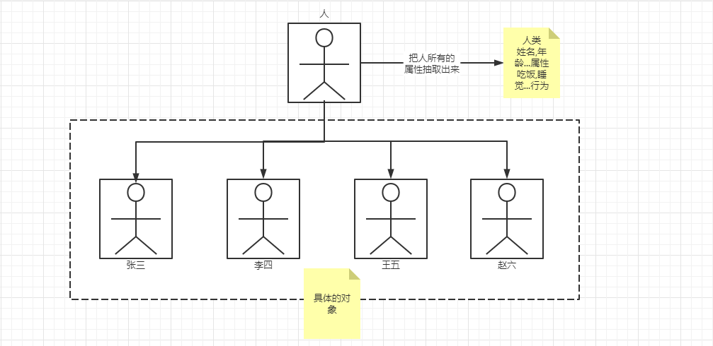
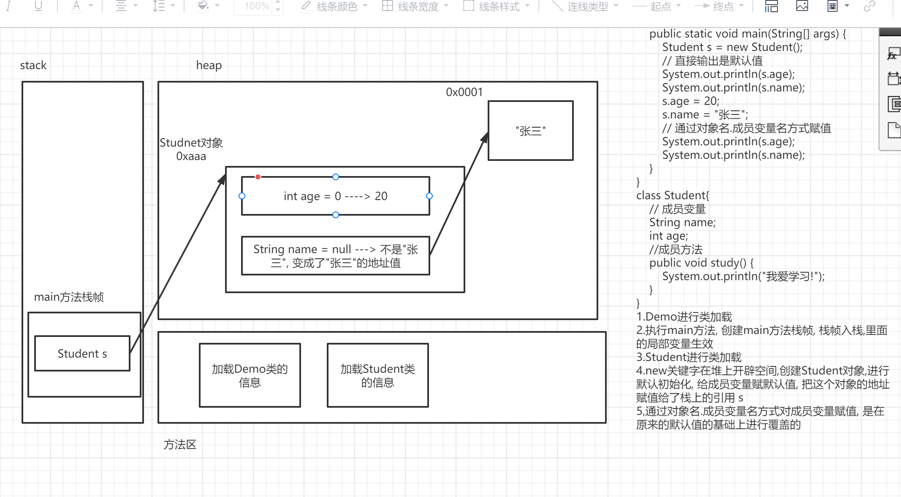
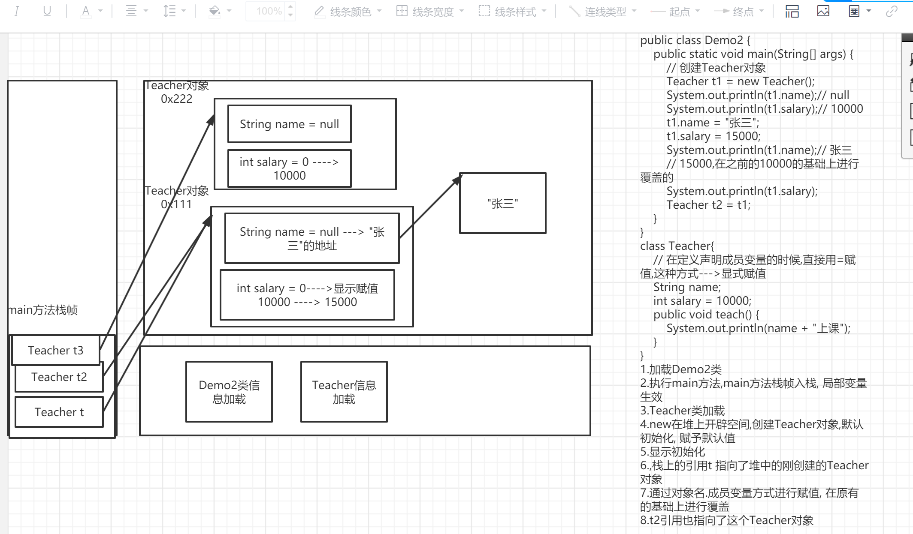
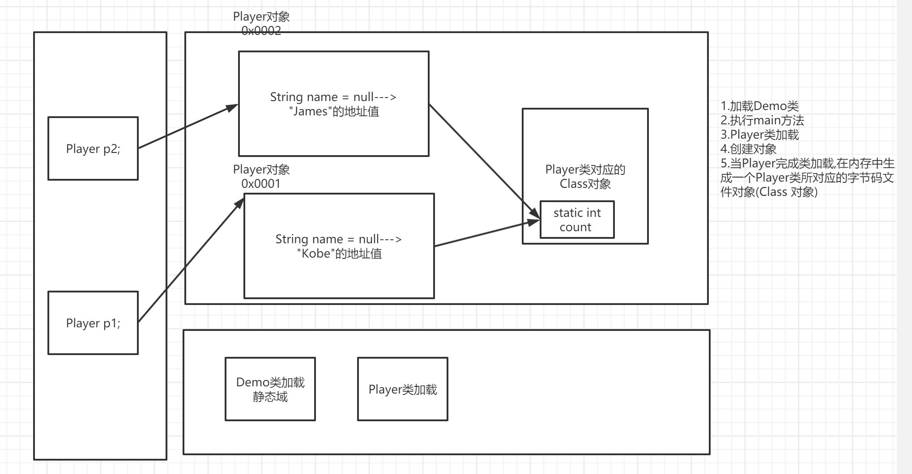

[TOC]


# 对象和类

学习目标:

- 掌握对象与类的关系
- 掌握如何定义类
- 掌握对象的创建与使用

## 引例

张三养了3只狗，一只1岁白色萨摩亚，一只2岁黄白柯基，一只3岁黄色金毛

解决方案:

- 单独变量模拟
- 数组方式模拟

Code

```java
public static void main(String[] args) {
        // 单独变量解决
        // 第一只dog
        String dogName1 = "萨摩耶";
        String dogColor1 = "白色";
        int dogAge1 = 1;

        // 第二只狗
        String dogName2 = "柯基";
        String dogColor2 = "黄白色";
        int dogAge2 = 2;

        // 第三只狗
        String dogName3 = "金毛";
        String dogColor3 = "黄色";
        int dogAge3 = 3;
        // 数组方式解决

        String[] dog1 = {"萨摩耶", "白色", "1"};
        String[] dog2 = {"柯基", "黄白色", "2"};
        String[] dog3 = {"金毛", "黄色", "3"};
}
```

单独变量解决==》不利于数据管理

数组解决==》数据类型无法体现，取值只能通过下标，变量名跟内容很难关联起来

缺点：不利于数据管理

为了解决上述问题, 我们引入了类与对象.

## 对象的概念

在生活中，我们每个人都是独立的个体，还有一些客观存在的个体，个体之间通过交互共同组成了这个世界。

面向对象程序的世界就是对现实生活的模拟，就是把现实生活中的场景搬到程序中。

Java 是面向对象的编程语言，独立的个体就是<font color=red>**对象（Object）**</font>，对象就是面向对象程序设计的核心。

对象之间相互协作，共同实现程序的功能。

现实中存在的个体，Ta们具有特定的属性和特定的行为，程序世界中的<font color=red>**对象**</font>也类似，具有以下特点：

- **属性**：个体的状态信息（数据）	
- **行为**：个体能够做什么（操作）


## 类的概念

现在我们知道了对象对程序世界的重要性，为了完成程序开发，我们程序员的工作就变成了：

创建一个个对象，并维护对象之间的交互。

在这个过程中，最基本，最先要解决的问题就是——**对象的创建，怎么得到一个对象呢？**

就像上帝造人，女娲造人是以自身为模板一样。我们程序员创建程序中的对象，也需要一个<font color=red>**"模板"**</font>。

在Java中把创建对象的"模板"，称之为<font color=red>**类（class）**</font>。

也就是说，到目前为止，我们终于可以给我们之前天天用的类（class）下一个明确的定义了：

<span style=color:red;background:yellow>**创建对象的模板就是类！类就是创建对象的模板！**</span>

既然类是模板，那么：

类就抽取了同类别的所有对象**属性和行为**上的<font color=red>**共性**</font>，一个类可以描述千千万万个对象。

## 类与对象的关系

类和对象的关系：

1. 类描述了，同种类型的对象，在属性和行为上的共性特征。

   所以：

   类是抽象的，而对象是具体的，所以对象也称为实例（instance）。

2. 类只规定了共性，只是描述对象该有什么属性，该有什么行为。

   但是：

   具体对象属性的取值，即便是同类型对象也可能有差异。一个类可以创建出千千万万个不同的对象。




## 类的定义

定义类包括定义类本身，和定义类中结构两部分。

### 定义一个类

语法

```Java
[类修饰符列表] class 类名{
	// 类体
}
```


### 定义类中的成员

**类中成员分为两部分:**

1. 成员变量: 描述对象的共有属性
2. 成员方法: 描述对象的共有行为


**如何定义成员变量？**

定义<font color=red>**在类体中，方法外的变量，就称之为成员变量**</font>。

``` java
[修饰符列表] 数据类型 成员变量名;
```

**注意:**

成员变量，在整个类体中生效，在整个类中的成员方法中都可以访问它！


**如何定义成员方法?**

``` java
[访问权限修饰符] 返回值类型 方法名(形参列表){
  // 方法体
}
```

解释：

1. 成员方法和我们之前使用的方法不一样，必须没有static修饰！！
2. 访问权限修饰符我们还未学习，这里先默认是<font color=red>**public**</font>！
3. 其它诸如形参列表，方法体，方法名等结构和之前讲的方法一样。

定义一个学生类Demo

```java
class Student{
    // 属性
	public String name;
	public int age;
    // 行为
    public void study(){
        
    }
}
```


## 对象的创建与使用

### 创建

创建类的对象一般需要在方法中进行，在确定能够创建对象的地方，可以使用以下语法创建对象：

``` java
类名 对象名 = new 类名();
```

这个语法，我们并不陌生，在Scanner键盘录入的时候，已经见过了，现在做如下解释：

1. 类名表示创建是何种对象，对象的类型是什么。
2. 对象名和之前讲的数组名是一个概念，都是引用数据类型的引用。作为一个变量名，对象名遵循小驼峰式的命名规范。
3. new关键字表示在堆上开辟空间创建对象，注意代码中的new关键字表示一定会在堆上创建一个独立的对象。

比如创建一个Student对象，就应该这么写：

```Java
Student s = new Student();
```

### 使用

请大家思考一个问题：

如果不创建对象，能够直接访问类中的成员变量和成员方法吗？

很明显是不可以的

注意: 无论成员变量还是成员方法，都是属于对象的！必须创建对象才能访问它们！


对象创建出来后，大致可以做以下操作：

1. 直接输出对象名

   和数组直接输出数组名是一样，默认情况下，直接打印对象名得到的是：

   -  该类的全限定类名 + "@" + 十六进制的地址值
   -  可以通过==进行地址值的比较

2. 使用对象获取对象的属性和行为：

   1. 访问属性（获取属性值和修改属性值）

      语法：

      ``` java
      数据类型 变量名 = 对象名.成员变量;
      ```

      通过上述方式就可以直接获取属性值了，修改属性值也是类似的做法：

      ``` java
      对象名.成员变量 = 值;
      ```

      注：对象中的成员变量，类似于数组对象中的元素，它们都具有默认初始化和默认值！！！

      而具体默认值是什么，也和数组对象中的元素一致，不再赘述！！

   2. 调用行为（方法）

      语法：

      ``` java
      对象名.成员方法名(实参);
      ```

      如果方法有返回值，还可以接收返回值。
      
      注意: 实际上不同对象，访问类中同一个成员变量和成员方法的结果完全可能是不同的！！

## 注意事项

2. 一个Java文件中的多个class是同包（文件夹）关系。
3. 一个类当中，成员变量，而后再写成员方法。
4. 类中没有的属性和行为，对象是不可能有的，类是模板，模板中有才能体现在对象中。
5. 使用new关键字就会创建新的对象，两条new语句创建的对象是完全独立的。
6. 成员变量，在类的全局生效，不像局部变量仅在作用域内生效！成员变量，在整个类体中生效，在整个类中的成员方法中都可以访问它！

# 

学习目标:

- 了解类是一种自定义数据类型
- 了解类加载

## 基本概念

先回顾一下，在Java基础语法部分，我们给出的数据类型的概念/定义：

> 数据类型： <span style=color:red;background:yellow>**表示的是一组数据的集合，和基于该数据集合的一组合法操作。**</span>

那么这个定义能不能套在数据类型中呢？

在类的定义中，我们知道类中的成员包括2部分：

1. 成员变量
2. 成员方法

成员变量本质上就是数据，成员方法本质上就是操作，那么假设做以下类比：

1. 数据的集合： 类中成员变量的集合
2. 操作的集合： 类中成员方法的集合

于是，就可以做出以下总结：

1. 一个类的定义，实际上就是定义了一种全新的数据类型，一种自定义的数据类型。
2. 这种完全不同于基本数据类型的数据类型，我们称之为"引用数据类型"。

## 类加载介绍

当我们在程序中使用一个基本数据类型时，由于基本数据类型是JVM当中已经预先定义好的（所以基本数据类型叫"内置数据类型"），JVM可以清楚的知道这个基本数据类型变量在内存中的存储方式（占用空间大小、结构等等），JVM能够正常开辟空间，正常给变量初始化赋值。

但是<font color=red>**类这种引用数据类型**</font>，并不是内置数据类型，而是我们自定义的数据类型。

现在我们要根据一个类来创建它的对象，要让JVM帮助我们开辟空间创建引用和对象，JVM怎么知道到底要创建什么呢？难道它未卜先知吗？

显然是不可能的，某个类在一开始并不被JVM<font color=red>**"认识"**</font>——它不知道类中有什么，必然不可能做任何操作。

所以在对某个类做任何操作之前，都需要让JVM来<font color=red>**"认识"**</font>这个类型。

在Java中，把JVM<font color=red>**"认识"**</font>一个类的过程，称之为<span style=color:red;background:yellow>**类加载**</span>

关于类加载：

1. 类加载的具体过程，我们后面会详细学习。这里我们先不用了解它的详细过程。
2. 类加载是通过把某个类的二进制字节码文件（class文件）通过I/O流的形式，读取进JVM内存中的方法区实现的。
3. 通过读取二进制字节码文件，并加载进JVM内存。这是JVM了解这个类型的过程。
4. 类加载之后，就可以做很多类型相关的操作了。
5. 类加载要在创建对象之前进行，换句话说创建一个类的对象必然触发该类的类加载！


我们通过画对象内存图，来展示这一过程：

> 1. 一个对象的内存图，一个对象的创建过程。(创建1个Student对象)
> 2. 三个对象的内存图，其中有两个引用指向同一个对象。(创建3个Teacher对象,并进行显式赋值)





**总结：**

1. <span style=color:red;background:yellow>**一个类的类加载在一次程序运行过程中，最多只有一次。**</span>

2. 多个引用指向同一个对象时，某个引用修改了对象的状态（成员变量的取值），再用其它引用访问会得到修改后的结果。

   注：这一点实际上和数组是一样的。

3. 类加载IO流操作, 很耗费性能，所以JVM在进行类加载时是<span style=color:red;background:yellow>**"懒加载"**</span>的, 迫不得已才加载.

   > 我们把一定会触发类加载的场景，称之为<span style=color:red;background:yellow>**类加载的时机**</span>，目前已经学过的有：
   >
   > 1. 创建该类对象
   > 2. 启动该类中的main方法

# 局部变量与成员变量

**学习目标:**

掌握局部变量与成员变量的区别

<span style=color:red;background:yellow>**局部变量**</span>和<span style=color:red;background:yellow>**成员变量**</span>是Java程序开发时，最常见的两种变量类型，所以一定要搞清楚，它们之间的不同。

## 两者的区别

局部变量和成员变量的比较，我们从以下五个方面去比较：

1. 在类中定义的位置不同
2. 在内存中的位置不同
3. 生命周期不同
4. 有无默认初始化不同
5. 作用范围


**在类中定义的位置不同**

1. 局部变量定义在：方法、方法的形参或者代码块结构等**局部位置**。
2. 成员变量 定义在：类体中、非局部位置的**成员位置**。

**在内存中的位置不同**

1. 局部变量存储在栈上的栈帧中
2. 成员变量存储在堆中的对象中

**生命周期不同**

1. 局部变量随着方法的执行，而被创建，随着方法的执行结束就会被销毁。**局部变量和方法"同生共死"。**

2. 成员变量在对象创建以后就存在了，对象被销毁回收内存自然就不存在了。

   > 但实际上只要该对象栈上的引用被销毁，对象成为"垃圾"，对象中的成员变量也就失去意义了。

**有无默认初始化不同**

1. 局部变量没有默认初始化过程，必须手动初始化赋值。
2. 成员变量，有默认的初始值。和数组一样，这里不再赘述。

**作用范围**

1. 局部变量只在作用域的局部生效。

2. 成员变量在整个类的成员方法中都可以使用，所以很多书籍也把成员变量称之为"全局变量"。

   > <font color=red>**注意，加static的方法不是成员方法，成员变量不能在其中使用（原因后面再讲）**</font>

## 成员变量的赋值

限于目前的学习进度，其实你只知道两种给成员变量赋值的手段：

1. 默认初始化，具有默认值。

2. 显式赋值。即在类中定义成员变量时，直接了当的给出该成员变量的取值，就是显式赋值！比如：

   成员变量的显式赋值演示

   ```Java
   class Student{
   	// 类体
   	String name = "张三"；
   }
   ```

显式赋值和默认初始化赋值的顺序，任何时候都要记住，<span style=color:red;background:yellow>**对象中的元素，默认初始化永远是第一步！**</span>在任何给成员变量赋值的手段执行前，默认初始化都已经执行了！

可以认为默认初始化是JVM在创建对象的内存结构时，它<font color=red>**"顺手"**</font>给出的！

# this关键字

学习目标:

- 掌握this关键字的使用

## 引例

学习完对象与类后，做以下练习：

> 创建一个汽车类，有颜色（color）和速度（speed）两个属性，行为是可以跑（run）。
>
> 实现：
>
> 1. 在run成员方法中访问速度和颜色两个属性，调用该方法查看结果。
> 2. 在run成员方法的形参列表中，添加一个局部变量speed，不修改方法体，调用该方法查看结果。
>
> 思考：
>
> 1. 两次方法调用的结果一样吗？为什么？
> 2. 如果我想在2中得到1的访问结果，怎么办呢？

code

```java
public class Demo {
    public static void main(String[] args) {
        // 创建Car对象
        car car = new car();
        // 调用成员方法
        //car.run();
        car.run(200);
    }
}

class car{
    // 定义成员变量
    String color = "黑色";

    double speed = 120.0;

    //// 定义成员方法
    //public void run(){
    //    System.out.println(color + "的车在高速公路上以" + speed + "公里每小时疾驰!");
    //}


    // 定义成员方法
    public void run(double speed){
        System.out.println(color + "的车在高速公路上以" + this.speed + "公里每小时疾驰!");
    }

}

```


很明显，由于就近原则的影响：

> <font color=red>**当方法中存在同名的局部变量和成员变量时，访问该同名变量，访问到的必然是距离访问语句更近的局部变量，而不是同名的成员变量。**</font>

这个时候，如果还想访问同名成员变量，普通的手段是做不到了，就需要this关键字来实现访问。

## 概念

<span style=color:red;background:yellow>**this关键字（重点）：**</span>

Java类中的每个成员方法的形参列表中都隐含了一个传参（隐式传参），传入的是当前对象，用this关键字指向!(为什么类中的所有成员方法都可以访问到成员变量---->就是因为this的存在)

1. this是一个引用，这个引用指向当前对象。

2. 何为当前对象？

   很多同学，在初学this时，会经常疑惑何为当前对象呢？

   其实非常简单：

   this指向当前对象，是类中成员方法的一个隐式传参。

   成员方法总会需要一个对象，使用对象名点来调用该成员方法，这个调用该成员方法的对象，就是当前对象！

Demo

```Java
Student stu = new Student();
stu.study();
stu.sleep();
```

<font color=red>**成员方法study()和sleep()的this指向当前对象，指向的就是stu对象。**</font>

验证当前对象就是调用方法的那个对象

```Java
package _04oop.com.cskaoyan._02this._02verfiy;

public class Demo {
    public static void main(String[] args) {
        // 创建对象
        Student student = new Student();
        // 调用方法
        student.printThis();
        // 打印对象
        System.out.println(student);
    }
}

class Student{
    // 定义成员方法
    public void printThis(){
        System.out.println(this);
    }
}
```

<font color=red>**可以发现和在main方法中打印对象名（引用）结果一致，证明当前对象就是调用方法的那个对象。**</font>

## this关键字的作用

既然this已经指向当前对象，是一个引用，那么它基本的用途就有：

1. 在成员方法中，用this引用去访问类中成员变量和调用类中成员方法。由于this本身就是隐含的，所以一般情况下，可以省略this，直接访问类中成员。
2. 特殊情况下，当成员方法中的局部变量和成员变量同名时，可以用 "this."访问 来表示访问同名成员变量，来和同名局部变量做区分。这种情况，this是不能省略的。
3. 在成员方法中只要使用 "this."访问 一个变量，那么该变量一定是成员变量。在代码比较复杂的情况下，可以显著增加代码可读性, 可以使用this.成员变量对成员变量进行赋值--->set方法

## 注意事项

1. this指向当前对象的隐含传参，必须是在普通成员方法中，加static的方法中，没有该this传参。（所以static方法不能直接访问类的成员，需要先创建对象才能访问。）
2. 既然this指向当前对象，那么对于不同的当前对象this的值自然不同。

# 构造方法

## 引例

创建一个教师类，有课程和年龄两个属性，行为是上课。

现在我们需要创建以下对象：

1. 18岁的Java老师对象
2. 28岁的C++老师对象
3. 30岁的Python老师对象
4. ...

按照之前我们的做法，需要先创建出对象，再进行成员变量的赋值。

Code

```java 
        Teacher teacher = new Teacher();
        teacher.course = "Java";
        teacher.age = 20;
        teacher.teach();

        Teacher teacher2 = new Teacher();
        teacher2.course = "C++";
        teacher2.age = 21;
        teacher2.teach();


        Teacher teacher3 = new Teacher();
        teacher3.course = "Python";
        teacher3.age = 22;
        teacher3.teach();
```


如果属性很多, 需要创建很多对象，就有点过于麻烦了。

**对象的属性，能不能"出厂"的时候就设定好呢？想要在创建教师对象时，就直接指定这个对象的属性？**

有这种需求时，就需要<span style=color:red;background:yellow>**构造方法（constructor，也叫构造器）**</span>来完成了。

## 构造器语法

构造方法也是方法，但属于一种特殊的方法

```java
[访问权限修饰符] 类名(形参列表){
	// 构造方法体
}
```

说明:

1. 权限修饰符先使用public

2. 构造方法名必须跟类名相同(一模一样,包括大小写)

3. 构造方法没有返回值, 也不需要写返回值声明

4. 形参列表可以为空, 称为无参构造方法,非空为有参构造方法 

5. 构造方法体，和一般方法类似，可以写语句

6. 一个类中，是允许同时定义多个构造方法的，即构造方法重载，多个构造器的形参必须不同

   

## 构造器作用与使用

<span style='color:red;background:yellow;font-size:文字大小;font-family:字体;'>**构造器的作用是用来给成员变量赋值的，完成对对象的初始化**</span>

说明：

1. new关键字去创建对象的时候，JVM自动去调用构造方法，构造方法无法通过普通方法的调用方式调用。
2. 构造器的作用不是创建对象，创建对象是JVM的事情。构造器只是告诉JVM在创建对象过程中，给成员变量赋什么值。


使用方式是：

``` java
new 类名(实参列表);
```

**通过实参列表的不同，来判断调用哪个构造器。这实际也是方法重载的应用！**


需求:

使用构造方法改进引例, 在创建教师对象时，就直接指定这个对象的属性(完成成员变量的赋值操作)

Code:

```java
package _04oop.com.cskaoyan._03constructor._02defineuse;

/**
 * @description:
 * @author: 景天
 * @date: 2022/11/8 10:04
 **/
/*
使用构造方法改进引例, 在创建教师对象时，
就直接指定这个对象的属性(完成成员变量的赋值操作)

1. 18岁的Java老师对象
2. 28岁的C++老师对象
3. 30岁的Python老师对象
 */
public class Demo {
    public static void main(String[] args) {
        // 创建对象
        Teacher t1 = new Teacher("Java", 18);
        Teacher t2 = new Teacher("C++", 28);
        Teacher t3 = new Teacher("Pyhond", 30);

        // 调用方法
        t1.teach();
        t2.teach();
        t3.teach();
    }
}

// 定义教师类
class Teacher{
    // 定义成员变量
    String course;
    int age;

    /*
    [访问权限修饰符] 类名(形参列表){
	// 构造方法体
    }
     */

    // 无参构造方法
    public Teacher(){
        // 方法体
        System.out.println("无参的构造方法执行了");
    }

    // 有参构造方法
    public Teacher(String tCourse, int tAge){
        // 方法体
        System.out.println("有2个参数的构造方法执行了");
        // 给成员变量赋值
        course = tCourse;
        age = tAge;
    }

    // 定义成员方法
    public void teach(){
        System.out.println(age + "的老师讲" + course);
    }

    //public void teach(String name){
    //    System.out.println(age + "的老师讲" + course);
    //}
}
```


## 注意事项与使用细节

1. 类中默认提供的无参构造方法，是在该类没有任何构造器的情况下才有的。但是如果类中有任一构造器（有参/无参），那么就没有默认无参存在了
2. 在构造器中也会隐含this传参, 我们可利用this对成员变量进行赋值, 也可以使用快捷键, alt + insert快速生成构造器.
3. 构造器中还可以用this表示调用其它构造器，语法：

  ``` java
  this(实参列表);
  ```

  表示调用类中的其它构造器，根据实参列表决定调用哪个构造器。

  <span style=color:red;background:yellow>**注意，在构造器中使用this(实参)表示调用类中其他构造器时，这行代码一定要处在构造器代码的第一行！**</span>

  当然，既然必须在第一行，那么也只能用一次了。


## 构造器的赋值顺序

这里我们不妨总结一下，学完构造器后，三种给成员变量赋值的方式：

1. <font color=red>**默认初始化，具有默认值。**</font>
2. <font color=red>**显式赋值，直接将值写在成员变量声明的后面。**</font>
3. <font color=red>**构造器赋值。**</font>

通过下面的例子分析程序执行流程 , 以上三种赋值方式的执行顺序

```java
class Person{
    String name;
    int age = 20;

    public Person(String name, int age) {
        this.name = name;
        this.age = age;
    }

    public Person() {
    }
}

// 创建Person对象,成员变量的值分别是什么
Person p = new Person("张三", 30);
```

执行流程:

1. 加载Person类信息, 只会加载一次
2. 堆中分配空间
3. 完成对象初始化
   1. 默认初始化
   2. 显示赋值
   3. 构造器赋值
4. 堆中的对象的地址返回给p(对象的引用)


<span style=color:red;background:yellow>**在各式各样给成员变量赋值的方式中，构造器是最后执行的！！！**</span>


## 对象创建流程

**Debug练习 对于下列程序代码，请指出创建Student对象，程序每一步的执行流程：**

构造器Debug模式练习

``` java
public class Demo{
public static void main(String[] args){
Student stu = new Student(18,"王冰冰");
	}
}
class Student {
int age = 10;
String name = "张三";
double a = 100;

public Student(int age) {
  System.out.println("Student age");
  this.age = age;
}

public Student() {
}

public Student(int age, String name) {
  this(age);
  System.out.println("Student age，name");
  this.name = name;
}
}
```

在这个案例中，我们发现Student双参构造器中，有使用this调用单参构造器，那么它们的执行顺序是：

1. 类加载不要忘记了。
2. 程序会先找到，Student的双参构造器，但是并不会执行，而是
3. 先跳转执行this构造器，但是this构造器中的代码，也不会立刻执行（因为构造器赋值一定最后执行），而是
4. 先从上到下执行成员变量的显示赋值，然后
5. 跳回执行this构造器代码
6. 最后执行双参构造器代码

# 小练习

## 对象与类

完成以下案例，思考一下怎么能够找到系统中类、对象究竟是哪些？

1. 用面向对象的思想模拟LOL当中盖伦的战斗
2. 用面向对象的思想模拟植物大战僵尸

如何从需求中找到对象和类呢？

对象描述的是程序世界中的个体/实体，所以一般都是名词。

抽取出全体对象的共性特征，也就是成员变量和方法，就可以定义一个类。

注意事项：

1. 对象之间如果需要交互，可以考虑持有对方的引用作为成员变量。

2. 日常开发中，不建议随便把很多类定义在同一个Java文件中。

   > 正确情况下，建议一个Java文件中，仅定义一个public class和文件名保持一致。
   >
   > 当然，如果确有需求，也是可以定义非public class的。（少见但不是见不到）

3. 一个Java文件下的所有类，属于同包关系。

LOL

```java
public class Demo {
    public static void main(String[] args) {
        Legend galen = new Legend("Galen", "沉默打击", "勇气", "爱的魔力转圈圈", "大宝剑");
        galen.fight();
    }
}

// 英雄类
class Legend {
    String name;
    String skillQ;
    String skillW;
    String skillE;
    String skillR;

    /*
        定义构造器,从代码规范上来说,构造器写在
        成员变量的下面
        成员方法的上面
        而且都要写在一起(实际上所有构造方法重载的方法都应该写在一起)
        写在一起的顺序: 可以按照参数个数的多少去排列,个数少的在上面,多的在下面
      */
    public Legend() {
    }

    public Legend(String name, String skillQ, String skillW, String skillE, String skillR) {
        this.name = name;
        this.skillQ = skillQ;
        this.skillW = skillW;
        this.skillE = skillE;
        this.skillR = skillR;
    }

    public void fight() {
        System.out.println("名字为" + name + "的英雄,正在使用"+skillR+"技能战斗!");
    }

}
```


植物大战僵尸


```java
public class Plant {
    String name;
    int price;
    int hp;
    // 攻击力
    int damage;
    /*
        在开发中为了方便两个对象之间的交互
        往往会让某个对象持有另外一个对象的引用作为自身的成员变量
        这样对象之间的交互会更加灵活,是常用的做法
     */
    Zombie plantZ;

    public Plant() {
    }

    public Plant(String name, int price, int hp, int damage) {
        this.name = name;
        this.price = price;
        this.hp = hp;
        this.damage = damage;
    }

    // 行为
    public void attack() {
        System.out.println(name + "正在攻击" + plantZ.name);
    }

    public void beAttacked() {
        System.out.println(name + "正在被" + plantZ.name + "攻击,现在还剩下" + (hp - plantZ.damage));
    }
}


public class Zombie {
    String name;
    int hp;
    // 攻击力
    int damage;
    double speed;

    Plant zombieP;

    public Zombie() {
    }

    public Zombie(String name, int hp, int damage, double speed) {
        this.name = name;
        this.hp = hp;
        this.damage = damage;
        this.speed = speed;
    }

    // 行为
    public void attack() {
        System.out.println(name + "正在攻击" + zombieP.name);
    }

    public void beAttacked() {
        System.out.println(name + "正在被" + zombieP.name + "攻击,现在还剩下" + (hp - zombieP.damage));
    }

    public void move() {
        System.out.println(name + "正在以" + speed + "的速度,接近你的脑子~~");
    }

    public void eat() {
        System.out.println(name + "吃掉了你的脑子~真香~");
    }
}


```


## 值传递练习

学习对象与类后，再复习一下如果方法的参数是需要一个对象，值传递是怎样进行的。

> 练习：
> 定义一个学生类，该类具有一个int属性age
> 1.在测试类中写一个方法，交换两个Student对象的age属性
> 		请问能够交换成功吗？原因是什么？
>
> 2.在测试类中写一个方法，交换两个Student对象的引用（地址）
> 		请问能够交换成功吗？原因是什么？

结论：

1. Java只有值传递
2. Java当中的方法可以改变对象的状态（成员变量的取值）但是无法直接交换两个引用（无法改变局部变量）

## 成员变量赋值顺序练习

```Java
public class Demo {
 public static void main(String[] args) {
     Student s = new Student(18, "长风");
     System.out.println(s.age);
     System.out.println(s.name);
     System.out.println(s.var);
     System.out.println(s.cat.price);
 }
}
class Student {
 int age = 10;
 String name = "张三";
 double var = 20;

 public Student(int age) {
     System.out.println("Student age");
     this.age = age;
 }

 public Student() {
 }

 public Student(int age, String name) {
     this(age);
     System.out.println("Student age,name");
     this.name = name;
 }

 Cat cat = new Cat(1000);
 Cat c2;
}

class Cat {
 double price;

 public Cat() {
 }

 public Cat(double price) {
     System.out.println("Cat price");
     this.price = price;
 }
}
```

> 思考程序输出的顺序，搞清楚其中赋值的顺序。

```
1.Demo类加载,main方法执行
2.Student类加载,创建Student对象,调用2参构造
3.此时2参构造不会执行,会因为this(单参)调用单参构造,
4.此时单参构造不会执行,会先对对象中成员变量默认初始化,进行默认赋值
5.进行显式赋值
6.Cat cat = new Cat(1000);执行到这里,会触发Cat类加载
7.调用Cat单参构造方法
8.Cat单参构造方法先不执行,先默认赋值,没有显式赋值,执行构造方法进行赋值
9.Student类中的成员全部显式赋值成功--->进行构造器赋值
10.Student的单参构造器先执行,再执行两参构造器
11.Student对象创建成功并完成了赋值--->回到main方法继续执行
12.输出相应结果
```

# static关键字

学习目标:

- 掌握静态成员变量的使用与特点
- 掌握静态成员方法的使用与特点
- 掌握静态与非静态的区别

## 引例

场景如下:

一场篮球比赛, 梦之队有5名顶级球员Kobe, James, Stephen...... 都是神射手擅长投3分,投篮必进

每进一球, 队伍分数+3, 比赛结束, 统计一下该队伍得分情况,  写程序模拟这个场景.

思路:

- main里面定义int count, 用来记录分数
- 每当有1个球员进球, 分数+3

Code:

```java
package _04oop.com.cskaoyan._04static._01introuction;

/**
 * @description:
 * @author: 景天
 * @date: 2022/11/11 9:48
 **/
/*
一场篮球比赛, 梦之队有5名顶级球员Kobe, James, Stephen...... 都是神射手擅长投3分,投篮必进

每进一球, 队伍分数+3, 比赛结束, 统计一下该队伍得分情况,  写程序模拟这个场景.

思路:

- main里面定义int count, 用来记录分数
- 每当有1个球员进球, 分数+3
 */
public class Demo {
    public static void main(String[] args) {
        // 定义一个计数器
        int count = 0;
        Player p1 = new Player("Kobe");
        p1.shot();
        count += 3;
        System.out.println("分数: " + count);

        Player p2 = new Player("James");
        p2.shot();
        count += 3;
        System.out.println("分数: " + count);

        Player p3 = new Player("Stephen");
        p3.shot();
        count += 3;
        System.out.println("分数: " + count);

    }
}

// 定义一个Player类
class Player {
    // 定义成员变量
    String name;

    public Player(String name) {
        this.name = name;
    }

    // 定义成员方法
    public void shot() {
        System.out.println(name + "进球了!");
    }
}
```


问题分析:

int count这个值是个局部变量, 独立于对象之外的, 使用起来不是很方便

引出来static关键字.


## 静态成员

根据static修饰的内容不同, 有以下分类

- **静态成员变量**, static修饰成员变量 (有的资料里也称为**类变量**, **类属性**指的都是静态成员变量)
- **静态成员方法**, static修饰成员方法(有的资料里也称为**类方法**, 指的还是静态成员方法)

统称为类的静态成员

### 静态成员变量

**基本语法** 

```
[访问权限修饰符] static 数据类型 变量名;
```

**使用与特点:**

- 和普通成员变量一样,都具有默认值（默认值和普通成员变量是一样的）
- <span style=color:red;background:yellow>**静态成员变量属于类的，完全不需要创建对象使用。**</span>
- 访问和使用静态成员变量不推荐使用<font color=red>**"对象名."**</font>，而应该使用<font color=red>**"类名."**</font>！
- 静态成员变量的访问/赋值/使用都不依赖于对象, 而是依赖于类


使用案例: 

设计一个int 类型的count值来表示球队得分, 每有一个球员得分, 那么count值+3, 要求count被所有对象所共享的即可. 使用静态成员变量修改之前的引例.

```java
class Player{
	String name;
	// 使用static关键字修饰成员变量, 使其成为静态成员变量.
	static int count;
}
```


Code

```java
package _04oop.com.cskaoyan._04static._02static_field;

/**
 * @description:
 * @author: 景天
 * @date: 2022/11/11 9:58
 **/
/*
设计一个int 类型的count值来表示球队得分, 每有一个球员得分,
那么count值+3, 要求count被所有对象所共享的即可. 使用静态成员变量修改之前的引例.
 */
public class Demo {
    public static void main(String[] args) {
        // 静态成员变量可以通过类名.方式访问
        // 推荐使用类名.方式访问 
        System.out.println("得分: " + Player.count);

        // 创建Player对象
        Player p1 = new Player("Kobe");
        // 投篮
        p1.shot();
        // 更改分数 + 3
        p1.count += 3;
        System.out.println("得分: " + p1.count);

        // 创建Player对象
        Player p2 = new Player("James");
        // 投篮
        p2.shot();
        // 更改分数 + 3
        p2.count += 3;
        System.out.println("得分: " + p2.count);

        // 创建Player对象
        Player p3 = new Player("Stephen");
        // 投篮
        p3.shot();
        // 更改分数 + 3
        p3.count += 3;
        System.out.println("得分: " + p3.count);

    }
}

// 定义一个Player类
class Player {
    // 定义成员变量
    String name;

    // 定义一个静态的成员变量,表示球队得分
    static int count;

    public Player(String name) {
        this.name = name;
    }

    // 定义成员方法
    public void shot() {
        System.out.println(name + "进球了!");
    }
}
```

内存及原理解析:

静态成员的访问并不依赖于创建对象，可以直接通过类名访问，其原因在于：

<font color=red>**随着类加载完毕，静态成员就存在，并且能够使用了！**</font>

<span style=color:red;background:yellow>**某个类的某个静态成员变量只有一份**</span>，且被所有对象共享，属于类，无需创建对象使用。




注意事项:

- <font color=red>**只存在静态成员变量，不存在"静态局部变量"**</font>

> 局部变量，已经被方法限制了作用域，不能用static修饰它！

### 静态成员方法

**基本语法**

```
[访问权限修饰符] static 返回值类型 方法名(形参列表){
	//方法体
}
```

**使用与特点**

- 无需创建对象就可以直接通过类名点直接调用。
- 同一个类中的static方法互相调用可以省略类名，直接用方法名调用。（这就是我们之前方法的调用）


注意事项:

1. 一个类中，静态方法无法直接调用非静态的方法和属性，也不能使用this，super关键字（super后面会讲）,静态的方法只能访问静态的
  1. 经典错误：Non-static field/method xxx cannot be referenced from a static context
  2. 原因：静态方法调用的时候，完全有可能没有对象，没有对象普通成员就无法访问。

2. 普通成员方法当中，既可以访问静态成员的, 也可以访问非静态成员。普通成员方法访问任意的
  1. 访问静态成员变量的时候，使用类名.变量名的形式访问，以示区别，增加代码可读性

## 类加载时机

静态成员需要在类加载时期，完成准备，类加载结束就能够使用。

所以<span style=color:red;background:yellow>**访问类的静态成员，一定会触发该类的类加载。**</span>

总结，到目前学习过的类加载时机：

1. new直接创建该类的对象。(**首次**)
2. 启动该类中的main方法。
3. 访问该类的静态成员（方法和变量) (**首次**)

## static VS 非static

当我们了解static成员的特点后，静态成员和非静态成员的区别就很明显

我们从以下四个角度比较（拿成员变量为例）

1. 成员的所属
2. 在内存中的位置
3. 在内存中出现的时间
4. 调用方式


其比较的结论如下：

- **所属不同**
  1. 静态成员变量属于类，所以也称为为类变量
  2. （普通）成员变量属于对象，所以也称为对象变量（实例变量）
- **在内存中的位置不同**
  1. 静态变量存储于方法区的静态域(堆上的这个类所对应的字节码文件对象,即Class对象中)，被所有对象共享
  2. 成员变量存储于堆内存，每个对象独享自己的成员变量
- **在内存中出现时间不同**
  1. 静态变量随着类的加载而加载，比成员变量出现的要早
  2. 成员变量随着对象的创建而存在
- **调用方式不同**
  1. 静态变量可以通过类名调用，也可以通过对象调用（不推荐）
  2. 成员变量只能通过对象名调用，必须创建对象

## 使用场景

这里，根据static关键字的一些特点来明确它的使用场景，给大家以后使用static关键字做一下参考。

- 静态成员变量：

   1. **属于全体对象所共享而不是独属于某个对象的成员变量**

     > 所以当存在需要所有对象共享的变量时，应该使用static修饰的静态成员变量。

   2. **在整个类全局独一份的（因为类加载只有一次）**

     > 所以，如果希望某个变量在类的全局独一份时，应该使用static修饰的静态成员变量。

   举例1 :

   创建一个学生类，用来描述我们班全体同学

   要求：

   属性：姓名，性别，年龄，学号，学校信息

   行为：吃饭，学习

   我们简单思考可以知道, 无论你是张三或者李四, 学校信息这个属性实质上应该是被全体同学所共有的属性，而不是独属于某个对象的, 这种场景下就可以使用static 修饰学校信息

   举例2:

   创建一个学生类,  有2个属性: 姓名String name , 学号int id

   统计外部创建Student类对象的个数 假设给Student类的对象自动编号

   这个编号第一次创建对象是10001 随后每创建一个新对象就+1

   ```java
   package _04oop.com.cskaoyan._04static._05use_case;
   
   /**
    * @description:
    * @author: 景天
    * @date: 2022/11/11 15:04
    **/
   /*
   利用了static成员变量类全局唯一 且被共享
   统计外部创建Student类对象的个数  假设给Student类的对象自动编号
   这个编号第一次创建对象是10001 随后每创建一个新对象就+1
   
    */
   public class Demo {
       public static void main(String[] args) {
           Student s1 = new Student();
           System.out.println(s1.id);
   
           Student s2 = new Student();
           System.out.println(s2.id);
   
           Student s3 = new Student();
           System.out.println(s3.id);
   
           Student s4 = new Student();
           System.out.println(s4.id);
   
           System.out.println("共计创建了" + Student.count + "个学生");
   
       }
   }
   
   class Student{
       // 姓名
       String name;
       // 学号
       int id;
   
       // 统计学生数量
       static int count;
   
       // 初始学号
       static int initNumber = 10001;
   
       public Student() {
           // 学生数量+1
           count++;
           // 学号递增
           this.id = initNumber++;
       }
   
   
   }
   ```

- 静态成员方法：

   1. 静态方法的最主要特点就是<font color=red>**调用简单，无需创建对象即可调用。**</font>

     > 所以如果希望一个方法能够更方便快捷的去调用，可以把它声明为static修饰的静态成员方法。

   2. 根据静态成员方法调用简单的特点，当一个类中全部都是静态成员方法时，

     > 类中的所有方法的调用都可以使用类名点去完成，这就是Java当中的<span style=color:red;background:yellow>**"工具类"**</span>。比较典型的有：数组工具类Arrays、集合工具类Collections、数学工具类Math等等。
   


## static执行顺序练习

请说明程序的输出结果，并分析流程

```java
public class Demo {
static Cat cat = new Cat(); 
Dog dog = new Dog();
Dog dog2;
static Dog dog3; 

public static void main(String[] args) {
  System.out.println("hello world!");
  Demo d = new Demo();
}

public Demo() {
  System.out.println("demo");
}
}

class Cat {
static Dog dog = new Dog();

public Cat() {
  System.out.println("cat");
}
}

class Dog {
public Dog() {
  System.out.println("dog");
}
}
```


<details><summary>你能得出什么结论?</summary>
1.静态成员变量的显式赋值，是在类加载过程中执行的。不管何种方式触发该类的类加载，这个过程都要执行。<br>
2.类加载可以连环触发，一个类可以最先开始类加载，但是不一定会最先完成类加载<br>
3.无论是静态成员变量还是成员变量，只有声明且没有其它任何赋值方式赋值，那就只有默认值。
</details>


# 匿名对象

学习目标:

- 掌握匿名对象的概念
- 掌握匿名对象的用途与特点

## 什么是匿名对象

在Java当中，匿名对象指的就是没有名字的对象。

或者，说的更清楚一点，就是：<font color=red>**在创建对象时，就没有引用指向的对象，就是匿名对象！**</font>

匿名对象的语法很简单，只需要在方法等位置中写下列语法：

``` java
new 类名();
```

以上语法就得到了一个匿名对象，从实质上看：

该对象没有栈上的引用指向，没有所谓的**"对象名"**，是一个<font color=red>**匿名对象**</font>。

## 匿名对象的用途

匿名对象主要有两个用途（常见用途）：

1. 使用匿名对象作为方法的实参

   > 当定义以下方法时，表示该方法需要传入一个对象（**这个对象必须是"类名"的对象或者子类对象**）
   >
   > <font color=red>**注：子类对象的概念后面继承中会学习，这里为了文档严谨性写出来，你可以先忽略！**</font>

   ```Java
   [修饰符列表] 返回值类型 方法名(类名 对象名){
   	//方法体
   }
   ```

   **这个时候，常规的做法是创建对象，然后传入引用。但实际上这里可以直接传入匿名对象。**

   假如一个test方法需要传入一个Student对象，就可以这么写：

   ``` java
   test(new Student());
   ```

2. 使用匿名对象作为方法的返回值

   > 当定义以下方法时，表示该方法需要传入一个对象（**这个对象必须是"类名"的对象或者子类对象**）
   >
   > <font color=red>**注：子类对象的概念后面继承中会学习，这里为了文档严谨性写出来，你可以先忽略！**</font>

   ```java
   [修饰符列表] 类名 方法名(形参列表){
   	//方法体
   	return (匿名对象);
   }
   ```

   

## 匿名对象的优缺点

> **优点：**

1. <font color=red>**使用匿名对象，代码简洁（相当于少写了一些代码）这是匿名对象最主要的优点。**</font>

2. 匿名对象在使用完毕后会立刻成为"垃圾"等待GC回收，从理论角度上来说，可以提升内存利用率。

   > 但是<font color=red>**GC不具有即时性**</font>，并不是一个对象更早成为"垃圾"就会更好回收，这个优点仅是理论上的。

> **缺点：**

匿名对象由于没有引用指向，所以它是<font color=red>**一次性的**</font>，用完后就无法再次使用了。

## 匿名对象使用场景

> 我们根据匿名对象的优缺点，很容易总结出匿名对象的使用场景：

1. 需要一个对象去实现功能，并且该对象仅需使用一次即可，为了代码简洁，推荐使用匿名对象
2. 但是，如果一个对象可能会被复用，像以下代码频繁创建匿名对象是得不偿失的

不要滥用匿名对象

```java 
test(new Student());
test(new Student());
test(new Student());
...
```

**创建对象是需要耗时耗费内存空间的，不要为了一时的方便，频繁创建匿名对象。**

总之：

如果某个对象，仅使用一次，使用匿名对象简洁方便。

但如果有多次使用某个类的对象的需求时，频繁使用匿名对象会导致频繁创建对象，降低代码性能，得不偿失！

# 代码块

**学习目标**

- 掌握代码块的几种分类
- 掌握代码块的作用与特点
- 掌握几种代码块的执行顺序

## 概述

之前，我们理解的代码块就是为了限制局部变量的一个大括号，今天来详细的学习一下代码块。

代码块的定义：由若干条Java语句组成，并且用一对大括号括起来的结构，叫做代码块。

代码块的分类，根据其位置和声明方式的不同，可以分为：

- 局部代码块

- 构造代码块
- 静态代码块
- 同步代码块

注：同步代码块，涉及多线程知识，后面多线程再学习，今天略过它。


## 构造代码块

### 语法定义

**什么是构造代码块 ？**

- 定义在类的成员位置，使用以下声明方式声明的代码块，称之为构造代码块。


```java 
//成员位置
{
	// 局部位置
}
//成员位置
```

这个语法只有一个需要注意的地方：

<font color=red>**构造代码块内部属于局部位置，在里面定义变量，就是一个仅在构造代码块中生效的局部变量。**</font>

### 作用

随着构造器的执行，用于在创建对象过程中，给成员变量赋值

这里总结给成员变量赋值的几种方式（创建对象过程中）：

- 默认初始化，具有默认值
- 显式赋值
- 构造代码块
- 构造器


学习对象中成员变量的赋值，和赋值顺序要遵循<font color=red>**"掐头去尾"**</font>的原则：

1. <font color=red>**头**</font>：默认初始化，具有默认值，在对象结构存在于对象中，对象中的成员变量就已经具有了默认值。

   > 我们程序员所有能干预的赋值方式，都是在默认初始化的基础上进行的。

2. <font color=red>**尾**</font>：构造器，构造器在整个对象的成员变量赋值过程中，处在最后的阶段，最后被执行。

明确以上两点后，我们现在只需要研究<font color=red>**显式赋值**</font>和<font color=red>**构造代码块**</font>的赋值顺序，


经过代码测试，我们发现：

<font color=red>**显式赋值和构造代码块的执行顺序，并不是固定的，而是按照代码的书写顺序去执行的：**</font>

1. 这两个结构，谁写在代码书写顺序的上面，谁就先执行。
2. 后执行结构的结构，自然会覆盖先执行结构的结果。

这样，类中显然会出现类似以下代码：

```Java
//构造代码块
{
	a = 10;
}
int a = 1;
```

这种代码形式，按照从上到下的顺序来看的话，显然有些奇怪——成员变量还未定义，却进行了赋值。

<font color=red>**那么构造代码块为什么能够有这种特点呢？它的原理是什么呢？**</font>

### 原理

通过查看<font color=red>**反编译class文件（通过IDEA）**</font>，我们发现编译后的代码中并不存在<font color=red>**构造代码块**</font>的结构，而是：

**直接将成员变量的显式赋值和构造代码块中的代码智能地加入，类所有的构造器中的前几行：**

 **<span style=color:red;background:yellow>所谓智能是为了保证：</span>成员变量的显式赋值和构造代码块，按照代码的书写顺序从上到下执行！**

于是，我们可以得出以下结论：

1. 使用new对象的方式创建对象，不论使用哪个构造器，构造代码块都会随之执行。
2. 构造器是每一次new对象都会执行一次，所以构造代码块也会随之执行一次。
3. 构造代码块中的代码要放入构造器的首几行，<font color=red>**所以在同一个类中，构造代码块总是先于它的构造器而执行。**</font>

### 创建对象过程中的执行顺序

> 总结一下到目前为止，创建对象过程中可能碰到的结构的执行顺序：

new对象过程中，各种结构的执行顺序：

1. 对象结构存在后就进行默认初始化，所有成员变量都具有默认值后，再开始其余赋值操作

2. 找到new对象的那个构造器

   1. 如果它的首行显式地调用了另一个构造器this(实参)

     **（注：显式调用构造器目前指的是this调用自身构造器，其它场景这里先不考虑）**

     > 那么程序会先跳转到那个构造器，但是不会立刻执行，而是：
     >
     > 1. 按照类中构造代码块和显式赋值的代码书写顺序，从上到下执行其中的代码，执行完毕后：
     > 2. 跳转回this语句要指示执行的构造器，执行其中的代码，然后：
     > 3. 跳转回new对象构造器，执行完毕后，创建对象结束。
     >
     > <font color=red>**注：整个过程中，构造代码块和显式赋值的代码只会执行一次，不会执行多次！！**</font>

   2. 如果它的首行没有显式调用另一个构造器

     > 那么会先从上到下执行构造代码块和显式赋值代码，执行完毕后：
     >
     > 跳转回new对象构造器，执行完毕后，创建对象结束。
     >
     > <font color=red>**注：整个过程中，构造代码块和显式赋值的代码只会执行一次，不会执行多次！！**</font>

3. <font color=red>**以上总结，没有引入继承的概念，并不全面，我们会在继承中补全它。**</font>


### 实际用途

构造代码块最大的特点就是其中的代码，最终会加入类的所有构造器中，所以依据这一点：

1. 我们可以<font color=red>**"提取公因式"**</font>一样的，把所有构造器都需要执行的代码，放入构造代码块中。

2. 其次，构造代码块毕竟是给成员变量赋值用的，所以：

   > 如果需要很复杂的代码完成成员变量的赋值（如果只是给一个值，用显式赋值和构造器足矣）
   >
   > 比如需要一个算法，需要一定计算等等。在这些场景下，使用构造代码块赋值也是一个不错的选择。

### 练习

1. 创建一个类Student，类中有多个构造器，请写代码统计外部创建Student对象的次数。

2. 读程序题：

   代码块练习题

   ``` java
   public class Demo {
       public static void main(String[] args) {
           Cat c = new Cat(28, "紫色");
           System.out.println(c.age);
           System.out.println(c.color);
       }
   }
   
   class Cat {
       {
           age = 18;
           System.out.println("age building block");
       }
   
       int age = 10;
       String color = "黄色";
   
       {
           color = "黑色";
           System.out.println("color building block");
       }
   
       public Cat() {
       }
   
       public Cat(int age) {
           System.out.println("age constructor");
           this.age = age;
       }
   
       public Cat(int age, String color) {
           this(age);
           System.out.println("age color constructor");
           this.color = color;
       }
   }
   ```

   说出程序输出的顺序，并说明原因。

3. 最后思考：构造代码块能不能用于给静态成员变量赋值？

## 静态代码块

### 语法定义

**什么是静态代码块？**

定义在类的成员位置，使用以下声明方式声明的代码块，称之为静态代码块

```java 
//成员位置
static{
	// 局部位置
}
//成员位置
```

这个语法只有一个需要注意的地方：

<font color=red>**静态代码块内部属于局部位置，在里面定义变量，就是一个仅在静态代码块中生效的局部变量。**</font>

### 作用

> 静态代码块在类中的作用

**随着类加载的过程而执行，静态代码块可以看成是一个在类加载过程中，会自动调用的静态方法！用于给静态成员变量赋值！**

> 这里还是想再强调一下：<font color=red>**一般的静态成员方法是调用才会执行，并不是类加载过程中就会自动调用执行它！**</font>
>
> <span style=color:red;background:yellow>**想要一段语句，能够在类加载过程中自动被调用，需要使用静态代码块，而不是静态方法！！**</span>

这里总结一下给静态成员变量赋值的几种方式（类加载时期）：

1. 默认初始化，具有默认值
2. 显式赋值
3. 静态代码块

在这三个赋值方式中，默认初始化是永远第一步进行的，<font color=red>**显式赋值**</font>和<font color=red>**静态代码块赋值**</font>的执行顺序：

1. 按照代码的书写顺序去执行，谁写在代码顺序的上面，谁就先执行。
2. 后执行结构的结果，会覆盖掉先执行结构的结果。

**至于说到原理，静态代码块的执行，是JVM层面进行类加载的一种设计机制，是类加载的特殊设计机制保证的。**


### 实际用途

1. <font color=red>**复杂的静态成员变量的赋值。**</font>

   > 数据库中加载JDBC驱动（最经典的），也可能是最常见的。

2. <font color=red>**如果有一段代码，在类的全局，从始至终，只运行一次，可以写到静态代码块中。**</font>（依赖于类加载只有一次的原理）

   >  比如一些类的初始化工作，就可以放在静态代码块中完成。
   >
   >  最常见的就是类System的初始化，源码如下：
   >
   >  
   >
   >  System类的初始化，依赖于本地方法<font color=red>**registerNatives()**</font>的执行。

### 注意事项

> 一些细节问题（重要）

1. 静态代码块可以近似看成一个，<font color=red>**在类加载时期自动调用的静态成员方法**</font>，所以不能在里面调用非静态。（没有对象）

   > 包括this关键字，和后面学习的super关键字，都不能使用。
   >
   > 这意味虽然构造代码块可以给静态成员变量赋值，但静态代码块不能给成员变量赋值。
   >
   > **说白了，还是要搞清楚，谁先谁后执行的问题！**

2. 当需要使用复杂的代码给静态成员变量赋值时，可以使用静态代码块。

   > 但如果仅仅是简单的赋值，直接显式赋值即可。
   >
   > 总得来说，静态代码块用得不多。

3. <span style=color:red;background:yellow>**静态代码块也经常被用来测试类加载的顺序（重要）**</span>

   > 一个类的静态代码块如果没有被执行，说明它没有被完全类加载。


## 补充类加载过程

首先，一个类从被加载到JVM内存中开始，到卸载出内存为止，**一个类的生命周期**包括：


一共是：

1. **加载**（Loading）

2. **验证**（Verification）

3. **准备**(Preparation)

4. **解析**(Resolution)

5. **初始化**(Initialization)

6. **使用**(Using) 

7. **卸载**(Unloading)

   注：其中，验证、准备和解析可以统称为<font color=red>**连接(Linking)**</font>。

一个类在JVM中的生命周期，共有七个阶段。

其中<span style=color:red;background:yellow>**"加载 --> 连接 ---> 初始化"**</span>这三个步骤，即一个类的类加载过程。

这三步主要做：

1. <font color=red>**加载**</font>主要是做将class字节码文件读取进JVM内存的操作。

2. 在<font color=red>**连接**</font>过程中：

   1. 验证，主要目的是为了确保class文件的字节流中包含的信息符合当前JVM的要求，不会影响JVM的安全。

   2. 准备，主要目的是进行静态成员变量的默认初始化，设置初始值。

      > 这样，就保证了静态成员变量的默认初始化，永远最先进行。

   3. 解析，主要目的是将符号引用替换为直接引用。（不理解算了，目前不需要详细了解）

3. <font color=red>**初始化**</font>是类加载的最后一个步骤。主要目的是执行和static相关的内容，包括：

   > 执行静态成员变量的显式赋值。
   >
   > 执行静态代码块。

以上，关于类加载各步骤，大致的作用，我们就了解了。

所以这里要重新认识一个概念：<font color=red>**类加载的时机**</font>

类加载的时机，说得更准确一点，应该是<font color=red>**类初始化的时机**</font>。<span style=color:red;background:yellow>**当然，想要初始化一个类，必然要先进行加载和连接。**</span>

## 练习

类加载过程练习一

```Java
public class Demo {
static {
  System.out.println("Demo类开始初始化步骤了!");
}

static Cat cat = new Cat();
Dog dog = new Dog();

public static void main(String[] args) {
  System.out.println("hello world!");
  Demo d = new Demo();
}

public Demo() {
  System.out.println("demo");
}
}

class Cat {
static {
  System.out.println("Cat类开始初始化步骤了!");
}

static Dog dog = new Dog();

public Cat() {
  System.out.println("cat");
}
}

class Dog {
static {
  System.out.println("Dog类开始初始化步骤了!");
}

static Demo demo = new Demo();

public Dog() {
  System.out.println("dog");
}
}
```


# 导包

学习目标:

- 会使用import
- 知道什么是全类名(全限定类名)

## package关键字

package这个关键字我们并不陌生，它写在Java源文件的第一行，**用于声明整个Java文件下的所有类的所属包。**

语法：

``` java
package + 包名
```

当然，一个Java源文件当中，只能有一个public修饰的类。其余**非public修饰的类和public类都属于同包的关系。**

**注意：**

package关键字的使用很简单，但是有几个需要注意的地方：：

1. 包名在书写时，如果存在多级包名，需要使用用.隔开
2. package声明必须处在一个Java文件有效代码的第一行，否则会报错
   1. 注释不算有效代码，将package声明放在注释下面也是可以的
   2. 建议将package声明永远放在Java源文件真正意义上的第一行
3. 多数情况下，我们使用idea新建Java文件是无需关心package声明的，因为idea会自动生成

## 全限定类名

> 什么是全限定类名？

1. 可以**唯一的、准确的定位到一个类**的，由包名加上类名组成的字符串，就是全限定类名。
2. <font color=red>**默认情况下**</font>，直接输出一个对象的引用，会打印该类的全限定类名

## import关键字

### 引例

请按照以下步骤创建需要的类：

1. 在包名为**one**的包中创建一个**public class Student**和测试类**public class Demo**
2. 在包名为**another**的包中创建一个**public class Student**和**public class Teacher**
3. 在同名的Student类中给出同名的方法test，并给出不同的实现
4. 创建完毕后，开始进行测试工作

请完成下面测试：

> 1.在Demo类中直接创建Student对象，然后调用test方法，请问输出的结果是什么？
> 2.如果想要test方法调用得出anotherpackage包中Student类的结果，需要怎么做？

显然：

在Test类中直接创建Student类对象时，test方法的调用结果是onepackage下Student类的方法执行结果。

而如果想要test方法的调用结果体现为anotherpackage包下的Student类，就需要使用import关键字进行导包操作。

### 作用

从上述案例中，我们可以总结一下编译器在查找并决定使用某个class时，它的搜索机制：

- 在同包下时，类名是绝对唯一的，有就有，没有就没有，不存在选择的问题。
  1. 这时，编译器是可以直接通过一个类名去查找到一个类的，不需要额外操作，不需要导包。
  2. 这可以看成一种"就近原则"，同包已经存在这个类了，自然不需要去外面找。

- 当同包下没有这个类，必须在不同包下寻找时，多个不同包中完全可能存在同名类。
  1. 这时，编译器肯定是不可能直接通过类名去查找一个类了，需要程序员手动导包。
  2. 手动导包的目的是明确告诉编译器应该使用哪个包下的类。


**使用import关键字手动导包的语法是：**

``` java
import 全限定类名;
```

注意事项：

1. import导包语句应该放在**package声明之后，有效代码之前。**

   > 正常情况下，我们使用某个类时，IDEA会自动导包，不用太关心这条语句的位置。
   >
   > <font color=red>**一般只需要注意不要用IDEA导错包就可以了。**</font>

2. 像String、System、Math等常用类很明显不是同包下的类，但我们并没有进行导包操作。

   1. 这是因为在Java当中的，<font color=red>**"java.lang包"**</font>是Java的核心类包，具有隐式的导包。
   2. **注意"java.lang包"下的所有类，是隐式的导入了每个Java类，而不是没有导入！**

3. 实际上完全可以不导包去使用不同包下类，这时要明确指出这个类的所属包，也就是要使用全限定类名。

   > 但是一般情况下，全限定类名都很长，导包仍然是更好的手段。

4. 但是导包总不是都好用，在极少的情况下：

   > 比如，在Demo类中，想要同时访问两个包onepackage、anotherpackage下的两个Student类。
   >
   > 咋办？

   很简单，其中一个Student类使用全限定类名，另一个导包或者就近原则直接使用就可以了。

   <span style=color:red;background:yellow>**（当然条件允许的情况下，干脆把其中一个Studnet改名会更好。）**</span>


### 智能导入

> import关键字存在智能导包的形式，会智能的**<font color=red>根据需要</font>**导入需要的某个**类**

它的语法是这样的：

```java 
import + 包名.*;
```

其中<font color=red>**"*"**</font>具有通配的含义，表示该包的类都会<font color=red>**根据需要**</font>导入。

智能导包是一种十分高效且方便的导包方式，<font color=red>**其使用的重点在于理解：何为需要！**</font>

所谓根据需求，即是：**不导入对应包下的类就会报错，不导入不行。反之如果同包下有同名类则不会导入！**

例如：<span style=color:red;background:yellow>**同包中已存在Student类，再想通过智能导包导入别的包下的Student类是无法完成的。**</span>


### 静态导入

> import还可以和static一起使用，称之为静态导入

它的语法是：

```Java
import static 全限定类名.*;
import static 全限定类名.静态成员;
```

**普通import导入导入的是某个类，而静态导入导入的是静态成员（变量和方法）**

> 以往我们访问不同包下的类的静态成员，是通过类名.静态成员名的形式访问的
>
> 而如果使用静态导入的语法将这些不同包的类当中的静态成员导入，就可以省略相应的类名~

例如对于静态导入代码：

```Java
import static java.lang.System.out;
```

就可以在main方法中写出以下代码：

```Java
out.println("Hello World!");
```

智能导入也有类似的作用：

例如：

```Java
import static java.lang.Math.*;
```

就可以写出以下代码：

```Java
double a = PI;
double b = pow(2,3);
```

静态导入简单了解有这个语法就可以了，静态成员在访问时本就更推荐加上类名，以增加代码可读性。

而如果使用静态导入后，不仅不加类名了，更是颠覆了常规的代码形式，让代码看起来很奇怪。

**所以实际开发中，静态导入是非常罕见的语法，大家也尽量不要在自己的代码中使用！**


# 访问权限修饰符

## 概述

程序的开发，不可能是一个人完成的，而是需要分工协作的。那么怎么保证**"我想要被别人访问的地方，允许访问。不想让别人访问的地方，禁止访问"**这种合情合理的需求呢？

**访问权限控制符：**

在Java语言中，一切事物（类和类的所有成员）都具有(或显示定义或隐式定义的)访问权限，而这种语言层面的访问权限控制，是由访问权限修饰符实现的。

## 访问级别

Java的访问权限的级别，是依赖包（package）来实现的。

Java的访问权限级别共分为以下四个级别，访问权限从严格到宽松顺序为：

1. private: 只能够在同一类中能够访问，私有的，外面谁都不能用。
2. 缺省(默认): 同一包中的子类或者其它类能够访问，同包中都可以使用。
3. protected: 不同包的子类能够访问。(这个访问级别继承再学习)
4. public: 不同包的其他类能够访问。

|              |            public            |          protected           |           （缺省）           |           private            |
| ------------ | :--------------------------: | :--------------------------: | :--------------------------: | :--------------------------: |
| 同一类中     | <font color=red>**✔**</font> | <font color=red>**✔**</font> | <font color=red>**✔**</font> | <font color=red>**✔**</font> |
| 同一包其他类 | <font color=red>**✔**</font> | <font color=red>**✔**</font> | <font color=red>**✔**</font> |                              |
| 不同包子类   | <font color=red>**✔**</font> | <font color=red>**✔**</font> |                              |                              |
| 不同包其他类 | <font color=red>**✔**</font> |                              |                              |                              |

## 分类

### 类的访问权限修饰符

对于类的访问权限控制，非常简单，只有两种：

1. public：对其他任意类都可见。
2. （缺省的）不写任何关键字，表示对同包中的其它类可见。

思考：为什么class没有私有或者protected之类的权限？

> 这是因为，单独定义的class是一个独立的概念，它没有对谁私有，受谁保护的概念。
>
> 所以一般的class的访问权限修饰符只有两种，但是类是可以嵌套定义的。
>
> 内部类就有了私有之类的概念，就有了更多的访问权限修饰符。（这个后面会详细学习，先了解一下）

### 类中结构的访问权限修饰符

对于<font color=red>**类中成员和构造器**</font>的访问权限，访问权限修饰符总位于它们定义的开头位置，可以使用的修饰符有4种：

1. public：任意类均能访问，实际就是没有限制访问权限。
2. protected：同包中的其他类都可以访问，不同包下必须是子类才能够访问。
3. （缺省的）什么关键字都不写，表示同包中的其他类都可以访问。
4. private：仅对自身类中的其他成员可见。


注意事项（小细节）：

1. protected权限，涉及继承的概念，我们留到继承的章节中学习，这里直接跳过不学习！

2. 按照以往的经验，有些同学对私有private的权限有疑问，这里还是要强调一下：

   > <font color=red>**私有意味着在类的外部是无法直接访问的，但是在类的内部，只要还是这个类，都是可以随意访问的。**</font>

   比如参考下列代码：

   private小细节

   ``` java
   // 类Student的类体中
   private int age;
   public void test(Student s){
     System.out.println(s.age);
   }
   // 类Student的类体中
   ```

   方法传入了一个Student对象，虽然这里是外部调用方法传入的对象，但仍然是Student类的对象。

   **处在Student类中，访问Student类的私有成员，不管这个Student类对象哪里来的，都是完全没问题的！**

3. 局部变量，已经被作用域限制死了作用范围，访问权限对它而言毫无意义。

   > <span style=color:red;background:yellow>**局部变量不能使用访问权限修饰符修饰！**</span>


## 作用

<span style=color:red;background:yellow>**告诉代码的使用者，哪些地方不要触碰，哪些地方应该使用。起到警告、约束和指导代码使用者的功能。**</span>

举例来说：

1. 专门提供给外界使用的，推荐使用的，用public。告诉别人：这里是你需要关注、了解和使用的地方。

   > <font color=red>**所有明确提供给外界使用，实现功能的方法，需要用public修饰。**</font>

2. 不应该触碰的地方，用私有private修饰，告诉别人：这里你不需要你看，也不需要你管。

   具体的案例是：

   1. 工具类，既然所有的方法，都可以直接用<font color=red>**"类名."**</font>去调用，不需要创建对象！

      > **既然不需要对象，那就干脆不要创建对象，直接把这个功能去掉！**
      >
      > <font color=red>**所有工具类，都应该私有化无参构造方法！！**</font>

   2. 类中需要提供给外界使用的方法的实现过程中，经常需要一些<font color=red>**"中间的过程"**</font>方法。

      > 这些方法不需要提供给外界使用，仅作为内部实现功能使用。
      >
      > <font color=red>**所有类中的"中间方法"都应该私有化它们！**</font>

   3. 工厂设计模式。

      > 指的是不通过自身构造器创建对象，而是通过<font color=red>**"工厂"**</font>去创建对象，这时类的构造器应该私有。
      >
      > 由于我们知识技能有限，暂时还不能实现工厂设计模式。不用着急，后期我们会学习。


如果你能够严格按照上述描述使用访问权限修饰符，那么好处是显而易见的：把<font color=red>**代码的开发者**</font>和<font color=red>**代码的使用者**</font>给区分开来了：

1. 代码使用者无需关心没有访问权限的代码，仅需要关心具有访问权限的部分就可以了。

   > 私有或者没有访问权限的部分，既然不让我看，不让我用，那我就老老实实不看，不用。
   >
   > <font color=red>**实际上，当你去使用别人的代码时，你也不希望需要完全读懂所有代码，才能够使用吧？**</font>

2. 代码开发者，可以自由的开发，对外界没有访问权限部分的代码。

   > 这些私有的，或者对外界不可见部分的代码，叫做隐藏代码的具体实现细节，可以很方便的修改代码实现。
   >
   > <font color=red>**想一想，如果一个方法是public修饰的，在外界多处被使用，你敢随便就动这个方法代码吗？**</font>

所以，我们就可以总结出，我们在实际开发中，使用<font color=red>**类中结构的访问权限修饰符**</font>的原则：

1. <span style=color:red;background:yellow>**尽量私有化**</span>，方便自己修改代码，隐藏实现细节。
2. 如果不能私有化，那也应该<span style=color:red;background:yellow>**尽量少的给予访问权限**</span>，先从默认权限开始考虑。
3. 只有确定这个结构，一定需要在外部（尤其是不同包下）被访问时，才考虑给public，<span style=color:red;background:yellow>**尽量少给public**</span>。

<span style=color:red;background:yellow>**权限这个东西，要吝啬，不要"大方"！**</span>


# 补充单例设计模式

什么是设计模式?

- 前人总结的经验, 套路....

使用设计模式好处?

- 维护性强
- 扩展性强
- 可读性强....
- 好


什么是单例设计模式?

- 系统中维护实例的一种方式, 系统中只有一个对象


场景?

回收站, 仅此一份


怎么去实现单例设计模式?

- 构造器私有
- 提供一个静态的方法 , 来返回唯一的这个对象
- 提供一个自身类型的静态成员变量


懒加载(懒汉)与立即加载(饿汉)

- 懒加载: 用到的时候才去加载
- 立即加载: 直接创建好, 用的时候直接返回


立即加载单例

```java
package com.cskaoyan._13singleton;

/**
 * @description:
 * @author: 景天
 * @date: 2023/7/18 16:50
 **/
/*
- 构造器私有
- 提供一个静态的方法 , 来返回唯一的这个对象
- 提供一个自身类型的静态成员变量

立即加载单例
 */
public class Singleton2 {
    // 提供一个自身类型的静态成员变量
    private static Singleton2 instance = new Singleton2();

    // 构造器私有
    private Singleton2() {
    }

    //提供一个静态的方法 , 来返回唯一的这个对象
    public static Singleton2 getInstance() {

        // 返回唯一的这个对象
        return instance;
    }

}

```


懒加载单例

```java
package com.cskaoyan._13singleton;

/**
 * @description:
 * @author: 景天
 * @date: 2023/7/18 16:50
 **/
/*
- 构造器私有
- 提供一个静态的方法 , 来返回唯一的这个对象
- 提供一个自身类型的静态成员变量

懒加载单例
 */
public class Singleton {
    // 提供一个自身类型的静态成员变量
    private static Singleton instance;

    // 构造器私有
    private Singleton() {
    }

    //提供一个静态的方法 , 来返回唯一的这个对象
    public static Singleton getInstance() {
        if (instance == null) {
            // 判断instance是否为null
            instance = new Singleton();

        }

        // 返回唯一的这个对象
        return instance;
    }

}

```

