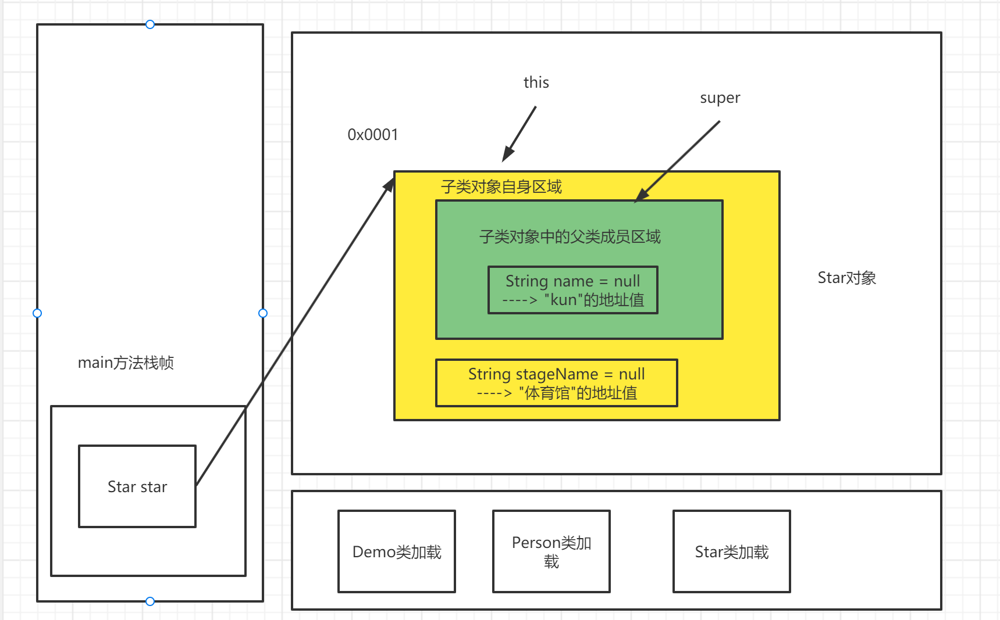

# 封装

学习目标:

- 掌握封装的概念与特点
- 掌握如何使用封装,get,set方法

## 概述

封装（encapsulate）是指将数据及相关操作绑定在一起的一种编程机制，使其构成一个不可分割的独立实体。在Java中，类就是这样一种结构。当然，数据被保护在类的内部，是为了尽可能地隐藏内部的细节，只保留一些对外"接口"使之与外部发生联系。

把抽象出来的数据(属性), 和对数据的操作(方法)封装在一起, 数据被保护在内部, 程序的其他部分只有被授权的操作(方法), 才能对数据进行操作.

**封装的好处**

- 在保护数据的同时，让使用者还能访问到数据，并且无需了解过多细节
- 可以在使用者访问数据时，加以合理的控制

## 封装实现步骤

从实际的语法角度上来说，Java当中的封装是依赖于访问权限修饰符来实现：

1. 完全不需要被外界知道的属性(成员变量)，在类中完全可以私有化.(不能直接修改属性)

2. 提供公共的(public) set方法, 用于对成员变量判断并赋值.

   ``` java
   public void setXxx(类型 参数名){
       // Xxx表示成员变量名
       // 加入数据验证的业务逻辑判断
       成员变量名 = 参数名;
       // 一般使用this关键字完成赋值就可以了。
   }
   ```

3. 提供一个公共的(public) get方法, 用于获取成员变量的值

   ```java
   public XX getXxx(){
   	// 权限判断
   	return xx;
   }
   ```

   

**总之，Getter/Setter方法使成员变量的读、写分离了，从原先的不可控变成了可控。在实际开发中，一个类的多数成员变量都是私有的，有必要时提供方法访问，无必要的则无需提供。**

## 封装练习

基本使用:

定义一个员工Employer类,  类中有3个属性: 姓名 , 年龄 , 工资, 提供一个打印基本信息的public的方法

创建员工对象

```java 
class Employer{
    // 成员变量
    public String name;
    private int age;
    private double salary;
    
    // 打印基本信息的成员方法 
    public void info() {
        System.out.println("员工信息: name:" + name + " 年龄:" + age
                + " 工资: " + salary);
    }
}
```


练习:

对上述例子进行修改, 要求通过无参构造方法去创建对象, 通过set方法对成员变量进行设置值, 要求年龄范围在1-100之间 , 工资在10K-15K范围内, 不在此范围内, 赋予默认值.


## 注意事项

使用private私有化成员变量，并提供方法给外界访问时，需要注意：

1. 成员变量的访问权限应该尽量收紧，尽量私有化，当然有必要时也可以给外界权限直接访问。

2. 对于boolean类型的成员变量来说，Getter方法的名字比较特殊，采用isXxx（Xxx是变量名）的形式。这时如果该boolean类型的成员变量本身就叫isXxx时，就会出现下面情况：

   ``` java
   private boolean isMale;
   private boolean flag;
   
   public boolean isFlag(){
       return flag;
   }
   
   public boolean isMale() {
   		return isMale;
   }
   ```

   那么，在有些时候，就会导致程序误以为成员变量名为`male`的情况发生（实际为`isMale`）。所以在很多Java开发规范中，都明确建议boolean类型的成员变量名不要命名为`isXxx`。

4. Getter/Setter方法的写法显然十分固定，可以直接使用快捷键`Alt + Insert`快速生成。

# 继承

学习目标:

- 继承的基本语法与特点
- 继承中2个类的关系
- 引用数据类型的类型转换
- 继承的层次
- protected访问权限
- 子类对象初始化流程
- 继承中的属性隐藏
- 继承中的方法覆盖
- final关键字的作用

## 引例

根据我们之前学过的知识，完成如下练习：

> 分别定义一个表示人和学生的类：
>
> 1. 人类：有姓名属性，以及吃饭这个行为
> 2. 教师类：有姓名，教师号两个属性，同时有吃饭，教学两种行为
> 3. 学生类：有姓名，学号两个属性，同时有吃饭，学习两种行为

很明显，像成员变量name，方法eat等都是被重复定义的成员。既然有重复，那就想复用它们，现在的需求是：复用类的成员。怎么做呢？

Java中对代码的直接复用依赖于某一个方法，而想要复用类的成员，就必须使用Java中的继承语法。

为什么要复用代码？

> 复用代码，不仅能够减少代码冗余，更重要的是能够更方便地修改代码，可维护性更强。
>
> 复用代码后，同样的代码在多处同时生效。

## 语法定义

基于已存在的类创建新的类，这个新的类会得到已存在的类的成员，并且可以自己添加新的成员，从而让新的类适应新的开发需求。这就是继承。继承的本质是成员的复用。

Java在定义一个类时，可以显式地，直接让它继承另一个类，这就是Java的继承机制，其语法是：

``` java
[访问权限修饰符] class 类名 extends 被继承的类/已经存在的某个类{} 
```

说明： 

1. 这个继承了一个已存在类的类，称之为子类。被继承的类称之为父类。

2. 使用继承extends(扩展)关键字后，子类就获取到了父类的所有成员（成员变量和成员方法）.严格来说，继承只考虑对象相关成员的继承，静态成员我们先暂时不考虑。

3. 子类在继承父类的同时，还可以自己定义新的成员，这叫做子类在父类的基础上进行扩展（所以子类往往比父类的功能更加强大，青出于蓝而胜于蓝。）

4. 子类不能继承父类没有的成员。


## 继承中两个类的关系

### 两个类的命名

在上一节中，我们已经讲到过，被继承的类称之为父类，继承父类的叫做子类。其实还有一些别的叫法，仅供了解。

- 被继承的类主要称之为：

   - **超类（Superclass）**
   - 基类（Base Class）
   

注：

- 需要注意，在外国Java圈中，更流行**超类（Superclass）**的叫法，查看英文文档中，你会很多Superclass。
  
- 继承其他类的类主要称呼有：

   - **子类（Subclass）**
   - 派生类（Derived Class）
   

### 从属关系(重点)

从属关系（relation）上来说，继承中的父子类具有 <font color=red>**"is-a"**</font> 关系。即子类 <font color=red>**"is-a"**</font> 父类。子类可以近似地看成是一个父类，子类可以当作父类来使用.

那么如何理解这句话呢？我们从以下几个角度分析。

- 从直观的逻辑角度解释：
  - Student就是Person
  - Teacher就是Person
  
- 实际代码书写角度解释：

   1. 在正常情况下，创建谁的对象，就用谁的引用接收。
   1. 但是在具有父子类关系的两个类中，存在用父类引用接收子类对象的情况。
   1. 在这种情况下，子类对象被当成了父类对象去使用了。
   1. 即子类可以看成就是一个父类，也就是"is-a"关系。

- 从数据类型的定义角度解释：

   1. 数据类型是 一组数据 + 基于数据的操作
   2. 引用数据类型是 成员变量的集合 + 成员方法的集合
   3. 子类通过继承父类，得到了父类的所有成员，从数据类型上来说，子类就包含了父类的成员，具有了父类的功能。
   4. 子类可以当做父类去使用，也就是子类"is-a"父类。


 <font color=red>**以上，所以说，子类"is-a"关系。**</font>

**注意:**

- 父类能当子类用吗(父类"is-a"子类关系)？
  - 显然不能，子类往往比父类功能要强大，父类不能当成子类使用


## 引用数据类型的类型转换(重点)

子类对象是可以当成父类使用的，从逻辑角度上讲, 因为子类”is-a”父类

但从更具体的语法上来说，这个过程发生了引用数据类型的类型转换

基本数据类型存在类型转换, 引用数据类型同样存在.


### 引用数据类型转换的前提

**===> 继承**

引用数据类型的类型转换必须发生在具有父子关系的两个类之间，如果是没有继承关系的两个类，无法发生类型转换，只会导致编译报错。

换句话说, 继承打破了Java引用数据类型的类型限制, 有了继承, Java出现了引用数据类型的类型转换.

### 转换的是什么？

引用数据类型变量中存储的是对象地址，指向了堆上的对象

但是注意引用类型的转化**只是转换了引用变量本身的类型，而不会影响引用变量所指向的对象。**

```java
// 父类引用指向子类对象
Father fs = new Son();
// 上述代码也可以写成：
Son s = new Son();
Father fs2 = s;
```


### 引用数据类型转换分类

引用数据类型的类型转换跟基本数据类型一样, 分类仍然是：

- 自动类型转换

- 强制类型转换

  

#### 自动类型转换

无需程序员写额外代码，编译器自动完成类型转换。

**自动类型转换的条件：**

- 把子类的引用转换成父类的引用，由于子类"is-a"父类，所以这个过程不需要写额外代码，自动完成转换。

子类引用转换成父类引用，在继承方向上是从下往上的。 所以引用数据类型的自动类型转换也称之为"**向上转型**"。

#### 强制类型转换

需要程序员写额外代码强制完成的类型转换。

**强制类型转换条件(通过编译的条件)：**

- 把父类的引用转换成子类的引用时，显然父类不能随便作为子类使用。这个过程需要写额外代码完成，是强制类型转换。

- 强转额外代码的语法:


``` java
子类类型 子类的对象名 = (子类的类名)父类引用
```

按照族谱一样把父类放在上面，子类处在下面。父类引用转换成子类引用，	在继承方向上是从上往下的。 所以引用数据类型的强制类型转换也称之为"**向下转型**"。

**注意：**

强转相当于把父类对象当子类对象去使用，这在绝大多数情况下是不可能的。所以引用数据类型的强制类型转换想要完成，条件会更加很苛刻, 可能会出现ClassCastException, 类型转换异常。

## 继承的优缺点

这里给出一个继承语法的练习案例，通过案例我们来分析一下继承的优缺点：

> 练习：
>
> 在一款游戏中，我们设计了三种类型的鸭子，这些鸭子有一些共同的属性，也有共同的行为，比如都可以叫，都会游泳等。
>
> 编写程序，描述这些鸭子。
>
> 后来，需求更改了，这些鸭子不能游泳了，但是都会飞，怎么改呢？
>
> 再后来，需求又改了，新增了一种鸭子，但这个鸭子不会飞，又怎么办呢？


- 继承的优点：

  - 继承的出现减少了代码冗余，提高了代码的复用性。

  - <font color=red>**继承的出现，更有利于功能的扩展，提升了程序的可维护性，更好地应对需求变更。**</font>

  - 扩展一点：

     > 继承的出现，对于Java的引用类型而言，弱化了类型的约束力，引用数据类型出现了数据类型转换的概念。
     >
     > <font color=red>**这其实是Java实现面向对象第三个特征——多态的前提。**</font>

- 继承的缺点：
- 子类继承父类必须无条件接收父类的所有成员，是没有选择的。
  
  - 父类中对成员进行修改，会严格体现到每一个子类中，我们不可选择具体哪个子类生效。

注：

当然对于成员方法而言，子类可以在继承父类成员方法之后，进行修改具体实现。称之为<span style=color:red;background:yellow>**"方法的重写"**</span>。

但重写归重写，继承仍然是继承了，没有办法不继承。


## 继承的层次(重点)

### 单继承

我们已经学习过了Java继承的基本语法，extends后面跟一个类名，表示继承了一个父类，那么很自然就会想到一个问题：	

> Java中的一个类，能不能使用extends关键字同时继承多个类呢?

非常简单，我们通过测试发现，这是做不到的。Java的语法规定一个类，在使用extends关键字直接继承某个类时，最多只能继承一个，即**一个类只能有一个直接父类**。（开个玩笑的说法，谁也没有两个亲爹吧？）

像Java这种，只能有一个直接父类，而不能有两个或更多的设计，称之为"单重继承"或者"单继承"。

而像C++当中，一个类可以直接继承多个类，就称之为"多重继承"或者"多继承"。

### 继承层级

虽然直接父类只有一个，但Java中一个类仍然可以有很多个"间接父类"，因为父类可能还有父类。比如A继承B，B又继承了C，那么A的直接父类就是B，间接父类是C。于是就形成了下面几个概念：

1. 祖先类：处在继承顶层的类。
2. 继承层次（hierarchy）：由某个祖先类派生出来的所有类的集合叫做继承层次。
3. 继承链：从某一个子类开始，到其祖先类的路径。

 <span style=color:red;background:yellow>**在Java中定义一个类，如果没有直接通过语法写出继承了Xxx类，那么它的直接父类就是——Object。**</span>

Object类是Java所有类继承层次中顶层祖先类。Java中的每个类，都或直接，或间接的继承了Object。

所以, 我们在创建某个类对象, 调用其方法的时候, Idea给我们提示的时候, 会出现一些不属于该类的方法, 这些方法是哪来的?  ---> 继承自父类Object

**继承层次中需要注意的地方：**

1. 在一条继承链中，总称呼下游类是上游类的子类，不管隔了几层。没有孙子类或者重孙类这种概念。
2. 在一条继承链中的，下游的类总是继承上游类的所有成员，不管隔了几层。
3. 在一条继承链中，下游类总可以看成一个上游类，存在"is-a"关系。
4. 不在同一条继承链中的类，没有任何关系。虽然看起来像"兄弟姐妹"类，但是Java是不讲究血统的。
   - 因为一方面，子类可以自由扩展功能；另一方面，继承来的东西也是可以修改的。
5. 不能循环定义继承。比如A继承B，B继承C，再让C来继承A，这是不行的。
6. 继承链可以无限延伸下去，但是一般来说有个5~6层继承，已经很多了。

## protected访问权限

关于访问权限的概念，我们在面向对象基础时，已经提到过一次了。

但那时，我们还没有继承的概念，所以protected修饰符没有讲解。这里我们来补充讲解一下。

首先，我们回顾一下Java当中类中成员和构造器的四个访问权限等级：

1. private：只能够在同一类中能够访问，私有的，外面谁都不能用。
2. （缺省的）不写任何关键字：同一包中的子类或者其它类能够访问，同包中都可以使用。
3. protected：**不同包的子类能够访问。**
4. public：不同包的其他类能够访问，相当于没有做访问权限。

用表格来描述这个访问权限就是：

|              |            public            |          protected           |           （缺省）           |           private            |
| ------------ | :--------------------------: | :--------------------------: | :--------------------------: | :--------------------------: |
| 同一类中     | <font color=red>**✔**</font> | <font color=red>**✔**</font> | <font color=red>**✔**</font> | <font color=red>**✔**</font> |
| 同一包其他类 | <font color=red>**✔**</font> | <font color=red>**✔**</font> | <font color=red>**✔**</font> |                              |
| 不同包子类   | <font color=red>**✔**</font> | <font color=red>**✔**</font> |                              |                              |
| 不同包其他类 | <font color=red>**✔**</font> |                              |                              |                              |

### 怎么理解不同包子类能够访问

protected关键字的使用定义上，很含糊的说了，protected修饰的成员在不同包的子类中可以访问，但实际上访问的方式仍然可以细分：

1. 不同包的子类中，创建父类对象，用父类对象访问protected成员。
2. 不同包的子类中，创建该类的其他子类对象（"兄弟姐妹对象"），用这个其他子类对象访问父类的protected成员。
3. 不同包的子类中，创建子类对象，用子类对象访问protected成员。

我们可以创建以下Java类，来进行测试操作：

> - 在包名为one的包中创建类：
>   1. public class CurrentClazz，即当前类，是存放protected修饰的成员变量的父类。
>   2. public class SamePackageAnotherClazz，即同包下非子类。
>   3. public class SamePackageSonClazz，即同包下子类。
> - 在包名为another的包中创建类：
>   1. AnotherPackageAnotherClazz，即不同包下非子类。
>   2. AnotherPackageSonClazz，即不同包下子类。

类定义完毕后，就可以逐一测试，能否访问。

### 结论

protected修饰的成员，在同类、同包下是可以随意访问的。

<span style=color:red;background:yellow>**但是在不同包下，必须在子类中，创建子类自身对象，才能够访问它从父类那里继承过来的protected成员，其它方式创建对象都不可以访问。**</span>

---

实际代码中，怎么查看protected成员的访问权限呢？

1. 先看是否同包中访问，只要同包就可以任意访问。
2. 如果是非同包，一定要是子类中，才可以访问。而且必须是<font color=red>**创建子类自身对象**</font>，才可以访问它继承自父类的protected成员。

### 为什么设置protectd访问权限

在面向对象访问权限控制的整个体系中，实际上如果没有继承，那么只需要两个访问权限就足够了：要么是给别人用的public，要么是不给别人用的private。

但是有了继承后，**如果类中的某个成员，非常有价值，我们希望这个成员总是被子类使用，而不会被滥用**，出于保护这样一个成员的目的，protected就有意义了。

被protected修饰的成员，在不同包下（正常情况下，代码在使用时都不会同包），一定能够保证该成员被子类自身所使用：

1. 不能用父类的，创建父类对象访问不到。
2. 不能用"兄弟姐妹"的，创建非自身的其它子类对象，也访问不到。

这样就充分保证了<font color=red>**子类拥有对自己继承的protected成员最大的权限。**</font>想一想，将来有一天，你的财产也总是希望被亲近的人继承吧, 而且给它最大的控制权限吧

---

结论其实还是那句话：不同包下，必须在子类中，创建子类自身对象，才能访问从父类那里继承过来的protected成员。

上述代码还演示了方法重写——修改方法的访问权限，作为了解，后面会详细讲解。

## 继承的限制

在前面，继承的定义中，我们说子类会继承父类的所有成员，那么思考以下问题：

1. 能不能继承父类的私有成员呢？

   首先，直接访问是访问不到的。 <font color=red>**但实际上子类会继承父类的私有成员，之所以不能访问，是因为没有访问权限。**</font>

2. 能不能继承父类的构造器呢？

   首先构造器不能算成员，况且构造方法也不是普通方法，继承过来干嘛呢？构造器是不能被继承的。

3. 能不能继承父类的静态成员呢？

   对于下列代码，我们测试一下：

   ``` java
   public class Demo{
     public static void main(String[] args){
       // 以下访问可行,并且结果确实是10
       System.out.println(Son.a);
     }
   }
   class Father{
     static int a = 10;
   }
   class Son extends Father{
   }
   ```

   首先，<font color=red>**如果子类没有父类中的同名静态成员时**</font>，直接用子类类名点访问，是可以访问到父类中的静态成员的。<span style=color:red;background:yellow>**但这仅意味着子类能够使用父类的静态成员，并不意味着继承！**</span>通常情况下，继承仅考虑普通成员而不考虑静态成员。

## 子类对象的初始化(重点)

现在我们学习了继承的概念，在继承中，子类会继承父类的成员，<font color=red>**使用子类对象可以直接访问父类中继承过来的成员变量的值**</font>。那么问题就来了，在子类对象中既包含继承下来的父类成员变量，也包含子类自己定义的成员变量

子类对象中包含的父类的成员变量也需要赋初值，那么赋初值顺序是怎么样的？

以上问题就是子类对象的初始化问题，即研究子类对象创建时，父类成员变量和子类成员变量的赋值的先后顺序问题。

---

我们通过一个引例，练习来讲解这个问题：

> 1. 创建一个Person类，有name属性和eat方法
> 2. 创建一个Star类，有stageName属性和sing方法
> 3. Star类要继承Person类
> 4. 创建Star类对象，画出这个过程的内存图，描述子类对象初始化的过程





### 子类对象初始化流程

在创建子类Star对象的过程中，首先要考虑的就是类加载。Star这个类肯定是需要进行类加载的，但Star还有父类Person。子类对象能够直接访问父类成员，显然父类成员究竟有哪些，都是些啥，这些信息JVM是需要知道的（不如如何创建？）。

所以：

<span style=color:red;background:yellow>**子类的类加载会触发父类的类加载，并且类加载的顺序是"先父后子"的。**</span>

这里，我们可以总结类加载的时机：

1. 启动main方法
2. 创建对象(首次)
3. 访问类的静态成员(首次)
4. 子类类加载会触发父类类加载（不管子类是何种方式触发类加载）

---


**流程**

1. 父子类加载(先父后子)
2. 创建子类对象
   - 子类对象中会专门开辟一片独立的区域，用来存储父类的成员变量(父类成员区域, 近似看成一个父类对象, 被super关键字指向, 近似看做super指向当前子类对象的父类对象)
   - 子类自身的成员仍会存储在自身对象当中(this指向当前子类对象)
3. 父子类成员赋值(先父后子)
   - 默认初始化
   - 显式赋值
   - 构造代码块赋值
   - 构造器赋值


**原理**

- 成员变量赋值先父后子如何保证?

  - 父类构造器优先于子类构造器执行

- 父类的构造器为什么优先于子类构造器执行?

  - 在**子类构造器或成员方法先调用父类构造器，在执行子类方法的方法体**即可保证先父后子。

  - 如果程序员没有写任何代码, 来完保证先执行父类的构造方法，在执行子类的构造方法称之为**"子类对象的隐式初始化"**
  
  - 如果是通过程序员写代码的方式， 称之为**"子类对象的显式初始化"**

---


### 隐式子类对象初始化

 <font color=red>**在子类对象创建的过程中，父类的构造方法会自动被调用，用来初始化父类中定义的成员变量的值。**</font>

---

在创建上述Star类对象时，我们没有在代码的任何位置，表示将要去调用父类构造器，但实际上父类构造器仍被调用了。这是为什么呢？

在Java的任何构造器当中，如果第一行没有明确的去调用别的构造器（通过this或super关键字）

那么第一行一定隐含了一条语句：

``` java
super();
```

该行语句表示去调用父类的无参构造方法。于是，在子类对象初始化时，就会保证先去执行父类构造方法。这样就能够保证，父类成员变量的赋值一定先于子类。由于，程序员没有写任何代码，这种子类对象的初始化方式，称之为——"子类对象的隐式初始化"。

---

**隐式对象初始化的必要条件：**

1. 父类中有默认的构造方法
2. 子类的构造器中没有显式使用super调用父类的构造方法。

达成上述两个条件，则JVM在初始化子类对象时进行隐式初始化，永远先执行父类的构造方法，顺序为：

1. 最上层的父类（Object）
2. 其他父类（继承链中越处于上流越先执行）
3. 所有父类的构造方法都执行完毕，开始执行子类构造方法


### 显示子类对象初始化

子类对象的隐式初始化是调用父类无参构造方法，所以如果需要给父类成员变量直接赋值是做不到的， <span style=color:red;background:yellow>**所以就需要子类对象的显式初始化。即明确在子类构造器的第一行，用super(参数)，明确指出调用父类的某个构造方法来完成父类成员变量的赋值。**</span>

语法：

``` java
super(参数);
```

> 注意事项：

1. super在构造器中用于表示调用父类构造器时，例如super(参数)，该条语句必须在第一行。
2. this在构造器中用于表示调用自身构造器时，例如this(参数)，该条语句必须在第一行。
3. 显然super、this两个关键字在表示调用构造器时，是绝不可能共存的。


### super关键字

> 什么是super关键字？

上面其实已经说过了，你完全可以直接把super关键字，看成指向当前类的父类"对象"的一个引用。即：

1. this代表当前类的当前对象。
2. super表示当前类的父类对象。

---

super和this的使用几乎没有差别，只不过一个表示子类对象，一个表示父类对象。比较大的区别是：

1. super只能访问父类中有的成员，特殊情况下，当父子类具有同名成员时，可以用super区分。

2. <span style=color:red;background:yellow>**this在当前类中不受访问权限控制，super访问父类成员，受访问权限控制。**</span>

3. this毕竟还是一个引用，指向当前对象，所以可以直接在类中成员方法中输出它。

   > <span style=color:red;background:yellow>**但是super毕竟没有指向对象，无法直接输出它！**</span>

具体的使用可以参考下面表格：

|       |          含义          |           构造器调用            | 成员访问 | 是否受权限控制 |
| ----- | :--------------------: | :-----------------------------: | :------: | :------------: |
| this  |     当前对象的引用     | this(参数)，表示调用自身构造器  |  this.   |       否       |
| super | 父类对象（近似）的引用 | super(参数)，表示调用父类构造器 |  super.  |       是       |


### 练习

分析程序的执行顺序：

``` java
public class Demo {
public static void main(String[] args) {
  PrimaryStudent primaryStudent = new PrimaryStudent(666,888,"hello");
  System.out.println(primaryStudent.psVar);
}
}
class Person {
static {
  System.out.println("Person类加载");
}
{
  System.out.println("Person构造代码块");
}
public Person() {
  System.out.println("Person类的无参构造");
}
}
class Student extends Person {
static {
  System.out.println("Student类加载");
}
{
  System.out.println("Student构造代码块");
}
int sVar;
String sVarString;
public Student() {
  System.out.println("Student类无参构造");
}
public Student(int sVar) {
  System.out.println("Student int构造方法");
  this.sVar = sVar;
}
public Student(int sVar, String sVarString) {
  this(sVar);
  System.out.println("Student int String构造方法");
  this.sVarString = sVarString;
}
}
class PrimaryStudent extends Student {
static {
  System.out.println("PrimaryStudent类加载");
}
{
  System.out.println("PrimaryStudent构造代码块");
}
int psVar = 10;
public PrimaryStudent(int psVar, int sVar, String sVarString) {
  super(sVar, sVarString);
  System.out.println("PrimaryStudent类的 三参构造");
  this.psVar = psVar;
}
}
```

先父后子，父类构造器执行完毕，才能轮到子类。当然父类如果有多个，就从最顶层父类开始。

### 总结

**无论是隐式还是显式子类对象初始化，最终都是为了保证父类构造器先于子类执行。**

<span style=color:red;background:yellow>**总结一下到目前为止，创建对象过程中可能碰到的结构的执行顺序（最全）：**</span>

我们将程序的运行分成两部分：

<font color=red>**第一部分：类加载**</font>

1. 首先程序要从main方法启动，这意味着首先要触发，装有main方法的那个类的类加载。

   类加载过程中，一定要考虑连环触发类加载的情况：

   1. 类中有静态成员变量创建对象，那么一定会触发其它类的类加载。
   2. 该类还有父类，于是触发父类类加载。

2. 类加载这个过程中，静态代码块的代码一定会执行，不要忘记了。

3. 如果有静态成员变量的显式赋值，那么显式赋值和静态代码块，按照代码的书写顺序从上往下执行。

4. 类加载整个程序运行期间只有一次，如有通过继承连环触发类加载，那么顺序是`先父后子`，从最顶层父类开始。

 <font color=red>**第二部分：创建对象**</font>

1. 切记类加载是懒加载，有些类可能等到main方法执行到一半才触发类加载。
   - 这个就要随机应变了，以下步骤，都默认类加载全部结束了。
2. new对象时，首先去找到new对象的构造器，然后观察第一行
   1. 如果它的首行显式地调用了另一个构造器（可能是`this(参数)`，也可能是`super(参数)`）
      - 说明执行的是子类对象的显示初始化
      - 在子类继承链上，按照先父后子的顺序，依次执行初始化，包括成员变量的显示初始化，被调用的构造代码块，以及<font color=red>**被调用的构造方法**</font>(最顶层的父类Object被调用的是其无参构造方法)
      - 最后，在执行该子类的显式赋值和构造代码块后执行构造器
   2. 如果它的首行没有显式调用另一个构造器。
      - 说明执行的是子类对象的隐式初始化
      - 在子类继承链上，按照先父后子的顺序，依次执行初始化，包括成员变量的显示初始化，被调用的构造代码块，以及<font color=red>**无参的构造方法**</font>
      - 最后，在执行该子类的显式赋值和构造代码块后执行构造器

----

总之，先父后子记住，在某一个类中成员变量赋值中，构造器最后去执行。

## 继承中的属性隐藏

### 引例

在上面章节中，我们已经知道，父子类的成员是允许同名的。那么如果父子类属性同名了，那么不使用super区分，直接访问的效果是什么样的呢？

现在我们直接创建子类对象，使用子类引用接收。会发现访问的结果是子类中属性的取值，那么父类中的那个成员变量去哪了呢？首先它肯定是存在的，这一点随便写一个父类成员变量的Getter方法就可以验证了。这说明使用 "对象名点"访问成员变量 这个语法，可能存在一些特殊的机制，接下来我们就来探讨这种机制。

### 对象名.成员变量的访问机制

在研究 <font color=red>**对象名点访问成员变量**</font> 机制时，我们主要探究两个问题：

1. 访问范围：不同情况下，究竟能够访问到对象中的哪些成员变量？根据什么来决定？
2. 访问结果：如果是父子类同名成员变量，那么结果是什么？根据什么来决定？

---

 <font color=red>**对象名点访问成员变量**</font> ，对象的由来，可以有三种方式：

1. 创建父类对象,用父类引用接收，用对象名点访问。
2. 创建子类对象,用子类引用接收，用对象名点访问。
3. 创建子类对象,用父类引用接收，用对象名点访问。


### 属性隐藏

#### 访问范围机制

经过上面的测试，我们可以知道对象名点成员变量，它的访问范围是由 <font color=red>**引用的数据类型**</font> 来决定的。

1. 如果引用是父类类型，那么它的访问范围只有父类（和父类的父类）。
2. 如果引用是子类类型，那么它的访问范围是子类 + 父类（父类如果还有父类也算上）。

---

在Java当中，对象名点访问成员变量的范围是编译器决定的，是一个编译上的概念。编译在检索一个引用是否能够访问到某个成员变量时，存在以下检索机制：

1. 首先编译器会从**引用的数据类型**的那个类中，去查找该成员变量。如果找到了，就直接认为它可以访问。（有权限才行）
2. 如果没有找到，那么就去父类中找。直到找到Object类，如果Object类当中都没有该成员变量，那就会编译报错。

#### 访问结果机制

对象名点成员变量，访问的结果也是由 <font color=red>**引用的数据类型**</font> 来决定的。

1. 如果引用是父类类型，那么它的访问结果一定也是父类中的结果。
2. 如果引用是子类类型，那么它的访问结果一定也是子类中的结果。

#### 总结

综合对象名点访问成员变量的范围和结果，发现：<span style=color:red;background:yellow>**都是根据引用的数据类型来决定的，无需考虑是何种对象。**</span>

注意事项：

1. 父子类中的同名成员变量它们各自有存储的区域，在子类中，父类的同名成员变量被子类同名成员变量隐藏了，称之为"属性的隐藏"。

   但我们仍然可以通过父类中的Getter方法，或者通过super去访问到父类中同名成员变量，当然它们都受访问权限限制。

2. 静态成员变量在父子类中也存在同名的情况，但是它们不是覆盖也不是隐藏，而是互相独立的两个静态成员变量。

   对于下列代码：

   ``` java
   class Person {
       static String nationality;
   }
      
   class Student extends Person {	
       static String nationality;
   }
   ```

   Person类和Student类的静态成员变量国籍分别属于两个类本身，没有所谓继承关系。

   而如果是下列代码：

   ``` java
   class Person {
       static String nationality;
   }
      
   class Student extends Person {
   }
   ```

   Person类和Student类都可以使用Person类的静态成员变量国籍，是共用的关系。

## 继承中的方法覆盖

### 引例

在上一节一样，父子类中的成员方法也是可以同名的。那么我们直接创建子类对象，使用子类引用接收。调用同名方法，会发现访问的结果是子类中方法的行为，那么父类中的那个同名成员方法去哪了呢？还能够访问吗？首先它肯定是存在的，方法不过是方法区的二进制指令合集罢了，类加载时期，装载进方法区，不会物理消失。但 <font color=red>**"对象名点"访问成员方法**</font> 这个语法还是和访问成员变量是有很大区别的， 我们可以写一个public方法，然后在方法中访问同名成员方法，最后测试调用这个public方法，如下：

``` java
public void test() {
 System.out.println("father test");
}
public void invokeFatherTest() {
 this.test();
}
```

注：test是那个同名的成员方法

我们会发现，方法调用的结果仍然体现子类中的方法行为，这就有点意思了。接下来我们就来探讨一下这种 <font color=red>**对象名点访问成员方法**</font> 的机制。

### 对象名.成员方法的访问机制

和前面访问成员变量一样，在研究 <font color=red>**对象名点访问成员方法**</font> 机制时，我们主要探究两个方向：

1. 访问范围，究竟能够访问到哪些成员方法？根据什么来决定？
2. 访问结果，如果是父子类同名成员方法，那么结果是什么？根据什么来决定？

---

首先是 <font color=red>**对象名点访问成员方法**</font> ，对象的由来，可以有三种方式：

1. 创建父类对象,用父类引用接收，用对象名点访问。
2. 创建子类对象,用子类引用接收，用对象名点访问。
3. 创建子类对象,用父类引用接收，用对象名点访问。

#### 访问范围机制

实际上不管是，属性的访问还是成员方法的访问，范围都是一个编译上的概念，所以结果即便不测试也是和，上节中属性的访问范围是一样的。当然，测试后结果仍然是：对象名点成员方法，它的访问范围是由 <font color=red>**引用的数据类型**</font> 来决定的。

1. 如果引用是父类类型，那么它的访问范围只有父类（和父类的父类）。
2. 如果引用是子类类型，那么它的访问范围是子类 + 父类（父类如果还有父类也算上）

#### 访问结果机制

对象名点成员方法，访问的结果就不再是由 <font color=red>**引用的数据类型**</font> 来决定了，而是根据 <span style=color:red;background:yellow>**对象的实际类型**</span> 来决定。

1. 如果对象是一个子类类型，那么即便引用是父类，方法调用也要体现出子类的行为。
2. 反之如果对象是一个父类类型，方法调用的结果就是父类行为。

#### 总结

综合对象名点访问成员方法的范围和结果，发现：

1. 访问范围仍然是要靠 <font color=red>**引用的数据类型**</font> 来决定。
2. <span style=color:red;background:yellow>**但是方法的调用结果，就需要考虑对象的具体类型，是何种对象，就体现出它的行为。**</span>

注意事项：

1. 父子类中一旦存在父子类同名的成员方法，那么只要创建子类对象，在任何位置都无法再直接用对象名.访问到父类成员方法了，这就是继承中的方法的覆盖。
2. 方法的调用之所以体现为覆盖，这是因为方法的调用结果是根据对象的实际类型决定的，和引用没有任何关系。
3. 当然，方法的覆盖不是物理意义上的覆盖，只是方法的访问机制决定的。这个父类中的同名方法，仍然可以使用super关键字去访问到，当然前提是有访问权限。

结合我们前面封装的思想，实际开发中，大多数的成员变量都是私有化的，这意味着使用 <font color=red>**对象名点访问成员变量**</font> 的机会是很罕见的，多数情况下我们都是在调用方法完成各种功能。<span style=color:red;background:yellow>**方法的覆盖是非常重要的知识点，如果说继承是面向对象的核心，那么继承应该就属于方法的覆盖。接下来讲解方法覆盖的语法。**</span>

### 方法的覆盖/重写

方法的覆盖，也叫方法的重写（override），指的是在子类中，能够改写父类成员方法的内容。从形式上表现出来，就是父子类中能够拥有同名的成员方法。

在讲解具体的方法重写的语法和使用之前，我们要先讲解一个注解：`@Override`，就和它的名字一样，这个注解写在子类的方法头上，用于检测子类中的某个方法，是否是父类方法的重写。例如下列代码：

``` java
// 父类方法
public void test(){
System.out.println("father");
}
// 子类方法
@Override
public void test(){
System.out.println("son");
}
```

在实际开发中，我们要求大家，在任何时候，**只要是在做方法的重写，就一定要加上注解**`@Override`，好处是：

1. 能够检测语法，如果因为没加注解，导致将本不是方法重写的方法，误以为是方法重写，将会带来错误。
2. 提升代码可读性，加了该注解的方法一定是重写自父类的方法。

#### 语法

方法的重写的语法要求，对于下列一个成员方法：

``` java
// 成员方法的语法
[访问权限修饰符] 返回值类型 方法名(形参列表){
 //方法体
}
```

1. 子类中重写的方法，访问权限等级，必须至少保持一致，可以更为宽松，但一定不能更严格。

2. 子类中重写的方法，返回值类型必须和原先父类方法的返回值类型，保持兼容。

3. 子类中重写的方法，方法名必须严格保持一致，不能做任何修改。

4. 子类中重写的方法，形参列表必须保持严格一致，不能做任何修改。

5. 方法体的代码，无所谓，可以保持一致，也可以修改。


#### 注意事项

- 父类中私有方法不能被重写（因为没有权限访问，更不谈重写）
- 静态方法在使用现象上，很像是被重写了，但实际上静态方法不能被重写，而是直接是一个新的静态成员。（使用`@Override`注解标记会报错）
- 构造器不能继承，更不能被重写。
- 快捷方式：
  - 直接在子类中，手写出父类方法的名字。看到出现父类方法提示，直接回车即可重写。
  - 使用快捷键`Alt + Insert`，在选项`Override Methods`中，选择重写子类的方法。


#### 方法重写 VS 方法重载

最后，在这里做一个扩展。回想一下我们之前学过的`方法的重载`，它和`方法的重写`语法上有什么区别呢？

|                | 方法的重载（overload） |               方法的重写（override）               |
| :------------: | :--------------------: | :------------------------------------------------: |
|  发生的类不同  |      必须在同类中      |      必须发生在父子类之间，肯定不是同一个类中      |
|     方法名     |      **必须相同**      |                    **必须相同**                    |
|    参数列表    |      **必须不同**      |                    **必须相同**                    |
| 访问权限修饰符 |   **不影响，无所谓**   | 子类方法的访问权限，不允许更严格（可以一致或宽松） |
|   返回值类型   |   **不影响，无所谓**   |      子类方法返回值类型保持兼容，不用完全一致      |
|      异常      |   **不影响，无所谓**   |          **重写的方法不能抛出更多的异常**          |


#### 练习

读程序

```java
public class Demo {
    public static void main(String[] args) {
        Son s = new Son();
        Son s2 = new Son(300);
        Father fs = new Son();
        Father f = new Father();
    }
}

class Father {
    int num = 100;

    public int getNum() {
        return num;
    }

    public Father() {
        // 该行在执行时,如果创建的是子类对象,
        // 那么子类的任何赋值手段都没有执行,那子类中的num一定是0
        System.out.println(getNum());
    }
    
}

class Son extends Father {
    int num = 200;

    @Override
    public int getNum() {
        return num;
    }

    public Son() {
        super();
    }

    public Son(int num) {
        this.num = num;
    }
}
```


## final关键字

final有最终的、最后的意思。它是一个修饰符，可以用来修饰：

1. class类
2. 方法
3. 变量（包括成员变量、静态成员变量和局部变量）

它修饰不同结构时含义是不同的，下面详细了解一下。

### final修饰类

final修饰类时，表示最后的类，最终的类。即表示这个类不能被继承。

语法：

``` java
[访问权限修饰符] final class 类名{
//类体
}
```

说明：

- 思考：什么样的类需要设置成final？

   不需要，不想要被子类继承的类，才需要设置为final修饰。当你认为当一个类的设计已经足够完善，功能足够强大了，不需要再让子类去扩展它了。这时出于安全的考虑，就可以将一个类设置为final。这样类中成员，既不会被继承，更不会被修改。

- 正常情况下，我们很少会主动把一个类设置成final，因为没有太多的必要性。实际开发中，也要慎重将一个类设置final。

- 常见的final修饰的类，都在JDK的源码当中。比如四类八种基本数据类型的包装类、Void、String、System、Scanner等等。

### final修饰方法

final修饰方法表示最后的方法，最终的方法，表示该方法无法被重写 <span style=color:red;background:yellow>**（但是仍然可以被继承）**</span>。

语法：

``` java
[访问权限修饰符] final 返回值类型 方法名(形参列表){
//方法体
}
```

说明：

- final修饰成员方法，表示该方法无法被重写，但是仍然是可以继承的。
- 什么样的成员方法应该设置为final呢？
   1. 方法的设计已经比较完善，不需要子类进行修改了，子类只需要乖乖继承，使用父类的实现即可。比如一旦修改就会导致问题、bug等时，就可以设置为final修饰。
   2. 即便是父类的方法不是很完善，但只要是希望子类不要改写方法都可以这么做。（要么你就用，不爽你就自己实现一个）
- 日常开发，程序员还是比较少见有需要把方法设置成final修饰的。同样比较多见于JDK源码中，比较常见的有：像Object类中的getClass()方法.

---

注意：

并不是随便拿一个方法都能用final修饰的，比如：

1. private方法，本来就无法重写，不需要多此一举。（可以修饰，但是会报警告）
2. static方法，本来就无法重写，不需要多此一举。（可以修饰，但是会报警告）
3. 构造方法，不能被继承，更不能重写，加final修饰会编译报错。

### final修饰变量

final修饰变量，表示最后的变量，最终的变量，即表示常量。（表示在整个程序期间，值不会再变了）

**final修饰变量时可以修饰局部变量，成员变量，静态成员变量。**总体上来说，要注意下述三个细节：

- 常量的分类
  - 字面值常量：1，2.0，3，"hello"等
  - 自定义常量： **被final修饰的变量，就是自定义常量。**

自定义常量的命名：单词全部大写，两个单词之间用"_"隔开。

自定义常量的命名规范，不要求严格遵守，因为即便是JDK中的源码也没有百分百遵守。从实际开发角度出发， **建议成员静态常量，即final修饰静态成员变量时，遵守命名规范，其它常量随意。**

- 自定义常量，不会更改变量的存储位置，生命周期，使用方式等等。唯一改变就是值从能改变，变成不能改变。

   - 成员变量 ----> 成员常量
   - 局部变量 ----> 局部常量

- final修饰变量时，可以修饰基本数据类型变量，也可以修饰引用数据类型。

   - 修饰基本数据类型时，很容易理解，值不变。
   - **修饰引用数据类型时，修饰的是引用而不是对象，表示引用中存储的地址成为一个常量，不可更改**。这意味着引用指向的对象不可更改了，不能再指向一个新的对象了。但对象中成员变量的取值仍是可以修改的。（对象的状态仍可变）

   


接下来，分情况讨论final修饰变量。

#### 修饰局部变量

我们以方法中的局部变量为例子，方法中的局部位置有两个：

- 方法体：
  - 方法体中用final修饰局部变量，表示该变量一旦声明并初始化赋值，就不可再修改它的取值了。
  - 语法上，直接使用final修饰即可。
- 方法的形参列表中：
  - 形参用final修饰后，不是表示该方法只能传入常量，而是实参一旦传入后就无法在方法体中修改了。
  - 语法上，直接使用final修饰即可。

**注意：**

final修饰局部变量后，会变成一个局部常量。仍然在方法栈帧中创建存储，随着方法同生共死，除了值不能变，没有其它区别。

#### 修饰成员变量

final修饰成员变量表示该成员变量变成了一个常量，它在内存中的位置，生命周期，使用方式等都不会改变。

语法：

``` java
[访问权限修饰符] final 数据类型 变量名;
```

如果直接在类中成员位置，写上述语法定义成员"常量"，肯定会报错。这是因为默认值不能当成final修饰成员变量的取值，必须 <span style=color:red;background:yellow>**（在创建对象过程中）**</span>显式明确的给出一个值，而且这个值一旦给出就不可更改了。也就是说， <span style=color:red;background:yellow>**成员常量的赋值，有且必须有一次。**</span>目前我们给成员变量的赋值方式还有（除了默认初始化）：

1. 显式赋值
2. 构造代码块赋值
3. 构造器赋值

**以上三种方式，选择其一即可，而且也必须，也只能选择其一。其它对象创建完毕后的赋值方式都不行。**

注：如果依赖构造器赋值，必须保证类的每个构造器都能完成成员变量的赋值，否则会编译报错。（想一想为什么？）

下列代码就是不正确的，因为如果无参创建对象，age这个常量就没值。

构造器赋值final成员常量

``` java
final int age;
public Student(){}
public Student(int age){
  this.age = age;
}
```

---

最后思考： **成员"常量"是不是真正意义上的常量?**
 不是，因为成员"常量"属于对象，每个对象可能都有自身的常量取值，完全可能不同，而真正意义上的常量，像Math.PI(圆周率)这种，是肯定不会因为创建对象而产生不同的。所以实际开发中，成员常量是很少见的。
 <font color=red>**假如我们希望得到一个真正意义上的常量，在类的整个全局它的值都独一份，它应该是final修饰的静态成员变量。**</font>

#### 修饰静态成员变量

final修饰静态成员变量表示一个静态的"常量"，在<span style=color:red;background:yellow>**类的全局仅有一份**</span>，所以final修饰静态成员变量，也称之为<font color=red>**"全局常量"**</font>。它是一个真正意义上的常量，不会因为创建对象而更改，实际开发中的常量多使用它。

语法：

``` java
[访问权限修饰符] static final 数据类型 变量名;
```

和final修饰成员变量一样，全局常量的取值也不能依赖于默认值，必须 <span style=color:red;background:yellow>**（在类加载过程中）**</span>明确一个值。这样静态成员变量的赋值方式还有（除去默认初始化）：

1. 显式赋值
2. 静态代码块

**以上两种赋值方式，必须且只能选择其一。其他的赋值方式，比如在创建对象过程中的赋值方式，都是不可以的**

---

注意：

1.  final static 还是 static final 实测下来，都是可以的，根据个人习惯使用即可。
2.  final修饰静态成员变量是一个全局常量，不会害怕外界访问和修改。所以在很多时候，它的访问权限修饰符都是public的。
3.  如果使用静态代码测试类加载，那么访问类的全局常量，有些场景是不完整的类加载的, 不是完整的类加载,静态代码块没有执行。（感兴趣自己测试一下，作为锻炼动手能力的小demo）

#### 修饰引用数类型

前面已经提到过了，final修饰引用数据类型的变量，表示引用不能指向新的对象， 但是对象的状态是可以被改变的。

语法：

``` java
final 类名 对象名 = new 类名(参数);
```

注：final只能修饰引用，所以它不能去修饰匿名对象。下面代码是不允许的：

```java
final new Student();
```


# 多态

学习目标:

- 掌握多态的定义
- 掌握多态的使用
- 了解多态的优缺点
- 掌握引用数据类型的类型转换
- 掌握instanceof关键字

## 概述

### 基本概念

> 什么是多态（**polymorphic**）呢？

从字面意义上理解，同一个事物，在不同的时刻/情况表现出不同的状态，就可以称之为多态。

在Java的多态当中，多态指的是：

1. 同一种事物：同一个引用（即父类的引用）
2. 不同的情况：指向不同的对象（不同的子类对象）
3. 不同的状态：调用同名方法会体现出不同的行为

 总结来说，Java中的多态指的是，同一个父类引用指向不同子类对象时，调用同名成员方法，根据指向实际对象的不同，得到的行为也会随之不不同。

练习:

定义一个父类Phone, 3个子类Huawei, XiaoMi, Iphone去模拟多态场景.

### 多态的发生条件

根据上述定义，总结一下Java中多态发生的条件：

1. 必须存在继承，多态一定发生在父子类之间。
2. 必须存在方法重写，不同的子类需要重写父类中的同名方法。
3. 必须存在父类引用指向子类对象

### 不能发生多态的场景

将上述条件反转一下，自然就得到了不能发生多态的场景：

1. 不能继承的类，即final修饰的类。一个final修饰的类都没有子类，多态肯定和它无缘。
2. 不能重写的方法，不能重写也没有多态。不能重写的方法有：
   1. final修饰的方法，final限制了重写
   2. static方法，不参与继承和重写。
   3. private方法，没有权限重写。
   4. 构造方法，不能继承。
3. 不写代码用父类引用指向子类对象，同样没有多态。（这一点就需要手动完成了，看程序员用不用）

## 多态的访问特征

<span style=color:red;background:yellow>**当父子类出现同名成员（变量或方法）时，使用多态的形式访问（多态的形式指：用父类引用指向子类对象，然后用引用名访问成员）时的访问特征。**</span>

### 成员变量	

<font color=red>**成员变量的访问是没有多态现象的，父子类存在同名成员变量，表现出属性的隐藏。**</font>

用一句话来总结，对象名点成员变量的访问特征：

>  <span style=color:red;background:yellow>**编译时（访问范围）看左边，运行时（访问结果）还看左边。**</span>

成员变量描述的是对象的属性或者外貌特征，把子类对象赋值给父类的引用，就相当于给子类对象披上了一个父类类型马甲。这样在外界看来，这时候的子类就变成了父类。总之，还是这句话：编译时看左边，运行时看左边。

### 成员方法

多个子类同时重写了父类中的一个方法，并出现父类引用指向不同子类对象，并且用对象名点调用同名方法时，方法的调用结果就体现出多态的特点。

用一句话来总结，对象名点成员方法的访问特征：

>  <span style=color:red;background:yellow>**编译（访问范围）看左边，运行时（调用结果）看右边。**</span>

电视机的案例，就很适合来解释方法调用的多态性。

> 我去商场买了一台一万多的小米智能电视机，功能十分丰富，很强大。
>
> 对于这台电视机而言，我需要使用遥控器才能操控，换句话说，只有遥控器上提供的功能我们才能使用。
>
> - 假如电视机上仅有开关机按键，那我们就只能做开关机的操作。
> - 即便是电视机本身功能再丰富，没有遥控器的支持，我们也做不了什么。
>
> **将这个案例转移到Java中  >>>>>>  子类对象就是一台功能强大的电视机，父类引用就是功能受限的遥控器**
>
> 子类对象本身可能是十分强大，但父类引用中没有的方法也访问不到（父类引用限制了子类对象的方法访问范围）
>
> 但是即便是一个只有开关机的遥控器，小米智能电视机的开关机也做得足够炫酷。  这就是具体方法的实现，要看具体对象的类型。

 <font color=red>**总之，还是那句话：编译时看左边，运行时看右边**</font>

## 多态的优缺点

我们通过一个案例来理解多态的优缺点：

> 科学家要收集动物的叫声去研究，先要收集猫，狗两种动物的叫声研究。随后又扩展到其它动物，最后又需要研究人类。

我们可以先定义一个顶层父类Animal作为父类，然后定义具体动物类：猫和狗。

假如收集每种动物的叫声研究，都需要写一个方法，显然过于麻烦，程序扩展性也太差了。所以我们可以这么做：

1. 写一个方法来收集研究动物的叫声，方法的形参不写具体动物类，而写顶层祖先类：Animal。然后在方法体中，调用叫的方法即可。
2. 这样该方法在调用传参时，就可以Animal不同的子类对象了。这仍然是一个父类引用指向子类对象

这就是多态一个基本的使用案例，当传入方法不同的子类对象时，方法执行时就会根据不同的具体对象类型，来决定行为。

### 优点

从这个案例，我们其实就可以大致总结多态的优点了：

1. 要实现多态必须要继承，而继承提高了代码复用率，提升了程序的可维护性。（继承保证）
2. 有了多态后，用父类引用指向不同子类对象，只需要调用同名方法，就能自动根据不同子类对象，得出不同的行为。这大幅度简化了代码，提升了程序的扩展性。（多态保证）

> 这里讲一个形象的案例：
>
> 假如你做一个游戏，游戏中有很多角色，角色们都能释放技能，但技能各不相同。如果没有多态，那就必须逐一调用方法来释放不同的技能，但是有了多态只需要调用技能完事，程序会自动根据不同的角色对象，释放出不同的技能。
>
> ```java
> // 没有多态时：	
> 角色1引用.技能();
> 角色2引用.技能();
> 角色3引用.技能();
> 角色4引用.技能();
> // 有了多态后：
> 角色父类引用.技能();
> ```


### 缺点

多态肯定是有缺点的，而且很明显。由于多态中，使用父类引用指向子类对象，父类引用限制了子类对象的功能，这意味着：	

- 子类独有的成员是无法使用父类引用访问的。

**而一旦你必须在这时候访问子类独有成员的话，这就需要把父类类型引用，再转换回子类类型的引用，从继承的方向上，这是从上到下的，称之为"向下转型"。之前我们讲过，这属于强制类型转换。**

但是强转十分危险，稍有不慎就会导致程序异常，下面我们详细分析引用数据类型的强制类型转换。

## 引用数据类型的强制类型转换

**思考：**
**方法的实参数据类型，需要和方法的形参数据类型保持一致吗？**

不需要，存在数据类型的自动类型转换

- 在学习基本数据类型参数时：
  - 如果方法的实参数据类型,可以自动类型转换到形参数据类型
  - 那么该实参变量就允许传入方法
- 将上述原则扩展到引用数据类型参数，也是可以的：
  - 如果方法的实参传入的对象，可以向上转型到形参数据类型, 那么该实参对象就允许传入方法
  - 如果方法的形参数据类型是一个父类类型，那么也允许传入它的子类对象
  - 方法的传参可以向上转型，方法的返回值类型也是可以的


父类的引用转换成子类的引用，在继承链中属于向下，属于"向下转型"。编译器默认不允许，需要显式地写代码完成类型转换。

语法：

``` java
子类类名 对象名 = （子类类名）父类引用;
```

当然上述语法不是乱写地，向下转型是有条件的。

### 前提

**发生的前提:**

-  必须将父类引用转换成它的子类引用，如果不是转换成它的子类引用，会编译报错。

**成功的前提:**

- 强转后的引用类型必须能够真正的指向该对象, 即强转后的引用的类型必须是该对象的类型或者其父类型

**解释说明:**

- 父类引用指向的真实对象的类型，就是要强转成的子类类型的对象。

  1. 比如我先做了一次自动转换，这时父类引用fs指向的实际对象就是Son子类对象

     ``` java
     Father fs = new Son();
     ```

  2. 那么做强转，将fs引用，强转回Son类的引用，是完全可以的。

     ``` java
     Son s = (Son)fs;
     ```

  3. 这种强转的形式还是比较好理解的，本质上其实是一次"物归原主"，Son对象本身就该是Son引用指向的，强转回去就不会出错。

  4. 假如Father还有一个子类Son2，那么将fs强转成Son2引用，虽然编译不会报错，但运行一定会出错。

- 父类引用指向的真实对象的类型，就是要强转成的子类类型的子类对象。

  1. 先假设有一个三层的继承体系：

     ``` java
     class Father{}
     class Son extends Father{}
     class Grandson extends Son{}
     ```

  2. 然后做一次自动类型转换，这时父类引用其实指向的是"孙子类"对象。

     ``` java
     Father fs = new Grandson();
     ```

  3. 那么做强转就有了两个选项，其中将fs强转成Son引用，就符合父类引用指向的真实对象的类型，就是要强转成的子类类型的子类对象。

     ``` java
     Son fs1 = (Son) fs;
     Grandson fs2 = (Grandson) fs;
     ```

  4. 这种场景实际开发中，不多见，但也要知道。

---

如果看完上面的，你还似懂非懂，那就看下图再去理解一下：


 <font color=red>**说明：**</font>

- Grandson对象有三个引用都可以指向它，Father、Son、Grandson
- 那么假如Father引用指向它时，父类引用Father就可以强转为Son或者Grandson引用。
- Son对象有两个引用可以指向它，Son、Father
- 那么假如Father引用指向它时，父类引用Father就可以强转为Son

**所以强转能够成功的前提条件是：引用所指向的真实对象，必须是强转后的引用能够指向的对象。所以可以是强转后的引用的类型的对象或者子类对象**

### instanceof关键字

`向下转型`是一种强转，它成功的条件相对比较苛刻。在操作之前，要先慎重考虑。

强转失败会导致程序抛出异常：`ClassCastException`，导致程序终止执行。正是由于强转的条件苛刻，而且失败后果很严重，所以Java当中提供了检测手段，来保障强转的安全性。需要使用关键字： <span style=color:red;background:yellow>**instanceof**</span>

语法：

``` java
引用名 instanceof 类名
```

上述语法返回一个boolean类型值：

1.  <span style=color:red;background:yellow>**true表示该引用指向的对象，是后面类名的一个对象或者子类对象。**</span>
2.  反之，false则表示不是。
3.  <span style=color:red;background:yellow>**当引用指向null时，使用该语法，结果会直接返回false。**</span>

显然，无论引用指向的对象，是后面类名的对象还是子类对象，都符合强转成功的条件。普遍情况下，可以直接将上述语法直接写在if判断中，判断结果是true后，就可以放心大胆做强转处理了。

### 总结

引用数据类型要成功"向下转型"，完成强转条件是很苛刻的，实际开发中，先慎重考虑是否真的需要强转。然后在做强转之前，也需要使用`instanceof`关键字判断，保障安全性。麻痹大意，导致抛出`ClassCastException`异常，就会很难受了。

## 多态练习

通过以下案例，理解Java的多态现象。

``` java
public class Demo {
    public static void main(String[] args) {
        Father fs = new Son();
        System.out.println(fs.age);//48
        fs.teach();//我会教C++
        //fs.playGame(); 不能打游戏，因为父类没这个成员
        Son son = (Son) fs;
        System.out.println(son.age);//28
        son.playGame();
    }
}

class Father {
    int age = 48;
    public void teach(){
        System.out.println("我要教Java");
    }
}
class Son extends Father {
    int age = 28;
    public void playGame(){
        System.out.println("喜欢玩大乱斗！");
    }
    @Override
    public void teach() {
        System.out.println("我会教C++");
    }
}
```

大家课下看看，琢磨琢磨语法也就差不多了，不用深入考究。


