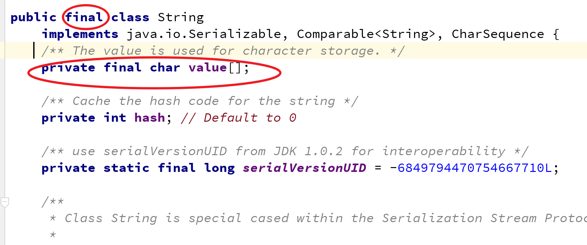

[TOC]

学习目标:

- 熟悉String构造方法
- 掌握String特点
- 熟悉String常用API
- 掌握可变长字符串的使用

# String概述

## 基本介绍

基本介绍

- 一个字符串是由多个字符组成的一串数据(字符序列,字符数组)

- String类代表字符串,Java 程序中的所有字符串字面值（如 "abc" ,"你好","の"）都作为此类的实例实现

- 在java.lang包下,是java核心类,最常用类,但是不属于基本数据类型,引用类型

- String类提供了字符串表示、比较、查找、截取、大小写转换等各种针对字符串的操作

## 构造方法

- 空字符串""
- byte[] -----> String
- char[] -----> String 

```java
  //空字符串 ""  
  public String()  

  //利用字节数组，创建字节数组所表示的字符串
  // 1. 字符 -> 数值形式  'a' -> 97
  // 2. 所以可以用多个字节值，表示多个字符——>即字符序列 public
  String(byte[] bytes)

  //利用字节数数组的一部分，创建字符序列, 从byte数组的offset开始的length个字节值
  public String(byte[] bytes,int offset,int length)

  //利用一个字符数组创建字符数组，代表的字符序列
  public String(char[] value)

  // 创建value字符数组中，从第offset位置开始的count个字符，所代表的字符串对象
  public String(char[] value,int offset,int count)
    
  //知道即可
  public String(String original)  

```


Demo 

```java 
package _14string.com.cskaoyan._01introduction;

/**
 * @description:
 * @author: 景天
 * @date: 2022/10/11 10:25
 **/
/*
String 构造方法
 */
public class Demo {
    public static void main(String[] args) {
        //   //空字符串 ""
        //  public String()
        String s = new String();
        System.out.println("s = " + s);
        //  //利用字节数组，创建字节数组所表示的字符串
        //  // 1. 字符 -> 数值形式  'a' -> 97
        //  // 2. 所以可以用多个字节值，表示多个字符——>即字符序列 public
        //  String(byte[] bytes)
        byte[] bytes = {97, 98, 99, 100};
        String s1 = new String(bytes);
        System.out.println("s1 = " + s1);

        //  //利用字节数数组的一部分，创建字符序列, 从byte数组的offset开始的length个字节值
        //  public String(byte[] bytes,int offset,int length)
        String s2 = new String(bytes,0,2);
        System.out.println("s2 = " + s2);
        //  //利用一个字符数组创建字符数组，代表的字符序列
        //  public String(char[] value)
        char[] chars = {'h', 'e', 'l', 'l', 'o'};
        String s3 = new String(chars);
        System.out.println("s3 = " + s3);

        //  // 创建value字符数组中，从第offset位置开始的count个字符，所代表的字符串对象
        //  public String(char[] value,int offset,int count)
        //
        //  //知道即可
        //  public String(String original)
        String zs = new String("zs");
        System.out.println("zs = " + zs);

    }
}

```


# String特点(重点)

## String对象不可变

对象一旦被创建后，对象所有的状态及属性在其生命周期内不会发生任何变化。

1.请键盘录入一个任意字符串s，并用一个temp字符串引用也指向它
这个时候修改temp字符串的内容，请问s字符串的内容会随之改变吗？

```java 
package _14string.com.cskaoyan._02feature;

import java.util.Scanner;

/**
 * @description:
 * @author: 景天
 * @date: 2022/10/13 11:50
 **/
/*
请键盘录入一个任意字符串s，并用一个temp字符串引用也指向它
这个时候修改temp字符串的内容，请问s字符串的内容会随之改变吗？
 */
public class Demo {
    public static void main(String[] args) {
        // 创建Scanner对象
        Scanner scanner = new Scanner(System.in);
        // 键盘接收nextLine   -- > s
        String s = scanner.nextLine();
        // temp 指向
        String temp = s;
        // 更改s内容
        temp += "aaa";
        // 打印
        System.out.println("temp = " + temp);
        System.out.println("s = " + s);

    }
}

```


**原因与本质**

- String是一个final类,不能被继承, 代表不可变的字符序列
- 字符串是常量,用双引号引起来,他们的值在创建之后不可更改
- String对象的内容是存储在字符数组value[ ]中的




## 字符串常量池

字符串的分配和其他对象分配一样，是需要消耗高昂的时间和空间的，而且字符串使用的非常多

JVM为了提高性能和减少内存的开销，在实例化字符串对象的时候进行了一些优化：

**使用字符串常量池。**

首先要明确，Java的双引号引起来的字面值常量字符串，它们都是对象。这些对象比较特殊，程序在编译时期就能确定它们的值

<span style='color:red;background:yellow;font-size:文字大小;font-family:字体;'>**每当创建字符串常量对象时，JVM会首先检查字符串常量池，如果该字符串对象引用已经存在常量池中，那么就直接返回常量池中的实例引用。如果字符串对象引用不存在于常量池中，就会实例化该字符串并且将其引用放到常量池中。**</span>


```java
// 当常量池中已有字符串对象的引用时,不会在堆上再创建, 而使用同一引用
String s1 = "abc";
String s2 = "abc";
```


### String两种实例化方式

两种方式

- 直接赋值 String s = "abc"
- 构造方法 String s = new String("abc")


第一种 先直接赋值 再构造

```java 
String s = "abc";
String s1 = new String("abc")
```


第二种 先构造 再直接赋值

```java
String s1 = new String("abc")
String s = "abc";
```


总结:

- 先String s = new String("abc"), 再String s1 = "abc".  new String 的时候会创建2个对象, 直接赋值的时候, 直接用的是常量池的引用
- String s1 = "abc", 再String s = new String("abc"),  直接赋值的方式会创建一个对象, new String的时候会创建1个对象

### 字符串常见问题与练习

#### 字符串比较

```java
String s1 = new String("hello");
String s2 = new String("hello");
System.out.println(s1 == s2);
System.out.println(s1.equals(s2));

String s3 = new String("hello");
String s4 = "hello";
System.out.println(s3 == s4);
System.out.println(s3.equals(s4));

String s5 = "hello";
String s6 = "hello";
System.out.println(s5 == s6);
System.out.println(s5.equals(s6))
```


String中重写的equals方法


#### 字符串拼接

```java
String s1 = "Hello";
String s2 = "Hello";
String s3 = "Hel" + "lo";
String s4 = "Hel" + new String("lo");
String s5 = new String("Hello");
String s7 = "H";
String s8 = "ello";
String s9 = s7 + s8;
          
System.out.println(s1 == s2);// true
System.out.println(s1 == s3);// ?
System.out.println(s1 == s4);// false
System.out.println(s1 == s9);// false
System.out.println(s4 == s5);// false

```


**进行字符串拼接的时候有2种情况**

- 当参与字符串拼接对的2个字符串,只要有1个引用变量的形式出现时,则会在堆上创建新的字符串对象.
  - 原因是因为参与了运算,无法在编译期确定其值,就不能在编译时期加入常量池
- 只有参与字符串拼接的2个字符串都是字面值常量的时候
  - 如果常量池中已有该字符串对象的引用,则返回常量池中的引用
  - 如果常量池中没有,则在堆上创建,并把引用放入常量池

# String API

## 判断功能

```java
用来比较字符串的内容，注意区分大小写
boolean equals(Object obj)
    
忽略字符串大小写比较字符串内容，常见用于比较网址URL
boolean equalsIgnoreCase(String str)
    
判断当前字符串对象是否包含，目标字符串的字符序列 
boolean contains(String str)
    
判断当前字符串对象，是否已目标字符串的字符序列开头
boolean startsWith(String str)
    
判断当前字符串，是否以目标字符串对象的字符序列结尾，常用于确定文件后缀名格式
boolean endsWith(String str)
    
判断一个字符串，是不是空字符串 
boolean isEmpty()

```


## 获取功能

```java 
获取当前字符串对象中，包含的字符个数 "abcd"
int length()  
    
获取字符串对象代表字符序列中，指定位置的字符 从0开始"abcd"
char charAt(int index) 
    
在当前字符串对象中查找指定的字符，如果找到就返回字符，首次出现的位置，如果没找到返回-1
也可以填字符   "abcdb"
int indexOf(int ch) 
    
指定从当前字符串对象的指定位置开始，查找首次出现的指定字符的位置，(如果没找到返回-1)
可以填入字符
int indexOf(int ch,int fromIndex) 
    
查找当前字符串中，目标字符串首次出现的位置(如果包含)，找不到，返回-1
这里的位置是指目标字符串的第一个字符,在当前字符串对象中的位置  "abcdefg"
int indexOf(String str) 

指定，从当前字符串对象的指定位置开始,查找首次出现的指定字符串的位置(如果没找到返回-1)
这里的位置是指目标字符串的第一个字符,在当前字符串对象中的位置
int indexOf(String str,int fromIndex) ，

返回字符串，该字符串只包含当前字符串中，从指定位置开始(包含指定位置字符)到结束的那部分字符串  "abcdef"
String substring(int start)   
    
返回字符串，只包含当前字符串中，从start位置开始(包含)，到end(不包含)指定的位置的字符串  [ , )
String substring(int start,int end) 


```

Demo 

```java 
package _14string.com.cskaoyan._03api;

/**
 * @description:
 * @author: 景天
 * @date: 2022/10/13 15:58
 **/
/*
获取功能
 */
public class Demo2 {
    public static void main(String[] args) {
        String s = "abcdef";
        // 获取当前字符串对象中，包含的字符个数 "abcd"
        //int length()
        //
        //获取字符串对象代表字符序列中，指定位置的字符"abcd" 从0开始
        //char charAt(int index)
        System.out.println("s.charAt(0) = " + s.charAt(0));
        //在当前字符串对象中查找指定的字符，如果找到就返回字符，首次出现的位置，如果没找到返回-1
        //也可以填字符   "abcd"
        //int indexOf(int ch)
        //
        //指定从当前字符串对象的指定位置开始，查找首次出现的指定字符的位置，(如果没找到返回-1)
        //可以填入字符
        //int indexOf(int ch,int fromIndex)
        //
        //查找当前字符串中，目标字符串首次出现的位置(如果包含)，找不到，返回-1
        //这里的位置是指目标字符串的第一个字符,在当前字符串对象中的位置  "abcd"
        //int indexOf(String str)
        System.out.println("s.indexOf(\"ef\") = " + s.indexOf("ef"));

        //指定，从当前字符串对象的指定位置开始,查找首次出现的指定字符串的位置(如果没找到返回-1)
        //这里的位置是指目标字符串的第一个字符,在当前字符串对象中的位置
        //int indexOf(String str,int fromIndex) ，
        //
        //返回字符串，该字符串只包含当前字符串中，从指定位置开始(包含指定位置字符)到结束的那部分字符串  "abcdef"
        //String substring(int start)
        System.out.println("s.substring(1) = " + s.substring(1));

        //返回字符串，只包含当前字符串中，从start位置开始(包含)，到end(不包含)指定的位置的字符串  [ , )
        //String substring(int start,int end)
        System.out.println("s.substring(1, 3) = " + s.substring(1, 3));
    }
}

```


课堂练习：
	1：遍历获取字符串中的每一个字符
	"abc001DEF"
	2：统计一个字符串中大写字母字符，小写字母字符，数字字符出现的次数。(不考虑其他字符)

```java
package _14string.com.cskaoyan._03api;

/**
 * @description:
 * @author: 景天
 * @date: 2022/10/13 16:10
 **/
/*


课堂练习：
	1：遍历获取字符串中的每一个字符
	"abc001DEF"
	2：统计一个字符串中大写字母字符，小写字母字符，数字字符出现的次数。(不考虑其他字符)
 */
public class Ex2 {
    public static void main(String[] args) {
        // 定义字符串
        String s = "abc001DEF";
        // 定义3个计数器
        // digitalCount
        int digitalCount = 0;

        // upperCount
        int upperCount = 0;

        // lowerCount
        int lowerCount = 0;

        // 循环
        for (int i = 0; i < s.length(); i++) {
            char c = s.charAt(i);
            // a-z 小写 A-Z 大写 0-9数字
            // 计数器+1
            if (c >= 'a' && c <= 'z') {
                lowerCount++;
            }
            else if (c >= 'A' && c <= 'Z') {
                upperCount++;
            }else {
                digitalCount++;
            }
        }

        // 循环结束
        // 输出结果
        System.out.println("数字:"+digitalCount);
        System.out.println("大写:"+upperCount);
        System.out.println("小写:"+lowerCount);

    }
}

```


## 转换功能

```java
获取一个用来表示字符串对象字符序列的，字节数组
byte[] getBytes()
    
获取的是用来表示字符串对象字符序列的，字符数组
char[] toCharArray() 

    
把字符数组转换成字符串
static String valueOf(char[] chs)

把各种基本数据类型和对象转换成字符串  100---> "100"
static String valueOf(int i/double...)


把字符串全部转化为小写
String toLowerCase() 
    
把字符串全部转换为大写
String toUpperCase()

字符串拼接，作用等价于 + 实现的字符串拼接
String concat(String str) 

```

```java
package _14string.com.cskaoyan._03api;

import java.util.Arrays;

/**
 * @description: 转换功能
 * @author: 景天
 * @date: 2022/10/13 16:18
 **/
/*
转换功能
 */
public class Demo3 {
    public static void main(String[] args) {
        String s = "abcd";
        // 获取一个用来表示字符串对象字符序列的，字节数组
        //byte[] getBytes()
        byte[] bytes = s.getBytes();
        System.out.println(Arrays.toString(bytes));
        //获取的是用来表示字符串对象字符序列的，字符数组
        //char[] toCharArray()
        char[] chars = s.toCharArray();
        System.out.println(Arrays.toString(chars));

        //把字符数组转换成字符串
        //static String valueOf(char[] chs)
        //
        //把各种基本数据类型和对象转换成字符串  100---> "100"
        //static String valueOf(int i/double...)
        String s1 = String.valueOf(100);
        System.out.println("s1 = " + s1);
        String s2 = String.valueOf(true);
        System.out.println("s2 = " + s2);

        //把字符串全部转化为小写
        //String toLowerCase()
        //
        //把字符串全部转换为大写
        //String toUpperCase()
        String s3 = s.toUpperCase();
        System.out.println("s3 = " + s3);

        //字符串拼接，作用等价于 + 实现的字符串拼接
        //String concat(String str)
        String s4 = s.concat("ef");
        System.out.println("s4 = " + s4);
    }
}

```


课堂练习：
	1:字符串helloWORLD
	2:第一个字符转为大写,其余字符转为小写     →   Helloworld

```java
package _14string.com.cskaoyan._03api;

/**
 * @description:
 * @author: 景天
 * @date: 2022/10/13 16:25
 **/

/*
课堂练习：
	1:字符串helloWORLD
	2:第一个字符转为大写,其余字符转为小写     →   Helloworld
 */
public class Ex3 {
    public static void main(String[] args) {
        // 定义字符串
        String s = "helloWORLD";

        //func(s);

        String str = s.substring(0, 1).toUpperCase().
                concat(s.substring(1).toLowerCase());
        System.out.println(str);


    }

    private static void func(String s) {
        // 第一个字符取出来 转换大写
        String head = s.substring(0, 1);
        String headStr = head.toUpperCase();

        // 把剩余的字符串取出来 转为小写的
        String remind = s.substring(1);
        String remindStr = remind.toLowerCase();

        // 把转换后的2部分进行拼接
        String newStr = headStr + remindStr;
        System.out.println(newStr);
    }
}

```


课堂练习：
	1:字符串反转
	2:举例: 
	键盘输入abc,反转后结果为cba 

```java
package _14string.com.cskaoyan._03api;

import java.util.Scanner;

/**
 * @description:
 * @author: 景天
 * @date: 2022/10/13 16:32
 **/
/*

课堂练习：
	1:字符串反转
	2:举例:
	键盘输入abc,反转后结果为cba
 */
public class Ex4 {
    public static void main(String[] args) {
        // 键盘接收数据abc
        Scanner scanner = new Scanner(System.in);
        String s = scanner.nextLine();
        // 字符串--->char[]  转为字符数组
        char[] chars = s.toCharArray();
        // 定义空字符串
        String str = "";
        // 倒着遍历字符数组
        for (int i = chars.length -1 ; i >= 0 ; i--) {
            // 重写拼接
            str += chars[i];
        }

        // 输出结果
        System.out.println(str);


    }
}

```


## 其他功能

```java
String类的替换功能
在新的字符串中，用新(new)字符，替换旧(old)字符  "abcd" 
String replace(char old,char new)  

在新的字符串中，用新的字符串(new), 替换旧(old)字符串
String replace(String old, String new) 


在新的字符串中，去掉开头和结尾的空格字符 "abc"  "abc "
String trim()

分隔功能
将字符串按照符号分隔成字符串数组  "a,b,c,d"
String[] split(String re) 

String类的比较功能
int compareTo(String str)
int compareToIgnoreCase(String str)


```


课堂练习：
	1:给出一句英文句子： "i want a bing dun dun"
	2:每个单词的首字母都转换为大写并输出
	3.使用split方法

```java 
package _14string.com.cskaoyan._03api;

/**
 * @description:
 * @author: 景天
 * @date: 2022/10/13 17:21
 **/
/*
课堂练习：
	1:给出一句英文句子： "i want a bing dun dun"
	2:每个单词的首字母都转换为大写并输出
	3.使用split方法

 */
public class Ex5 {
    public static void main(String[] args) {
        // 定义字符串
        String s = "i want a bing dun dun";
        // 按照空格进行分割 ---> String[]
        String[] strings = s.split(" ");
        // 定义空字符串用于拼接
        String newStr = "";
        // 遍历字符串数组
        for (String str : strings) {
            // 首字母大写准换
            String s1 = str.substring(0, 1).toUpperCase().concat(str.substring(1));
            // 重写拼接
            newStr += s1 + " ";
        }

        // 输出结果
        System.out.println("result:"+newStr.trim());
    }
}

```


**字符串的大小如何比较？**
按照字典序，比较字符串的大小。字典序原本的含义实质，英文单词在字典中出现的先后顺序
(在字典中，先出现的字符串小，后出现的字符串大).compareTo方法就是按照字典序进行比较的.

**关于compareTo方法**

1. 字符串长度一样,逐一比较返回第一个不一样字符的编码值的差值(调用者-参数)
2. 字符串长度不一样,并且前面的字符都相同,返回数组长度的差值(调用者-参数)
3. 长度一样,逐位字符也一样,返回0,表示相等


# 可变长字符串

如果一个空字符串””,让其拼接10000次,效率怎么样?
我们如果对字符串进行拼接操作，每次拼接，都会构建一个新的String对象，既耗时，又浪费空间。

```java 
package _14string.com.cskaoyan._05stringbuffer;

/**
 * @description:
 * @author: 景天
 * @date: 2022/10/14 9:47
 **/
/*
如果一个空字符串””,让其拼接10000次,效率怎么样?
我们如果对字符串进行拼接操作，每次拼接，都会构建一个新的String对象，既耗时，又浪费空间。

 */
public class Demo {
    public static void main(String[] args) {
        String str = "";

        StringBuffer sb = new StringBuffer();
        // 获取当前时间戳
        long start = System.currentTimeMillis();
        //int sum = 0;
        for (int i = 0; i < 1000000; i++) {
            //str += "a";
           // sum+=i;
            sb.append("a");
        }
        long end = System.currentTimeMillis();
        // 7s
        // 4ms
        System.out.println(end - start);
    }
}

```


## StringBuffer构造方法

```java 
public StringBuffer() // 默认容量是16
public StringBuffer(int capacity)// 容量是capacity
public StringBuffer(String str)// str的长度+16

```


## StringBuffer成员方法

```java
获取功能
public int capacity() 返回当前容量,数组的长度,理论值
public int length() 返回长度(字符的个数),实际值    
添加功能
public StringBuffer append(String s) 将指定的字符串(其他类型有重载方法)追加到此字符序列的尾部
在指定位置把任意类型的数据插入到字符串缓冲区里面
public StringBuffer insert(int offset,String str) 
删除功能
public StringBuffer deleteCharAt(int index)：删除指定位置的字符
public StringBuffer delete(int start,int end)：删除从指定位置开始指定位置结束的内容
替换功能
使用给定String中的字符替换词序列的子字符串中的字符
public StringBuffer replace(int start,int end,String str)
反转功能
public StringBuffer reverse()：将此字符序列用其反转形式取代，返回对象本身


```


```java
    @Test
    public void apiTest() {
        // 获取功能
        //public int capacity() 返回当前容量,数组的长度,理论值
        //public int length() 返回长度(字符的个数),实际值
        //添加功能
        //public StringBuffer append(String s) 将指定的字符串(其他类型有重载方法)追加到此字符序列的尾部
        //在指定位置把任意类型的数据插入到字符串缓冲区里面
        StringBuffer sb = new StringBuffer();
        sb.append("abc");
        System.out.println("sb = " + sb);
        sb.append("def");
        System.out.println("sb = " + sb);

        //public StringBuffer insert(int offset,String str)
        //删除功能
        //public StringBuffer deleteCharAt(int index)：删除指定位置的字符
        //public StringBuffer delete(int start,int end)：删除从指定位置开始指定位置结束的内容
        //替换功能
        //使用给定String中的字符替换词序列的子字符串中的字符
        //public StringBuffer replace(int start,int end,String str)
        //反转功能
        //public StringBuffer reverse()：将此字符序列用其反转形式取代，返回对象本身
        System.out.println("sb.reverse() = " + sb.reverse());

    }
```


