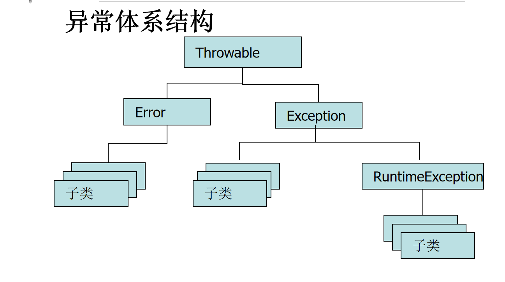
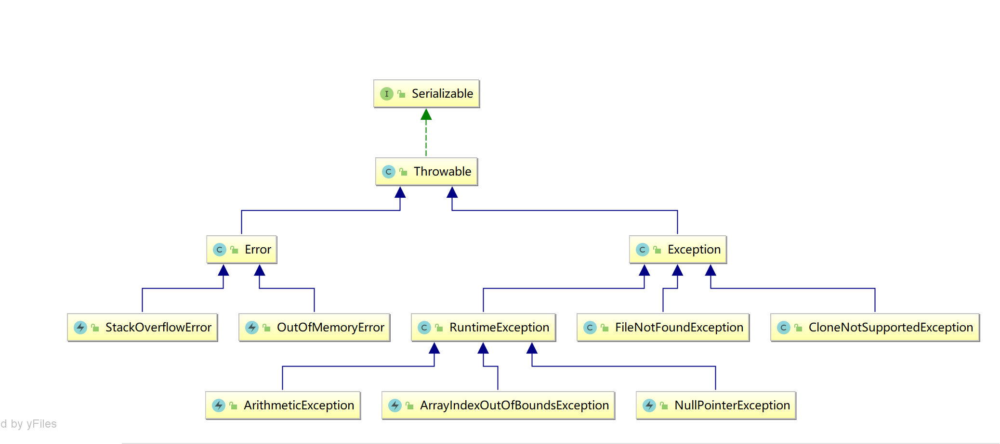

学习目标:

- 掌握异常的分类体系
- 熟悉常见异常
- 掌握异常的处理
- 掌握finally使用
- 掌握如何自定义异常

# 异常概述

## 什么是异常

简单来说异常就是用来表示Java程序运行过程中的错误(信息)

网络中断, 用户输入信息, 读取不存在的文件 

## 异常体系与分类



在Java中Throwable作为所有错误跟异常的祖先类

**根据错误的严重程度分**

- Error,: 比较严重的错误(代码处理不了, Jvm内部资源耗尽的错误) java.lang.StackOverflowError 栈溢出  java.lang.OutOfMemoryError 堆溢出
- Exception: 错误程度小, 能够用代码进行处理
  - java.lang.ArithmeticException: / by zero  算数异常 /0
  - java.lang.NullPointerException  空指针异常 
  - java.lang.ArrayIndexOutOfBoundsException  数组越界

**根据处理方式的不同**

- 编译时异常 : 编译不通过(除了RuntimeException及其子类外的其他的异常)
- 运行时异常: 编译通过, 但是运行时可能会出错(RuntimeException及其子类)


Exception是运行时异常还是编译时异常

- Exception是编译时异常和运行时异常的父类
- 在自定义异常的时候,Exception作为编译时异常


## 常见异常



```
常见异常
    编译时异常:
        java.lang.CloneNotSupportedException 克隆异常
        java.io.FileNotFoundException  找不到文件
        java.io.IOException IO操作异常     
    运行时异常
        java.lang.ArithmeticException 算数异常
        java.lang.NullPointerException 空指针异常
        java.lang.ArrayIndexOutOfBoundsException 数组越界异常
        java.lang.NumberFormatException  数字格式化异常
        java.lang.ClassCastException 类型转换异常
```

# 异常处理

## jvm默认处理机制

**jvm默认异常处理流程**

1. 当我们代码在执行到，发生错误的地方。
2.  一旦发生错误，jvm就会终止我们自己程序的运行，转而执行jvm自己的错误处理流程
3.  在发生错误地方，收集错误信息，产生一个描述错误的对象
4. 访问收集到的错误信息，将错误信息，输出到控制台窗口中(哪个线程,异常类型名, 异常原因, 哪个类哪个方法哪一行报错了)


**执行过程**

- 如果错误产生在main方法中
  - 当我们的代码执行到错误行数之前，代码是正常执行的
  - 当我们的代码执行到错误行数时，JVM会终止程序的执行，抛出一个该异常信息封装成的对象
  - 将该对象中的异常信息，打印到控制台上，告诉程序员发生了什么问题
  - 发生错误之后的语句，都不执行了
- 如果错误产生在main方法当中的另一个方法中
  - 当程序执行到该方法的错误行数时，JVM会终止程序的执行
    - 向上给方法的调用者抛出一个该异常信息封装成的对象
  - 一直向上抛出，直到抛给main方法，main方法最终抛给JVM
  - 发生异常之前的语句正常执行，但是之后的语句都不执行了
- 默认处理机制仅针对运行时异常

## 捕获异常,自己处理

### try-catch

#### 单分支

语法

```java
方式一:
try{
   // 可能出现异常的代码 
}catch(异常类型 对象名){
   // 对异常的处理操作 
}
方式二:
try{
   // 可能出现异常的代码 
}catch(异常类型1 | 异常类型2 | 异常类型3 | 对象名){
   // 对异常的处理操作 
}
```

 **try-catch的执行：**

1. 如果try中代码运行时发生了错误，jvm在发生错误的代码处，收集错误信息
2. try 块中在错误代码之后的代码，就不会在运行，jvm会跳转到相应的错误处理器中，
   执行开发者自己写的，错误处理代码
3. 错误处理器中的代码，一旦执行完毕紧接着，程序继续正常执行，执行的是整个try代码块之后的代码

注意：catch代码块中的代码，只有try块中的代码执行出错时，才会执行！

#### 捕获异常信息

```java
//获取异常信息，返回字符串。
getMessage()
//获取异常类名和异常信息，返回字符串。
toString()
//获取异常类名和异常信息，以及异常出现在程序中的位置,并打印到控制台
printStackTrace()
```


#### 多分支

语法

```java
try{
   // 可能出现异常的代码 
}catch(异常类型 对象名){
   // 对异常的处理操作 
}catch(异常类型 对象名){
   // 对异常的处理操作 
}catch(异常类型 对象名){
   // 对异常的处理操作 
}.....
```

匹配规则：
  1.根据实际的异常对象的类型，和异常分支(异常处理器)声明的异常类型，从上到下一次做类型匹配

    2. 一旦通过类型匹配，发现实际异常对象的类型和Catch分支(异常处理器)声明的异常类型，类型匹配，就把异常对象交给这个异常分支（异常处理器）

  3. 多分支的异常处理的执行，有点类似于多分支if-else的执行，一次匹配，只会执行多个catch分支中的一个

**注意事项：**

如果说，在多catch分支的情况下，如果不同的catch分支，处理的异常类型，有父子关系
那么就一定要注意，处理子类的异常分支写在前面，父类的异常分支写在后面


练习：
单独处理除0异常,空指针,数组下标越界异常一起处理。

```java
        try {
            // 出现异常的代码
        } catch (ArithmeticException e) {
            System.out.println("xxxxxxx");
        } catch (NullPointerException | ArrayIndexOutOfBoundsException e) {
            System.out.println("sssssss");
        }
```


## 抛出异常,上层处理

### throws关键字

在方法定义时使用
声明该方法可能抛出的异常
对于编译时异常，可以在语法层面强制方法调用者处理该异常
基本语法：

```
修饰符  返回值 方法名(形参列表)  throws 异常列表 {}
```

**解释说明:**

- 异常列表: 异常类型1, 异常类型2, .... 用逗号隔开，列表中的异常不要出现父子关系，如果有，那么编译器只会强制处理父类
- 只是声明可能抛出,到底抛不抛,看代码
- throws+运行时异常没有意义,因为运行时异常会自动抛出,不需要声明.throws+编译时异常才有意义,这实际上是编译异常处理的一种方式
- 在方法中声明throws+编译时异常,声明可能抛出编译时异常,该方法被调用时就要处理这个编译异常
- 处理编译时异常
  - 方法内部try-catch
  - throws向上抛,如果在main中就别抛了,处理一下


**子类重写父类方法注意:**

- 子类方法抛出的异常类型必须和父类方法抛出的异常类型兼容
- 子类方法可以没有异常列表
- 建议子类重写的时候保持跟父类一样的异常列表


### throw关键字

在方法体中使用
主动在程序中抛出异常
每次只能抛出确定的某个异常对象

基本语法：

```
throw 异常对象 (new 出来的)
```

注意:

- throw+编译时异常,需要结合throws关键字

### throws vs throw

**throws**

- 用在方法声明后面，跟的是异常类名
- 可以跟多个异常类名，用逗号隔开
- 表示抛出异常，由该方法的调用者来处理
- throws表示出现异常的一种可能性，并不一定会发生这些异常

**throw**

- 用在方法体内，跟的是异常对象名
- 只能抛出一个异常对象
- 表示抛出异常，可以由方法体内的语句处理
- throw则是抛出了异常，执行throw则一定抛出了某种异常

## 异常策略选择

总结一下，目前为止，我们学习过的异常处理策略有2种：

- 捕获并处理try-catch
- 向上抛出
  - 运行时异常，自动抛出，直道抛给jvm
  - 编译时异常，需要结合throws关键字向上抛


**如何选择策略？**

-  对于运行时异常，我们不应该写出产生这种异常的代码，应该在代码的测试阶段修正代码。
-  对于编译时异常，功能内部能够处理的就处理，如果不能够或者没有必要处理，就抛出。

## finally

**特点**

被finally控制的语句体一定会执行
特殊情况：在执行到finally之前jvm退出了(比如System.exit(0))

**作用**

用于释放资源，在IO流操作和数据库操作中会见到

**如何使用**

跟try-catch结合

```java
语法:方式一
try{
    
}catch(){
    
}catch(){
    
}.....
finally{
    // 一定执行
}

方式二:
try{
    
}finally{
    
}
```

> 一些奇思妙想

- try代码块如果有return
  - 程序会先执行完finally代码块，回过头执行try中的return
- catch代码块中如果有return，并且catch正常捕获异常执行
  - 程序会先执行完finally代码块后，再回去执行catch中return，从catch代码块中结束方法
- finally代码中有return
  - 不会影响finally代码块执行
- 如果finally和catch中都有return
  - 程序会直接从finally代码块中的return结束方法
- 如果try中的异常不能正常捕获,但是finally中有return
  - 注意此时程序会跳过这个异常，不会抛出异常给JVM报错


# 自定义异常

## 为什么要自定义异常

现有的异常体系不满足需求

## 如何自定义异常

### 自定义编译时异常

- 定义一个类继承Exception
- 构造方法

### 自定义运行时异常

- 定义一个类继承RuntimeException
- 构造方法


考试成绩必须在0-100分之间，如果有考试成绩不在这个范围之内，则认为成绩异常。

对于以上的异常，Java语言中显然没有一个对应的“考试分数异常超出范围”的异常，因此该异常需要我们自己来定义。

```java
package _15exception.com.cskaoyan._06define;

import java.util.Scanner;

/**
 * @description:
 * @author: 景天
 * @date: 2022/10/14 16:06
 **/
/*
考试成绩必须在0-100分之间，如果有考试成绩不在这个范围之内，则认为成绩异常。
 */
public class Demo {
    public static void main(String[] args) {
        try {
            func();
        } catch (MyException1 myException1) {
            myException1.printStackTrace();
        }
    }

    private static void func() throws MyException1 {
        // 键盘接收分数
        Scanner scanner = new Scanner(System.in);
        int score = scanner.nextInt();
        // 判读一下是否在区间内
        if (score < 0 || score > 100) {
            // 如果不在 抛出异常
            // throw + 异常对象
            throw new MyException1("分数不合法");
        }
    }
}

// 定义编译时异常
class MyException1 extends Exception{
    public MyException1() {
    }

    public MyException1(String message) {
        super(message);
    }
}

// 定义运行时异常
class MyException2 extends RuntimeException{
    public MyException2() {
    }

    public MyException2(String message) {
        super(message);
    }
}

```

