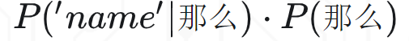
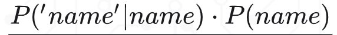
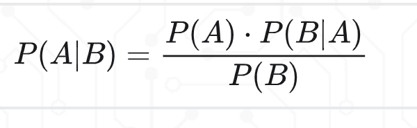
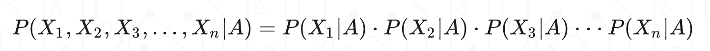
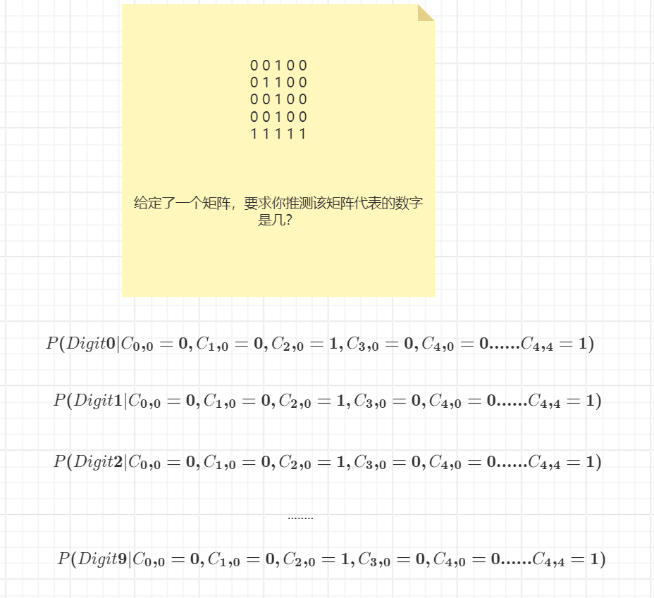
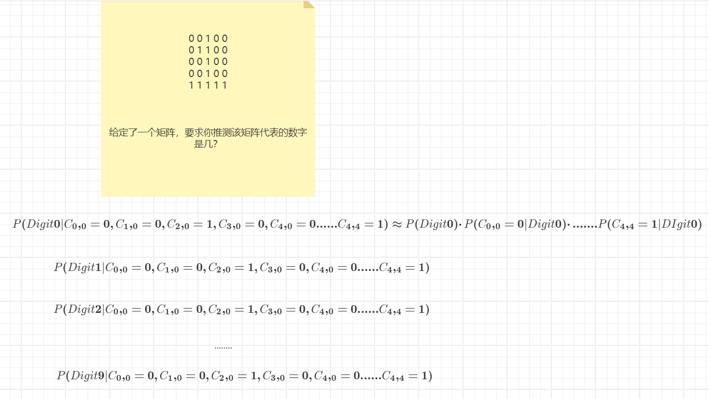
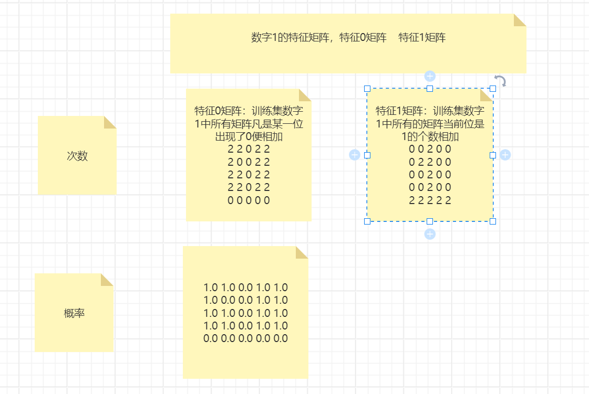
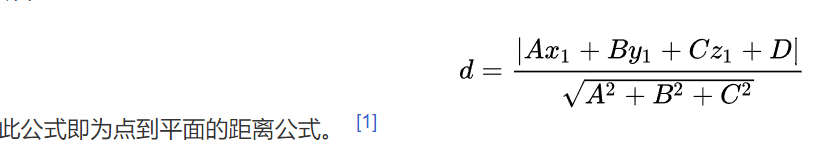

# 一些公式推导过程

$$
P(白|单眼皮) = \frac{P(白)·P(单眼皮|白)}{P(单眼皮)} = \frac{0.5 * 0.5}{P(单眼皮,白) + P(单眼皮,黑)} = \frac{0.25}{P(单眼皮|白)·P(白) + P(单眼皮|黑)·P(黑)} = \frac{0.25}{1/2 * 1/2 + 1/2}
$$

$$
P(那么|'name')·P('name') = P('name'|那么)·P(那么)
\\
P(那么|'name')= \frac{P('name'|那么)·P(那么)}{P('name')}
\\
P(name|'name')·P('name')= P('name'|name)·P(name)\\
P(name|'name')= \frac{P('name'|name)·P(name)}{P('name')}
$$
接下来比较P(那么|'name')和P(name|'name')只需要去比较

和

即可，因为分母的部分是相同的。P('name'|那么)和P('name'|name)通常是我们系统中可以查询到的值，假设他两相同的情况下，那么我们最终比较的就是**P(那么)和P(name)**，也就是比较**先验概率**

$$
P(白) = P(箱子1,白) + P(箱子2,白) + P(箱子3,白) = P(箱子1)·P(白|箱子1) + P(箱子2)·P(白|箱子2) + P(箱子3)·P(白|箱子3) = 1/3 * 1/4 + 1/3 * 3/5 + 1/3 * 2/5 =  \\

P(箱子3|白) = \frac{P(箱子3)·P(白|箱子3)}{P(白)} = \frac{1/3 * 2/5}{5/12}
$$

# 重要公式

满足特征条件独立的情况下，有下面这个公式：

# 西瓜问题

假如我们的事件有可能出现的结果分别为X、Y，而在生成X，Y的过程中会经过4个特征，假设其属性值分别为A、B、C、D

现在我们要计算 在ABCD的情况出现X，Y的概率

下面这两个公式分别表示的是在A,B,C,D同时发生的情况下发生X的概率和在A,B,C,D同时发生的情况下发生Y的概率

如果希望比较这两个概率哪个高一些，因为分母的部分是一样的，所以只需要比较分子的部分即可
$$
P(X|A,B,C,D) = \frac{P(X)·P(A,B,C,D|X)}{P(A,B,C,D)} = \frac{P(X)·P(A|X)·P(B|X)·P(C|X)·P(D|X)}{P(A,B,C,D)}
\\
P(Y|A,B,C,D) = \frac{P(Y)·P(A,B,C,D|Y)}{P(A,B,C,D)} = \frac{P(Y)·P(A|Y)·P(B|Y)·P(C|Y)·P(D|Y)}{P(A,B,C,D)}
$$
所以，如果希望比较这两个概率的高低，只需要比较
$$
P(X)·P(A|X)·P(B|X)·P(C|X)·P(D|X) >?  P(Y)·P(A|Y)·P(B|Y)·P(C|Y)·P(D|Y)
$$
和之前的西瓜问题一结合，那么便可以知道如何才能够判断出是好瓜还是坏瓜了。如果X代表的是好瓜，Y代表的是坏瓜，只要前者的概率高于后者，那么便表示当前的特征情况下好瓜的概率更大一些。

如果需要预测某些属性下是好瓜还是坏瓜，则应该进行如下的编写：
$$
P(好瓜|青绿、稍蜷、浊响) = \frac{P(好瓜)·(青绿、稍蜷、浊响|好瓜)}{P(青绿、稍蜷、浊响)}
\\
P(坏瓜|青绿、稍蜷、浊响) = \frac{P(坏瓜)·(青绿、稍蜷、浊响|坏瓜)}{P(青绿、稍蜷、浊响)}
$$
所以，如果最后我要预测是好瓜还是坏瓜，则只需要进行如下的比较即可：
$$
P(好瓜)·(青绿、稍蜷、浊响|好瓜)
$$
和
$$
P(坏瓜)·(青绿、稍蜷、浊响|坏瓜)
$$
假设青绿、稍蜷、浊响这三个特征条件是独立的，那么也可以进一步推导出下面的公式：
$$
P(好瓜)·P(青绿|好瓜)·P(稍蜷|好瓜)·P(浊响|好瓜)
$$
和
$$
P(坏瓜)·P(青绿|坏瓜)·P(稍蜷|坏瓜)·P(浊响|坏瓜)
$$
二者的大小关系即可。P(好瓜)以及P(坏瓜)可以理解为先验概率。在大的样本空间中，好瓜和坏瓜的比例。

# 数字识别问题

我们先用一个5*5的矩阵来模拟一下。

0 0 1 0 0

0 1 1 0 0

0 0 1 0 0

0 0 1 0 0

0 0 1 1 1

===============================

0 0 1 0 0

0 1 0 1 0

0 1 0 1 0

0 1 0 1 0

0 0 10 0

让你去计算该矩阵是数字几的概率比较大？刚刚西瓜问题，我们的分类结果有两个，要么是好瓜，要么是坏瓜。对于数字识别问题，我们的分类结果有几个？10个

通过上述两个矩阵，我们可以发现，不同的数字对应的矩阵的每个位上面的数字是0还是1的情况是不一样的。有的可能在某些位置上面是0，有的可能在某些位置上面是1

所以，针对某个给定的矩阵，其实我们可以这么去思考

首先猜测

C0,0=0,C1,0=0,C2,0=1,C3,0=0,C4,0=0,

C0,1=0,C1,1=1,C2,1=1,C3,1=0,C4,1=0,

C0,2=0,C1,2=0,C2,2=1,C3,2=0,C4,2=0

C0,3=0,C1,3=0,C2,3=1,C3,3=0,C4,3=0,

C0,4=0,C1,4=1,C2,4=1,C3,4=1,C4,4=1。在上述这些属性同时存在的情况下是0的概率是多少、是1的概率是多少、是2的概率是多少、.....是9的概率是多少

$$
P(Digit0|C0,0=0,C1,0=0,C2,0=1,C3,0=0,C4,0=0,

C0,1=0,C1,1=1,C2,1=1,C3,1=0,C4,1=0,

C0,2=0,C1,2=0,C2,2=1,C3,2=0,C4,2=0

C0,3=0,C1,3=0,C2,3=1,C3,3=0,C4,3=0,

C0,4=0,C1,4=1,C2,4=1,C3,4=1,C4,4=1) ???\\
P(Digit1|C0,0=0,C1,0=0,C2,0=1,C3,0=0,C4,0=0,

C0,1=0,C1,1=1,C2,1=1,C3,1=0,C4,1=0,

C0,2=0,C1,2=0,C2,2=1,C3,2=0,C4,2=0

C0,3=0,C1,3=0,C2,3=1,C3,3=0,C4,3=0,

C0,4=0,C1,4=1,C2,4=1,C3,4=1,C4,4=1)
$$

我们现在的数字识别问题相较于刚刚的西瓜问题，我们的属性的数量有了比较大的提升，分类的结果也有比较大的提升。

后续如何处理呢？其实只需要将上述公式利用贝叶斯公式进行一个转换即可
$$
\frac{P(Digit0)·P(C0,0=0,C1,0=0,C2,0=1,C3,0=0,C4,0=0,

C0,1=0,C1,1=1,C2,1=1,C3,1=0,C4,1=0,

C0,2=0,C1,2=0,C2,2=1,C3,2=0,C4,2=0

C0,3=0,C1,3=0,C2,3=1,C3,3=0,C4,3=0,

C0,4=0,C1,4=1,C2,4=1,C3,4=1,C4,4=1|Digit0)}{P(C0,0=0,C1,0=0,C2,0=1,C3,0=0,C4,0=0,

C0,1=0,C1,1=1,C2,1=1,C3,1=0,C4,1=0,

C0,2=0,C1,2=0,C2,2=1,C3,2=0,C4,2=0

C0,3=0,C1,3=0,C2,3=1,C3,3=0,C4,3=0,

C0,4=0,C1,4=1,C2,4=1,C3,4=1,C4,4=1)} \\

\frac{P(Digit1)·P(C0,0=0,C1,0=0,C2,0=1,C3,0=0,C4,0=0,

C0,1=0,C1,1=1,C2,1=1,C3,1=0,C4,1=0,

C0,2=0,C1,2=0,C2,2=1,C3,2=0,C4,2=0

C0,3=0,C1,3=0,C2,3=1,C3,3=0,C4,3=0,

C0,4=0,C1,4=1,C2,4=1,C3,4=1,C4,4=1|Digit1)}{P(C0,0=0,C1,0=0,C2,0=1,C3,0=0,C4,0=0,

C0,1=0,C1,1=1,C2,1=1,C3,1=0,C4,1=0,

C0,2=0,C1,2=0,C2,2=1,C3,2=0,C4,2=0

C0,3=0,C1,3=0,C2,3=1,C3,3=0,C4,3=0,

C0,4=0,C1,4=1,C2,4=1,C3,4=1,C4,4=1)}
$$

因为分母的部分是一样的，所以我们只需要去比较分子的部分即可。又因为这些特征条件是独立的，所以推导出如下的公式：
$$
P(Digit0)·P(C0,0=0|Digit0)·P(C0,1=0|Digit0)........P(C4,4=1|Digit0)
$$
所以得出最终的结论，如果我们需要预测是哪个数字，那么只需要执行上述的运算10次，得出一个概率值最大的即可

上述这个公式需要我们得出哪些结论呢？

1.数字0~9出现的概率

2.针对你预测的数字，那么需要分别统计0,0位是0的概率是多少;0,1位是0的概率是多少........;4,4位是1的概率是多少

所以，如果要解决数字识别问题，那么只需要解决上述问题即可。进一步转换公式，因为分母的部分都是相同的，所以我们只需要比较分子的部分即可，下面列出的部分便是分子的部分。其他1~9的过程完全相同。

**1、需要获取0~9数字的先验概率。P(Digit0)-P(Digit9)** 

**2、针对每个数字(0-9)，在训练集中找出它全部的矩阵,将这些矩阵中的每一位是0还是1的情况进行统计，最后除以总数据量，能否得出该位是0还是1的概率**

**3.如果某一位的概率是0，那么最终乘积的结果是不是全部都是0？我们怎么办呢？引入了平滑度。给特征0统计次数或者特征1统计次数的时候，那么我们都加入一个平滑度的数值，这样，绝对不会有0出现，那么最终乘积之后绝对不会出现概率全部都是0的情况。**

**4.都是0.几的数字进行相乘，那么最终的数值会急剧变小。最后，如果我们要统计概率，那么也不容易统计。数字相乘其实可以转换成lg和的形式，不影响最终的大小关系。**

a * b * c     >  d * e * f

lg(a * b * c)  > lg(d * e * f)

lga + lgb + lbc > lgd + lge + lgf

## 感知机模型

### 空间中任何一个点到平面的距离计算公式

$$
2x_1 - x_2 -2 = 0 \\
d = \frac{|2x_1 - x_2 - 2|}{\sqrt{2^2 + (-1)^2}}
$$
感知机如何去学习？感知机的过程是什么样的呢？

使用感知机去定义一个分离超平面，将点进行正确的分离，但是肯定会有分类错的点。如何评估这个分离超平面是否合适呢？

只能通过误分类点到超平面的距离之和来确定。

### 数字识别问题

感知机只能够进行二分类，没法去判断究竟是数字几，所以如果希望进行判定数字几，那么需要对感知机进行一些处理。

w·x + b = 0

可以将f(3) - f(5) = 0做成一个感知机，依次和其他数字做成感知机，但是这种方式太麻烦。只需要转换成f(3)最大值即可。

w指的是权重，x指的是维度，也就是模型中的不同的属性，对于西瓜问题来说，是3个维度，对于数字识别来说，是28*28个维度

为了简便分析，我们设定b=0，此时
$$
f(3) - f(5) = w_3 ·x - w_5·x
$$
如果要让别人信服，只需要保障f(3) - f(5) > 0即可，同样，针对其他9个数字也是如此。进一步简化，只需要保障
$$
w_3 ·x
$$
最大即可

