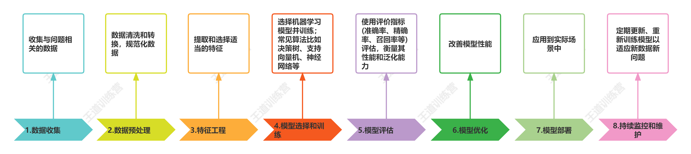

# 人工智能概述

## 什么是人工智能

人工智能（Artificial Intelligence，简称AI）是一门研究如何使机器能够模拟和实现人类智能的科学和技术。它涉及构建智能系统，使其能够感知、理解、学习、推理、决策和交互等一系列与人类智能相关的能力。

## 人工智能的背景

人工智能的概念可以追溯到上世纪50年代，随着计算能力的提升和算法的发展，人工智能逐渐成为独立的研究领域。近年来，随着**大数据、云计算和算法创新**的推动，人工智能得以快速发展，并在各个领域产生了巨大的影响。

还有一个非常重要的点：**效果**

## 为什么需要人工智能

1. 解决复杂问题：人工智能技术可以处理和分析海量数据，从中提取有价值的信息，帮助我们理解和解决复杂的问题。它能够应对现实世界中的挑战，如天气预测、疾病诊断、交通优化等。

2. 自动化和提高效率：人工智能能够自动化许多任务和流程，减少人力资源的需求，并提高生产力和效率。例如，自动驾驶技术可以降低交通事故风险，智能机器人可以在制造业中执行重复性工作，提高生产效率。

3. 个性化和定制化服务：人工智能技术可以根据个体用户的需求和偏好提供个性化的产品和服务。通过深度学习和推荐算法，人工智能可以为用户提供个性化的推荐、广告和购物建议，提升用户体验。

4. 改善医疗和健康护理：人工智能在医疗领域有广泛应用，如辅助诊断、药物研发、精准医疗等。它可以帮助医生更准确地诊断疾病、制定治疗方案，并对患者的健康状况进行监测和预测。

5. 提升科学研究能力：人工智能为科学研究提供了强大的工具和方法。它可以处理复杂的模拟和仿真，加速新知识的发现，为科学家提供洞察和创新的视角。

6. 促进经济增长和创新：人工智能被认为是推动经济增长和创新的重要驱动力。它为企业带来了新的商机和竞争优势，促进了许多行业的数字化转型，同时创造了新兴的就业岗位和市场需求。

7. 未来发展潜力巨大：人工智能仍然处于快速发展的阶段，其应用领域和可能性仍在不断扩展。随着技术的进一步突破和创新，人工智能有望在各个领域带来更大的影响和改变。

   

基于人工智能的这些特点，人工智能在各个领域都有广泛的应用场景。以下是一些常见的人工智能应用领域：

1. 医疗保健：人工智能可以辅助医生进行疾病诊断和治疗决策，提升医疗质量。它还可用于药物研发、基因组学和精准医疗等领域。
2. 金融服务：人工智能被应用于欺诈检测、信用评估、风险管理和智能投资等金融领域，提高了交易效率和安全性。
3. 零售业：人工智能技术在零售业中应用广泛，包括推荐系统、智能购物助手、供应链优化、智能支付和反欺诈等。
4. 制造业：人工智能在制造业中实现自动化和智能化，如机器人自动装配、质量控制、预测性维护和智能物流管理等。
5. 交通与物流：人工智能在交通管理、智能交通系统、自动驾驶汽车、智能物流规划和优化等方面发挥着重要作用。
6. 教育领域：人工智能可用于个性化教育、智能辅导系统、在线学习平台和教育数据分析，提供更好的教育资源和学习体验。
7. 自然语言处理：人工智能技术在文本分析、机器翻译、语音识别、情感分析和智能助手等方面得到广泛应用。
8. 媒体与娱乐：人工智能在内容推荐、音视频处理、智能游戏、虚拟现实和增强现实等媒体与娱乐领域有很多创新应用。
9. 农业与农村发展：人工智能可以在农业生产中进行精准种植、智能农机、作物病虫害监测和农产品质量检测等方面提供支持。
10. 社交媒体与社交网络：人工智能技术广泛应用于社交媒体平台，如人脸识别、情感分析、内容过滤和社交推荐等。


## 人工智能的分支

人工智能的发展目标是让机器能够像人类一样具备一定程度的智能，包括但不限于以下几个方面：

1. 知识表示与推理：使机器能够存储和处理大量的知识，并基于知识进行推理和决策。
2. **机器学习与模式识别**：让机器能够从大量的数据中自动学习，并识别出其中的模式和规律。
3. 自然语言处理：使机器能够理解和处理人类的自然语言，包括语音识别、语义理解、机器翻译等。
4. 计算机视觉：让机器能够感知和理解图像、视频等视觉信息，进行图像识别、目标检测等任务。
5. 智能决策与规划：使机器能够基于现有信息做出智能决策，并进行路径规划和优化等任务。


我们接下来要学习的**机器学习**是人工智能的一个非常重要的分支

# 机器学习概述

## 什么是机器学习

> **`机器学习(Machine Learning)`**的概念最早由美国计算机科学家Arthur Lee Samuel于1959年提出，后来，美国另外一位计算机科学家Tom M. Mitchell给出该术语的定义：
>     A computer program is said to learn from experience E with respect to some class of tasks T and performance measure P if its performance at tasks in T, as measured by P, improves with experience E
> 简单翻译：
>     计算机从经验E开始学习，给定一个任务T，用P衡量，在经验E上改进。
>
> 1959机器学习就提出了, 它不是一个很新的东西。
>
> 机器学习说白了：
>     就是实现人工智能的一个手段，可以像人一样进行学习。随着任务的进行，模型就会得到一定程度上的改善。

机器学习是对计算机一部分数据进行学习，然后对另外一些数据进行预测与判断。

机器学习的核心是“使用算法解析数据，从中学习，然后对新数据做出决定或预测”。也就是说计算机利用已获取的数据得出某一模型，然后利用此模型进行预测的一种方法，这个过程跟人的学习过程有些类似，比如人获取一定的经验，可以对新问题进行预测。

## 机器学习的一般流程



我们的课程中我们主要讲的是上述的3、4、5、6过程

### 数据收集

数据收集就是我们要通过各种途径能够获得一定量的数据，这也是我们机器学习的基础

比如问卷、观察、实验、网络挖掘、设备收集

设备收集比如传感器或仪器自动来记录和收集数据，比如气象站、手机等

### 数据预处理

数据预处理指在使用数据进行机器学习或数据分析任务之前，对原始数据进行清洗、转换和整理的过程，以提高数据质量和模型性能。数据预处理通常也被称之为数据清洗，将上述收集到数据转换为我们所需要的数据格式。

比如缺失值处理、异常值处理、数据标准化/归一化等


> 张三是一位年龄为23岁的青年，就读于北京大学新闻学院。虽然他来自山东，但他选择了远离家乡，踏入繁华都市的校园生活。
>
> 在课堂上，张三积极参与各类学术讨论和文化活动。他对新闻学产生了浓厚的兴趣，并努力学习各个方面的知识。他深知新闻的重要性，它不仅能传递信息，还能引导公众思考和反思。张三立志成为一个优秀的新闻从业者，致力于揭示真相，传播正能量，推动社会进步。
>
> 除了学术上的追求，张三也有丰富多彩的个人爱好。他喜欢唱歌，那磁性的嗓音常常在校园演出中响起，为大家带来美妙的旋律。同时，篮球也是他生活中不可或缺的一部分。每当周末，他与朋友们相聚在篮球场上，挥洒汗水，展现出坚韧和团队协作的精神。
>
> 尽管在陌生城市，张三勇敢地迎接挑战，不断拓展自己的视野和能力。他在北京大学这个知识的殿堂中，通过学习和实践，逐渐成长为一个自信、有追求的年轻人。
>
> 张三的故事充满活力和激情，他以积极向上的态度面对生活，用才华与努力去书写自己的未来。他是那个正朝着自己目标奋进的青年，让我们期待他未来更加辉煌的篇章。

上面是一篇小作文，比如我们通过爬虫软件在互联网上抓取到这样的消息，而我们期望的是获得张三的各种信息（姓名，性别，生日，籍贯，学校，专业，爱好）那么通过数据预处理可以获得以下的信息

> 张三，男，2000年，山东省，北京大学，新闻学院，唱歌和篮球

这个其实就是数据预处理

> 上面的男，是通过“他”分析出来的
>
> 上面的2000年，是根据年龄23岁计算出来的


> 小芳来自湖北武汉，她今年25岁了，她现在正在进行公务员考试，虽然学习过程非常信息，她平时仍然保留了运动的习惯，平时喜欢和朋友一起打羽毛球，通过这种运动来调整学习的疲倦，学累了，她也喜欢喝咖啡

> 小芳，女，1998年，湖北武汉，未知，未知，羽毛球和咖啡


```
张三，男，2000年，山东省，北京大学，新闻学院，唱歌和篮球
小芳，女，1998年，湖北武汉，未知，未知，羽毛球和咖啡
...
...
...
```


### 特征工程

特征工程的目标是提高模型的准确性、降低过拟合风险，并帮助模型更好地理解数据。它需要结合对数据的领域知识和实验经验来进行有效的特征选择、转换和构建。

特征处理首先也是进行特征清洗，然后对数据进行采样，避免样本不均衡；然后基于单个特征可以做数据预处理，比如归一化，缺失值处理；基于多个特征可以做降维和特征选择。


买西瓜 → 老板，这个瓜包熟吗，这个瓜甜吗？怎么选瓜

比如西瓜的特征：颜色、条纹、敲声、茎叶


颜色：（浅绿、白绿、柔光绿、深绿） → 绿色


针对于我们的手写体识别项目，可以采用以下的特征工程

1. 无量纲化，将数据尺寸固定位28*28
2. 二值化，给定阈值，将定量特征按照阈值划分，[0,1]


> ```
>                             
>                             
>                             
>                             
>                             
>                             
>                             
>              ++###+         
>              ######+        
>             +######+        
>             ##+++##+        
>            +#+  +##+        
>            +##++###+        
>            +#######+        
>            +#######+        
>             +##+###         
>               ++##+         
>               +##+          
>               ###+          
>             +###+           
>             +##+            
>            +##+             
>           +##+              
>          +##+               
>          ##+                
>         +#+                 
>         +#+
>         
> ```

## 模型选择

在接下来的课程中我们分别会以**朴素贝叶斯**和**感知机**两种算法来分别进行分析和训练

接下来我们会在前期准备工作中做一些内容之后，再具体分析，接下来看我们的下一个文档