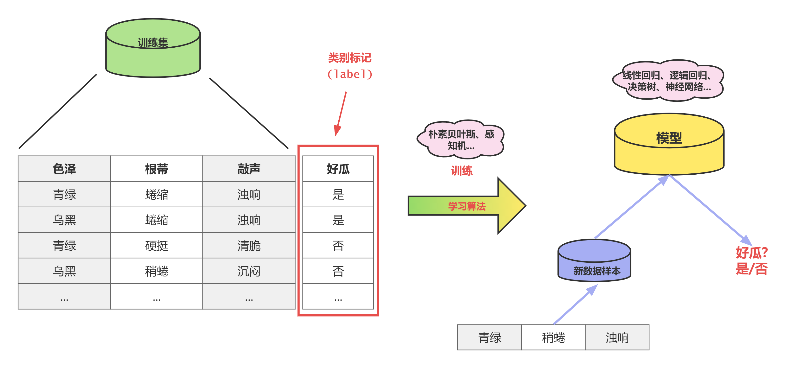
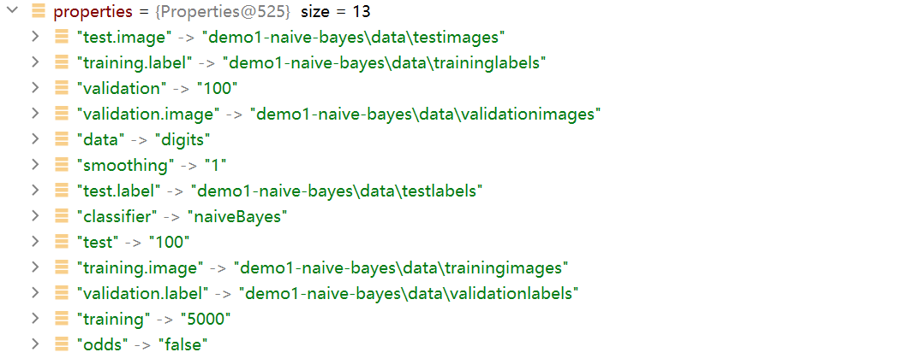
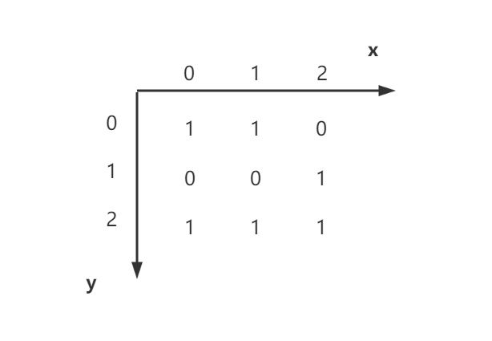
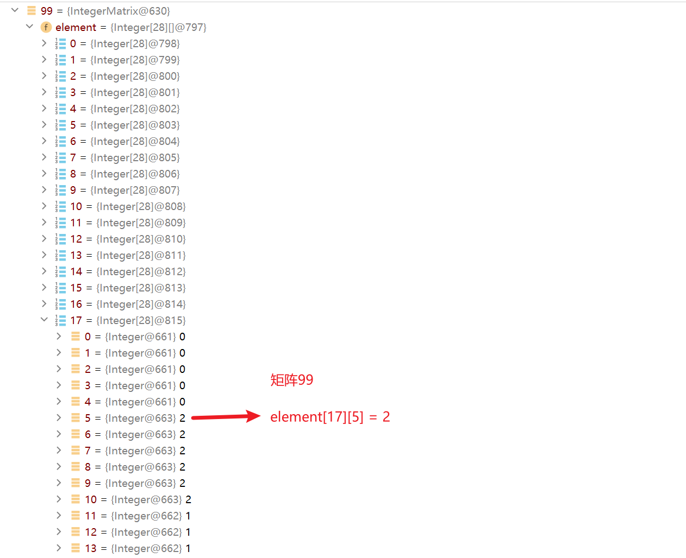
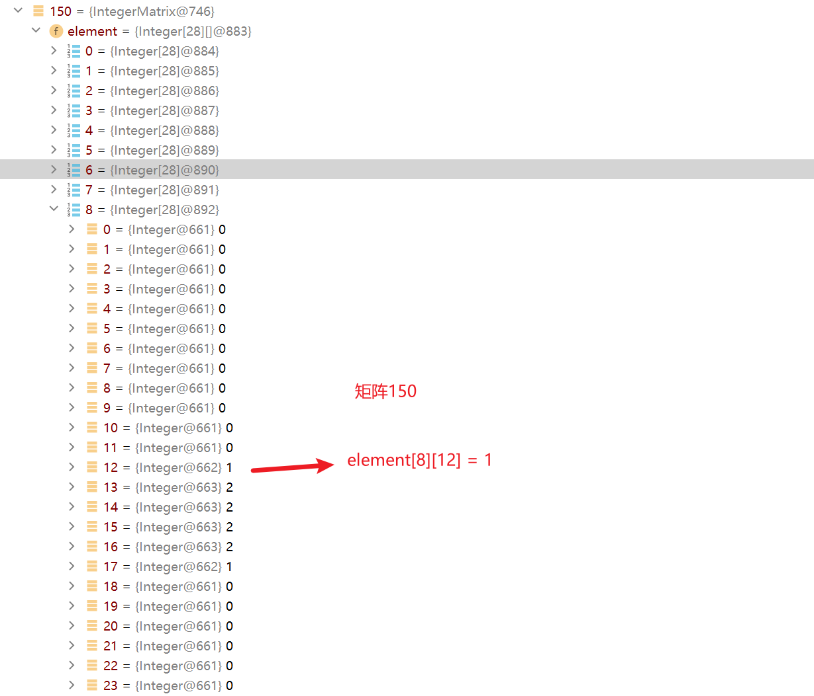

# 机器学习的基本术语

**数据集**：所有记录的集合

**实例(instance)或样本(example)**：每一条记录

**特征(feature)或属性(attribute)**：单个的特点，一个记录构成一个特征向量，可用坐标轴上的一个点表示，比如一个人，他有身高、体重、肤色等信息

我们的案例中的特征(属性)就是**数值**

**属性值(attribute value)**: 

- 属性上的取值，例如“175cm”、“75kg”、“白里透着红”
- 属性张成的空间称为 “属性空间”(attribute space)、“ 样本空间”(sample space)或“输入空间”。

**特征空间(feature space)：**

- 分别以每个特征作为一个坐标轴，所有特征所在坐标轴张成一个用于描述不同样本的空间，称为特征空间，比如身高的特征空间[10cm~250cm]
- 在该空间中，每个具体样本就对应空间的一个点，在这个意义下，也称样本为样本点。
- 每个样本点对应特征空间的一个向量，称为 “特征向量”
- 特征的数目即为特征空间的维数。
  维数：一个样本的特征数，维数灾难

我们的案例中的结果就是，[0,1,2,3,4,5,6,7,8,9]

**训练集（trainning set），[特殊]**：所有训练样本的集合

**测试集（test set），[一般]**：所有测试样本的集合

**泛化能力（generalization），即从特殊到一般**：机器学习出来的模型适用于新样本的能力

**标记(label)：**

有前面的样本数据显然是不够的，要建立这样的关于“预测”(prediction) 的模型,我们需获得训练样本的“结果”信息，例如“((身高=175cm;体重=75kg;肤色= 白里透着红),帅哥)”。这里关于示例结果的信息，例如“帅哥”，称为“标记”(label); 拥有了标记信息的示例，则称为“样例”(example)。

在我们这个案例中，我们对给你的数据提供的值就是标记

```
                            
                            
                            
                            
                            
                +++++##+    
        +++++######+###+    
       +##########+++++     
        #######+##          
        +++###  ++          
           +#+              
           +#+              
            +#+             
            +##++           
             +###++         
              ++##++        
                +##+        
                 ###+       
              +++###        
            ++#####+        
          ++######+         
        ++######+           
       +######+             
    ++######+               
    +####++                 
                            
                            
                            
```

这个值给定的标记的值为5

```
                            
                            
                            
                            
               ++#++        
              +#####        
             +######+       
            +#####+##+      
           +######++#+      
          +###++##++#+      
         +###+ +++  ##+     
        ++###+      ##+     
        +##+ +      ###     
       +##+         ###     
       ##+          ###     
      +##+          ##+     
      +##+         +#+      
      +##         +##+      
      +#+       ++#+        
      +##      +##+         
      +##+++++###++         
      +#########+           
      +#######+             
       ++###++              
                            
                            
                            
                                                                                 
```

这个值给定的标记的值为0


**分类(classification):**

若我们欲预测的是离散值,例如“帅哥”“9”，此类学习任务称为"分类"

我们这个案例就是要预测给出的数字的值为多少，

对只涉及两个类别的称为 二分类(binary classification)，比如西瓜 甜还是不甜

**回归(regression)**

若欲预测的是连续值,例如西瓜成熟度0.95、0.37,此类学习任务称为“回归”。


**聚类(clustering)**

即将训练集中的样本分成若干组,每组称为一个 “簇”(cluster);
根据训练数据是否拥有标记信息，学习任务可大致划分为两大类:“ 监督学习”(supervised learning) 和 “无监督学习”(unsupervised learning), 分类和回归是前者的代表,而聚类则是后者的代表。


# 西瓜问题

西瓜问题是机器学习的学习过程中非常好的一个入门问题。通过西瓜问题来帮助我们理解机器学习

`王婆卖瓜`

> 王婆是一个勤劳的瓜农，为了夸赞自己的瓜甜美可口，王婆想出了一个妙计，每天带上一小块瓜作为样品，向过路的人展示并自夸瓜的甜美。大家都被王婆夸赞的话语所吸引，纷纷前来品尝她的瓜。王婆的瓜因为品质好，口感甜美，得到了大家的一致好评，生意也越做越红火。

这时候你发现王婆的瓜都是好瓜，这时候你就好奇王婆如何把好瓜挑选出来的，作为一个程序员（码农）这时候你去田里摘了一车西瓜（100个），准备回去使用机器学习的方式来分析

## 分析

> **数据集**：100个西瓜
>
> **实例(样本)**：每一个西瓜
>
> **特征(属性)**：色泽、根蒂、敲声
>
> **属性值**：青绿、乌黑、蜷缩、硬挺、稍蜷、浊响、清脆、沉闷
>
> **特征空间**：
>
> - 色泽：[青绿、乌黑]
> - 根蒂：[蜷缩、硬挺、稍蜷]
> - 敲声：[浊响、清脆、沉闷]
>
> **训练集：**我们这100个瓜就是要作为训练集的
>
> **测试集**：等下可以再买20个瓜作为测试集
>
> **泛化能力**：比如之前是石头瓜，后面是厚皮瓜，这个石头瓜的标准是否适用于厚皮瓜
>
> **标记**：比如 一个样本的特征值为[青绿，蜷缩，浊响]，将其标记为 **好瓜**
>
> **分类**：我们这里的得到的会是离散结果，【好瓜、坏瓜】

我们把一车瓜拉回去，就是一种数据收集

## 数据预处理

我们把每一个瓜依次查看并且记录其特征，假设数据如下

| 编号 | 色泽 | 根蒂 | 敲声 |
| ---- | ---- | ---- | ---- |
| 1    | 青绿 | 蜷缩 | 浊响 |
| 2    | 乌黑 | 蜷缩 | 浊响 |
| 3    | 青绿 | 硬挺 | 清脆 |
| 4    | 乌黑 | 稍蜷 | 沉闷 |
| 5    | 青绿 | 蜷缩 | 沉闷 |
| 6    | 青绿 | 稍蜷 | 浊响 |
| 7    | 乌黑 | 硬挺 | 沉闷 |
| 8    | 乌黑 | 硬挺 | 清脆 |
| ...  | ...  | ...  | ...  |

为了训练数据，我们决定将每一个瓜都给它开瓢，然后看一下每一个瓜的结果，这里对瓜的结果进行**标记**

| 编号 | 色泽 | 根蒂 | 敲声 | 好瓜 |
| ---- | ---- | ---- | ---- | ---- |
| 1    | 青绿 | 蜷缩 | 浊响 | 是   |
| 2    | 乌黑 | 蜷缩 | 浊响 | 是   |
| 3    | 青绿 | 硬挺 | 清脆 | 否   |
| 4    | 乌黑 | 稍蜷 | 沉闷 | 否   |
| 5    | 青绿 | 蜷缩 | 沉闷 | 否   |
| 6    | 青绿 | 稍蜷 | 浊响 | 是   |
| 7    | 乌黑 | 硬挺 | 沉闷 | 否   |
| 8    | 乌黑 | 硬挺 | 清脆 | 否   |
| ...  | ...  | ...  | ...  | ...  |

## 训练

选择合适的算法进行训练，然后获得模型

这个过程我们会遍历样本集中的每一个样本数据，然后根据标记结果进行计算，最终获得分析模型

## 新样本数据

引入新的样本数据，新样本数据结合模型进行计算，获得离散结果，到底是好瓜还是坏瓜

比如我们新买了一个西瓜，它[青绿，稍蜷，浊响]，那么它是一个好瓜吗？

## 流程示意图

以下是上述流程的示意图



通过以上的西瓜案例也希望大家能对机器学习有一定的认识

# 数据集说明

## 训练数据集和标记

前期已经做好了数据的收集和预处理，呈现的训练数据共5000条，可以选择其中的部分或全部作为训练数据，并且也已经对训练数据做了标记。

训练数据集和标记的文件如下

> `trainingimages`和`traininglabels`

## 测试数据集和标记

测试数据集相当于新数据样本，可以测试我们在前面的模型预测的数据

并且给测试数据集也提供了标记，可以比对预测结果和标记结果，计算测试数据集中的预测结果的准确率

测试数据集和标记的文件如下

> `testimages`和`testlabels`

## 验证数据集和标记

验证数据集也是新数据样本，可以验证我们在前面的模型预测的数据

并且给验证数据集也提供了标记，可以比对预测结果和标记结果，计算验证数据集中的预测结果的准确率

验证数据集和标记的文件如下

> `validationimages`和`validationlabels`

## 区分

测试数据集和验证数据集的区别如下：

1. **用途**：测试数据集用于最终调整好的模型之间进行比较选择，并给出各个模型能力的无偏估计；而验证数据集用于在训练过程中评估模型性能，帮助开发人员调整模型，避免过拟合或欠拟合。
2. **划分**：测试数据集是从原始数据集中划分出来，与训练集和验证集互不重叠；而验证数据集是从原始数据集中划分出来，与训练集互不重叠。
3. **大小**：测试数据集一般划分的数据量相对较少，验证数据集划分的数据量相对较多。

总之，测试数据集和验证数据集在机器学习过程中都是为了评估模型性能而划分的，但它们的作用不同，划分的比例和数量也不同，需要根据具体问题和数据集大小来确定。

# 应用程序选项加载

## 分析

提供的配置文件为properties格式，对应的示例数据如下

```properties
# 平滑度
smoothing=1
# 数据
data=digits
# 算法
classifier=naiveBayes
# 几率
odds=false
# 训练集的数量
training=5000
# 训练集的文件
training.image=demo1-naive-bayes\\data\\trainingimages
# label
training.label=demo1-naive-bayes\\data\\traininglabels
# validation_set_size
validation=100
validation.image=demo1-naive-bayes\\data\\validationimages
validation.label=demo1-naive-bayes\\data\\validationlabels
# test_set_size
test=100
test.image=demo1-naive-bayes\\data\\testimages
test.label=demo1-naive-bayes\\data\\testlabels
```

加载文件的信息，这里需要使用到前面的IO流的知识 key-value

- **1_**可以使用字符输入流加载文件，逐行读取里面的信息

  - ```java
    BufferedReader bufferedReader = new BufferedReader(new FileReader(classpathFile));
    while (true) {
      String lineTxt = bufferedReader.readLine();
      if (lineTxt == null) {
        break;
      }
    }
    ```

- **2_**可以使用字节输入流加载文件，然后利用Properties类的API提供的load方法直接加载字节输入流，将数据读取到properties对象中

  - ```java
    ClassLoader classLoader = PropertiesLoad.class.getClassLoader();
    InputStream inputStream = classLoader.getResourceAsStream(classpathFile);
    
    Properties properties = new Properties();
    properties.load(inputStream);
    ```

上面的两种方式，体现出我们加载信息的能力，就是说我们能够加载到了，但是我们还要考虑到数据的**易用性**——如何更方便的使用。

在这里**建议大家使用第2种方式**，原因是基于第二种方式读取的数据，相当于做了一步解析的工作，直接通过properties对象提供的是可以直接使用的键值对(key-value)信息，方便后面做信息的获取

通过以上方式，properties对象中封装的键值对(key-value)数据如下



上面的方式，数据的易用性已经上了一个台阶，但我们还可以进一步的做封装，让数据**更加易用**（非必要步骤）

可以考虑将上述的信息封装为一个对象，通过操作该对象的不同的方法，获取其中的不同的信息

定义一个类如下

```java
@Data
@AllArgsConstructor
@NoArgsConstructor
public class Option {
    private Integer smoothing;
    private String data;
    private String classifier;
    private Boolean odds;
    private Integer training;
    private String trainingImage;
    private String trainingLabel;
    private Integer validation;
    private String validationImage;
    private String validationLabel;
    private Integer test;
    private String testImage;
    private String testLabel;
}
```

<small>@Data、@AllArgsConstructor、@NoArgsConstructor这几个注解使用的是Lombok技术，参考**附录**文档</small>

定义对应的类，我们可以将**properties对象**中的信息封装到**Option对象**中，通过其set方法进行封装，通过其get方法进行获取

封装 ==> 

```java
Integer smoothing = Integer.parseInt(properties.getProperty("smoothing"));
Integer training = Integer.parseInt(properties.getProperty("training"));
String trainingImage = properties.getProperty("training.image");
String trainingLabel = properties.getProperty("training.label");
String data = properties.getProperty("data");
String classifier = properties.getProperty("classifier");
boolean odds = Boolean.parseBoolean(properties.getProperty("odds"));

Integer validation = Integer.parseInt(properties.getProperty("validation"));
String validationImage = properties.getProperty("validation.image");
String validationLabel = properties.getProperty("validation.label");
Integer test = Integer.parseInt(properties.getProperty("test"));
String testImage = properties.getProperty("test.image");
String testLabel = properties.getProperty("test.label");
Option option = new Option(smoothing,data,classifier,odds,training,trainingImage,trainingLabel,validation,validationImage,validationLabel,test,testImage,testLabel);
```

获取 ==>

```java
String trainingImage = option.getTrainingImage();
String trainingLabel = option.getTrainingLabel();
```

当然封装过程大家也可以选择第三方的工具(如`beanutils`)或自己写工具(`反射`)来进行封装，这里不做过多阐述

## 补全代码

<span style='color:blue;background:orange;font-size:20px;font-family:微软雅黑;'>**todo:3-4-1 完成Properties对象至Option对象的封装**</span>

# 加载数据集

我们以`trainimages`文件为例加载训练数据集，测试数据集(`testimages`)和验证数据集(`validationimages`)因为数据的格式完全一致，所以其加载过程是完全一样的，只是加载了不同的文件。

## 分析

在加载数据的时候，根据数据的内容选择不同的加载方式，这里的数据是文本数据，文本数据通常我们使用字符输入流来进行读取 ==> 我们选择使用**BufferedReader**来读取

数据是 28*28 的数据，我们使用字符流可以逐行读取，这时候其实我们可以设置标记位，每28行数据作为一个样本数据来读取

比如我们拿出这样一段数据来进行分析

```
                            
                            
                            
                            
                            
                +++++##+    
        +++++######+###+    
       +##########+++++     
        #######+##          
        +++###  ++          
           +#+              
           +#+              
            +#+             
            +##++           
             +###++         
              ++##++        
                +##+        
                 ###+       
              +++###        
            ++#####+        
          ++######+         
        ++######+           
       +######+             
    ++######+               
    +####++                 
                            
                            
                            
                            
                            
                            
                            
               ++#++        
              +#####        
             +######+       
            +#####+##+      
           +######++#+      
          +###++##++#+      
         +###+ +++  ##+     
        ++###+      ##+     
        +##+ +      ###     
       +##+         ###     
       ##+          ###     
      +##+          ##+     
      +##+         +#+      
      +##         +##+      
      +#+       ++#+        
      +##      +##+         
      +##+++++###++         
      +#########+           
      +#######+             
       ++###++              
                            
                            
                            
                            
                            
                            
                            
                            
                            
                    +#+     
    ++              +++     
    ++              +#+     
    #+             +#+      
    #+             +#+      
   +#+             ##+      
   +#+            +##+      
   +#+            +##       
   +#+          ++##+       
   +#+   +++++###+##+       
   +##########+++ ##        
    ++++++++     +##        
                 +#+        
                 +#+        
                 +#+        
                 +#+        
                 +#+        
                 +#+        
                 +#+        
                 +#+        
                            
                            
                            
                            
                            
                            
                            
                            
                  +##+      
                 +###+      
                 +###+      
                +###+       
               +###+        
               +##+         
              +###+         
             +###+          
             +##+           
            +###+           
           +###+            
           +###+            
          +###+             
          ####              
          ###+              
         +###+              
        +###+               
        +###                
        +###                
        +###                
                            
                            
                            
                            
                            
                            
                            
                            
                            
                            
            ++###++++       
           +###+####+       
          +##++  +##+       
         +##+   +###+       
        +##+    ###+        
       +##+    +##+         
       ##+   +###+          
      +##+++#####+          
       ##########           
       +###+++##+           
             +##+           
             +##+           
              ##+           
             +##+           
             +##+           
             +##+           
              ##+           
              +#++          
               +#+          
                +#+         
                            
```

其中每28行的内容要作为一个样本数据，`trainlabels`中共有140,000行文本，也就是数据量为**5000**(14w/28)

如果我们从5000条数据中选择部分样本数据来进行训练，假设选择的数据量为**size**，那么我们读取的文本数据的行数为 ==> 28*size

```java
// 定义我们的高度为28
private static final Integer HEIGHT = 28;
// 总的读取的行数 = 数据量*高度
int totalHeight = size * HEIGHT;
```

接下来我们进行遍历，以28作为标记位来区分不同的样本数据

```java
// 起始位置
int count = 0;
// 遍历条件为 count
while (count < totalHeight) { // 总的遍历数据
  if (count % HEIGHT == 0) {// 每28行数据创建一个Pixels
    // 28 * 28 的数据集
    for (int i = 0; i < HEIGHT; i++) {//遍历每行数据 纵坐标y
      // 1行数据
      String lineData = reader.readLine();
      count++;
    }
  }
}
```

这里的lineData就是一行数据，我们在这里获得的一行数据就是长度为28的String字符串

回到我们的数据格式的起点，我们的数据是28*28，指的是我们的横向和纵向各有28个像素点(Pixel)，这时候我们要考虑我们的数据采用什么样的数据结构存储？ 

- 二维数组 Integer\[][] element = new Integer\[28][28]

- 多层List\<List\<Integer>> data = new ArrayList<>()

  我们当前接收数据集采用以上两种

这里要注意其横纵坐标的使用，我们以一个 3*3的矩阵为例

```
  1 1 0
  0 0 1
  1 1 1
```

这样的数据放在坐标系里



以List为例，我们在上面的代码的基础上，同时考虑将字符转换为数字，我们的代码如下

```java
int count = 0;
// 用来存储训练集的全部数据
// 一个Pixels中封装了一个28*28的矩阵数据 --> 可以看下面Pixels类的定义
List<Pixels> pixelsList = new ArrayList<>();
while (count < totalHeight) { // 总的遍历数据
  if (count % HEIGHT == 0) {// 每28行数据创建一个Pixels
    // 28 * 28 的数据集
    Pixels pixels = new Pixels(HEIGHT);
    List<List<Integer>> data = pixels.getData();
    for (int i = 0; i < HEIGHT; i++) {//遍历每行数据 纵坐标y
      String lineData = reader.readLine();
      //List<Integer> lineDataList = new ArrayList<>();
      for (int j = 0; j < WEIGHT; j++) { //横坐标x
        String singleDataStr = String.valueOf(lineData.charAt(j));
				// 合理的convert方法是将其中的 空格 + # 分别转换为 0 1 2
        Integer singleData = ImageConverter.convert(singleDataStr);
        //lineDataList.add(singleData);
        data.get(j).add(i, singleData);
      }
      //data.add(lineDataList);
      count++;
    }
    pixelsList.add(pixels);
  }
}
```

Pixels定义如下

```java
@Data
public class Pixels {

  List<List<Integer>> data = new ArrayList<>();
  // x坐标和y坐标
  public Integer getDigits(Integer line, Integer column) {
    Integer selected = this.data.get(line).get(column);
    return selected;
  }
  public Pixels(){}

  public Pixels(int count) {
    for (int i = 0; i < count; i++) {
      data.add(new ArrayList<>(count));
    }
  }
}
```

其中的getDigits方法为根据x,y坐标获得指定点的值，有参构造方法，传入一个值n，构造一个n*n的像素点矩阵data


**上面给大家的参考是以List作为参考的，大家在完成todo的时候，请以二维数组的方式来完成**


给大家几个点位的参考

矩阵0  ==> element\[5][23] = 1   element\[5][24] = 2

矩阵10 ==> element\[10][20] = 1    element\[10][21] = 2   element\[10][22] = 2    element\[10][23] = 1





## 补全代码

<span style='color:blue;background:orange;font-size:20px;font-family:微软雅黑;'>**todo:3-5-1 定义数据样本类，并在其中增加数组或List成员变量接收像素(矩阵数据)**</span>

1. 定义成员变量来容纳单个矩阵数据
2. *有参构造方法传入的**n**是矩阵的维度，为了构造一个**n\*n**的矩阵*
3. 增加一个打印的方法如print，调用该方法可以打印出该矩阵

<span style='color:blue;background:orange;font-size:20px;font-family:微软雅黑;'>**todo:3-5-2 加载数据集数据并遍历，获得矩阵的列表**</span>

1. 方法的返回值类型，应该是前面定义的数据样本类型的List

   

# 加载标记

我们以`trainlabels`文件为例加载训练数据集，测试数据集(`testlabels`)和验证数据集(`validationlabels`)因为数据的格式完全一致，所以其加载过程是完全一样的，只是加载了不同的文件。

## 分析

我们先来看一下数据的样式，然后在选择合适的加载方式

```
9
0
2
5
1
9
7
8
1
0
4
1
7
9
6
4
2
6
8
1
3
7
5
4
4
1
8
1
3
8
1
2
5
8
0
6
2
1
1
7
1
5
3
4
6
9
5
0
9
2
2
4
8
2
1
7
2
4
9
4
4
0
```

这样的数据共5000行，这样的数据都是字符串，我们可以采用字符流逐行读取，读取到的内容为String字符串，然后使用Integer.parseInt方法将其转换为Integer的值，然后将其放到List中

```java
BufferedReader reader = new BufferedReader(new FileReader(file));

ArrayList<Integer> list = new ArrayList<>();
for (int i = 0; i < size; i++) {
  String lineStr = reader.readLine();
  int data = Integer.parseInt(lineStr);
  list.add(data);
}
```


通过上面的数据集的加载和标记的加载，获得两个对应的List，使用相同的下标分别从两个List中拿到的就是对应的矩阵和标记

## 补全代码

<span style='color:blue;background:orange;font-size:20px;font-family:微软雅黑;'>**todo:3-6-1 加载标记数据并遍历，标记信息的列表**</span>

经过上面的数据加载过程，接下来我们来做算法的介绍