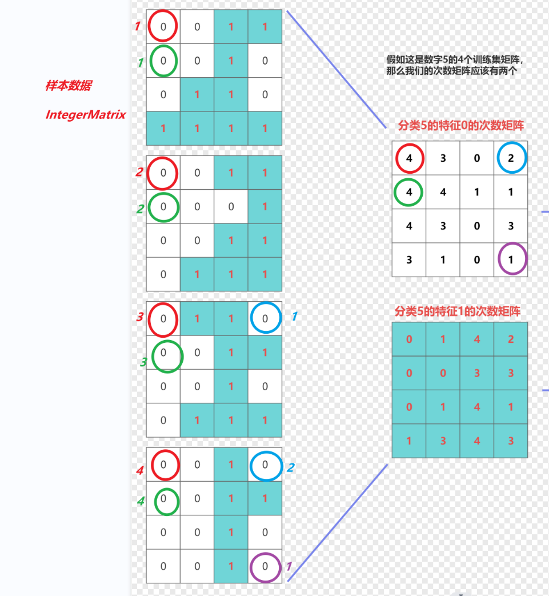

# 概率问题

正向概率、逆向概率

- 正向概率是指在知道事物比例的情况下，来计算某个事件出现的概率。
- 逆向概率是指不知道事物比例的情况下，而是通过一定的表面现象来预测某个事件出现的概率。


正向概率举例：

一个袋子里有10个球，其中7个是白球，3个是黑球。现在随机从袋中取出1个球，则取出白球的概率为：7 / (7 + 3) = 0.7。

逆向概率举例：

一个袋子有白球、黑球，但不知道数量及比例。伸手摸出一个球，观察几次后就能知道袋子黑白球比例。


天气预报、单词纠错、垃圾邮件等  

接下来我们以下图为案例来介绍一些概率的基础知识
<center>
	
</center>
## 联合概率

表示两个事件共同发生的概率，例如事件A与事件B同时发生，则表示为$P(A，B)$或$P(AB)$。

对于上面的八个物体，设事件A为从中取出圆形物体，事件B为从中取出红色物体，则联合概率P(A，B)=0.25。
$$
P(A,B) = 2/8 = 0.25
$$


## 边缘概率

边缘概率是指某个事件发生的概率，而与其它事件无关，它是由联合概率边缘化得到的，即在联合概率中，把最终结果不需要的事件合并成事件全概率而消失。

> > > > > > > > > > > > 比如A和B两个变量，如果仅统计A或者B变量，另外一个变量如同不存在一样，则称之为A或者B的边缘概率。为什么叫边缘呢？因为它出现在概率分布表格的边缘。

例如P(A，B1)表示事件A与事件B1同时发生的概率，P(A，B2)表示事件A与事件B2同时发生的概率，若事件B1与B2合在一起为B事件发生的全部情况，则A 的边缘概率P(A)=P(A，B1)+P(A，B2)。

以8个物体为例，A表示从中取出圆形物体，B1表示取出红色物体，B2表示取出蓝色，B3表示取出绿色，则A的边缘分布为P(A)=P(A，B1)+P(A，B2)+P(A，B3)=0.25+0.125+0.25=0.625，也就是从中取出圆形物体是概率P(A)=5/8=0.625。

再举个例子，比如男性单眼皮在总人群的概率为0.23，女性单眼皮在总人群的概率为0.23，那么单眼皮的概率为0.46

男性和女性是性别中的全部条件，单眼皮的边缘概率就是 男性单眼皮和女性单眼皮概率之和 


A

B = B1+ B2 + B3

AB = AB1+ AB2+ AB3

## 条件概率

条件概率，顾名思义就是在已知一个事件B发生的情况下，此时另一个事件A发生的概率，符号表示为$P(A|B)$，它等于联合概率P(A，B)除以边缘分布P(B)，即：
$$
P(A|B) = \frac{P(A,B)}{P(B)}
$$
或可以写成：

下面这个公式一定要牢牢记住。如果感觉理解不了，那么便带入到上述的红色圆形的案例中。
$$
P(A,B) = {P(A|B)}\cdot{P(B)}
$$
表示事件A，B联合概率等于在B发生的条件下A发生的条件概率乘以B事件发生概率。以8个物体为例，A事件表示取出圆形物体，B事件表示取出红色物体，则P(A|B)表示从红色物体中取出圆形的概率，数值为2/4=0.5；P(B)表示取出红色的概率，数值为4/8=0.5。所以事件A，B的联合概率为0.5×0.5=0.25，与事实相符。

可以继续推广(**要记住**)
$$
P(A,B,C) = P(A)·P(B|A)·P(C|A,B)
$$


由于P(A，B)也等于P(B|A)P(A) （P(A，B)与P(B，A)含义相同，数值相等），所以也有公式：
$$
P(A|B) = \frac{P(A,B)}{P(B)} = \frac{P(B|A)\cdot{P(A)}}{P(B)}
$$


$$
P(A,B) = P(A|B)P(B)
 \\
 P(A,B) = P(B|A)P(A)\\
 也就是 P(A|B)P(B) = P(B|A)P(A)\\
 两边都除以 P(B)\\
 贝叶斯公式 P(A|B) = \frac{P(B|A)·P(A)} {P(B)}
$$


## 特征条件独立

如果

B和C之间的特征条件独立，有以下公式

下面一共有两个公式，第一个公式只有在B和C的特征条件独立的情况下才可以推导出来。

第二个公式是我们根据贝叶斯公式可以推导出来的公式，但是如果想要变成第一个公式，那么必须满足B和C的特征条件独立。
$$
P(B,C|A)=P(B|A)·P(C|A)\\
P(B,C|A)=\frac{P(A,B,C)}{P(A)}=\frac{P(A)·P(B|A)·P(C|A,B)}{P(A)}=P(B|A)·P(C|A,B)
$$

在事件A发生的条件下，同时发生B，C的概率，如果B和C之间特征条件独立，那么该值为在事件A发生的条件下，发生B事件的概率和发生C事件的概率的乘积


假设B，C，D，E，F特征条件独立
$$
P(B,C,D,E,F|A) = P(B|A)·P(C|A)·P(D|A)·P(E|A)·P(F|A)
$$
假如我们的条件 X~1~，X~2~，X~3~，....,X~n~,这些条件**特征独立**，假如我们要求 在A事件的前提下，同时发生X~1~，X~2~，X~3~，....,X~n~的概率
$$
P(X_1,X_2,X_3,...,X_n|A) = P(X_1|A)·P(X_2|A)·P(X_3|A)···P(X_n|A)
$$


# 贝叶斯介绍

贝叶斯（Bayes）是英国数学家，生于1702年，去世于1763年，曾做过神父。他生前解决了一个“逆概”问题，即通过表面现象来预测某个事件出现的概率，这个解决问题的方法就是贝叶斯方法。

贝叶斯方法在概率论中影响深远，并将应用延伸到各个问题领域，所有需要作出概率预测的地方都可以见到贝叶斯方法的影子，特别地，贝叶斯是机器学习的核心方法之一。

## 贝叶斯(Bayes)

$$
P(A|B) = \frac{P(A)·P(B|A)}{P(B)}
$$


贝叶斯公式

> 先举一个例子
>
> 白猫和黑猫 各一半  ==> **P(白) = P(黑) = 1/2**
>
> 黑猫都是单眼皮，白猫一半单眼皮一半双眼皮  ==> **P(单眼皮|黑) = 1 ，  P(单眼皮|白)=1/2**  
>
> 如果发现一只单眼皮的猫，是白猫的概率有多大？  **P(白|单眼皮) = ？**    <span style='color:black;background:black;font-size:26px;font-family:楷体;'> 1/3</span>

如何算出来的呢


$$
\frac{1/2 * 1/2}{1/2+1/2*1/2}
$$
可以引入一个额外的变量，猫咪的总数为n，后面会删去，也就是
$$
P(白|单眼皮) =\frac{白猫的数量\cdot{P(单眼皮|白)}}{单眼皮的数量} = \frac{n\cdot{P(白)\cdot{P(单眼皮|白)}}}{n\cdot{P(单眼皮)}} =\frac{P(白)*P(单眼皮|白)}{P(单眼皮)}
$$
也就是
$$
P(A|B) = \frac{P(A)\cdot{P(B|A)}}{P(B)}
$$


再举一个例子，比如输入法我输入 `name`，有这样的几个推荐，这时候我想要知道最大概率会给我推荐哪个词汇？

也就是我们想要知道 P(那么|'name')和P(name|'name') 使用贝叶斯公式来看一下
$$
P(那么|'name') = \frac{P(那么)*P('name'|那么)}{P('name')}
$$

$$
P(name|'name') = \frac{P(name)*P('name'|name)}{P('name')}
$$

如果要比较两个的概率，可以将两个值相除，（两个值都是正数）如果值大于1则分子概率大，如果小于1则概率大
$$
如果\frac{P(那么|'name')}{P(name|'name')} > 1\\
则说明P(那么|'name')>{P(name|'name')}
$$

$$
\frac{P(那么|'name')}{P(name|'name')} = \frac{\frac{P(那么)*P('name'|那么)}{P('name')}}{\frac{P(name)*P('name'|name)}{P('name')}} = \frac{P(那么)*P('name'|那么)}{P(name)*P('name'|name)}
$$
P(那么)和P(name)通常是我们已经明确的概率，我们称之为**先验概率**，先验概率是指根据以往经验和分析得到的概率，比如十赌九输、某地每年下雨的概率

P('name'|那么)和P('name'|name)通常是我们系统中可以查询到的值，假设他两相同的情况下，那么我们最终比较的就是**P(那么)和P(name)**，也就是比较**先验概率**


```
name是英文单词名字的意思，我们在开发的过程中经常会使用到name，但是呢，我们在使用注释的过程中，经常会打印"那么"这样的词，这时候在IDEA中进行开发经常会选择错误，那么有时候我们就需要更智能的IDE来帮助我们识别name和那么。
那么这样的IDE现在能否实现呢，需要我们提供第三方的插件，这个插件的name叫 "文件纠正器"
```

在上面的小作文中出现 name的次数是多少：4次

在上面的小作文中出现“那么”的次数是多少：4词

出现name的概率和出现那么的概率是多少：4/139,4/139


> 练习题：
>
> 有3只箱子
>
> - 第1只箱子中有黑球3个，白球1个；
> - 第2只箱子中有黑球2个，白球3个；
> - 第3只箱子中有黑球3个，白球2个；
>
> 问题1：随机取1只箱子，从这只箱子中取出1个球，这个球为白球的概率是多少？ 
>
> 问题2：已知取出的球是白球，此球属于第3只箱子的概率是多少？


## 朴素贝叶斯(Naive Bayes)

*朴素贝叶斯*法（Naive Bayes model）是基于贝叶斯定理与特征条件独立假设的分类方法。

先举个例子

假如我们的事件有可能出现的结果分别为X、Y，而在生成X，Y的过程中会经过4个特征，假设其属性值分别为A、B、C、D

现在我们要计算 在ABCD的情况出现X，Y的情况，这时候我们应该求的应该是 P(?|?)  ==> <span style='color:black;background:black;font-size:15px;font-family:;'>P(X|A，B，C，D)、P(Y|A，B，C，D)</span>

​                             ||

​                             \/

`P(X|A，B，C，D)、P(Y|A，B，C，D) `

这时候比较这两个的值，如果P(X|A，B，C，D) 大于 P(Y|A，B，C，D) ，则出现ABCD四个值的时候结果为X的概率更大

为了比较这两个值，我们要使用到先验概率来计算这两个值，使用贝叶斯公式
$$
P(X|A,B,C,D) = \frac{P(X)P(A,B,C,D|X)}{P(A,B,C,D)}
$$

$$
P(Y|A,B,C,D) = \frac{P(Y)P(A,B,C,D|Y)}{P(A,B,C,D)}
$$
因为分母相同，我们比较P(X)P(A，B，C，D|X)  和 P(Y)P(A，B，C，D|Y)就是就能比较出对应的值

我们接着对P(A，B，C，D|X)进行换算
$$
P(A,B,C,D|X) = P(A|X)·P(B|A,X)·P(C|B,A,X)·P(D|C,B,A,X)
$$
接着基于条件独立假设，假设ABCD之间特征条件独立，也就是他们之间没有关系


> 说明：
>
> 特征条件独立假设是一个较强的假设，所以这样得到的贝叶斯定理称为朴素贝叶斯定理。
> 特征条件独立假设主要是为了解决参数成指数增长过多的问题。
>
> 

# 案例

接下来我们会先把上面的理论知识运用到解决西瓜问题上，通过西瓜问题进一步引到数字识别问题上

## 西瓜问题


接下来我们使用朴素贝叶斯的算法来判断一个西瓜是否是好瓜，我们的新样本数据 ==》 ` [青绿、稍蜷、浊响]`

我们要计算的是这两个概率
$$
P_1 = P(好瓜|青绿,稍蜷,浊响)
$$

$$
P_2 = P(坏瓜|青绿,稍蜷，浊响)
$$

如果是满足下面条件
$$
P_1 > P_2
$$
则应该是好瓜，反之则应该是坏瓜。

接下来我们使用贝叶斯公式来做转换
$$
P_1 = P(好瓜|青绿,稍蜷,浊响) = \frac{P(好瓜)·P(青绿,稍蜷,浊响|好瓜)}{P(青绿,稍蜷,浊响)}
$$

$$
P_2 = P(坏瓜|青绿,稍蜷,浊响) = \frac{P(坏瓜)·P(青绿,稍蜷,浊响|坏瓜)}{P(青绿,稍蜷,浊响)}
$$

由于P~1~和P~2~之间做比较的话，其分母相同，所以我们比较分子即可
$$
P(好瓜)·P(青绿,稍蜷,浊响|好瓜)
$$

$$
P(坏瓜)·P(青绿,稍蜷,浊响|坏瓜)
$$

接下来对分子做进一步的转换
$$
P(青绿,稍蜷,浊响|好瓜) = P(青绿|好瓜)·P(稍蜷|青绿,好瓜)·P(浊响|青绿,稍蜷,好瓜)
$$
假设 **色泽、根蒂、敲声** 这三个特征相互独立，接下来我们要使用朴素贝叶斯公式了
$$
P(青绿,稍蜷,浊响|好瓜) = P(青绿|好瓜)·P(稍蜷|好瓜)·P(浊响|好瓜)
$$
同理
$$
P(青绿,稍蜷,浊响|坏瓜) = P(青绿|坏瓜)·P(稍蜷|坏瓜)·P(浊响|坏瓜)
$$
那么要比较P~1~和P~2~就是比较这两个值
$$
P(好瓜)·P(青绿|好瓜)·P(稍蜷|好瓜)·P(浊响|好瓜)
$$

$$
P(坏瓜)·P(青绿|坏瓜)·P(稍蜷|坏瓜)·P(浊响|坏瓜)
$$

如果我们能够获得以上的这8个概率，我们就可以计算出两个结果，也就能获得P~1~和P~2~之间的大小，就可以预测新数据到底是好瓜和坏瓜


>  **上面的这些概率就是先验概率，那么如果我们要使用朴素贝叶斯的方法来构造模型，其实就是我们要计算类似的一些先验概率，如果有这些先验概率我们就可以完成预测**


接下来我们来构造模型，下面是是我们前面分析过的特征空间

>  **特征空间**：
>
> - 色泽：[青绿、乌黑]
> - 根蒂：[蜷缩、硬挺、稍蜷]
> - 敲声：[浊响、清脆、沉闷]

那么我们这个模型的组成应该是这样的

```
Model Watermelon{
	1. P(好瓜)、P(坏瓜)
  2. P(青绿|好瓜)、P(乌黑|好瓜)
     P(青绿|坏瓜)、P(乌黑|坏瓜)
  3. P(蜷缩|好瓜)、P(硬挺|好瓜)、P(稍蜷|好瓜)
     P(蜷缩|坏瓜)、P(硬挺|坏瓜)、P(稍蜷|坏瓜)
  4. P(浊响|好瓜)、P(清脆|好瓜)、P(沉闷|好瓜)
     P(浊响|坏瓜)、P(清脆|坏瓜)、P(沉闷|坏瓜)
}
```

## 思考

关于模型的思考，我们要通过这个思考来类推来数字识别问题上

> 假如我们要完成的是分类问题
>
> (1) 假如分类问题为X，分类的结果有n个，那么关于分类的结果就有 X~1~、X~2~、X~3~...X~n~
>
> - **关于分类我们需要计算的概率 P(X~1~)、P(X~2~)、P(X~3~)、...P(X~n~)**
>
> (2) 假设特征有 A、B、C， 每个特征分别包含的特征空间 有 m、p、q个，也就是
>
> 关于A的特征空间【A~1~，A~2~...A~m~】，
>
> 关于B的特征空间【B~1~，B~2~...B~p~】，
>
> 关于C的特征空间【C~1~，C~2~...C~q~】
>
> - **关于特征我们需要计算的概率共 mn + pn + qn ，接下来画个表格来看**
>
> 我们这个模型需要的概率值一共有多少个
>
> n + mn + pn + qn


<center>
	
	
  
</center>
> 如果有这样的一个样本数据[A~5~,B~234~,C~67~]这样的一个样本数据，它是哪一个X~?~，我们应该计算哪一些值，我们应该比较哪一些值
>
> $P(X_1|A_5,B_{234},C_{67})$ 代言人 $P(X_1)·P(A_5|X_1)·P(B_{234}|X_1)·P(C_{67}|X_1)$
>
> $P(X_2|A_5,B_{234},C_{67})$ 代言人$P(X_2)·P(A_5|X_2)·P(B_{234}|X_2)·P(C_{67}|X_2)$
>
> $P(X_3|A_5,B_{234},C_{67})$ 代言人$P(X_3)·P(A_5|X_3)·P(B_{234}|X_3)·P(C_{67}|X_3)$
>
> $P(X_{n-1}|A_5,B_{234},C_{67})$ 代言人$P(X_{n-1})·P(A_5|X_{n-1})·P(B_{234}|X_{n-1})·P(C_{67}|X_{n-1})$
>
> $P(X_n|A_5,B_{234},C_{67})$ 代言人$P(X_n)·P(A_5|X_n)·P(B_{234}|X_n)·P(C_{67}|X_n)$
>
> 分母是一样的$P(A_5,B_{234},C_{67})$ ，给它略去


也就是我们解决这几个问题

> 1. 对预测结果的分类，确定都有哪些结果，比如好瓜、坏瓜
> 2. 提取特征，比如色泽根蒂和敲声
> 3. 提取特征空间，比如色泽[青绿、乌黑]
> 4. 根据上面的值在生成模型
> 5. 根据模型生成每个分类值的概率相关值，值大者为预测结果

接下来我们来看数字识别问题

## 数字识别问题分析

根据我们上面的思考过程来完成预测


### 预测结果分类

根据我们的训练数据，我们的数字(Digits)所有的可能性为 `0，1，2，3，4，5，6，7，8，9`

那么我们要计算 P(Digits~0~)，P(Digits~1~)，P(Digits~2~) ... P(Digits~9~)

要计算这些值需要大家根据训练集数据对应的标记`trainlabels`来完成，这里我们可以遍历其中的所有的数据，获得每个结果出现的次数

然后根据每个结果出现的次数，以及训练集的总的数据量，计算出该结果的概率

比如，共1000个标记，其中 数字0出现的次数为98，那么计算的先验概率 P(Digits~0~) = 98/1000 = 0.098

而我们需要将这些数字对应的先验概率都求出来，可以放到List或Map中

接下来这部分会涉及到补全代码 （todo: 4-3-1）

### 提取特征

我们这里的数据其实是一个矩阵 28*28的矩阵

我们可以考虑将28*28的矩阵中的每个点作为其特征，也就是共784个特征点

### 提取特征空间

28*28矩阵上每个像素点能够出现的值 为 【0,1,2】，这里我们可以针对于训练数据做一个归一化，

- 当值为0时，让其值为0
- 当值为1或2时，让其值为1

<small>(归一化是将一组数据按照比例缩放，使之落入一个小的特定区间内。归一化可以消除数据特征之间的量纲差异，使得每个特征在权重计算中起到相同的作用，同时还可以增加算法的收敛速度，提高模型的预测精度。)</small>

<center>
	
</center>
每个特征点上能够出现的值就是0或1，那么特征空间就是`【0,1】`

### 模型

接下来就是我们要进一步计算每一个特征下的每一个特征空间在每一个分类值下的概率

P(P~1~为1|Digit~5~) P(P~1~为0|Digit~5~)

P(P~765~为1|Digit~5~) P(P~765~为0|Digit~5~)

P(P~784~为1|Digit~5~) P(P~784~为0|Digit~5~)

比如针对于分类值5，我们要计算这784个特征点下，在分类值为5的情况下，这784个特征点每个点下出现1的概率和出现0的概率 也就是 共 `784*2`个概率

那么针对于所有的分类共 `784*2*10`个概率值

加上我们前面的分类的概率 共 `784*2*10 + 10`个概率值


接下来我们来思考这里的一个**重点问题** ==>

> 1. 每个分类下 每个点的 特征值1的概率和特征值0的概率 如何计算？
>
>    1. 比如我们要计算分类值 5下的 坐标为14,23下为1的概率 P(坐标14,23的值为1|Digits~5~)，
>    2. 首先我们要计算出分类值5出现的次数，比如434次
>    3. 接着呢我们要找到这434个标记值为5的矩阵
>    4. 找到这434个矩阵中的 坐标为 14,23 的点，统计1出现的次数，统计0出现的次数，假如1出现的次数254，而0出现的次数为180
>    5. 在分类值5下，14,23这个点出现1的概率为 254/434,出现0的概率为180/434
>
> 2. 我们计算所有的概率采用一个什么样的数据结构来存储这些数据？先来看示意图
>
>    
<center>
 	
</center>
<span style='color:yellow;background:red;font-size:36px;font-family:微软雅黑;'>**思路1**</span>


按照该思路进行封装


<span style='color:yellow;background:red;font-size:36px;font-family:微软雅黑;'>**思路2**</span>


分析：

1. 最底层的是概率矩阵，也就是 28*28的矩阵，每个点存储的是概率数据
2. 概率矩阵是由次数矩阵做除法运算而来的，这里需要做矩阵的除法运算，可以做一个todo
3. 次数矩阵是统计所有的矩阵中0和1出现的次数而来的，这里画一个示意图（以4*4矩阵为例）如下


分类值0的次数统计



特征值1的次数矩阵的统计


次数矩阵到概率矩阵的换算

### 使用模型

接下来就是激动人心的使用模型环节

假如有这样的样本数据


我们使用上面的模型，我们要分别计算 0,1,2,3,4,5,6,7,8,9每个的相关概率值，我们上面获得了5的概率矩阵，那么我们以5为例来做一个相关概率值的计算


选择概率矩阵中的这些值


$$
比较值 = P(Digit_5)\prod \limits_{i = 1}^{16} P_i
$$
这时候有两个问题：`1. 其中在第一列第二行中的概率值为0，会导致计算结果为0； 2.多个概率计算会导致值急剧变小，导致计算精度损失`

先解决第1个问题，我们可以在两个次数矩阵上面都加上一个平滑度的值，比如定义的k=0.5，那么我们的次数矩阵可以这样子变换 


接着解决第2个问题，将多个值的乘积比较，转换为多个值之和的比较，使用log计算结果来比较，比如要比较a·b·c 和 x·y·z
$$
lg a·b·c → \lg a + \lg b + \lg c
$$

$$
lg x·y·z → \lg x + \lg y + \lg z
$$

$log_{10} 100 = lg100 = 2$      因为 10^2^ = 100

$lg 10000 = 4$
$$
lg 10000 = lg (100 * 100) = lg 100 + lg 100 = 2 + 2 = 4
$$


做了log~10~计算之后，我们比较这些值之和即可
$$
比较值 = P(Digit5)\prod \limits_{i = 1}^{16} P_i → \lg P(Digit5) + \sum \limits _{i = 1}^{16}\lg P_i
$$

如果我们的数字 有 n来代表，n的取值为0~9
$$
比较值 = P(Digit_n)\prod \limits_{i = 1}^{16} P_i → \lg P(Digit_n) + \sum \limits _{i = 1}^{16}\lg P_i
$$


### 校验并统计

使用

`validationimages`数据进行数据识别

首先我们做分类（结果预测），将预测的结果可以放到一个List中，而我们在前面的准备工作中，将`validationlabels`读取的数据也放在一个List中，我们可以将这两个List中相同位置的值做比对，统计我们预测的准确率

> 比如预测结果和标记结果分别为
>
> 预测结果：7,2,6,5,3
>
> 标记结果：7,1,6,5,3

那么我们的预测的准确率为`80%`,当然实际我们的预测数据更多一些

## 代码实现

接下来就到了喜闻乐见的补全代码环节了

<span style='color:blue;background:orange;font-size:20px;font-family:微软雅黑;'>**todo:4-3-1 补全Counter中的分类出现次数以及概率**</span>
<span style='color:blue;background:orange;font-size:20px;font-family:微软雅黑;'>**todo:4-3-2 定义能够数据容器（参考模型那里的两个思路）**</span>

1. 容纳次数相关矩阵数据的 counterFeatureMatrix
2. 容纳概率相关矩阵数据的 probabilityFeatureMatrix

<span style='color:blue;background:orange;font-size:20px;font-family:微软雅黑;'>**todo:4-3-3 遍历样本数据集，填充次数矩阵**</span>

1. 先遍历数据集，遍历过程中，根据标记集拿到当前矩阵的分类值
2. 然后遍历矩阵，遍历指遍历每一个点，根据该点的特征值为0还是1，找到 0或1的特征矩阵的指定位置，做次数相加


<span style='color:blue;background:orange;font-size:20px;font-family:微软雅黑;'>**todo:4-3-4 遍历特征0和1各自的 次数矩阵，在次数矩阵的每个点的位置都加k**</span>

1. 获得k的值
2. 遍历counterFeatureMatrix，分别遍历到特征为0和特征为1的Map
3. 根据map的key，也就是分类值(0,1,2...9)继续遍历，获得IntegerMatrix
4. IntegerMatrix下的每个点都增加上k

<span style='color:blue;background:orange;font-size:20px;font-family:微软雅黑;'>**todo:4-3-5 生成概率矩阵，数量矩阵中每个点的数值 除以 （该分类值在训练数据集中出现的次数 + 2k）**</span>

1. 初始化概率矩阵
2. 遍历计数矩阵，计算概率值 = 计数/（该分类值在训练数据集中出现的次数 + 2k） ，在对应的位置为概率矩阵填值

<span style='color:blue;background:orange;font-size:20px;font-family:微软雅黑;'>**todo:4-3-6 根据样本数据中的每一个点去每一个分类值相关的概率值，做lg计算后相加，再加上分类值的先验概率的lg值，放到Map中，然后获取其中的最大值对应的分类值**</span>

1. 针对于单个样本数据
2. 获得所有的有效分类值【0,1,2...9】，然后进行遍历，每次遍历都要获得一个 累加值，分类值作为Key，累加值作为value
3. 累加值的第一部分，先获得分类值的先验概率，然后做lg计算
4. 遍历样本数据的每一个像素点，根据像素的点的值为0还是1，结合当前分类值，选择对应的概率矩阵
5. 然后在根据样本数据当前点的坐标，在概率矩阵中的相同坐标中找到对应的概率值
6. 找到的概率值做log计算后，也进行累加
7. 将当前分类值作为key，累加值作为value放入到Map中
8. 获得的Map，根据value的最大值获得对应的key就是我们的预测值

<span style='color:blue;background:orange;font-size:20px;font-family:微软雅黑;'>**todo:4-3-7 在Map中找到value最大值，找到他对应的key**</span>

<span style='color:blue;background:orange;font-size:20px;font-family:微软雅黑;'>**todo:4-3-8 比对预测结果列表和标记列表**</span>

<span style='color:blue;background:orange;font-size:20px;font-family:微软雅黑;'>**todo:4-3-9(选做)在测试数据中找到第一个不符合预期的并打印其原始数据**</span>

```
第1个数据识别错误
预测值为：7; 实际为：9
image
                            
                            
                            
                            
                            
                            
                            
             ++###+         
             ######+        
            +######+        
            ##+++##+        
           +#+  +##+        
           +##++###+        
           +#######+        
           +#######+        
            +##+###         
              ++##+         
              +##+          
              ###+          
            +###+           
            +##+            
           +##+             
          +##+              
         +##+               
         ##+                
        +#+                 
        +#+                 
                            

```

## 小结

我们这里其实就是提取特征，然后获得其特征空间，然后根据朴素贝叶斯方法来对比分类之间的概率，预测结果

这个过程中大家也需要关注一件事，就是如何来存储对应的数据信息

接下来我们换一个算法和模型，采用感知机来预测结果

