# 数学知识

## 符号函数

符号函数（一般用sign(x)表示）是很有用的一类函数，符号函数 能够把函数的符号析离出来 。

**在数学和计算机运算中，其功能是取某个数的符号（正或负）：**

当x>0，sign(x)=1;

当x=0，sign(x)=0;

当x<0， sign(x)=-1；

**在通信中，sign(t)表示这样一种信号：**

当t≥0，sign(t)=1; 即从t=0时刻开始，信号的幅度均为1；

当t<0， sign(t)=-1；在t=0时刻之前，信号的幅度均为-1

## 输入空间和输出空间

输入空间(input space)：输入所有可能取值的**集合**

输出空间(output space)：输出所有可能取值的**集合**

>  举个例子，我们要对 0~99这些数字对3取余，那么针对于这个案例
>
> - 输入空间：0,1,2,3,4,5...97,98,99
> - 输出空间：0,1,2

## 内积

内积（点积）是指接受在实数R上的两个向量并返回一个实数值标量的二元运算。

两个向量a = [a1, a2,…, an]和b = [b1, b2,…, bn]的内积（点积）定义为：$a·b=a₁b₁+a₂b₂+……+aₙbₙ$。

a和b都是n维空间

## L2范式

L2范式其实就是指的是向量各元素的平方和然后再次进行平方根运算。

比如描述的是向量 $w$ ,对应的值为$(w_1,w_2,w_3,...,w_n)$

$$
||w|| = \sqrt{w_1^2 + w_2^2 + ... + w_n^2}
$$

## 损失函数

损失函数是用来评价模型的预测值与真实值的不一致程度，它是一个非负实值函数。

一般来说，我们在进行机器学习任务时，使用的每一个算法都有一个目标函数，算法便是对这个目标函数进行优化，特别是在分类或者回归任务中，便是使用损失函数作为其目标函数。机器学习的目标就是希望预测值与实际值偏离较小，也就是希望损失函数较小，也就是所谓的最小化损失函数。损失函数越小，模型的性能就越好。

# 感知机(Perceptron)介绍

受大脑启发的人工智能程序的一个早期例子便是感知机（Perceptron），是Frank Rosenblatt在1957年提出，是神经网络与支持向量机的基础。它被视为一种最简单形式的前馈神经网络，是一种二元线性分类器。

为了模拟神经细胞的行为，与之对应的感知机的概念被提出，如权重(突触)、偏置(阈值)以及激活函数(细胞体)。对于计算机科学家或者心理学家来说，信息在神经元中的处理过程可以通过一个有多个输入和一个输出的计算机程序（感知机）进行模拟。

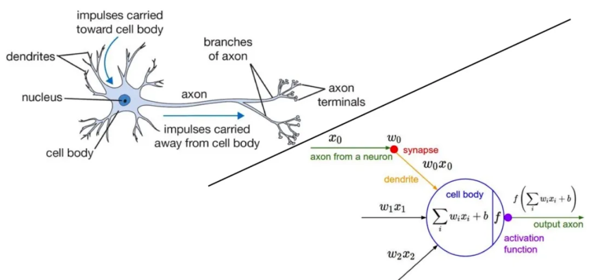

上图左侧展示了一个神经元及其树突（为细胞带来输入信号的结构）、胞体和轴突（即输出通道）；右侧展示了一个简单的感知机结构。与神经元类似，感知机将其接收到的输入信号相加，如果得到的和等于或大于感知机的阈值，则感知机输出1（被激活），否则感知机输出0（未被激活）。

为了模拟神经元的不同连接强度，罗森布拉特建议给感知机的每个输入分配一个权重，在求和时，每个输入在加进总和之前都要先乘以其权重。感知机的阈值是由程序员设置的一个数字，它也可以由感知机通过自身学习得到。

感知机利用梯度下降法对损失函数进行极小化，提出可将训练数据进行线性划分的分离超平面，从而求得感知机模型。

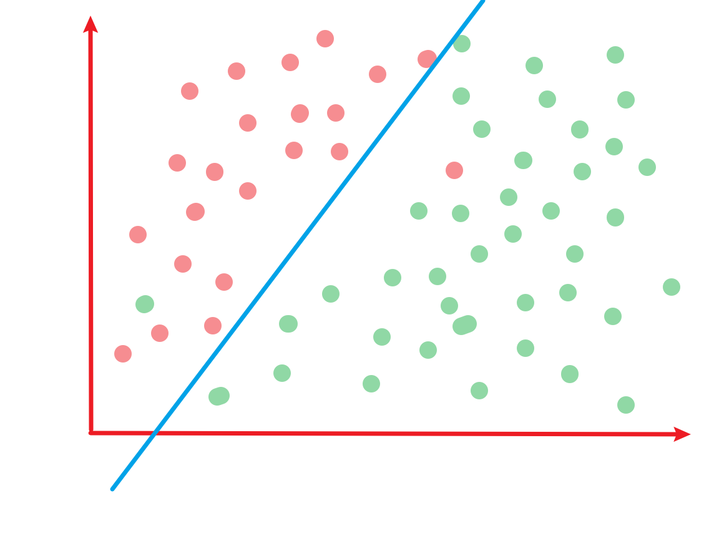

感知机（perceptron）是二类分类的线性分类模型，其输入为实例的特征向量，输出为实例的类别，取+1和-1二值。

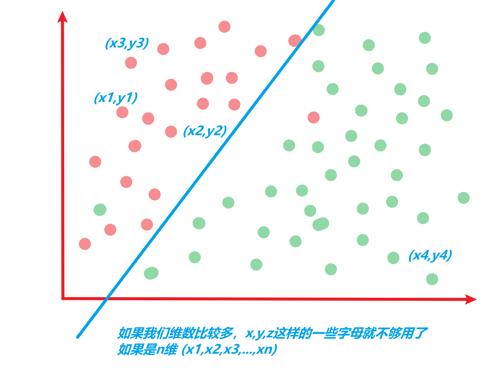

感知机做的事情，其实就是对n维空间下的点进行分类，一类结果为+1，一类结果为-1

## 感知机模型

假设输入空间（特征空间）是$x\subseteq R^n$，，输出空间是$y={+1,−1}$。由输入空间到输出空间的如下函数：
$$
f(x)=sign(w⋅x+b)
$$

称为感知机。

三维空间 sign(ax~1~+bx~2~+c)   →  继续 sign(ax~1~+bx~2~+cx~3~+d)   → w(a,b,c)

其中， $w$和$b$为感知机模型参数， $w\in R^n$叫做权值（weight）或权值向量（weight vector）， $b\in R$叫做偏置（bias）， *w⋅x* $\in$表示 w和x的内积。 sign是符号函数，即：
$$
sign(x)=\begin{cases}    +1, \quad \text x≥0 \\    -1, \quad \text{x ＜ 0} \end{cases}
$$

如果w是n维的向量，我们来描述w就是$(w_1,w_2,w_3,...,w_n)$,$w$和$x$的内积
$$
w\cdot x = w_1x_1+w_2x_2+w_3x_3 + ...+w_nx_n
$$

感知机是一种线性分类模型，属于判别模型。感知机的几何解释：线性方程
$$
w⋅x+b=0
$$
对应于特征空间 $R^n$中的一个超平面，其中 $w$是超平面的法向量，$b$是超平面的截距。这个超平面将特征空间划分为两个部分。该超平面 $S$被称为分离超平面（separating hyperplane）。

> 

> 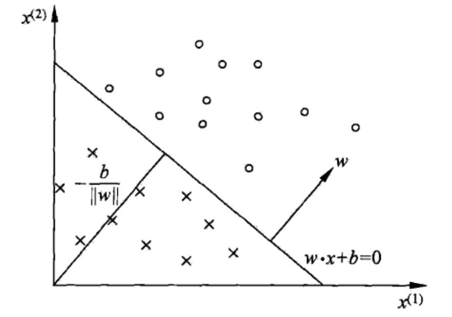
> 

**做一些解释**

1. 如果是在2维的空间里，我们通常列的公式是 $y = ax + b$,其实我们可以做一个转换就是 $ax - y + b = 0$，比如 $y = 2x - 2$ 可以写成 $2x-y-2 = 0$，那么我们也可以写成

$$
ax + by + c = 0
$$

其实上面的公式描述的是一条线，通过这条线可以将这个二维的空间划成两部分，举个例子你要将一张纸一分为二，需要一条线，这条线其实就可以称之为超平面

2. 如果是在3维的空间里，我们通常列的公式是 $z = ax + by + c$，做和上面类似的转换 $ax + by - z + c = 0$，同理我们也可以写成

$$
ax+by+cz + d = 0
$$

其实上面的公式描述的就变为一个面，通过这个面可以将这个三维空间划成两部分，举个例子你要将一个正方体一分为二，需要一个面，这个面其实也是超平面。

3. 上面的R^n^其实大家可以理解为一个n维的空间，那么我们可以列的公式(xyz,abc这些值其实不太够用，那么我们在这里用下标来表示)
   $$
   w_1x_1+w_2x_2+...+w_nx_n + b = 0
   $$
   $w_1,w_2,w_3,...,w_n对应的就是前面所写的abc$；
   
   $x_1,x_2,x_3,...,x_n对应的就是前面所写的xyz$
   
   采用内积的写法就是
   $$
   w·x + b = 0
   $$
   这里其实描述也是一个超平面，超平面的一边的点对应的结果都是 + 1 ，另一边对应的点对应的结果都是 -1 

以接下来这图为例

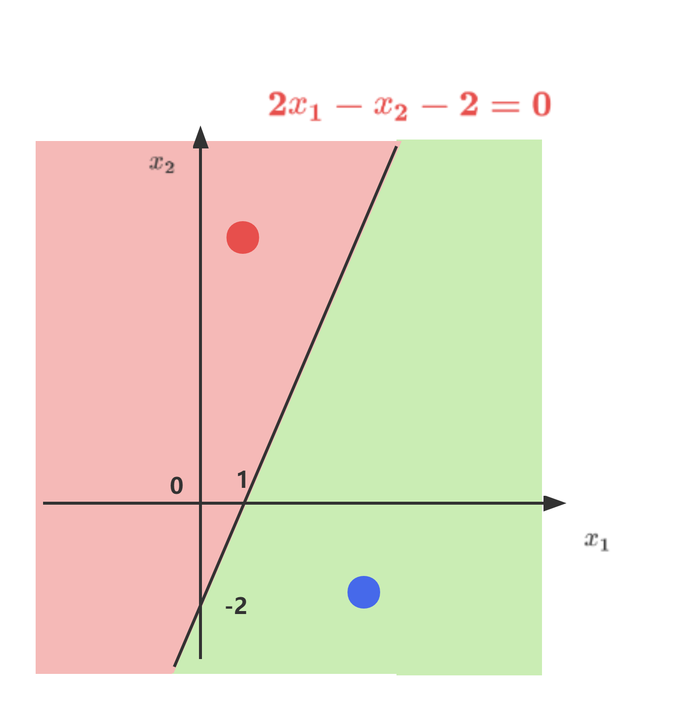

$2x_1 - x_2 - 2 = 0 $其实就是二维空间超平面，对应的法向量其实可以取 x~1~和x~2~的前面的数字，也就是 (2,-1),这个点在坐标系中的位置如下

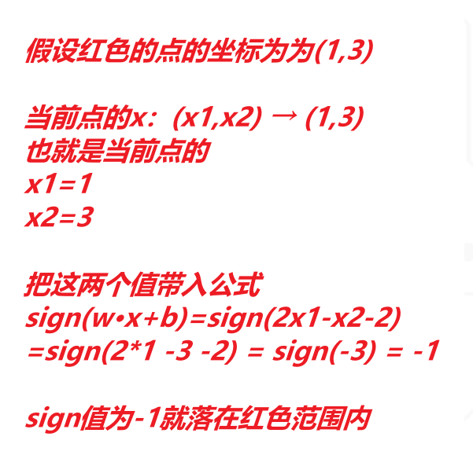

 

 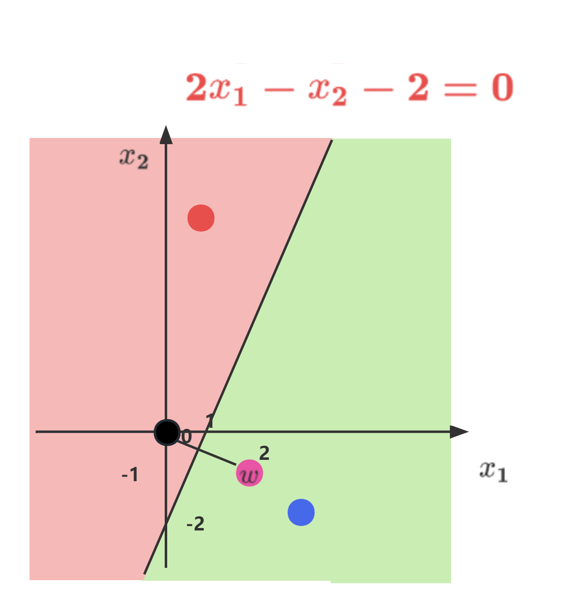
 

连接原点和(2,-1)这个方向的向量都是法向量，而法向量其实是一个垂直于超平面的向量。

我们去求一个感知机，要获得一个感知机的模型，就是要知道，在这个模型下

$w$： $(w_1,w_2,w_3,...,w_n)$ 比如 $(2,3,10,5,6,3,2)$ 和$(4,6,20,10,12,6,4)$ 都是同一个超平面的法向量

## 感知机学习策略

假设训练数据集是线性可分的，感知机学习的目标是求得一个能够将训练集正实例点和负实例点完全正确分开的分离超平面。

为了找出这样一个超平面，需要确定一个学习策略，即定义（经验）损失函数并将损失函数极小化。

损失函数的一个自然选择是**误分类点**的总数，但是这样的损失函数不是参数w，b的连续可导函数，这种选择不易优化，故感知机采用的是误分类点到超平面S的距离。

> 下图的(0,0)，(4,2)这个点可以作为误分类点
>
> 
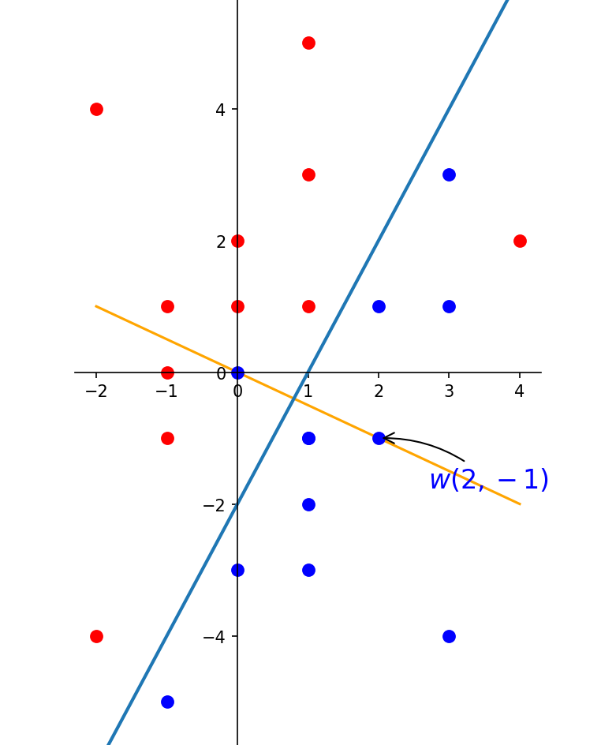

由此先确定输入空间R^n^ 中的一点x^0^ (x~1~^0^,x~2~^0^,x~3~^0^,...,x~n~^0^)(注意这里的x^0^指的是输入空间，比如2维里的输入空间的值<2,3>,3维里的输入空间的值可以为<2,5,7>)到超平面的几何间隔为：
$$
\frac {1}{||w||}|w\cdot {x^0} + b |
$$
这里，‖w‖是w的L2范数。
$$
||w|| = \sqrt{w_1^2 + w_2^2 + ... + w_n^2}
$$

> 举个例子，以上面这个图为例
>
> 计算(0,0) 这个点到这条线的距离 $length = \frac {|2*0 - 1*0 -2|} {\sqrt {2^2+1^2}} = \frac{2\sqrt5}{5}$ 
>
> 

> 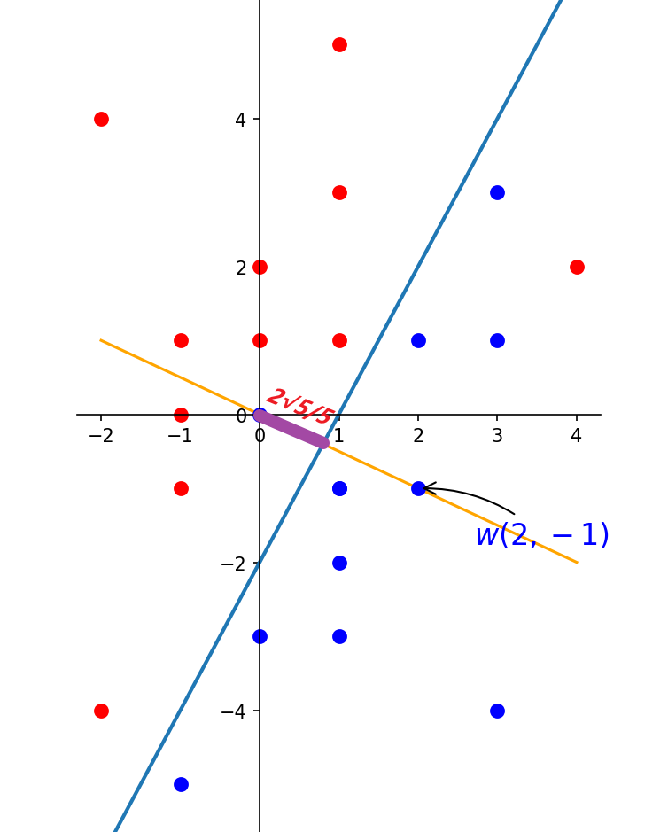
> 

>
> 

在超平面$w\cdot{x}+b=0$确定的情况下，$|w\cdot{x}+b|$能够表示点x到距离超平面的远近。
其次对于误分类的数据（x~i~,y~i~）来说，$−y_i(w.x_i+b)>0$成立。

因为针对于误分类点，当$w.x_i+b>0$时，$y_i=−1$;而当$w.x_i+b<0$时，$y_i=+1$。也就是$y_i$ 和$w\cdot{x}$符号相反,因此，误分类点x^i^到超平面S的距离为：
$$
-\frac {1}{||w||}y^i(w\cdot {x^i} + b )
$$

举个例子，接下来我们来考虑一个点的分布，比如（2,0）这个点处于绿色的区域，$(x^i,y^i)$数据就是 $(2,0,+1)$ ，那么绿色区域的公式就为 
$$
2x_1 - x_2 -2 > 0
$$

假如(0,0)这个点应该分在红色区域，然而被误分到了蓝色区域，这个点就是误分类点，$(x^i,y^i)$数据就是 $(0,0,+1)$，这个点到超平面的距离
$$
length = - \frac{1}{\sqrt{2^2 + 1^2}}*1*(2*0-1*0-2)=\frac{2\sqrt5}{5}
$$

这样，假设超平面S的误分类点集合为M，那么所有误分类点到超平面S的总距离为
$$
-\frac {1}{||w||}\sum \limits _{x^i \in M}y^i(w\cdot {x^i} + b )
$$

不考虑$\frac {1}{||w||}$,就得到感知机学习的损失函数。

也就是说给定训练数据集
$$
T = \{ (x^1,y^1),(x^2,y^2),...(x^N,y^N) \}
$$
上面的N指的是数据量，n指的是n维空间

其中$x_i \in X = R^n$ , $y_i \in Y = \{+1,-1\}$, $i = 1,2,...,N$。

针对于$x^1$就是一个n维向量 $（x^1_1,x^1_2,x^1_3,...,x^1_n）$

感知机 $f(x) = sign(w·x + b)$学习的损失函数定义为
$$
L(w,b) = - \sum \limits _{x^i \in M}y^i(w·x^i + b)
$$
> 
>
> 
>
> 举个例子
>
> 

>
> 这个图中的误分类点是(0,0)和(4,2),那么我们应该获得的损失函数相关的值
>
> 
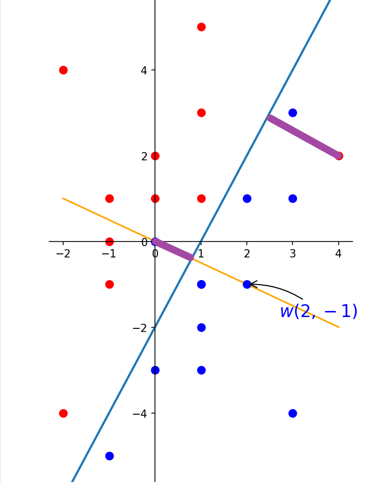

>
> 我们这里求的损失函数就是求紫色线相关的区域
>
> y~(0,0)~ = 1
>
> y~(4,2)~ = -1
>
> 损失函数L = -1 * (2\*0-0 - 2)  + -(-1)*（2\*4 - 2 - 2） = 6
>
> 

其中M为误分类点的集合。这个损失函数就是感知机学习的经验风险函数。显然，损失函数$L（w,b）$是非负的。如果没有误分类点，损失函数值是0。而且，误分类点越少，误分类点离超平面越近，损失函数值就越小。一个特定的样本点的损失函数：在误分类时是参数$w，b$的线性函数，在正确分类时是0。因此，给定训练数据集T，损失函数$L（w,b）$是$w，b$的连续可导函数。感知机学习的策略是在假设空间中选取使损失函数式最小的模型参数 $w,b$,即感知机模型。

y=x^2^+5x+6

求导 y^'^=2x+5

## 模型

感知机学习算法是对以下最优化问题的算法，给定训练数据集
$$
T = \{ (x^1,y^1),(x^2,y^2),...(x^N,y^N) \}
$$
其中$x_i \in X = R^n$ , $y_i \in Y = \{+1,-1\}$, $i = 1,2,...,N$。感知机 $f(x) = sign(w·x + b)$学习的损失函数定义为
$$
L(w,b) = - \sum \limits _{x_i \in M}y_i(w·x_i + b)
$$
感知机学习算法是误分类驱动的，具体采用随机梯度下降法（stochastic gradient descent）。首先，任意选取一个超平面$w_0,b_0$，然后用梯度下降法不断地极小化目标函数（2.5）。极小化过程中不是一次使M中所有误分类点的梯度下降，而是一次随机选取一个误分类点使其梯度下降。

假设误分类点集合$M$是固定的，那么损失函数$L(w,b)$的梯度由
$$
\nabla_wL(w,b) = - \sum \limits _{x_i \in M}y_ix_i
$$

$$
\nabla_bL(w,b) = - \sum \limits _{x_i \in M}y_i
$$

给出。

> 相当于对w和b分别做求导

随机选取一个误分类点($x^i,y^i$)，对$w,b$进行更新：
$$
w ← w + ηy^ix^i
$$

$$
b ← b + ηy^i
$$

式中η(0＜n≤1)是步长，在统计学习中又称为学习率(learn rate)。这样，通过迭代可以期待损失函数$L(w,b)$不断减小，直到为0。综上所述，得到**如下算法**

比如我们是一个n维(n取4为例)的空间，我们要就算的超平面
$$
w_1x_1+w_2x_2 + w_3x_3 + w_4x_4+b = 0
$$
假如我们一共提供的训练数据为 x^1^,x^2^,x^3^,x^4^,x^5^,x^6^提供这6个训练数据，对应的y^1^,y^2^,y^3^,y^4^,y^5^,y^6^,

假如x^1^对应的向量为$(x^1_1,x^1_2,x^1_3,x^1_4)$ ,假如它对应的$y^1 = 1$

假如x^2^对应的向量为$(x^2_1,x^2_2,x^2_3,x^2_4)$ ,假如它对应的$y^2 = -1$

...

假如x^6^对应的向量为$(x^6_1,x^6_2,x^6_3,x^6_4)$ ,假如它对应的$y^6 = -1$

假如针对于x^1^我们使用当前的感知机公式进行运算，w向量应该也是一个n维的向量，$w向量 (w_1,w_2,w_3,w_4)$,我们来做感知机的计算
$$
sign(w·x+b) = sign(w_1x^1_1+w_2x^1_2 + w_3x^1_3 + w_4x^1_4+b) = -1
$$
假如上面的公式计算的结果为-1，而我们的y^1^=1,说明x^1^在当前的感知机下被误分类了。

假如当前$w：(w_1,w_2,w_3,w_4)$ 为 （5,6,3,9），假如b为5

​       当前$x^1:(x^1_1,x^1_2,x^1_3,x^1_4)$ 为 (3,7,5,9)

调整$w和b$
$$
w_1 = 5 + 1*1*3 = 8\\
w_2= 6 + 1*1*7 = 13\\
w_3= 3+ 1*1*5=8\\
w_4= 9+1*1*9=18\\
b= 5+1*1=6
$$
经过x^1^这个误分类点之后，$w:(w_1,w_2,w_3,w_4)$ 为 （8,13,8,18）,b为6

## 算法

输入：训练数据集$T = \{ (x^1,y^1),(x^2,y^2),...(x^N,y^N) \}$，其中$x^i \in X = R^n$ , $y^i \in Y = \{+1,-1\}$, $i = 1,2,...,N$；学习率$η(0＜η≤1)$；

输出：$w,b$感知机模型 $f(x) = sign(w\cdot x + b)$。

1. 选取初值 $w^0,b^0$;
2. 在训练集中选取数据($x_i，y_i$)
3. 如果$y_i(w\cdot x_i + b)≤ 0$ 也就是当前点为误分类点

$$
w ← w + ηy_ix_i
$$

$$
b ← b + ηy_i
$$

4. 转至2，直至训练集中没有误分类点。

这种学习算法直观上有如下解释：当一个实例点被误分类，即位于分离超平面的错误一侧时，则调整$w，b$的值，使分离超平面向该误分类点的一侧移动，以减少该误分类点与超平面间的距离，直至超平面越过该误分类点使其被正确分类。

# 案例

## 分类案例

### 问题描述

所示的训练数据集，其正实例点是$x_1=(3,3)^T$，$x_2=(4,3)^T$，负实例点是$x_3=(1,1)^T$，试用感知机学习算法的原始形式求感知机模型$f（x）=sign（w·x+b）$。这里，$w=(w^{(1)},w^{(2)})^T$，$x=(x^{(1)},x^{(2)})^T$。

### 分析

由于$w=(w^{(1)},w^{(2)})^T$，$x=(x^{(1)},x^{(2)})^T$ ，那么我们得到的超平面 会是 
$$
w^{(1)}x^{(1)} + w^{(2)}x^{(2)} + b = 0
$$
也就是我们要最终获得 $w^{(1)},w^{(2)},b$这几个的值，这几个的值的计算要通过上述的算法来进行修正
$$
w ← w + ηy_ix_i
$$

$$
b ← b + ηy_i
$$

先假设学习率η = 1，假设$w^{(1)} = 0,w^{(2)} = 0,b = 0$ 然后我们开始遍历

**第1次遍历**，我们先遍历$x_1$这个点，这时候 $w·x+b = 0$ ，和预期不符，我们来进行修正

$w^{(1)} = w^{(1)} + ηy_1x^{(1)}_1  = 0 + 1 * (+1) * 3 = 3$ 

$w^{(2)} = w^{(2)} + ηy_1x^{(2)}_1  = 0 + 1 * (+1) * 3 = 3$

$b = b + y_1 = 0 + (+1) = 1$

故修正后的超平面为 **$3x^{(1)} + 3x^{(2)} + 1 = 0$**

接着使用$3x^{(1)} + 3x^{(2)} + 1$ 遍历$x_2=(4,3)^T$, 获得的结果大于0，和正实例点的预期相符，不做修正

接着使用$3x^{(1)} + 3x^{(2)} + 1$ 遍历$x_3=(1,1)^T$，获得的结果大于0，和负实例点的预期不符，这里做修正，当做是第2次遍历

**第2次遍历**，点$x_3=(1,1)^T$，  $y_3 = -1$ , $w^{(1)} = 3,w^{(2)} = 3 ,b = 1$修正如下

$w^{(1)} = w^{(1)} + ηy_3x^{(1)}_3  = 3 + 1 * (-1) * 1 = 2$ 

$w^{(2)} = w^{(2)} + ηy_1x^{(2)}_3  = 3 + 1 * (-1) * 1 = 2$

$b = b + y_3 = 1 + (-1) = 0$

故修正后的超平面为 **$2x^{(1)} + 2x^{(2)}  = 0$**

继续遍历，直到仍然是$x_3$不符合预期

**第3次遍历**，点$x_3=(1,1)^T$，  $y_3 = -1$ , $w^{(1)} = 2,w^{(2)} = 2 ,b = 0$修正如下

$w^{(1)} = w^{(1)} + ηy_1x^{(1)}_3  = 2 + 1 * (-1) * 1 = 1$ 

$w^{(2)} = w^{(2)} + ηy_1x^{(2)}_3  = 2 + 1 * (-1) * 1 = 1$

$b = b + y_3 = 0 + (-1) = -1$

故修正后的超平面为 **$x^{(1)} + x^{(2)} - 1  = 0$**

下面的迭代如图所示

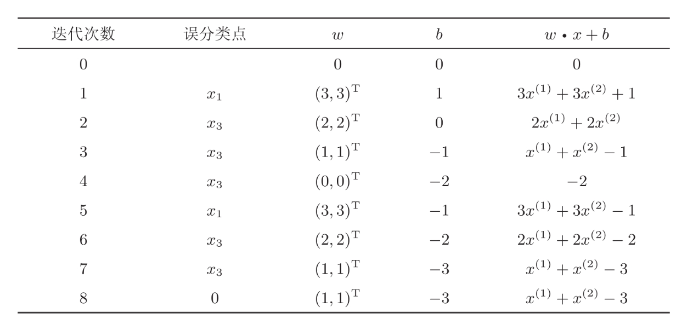

最终修正公式 **$x^{(1)} + x^{(2)} - 3  = 0$** 时所有的点都符合预期，此时停止遍历

如下图所示

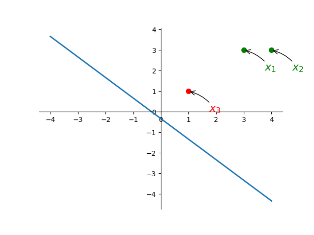
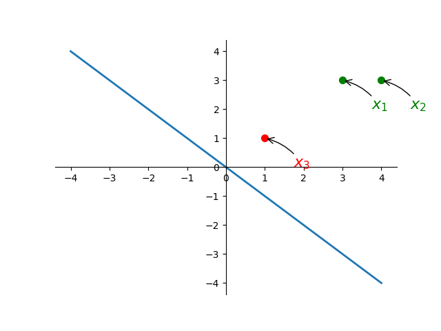
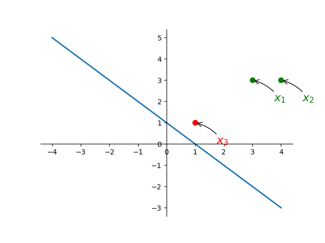

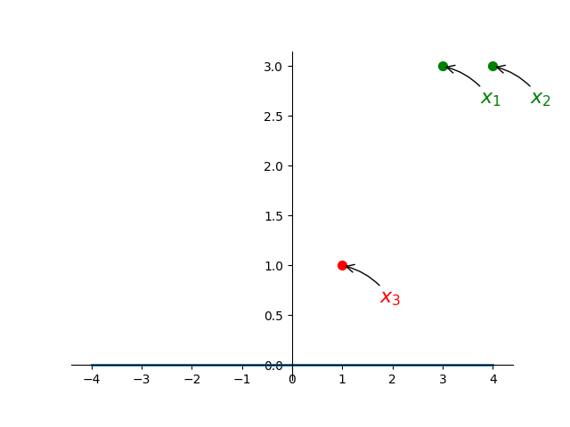
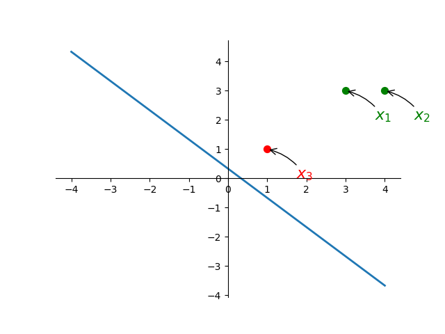

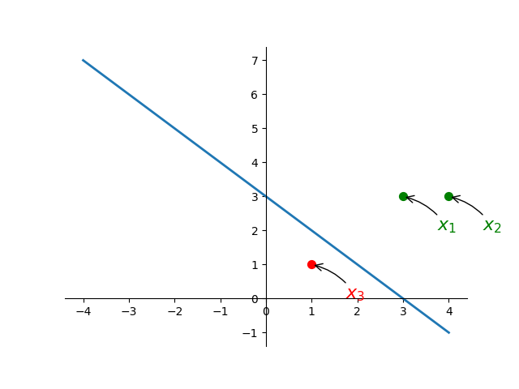

小结：

1. $w$的值其实一直在增加或减少误差点的坐标 ，比如第1次遍历的超平面和第2次遍历的超平面 

$$
w = w - x_3 = (3,3)^T - (1,1)^T = (2,2)^T
$$

2. 有多少个特征就是有多少个 w，如果有5个特征，那么就可以设置5维的空间 $w = (w_1,w_2,w_3,w_4,w_5)^T$，超平面就是

$$
w·x + b = w_1x_1 + w_2x_2 + w_3x_3 + w_3x_3 + w_4x_4 + w_5x_5 + b = 0
$$

2. 感知机解决了二分问题

n维的未知数的公式

## 数字识别问题

接下来我们使用感知机模型来实现分类问题

### 预测结果分类

我们这里要完成的是结果的预测(分类)，而我们的感知机做的是二分问题（判别模型），接下来我们要做的就是如何将判别模型转换为分类问题。

我们当前这个问题的分类结果为【0,1,2,3,4,5,6,7,8,9】

如果我们传入一个28*28的像素数据，需要在这些分类结果中选择其中的一个值，这时候你要考虑一个问题，你如何说服别人，选中的值为预测结果呢？

>  假设 $f(i)$是关于这个$i$的一个计算值 $w·x+b$，关于3和5两个值的大小的比较，我们可以做一个感知机
>
> $f(3) - f(5) = 0$ 
>
> 如果 $f(3) > f(5)$,当前数据是正实例点，我们可以理解为 3的概率 比 5 的大
>
> 那么我们其实可以做多个感知机，
>
> $f(3) - f(0) = 0$ 
>
> $f(3) - f(1) = 0$ 
>
> $f(3) - f(2) = 0$ 
>
> $f(3) - f(4) = 0$ 
>
> $f(3) - f(5) = 0$ 
>
> $f(3) - f(6) = 0$ 
>
> $f(3) - f(7) = 0$ 
>
> $f(3) - f(8) = 0$ 
>
> $f(3) - f(9) = 0$ 
>
> 如果这里所有的结果都是大于0，我们可以认为预测结果是3。
>
> 但是大家想一下，上面的过程，有些太复杂了，我们可以做这样的简化
>
> 计算所有的$f(i)$，也就是计算出 $f(0),f(1),f(2),f(3),f(4),f(5),f(6),f(7),f(8),f(9)$,选择其中的最大值，对应的$i$就是我们的预测结果

这时候新的问题来了 $f(i)$ 是一个什么样的值？

感知机的通用模型就是$w·x + b$，回到关于3和5两个值的大小的比较问题上，$f(3) - f(5) = 0$
$$
f(3)-f(5) = w·x + b
$$
这里其实我们可以让
$$
f(3) = w^3·x
$$

$$
f(5) = w^5\cdot x
$$

针对于每一个分类结果，都有一个各自独立的$w$

> 分类结果1： $w^1$
>
> 分类结果2： $w^2$
>
> 。。。
>
> 分类结果9：$w^9$

如果
$$
w^3\cdot x - w^5\cdot x > 0
$$
我们可以预期这个结果为3

那么其实如果我们要预测结果为3，则需要 $w^3\cdot x $大于其他的$w^i\cdot x$ ,$i$取0,1,2,...,9

也就是我们计算所有的 $w^i\cdot x$ ,$i$取0,1,2,...,9 ，取其中的最大值对应的$i$就是我们的预测数据

### 提取特征

我们这里的数据其实是一个矩阵 28*28的矩阵

我们可以考虑将28*28的矩阵中的每个点作为其特征，也就是共784个特征点

### 提取特征空间

同朴素贝叶斯的提取特征空间 [0,1,2]

### 模型

根据我们前面的分析，我们有多少个特征，其实$w$向量就会有多少

我们这是28*28的像素点阵数据，共784个点，那么
$$
w = (w^{(0,0)},w^{(0,1)},w^{(0,2)},...,w^{(0,27)},w^{(1,0)},w^{(1,1)},w^{(1,2)}...,w^{(1,27)},...,w^{(27,0)},w^{(27,1)},...,w^{(27,27)})^T
$$

并且针对于每一个分类结果都具有这样的28*28个特征

也就是会有
$$
w_i = (w^{(0,0)}_i,w^{(0,1)}_i,w^{(0,2)}_i,...,w^{(0,27)}_i,w^{(1,0)}_i,w^{(1,1)}_i,w^{(1,2)}_i...,w^{(1,27)}_i,...,w^{(27,0)}_i,w^{(27,1)}_i,...,w^{(27,27)}_i)^T
$$
,$i$这里的取值为 (0,1,2,...,9)

这里可以考虑一个问题，如果存储这些 $w_i$，示意图如下

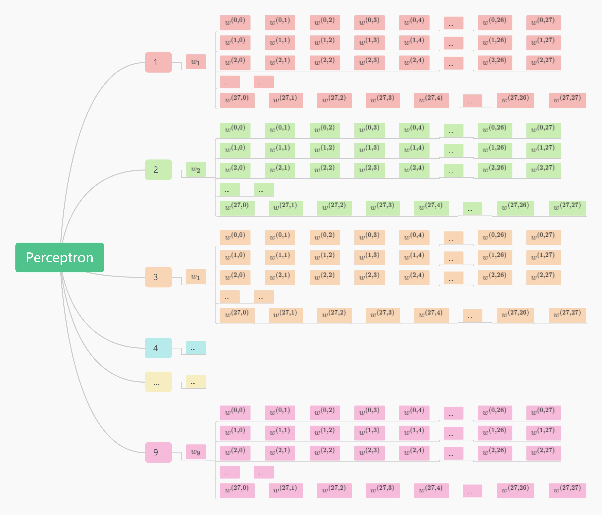

我们定义一个Map，把分类值作为Map的key，把$w$对应的784个数据作为Map的value；

这784个数据可以封装为一个矩阵数据，封装为矩阵数据的话，可以更好的计算内积

.png)

也就是说我们最终要维护一个Map\<String,Matrix> , key为分类值  (0,1,2,...,9) ，value为$w$矩阵

接下来有一个问题，我们的这个矩阵是如何利用训练数据来生成模型，也就是我们的每个分类值的$w$的值如何更新

感知机更新的话，是需要不符合预期(误分类点)才会更新。

>  假如我们从5000个训练数据中，找到第n个数据，假设我们根据$w$矩阵计算每个分类值的 $w·x$ ，然后获得$w_i\cdot x_n$最大的, i的值 (0,1,2,...,9)，n取值（0,1,2,...,4999）
>
> 这时候我们的预测结果为$i$ ,我们查询`trainlabels`的数据得到对应的标记值为$i'$
>
> 如果
> $$
> i \neq i'
> $$
> 那么就是不符合预期，不符合预期的话，我们就要对 $w$进行调整, 调整的是$w_i$和$w_{i'}$
>
> **令实际值的矩阵增长，让其更贴近预期；**
>
> **令预测值的矩阵缩减，让其更远离预期。**
>
> 这里我们分别对 $w_i和w_{i'}$进行调整,令η的值为1
> $$
> w_i ← w_i - ηx_n \\
> w_{i'} ← w_{i'} + ηx_n
> $$
> 我们来画一个简单的示意图，比如我们画一个4*4的矩阵为例吧，权重的初始值如下
>
> 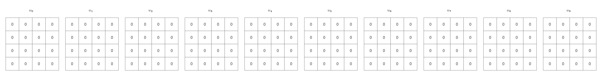
>
> 假如我们现在来了一份这样的数据，并且其`标记的值为5`，`预测的值为2`，数据如下
>
> 
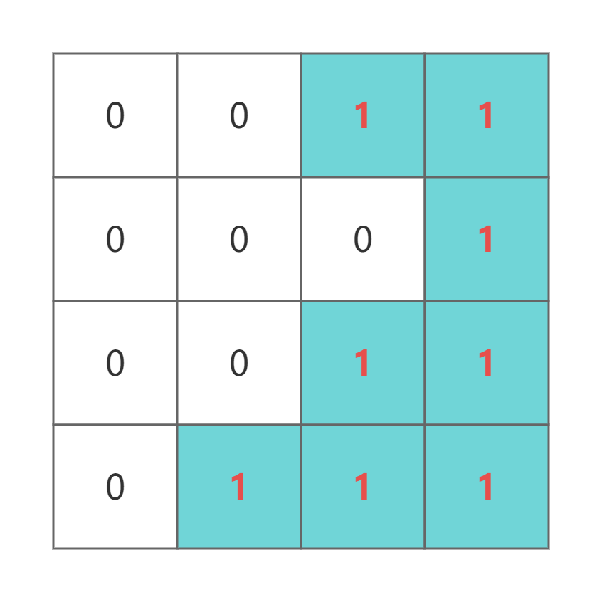

>
> 我们应该让5的$w$矩阵$w_5$增长，2的$w$矩阵$w_2$缩减
>
> 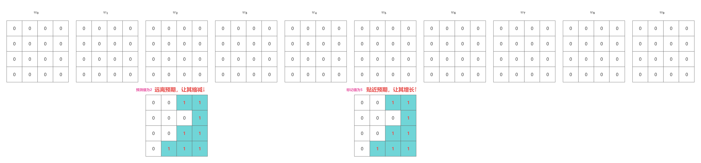
>
> 对$w$矩阵调整后的所有w矩阵，如下
>
> 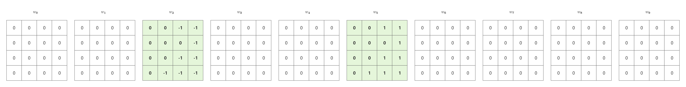
>
> 以上就是一次学习过程，$w$矩阵完成了一次训练。
>
> 我们再来做一次，比如我们又有一个新的数据如下
>
> 
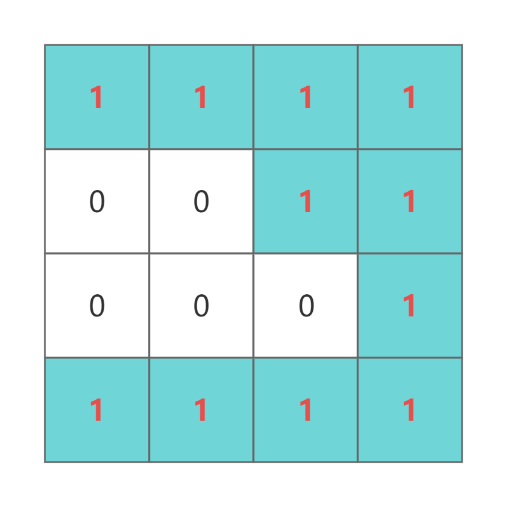

>
> 假设标记结果为2，但是预测结果为3，矩阵的变化以及结果如下
>
> 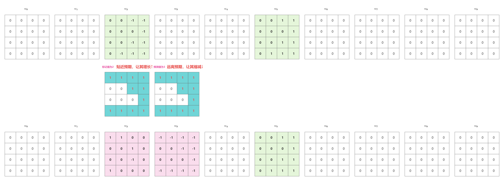
>
> 

那么到这里我们模型的学习以及使用方式就介绍到这里

## 代码实现

接下来就是喜闻乐见的代码环节

**todo:5-3-1 初始化多组分类数据的$w$矩阵**

**todo:5-3-2 预测单个数据的结果**

1. 获得每个分类值的$w$矩阵
2. 计算每个分类值的$w$矩阵和当前数据的 $w\cdot x$
3. 获得 $w_i\cdot x$最大值对应的i则为预测结果

**todo:5-3-3 $w$学习，根据训练数据做更新**

1. label对应的$w$矩阵做新增

2. guess对应的$w$矩阵做减少

3. 新增和减少的是当前的矩阵

   

