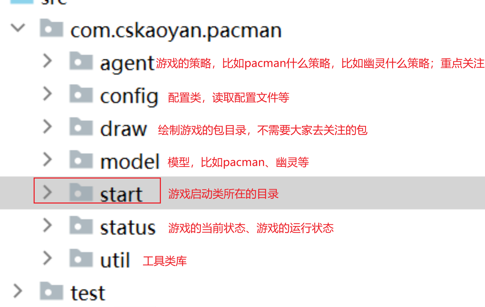
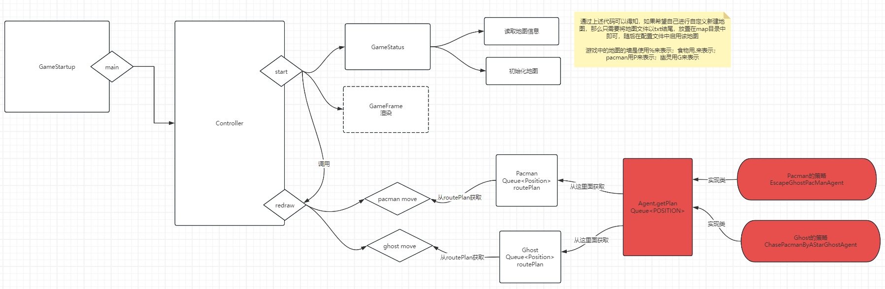

## 自我介绍

王道远志。pacman项目、数字识别项目

项目期间的授课方式和前面的SE阶段略有有一些不同。每天会讲一个项目中涉及的知识点，讲完了之后主要是大家自己练习的过程。

## 项目介绍

pacman项目并不是要求大家去开发一个游戏，而是以游戏的可视化界面去检验算法。本项目的重点是算法，而不是游戏本身。所以关于如何用java语言去编写一个游戏的代码不是重点**，所以我们预先给大家提供了一套基准代码。大家在基准代码之上进行开发项目**。

src包：项目的源代码文件存放目录。

imgs：图片存放目录，也就是幽灵的图片。

map：游戏中所使用的地图存放位置。





### properties文件


> properties配置文件
>
> 什么叫配置文件呢？对于项目中的核心参数进行配置。如果没有这个配置文件，意味着什么？意味着我的配置项需要写在代码块中。如果今后配置项需要修改，那么应该怎么办？只能够去代码中去修改，去代码中修改的话，有没有风险？有，如果代码的开发者不是你，你去修改里面的配置信息，极易容易导致修改多了，修改少了，导致原有代码功能异常。
>
> 引入了配置文件的好处，今后如果希望修改配置信息，只需要在配置文件中去修改即可，无需更改代码。
>
> 


### 反射

> 关于反射
>
> 我们编写的java代码位于硬盘上面，java代码编写之后需要做什么才可以运行？
>
> 1.编译：将java代码编译成class文件，在硬盘上面
>
> 1-2.类加载：将位于硬盘上面的class文件加载到内存中的这样的过程
>
>   class文件被加加载到了内存之后，会发生一件事情？我们在编写代码时，为了表示数据的方便，我们定义了一个类，创建了一个对象。对象内部具有对应的属性、方法等信息，如果今后我希望获取这些信息，直接取对应的属性、方法即可。
>
> 那么如果class文件被加载到了内存之后，如果我也希望获取该class文件内部具有哪些成员变量、哪些方法、构造函数，这个时候可不可以也设置这样的一个对象呢？
>
> 一个class文件里面可以写哪些东西呢？**成员变量、静态变量、成员方法、静态方法、无参构造函数、有参构造函数、静态代码块、普通代码块**，我可不可以设置一个封装一个类来统一表示上述的这些信息。这个类便是Class类，每当有一个class文件被加载到了内存之后，随即便创建了一个Class对象，将当前class文件里面的上述信息封装到Class对象内部。
>
> 2.运行：需要在内存中运行吧


每当有一个class文件被加载到内存之后，JVM便会给当前class文件创建一个Class对象，该对象用来描述当前class文件的信息，比如具有哪些构造函数、成员属性、方法等等。

- 对象.getClass()
- 类名.class
- **Class.forName(String className)**  全限定名

1.利用Class对象可以获取成员变量、方法、构造函数等信息

```java
public class ReflectDemo2 {

    public static void main(String[] args) throws ClassNotFoundException {
        //Student类用来去描述学生的信息，无论张三、李四，均可以使用Student来封装表示

        //Class对象是用来表示不同的class信息的，无论Student.class还是Teacher.class，均可以使用Class对象来表示

        //获取Student对应的Class对象
        Class<?> studentClass = Class.forName("com.cskaoyan.pacman.reflect.Student");

        //利用这个方法可以获取所有的构造函数
        Constructor<?>[] constructors = studentClass.getConstructors();

        //利用这个方法可以获取所有的属性、也就是成员变量
        //其中如果是私有的属性或者私有的方法，那么直接利用getXXX获取不到
        //则可以使用一种更加暴力的方式来获取
        Field[] fields = studentClass.getFields();
        //可以获取私有的成员变量
        Field[] fields2 = studentClass.getDeclaredFields();

        //利用该方法可以获取所有的方法信息
        Method[] methods = studentClass.getMethods();
        //可以获取私有的方法
        Method[] declaredMethods = studentClass.getDeclaredMethods();

        System.out.println("===============================");

        Class<?> teacherClass = Class.forName("com.cskaoyan.pacman.reflect.Teacher");

        Field[] fields1 = teacherClass.getFields();
        Method[] methods1 = teacherClass.getMethods();
        Constructor<?>[] constructors1 = teacherClass.getConstructors();

        System.out.println("==================================");
    }
}
```


2.获取到对应的方法、属性之后可以做什么事情呢？

利用构造函数来实例化对象

```java
public class ReflectDemo3 {

    public static void main(String[] args) throws ClassNotFoundException, InvocationTargetException, InstantiationException, IllegalAccessException {
        //Student类用来去描述学生的信息，无论张三、李四，均可以使用Student来封装表示

        //Class对象是用来表示不同的class信息的，无论Student.class还是Teacher.class，均可以使用Class对象来表示

        //获取Student对应的Class对象
        Class<?> studentClass = Class.forName("com.cskaoyan.pacman.reflect.Student");

        Constructor<?>[] constructors = studentClass.getConstructors();
        for (Constructor<?> constructor : constructors) {
            //直接调用构造函数，创建、实例化一个对象，和之前大家手动 new Student()完全等价的效果
            //构造函数中参数的个数
            int parameterCount = constructor.getParameterCount();
            //选择构造函数参数个数为0的进行实例化一个对象
            if(parameterCount == 0){
                Object o = constructor.newInstance();
                System.out.println(o);
            }
            System.out.println(parameterCount);
        }
    }
}
```


通过反射给成员变量赋值

```java
public class ReflectDemo4 {

    public static void main(String[] args) throws ClassNotFoundException, InvocationTargetException, InstantiationException, IllegalAccessException {
        //Student类用来去描述学生的信息，无论张三、李四，均可以使用Student来封装表示

        //Class对象是用来表示不同的class信息的，无论Student.class还是Teacher.class，均可以使用Class对象来表示

        //获取Student对应的Class对象
        Class<?> studentClass = Class.forName("com.cskaoyan.pacman.reflect.Student");

        Constructor<?>[] constructors = studentClass.getConstructors();
        Object object = null;
        for (Constructor<?> constructor : constructors) {
            //直接调用构造函数，创建、实例化一个对象，和之前大家手动 new Student()完全等价的效果
            //构造函数中参数的个数
            int parameterCount = constructor.getParameterCount();
            //选择构造函数参数个数为0的进行实例化一个对象
            if(parameterCount == 0){
                object = constructor.newInstance();
            }
        }
        //创建了一个student对象，里面次数属性是空的 null
        Field[] fields = studentClass.getDeclaredFields();
        for (Field f : fields) {
            if(f.getName().equals("username")){
                //通过反射给username赋值
                //需要提供两个参数；参数一：给哪个对象的该属性赋值  参数二：给当前属性赋什么值
                //私有的需要暴力破解
                f.setAccessible(true);
                f.set(object, "zhangsan");
            }
        }

        System.out.println(object);
    }
}
```

