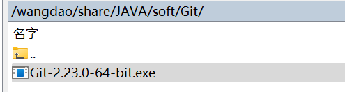
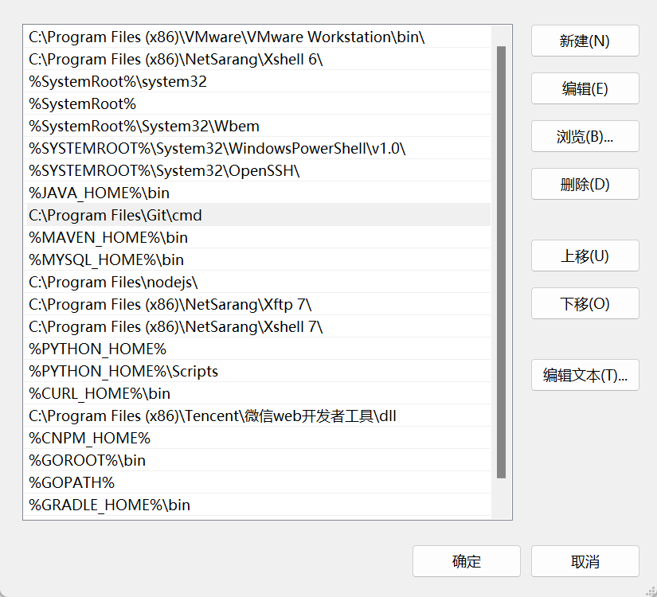
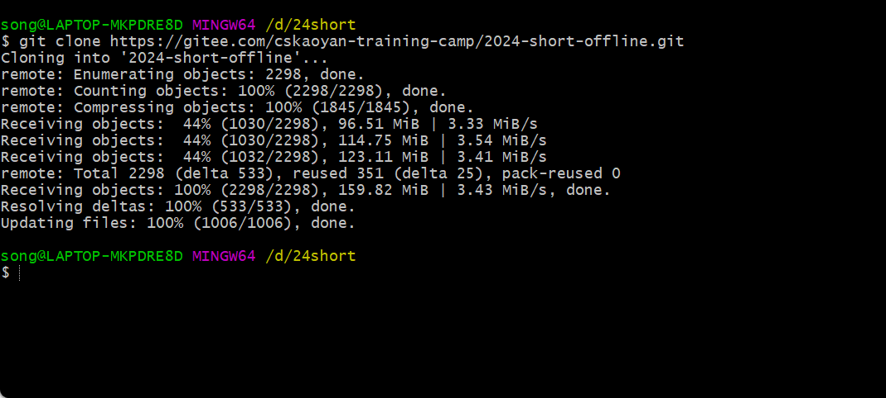
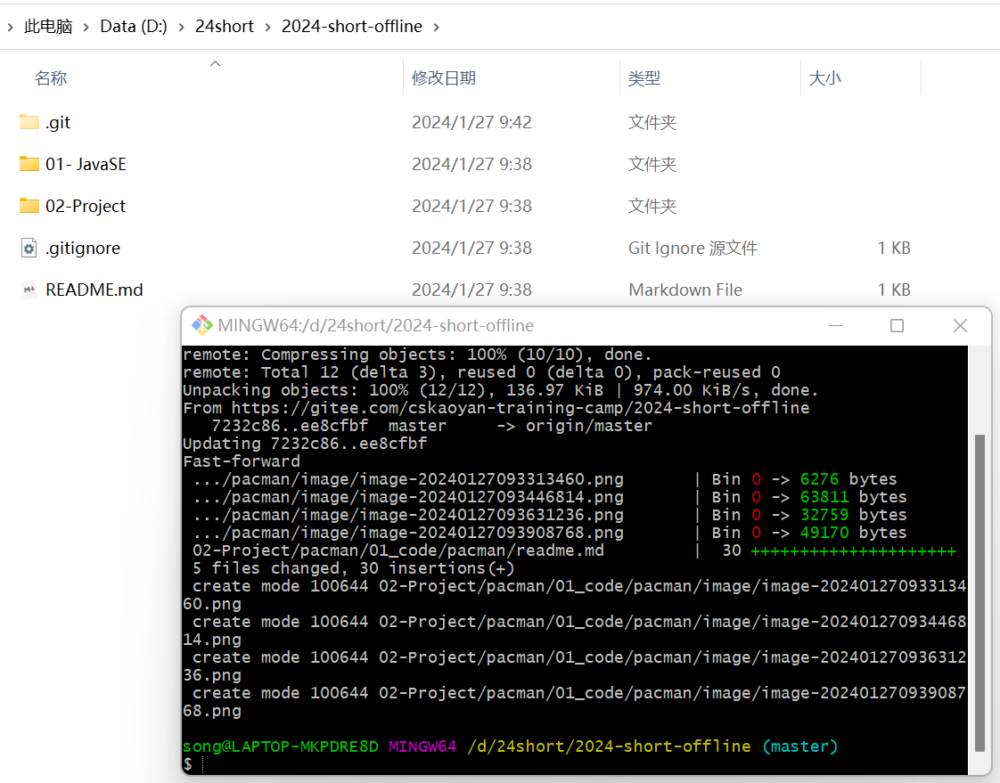
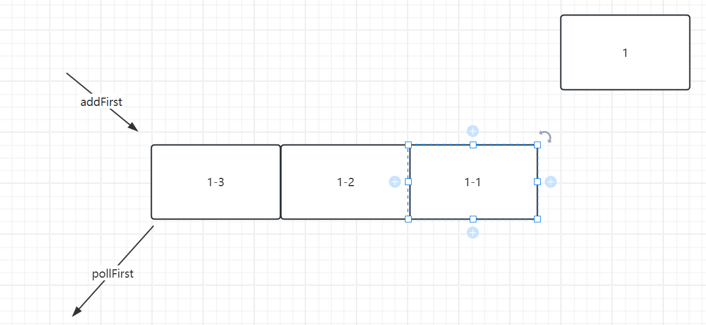
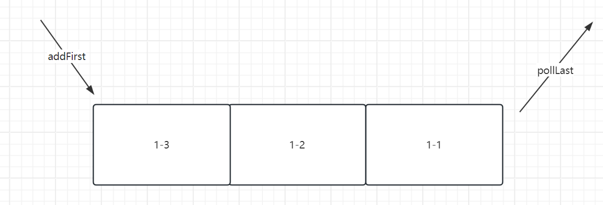

## 自我介绍

王道远志。pacman项目、数字识别项目

项目期间的授课方式和前面的SE阶段略有有一些不同。每天会讲一个项目中涉及的知识点，讲完了之后主要是大家自己练习的过程。

## 项目介绍

pacman项目并不是要求大家去开发一个游戏，而是以游戏的可视化界面去检验算法。本项目的重点是算法，而不是游戏本身。所以关于如何用java语言去编写一个游戏的代码不是重点**，所以我们预先给大家提供了一套基准代码。大家在基准代码之上进行开发项目**。

src包：项目的源代码文件存放目录。

imgs：图片存放目录，也就是幽灵的图片。

map：游戏中所使用的地图存放位置。


### properties文件

| 方法名称                    | 参数                                                     | 返回值      | 说明                                                         |
| --------------------------- | -------------------------------------------------------- | ----------- | ------------------------------------------------------------ |
| properties.load()           | 可以传递一个输入流、或者reader都可以                     |             | 利用该方法可以读取指定路径下的properties配置文件，Properties会自行去解析处理，完成封装的过程；和map很类似 |
| properties.getProperty(xxx) | 便是properties配置文件里面的key的部分，也就是=前面的部分 | =后面的部分 |                                                              |
|                             |                                                          |             |                                                              |
|                             |                                                          |             |                                                              |
|                             |                                                          |             |                                                              |


> properties配置文件
>
> 什么叫配置文件呢？对于项目中的核心参数进行配置。如果没有这个配置文件，意味着什么？意味着我的配置项需要写在代码块中。如果今后配置项需要修改，那么应该怎么办？只能够去代码中去修改，去代码中修改的话，有没有风险？有，如果代码的开发者不是你，你去修改里面的配置信息，极易容易导致修改多了，修改少了，导致原有代码功能异常。
>
> 引入了配置文件的好处，今后如果希望修改配置信息，只需要在配置文件中去修改即可，无需更改代码。
>
> 

在java代码中提供了一个类，会自行地去解析properties里面的内容数据，要求是：大家在编写properties配置文件时，只需要满足里面编写的是key=value即可(每一行写一个key=value；但是key不要重复)

Properties类。

```java
public class PropertiesTest {

    public static void main(String[] args) throws IOException {
        //如果我们希望去读取properties配置文件里面的内容，其实非常简单，只需要借助于Properties类即可
        Properties properties = new Properties();
        //需要取读取加载数据的来源
        //在项目的根目录中有一个app.properties文件，如何获取其输入流
        FileInputStream inputStream = new FileInputStream(new File("app.properties"));
        properties.load(inputStream);

        //后续使用，直接从properties类中取出对应的键值对即可，根据key取出value值
        String app = properties.getProperty("app");
        String order = properties.getProperty("order");
        System.out.println(app);
        System.out.println(order);
    }
}
```


### 反射

| 方法名称                   | 参数                                                         | 返回值                                          | 说明                                                         |
| -------------------------- | ------------------------------------------------------------ | ----------------------------------------------- | ------------------------------------------------------------ |
| 对象.getClass()            | -                                                            | 返回的便是当前类对应的Class对象                 | Class对象是JVM中的，用来去存储class文件信息的一个对象。      |
| 类名.class                 | -                                                            | 返回的便是当前类对应的Class对象                 |                                                              |
| Class.forName(xxx)         | 全限定类名                                                   | 返回的便是当前类对应的Class对象                 | 全限定类名就是包含包路径的一个完整的名称                     |
| class.getConstructors()    | -                                                            | 返回的是对应的类中所有的构造函数                |                                                              |
| class.getConstructor(xxx)  | 构造函数里面的参数类型                                       | 返回对应的构造函数                              | 根据我们传递进来的参数类型顺序，去匹配所有的构造函数，如果匹配到则返回 |
| class.getFields()          | -                                                            | 返回的是对应的类中所有的成员变量、属性          | 无法获取private修饰的属性                                    |
| class.getField(xxx)        | 当前成员变量、属性的名称                                     | 根据对应的名称，得到对应的成员变量信息          |                                                              |
| class.getDeclaredFields()  | -                                                            | 返回的是所有的成员变量、属性，包含private修饰的 |                                                              |
| class.getMethods()         | -                                                            | 返回的是当前类中所有的方法                      | 无法获取private修饰的方法                                    |
| class.getMethod(xxx,xxx)   | 根据方法的名称、方法的形参类型                               | 返回的是符合条件的方法                          |                                                              |
| class.getDeclaredMethods() | -                                                            | 返回的是全部的方法，包含private修饰的方法       |                                                              |
| field.set(xxx,xxx)         | 第一个参数表示的是对象；第二个参数表示的是赋的值             | -                                               | 给第一个参数对象的指定成员变量赋值，赋第二个参数的值         |
| field.setAccessible(true)  | -                                                            | -                                               | 如果是private修饰的属性是无法利用上述方法进行赋值的，先使用当前方法进行暴力破解 |
| method.invoke(obj,args)    | 第一个参数表示的是哪个对象；第二个参数表示的是调用方法时传递进来的参数 | 调用的方法的返回值结果                          |                                                              |


> 关于反射
>
> 我们编写的java代码位于硬盘上面，java代码编写之后需要做什么才可以运行？
>
> 1.编译：将java代码编译成class文件，在硬盘上面
>
> 1-2.类加载：将位于硬盘上面的class文件加载到内存中的这样的过程
>
>   class文件被加加载到了内存之后，会发生一件事情？我们在编写代码时，为了表示数据的方便，我们定义了一个类，创建了一个对象。对象内部具有对应的属性、方法等信息，如果今后我希望获取这些信息，直接取对应的属性、方法即可。
>
> 那么如果class文件被加载到了内存之后，如果我也希望获取该class文件内部具有哪些成员变量、哪些方法、构造函数，这个时候可不可以也设置这样的一个对象呢？
>
> 一个class文件里面可以写哪些东西呢？**成员变量、静态变量、成员方法、静态方法、无参构造函数、有参构造函数、静态代码块、普通代码块**，我可不可以设置一个封装一个类来统一表示上述的这些信息。这个类便是Class类，每当有一个class文件被加载到了内存之后，随即便创建了一个Class对象，将当前class文件里面的上述信息封装到Class对象内部。
>
> 2.运行：需要在内存中运行吧


每当有一个class文件被加载到内存之后，JVM便会给当前class文件创建一个Class对象，该对象用来描述当前class文件的信息，比如具有哪些构造函数、成员属性、方法等等。

- 对象.getClass()
- 类名.class
- **Class.forName(String className)**  全限定名

1.利用Class对象可以获取成员变量、方法、构造函数等信息

```java
public class ReflectDemo2 {

    public static void main(String[] args) throws ClassNotFoundException {
        //Student类用来去描述学生的信息，无论张三、李四，均可以使用Student来封装表示

        //Class对象是用来表示不同的class信息的，无论Student.class还是Teacher.class，均可以使用Class对象来表示

        //获取Student对应的Class对象
        Class<?> studentClass = Class.forName("com.cskaoyan.pacman.reflect.Student");

        //利用这个方法可以获取所有的构造函数
        Constructor<?>[] constructors = studentClass.getConstructors();

        //利用这个方法可以获取所有的属性、也就是成员变量
        //其中如果是私有的属性或者私有的方法，那么直接利用getXXX获取不到
        //则可以使用一种更加暴力的方式来获取
        Field[] fields = studentClass.getFields();
        //可以获取私有的成员变量
        Field[] fields2 = studentClass.getDeclaredFields();

        //利用该方法可以获取所有的方法信息
        Method[] methods = studentClass.getMethods();
        //可以获取私有的方法
        Method[] declaredMethods = studentClass.getDeclaredMethods();

        System.out.println("===============================");

        Class<?> teacherClass = Class.forName("com.cskaoyan.pacman.reflect.Teacher");

        Field[] fields1 = teacherClass.getFields();
        Method[] methods1 = teacherClass.getMethods();
        Constructor<?>[] constructors1 = teacherClass.getConstructors();

        System.out.println("==================================");
    }
}
```


2.获取到对应的方法、属性之后可以做什么事情呢？

利用构造函数来实例化对象(利用这种方式和之前大家new 构造函数的方式其实没有什么本质的区别。大家都是在调用构造函数。)

```java
public class ReflectDemo3 {

    public static void main(String[] args) throws ClassNotFoundException, InvocationTargetException, InstantiationException, IllegalAccessException {
        //Student类用来去描述学生的信息，无论张三、李四，均可以使用Student来封装表示

        //Class对象是用来表示不同的class信息的，无论Student.class还是Teacher.class，均可以使用Class对象来表示

        //获取Student对应的Class对象
        Class<?> studentClass = Class.forName("com.cskaoyan.pacman.reflect.Student");

        Constructor<?>[] constructors = studentClass.getConstructors();
        for (Constructor<?> constructor : constructors) {
            //直接调用构造函数，创建、实例化一个对象，和之前大家手动 new Student()完全等价的效果
            //构造函数中参数的个数
            int parameterCount = constructor.getParameterCount();
            //选择构造函数参数个数为0的进行实例化一个对象
            if(parameterCount == 0){
                Object o = constructor.newInstance();
                System.out.println(o);
            }
            System.out.println(parameterCount);
        }
    }
}
```


通过反射给成员变量赋值

```java
public class ReflectDemo4 {

    public static void main(String[] args) throws ClassNotFoundException, InvocationTargetException, InstantiationException, IllegalAccessException {
        //Student类用来去描述学生的信息，无论张三、李四，均可以使用Student来封装表示

        //Class对象是用来表示不同的class信息的，无论Student.class还是Teacher.class，均可以使用Class对象来表示

        //获取Student对应的Class对象
        Class<?> studentClass = Class.forName("com.cskaoyan.pacman.reflect.Student");

        Constructor<?>[] constructors = studentClass.getConstructors();
        Object object = null;
        for (Constructor<?> constructor : constructors) {
            //直接调用构造函数，创建、实例化一个对象，和之前大家手动 new Student()完全等价的效果
            //构造函数中参数的个数
            int parameterCount = constructor.getParameterCount();
            //选择构造函数参数个数为0的进行实例化一个对象
            if(parameterCount == 0){
                object = constructor.newInstance();
            }
        }
        //创建了一个student对象，里面次数属性是空的 null
        Field[] fields = studentClass.getDeclaredFields();
        for (Field f : fields) {
            if(f.getName().equals("username")){
                //通过反射给username赋值
                //需要提供两个参数；参数一：给哪个对象的该属性赋值  参数二：给当前属性赋什么值
                //私有的需要暴力破解
                f.setAccessible(true);
                f.set(object, "zhangsan");
            }
        }

        System.out.println(object);
    }
}
```


通过反射调用方法

```java
public class ReflectDemo5 {

    public static void main(String[] args) throws ClassNotFoundException, InvocationTargetException, InstantiationException, IllegalAccessException {
        //Student类用来去描述学生的信息，无论张三、李四，均可以使用Student来封装表示

        //Class对象是用来表示不同的class信息的，无论Student.class还是Teacher.class，均可以使用Class对象来表示

        //获取Student对应的Class对象
        Class<?> studentClass = Class.forName("com.cskaoyan.pacman.reflect.Student");

        Object o = null;
        //利用Class对象来获取构造函数，实例化一个对象出来
        Constructor<?>[] constructors = studentClass.getConstructors();
        for (Constructor<?> constructor : constructors) {
            //通过参数个数为0的，我们选择无参构造函数来实例化对象
            int parameterCount = constructor.getParameterCount();
            if(parameterCount == 0){
                o = constructor.newInstance();
            }
        }

        //通过反射去调用某个方法 setUsername方法
        Method[] methods = studentClass.getMethods();
        for (Method method : methods) {
            if(method.getName().equals("setUsername")){
                //调用对应的方法 调用setUsername方法，调用的是哪个对象里面的这个方法呢？
                //需要传递两个参数：参数一：指的是调用哪个对象里面的setUsername方法
                //参数二：在调用这个setUsername方法时，传递进去的参数是多少
                //方法的返回值便是方法的调用结果
                method.invoke(o, "lisi");
            }
        }
        System.out.println(o);

    }
}
```


## 拉取课堂代码

之前的学习过程中，推荐大家使用idea的clone from version control来拉取代码。实际上，有一种更加方便的方式，但是需要安装一个软件，叫做git。



安装当前的安装包，安装过后，需要确保在环境变量中包含该软件的目录。默认会安装在C:\Program Files\Git

随后到环境变量中去确认一下git是否在其中，这一步的目的是为了接下来可以在任意目录下执行git指令。




如何拉取代码呢？

希望在D:/24short目录中拉取我们的上课代码。


在git窗口中输入如下指令 git clone https://gitee.com/cskaoyan-training-camp/2024-short-offline.git



此时便clone克隆仓库成功。**上述这条指令只需要执行一次即可，后续每次更新代码时不需要执行这条指令。**


后续更新代码，那么我需要进入到2024-short-offline目录中去执行



**注意：执行git pull指令和执行git clone指令时目录是不一样的。**


使用idea打开项目时，一定要确保其是一个idea中的项目才可以，否则很容易出现打开的项目运行异常。src目录的父级目录才是idea中的一个项目。


## 算法回顾

DFS：深度优先遍历。指的是从一个位置的顶点出发，遍历其子节点，选择其中的一个子节点，逐级深入遍历所有的子节点；如果走不通，则再去遍历其他的节点。大家需要做的事情便是将上述的思想转换成代码即可。



BFS: 广度优先遍历。像水波纹一样地进行扩散。首先先处理顶点临近的所有节点，将这些节点全部处理完毕之后，再去处理这些节点对应的子节点。



上述的无论DFS还是BFS均是盲目性搜索，或者叫做非启发性搜索。遍历的节点数目是非常多的。

A*：启发式搜索算法。一定要求具有目标地址。有一个评估函数，用来去评估哪些节点更加地重要。评估函数我们使用的是花费来表示的，在pacman寻址的过程中，我们可以将这个花费理解成行进的步数。如果某个节点距离目标地址具有更小的步数，那么该节点的重要性越大。

**所以针对该算法，我们需要做的事情便是计算行进规划路线中每个节点的花费，将花费按照从小到大的顺序进行排序。我们每次始终是取出最小花费的节点，利用该节点，再次去查找其周围的所有临近节点，计算出最小花费的节点.......循环往复，直至最终规划出一条路线来。**

本算法中，我们使用了TreeSet来进行排序。

关于Set，我们知道它的特征是去重。如果Set判断某两个元素是一致的，那么便会去掉其中的一个，只保留一个。

TreeSet排序的Set。会按照从小到大的顺序将里面存储的元素进行排序（排序的过程无需我们去做）。

如果我们将1、2、3、4等这些数字存储到其中，那么我们都知道应该如何进行排序。但是如果我们存储的是对象，那么TreeSet如何进行排序呢？

TreeSet提供了一种方式，可以在调用构造函数的时候，传递进入一个Comparator对象，需要我们开发人员去实现里面的compare方法。TreeSet会根据Comparator.compare(o1,o2)方法的返回结果，来判断哪个元素比较小；

如果Comparator.compare(o1,o2) > 0说明了o1大于o2，o2应该存储在o1的前面

如果Comparator.compare(o1,o2) < 0说明了o1小于o2，o1应该存储在o2的前面

如果Comparator.compare(o1,o2) = 0 说明了o1等于o2，则会执行去重操作，值保留其中的一个


问题：如果我希望使用TreeSet将数据按照降序进行排序能否实现？可以。只需要将if(v > 0){
                    return 1;
                }改成

if(v < 0){
                    return 1;
                }

```java
TreeSet<Node> treeSet = new TreeSet<>(new Comparator<Node>() {
            @Override
            public int compare(Node o1, Node o2) {
                double v = o1.totalCost - o2.totalCost;
                if(v > 0){
                    return 1;
                }
                return -1;
            }
        });
```

## 对抗问题

引入幽灵之后，产生了一个对抗：

pacman：找到食物，并且将全部食物吃完，同时还得躲避幽灵的追捕，那么便取得胜利

幽灵：找到pacman，将pacman吃掉，便取得最终的胜利

pacman寻找食物，使用何种算法呢？A*算法

幽灵寻找pacman，使用何种算法呢？A*算法

pacman首先规划出一条到食物的路径，然后将幽灵以及幽灵四周的坐标置为危险坐标；如果行进路径中不包含危险坐标，则先走着，暂时安全；如果有危险坐标，统计距离，距离5步之外，先走着；5步，则先停着；5步以内，则远离。

这种对抗问题的算法编写方式不具有编程的思维、算法的思维。


## 小tips

如果大家在使用API的时候，发现某个方法不知道什么意思，比如peek、poll、pop等。可以点开看一下源码。看源码上方的注释。


## Minmax算法

零和博弈：总和为0，一方如果获取收益，那么必然来源于另外一方的损失。

pacman希望将自己的优势最大化：不被幽灵吃掉，并且吃掉食物

幽灵希望自己的优势最大化或者让pacman优势最小化：可以将pacman吃掉


注意事项：

1.这里面提及的minmax算法，并不是说pacman作为己方调用max方法，幽灵作为对手方调用min方法；是指的是某一个选手在推演记下来几步的动作，选择一个对于自己优势最大的动作、步骤。

> 武侠片：意念来进行战斗；推演

2.双方在对局博弈的过程中，因为max操作是己方操作，所以我们会选择max操作得分最高的那个步骤；min操作是对手方操作，你需要去做最坏的打算，min层需要获取得分最小的那个步骤。

**3.通过minmax算法并不是得出一条完整的路线，而是只是得到接下来的一步操作。**只是我需要去考虑的情况比较多，推演的情况比较复杂，通过这些复杂的情形最终去选择应该往哪个方向去行进。我们通过多级递归调用来进行演进我方操作和对手方操作的情形，如果递归的层级越高，则你可以理解为遍历的步数越多，遍历的步数越多，那么看到的结果也就越多。


pacman需要借助于minmax算法来推演，我每走一步，接下来我评估这一步的分数是高还是低，但是这个游戏不是只有我自己在玩，还有幽灵也在玩，幽灵会想方设法地将我杀死，让我取得低分。这里面的遍历的层级数目，你可以理解为是它视野的开阔程序。


