# Pacman项目介绍

吃豆人是一款诞生于1980年的街机游戏。游戏的规则非常简单，玩家只需要让吃豆人吃掉迷宫中的豆子，同时可以躲避开幽灵的袭击，便可以顺利进入下一关。本项目的主要目的并不是教大家如何去开发一款吃豆人游戏，而是通过编写对应的算法，让吃豆人可以自动找寻豆子并且吃掉，同时可以躲避幽灵。进阶之后，我们会让幽灵也可以运行，让其追逐吃豆人，吃豆人需要做的事情是在能够顺利躲避幽灵追击的同时将豆子吃掉。

所以本项目主要给大家介绍吃豆人通过不同的算法来查找豆子以及吃豆人和幽灵之间的对抗问题。

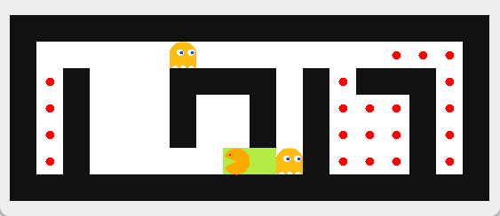


## 项目结构介绍

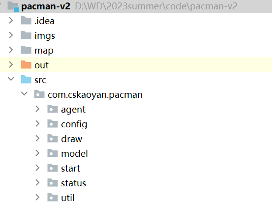

因为本项目是一个具有可视化视图的项目，而关于可视化处理的相关代码其实并不是我们本门课程重点需要讨论的部分，所以本项目并不会从头开始编写，而是以部分代码来当做我们开发的基准代码，后续介绍知识点时，也会在基准代码之上进行。本项目的目录结构如上图所示，做一个简单介绍：

imgs目录：用来存放幽灵的图标

map目录：项目中使用的地图全部都是存放在该目录之中

src目录：项目源代码文件的存放目录

agent包：用来存放幽灵或者pacman的代理策略，比如设定幽灵静止不动，pacman向左或者向右移动

config包：项目中有一个properties配置文件，该包内的文件用来去读取配置文件

draw包：绘制页面所需要的代码存放位置

model包：模型，比如pacman、幽灵等模型存放位置

start包：启动项目的包目录

status包：游戏的状态、运行状态存放目录

util包：工具类文件存放目录

## 代码功能介绍

项目的入口为start包目录下的`GameStartup`类。

```java
public class GameStartup {

    public static void main(String[] args) {
        Controller controller = new Controller();
        controller.start();
    }
}
```

里面的代码逻辑非常简单，创建一个控制器，控制游戏的运行。主要的逻辑都是在`Controller`对象的`start`方法中。

```java
  public void start() {

        //游戏状态，保存游戏运行过程中的各种状态变化
        this.gameStatus = new GameStatus(GameParameter.gameMap);

        //gameFrame用来进行渲染游戏可视化视图
        this.gameFrame = new GameFrame(gameStatus);

        redraw();
    }
```

该方法中主要做了三件事情，一是创建了一个对象，里面存储了游戏的状态信息；而是创建了一个Frame对象，该对象是渲染游戏需要用到的；三是在后续游戏运行过程中需要持续不断地对游戏进行渲染，因为游戏运行过程中，数据是一直在改变的，比如pacman移动了一个坐标、比如pacman吃掉了一个豆子等等，都需要进行重新渲染，将改变显示在界面中。

```java
  public GameStatus(String gameMap) {
        this.ghostList = new ArrayList<>();
        //读取加载地图信息
        List<String> mapData = MapLoader.load(gameMap);

        //初始化地图
        initMap(mapData);

    }
```

`GameStatus`游戏状态对象的构造函数中首先读取地图，然后初始化地图。关于地图的一些说明如下：<span style='color:red'>**1.地图必须存放在上述介绍的map目录中。2.地图文件的后缀名必须是txt结尾，如果希望加载哪张地图，则在properties配置文件中指定地图的文件名即可（后缀名不需要）。3.在地图中，`%`表示墙，`.`表示食物,`P`表示Pacman，`G`表示幽灵**</span>。

`GameFrame`对象的构造函数中主要设置了游戏窗体的一些信息，比如窗体显示的名称叫做PacMan，比如设置窗体的大小等。在该对象中存储了另外一个对象叫做`GamePanel`游戏面板，游戏面板负责将渲染的组件注册到系统中，比如绘制墙、食物、幽灵、pacman的组件，并且进行渲染工作。

`redraw`方法是进行持续渲染必不可少的。该方法内部有一个死循环，**幽灵和pacman进行持续不断地交替运动**。随后进行游戏运行状态检查：如果pacman或者幽灵撞墙则游戏结束、如果pacman和食物的坐标重合，则食物被吃掉，食物数量减一、如果pacman和幽灵位置重合，则pacman被幽灵吃掉，游戏结束、如果食物被全部吃完，则游戏胜利、游戏结束。

通过上面的描述，我们可以发现，其实对于我们来说，最为关心的便是幽灵和pacman是如何进行运动的呢？

无论是幽灵的移动还是pacman的移动，其实策略都是大抵相同的。

```java
public void ghostMove() {
        for (Ghost ghost : ghostList) {
            if(ghost.routerPlan == null || ghost.routerPlan.isEmpty()){
                ghost.setPlan(this);
            }
            ghost.move();
        }
    }

    public void pacmanMove() {
        if(pacMan.routerPlan == null || pacMan.routerPlan.isEmpty()){
            pacMan.setPlan(this);
        }
        pacMan.move();
    }
```

`routerPlan`是幽灵或者pacman的行进计划，该对象是一个队列，如果已经规划好了行进计划，则直接从行进计划中取即可。取出来的便是方位，表示的是移动的下一个坐标位置。如果行进计划为空，则需要去得到一个行进计划。同样无论幽灵的行进计划还是pacman的行进计划，代码也是几乎相同的。由agent来获取行进计划。**agent是什么呢？便是策略的产生对象，pacman如何移动，幽灵如何移动，其实便是通过该类产生的**。

```java
public void setPlan(GameStatus gameStatus) {
        if(routerPlan == null || routerPlan.isEmpty()){
            routerPlan = agent.getPlan(gameStatus);
        }
    }
```

通过对`Pacman`类以及`Ghost`类进行分析，可以发现`Agent`是一个接口，在`setPlan`方法中直接调用了接口的方法，那么肯定在调用该方法之前对`agent`进行了赋值操作，否则这段代码无法运行。实际上，是在`Pacman`或者`Ghost`类的构造函数中对`agent`进行了赋值。这里以`Ghost`为例来进行介绍。<span style='color:red'>**里面的代码逻辑主要是首先获取当前项目中的所有的`class`文件,其次遍历所有的`class`文件，如果发现该`class`是`Agent`的实现类，则是我们的候选类对象，随后获取配置文件中配置的`ghostAgent`参数的值，如果上述的`Agent`实现类对象的名称中包含了`ghostAgent`参数，那么便是我们需要加载的策略。这里面主要利用反射去创建一个实例对象，并且把该对象赋值给`Agent`接口。**</span>

```java
public Ghost(Coordinate coordinate) {
        this.coordinate = coordinate;
        Class<? extends Agent> aClass = Agent.class;

        try {
            //查询的到当前项目中的所有Class对象
            List<Class> classList = ClassUtils.getAllClasses();
            String ghostAgent = GameParameter.ghostAgent;
            for (Class cl : classList) {
                //如果遍历出来的类是Agent的子类对象，并且类的名称中包含配置的名称，则是我们需要的
                if(aClass.isAssignableFrom(cl)){
                    if(cl.getSimpleName().toLowerCase().contains(ghostAgent.toLowerCase())){
                        this.agent = (Agent) cl.newInstance();
                    }
                }
            }
        } catch (ClassNotFoundException e) {
            throw new RuntimeException(e);
        } catch (InstantiationException e) {
            throw new RuntimeException(e);
        } catch (IllegalAccessException e) {
            throw new RuntimeException(e);
        }

    }
```

比如在properties配置文件中，有如下的配置信息，则查找一个类，如果满足以下两点，则是我们需要的类对象：

```properties
ghostAgent=chasePacmanByAStar
```

1.是Agent的实现类

2.类的名称中包含chasePacmanByAStar，但是字符不需要区分大小写，所以`ChasePacmanByAStarGhostAgent`便是我们需要的类对象。

在前面的课程中，我们有提到：本项目并不是教大家如何去开发一个游戏，而是通过编写对应的算法，让吃豆人可以自动找寻豆子并且吃掉，同时可以躲避幽灵。以及后续的pacman和幽灵的对抗问题。<span style='color:red'>**那么需要大家去做的事情是哪些呢？在agent包目录下去编写对应的策略算法，然后再properties配置文件中启用编写的策略。**</span>


## 手动控制Pacman移动

接下来，我们通过手动控制pacman移动来体会一下这个项目应该如何进行。我们需要让当前的项目可以监听键盘的录入。如何添加键盘监听事件呢？

1.GameFrame构造函数最后添加代码`addKeyListener(gamePanel);`。

2.`GamePanel`实现`KeyListener`接口，实现里面的方法，主要是`keyPressed`方法。

基于上述代码，如何实现点击键盘上指定的键来实现pacman的移动呢？


## 深度优先遍历思想

(Depth First Search, 简称 DFS) 与广度优先遍历(Breath First Search)是图论中两种非常重要的算法，生产上广泛用于拓扑排序，寻路(走迷宫)，搜索引擎，爬虫等，也频繁出现在 leetcode，高频面试题中。

深度优先遍历主要的思路是从图中的一个未访问的顶点出发，沿着一条路一直走到底，然后从这条路的尽头再回退到上一个节点，再从另外一条路走到底。不断递归重复该过程，直至所有的点全都遍历完成。如下图所示。

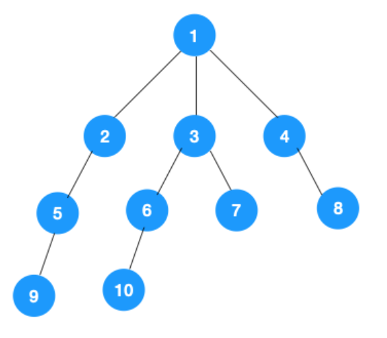

1.从根节点1开始，相邻的节点是2、3、4，深度优先遍历是先遍历节点2，随后遍历节点5、节点9

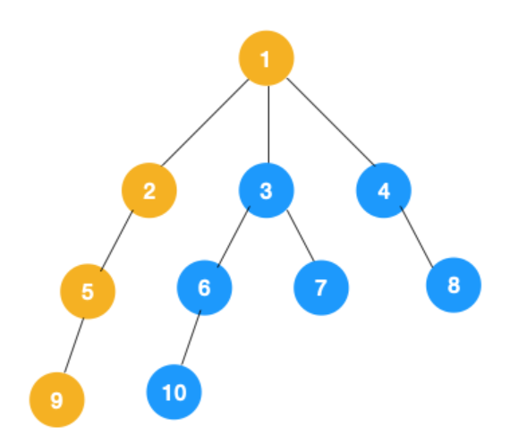

2.上图中左边这条路9走不通之后，回退到5，查看5下面是否有除了9之外的其他节点；如果没有的话，则进一步回退到2、回退到1；此时遍历节点3，直至到节点10

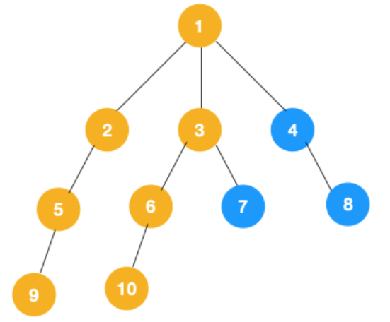

3.遍历到节点10之后，再次回退到节点6、再次回退到节点3，发现除了节点6之外，还有一个节点7

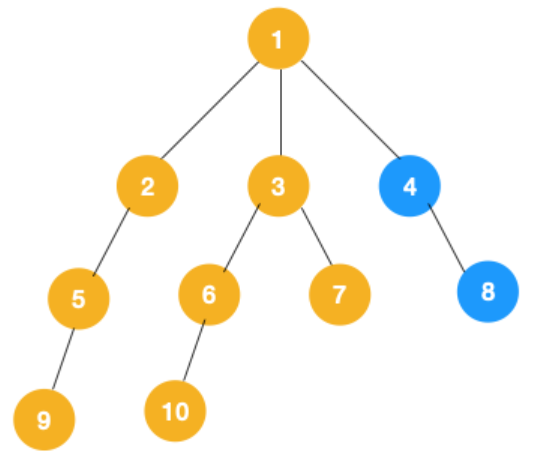

4.遍历到节点7之后，回退到节点3、节点1；节点1还有一个节点4，接下来节点8，直至将所有节点全部遍历一遍（数字表示的是遍历的先后顺序）

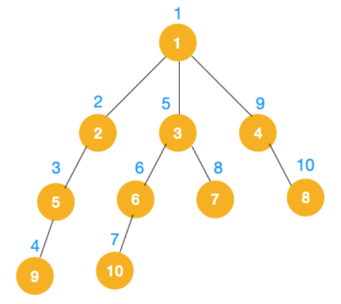

上述介绍的深度优先遍历思想和我们的pacman移动有什么关联嘛？我们以这张地图为例，来进行阐述

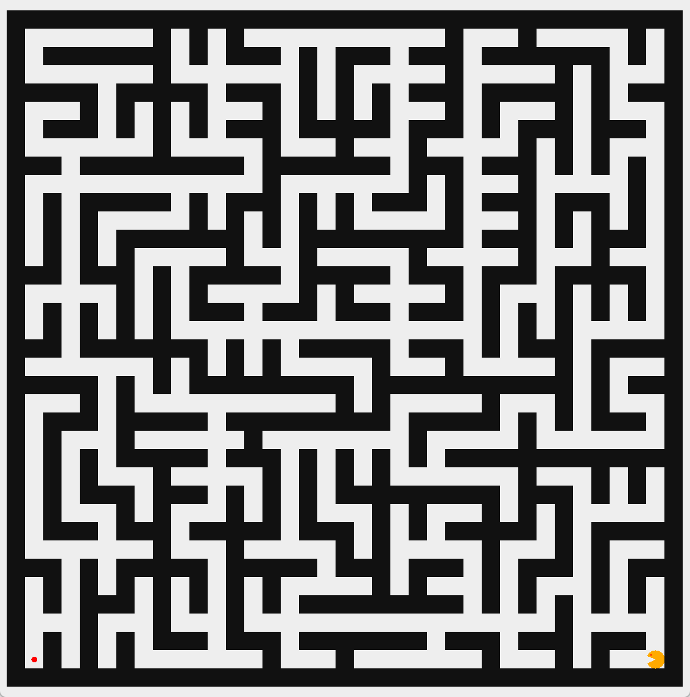

`pacman`目前的位置是位于地图的右下角，可以移动的方向有哪些呢？

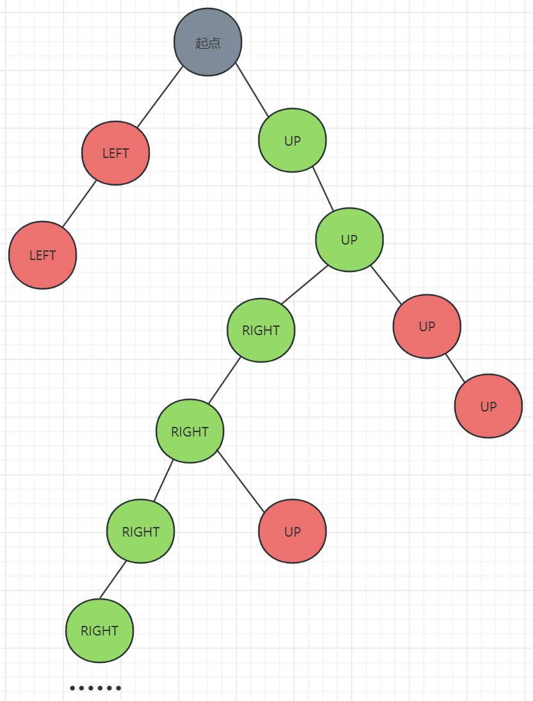

上图所示便是`pacman`所在的右下角时，可以行走的方向，将这些方向进行全部遍历，最终肯定会得到一条从`pacman`到食物的路线。可以发现，该图和上述介绍的深度优先遍历的图基本是一致的。因此，我们可以使用深度优先遍历来查找从`pacman`到食物的一条路线。

```java
public class DFSSearchFoodPacmanAgent implements Agent{
    @Override
    public Queue<Position> getPlan(GameStatus gameStatus) {
        LinkedList<Node> stack = new LinkedList<>();

        boolean[][] foods = gameStatus.foods;

        //将pacman的初始位置入栈
        stack.push(new Node(gameStatus.pacMan.coordinate));

        //使用一个set来存放已经遍历过的坐标，防止陷入死循环
        Set<Coordinate> searchedCoordinates = new HashSet<>();

        while (! stack.isEmpty()){
            Node pop = stack.pop();
            if(searchedCoordinates.contains(pop.coordinate)){
                continue;
            }else{
                searchedCoordinates.add(pop.coordinate);
            }

            if(foods[pop.coordinate.x][pop.coordinate.y]){
                //是食物
                Queue<Position> positions =  Calculation.getPosition(pop);
                return positions;
            }


            //寻找当前坐标周围的坐标节点
            List<Node> nodes = Calculation.getAroundNodes(pop, gameStatus);
            for (Node node : nodes) {
                //再将周围的节点放入到首位
                stack.push(node);
            }
        }

        return null;
    }
}
```

为了方便我们了解`pacman`的行进路线，我们对代码稍作优化，让其可以打印出`pacman`的行进路线，用绿色的线条来表示。

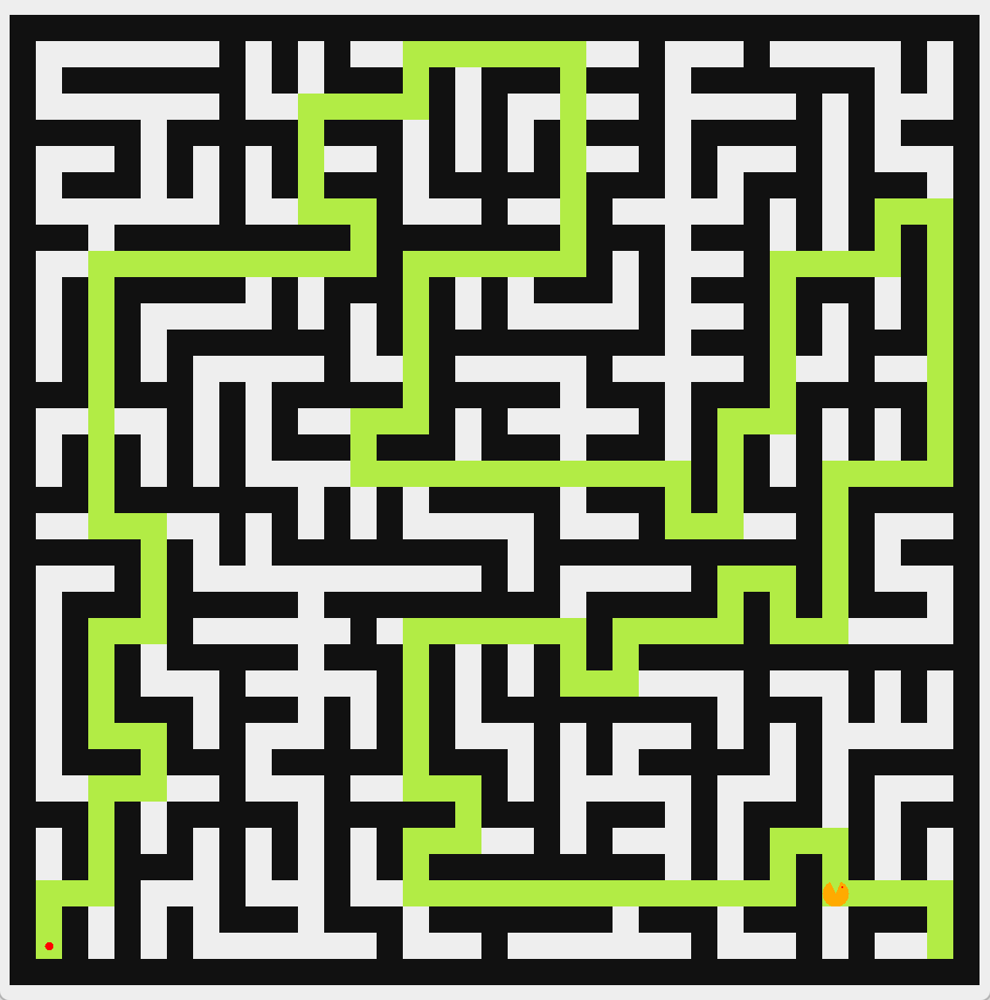

但是我们也希望了解在找出这条路线的过程中，做了哪些尝试，也就是说我们希望可以将pacman搜索过的路线都展示出来。对代码稍作优化，让其可以展示出pacman的搜索路径，如下图所示：

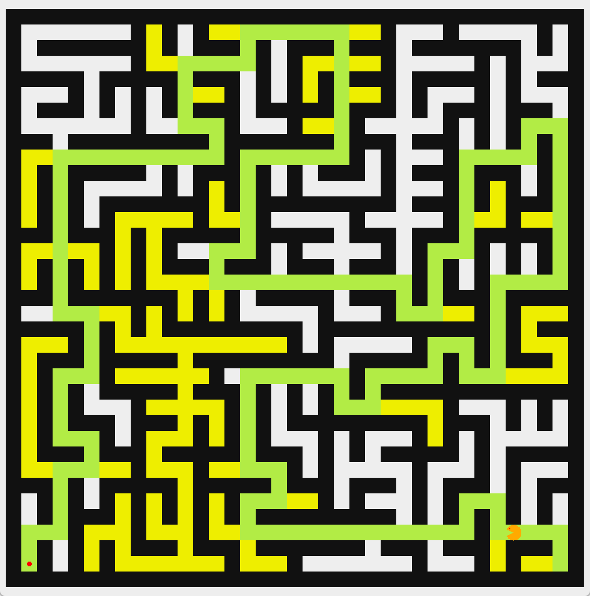

上图中使用黄色线条标注的便是pacman搜索过的路线。我们通过修改Calculation.getAroundNodes()方法中下面这段代码的顺序，你会发现搜寻的路线会呈现完全不同的情形。

```java
if(!walls[upCoordinate.x][upCoordinate.y]){
            aroundNodes.add(new Node(upCoordinate, node, Position.UP));
        }
        if(!walls[downCoordinate.x][downCoordinate.y]){
            aroundNodes.add(new Node(downCoordinate, node, Position.DOWN));
        }
        if(!walls[leftCoordinate.x][leftCoordinate.y]){
            aroundNodes.add(new Node(leftCoordinate, node, Position.LEFT));
        }
        if(!walls[rightCoordinate.x][rightCoordinate.y]){
            aroundNodes.add(new Node(rightCoordinate, node, Position.RIGHT));
        }
```

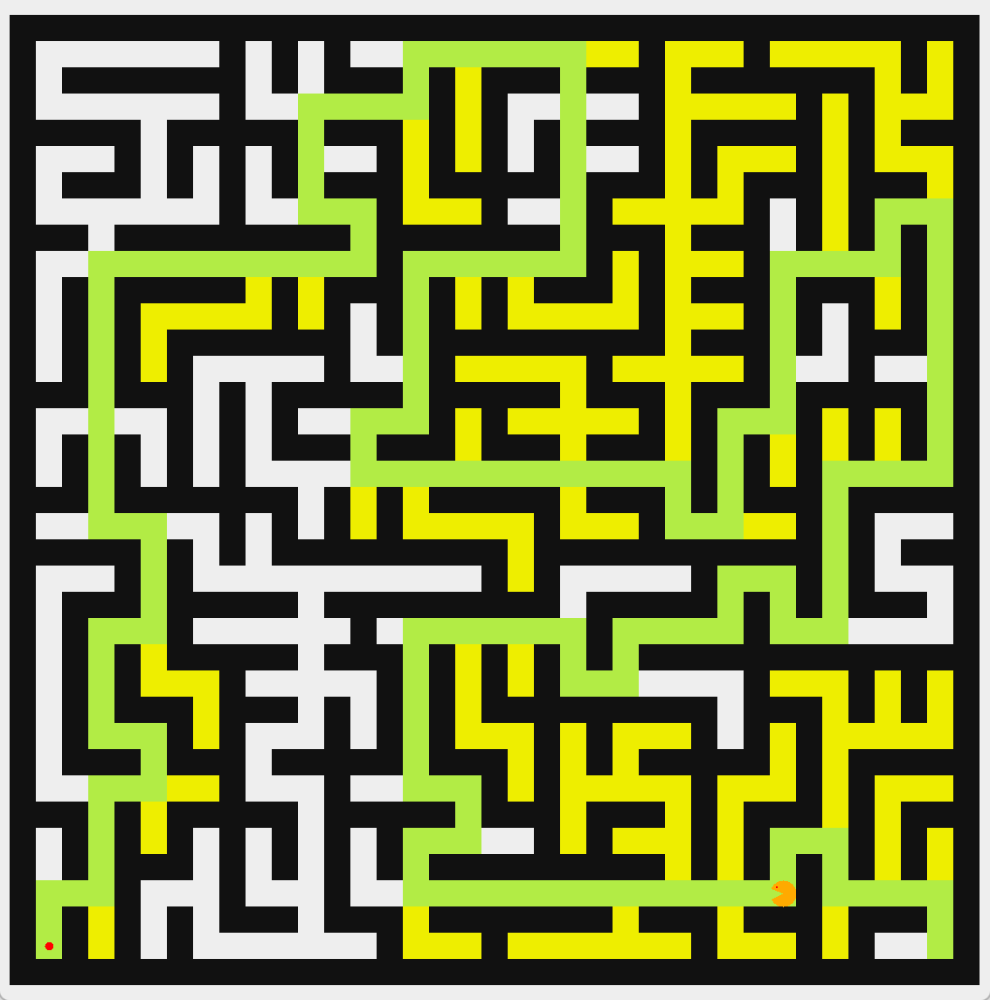

如果是左右上下的顺序，那么便会呈现出上图所示的效果。为什么会出现上述这种情况呢？因为使用深度优先遍历时，会选择某一个方向进行深度的搜索，比如上下左右时，那么优先选择左右的方向进行深度搜索，而如果顺序时左右上下时，则优先使用上下方向进行深度搜索。我们可以重新设计一个地图，再来看一下效果：

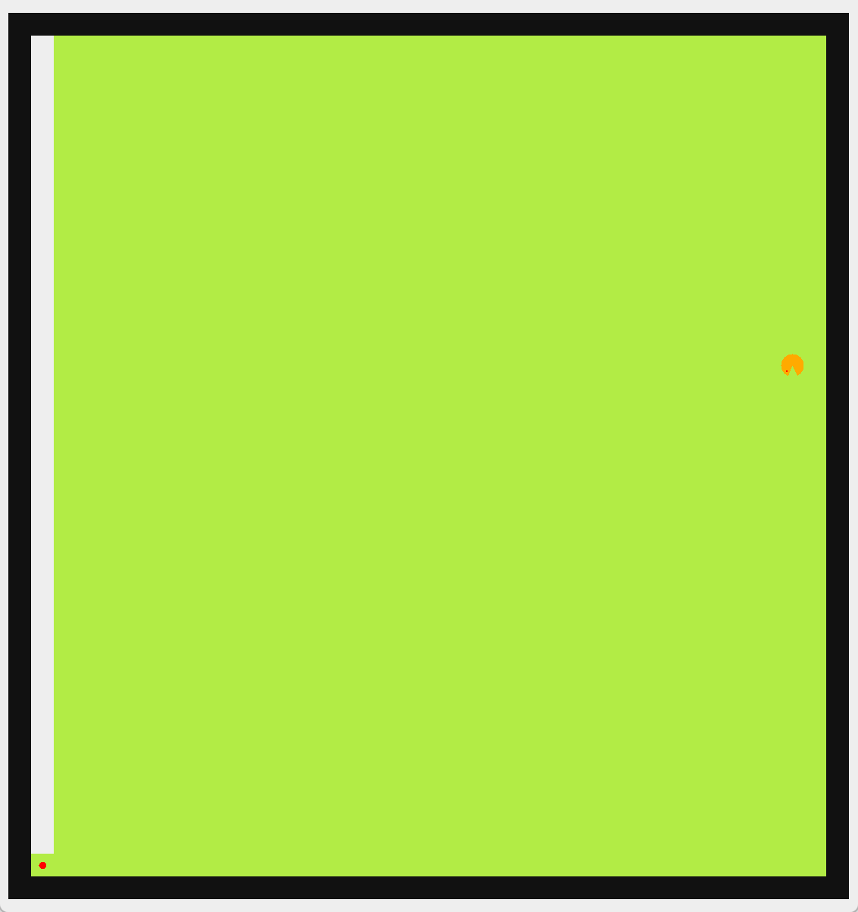

因为此时我们的顺序是左右上下，所以优先选择上下方向来进行深度遍历，便会出现如图中所示的效果。其实在本地图中，使用上下左右的顺序会更好一些，但是不同的地图，对应的最优顺序是不同的。这个是需要大家明确的，所以不能绝对说哪个方向在前面会更好。**但是我们有一个共识，那就是pacman在行进的时候，应该远离自己最开始的坐标，并且向食物的坐标靠近，不能远离之后又再次向自己坐标靠近。**这也便是后续需要给大家介绍的启发式搜索算法。

## 广度优先遍历思想

在上述案例中，我们使用深度优先遍历思想来完成了`pacman`寻找食物的过程，那么能否使用广度优先遍历思想来寻找食物呢？思考一下，如何来完成。

广度优先搜索（Breadth First Search）简称BFS，它的核心思想是从一个节点开始，访问其所有的临近节点，然后再使用相同的方式来访问这些临近节点的临近节点。遍历方式和水波纹的扩散过程很类似。


1.对于图中的V1，进行广度优先遍历，首先访问V1

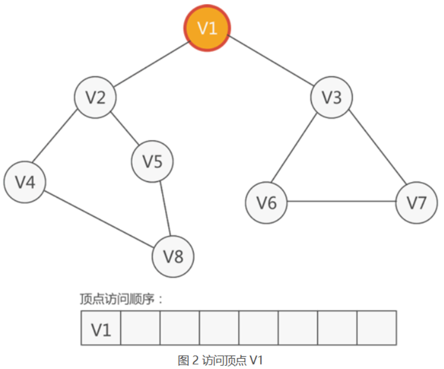

2.接着访问和V1连接的点V2和V3，依次入队

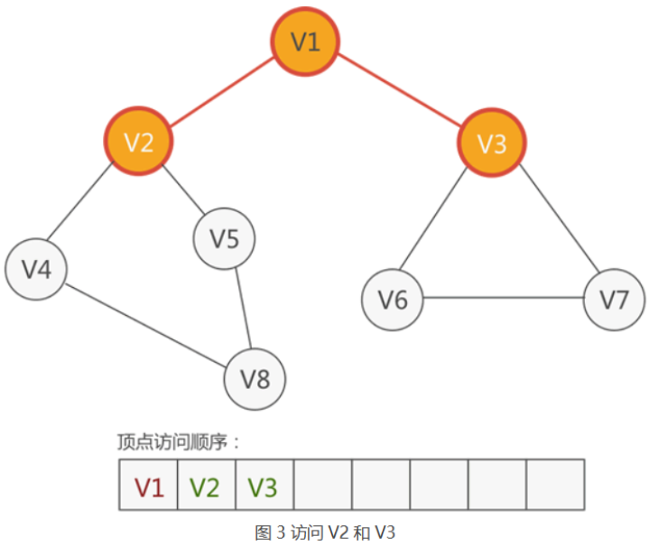

3.然后访问和V2相连的点V4和V5，依次入队

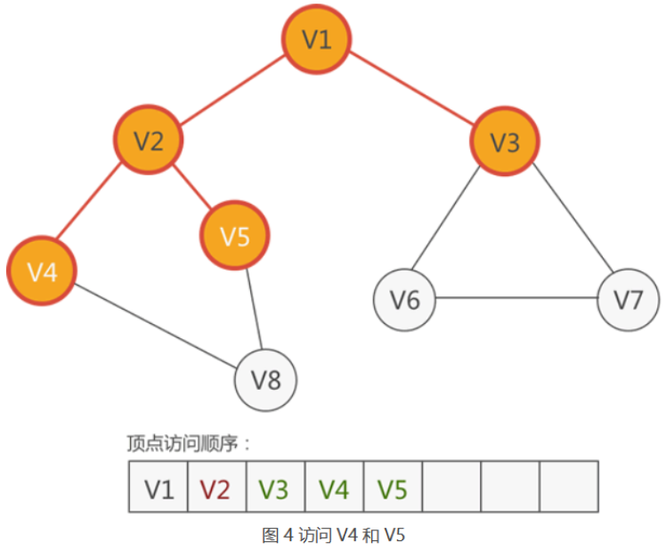

4.再然后是和V3相连的V6和V7，依次入队

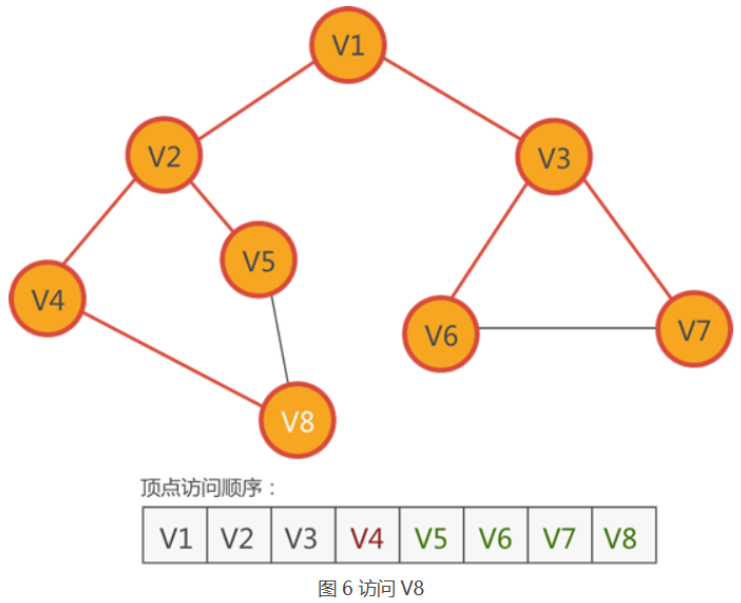

相关的算法过程和深度优先遍历过程比较类似，如下：

```java
public class BFSSearchFoodPacmanAgent implements Agent{

    @Override
    public Queue<Position> getPlan(GameStatus gameStatus) {
        boolean[][] foods = gameStatus.foods;
        Queue<Node> queue = new LinkedList<>();
        //加到末尾
        queue.offer(new Node(gameStatus.pacMan.coordinate));

        Set<Coordinate> searchedCoordinates = new LinkedHashSet<>();

        while (!queue.isEmpty()){
            //取第一个
            Node poll = queue.poll();

            gameStatus.pacMan.pacmanTraversedNodes.add(poll.coordinate);

            if(searchedCoordinates.contains(poll.coordinate)){
                continue;
            }else {
                searchedCoordinates.add(poll.coordinate);
            }


            //判断是否是食物
            if(foods[poll.coordinate.x][poll.coordinate.y]){
                //食物
                Queue<Position> position = Calculation.getPosition(poll);
                return position;
            }


            List<Node> aroundNodes = Calculation.getAroundNodes(poll, gameStatus);
            for (Node aroundNode : aroundNodes) {
                queue.offer(aroundNode);
            }
        }
        return null;
    }
}
```

使用广度优先遍历的搜索结果和水波纹的传播是比较相似的

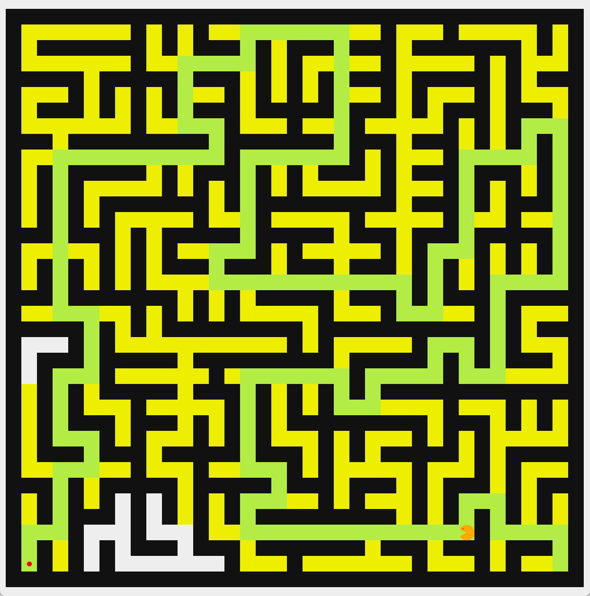

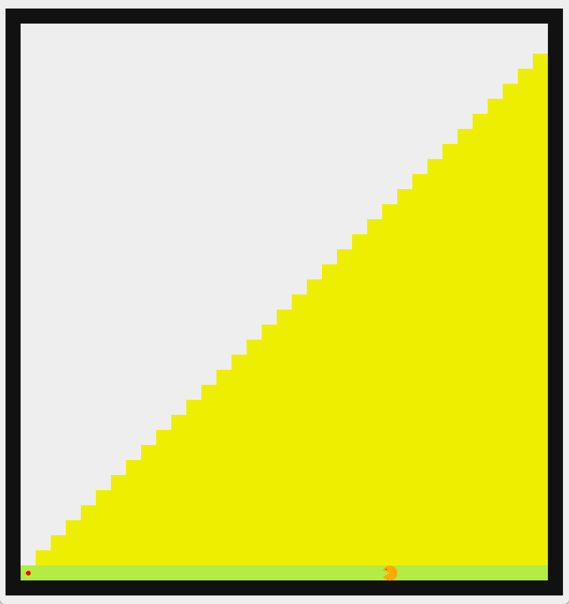

通过上述结果，我们可以发现，不能说深度优先优于广度优先，或者说广度优先优于深度优先，在不同的地图中，它们的表现形式都是不同的。


## 启发式搜索

在前面的课程中，我们使用的无论是深度优先搜索还是广度优先搜索，它们均是在搜索之前没有确定目标位置，而是在搜索过程中，遍历到某一个位置时才发现是我们需要的目标位置。这种搜索叫做盲目搜索。或者叫做非启发式搜索。那相对应的，以目标为启发信息而规划的搜索，以达到减少搜索范围、降低问题复杂度的目的，我们称之为启发式搜索。

在启发式搜索中有一个评价函数。评价函数的主要作用是评估搜索节点的重要性，以确定节点的优先级。评价函数的一般表示公式为


$$
f(x) = g(x) + h(x)
$$
f(x)称之为整体的花费;g(x)是起始位置到当前节点的花费;**h(x)是从当前位置开始到目标位置的一个预估花费**。我们希望f(x)总花费尽可能越小，因为花费越小，意味着寻找目标所行进的距离越小。g(x)是起始位置到当前节点的花费，是固定的。所以如果希望f(x)尽可能小的话，那么我们只需要让h(x)尽可能小即可。

在本项目中，有两种比较简单的方式可以用来评估预估花费。分别是曼哈顿距离(`Manhattan Distance`)和欧几里得距离(欧氏距离)(`Euclidean Distance`)

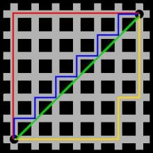

图中红线代表的是曼哈顿距离，绿线代表的是欧几里得距离。对应的数学公式(二维空间)如下：

曼哈顿距离：


$$
d(i,j) = |X_1 - X_2| + |Y_1 - Y_2|
$$
欧几里得距离：


$$
d(i,j) = \sqrt{(X_2 - X_1)^2 + (Y_2 - Y_1)^2}
$$
A\*算法是一种1968年提出的基于采样搜索的粗略路径规划算法。A\*算法是一种静态网中求解最短路径最有效的注解搜索方法，也是解决许多搜索问题的有效算法。本项目中，pacman寻找食物的这一过程我们便可以使用A*算法来加以实现。

**该算法的核心思想便是，首先获取pacman的起始位置以及食物的位置坐标，随后获取pacman周围临近的节点，计算该节点已经花费的距离和到食物的预估花费距离，将总花费进行排序，取最小的位置坐标来重复上述过程，直至最后规划出一条完整的路线来**。

```java
public class AStarSearchFoodPacmanAgent implements Agent{


    private Distance distance = new ManhattanDistance();


    @Override
    public Queue<Position> getPlan(GameStatus gameStatus) {
        Coordinate pacManCoordinate = gameStatus.pacMan.coordinate;
        //首先先确定pacman的坐标、食物的坐标
        Coordinate foodCoordinate = null;
        boolean[][] foods = gameStatus.foods;
        for (int x = 0; x < foods.length; x++) {
            for (int y = 0; y < foods[x].length; y++) {
                if(foods[x][y]){
                    foodCoordinate = new Coordinate(x, y);
                    break;
                }
            }
            if(foodCoordinate != null){
                break;
            }
        }
        //去查找pacman周围的临近节点，算出现有的花费和到食物坐标的预估花费，按照从小到大排序
        TreeSet<Node> tree = new TreeSet<>(new Comparator<Node>() {
            @Override
            public int compare(Node o1, Node o2) {
                double v = o1.totalCost - o2.totalCost;

                return v > 0 ? 1 : -1;
            }
        });

        //将pacman的起始位置放入进来 preCost：表示的是从pacman到当前位置已经得花费；totalCost：是当前位置到目标位置的预估花费 + 已经花费
        tree.add(new Node(pacManCoordinate,
                        null,
                        null,
                        0,
                         distance.getDistance(pacManCoordinate, foodCoordinate)));

        Set<Coordinate> searchedCoordinates = new HashSet<>();
        //找出花费最小的，找出临近的可使用的节点，再次进行运算
        while (!tree.isEmpty()){
            //取出最小花费的节点
            Node smallestNode = tree.pollFirst();

            gameStatus.pacMan.pacmanTraversedNodes.add(smallestNode.coordinate);

            if(searchedCoordinates.contains(smallestNode.coordinate)){
                continue;
            }else {
                searchedCoordinates.add(smallestNode.coordinate);
            }


            if(smallestNode.coordinate.equals(foodCoordinate)){
                //是食物
                Queue<Position> position = Calculation.getPosition(smallestNode);
                return position;
            }

            //获取当前节点周围的可以行动的节点
            List<Node> aroundNodes = Calculation.getAroundNodes(smallestNode, gameStatus);

            for (Node ad : aroundNodes) {
                tree.add(new Node(ad.coordinate, ad.preNode, ad.position,
                        //当前节点其实就是smallestNode过来的，smallestNode花费 + 1即可
                        smallestNode.preCost + 1,
                        //总花费便是已经花费+预估花费
                        smallestNode.preCost + 1 + distance.getDistance(ad.coordinate, foodCoordinate)));
            }

        }
        return null;
    }
}
```

我们使用一张地图，并用三种算法对其进行验证：

A*算法

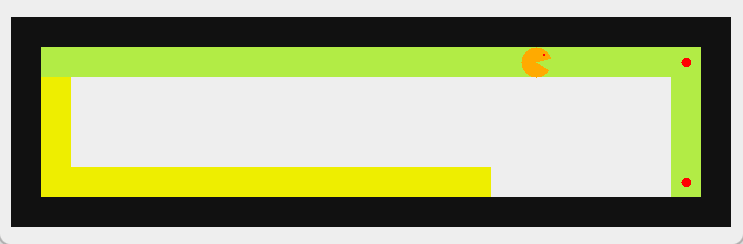

广度优先遍历

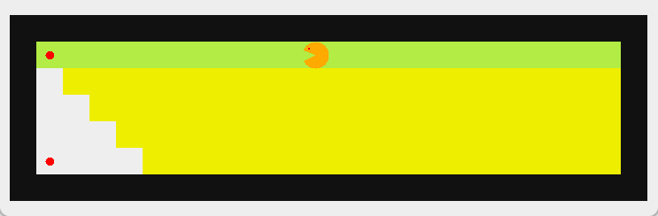

深度优先遍历

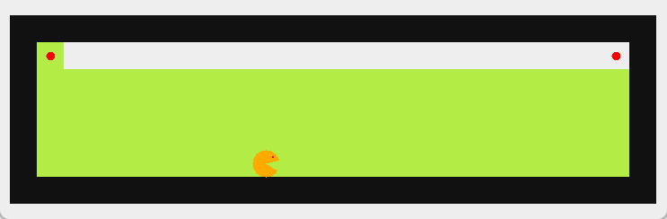

在这张地图中，三种算法的表现是A\*优于广度优先遍历优于深度优先遍历，虽然使用A\*的pacman运行路线和广度优先遍历的路线比较相似，但是通过搜寻过的路径我们可以明显看出A*搜索的路径更少。

> 如果我们将距离函数由曼哈顿距离更改为欧几里得距离之后，又会发生什么呢？
>
> 如果我们使用深度优先遍历、广度优先遍历来寻找食物能否实现呢？能否使用A*算法来寻找食物呢？


## 对抗问题

在前面课程中，没有涉及到幽灵，仅讨论了`pacman`和食物之间的问题，但是当我们引入幽灵之后，此时pacman依然需要吃掉食物，但同时也需要躲避幽灵的追逐才算胜利。而幽灵呢，需要抓住`pacman`才算胜利。这也就是`pacman`和幽灵的对抗问题。

### 幽灵追逐pacman

在对抗问题中，我们首先讨论第一部分：幽灵追逐`pacman`。幽灵如何移动呢？随机移动，或者追逐`pacman`进行移动。随机移动比较简单，大家可以思考应该如何编写。如果是追逐`pacman`进行移动，那么可以使用哪些算法呢？通过前面的学习，我们可以使用深度优先、广度优先、`A*`等算法来进行实现。其中深度优先、广度优先等算法都是属于盲目搜索，所以我们这里使用`A*`算法更为合适一些。在本场景下幽灵和`pacman`之间的关系就可以类比为`pacman`和食物之间的关系。

```java
public class ChasePacmanByAStarGhostAgent implements Agent {

    Distance distance = new EuclideanDistance();
    @Override
    public Queue<Position> getPlan(GameStatus gameStatus) {
        Queue<Position> positions = new LinkedList<>();

        Set<Coordinate> searchedCoordinates = new HashSet<>();

        Ghost ghost = gameStatus.ghostList.get(0);

        PacMan pacMan = gameStatus.pacMan;

        //每次从容器中取出总花费最少的
        TreeSet<Node> treeSet = new TreeSet<>(new Comparator<Node>() {
            @Override
            public int compare(Node o1, Node o2) {
                double value = o1.totalCost - o2.totalCost;
                return value > 0 ? 1 : -1;
            }
        });

        //初始位置，将幽灵的坐标放入treeset
        treeSet.add(new Node(ghost.coordinate,
                null,
                null,
                0,
                // 总花费 = 已花费 + 预估花费
                distance.getDistance(ghost.coordinate, pacMan.coordinate)));

        while (! treeSet.isEmpty()){
            //不为空，则提供一个最小花费节点，遍历周围的可使用节点，再次进行相同的操作
            Node smallest = treeSet.pollFirst();

            if(smallest.coordinate.equals(pacMan.coordinate)){
                //如果是pacman的坐标，则已经查找到这样的一条路线
                positions = Calculation.getPosition(smallest);
                return positions;
            }


            if(searchedCoordinates.contains(smallest.coordinate)){
                continue;
            }else {
                searchedCoordinates.add(smallest.coordinate);
            }

            //获取其临近的节点
            List<Node> aroundNodes = Calculation.getAroundNodes(smallest, gameStatus);
            for (Node aroundNode : aroundNodes) {
                treeSet.add(new Node(aroundNode.coordinate, smallest, aroundNode.position, smallest.preCost + 1,
                        smallest.preCost + 1 + distance.getDistance(aroundNode.coordinate, pacMan.coordinate)));
            }
        }
        return positions;
    }
}
```

此时你会发现这段代码运行虽然没啥问题，但是幽灵始终无法追到`pacman`，为什么呢？因为我们使用算法得到的行进计划是以`pacman`为起始位置而计算得到的，但是`pacman`始终是位于移动之中的，等幽灵到达`pacman`原先的位置时，`pacman`此时已经离开了该位置，这也就是为什么幽灵始终追不上`pacman`的原因。

### pacman躲避幽灵

我们以下面这张图为例，给大家分析一下应该如何处理。


pacman首先使用A*算法规划出一条到达食物的路线，随后需要考虑幽灵的问题，我们需要躲避幽灵。我们可以如何操作呢？我们将幽灵的位置以及幽灵的四周全部置于危险坐标，如果在规划的行进路线中，pacman的位置距离危险坐标过于近，则我们采取远离幽灵的措施。为了时刻能够检测幽灵的位置，我们的行进路径规划的始终是单步。


```java
public class EscapeGhostPacManAgent implements Agent {

    private FoodStrategy foodStrategy = new BFSFoodStrategy();

    private Distance distance = new EuclideanDistance();

    @Override
    public Queue<Position> getPlan(GameStatus gameStatus) {
        Queue<Position> positions = new LinkedList<>();

        //1.将幽灵的下一步位置设置为危险坐标，走不包含危险坐标的路径
        //如果幽灵有行进计划，则取出第一个；如果幽灵没有行进计划，则将该幽灵四周全部标记为危险坐标
        Ghost ghost = gameStatus.ghostList.get(0);
        Coordinate ghostCoordinate = ghost.coordinate;
        Queue<Position> ghostPlan = ghost.routerPlan;
        List<Coordinate> dangerCoordinates = new ArrayList<>();

        if(ghostPlan != null && !ghostPlan.isEmpty()){
            //取出第一个看看
            Position peek = ghostPlan.peek();
            Coordinate nextCoordinate = Calculation.getCoordinate(ghostCoordinate, peek);
            dangerCoordinates.add(nextCoordinate);
        }else {
            //如果没有行进计划，则将当前幽灵周围的坐标全部置于危险坐标
            dangerCoordinates.add(ghostCoordinate);
            dangerCoordinates.add(Calculation.getCoordinate(ghostCoordinate, Position.UP));
            dangerCoordinates.add(Calculation.getCoordinate(ghostCoordinate, Position.DOWN));
            dangerCoordinates.add(Calculation.getCoordinate(ghostCoordinate, Position.LEFT));
            dangerCoordinates.add(Calculation.getCoordinate(ghostCoordinate, Position.RIGHT));
        }

        //接下来写A*算法
        Coordinate foodCoordinate = foodStrategy.getFoodCoordinate(gameStatus);

        Coordinate pacManCoordinate = gameStatus.pacMan.coordinate;

        TreeSet<Node> treeSet = new TreeSet<>(new Comparator<Node>() {
            @Override
            public int compare(Node o1, Node o2) {
                double v = o1.totalCost - o2.totalCost;
                return v > 0 ? 1 : -1;
            }
        });

        //将pacman位置放入
        treeSet.add(new Node(pacManCoordinate,
                null,
                null,
                0,
                distance.getDistance(pacManCoordinate, foodCoordinate)));

        HashSet<Coordinate> searchedCoordinates = new HashSet<>();

        while (! treeSet.isEmpty()){

            Node smallest = treeSet.pollFirst();

            //防止陷入死循环
            if(searchedCoordinates.contains(smallest.coordinate)){
                continue;
            }else {
                searchedCoordinates.add(smallest.coordinate);
            }

            //如果smallest坐标在危险坐标中，则不去走这条路
//            if(dangerCoordinates.contains(smallest.coordinate)){
//                continue;
//            }


            if(smallest.coordinate.equals(foodCoordinate)){
                //食物坐标
                positions = Calculation.getPosition(smallest);

                //找到食物坐标，则路线已经规划出来了，此时需要统计路线上是否有幽灵，如果有幽灵，需要统计幽灵和pacman的步数，如果3步以外，不管
                LinkedList<Node> linkedList = new LinkedList<>();
                linkedList.addFirst(smallest);
                while (linkedList.peek().preNode != null){
                    linkedList.addFirst(linkedList.peek().preNode);
                }

                int steps = 0;
                for (int i = 0; i < linkedList.size() - 1; i++) {
                    steps ++;
                    Coordinate coordinate = linkedList.get(i).coordinate;
                    if(dangerCoordinates.contains(coordinate)){
                        break;
                    }
                }

                if(steps < 2){
                    //先获取当前坐标周围可以行进的坐标，但是不能是危险坐标
                    List<Node> aroundNodes = Calculation.getAroundNodes(new Node(pacManCoordinate), gameStatus);
                    List<Node> availableNodes = new ArrayList<>();
                    for (Node item : aroundNodes) {
                        if(! dangerCoordinates.contains(item.coordinate)){
                            //可以走
                            availableNodes.add(item);
                        }
                    }
                    int index = (int) (Math.random() * availableNodes.size());
                    positions.clear();
                    positions.offer(availableNodes.get(index).position);
                    //远离
                }else if(steps < 3){
                    //先观望一下
                    positions.clear();
                    positions.offer(Position.STOP);
                }else {
                    //每次走一步
                    Position poll = positions.poll();
                    positions.clear();
                    positions.offer(poll);
                }

                return positions;
            }

            //找出其临近节点
            List<Node> aroundNodes = Calculation.getAroundNodes(smallest, gameStatus);
            for (Node node : aroundNodes) {
                treeSet.add(new Node(node.coordinate,
                        smallest,
                        node.position,
                        smallest.preCost + 1,
                        smallest.preCost + 1 + distance.getDistance(node.coordinate, foodCoordinate)));
            }

        }
        return null;
    }
}
```

但是上述代码存在着什么样的问题呢？存在着硬编码，我们根据自己的经验设定距离3步、距离2步应该怎么怎么操作，非常具有主观性。接下来的课程中，我们会给大家介绍一种极大极小的思想，客观地解决该问题。

### Minmax

极大极小(Minmax)搜索算法是指在零和博弈中，玩家均会在可选的选项中选择将其N步后优势最大化或者令对手最小化的选择。

将双方的决策过程视为一棵决策树，若决策树的某一层均为己方决策依据状态（即接下来己方动作），则己方必定会选择使得己方收益最大化的路径，该层称为MAX层。若决策树某一层均为对手决策依据状态（即接下来对手动作），则对手必定会选择使得己方收益最小化的路径，该层称为MIN层。

由此，一个极小极大策略树将包含max节点（max层中的节点）、min节点（MIN层中的节点）和终止节点（博弈终止状态节点或N步时的状态节点）。每个节点对应的预期收益称为该节点的minmax值。

对于终止节点，minmax值等于直接对局面的估值。对于max节点，由于max节点所选择的动作将会有己方给定，因此选择minmax值最大的子节点的值作为max节点的值。对于min节点，则选择minmax值最小的子节点的值作为min节点的值。


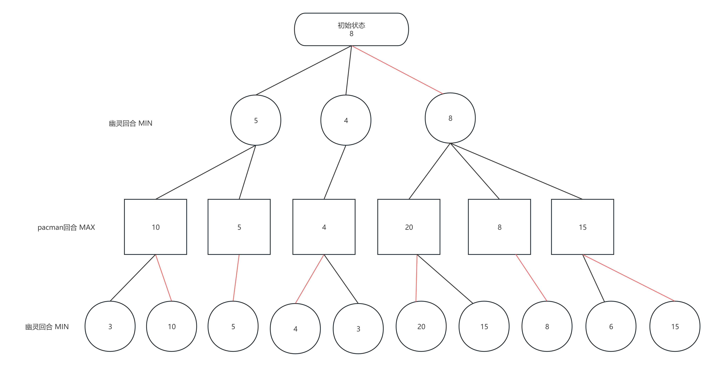

通俗的来说，幽灵和pacman双方是相互对抗的。pacman倾向于获得最大的分数，但是幽灵要阻止pacman获得较大的分数，也就是获取最小的分数。

比如最下层的幽灵回合，假设行进之后的得分分别为标注的数字，轮到pacman回合时，总是倾向于获取较高的分数，分别是图中红色线标注的部分，但是下一次再次轮到幽灵回合时，因为幽灵和pacman是相互博弈的双方，幽灵总是倾向于让pacman获取较少的分数，所以最终的得分最多是8分。这便是minmax的原理。

那么代码应该如何编写呢？我们首先分析一下min()和max()的逻辑。

```
min(){
	1.获取该节点下的所有子节点信息
	2.对所有的孩子节点调用max()方法
	3.在获得的所有的max返回值中选择一个最小值
	4.返回结果
}

max(){
	1.获取该节点下的所有子节点信息
	2.对所有的孩子节点调用min()方法
	3.在获得的所有的min返回值中选择一个最大值
	4.返回结果
}
```

```java
public class MinMaxPacmanAgent implements Agent {
    @Override
    public Queue<Position> getPlan(GameStatus gameStatus) {
        Queue<Position> queue = new LinkedList<>();

        //调用max进行递归计算
        ScorePosition scorePosition = max(2, gameStatus);
        System.out.println(scorePosition.score);
        System.out.println(scorePosition.position);
        queue.offer(scorePosition.position);
        return queue;
    }

    //pacman回合
    public ScorePosition max(int depth, GameStatus gameStatus){

        if(depth < 1){
            //遍历完成 出口
            return new ScorePosition(0, Position.STOP);
        }

        //将一次max和min的操作当做一个回合，
        depth --;

        //移动pacman，在pacman的可行进节点中选择一个得分最大的
        List<Node> nodes = Calculation.getAroundNodes(new Node(gameStatus.pacMan.coordinate), gameStatus);

        TreeSet<ScorePosition> positions = new TreeSet<>(new Comparator<ScorePosition>() {
            @Override
            public int compare(ScorePosition o1, ScorePosition o2) {
                int value = o1.score - o2.score;
                return value > 0 ? 1 : -1;
            }
        });
        for (Node item : nodes) {
            //pacman每移动一步，分数便减1
            int stepScore = -1;
            ScorePosition temp = new ScorePosition(0, item.position);
            //如果走的这个位置有食物，则加分
            if(gameStatus.foods[item.coordinate.x][item.coordinate.y]){
                //加分
                stepScore += 20;
            }

            Ghost ghost = gameStatus.ghostList.get(0);
            //如果这个位置是幽灵，则分数为极小值
            if(ghost.coordinate.equals(item.coordinate)){
                //如果这个位置是幽灵，则设置一个非常小的值
                temp.score = -1000000 + stepScore;
                temp.position = item.position;
            }
            GameStatus gameCopyStatus = new GameStatus();
            //创建一个游戏副本对象，给后面递归逻辑处理使用
            //比如第一个递归时找到一个事物，后面肯定需要将该食物置于空，进行后续处理；但是如果直接在游戏状态中更改
            //则食物就的的确确没了，但是此时pacman还没有开始移动
            StatusUtils.copyStatusByPacman(gameStatus, gameCopyStatus, item);


            //调用min方法
            int min = min(depth, gameCopyStatus).score;

            stepScore += min;
            temp.score = temp.score + stepScore;

            positions.add(temp);
        }
        return positions.pollLast();
    }

    //幽灵回合
    public ScorePosition min(int depth, GameStatus gameStatus){
        Ghost ghost = gameStatus.ghostList.get(0);
        List<Node> aroundNodes = Calculation.getAroundNodes(new Node(ghost.coordinate), gameStatus);

        TreeSet<ScorePosition> positions = new TreeSet<>(new Comparator<ScorePosition>() {
            @Override
            public int compare(ScorePosition o1, ScorePosition o2) {
                int value = o1.score - o2.score;
                return value > 0 ? 1 : -1;
            }
        });

        for (Node item : aroundNodes) {
            int stepScore = -1;

            ScorePosition temp = new ScorePosition(0, item.position);

            //幽灵是否和pacman相遇
            if(ghost.coordinate.equals(gameStatus.pacMan.coordinate)){
                temp.score = -1000000 + stepScore;
                temp.position = item.position;
            }
            GameStatus copyGameStatus = new GameStatus();

            StatusUtils.copyStatusByGhost(gameStatus, copyGameStatus, item);

            //调用max回合
            int max = max(depth, copyGameStatus).score;
            stepScore += max;
            temp.score = temp.score + stepScore;

            positions.add(temp);

        }
        return positions.pollFirst();
    }
}
```

```java
public class StatusUtils {
    public static void copyStatusByPacman(GameStatus origin, GameStatus dest, Node item) {

        //创建一个全新的pacman
        dest.pacMan = new PacMan(new Coordinate(item.coordinate.x,item.coordinate.y));

        dest.ghostList = new ArrayList<>();

        List<Ghost> originGhostList = origin.ghostList;
        for (Ghost ghost : originGhostList) {
            dest.ghostList.add(new Ghost(new Coordinate(ghost.coordinate.x, ghost.coordinate.y)));
        }

        dest.foods = new boolean[origin.foods.length][origin.foods[0].length];

        //复制食物信息
        for (int x = 0; x < origin.foods.length; x++) {
            for (int y = 0; y < origin.foods[x].length; y++) {
                dest.foods[x][y] = origin.foods[x][y];
            }
        }

        //处理当前节点，如果是食物，前面已经加了分数，此时把该位置食物置于false；如果不是食物，还是置于false没影响
        dest.foods[item.coordinate.x][item.coordinate.y] = false;

        //复制墙 墙不会变化，可以直接复制
        dest.walls = origin.walls;
    }

    public static void copyStatusByGhost(GameStatus origin, GameStatus dest, Node item) {
        dest.pacMan = new PacMan(new Coordinate(origin.pacMan.coordinate.x, origin.pacMan.coordinate.y));

        dest.ghostList = new ArrayList<>();

        List<Ghost> originGhostList = origin.ghostList;

        //只有一个幽灵，更新幽灵坐标
        for (int i = 0; i < originGhostList.size(); i++) {
            dest.ghostList.add(new Ghost(new Coordinate(item.coordinate.x, item.coordinate.y)));
        }

        //更新食物副本
        dest.foods = new boolean[origin.foods.length][origin.foods[0].length];

        for (int x = 0; x < origin.foods.length; x++) {
            for (int y = 0; y < origin.foods[x].length; y++) {
                dest.foods[x][y] = origin.foods[x][y];
            }
        }
        dest.walls = origin.walls;
    }
}
```

整体的思路：**minmax中包含两个方法，max方法是己方操作，min方法是对手操作。先手己方操作选择的方向有哪些，分别max方法之后得到一个数值，该数值可以理解为对己方有利的操作，数值越大越好；接下来由对手进行操作，此时对手选择的方向有哪些，对应的结果对我的影响如何呢？分别调用min方法之后会得到一个数值，我们需要选择min方法返回结果最小的，因为对于我们的影响越小。设置了递归的层级，可以理解为视野的距离，比如设置5，那么就遍历接下来5步操作的所有可能性，如果设置1，那么仅关注接下来1步的操作**。需要特别注意的是：**我们在处理的时候，需要将当前游戏状态进行一个拷贝**。

### α-β剪枝

通过上述代码，我们可以发现`minmax`算法在进行遍历时，如果遍历的程度非常深，那么运算量呈指数级别增长。这势必会带来极大的算力开销。如果我们希望可以对`minmax`进行一些优化操作，应该怎么办呢？以下面的这张图为例，我们来进行阐述。

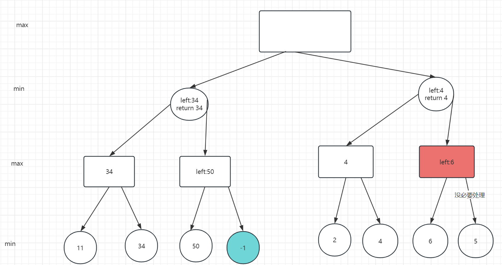

上图中，最下层的min节点，11和34，被上一层的max方法所调用，取较大值，也就是34.该节点被上层的min方法所调用，left返回了34，右侧节点的left返回了50，此时，**图中标注的-1节点还有处理的必要吗**？**如果该节点的返回值大于50，上层节点取最小值，它的值不会被采纳；如果该节点的值小于50，但是该节点上层的max节点需要取最大值，同样不会被采纳**。再来看右侧节点，**最下层的2和4节点，取最大值，left返回了4，此时4节点右侧的节点还有处理的必要吗？如果该节点的值大于4，min方法会取二者的最小值，所以不会被采纳；如果该值小于4，那么会更新上层的min操作节点的值，但是最顶层操作是需要取最大值，依然取不到该值，所以橙色标注的6也没必要处理**。

上述便是剪枝的原理。至于α-β剪枝，便是对上述过程又做了更加精细的说明。α-β剪枝主要的目的便是对于minmax算法进行优化。用α-β剪枝的方式，解决minmax算法进行搜索时，会处理一些本来没有必要的节点，造成的算法开销过大。α-β剪枝相对于minmax算法额外引入了两个参数，分别是**下界α和上界β**，通过这两个参数来判断被访问的节点是否需要被剪枝。总的来说，对于minmax算法来说，我们只需要关注每个节点的minmax的值；而对于α-β剪枝，我们需要关注的是α、β、minmax的值、关注α和β的更新原则、发生剪枝的原因。

**1.α的初始化是-∞，β初始化为+∞。在max层更新α的值；在min层更新β的值。α和β只向下传递。**

**2.按照DFS的方式进行搜索，在搜索过程中，如果min层子节点的值比min层的β值更小，则更新其β值。如果max层的子节点的值比max层的α更大，则更新其α。**

**3.如果min层的子节点的值比min层的α值更小(v <= α)，会出现剪枝；如果max层的子节点的值比max层的β值更大(v >= β)，会出现剪枝**

以下图中的这颗树为例，我们来进行讲解，正方形表示的是max操作；圆形表示的是min操作。

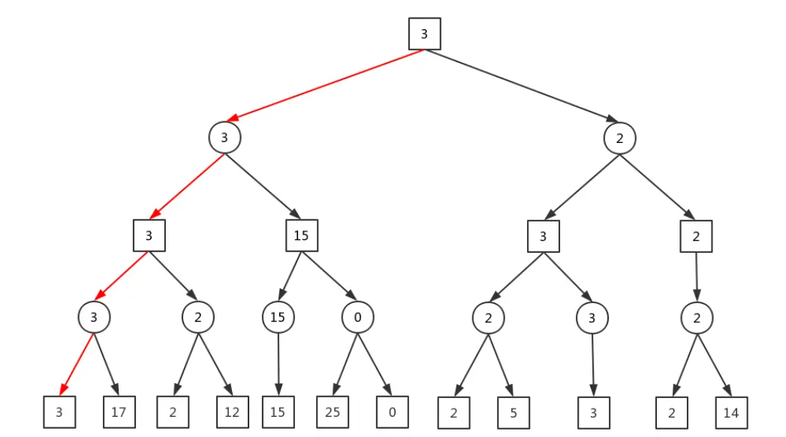

1.使用DFS的方式进行搜索，搜索到最左层的叶子节点时，更新min层的β值。随后处理17时，发现该值不比min层的β值更小，所以不更新；

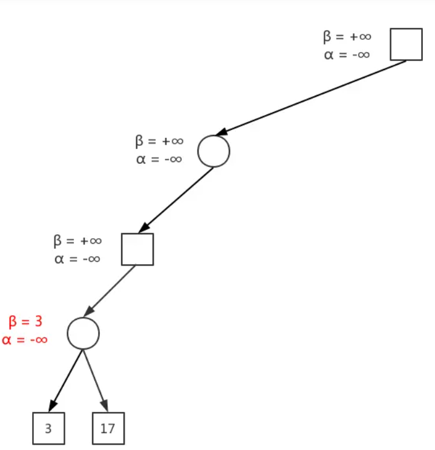

2.需要将当前节点的值返回给其父节点，父节点为MAX层，所以需要更新MAX层节点的α值。该父节点的另外一个子节点会继承α和β的值。

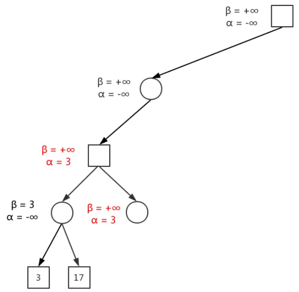

3.继续向下搜索叶子节点，使用相同的策略更新节点，因为该节点是MIN层，更新β值，如果更新的话会变成2，但是这一步没必要更新，因为不可能从当前操作中产生最优解。min层子节点的值2小于min层的α值，会出现剪枝。

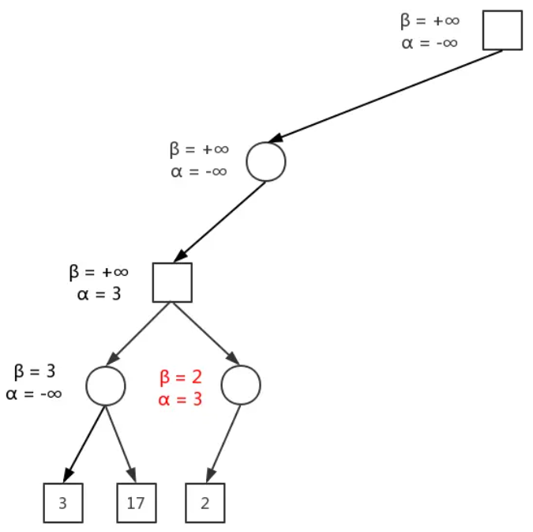

4.接下来尝试更新父节点的值，父节点为MIN层，子节点的值为3小于β值，所以更新该节点的β为3.生成的子节点会继承父节点的α和β值。叶子节点数值为15，尝试更新其父节点β的值，因为β的值小于15，所以不会发生更新操作。返回对应的节点值15.

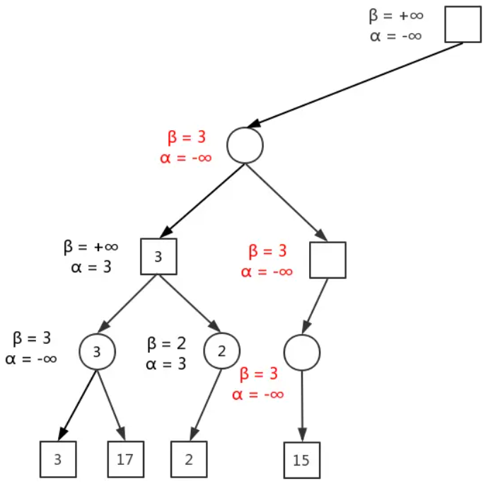

5.进一步尝试更新其父节点的α值，因为子节点的值15比父节点的α值更大，更新其α值。因为在当前节点中α  > β，所以最优解不可能从当前途径中产生。后续无需再进行处理。尝试更新其父节点的值。因为子节点的值不比3更小，所以不会更新父节点的β值，同时可以确定该节点的值为3.

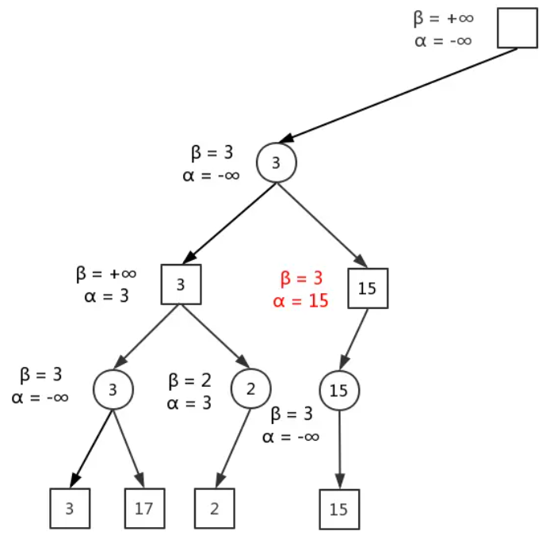


6.继续返回节点值给父节点，尝试更新父节点的α ，发现父节点α < 3 ，则更新α = 3，并继续向下搜索直至叶子节点。注意新生成的子节点的 α 、 β 值继承自父节点。

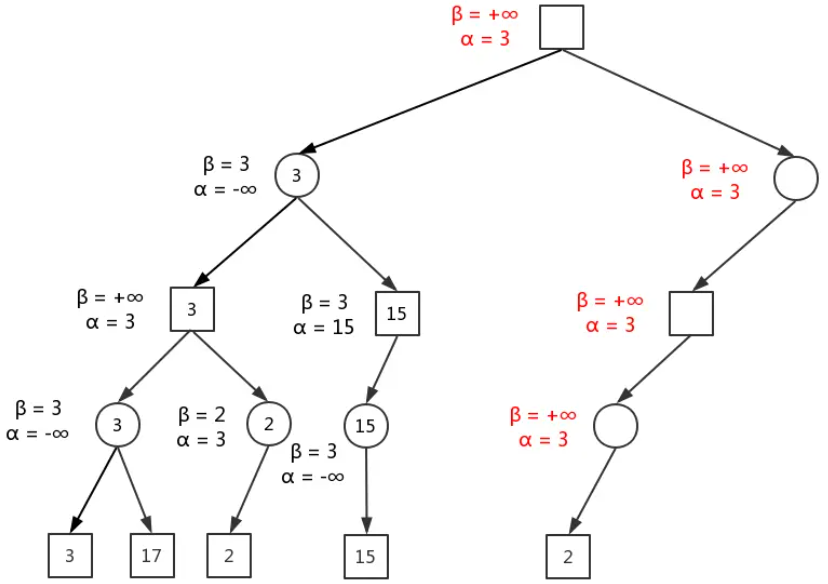

7.从叶子节点返回节点值给父节点（Min节点），并尝试更新其父节点的β值，因为父节点β > 2，所以，更新β = 2，此时有α > β，说明其子节点并不包含最优解，不需要再进行搜索。所以返回其节点值给父节点（Max节点），尝试对父节点的α值进行更新。因为父节点α > 2 ，无需进行更新，继续搜索其子节点至叶子节点。

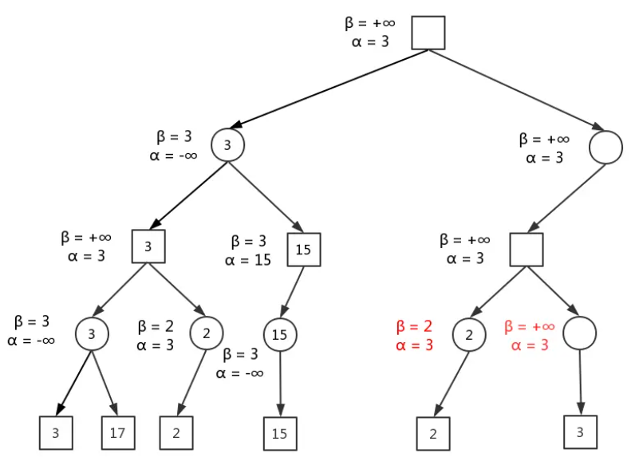

8.叶子节点的返回值返回给父节点，尝试更新父节点的β值。因为父节点β > 3，所以，更新β = 3。父节点的值为3.因为该节点的α = β = 3，所以无需再搜索其他子节点，尝试更新父节点的值。因为父节点α = 3，所以无需进行更新。同样操作直至处理到根节点。


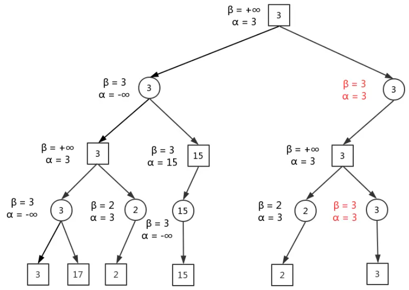

剪枝只需要在原有代码基础上稍加改动即可。

```java
public class MinMaxalphabetaPruningPacmanAgent implements Agent {
    @Override
    public Queue<Position> getPlan(GameStatus gameStatus) {
        Queue<Position> queue = new LinkedList<>();

        //调用max进行递归计算
        ScorePosition scorePosition = max(5, gameStatus, -10000000, 10000000);
        System.out.println(scorePosition.score);
        System.out.println(scorePosition.position);
        queue.offer(scorePosition.position);
        return queue;
    }

    //pacman回合
    public ScorePosition max(int depth, GameStatus gameStatus, int alpha, int beta){

        if(depth < 1){
            //遍历完成 出口
            return new ScorePosition(0, Position.STOP);
        }

        //将一次max和min的操作当做一个回合，
        depth --;

        //移动pacman，在pacman的可行进节点中选择一个得分最大的
        List<Node> nodes = Calculation.getAroundNodes(new Node(gameStatus.pacMan.coordinate), gameStatus);

        TreeSet<ScorePosition> positions = new TreeSet<>(new Comparator<ScorePosition>() {
            @Override
            public int compare(ScorePosition o1, ScorePosition o2) {
                int value = o1.score - o2.score;
                return value > 0 ? 1 : -1;
            }
        });
        for (Node item : nodes) {
            //pacman每移动一步，分数便减1
            int stepScore = -1;
            ScorePosition temp = new ScorePosition(0, item.position);
            //如果走的这个位置有食物，则加分
            if(gameStatus.foods[item.coordinate.x][item.coordinate.y]){
                //加分
                stepScore += 20;
            }

            Ghost ghost = gameStatus.ghostList.get(0);
            //如果这个位置是幽灵，则分数为极小值
            if(ghost.coordinate.equals(item.coordinate)){
                //如果这个位置是幽灵，则设置一个非常小的值
                temp.score = -1000000 + stepScore;
                temp.position = item.position;
            }
            GameStatus gameCopyStatus = new GameStatus();
            //创建一个游戏副本对象，给后面递归逻辑处理使用
            //比如第一个递归时找到一个食物，后面肯定需要将该食物置于空，进行后续处理；但是如果直接在游戏状态中更改
            //则食物就的的确确没了，但是此时pacman还没有开始移动
            StatusUtils.copyStatusByPacman(gameStatus, gameCopyStatus, item);


            //调用min方法
            int min = min(depth, gameCopyStatus, alpha, beta).score;

            stepScore += min;
            temp.score = temp.score + stepScore;

            positions.add(temp);

            //如果当前子节点的返回值结果大于β的值，则出现剪枝
            if(temp.score >= beta){
                break;
            }
            //如果max层的子节点的值比max层的α更大，更新α
            alpha = Math.max(alpha, temp.score);
        }
        return positions.pollLast();
    }

    //幽灵回合
    public ScorePosition min(int depth, GameStatus gameStatus,int alpha, int beta){
        Ghost ghost = gameStatus.ghostList.get(0);
        List<Node> aroundNodes = Calculation.getAroundNodes(new Node(ghost.coordinate), gameStatus);

        TreeSet<ScorePosition> positions = new TreeSet<>(new Comparator<ScorePosition>() {
            @Override
            public int compare(ScorePosition o1, ScorePosition o2) {
                int value = o1.score - o2.score;
                return value > 0 ? 1 : -1;
            }
        });

        for (Node item : aroundNodes) {
            int stepScore = -1;

            ScorePosition temp = new ScorePosition(0, item.position);

            //幽灵是否和pacman相遇
            if(ghost.coordinate.equals(gameStatus.pacMan.coordinate)){
                temp.score = -1000000 + stepScore;
                temp.position = item.position;
            }
            GameStatus copyGameStatus = new GameStatus();

            StatusUtils.copyStatusByGhost(gameStatus, copyGameStatus, item);

            //调用max回合
            int max = max(depth, copyGameStatus, alpha, beta).score;
            stepScore += max;
            temp.score = temp.score + stepScore;
            positions.add(temp);

            //如果子节点提供的值小于α，出现剪枝
            if(temp.score <= alpha){
                break;
            }
            beta = Math.min(beta, temp.score);
        }
        return positions.pollFirst();
    }
}
```


