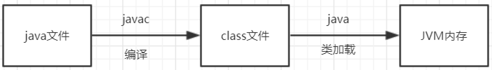
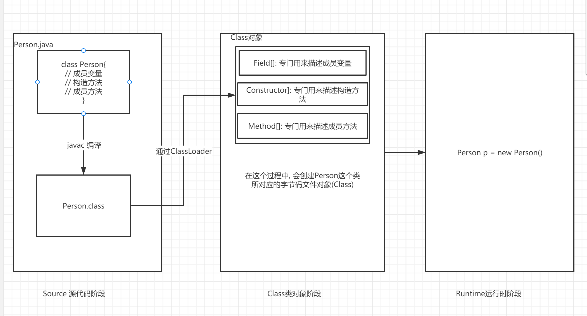
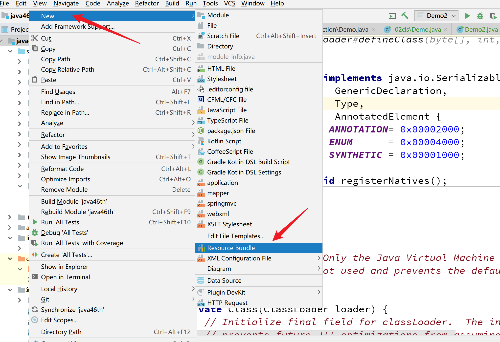

学习目标:

- 熟悉类加载过程与类加载器
- 熟练掌握类加载时机
- 掌握如何获取字节码文件对象
- 掌握使用配置文件
- 掌握Constructor,Field,Method使用
- 熟悉了解自定义类加载器与双亲委派模型(有能力的同学掌握)

# 类加载



## 过程

- 加载

  - 通过类加载器(ClassLoader)加载.class文件,读取到内存
  - 在这个过程中,生成这个类所对应的字节码文件对象(java.lang.Class)

- 链接

  - 验证: 对字节码文件格式的验证(aced babe 咖啡宝贝 魔法数字)

  - 准备: 给类的静态成员分配内存并赋予默认初始值

    - ```java
      static int a =10;
      ```

      

  - 解析: 把符号引(用一组符号来描述被引用的目标)用转化为直接引用(真实的地址)

  - ```
    class Student{
     String name;
     int age;
     Subject subject;
     
    }
    
    class Subject{
    	String name;
    }
    ```

    

- 初始化

  - 给静态成员赋真实的值, 并且执行静态代码块中的内容

## 类加载器

### 分类

Bootstrap ClassLoader 根类加载器
负责Java运行时核心类的加载，JDK中JRE的lib目录下rt.jar

Extension ClassLoader 扩展类加载器
负责JRE的扩展目录中jar包的加载，在JDK中JRE的lib目录下ext目录

Sysetm(App) ClassLoader 系统类加载器/应用加载器
 负责加载自己定义的Java类   

```java
package _23reflect.com.cskaoyan._01introduction;

/**
 * @description:
 * @author: 景天
 * @date: 2022/10/22 11:42
 **/

public class Demo {
    public static void main(String[] args) {
        // 查看类加载器
        // 系统类加载器
        ClassLoader systemClassLoader = ClassLoader.getSystemClassLoader();
        System.out.println(systemClassLoader);

        // 扩展类加载器
        ClassLoader parent = systemClassLoader.getParent();
        System.out.println(parent);

        // 根类加载器 null 不是java写的
        ClassLoader parent1 = parent.getParent();
        System.out.println(parent1);

        // 看一下加载路径
        System.out.println(System.getProperty("java.class.path")
                .replace(";", System.lineSeparator()));
        System.out.println("-------");
        System.out.println(System.getProperty("java.ext.dirs")
                .replace(";", System.lineSeparator()));


    }
}

```


## 类加载时机

创建类的实例(首次创建该类对象)

访问类的静态变量(首次)

调用类的静态方法(首次)

加载某个类的子类，会先触发父类的加载

直接使用java.exe命令来运行某个主类，也就是执行了某个类的main()方法

**使用反射方式来强制创建某个类或接口对应的java.lang.Class对象**

# java代码的3个阶段



# 反射

## 什么是反射

获取运行时类信息的一种手段

反射的起点是字节码文件对象

## 获取字节码文件对象的几种方式

- 对象.getClass()
- 类名.class
- Class.forName(String className)  全限定名
- ClassLoader里的loadClass(String className)

**注意:**

无论通过什么方式获取的字节码文件对象 都是同一个

Demo

```java
package _23reflect.com.cskaoyan._02cls;

/**
 * @description:
 * @author: 景天
 * @date: 2022/10/24 9:58
 **/
/*
获取字节码文件对象的几种方式
 */
public class Demo {
    public static void main(String[] args) throws ClassNotFoundException {
        // 对象.getClass
        A a = new A();
        Class<? extends A> c1 = a.getClass();

        // 类名.class
        Class<A> c2 = A.class;

        System.out.println(c1 == c2);

        // Class.forName(全限定名)
        Class<?> c3 = Class.forName("_23reflect.com.cskaoyan._02cls.A");

        System.out.println(c1 == c3);

        // ClassLoader.loadClass(String className)
        ClassLoader systemClassLoader = ClassLoader.getSystemClassLoader();
        Class<?> c4 = systemClassLoader.loadClass("_23reflect.com.cskaoyan._02cls.A");
        System.out.println(c1 == c4);

    }
}

class A{

}
```


注意

```java
package _23reflect.com.cskaoyan._02cls;


public class Demo2 {
    public static void main(String[] args) throws ClassNotFoundException {
        // 类名.class
        // 没有执行静态代码块
        //Class<B> c1 = B.class;

        // Class.forName()
        // 执行静态代码块
        Class<?> c2 = Class.forName("_23reflect.com.cskaoyan._02cls.B");
        
    }
}

class B{
    static {
        System.out.println("静态代码块执行了!");
    }
}

```


## 关于Class

`Class` 类的实例表示正在运行的 Java 应用程序中的类和接口

`Class` 没有公共构造方法。`Class` 对象是在加载类时由 Java 虚拟机以及通过调用类加载器中的  `defineClass` 方法自动构造的。 


## 配置文件(.properties)

配置文件的几种格式.properties    .xml     .yml

配置文件的作用: 放配置信息的 (数据库的, 第三方服务的配置信息)

.properties的格式 键值对(key-value)  key=value   key是不能重复的

注释是#  文件里面全是String  




获取配置信息

**Properties类**

`Properties` 类表示了一个持久的属性集。`Properties`  可保存在流中或从流中加载。属性列表中每个键及其对应值都是一个字符串。 

构造方法

Properties()        创建一个无默认值的空属性列表。

成员方法

| void | load(InputStream inStream)        从输入流中读取属性列表（键和元素对）。 |
| ---- | ------------------------------------------------------------ |
| void | load(Reader reader)        按简单的面向行的格式从输入字符流中读取属性列表（键和元素对）。 |

| String | getProperty(String key)        用指定的键在此属性列表中搜索属性。 |
| ------ | ------------------------------------------------------------ |
|        |                                                              |

```java
package _23reflect.com.cskaoyan._03config;

import java.io.FileInputStream;
import java.io.IOException;
import java.util.Properties;

/**
 * @description:
 * @author: 景天
 * @date: 2022/10/24 10:27
 **/

public class Demo {
    public static void main(String[] args) throws IOException {
        // 创建Properties对象
        Properties properties = new Properties();
        // load
        properties.load(new FileInputStream("config.properties"));

        // 获取属性值
        // getProperty(String key)
        String port = properties.getProperty("port");
        String user = properties.getProperty("user");
        String password = properties.getProperty("password");
        String host = properties.getProperty("host");
        System.out.println(port);
        System.out.println(password);
        System.out.println(user);
        System.out.println(host);

    }
}

```


```java
package _23reflect.com.cskaoyan._03config;

import java.io.FileInputStream;
import java.io.IOException;
import java.io.InputStream;
import java.net.URL;
import java.util.Properties;


public class Demo2 {
    public static void main(String[] args) throws IOException {
        // 创建Properties对象
        Properties properties = new Properties();

        // 通过类加载器
        URL systemResource = ClassLoader.getSystemResource("");
        System.out.println(systemResource);

        InputStream in = ClassLoader.getSystemResourceAsStream("config.properties");


        // load
        properties.load(in);

        // 获取属性值
        // getProperty(String key)
        String port = properties.getProperty("port");
        String user = properties.getProperty("user");
        String password = properties.getProperty("password");
        String host = properties.getProperty("host");
        System.out.println(port);
        System.out.println(password);
        System.out.println(user);
        System.out.println(host);


    }
}

```


有中文的情况

```java
package _23reflect.com.cskaoyan._03config;

import java.io.FileInputStream;
import java.io.IOException;
import java.io.InputStreamReader;
import java.util.Properties;

/**
 * @description:
 * @author: 景天
 * @date: 2022/10/24 11:26
 **/

public class Demo3 {
    public static void main(String[] args) throws IOException {
        // 创建Properties对象
        Properties properties = new Properties();

        // load
        properties.load(
                new InputStreamReader(
                        new FileInputStream("config.properties"),"GBK"));

        // 获取属性
        String user = properties.getProperty("user");
        System.out.println(user);
    }
}

```


## 通过反射获取构造方法(Constructor)

**通过反射获取所有构造方法**

```
Constructor[] getConstructors()
Constructor[] getDeclaredConstructors()
```

**获取指定构造方法**

```
Constructor<T> getConstructor(Class<?>... parameterTypes)
Constructor<T> getDeclaredConstructor(Class<?>... parameterTypes)
```

使用Constructor创建对象

```java 
Person p = new Person("zs",20,true)
newInstance(参数列表)

```

暴力破解

```java
setAccessible(true) 
```

```java
package _23reflect.com.cskaoyan._04api;

import java.lang.reflect.Constructor;
import java.lang.reflect.InvocationTargetException;


public class ConstructorTest {
    public static void main(String[] args) throws ClassNotFoundException, NoSuchMethodException, IllegalAccessException, InvocationTargetException, InstantiationException {
        // 反射技术的起点 获取字节码文件对象
        Class<?> stuCls = Class.forName("_23reflect.com.cskaoyan.bean.Person");

        System.out.println("获取所有的public的构造方法----");
        // Constructor[] getConstructors()
        Constructor<?>[] constructors = stuCls.getConstructors();
        for (Constructor<?> constructor : constructors) {
            System.out.println(constructor);
        }

        System.out.println("获取所有的构造方法----");

        //Constructor[] getDeclaredConstructors()
        Constructor<?>[] declaredConstructors = stuCls.getDeclaredConstructors();
        for (Constructor<?> constructor : declaredConstructors) {
            System.out.println(constructor);
        }
        System.out.println("获取指定的public的构造方法----");
        // Constructor<T> getConstructor(Class<?>... parameterTypes)
        Constructor<?> constructor = stuCls.getConstructor(String.class, int.class, boolean.class);
        //Constructor<?> constructor = stuCls.getConstructor(String.class, int.class);
        // java.lang.NoSuchMethodException


        System.out.println(constructor);
        System.out.println("获取指定的构造方法----");
        //Constructor<T> getDeclaredConstructor(Class<?>... parameterTypes)
        Constructor<?> declaredConstructor = stuCls.getDeclaredConstructor(String.class, int.class);
        System.out.println(declaredConstructor);

        // 使用构造方法对象创建对象
        // newInstance
        Object o = constructor.newInstance("zs", 20, true);
        System.out.println(o);

        // java.lang.IllegalAccessException
        // setAccessible(true)  忽略java语法检查
        declaredConstructor.setAccessible(true);
        Object o1 = declaredConstructor.newInstance("ls", 21);
        System.out.println(o1);


    }
}

```


## 通过反射获取成员变量(Field)

**通过反射获取所有成员变量**

```
Field[] getFields()
Field[] getDeclaredFields()
```

**获取指定成员变量**

```
Field getField(String name)
Field getDeclaredField(String name)
```

**通过Field读写对象的成员变量(可暴力破解)**

```java
Object get(Object obj)：获取值，传入对象
void set(Object obj, Object value)：赋值，传入对象
```

```java
package _23reflect.com.cskaoyan._04api;

import _23reflect.com.cskaoyan.bean.Person;

import java.lang.reflect.Constructor;
import java.lang.reflect.Field;


public class FieldTest {
    public static void main(String[] args) throws Exception{
        // 获取字节码文件对象
        Class<?> personCls = Class.forName("_23reflect.com.cskaoyan.bean.Person");
        System.out.println("获取所有的public的成员变量------");
        // Field[] getFields()
        Field[] fields = personCls.getFields();
        for (Field field : fields) {
            System.out.println(field);
        }
        System.out.println("获取所有的成员变量------");

        //Field[] getDeclaredFields()
        Field[] declaredFields = personCls.getDeclaredFields();
        for (Field field : declaredFields) {
            System.out.println(field);
        }
        System.out.println("获取指定的public的成员变量------");
        // Field getField(String name)
        Field nameField = personCls.getField("name");
        System.out.println(nameField);
        System.out.println("获取指定的成员变量------");

        //Field getDeclaredField(String name)
        Field ageField = personCls.getDeclaredField("age");
        System.out.println(ageField);

        // 给成员变量赋值 获取成员变量的值
        //void set(Object obj, Object value)：赋值，传入对象
        Constructor<?> declaredConstructor = personCls.getDeclaredConstructor();
        // 实例化对象
        Object o = declaredConstructor.newInstance();
        nameField.set(o, "zs");
        System.out.println(o);

        ageField.setAccessible(true);
        ageField.set(o, 22);
        System.out.println(o);
        // Object get(Object obj)：获取值，传入对象
        Object o1 = nameField.get(o);
        System.out.println(o1);
    }
}

```


## 通过反射获取成员方法(Method)

**获取所有成员方法**

```
Method[] getMethods()// 父类的也能获取到
Method[] getDeclaredMethods()
```

**获取指定的成员方法**

```
Method getMethod(String name, Class<?>... parameterTypes)
Method getDeclaredMethod(String name, Class<?>... parameterTypes)
```

**利用Method调用对象的方法**

```java
Object invoke(Object obj, Object... args)
```

```java
package _23reflect.com.cskaoyan._04api;

import _23reflect.com.cskaoyan.bean.Person;

import java.lang.reflect.Constructor;
import java.lang.reflect.Method;


public class MethodTest {
    public static void main(String[] args) throws Exception{
        // 获取字节码文件对象
        Class<?> personCls = Class.forName("_23reflect.com.cskaoyan.bean.Person");

        System.out.println("获取所有的public的方法----");
        // Method[] getMethods()
        Method[] methods = personCls.getMethods();
        for (Method method : methods) {
            System.out.println(method);
        }
        System.out.println("获取所有的方法----");

        //Method[] getDeclaredMethods()
        Method[] declaredMethods = personCls.getDeclaredMethods();
        for (Method method : declaredMethods) {
            System.out.println(method);
        }

        System.out.println("获取指定的public的方法----");
        // Method getMethod(String name, Class<?>... parameterTypes)
        Method eatMethod1 = personCls.getMethod("eat");
        System.out.println(eatMethod1);

        System.out.println("获取指定的方法----");

        //Method getDeclaredMethod(String name, Class<?>... parameterTypes)
        Method eatMethod2 = personCls.getDeclaredMethod("eat", String.class);
        System.out.println(eatMethod2);

        //Person p = new Person();
        //p.eat();

        // 反射调用方法
        // Object invoke(Object obj, Object... args)
        Constructor<?> declaredConstructor = personCls.getDeclaredConstructor();
        Object o = declaredConstructor.newInstance();
        Object invoke = eatMethod1.invoke(o);
        System.out.println(invoke);

        eatMethod2.setAccessible(true);
        eatMethod2.invoke(o, "apple");

    }
}

```


# 补充

## 其他API

可以通过Class直接实例化 , 但是要有一个无参构造方法

```java
package _23reflect.com.cskaoyan._04api;

import java.lang.reflect.Constructor;


public class Demo {
    public static void main(String[] args) throws Exception{
        Class<?> c = Class.forName("_23reflect.com.cskaoyan._04api.A");

        // 通过class对象直接实例化对象
        Object o = c.newInstance();
        System.out.println(o);
    }
}

class A {
    int a;

    public A(int a) {
        this.a = a;
    }

    public A() {
    }
}

```


其他API

```java
package _23reflect.com.cskaoyan.bean;


public class Person {
    // 定义成员变量
    public  String name;
    private int age;
    boolean gender;

    // 构造方法

    public Person(String name, int age, boolean gender) {
        this.name = name;
        this.age = age;
        this.gender = gender;
    }

    private Person(String name, int age) {
        this.name = name;
        this.age = age;
    }

    public Person() {
    }

    // 定义成员方法

    @Override
    public String toString() {
        return "Person{" +
                "name='" + name + '\'' +
                ", age=" + age +
                ", gender=" + gender +
                '}';
    }

    public String eat(){
        System.out.println("eat food!");
        return "吃了";
    }

    private void eat(String food){
        System.out.println("eat " + food);
    }
}


package _23reflect.com.cskaoyan._05add;

import java.lang.reflect.Field;
import java.lang.reflect.Method;
import java.lang.reflect.Modifier;


public class OtherApi {
    public static void main(String[] args) throws Exception{
        // 获取字节码文件对象
        Class<?> c = Class.forName("_23reflect.com.cskaoyan.bean.Person");
        //Class<?> c = Class.forName("java.io.OutputStream");
        // 获取全限定类名
        System.out.println(c.getName());
        // 获取简单名称
        System.out.println("c.getSimpleName() = " + c.getSimpleName());
        // 获取父类
        Class<?> superclass = c.getSuperclass();
        System.out.println("superclass = " + superclass.getSimpleName());

        // 获取实现的接口
        Class<?>[] interfaces = c.getInterfaces();
        for (Class<?> i : interfaces) {
            System.out.println(i);
        }
        // 获取类加载器
        ClassLoader classLoader = c.getClassLoader();
        System.out.println("classLoader = " + classLoader);

        // 获取name这个成员变量对象
        Field nameField = c.getDeclaredField("name");
        // 获取权限修饰符
        int modifiers = nameField.getModifiers();
        System.out.println(modifiers);
        // static String toString(int mod)
        // 返回描述指定修饰符中的访问修饰符标志的字符串。
        String s = Modifier.toString(modifiers);
        System.out.println("s = " + s);

        // 获取eat(String s)方法对象
        Method eatMethod = c.getDeclaredMethod("eat", String.class);
        Class<?> returnType = eatMethod.getReturnType();
        System.out.println("returnType = " + returnType);
        Class<?>[] parameterTypes = eatMethod.getParameterTypes();
        for (Class<?> parameterType : parameterTypes) {
            System.out.println(parameterType.getSimpleName());
        }
    }
}


```


# 反射应用场景

通过反射获取注解信息

动态代理

ORM(Object Relational Mapping)框架, 数据库框架

