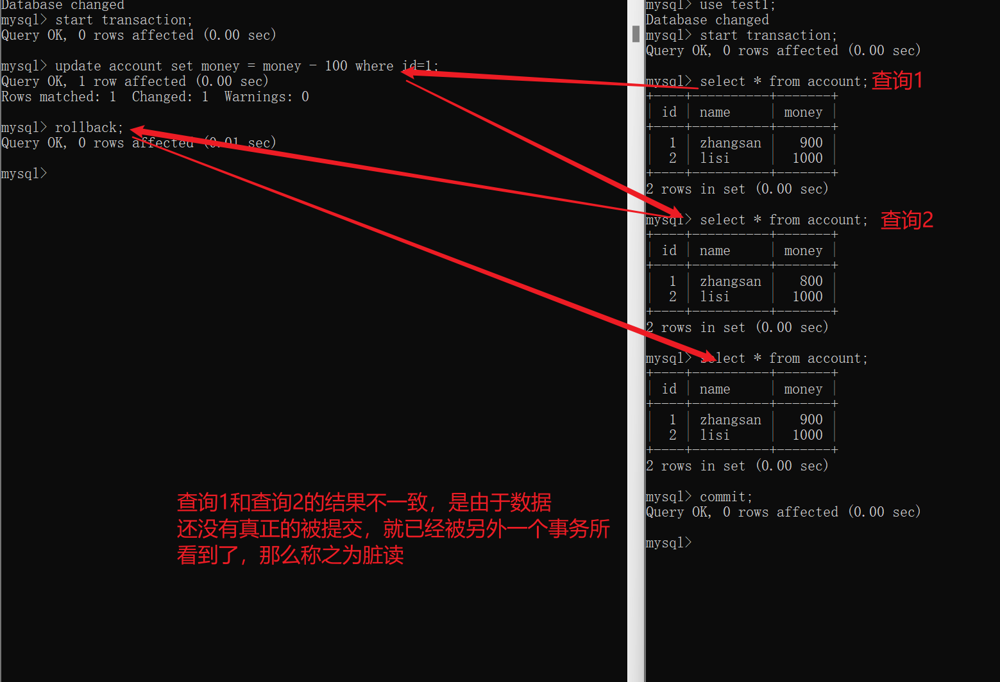

# 概念

事务指的是一组操作，要么全部成功，要么全部失败。注意：在之前的学习过程中，之前学习的sql语句无法保障多条sql语句同时成功，或者同时失败。如果你希望多条sql语句同时成功或者同时失败，那么就需要将多条sql语句放置在一个事务中？如何放置在一个事务中呢？

只需要将多条sql语句嵌于下面的这段代码中

```sql
start transaction; -------开启事务

sql语句1  

sql语句2

rollback/commit; ------------回滚事务或者提交事务
```

使用场景：

比如A和B之间进行转账。


# 事务隔离级别以及并发问题

数据库允许并发访问的，如果有多个事务同时去访问当前数据库，那么会不会有并发问题呢？

并发问题：脏读(一个事务读取到了另外一个事务未提交的数据)、不可重复读（一个事务读取到了另外一个事务中已经提交的数据）、虚幻读（前后两次读取的记录数不同，之前一次查询时9条数据，但是下一次查询变成了10条数据）

如何解决这些问题呢？对应的便是数据库的隔离级别，设置不同的隔离级别，可以减少对应的并发问题。

比如设置两个极端：一个是没有任何隔离效果，此时脏读、不可重复读、虚幻读都会发生；一个是不允许并发，那么任何问题都不会有。

大家在理解的时候可以对照着生活中的城市**的治安水平和犯罪率之间的关系**。如果治安很差，那么各种犯罪率都会发生；如果治安很严格，那么各种各样的犯罪率就会少很多，或者不会出现。

隔离级别就相当于治安一样，设置不同的隔离级别，会使得并发问题有的出现，有的不出现。

下面这个表格说的便是隔离级别和并发问题的对应关系。比如在read uncommitted隔离级别下，脏读、不可重复读、 虚幻读都会发生；调高隔离级别，那么便会阻止脏读的发生；


|                           | 脏读 | 不可重复读 | 虚幻读 |
| ------------------------- | ---- | ---------- | ------ |
| read uncommitted 读未提交 | √    | √          | √      |
| read committed 读已提交   |      | √          | √      |
| repeatable read 可重复读  |      |            | √      |
| serializable 串行化       |      |            |        |


脏读：

图中查询1和查询2前后两次查询的结果不一致，这种现象是由什么导致的呢？是由另外一个事务没有提交，出现的问题，叫做脏读。

一个事务还没提交呢，数据的更改就已经被另外一个事务看到了，导致另外一个事务前后两次查询的结果不一致。称之为脏读。


不可重复读：一个事务读取到了另外一个事务已经提交的数据。和脏读比较类似，只是脏读是另外一个事务没有提交，而不可重复读是另外一个事务已经提交。

图中查询1和查询3前后的结果不一致，那么我们称之为不可重复读。

一个事务提交了，数据的更改被另外一个事务所看到，导致了事务A提交前后进行了两次查询发现结果不一致。称之为不可重复读。

从事务B的角度出发，它是不知道脏读还是不可重复读的，只知道在一个事务中，进行了两次查询，结果不一致。而我们是站在分析问题的角度去出发，称他们为不同的情况。

换句话说，事务B的两次查询结果不一致，如果是由事务没有提交导致的，那么称之为脏读；如果是由事务提交导致的，那么称之为不可重复读。


虚幻读：一个事务在前后两次查询数据，发现数据的条目不对。比如之前是9条，现在变成了10条。


# 实操演示并发问题及隔离级别的关系

set session/global transaction isolation level read uncommitted.-------- 设置会话/全局的隔离级别


select @@transaction_isolation;   -------查看当前数据库的隔离级别


大家在操作的时候，开启两个cmd窗口，输入 mysql -u root -p进行连接数据库

set global transaction isolation level read uncommitted   ----- 设置全局的隔离级别，设置成功之后，建议退出exit mysql，重新再进入

exit

mysql -u root -p

select @@transaction_isolation;   -------此时通过这条语句来进行验证，此时可以发现，隔离级别由开始的repeatable read变成了read uncommitted

脏读：




不可重复读：


虚幻读：

在repeatable read隔离级别下，不会再有不可重复读的问题产生。按理来说，按照sql标准委员会制定的标准，此时在当前隔离级别下应该会有虚幻读的问题产生，但是mysql在设计的时候没有严格遵循该标准，所以在mysql的repeatable read隔离级别下基本不会有虚幻读的问题。


基本不会有虚幻读问题产生


